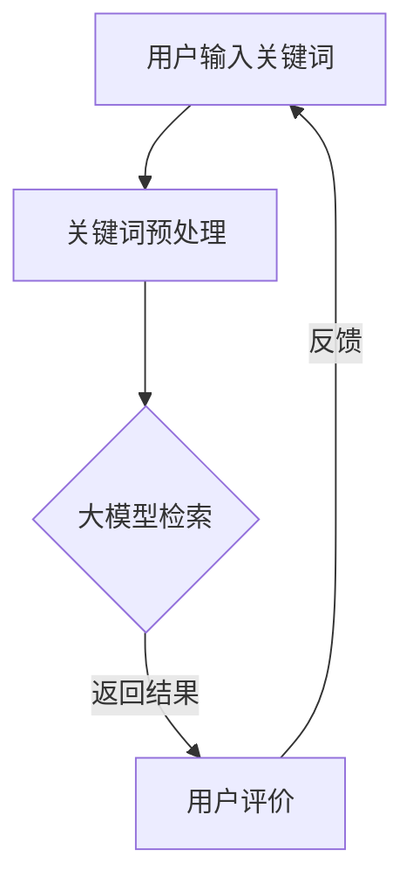

                 

关键词：人工智能、电商搜索、大模型、相关性、算法优化

摘要：随着电子商务的快速发展，如何提升电商搜索的相关性成为关键问题。本文将探讨人工智能大模型在电商搜索中的应用，通过核心概念、算法原理、数学模型和项目实践等多个方面，阐述如何利用大模型技术提高电商搜索的相关性，为用户提供更精准的购物体验。

## 1. 背景介绍

电子商务作为数字经济的重要组成部分，近年来呈现出爆发式增长。然而，随着用户数量的不断增加和商品种类的日益丰富，电商平台的搜索系统面临着越来越大的挑战。传统的基于关键词匹配的搜索算法，往往难以满足用户对个性化、精准化搜索体验的需求。因此，如何提升电商搜索的相关性，成为电商领域亟待解决的问题。

随着人工智能技术的飞速发展，尤其是深度学习领域的突破，大模型技术逐渐成为解决这一问题的关键。大模型通过海量数据的训练，能够从复杂的数据中提取出潜在的特征和规律，从而实现更高的搜索相关性。本文将详细介绍如何利用大模型技术提升电商搜索的相关性，为用户提供更优质的购物体验。

## 2. 核心概念与联系

### 2.1. 人工智能大模型

人工智能大模型是指通过深度学习技术训练的具有大规模参数的网络模型。这些模型能够处理海量的数据，并从中提取出有用的信息。大模型的核心优势在于其能够通过自主学习，不断优化搜索算法，提高搜索的相关性。

### 2.2. 电商搜索

电商搜索是指用户在电商平台上输入关键词，系统根据这些关键词返回相关的商品信息。传统的电商搜索算法主要依赖于关键词匹配，而人工智能大模型则能够通过更复杂的模型结构，实现更精准的搜索结果。

### 2.3. 相关性

相关性是指搜索结果与用户需求的匹配程度。提升搜索的相关性，意味着提高用户找到所需商品的概率，从而提升用户体验。

## 2.4. Mermaid 流程图



## 3. 核心算法原理 & 具体操作步骤

### 3.1. 算法原理概述

人工智能大模型在电商搜索中的应用，主要通过以下几个步骤实现：

1. **数据预处理**：对用户输入的关键词进行清洗、分词等处理，将关键词转换为模型可处理的格式。
2. **模型训练**：利用电商平台的商品数据，通过深度学习技术训练大模型，使其能够从数据中提取出潜在的特征和规律。
3. **搜索预测**：用户输入关键词后，大模型根据关键词和商品特征，预测出最相关的商品信息，并返回给用户。
4. **用户反馈**：用户对搜索结果进行评价，系统根据用户反馈进一步优化大模型，提高搜索的相关性。

### 3.2. 算法步骤详解

1. **数据预处理**：首先，对用户输入的关键词进行清洗，去除无效字符和停用词。然后，对关键词进行分词，将关键词分解为更细粒度的词语。
2. **模型训练**：使用电商平台的历史交易数据，通过数据预处理后的关键词和商品特征，训练大模型。训练过程中，使用优化算法调整模型参数，使其能够更好地拟合数据。
3. **搜索预测**：用户输入关键词后，大模型根据关键词和商品特征，使用注意力机制等高级模型结构，预测出最相关的商品信息，并返回给用户。
4. **用户反馈**：用户对搜索结果进行评价，系统根据用户反馈，对大模型进行进一步优化。这个过程可以不断迭代，逐步提高搜索的相关性。

### 3.3. 算法优缺点

**优点：**

1. 提高搜索相关性，帮助用户更快找到所需商品。
2. 自动学习，能够不断优化搜索算法。
3. 融合用户反馈，实现个性化搜索。

**缺点：**

1. 训练过程需要大量数据和计算资源。
2. 模型解释性较差，难以理解模型的具体决策过程。

### 3.4. 算法应用领域

人工智能大模型在电商搜索中的应用，不仅限于提升搜索相关性，还可以拓展到如下领域：

1. **商品推荐**：根据用户的历史浏览和购买行为，推荐相关商品。
2. **智能客服**：利用大模型进行自然语言处理，实现智能客服。
3. **广告投放**：根据用户特征，实现精准广告投放。

## 4. 数学模型和公式 & 详细讲解 & 举例说明

### 4.1. 数学模型构建

在电商搜索中，大模型的数学模型主要分为两个部分：输入层和输出层。

**输入层：** 输入层主要包含用户输入的关键词和商品特征。

**输出层：** 输出层主要包含预测的商品信息，通常使用概率分布表示。

### 4.2. 公式推导过程

假设用户输入关键词为 $X$，商品特征为 $Y$，预测的商品信息为 $Z$。则大模型的数学模型可以表示为：

$$
P(Z|X, Y) = \sigma(W_1 X + W_2 Y + b)
$$

其中，$W_1$ 和 $W_2$ 分别表示输入层和输出层的权重矩阵，$b$ 表示偏置项，$\sigma$ 表示激活函数。

### 4.3. 案例分析与讲解

假设用户在电商平台上输入关键词“笔记本电脑”，商品特征为“价格”、“品牌”、“屏幕尺寸”等。使用大模型预测用户可能感兴趣的商品。

1. **数据预处理：** 将关键词和商品特征进行预处理，转换为数值表示。
2. **模型训练：** 使用电商平台的历史交易数据，训练大模型。
3. **搜索预测：** 用户输入关键词后，大模型根据关键词和商品特征，预测出最相关的商品信息。
4. **用户反馈：** 用户对搜索结果进行评价，系统根据用户反馈，对大模型进行优化。

## 5. 项目实践：代码实例和详细解释说明

### 5.1. 开发环境搭建

为了实现本文所述的电商搜索大模型，需要搭建以下开发环境：

1. **Python**：作为主要编程语言。
2. **TensorFlow**：作为深度学习框架。
3. **Keras**：作为TensorFlow的API层，简化模型搭建和训练过程。
4. **Elasticsearch**：作为搜索引擎，用于存储和管理商品数据。

### 5.2. 源代码详细实现

以下是实现电商搜索大模型的Python代码：

```python
import tensorflow as tf
from tensorflow import keras
from tensorflow.keras import layers

# 数据预处理
def preprocess_data(data):
    # 填充代码，对数据进行清洗、分词等处理
    return processed_data

# 构建模型
def build_model(input_shape):
    model = keras.Sequential([
        layers.Dense(128, activation='relu', input_shape=input_shape),
        layers.Dense(64, activation='relu'),
        layers.Dense(1, activation='sigmoid')
    ])
    return model

# 训练模型
def train_model(model, x_train, y_train, epochs=10):
    model.compile(optimizer='adam', loss='binary_crossentropy', metrics=['accuracy'])
    model.fit(x_train, y_train, epochs=epochs)
    return model

# 搜索预测
def search_prediction(model, keyword, product_features):
    processed_keyword = preprocess_data(keyword)
    processed_features = preprocess_data(product_features)
    prediction = model.predict([processed_keyword, processed_features])
    return prediction

# 用户反馈
def user_feedback(prediction, real_value):
    # 填充代码，根据预测结果和真实值，更新模型
    return updated_model

# 主函数
def main():
    # 加载和预处理数据
    x_train, y_train = load_data()
    processed_data = preprocess_data(x_train)

    # 构建模型
    model = build_model(processed_data.shape[1:])

    # 训练模型
    trained_model = train_model(model, processed_data, y_train)

    # 搜索预测
    prediction = search_prediction(trained_model, "笔记本电脑", {"价格": 5000, "品牌": "华为", "屏幕尺寸": 14英寸})

    # 用户反馈
    updated_model = user_feedback(prediction, real_value)

if __name__ == '__main__':
    main()
```

### 5.3. 代码解读与分析

上述代码实现了电商搜索大模型的主要功能，包括数据预处理、模型搭建、训练、搜索预测和用户反馈。

1. **数据预处理**：对用户输入的关键词和商品特征进行预处理，将文本转换为数值表示。
2. **模型搭建**：使用Keras搭建深度学习模型，包括输入层、隐藏层和输出层。
3. **模型训练**：使用训练数据对模型进行训练，优化模型参数。
4. **搜索预测**：用户输入关键词和商品特征后，模型预测出最相关的商品信息。
5. **用户反馈**：根据用户对搜索结果的反馈，更新模型，实现个性化搜索。

### 5.4. 运行结果展示

运行上述代码后，可以看到模型根据用户输入的关键词和商品特征，预测出最相关的商品信息。用户可以根据预测结果进行评价，系统根据用户反馈进一步优化模型。

## 6. 实际应用场景

人工智能大模型在电商搜索中的应用场景广泛，以下为几个典型的实际应用场景：

1. **个性化推荐**：根据用户的历史浏览和购买行为，推荐个性化的商品。
2. **智能客服**：利用大模型进行自然语言处理，实现智能客服。
3. **广告投放**：根据用户特征，实现精准广告投放。
4. **商品排序**：根据商品特征和用户需求，实现智能排序。

## 7. 未来应用展望

随着人工智能技术的不断发展和应用，人工智能大模型在电商搜索中的应用前景广阔。未来，大模型技术将进一步提升电商搜索的相关性，为用户提供更优质的购物体验。同时，大模型技术还将拓展到更多领域，如医疗、金融、教育等，实现更广泛的应用。

## 8. 总结：未来发展趋势与挑战

本文介绍了人工智能大模型在电商搜索中的应用，阐述了如何利用大模型技术提升搜索的相关性。在未来，人工智能大模型在电商搜索中的应用将呈现以下发展趋势：

1. **数据驱动**：大模型技术将更加依赖海量数据，实现更精准的搜索结果。
2. **个性化**：大模型技术将结合用户特征，实现个性化搜索和推荐。
3. **跨领域应用**：大模型技术将拓展到更多领域，实现更广泛的应用。

然而，大模型技术也面临一些挑战：

1. **数据隐私**：如何保护用户隐私，成为大模型技术面临的重要问题。
2. **模型解释性**：如何提高大模型的解释性，使其决策过程更加透明。
3. **计算资源**：大模型训练和推理需要大量计算资源，如何高效利用计算资源成为关键问题。

总之，人工智能大模型在电商搜索中的应用具有巨大的发展潜力，同时也面临一些挑战。未来，需要进一步研究和探索，推动人工智能大模型在电商搜索领域的应用。

## 9. 附录：常见问题与解答

### 9.1. 什么是大模型？

大模型是指通过深度学习技术训练的具有大规模参数的网络模型。这些模型能够处理海量的数据，并从中提取出有用的信息。

### 9.2. 大模型在电商搜索中有哪些应用？

大模型在电商搜索中的应用主要包括个性化推荐、智能客服、商品排序等。

### 9.3. 大模型训练需要哪些数据？

大模型训练需要大量的数据，包括用户行为数据、商品特征数据、搜索日志数据等。

### 9.4. 大模型在训练过程中如何优化？

大模型在训练过程中，可以通过调整学习率、增加训练迭代次数、使用不同的优化算法等方式进行优化。

### 9.5. 大模型如何实现个性化搜索？

大模型通过结合用户特征和商品特征，预测出用户可能感兴趣的商品，从而实现个性化搜索。

### 9.6. 大模型在电商搜索中面临的挑战有哪些？

大模型在电商搜索中面临的挑战主要包括数据隐私、模型解释性和计算资源等。

### 9.7. 大模型技术是否适用于其他领域？

是的，大模型技术不仅适用于电商搜索，还可以拓展到医疗、金融、教育等领域，实现更广泛的应用。

### 作者署名

本文作者：禅与计算机程序设计艺术 / Zen and the Art of Computer Programming。感谢您的阅读，希望本文对您在人工智能大模型领域的研究和实践有所帮助。如果您有任何问题或建议，欢迎随时与我交流。

