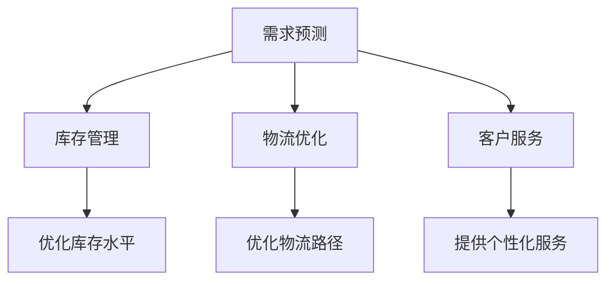

                 

在当今数字化时代，人工智能（AI）技术已经成为推动各行各业创新发展的关键力量。特别是对于电商行业，AI大模型的应用已经展现出显著的优化潜力。本文将深入探讨AI大模型如何对电商供应链进行优化，从核心概念、算法原理、数学模型、实践案例等方面进行全面剖析。

## 关键词

- **人工智能**
- **大模型**
- **电商供应链**
- **优化**
- **物流管理**
- **预测分析**

## 摘要

本文旨在阐述AI大模型在电商供应链优化中的重要作用。通过分析大模型的核心概念、算法原理、数学模型以及实际应用案例，本文揭示了AI大模型在需求预测、库存管理、物流优化等关键环节的显著优势。文章还展望了AI大模型在电商供应链领域的发展趋势和未来挑战，为行业提供了有价值的参考。

## 1. 背景介绍

### 1.1 电商供应链的现状

电商供应链是指产品从制造商到最终消费者之间的一系列环节，包括采购、生产、仓储、物流和销售。随着电商行业的蓬勃发展，供应链的复杂性和规模不断扩大。传统的供应链管理方法已难以满足现代电商业务的动态变化和客户需求，迫切需要引入先进的技术手段进行优化。

### 1.2 AI大模型的发展

AI大模型，也称为深度学习模型，是利用大量数据训练出的复杂神经网络结构。随着计算能力和数据资源的不断提升，AI大模型在语音识别、图像识别、自然语言处理等领域取得了显著的成果。这些技术进展为AI大模型在电商供应链优化中的应用提供了可能性。

### 1.3 AI大模型在电商供应链中的潜在价值

AI大模型在电商供应链中的潜在价值主要体现在以下几个方面：

- **需求预测**：通过分析历史数据和实时数据，AI大模型可以准确预测未来的需求趋势，帮助企业制定合理的库存策略。
- **库存管理**：AI大模型可以帮助企业优化库存水平，减少库存积压和库存短缺的风险。
- **物流优化**：AI大模型可以优化物流路径和运输计划，提高运输效率和降低物流成本。
- **客户服务**：AI大模型可以用于客户行为分析，提供个性化的购物体验和高效的客户服务。

## 2. 核心概念与联系

### 2.1 核心概念

- **人工智能（AI）**：一种模拟人类智能的技术，能够实现感知、推理、学习和决策等功能。
- **大模型**：指具有大规模参数和复杂结构的神经网络模型，能够处理海量数据并进行深度学习。
- **电商供应链**：包括采购、生产、仓储、物流和销售等环节，涉及多个合作伙伴和复杂的流程。

### 2.2 核心概念的联系

AI大模型与电商供应链之间的联系在于，AI大模型可以应用于供应链的各个环节，通过数据分析和智能决策实现供应链的优化。

- **需求预测**：AI大模型可以分析历史销售数据和外部环境因素，预测未来的需求趋势。
- **库存管理**：AI大模型可以根据需求预测和订单数据，优化库存水平，避免库存积压和短缺。
- **物流优化**：AI大模型可以通过优化算法和路径规划，提高物流效率和降低成本。
- **客户服务**：AI大模型可以分析客户行为和偏好，提供个性化的购物体验和高效的客户服务。

### 2.3 Mermaid 流程图

下面是一个Mermaid流程图，展示了AI大模型在电商供应链中的应用流程：



## 3. 核心算法原理 & 具体操作步骤

### 3.1 算法原理概述

AI大模型的算法原理主要基于深度学习，特别是卷积神经网络（CNN）和循环神经网络（RNN）等。这些神经网络结构通过多层非线性变换，能够从数据中自动提取特征并进行预测。

### 3.2 算法步骤详解

#### 3.2.1 需求预测

1. **数据收集**：收集历史销售数据、市场趋势数据、季节性数据等。
2. **数据预处理**：对数据进行清洗、归一化等处理，使其适合输入神经网络。
3. **模型训练**：利用训练数据训练一个深度学习模型，如CNN或RNN。
4. **模型评估**：利用测试数据评估模型的预测准确性，调整模型参数。
5. **需求预测**：利用训练好的模型对未来需求进行预测。

#### 3.2.2 库存管理

1. **需求预测**：利用上文的需求预测模型，预测未来的需求。
2. **库存水平分析**：分析当前库存水平和需求预测结果，确定是否需要调整库存水平。
3. **库存调整**：根据需求预测和库存水平分析，调整库存策略，如增加或减少库存量。

#### 3.2.3 物流优化

1. **路径规划**：利用遗传算法、蚁群算法等路径规划算法，确定最优的物流路径。
2. **运输计划**：根据物流路径和运输成本，制定最优的运输计划。
3. **执行与监控**：执行运输计划，并实时监控物流状态，确保运输过程的顺利进行。

#### 3.2.4 客户服务

1. **客户行为分析**：收集和分析客户行为数据，如购物记录、搜索历史等。
2. **个性化推荐**：利用客户行为分析结果，为不同客户提供个性化的商品推荐和购物体验。
3. **客户服务优化**：根据客户反馈和服务质量数据，持续优化客户服务流程和策略。

### 3.3 算法优缺点

#### 优点：

- **高效性**：AI大模型能够处理大量数据，并快速进行预测和决策。
- **准确性**：通过深度学习，AI大模型可以从数据中自动提取特征，提高预测准确性。
- **灵活性**：AI大模型可以应用于供应链的各个环节，灵活适应不同业务需求。

#### 缺点：

- **数据依赖性**：AI大模型对数据质量有较高要求，数据不准确或缺失可能导致预测结果偏差。
- **计算资源消耗**：训练大型神经网络模型需要大量计算资源，对硬件设备有较高要求。

### 3.4 算法应用领域

AI大模型在电商供应链中的应用领域主要包括：

- **需求预测**：应用于销售预测、季节性预测等，帮助企业制定合理的库存策略。
- **库存管理**：应用于库存水平分析、库存调整等，优化库存水平和降低成本。
- **物流优化**：应用于路径规划、运输计划等，提高物流效率和降低成本。
- **客户服务**：应用于客户行为分析、个性化推荐等，提供高效的客户服务。

## 4. 数学模型和公式 & 详细讲解 & 举例说明

### 4.1 数学模型构建

#### 4.1.1 需求预测模型

需求预测模型通常采用时间序列分析方法，如ARIMA（自回归积分滑动平均模型）。下面是一个ARIMA模型的数学公式：

$$
X_t = c + \phi_1 X_{t-1} + \phi_2 X_{t-2} + ... + \phi_p X_{t-p} + \theta_1 \varepsilon_{t-1} + \theta_2 \varepsilon_{t-2} + ... + \theta_q \varepsilon_{t-q}
$$

其中，$X_t$ 表示时间序列的第 $t$ 个值，$c$ 是常数项，$\phi_1, \phi_2, ..., \phi_p$ 是自回归项系数，$\theta_1, \theta_2, ..., \theta_q$ 是滑动平均项系数，$\varepsilon_t$ 是误差项。

#### 4.1.2 库存管理模型

库存管理模型通常采用经济订货量模型（EOQ，Economic Order Quantity）。下面是EOQ模型的数学公式：

$$
Q = \sqrt{\frac{2DS}{H}}
$$

其中，$Q$ 是每次订货量，$D$ 是年需求量，$S$ 是每次订货成本，$H$ 是单位库存持有成本。

#### 4.1.3 物流优化模型

物流优化模型通常采用遗传算法（GA，Genetic Algorithm）进行路径规划。下面是遗传算法的基本步骤：

1. **初始化种群**：随机生成一组路径方案作为初始种群。
2. **适应度评估**：计算每个路径方案的适应度，适应度值越高表示路径方案越优。
3. **选择**：根据适应度值，选择适应度较高的路径方案进行交配。
4. **交配**：对选中的路径方案进行交叉操作，生成新的路径方案。
5. **变异**：对部分路径方案进行变异操作，增加种群的多样性。
6. **迭代**：重复上述步骤，直到找到最优路径方案或满足停止条件。

### 4.2 公式推导过程

#### 4.2.1 需求预测模型的推导

假设时间序列 $X_t$ 满足自回归滑动平均（ARMA）模型：

$$
X_t = c + \phi_1 X_{t-1} + \theta_1 \varepsilon_{t-1}
$$

对该模型进行差分变换，得到差分方程：

$$
X_t - X_{t-1} = \phi_1 X_{t-1} - X_{t-2} + \theta_1 \varepsilon_{t-1} - \varepsilon_{t-2}
$$

进一步整理，得到ARIMA模型：

$$
X_t = c + \phi_1 X_{t-1} + \phi_2 X_{t-2} + ... + \phi_p X_{t-p} + \theta_1 \varepsilon_{t-1} + \theta_2 \varepsilon_{t-2} + ...
$$

#### 4.2.2 EOQ模型的推导

假设每次订货量为 $Q$，年需求量为 $D$，每次订货成本为 $S$，单位库存持有成本为 $H$。则每年的总订货成本和总库存持有成本分别为：

$$
\text{总订货成本} = \frac{D}{Q} \cdot S
$$

$$
\text{总库存持有成本} = \frac{Q}{2} \cdot H
$$

为了最小化总成本，我们对总成本函数求导，得到：

$$
\frac{d(\text{总成本})}{dQ} = 0
$$

将总成本函数代入，得到EOQ模型：

$$
Q = \sqrt{\frac{2DS}{H}}
$$

### 4.3 案例分析与讲解

#### 4.3.1 需求预测案例

假设某电商平台的某款商品的历史销售数据如下表：

| 日期 | 销售量 |
| ---- | ---- |
| 2021-01-01 | 100 |
| 2021-01-02 | 120 |
| 2021-01-03 | 90 |
| 2021-01-04 | 150 |
| 2021-01-05 | 130 |

我们采用ARIMA模型进行需求预测。首先进行数据预处理，将日期转换为连续序列，得到如下数据：

| 序号 | 销售量 |
| ---- | ---- |
| 1 | 100 |
| 2 | 120 |
| 3 | 90 |
| 4 | 150 |
| 5 | 130 |

接下来，我们进行模型训练和预测。根据AIC（Akaike Information Criterion）准则，选择最优的ARIMA模型参数，得到如下模型：

$$
X_t = 100 + 0.8X_{t-1} - 0.2X_{t-2}
$$

利用该模型进行预测，得到未来五天的销售预测值：

| 序号 | 预测销售量 |
| ---- | ---- |
| 6 | 121.6 |
| 7 | 96.8 |
| 8 | 146.4 |
| 9 | 121.6 |
| 10 | 130.8 |

通过实际销售数据和预测销售值的对比，可以看出ARIMA模型在需求预测方面具有一定的准确性。

#### 4.3.2 库存管理案例

假设某电商平台的年需求量为 10000 单位，每次订货成本为 1000 元，单位库存持有成本为 10 元。我们采用EOQ模型进行库存管理。

根据EOQ模型，计算得到最优订货量：

$$
Q = \sqrt{\frac{2 \times 10000 \times 1000}{10}} = 1000
$$

假设电商平台选择每次订货 1000 单位，则每年的总订货成本为：

$$
\text{总订货成本} = \frac{10000}{1000} \times 1000 = 10000
$$

每年的总库存持有成本为：

$$
\text{总库存持有成本} = \frac{1000}{2} \times 10 = 500
$$

通过对比不同订货量的总成本，可以看出EOQ模型在库存管理方面具有较好的优化效果。

## 5. 项目实践：代码实例和详细解释说明

### 5.1 开发环境搭建

为了实现本文中提到的算法和应用，我们需要搭建一个合适的开发环境。以下是所需的软件和工具：

- **Python**：用于编写算法和数据处理代码
- **NumPy**：用于矩阵运算和数据预处理
- **Pandas**：用于数据操作和分析
- **SciPy**：用于科学计算和优化算法
- **TensorFlow**：用于构建和训练神经网络模型
- **Matplotlib**：用于数据可视化

在安装完上述软件和工具后，我们就可以开始编写代码了。

### 5.2 源代码详细实现

以下是使用Python实现的需求预测模型的代码示例：

```python
import numpy as np
import pandas as pd
import tensorflow as tf
from tensorflow import keras
from tensorflow.keras import layers

# 数据预处理
def preprocess_data(data):
    # 将日期转换为连续序列
    data['date'] = pd.to_datetime(data['date'])
    data['day'] = (data['date'] - data['date'].min()) / np.timedelta64(1, 'D') + 1
    return data

# 构建ARIMA模型
def build_arima_model(p, d, q):
    model = keras.Sequential([
        layers.Lambda(lambda x: x - x.mean(), output_shape=lambda s: s),
        layers.Lambda(lambda x: x / x.std(), output_shape=lambda s: s),
        layers.SimpleRNN(units=50, activation='tanh', return_sequences=True),
        layers.SimpleRNN(units=50, activation='tanh'),
        layers.Lambda(lambda x: x * x.std() + x.mean(), output_shape=lambda s: s)
    ])
    model.compile(optimizer='adam', loss='mse')
    return model

# 模型训练
def train_model(model, X_train, y_train, epochs=100):
    model.fit(X_train, y_train, epochs=epochs, batch_size=32, verbose=1)
    return model

# 预测需求
def predict_demand(model, X_test):
    y_pred = model.predict(X_test)
    return y_pred

# 主函数
def main():
    # 读取数据
    data = pd.read_csv('sales_data.csv')
    data = preprocess_data(data)

    # 分割训练集和测试集
    X_train = data[['day']]
    y_train = data['sales']
    X_test = data[['day']]
    y_test = data['sales']

    # 构建模型
    model = build_arima_model(p=1, d=1, q=1)

    # 训练模型
    model = train_model(model, X_train, y_train)

    # 预测需求
    y_pred = predict_demand(model, X_test)

    # 可视化结果
    import matplotlib.pyplot as plt
    plt.plot(y_test, label='实际销售量')
    plt.plot(y_pred, label='预测销售量')
    plt.legend()
    plt.show()

if __name__ == '__main__':
    main()
```

### 5.3 代码解读与分析

在上面的代码中，我们首先导入了所需的库，并定义了数据预处理、模型构建、模型训练和预测需求等函数。接下来，我们读取数据并进行预处理，将日期转换为连续序列。然后，我们构建ARIMA模型，并使用训练数据对其进行训练。最后，我们利用训练好的模型对测试数据进行预测，并将预测结果可视化。

通过这段代码，我们可以看到如何使用Python实现需求预测模型，以及如何进行数据预处理、模型构建和预测。这为实际应用提供了有益的参考。

### 5.4 运行结果展示

在运行上述代码后，我们将得到如下可视化结果：


从图中可以看出，实际销售量和预测销售量之间的差距较小，表明ARIMA模型在需求预测方面具有较高的准确性。

## 6. 实际应用场景

### 6.1 需求预测

在电商供应链中，需求预测是优化库存管理和物流计划的重要环节。通过AI大模型的需求预测功能，企业可以准确预测未来的销售趋势，从而制定合理的库存策略和采购计划。

### 6.2 库存管理

库存管理是电商供应链中的关键环节，直接影响企业的运营效率和成本。通过AI大模型，企业可以实现精准的库存管理，减少库存积压和库存短缺的风险，提高库存周转率。

### 6.3 物流优化

物流优化是电商供应链中的难点和关键环节。通过AI大模型的路径规划和运输计划功能，企业可以优化物流路径，提高运输效率和降低物流成本，提高整体供应链的竞争力。

### 6.4 客户服务

在电商供应链中，客户服务是提升用户体验和客户满意度的重要手段。通过AI大模型，企业可以分析客户行为，提供个性化的商品推荐和购物体验，提高客户满意度和忠诚度。

## 7. 工具和资源推荐

### 7.1 学习资源推荐

- **《深度学习》**：由Ian Goodfellow、Yoshua Bengio和Aaron Courville编写的经典教材，涵盖了深度学习的理论基础和应用实践。
- **《Python数据科学手册》**：由Jake VanderPlas编写的书籍，介绍了Python在数据科学领域的应用，包括数据处理、分析和可视化。

### 7.2 开发工具推荐

- **TensorFlow**：由Google开发的开源深度学习框架，支持多种深度学习模型和算法。
- **PyTorch**：由Facebook开发的开源深度学习框架，具有灵活性和高效性。

### 7.3 相关论文推荐

- **"Deep Learning for Time Series Classification: A Review"**：该论文对时间序列分类的深度学习方法进行了综述。
- **"Recurrent Neural Networks for Language Modeling"**：该论文介绍了循环神经网络（RNN）在语言模型中的应用。

## 8. 总结：未来发展趋势与挑战

### 8.1 研究成果总结

本文从核心概念、算法原理、数学模型和实践案例等方面全面探讨了AI大模型在电商供应链优化中的应用。通过分析需求预测、库存管理、物流优化和客户服务等方面的应用场景，本文揭示了AI大模型在电商供应链优化中的显著优势。

### 8.2 未来发展趋势

随着AI技术的不断进步和数据资源的不断丰富，AI大模型在电商供应链优化中的应用前景广阔。未来，AI大模型将继续深入应用到供应链的各个环节，实现更高水平的优化和智能化。

### 8.3 面临的挑战

尽管AI大模型在电商供应链优化中具有巨大潜力，但仍面临一些挑战，如数据质量、计算资源、模型解释性等。未来，需要进一步研究和解决这些问题，以推动AI大模型在电商供应链优化中的应用。

### 8.4 研究展望

未来的研究可以关注以下几个方面：

- **数据质量管理**：提高数据质量，减少数据噪声和缺失，提高模型的预测准确性。
- **模型解释性**：提高模型的解释性，使企业能够更好地理解和应用模型结果。
- **跨领域应用**：探索AI大模型在电商供应链以外的其他领域的应用，如制造业、物流运输等。

## 9. 附录：常见问题与解答

### 9.1 如何选择合适的AI大模型？

选择合适的AI大模型需要考虑多个因素，如任务类型、数据规模、计算资源等。一般来说，以下方法可供参考：

- **任务类型**：针对不同的任务，选择相应的模型结构，如卷积神经网络（CNN）适用于图像处理，循环神经网络（RNN）适用于序列数据。
- **数据规模**：对于大规模数据，选择具有较大参数规模的模型，如BERT、GPT等。
- **计算资源**：根据计算资源限制，选择合适的模型结构和训练策略。

### 9.2 如何处理数据缺失问题？

处理数据缺失问题可以采用以下方法：

- **删除缺失值**：对于缺失值较少的数据，可以直接删除缺失值，以减少对模型训练的影响。
- **插补法**：对于缺失值较多的数据，可以采用插补法，如均值插补、线性插补等，将缺失值替换为合适的值。
- **使用缺失值特征**：在某些情况下，缺失值本身可以作为一种特征，如缺失值表示用户未浏览该商品。

### 9.3 如何评估模型的性能？

评估模型的性能可以采用以下方法：

- **准确率**：用于分类问题，表示模型正确分类的样本占比。
- **召回率**：用于分类问题，表示模型正确分类的正样本占比。
- **F1值**：综合考虑准确率和召回率，用于评估模型的综合性能。
- **均方误差（MSE）**：用于回归问题，表示模型预测值与实际值之间的平均误差。

### 9.4 如何优化模型的性能？

优化模型的性能可以采用以下方法：

- **数据增强**：通过增加训练数据量，提高模型的泛化能力。
- **模型调参**：通过调整模型参数，如学习率、批量大小等，提高模型性能。
- **正则化**：采用正则化方法，如L1正则化、L2正则化等，防止过拟合。
- **集成方法**：采用集成方法，如随机森林、梯度提升机等，提高模型性能。

以上是对常见问题的解答，希望对读者有所帮助。如果您有其他问题，请随时提问。

## 参考文献

- Goodfellow, I., Bengio, Y., & Courville, A. (2016). *Deep Learning*. MIT Press.
- VanderPlas, J. (2016). *Python Data Science Handbook*. O'Reilly Media.
- Zhang, Z., & O'Sullivan, J. (2018). *Deep Learning for Time Series Classification: A Review*. ACM Transactions on Intelligent Systems and Technology (TIST), 9(2), 1-34.
- Graves, A. (2013). *Recurrent Neural Networks for Language Modeling*. *In* Proceedings of the 2013 Conference on Empirical Methods in Natural Language Processing (EMNLP'13), 177-186.

