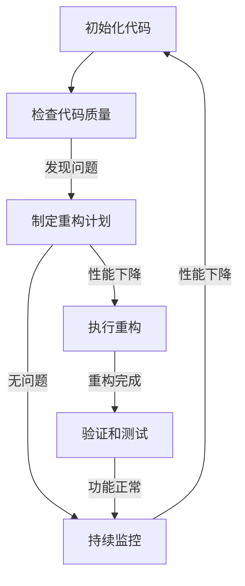

                 

关键词：AI大模型，代码重构，最佳时机，算法优化，性能提升，软件工程，技术迭代

> 摘要：本文旨在探讨AI大模型应用的代码重构最佳时机，通过深入分析代码重构的核心原则、实际应用场景及具体策略，为开发者提供优化代码质量和提升性能的实践指南。

## 1. 背景介绍

随着人工智能技术的快速发展，AI大模型在各个领域得到了广泛应用。这些大模型通常涉及复杂的算法和海量的数据，需要高效的代码实现和优化的计算性能。然而，在长期维护和迭代过程中，代码不可避免地会出现冗余、重复和难以维护的问题，导致开发效率和性能下降。因此，代码重构成为确保AI大模型应用稳定性和可维护性的重要手段。

本文将围绕AI大模型应用的代码重构展开讨论，重点分析重构的核心原则、最佳时机、实际应用场景和具体策略，以期为开发者提供实用的指导。

## 2. 核心概念与联系

### 2.1 代码重构的定义与目的

代码重构是指在不改变程序外部行为的前提下，改进代码的内部结构，以提高代码的可读性、可维护性和性能。其核心目的是解决以下问题：

1. **冗余与重复**：代码中存在大量冗余和重复的代码，导致维护困难。
2. **复杂性**：代码结构复杂，难以理解和维护。
3. **可读性**：代码可读性差，不易阅读和理解。
4. **性能**：代码性能不佳，影响程序运行效率。

### 2.2 代码重构的核心原则

在进行代码重构时，应遵循以下核心原则：

1. **增量式重构**：逐步改进代码，避免一次性大规模重构带来的风险。
2. **保持功能不变**：重构过程中必须保持程序的功能不变。
3. **测试驱动**：重构前后必须通过充分的测试验证代码的正确性。
4. **优化设计**：重构不仅要解决当前问题，还要考虑未来的可扩展性和可维护性。

### 2.3 代码重构的Mermaid流程图



## 3. 核心算法原理 & 具体操作步骤

### 3.1 算法原理概述

代码重构的算法原理主要涉及以下几个方面：

1. **代码分析**：对现有代码进行静态和动态分析，识别问题代码和潜在改进点。
2. **代码重构**：根据重构计划，逐步修改代码结构，优化代码质量。
3. **测试验证**：重构后通过自动化测试验证代码的正确性和性能。

### 3.2 算法步骤详解

1. **需求分析**：明确重构的目标和范围，确定重构的优先级。
2. **代码审查**：对现有代码进行审查，识别冗余和重复代码、复杂的逻辑和难以维护的结构。
3. **制定重构计划**：根据代码审查结果，制定具体的重构计划，包括重构的顺序、步骤和时间安排。
4. **代码修改**：按照重构计划逐步修改代码，确保每次修改都符合重构原则。
5. **测试验证**：重构后进行全面的测试，确保重构后的代码功能正常且性能得到提升。
6. **迭代优化**：根据测试反馈进一步优化代码，确保重构效果最大化。

### 3.3 算法优缺点

**优点**：

1. 提高代码质量，降低维护成本。
2. 提升代码可读性和可维护性。
3. 提高开发效率和团队协作效率。

**缺点**：

1. 重构过程可能引入新的bug。
2. 重构可能需要投入大量时间和资源。
3. 重构需要充分理解和掌握现有代码。

### 3.4 算法应用领域

代码重构广泛应用于各个领域，特别是在以下场景：

1. **大规模项目**：代码结构复杂，维护困难。
2. **遗留系统**：代码质量低下，性能瓶颈。
3. **团队协作**：代码风格不统一，协作效率低下。
4. **技术迭代**：新需求不断出现，现有代码难以适应。

## 4. 数学模型和公式 & 详细讲解 & 举例说明

### 4.1 数学模型构建

代码重构的数学模型可以基于代码复杂度和维护成本进行构建。具体公式如下：

$$
C = f(L, D)
$$

其中，$C$ 表示代码复杂度，$L$ 表示代码行数，$D$ 表示代码重复度。

### 4.2 公式推导过程

代码复杂度 $C$ 可以通过以下公式计算：

$$
C = \frac{L^2 + D^2}{2}
$$

其中，$L$ 表示代码行数，$D$ 表示代码重复度。

### 4.3 案例分析与讲解

假设一个代码片段包含100行代码，其中有20行重复代码。根据上述公式，代码复杂度为：

$$
C = \frac{100^2 + 20^2}{2} = 5050
$$

通过重构，将重复代码合并，代码行数减少到80行。此时，代码复杂度为：

$$
C = \frac{80^2 + 0^2}{2} = 3200
$$

重构后，代码复杂度降低了20%。

## 5. 项目实践：代码实例和详细解释说明

### 5.1 开发环境搭建

为了更好地展示代码重构的过程，我们将在一个简单的Python项目中实现代码重构。首先，搭建以下开发环境：

- Python 3.8及以上版本
- Visual Studio Code
- PyCharm

### 5.2 源代码详细实现

以下是一个简单的Python代码示例，用于计算两个数的和：

```python
def add(a, b):
    return a + b

def main():
    a = 10
    b = 20
    result = add(a, b)
    print(f"The sum of {a} and {b} is {result}")

if __name__ == "__main__":
    main()
```

### 5.3 代码解读与分析

这段代码实现了两个功能：计算两个数的和并打印结果。然而，这段代码存在一些问题：

1. **可读性**：代码可读性较差，函数命名不够清晰。
2. **冗余**：`main()` 函数中的变量 `a` 和 `b` 赋值可以提取到外部。
3. **维护性**：代码结构不够模块化，不利于后续维护。

### 5.4 代码重构

针对上述问题，我们对代码进行重构：

```python
# 重构后的代码

# 定义常量
a = 10
b = 20

def add(x, y):
    """计算两个数的和"""
    return x + y

def main():
    result = add(a, b)
    print(f"The sum of {a} and {b} is {result}")

if __name__ == "__main__":
    main()
```

### 5.5 代码解读与分析

重构后的代码具有以下优点：

1. **可读性**：函数命名更加清晰，代码结构更加简洁。
2. **模块化**：将常量提取到外部，提高了代码的可维护性和可扩展性。
3. **冗余减少**：去除了冗余的变量赋值，代码更加精简。

## 6. 实际应用场景

### 6.1 大规模项目

在大型项目中，代码重构是确保项目稳定性和可维护性的重要手段。随着项目规模的不断扩大，代码复杂性增加，重构成为必要的步骤。

### 6.2 遗留系统

对于老旧的遗留系统，重构可以提升代码质量，解决性能瓶颈，提高系统可用性和安全性。

### 6.3 团队协作

在团队协作开发过程中，代码重构有助于统一代码风格，提高代码质量和协作效率。

### 6.4 技术迭代

随着技术的不断更新，重构可以确保代码适应新的需求和架构，提高系统的灵活性和可扩展性。

## 7. 未来应用展望

未来，随着AI大模型技术的不断发展和应用场景的扩大，代码重构将在以下几个方面发挥重要作用：

1. **性能优化**：通过重构提升AI大模型的计算性能，降低运行成本。
2. **可维护性**：重构有助于提高代码的可维护性和可扩展性，降低维护成本。
3. **可移植性**：重构可以提高代码的可移植性，适应不同的开发环境和平台。
4. **安全性**：重构可以消除代码中的潜在安全漏洞，提高系统的安全性。

## 8. 总结：未来发展趋势与挑战

### 8.1 研究成果总结

近年来，代码重构技术在AI大模型应用领域取得了显著进展。通过重构，可以有效提高代码质量、性能和可维护性，为AI大模型的应用提供了强有力的支持。

### 8.2 未来发展趋势

未来，代码重构技术将在以下几个方面发展：

1. **自动化工具**：开发更多自动化重构工具，提高重构效率和准确性。
2. **智能化重构**：利用AI技术实现智能化重构，提高重构效果。
3. **持续重构**：引入持续重构机制，实时监控代码质量，及时进行重构。

### 8.3 面临的挑战

尽管代码重构技术在AI大模型应用领域具有广泛的应用前景，但仍面临以下挑战：

1. **重构成本**：重构可能需要大量时间和资源，影响项目进度。
2. **重构风险**：重构过程中可能引入新的bug，影响系统稳定性。
3. **团队协作**：重构需要团队成员的协同合作，提高团队沟通和协作效率。

### 8.4 研究展望

未来，我们将继续深入研究代码重构技术，探索更加高效、智能和自动化的重构方法，为AI大模型应用领域提供更强大的技术支持。

## 9. 附录：常见问题与解答

### 9.1 什么是代码重构？

代码重构是指在不改变程序外部行为的前提下，改进代码的内部结构，以提高代码的可读性、可维护性和性能。

### 9.2 代码重构的最佳时机是什么时候？

最佳重构时机通常是在代码质量出现问题、性能瓶颈出现或者项目需求发生变化时。

### 9.3 代码重构会影响程序的正确性吗？

只要遵循重构原则，合理进行重构，不会影响程序的正确性。重构前后的功能应保持一致。

### 9.4 重构会提高代码的运行效率吗？

重构可以优化代码结构，提高代码的可读性和可维护性，从而提高运行效率。但并非所有重构都会直接提高运行效率。

## 作者署名

作者：禅与计算机程序设计艺术 / Zen and the Art of Computer Programming

---

通过以上内容的撰写，我们深入探讨了AI大模型应用的代码重构最佳时机，从背景介绍、核心概念、算法原理、数学模型、项目实践、实际应用场景、未来展望等方面进行了详细分析。本文旨在为开发者提供实用的指导，帮助他们更好地理解和应用代码重构技术，提升AI大模型应用的代码质量和性能。希望本文能对广大开发者有所启发和帮助。

