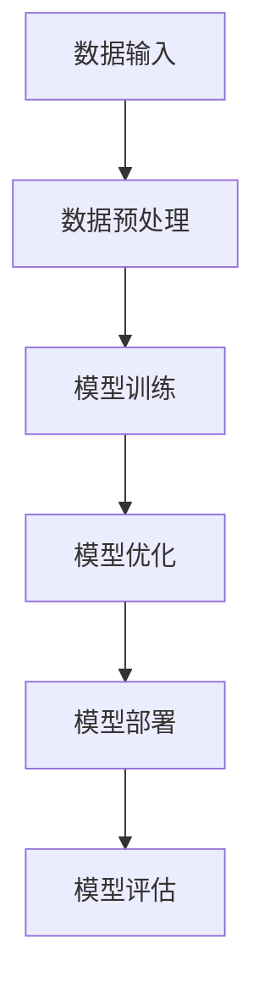

                 

 关键词：
- AI大模型
- 应用场景
- 创业机会
- 技术挑战
- 未来发展趋势

摘要：
本文旨在探讨AI大模型在现代科技领域的广泛应用及其带来的创业机会和面临的挑战。通过对核心概念、算法原理、数学模型、实际应用案例的深入分析，我们将探讨大模型技术如何驱动创新，并预测其未来发展趋势。

## 1. 背景介绍

随着人工智能技术的迅猛发展，AI大模型（如GPT、BERT、Transformer等）已成为现代计算机科学领域的热点。这些大模型通过深度学习和神经网络技术，能够处理海量数据，自动学习并优化复杂的任务，从而在自然语言处理、计算机视觉、语音识别等领域取得了显著突破。

AI大模型的崛起不仅改变了传统行业的工作方式，也为创业者提供了前所未有的机会。然而，随着技术的进步，AI大模型应用也面临一系列挑战，包括数据隐私、计算资源、算法透明性和解释性等。

### 1.1 市场需求

随着数字化转型加速，企业和消费者对智能化的需求日益增长。例如，在客户服务领域，AI大模型可以实现自然语言理解，为用户提供个性化的服务；在医疗领域，AI大模型可以帮助医生进行疾病诊断和个性化治疗。

### 1.2 技术进步

深度学习算法的突破和计算能力的提升，使得AI大模型在训练和推理方面取得了显著进步。例如，GPT-3模型能够生成高质量的文本，Transformer架构在计算机视觉任务中表现优异。

## 2. 核心概念与联系

### 2.1 AI大模型原理

AI大模型主要基于深度学习技术，包括神经网络、循环神经网络（RNN）、卷积神经网络（CNN）等。这些模型通过多层神经网络结构，能够自动提取数据特征，实现复杂的任务。

### 2.2 Mermaid流程图



### 2.3 大模型应用场景

AI大模型广泛应用于多个领域，包括自然语言处理、计算机视觉、语音识别、推荐系统等。

## 3. 核心算法原理 & 具体操作步骤

### 3.1 算法原理概述

AI大模型的算法原理主要包括神经网络架构、学习算法和优化方法。例如，GPT模型采用Transformer架构，利用自注意力机制实现文本生成。

### 3.2 算法步骤详解

1. 数据收集与预处理
2. 构建神经网络模型
3. 模型训练与优化
4. 模型评估与部署

### 3.3 算法优缺点

优点：高效处理海量数据，自动提取特征，实现复杂任务。
缺点：计算资源需求高，训练时间较长，算法透明性和解释性不足。

### 3.4 算法应用领域

AI大模型在自然语言处理、计算机视觉、语音识别等领域具有广泛应用，如文本生成、图像识别、语音识别等。

## 4. 数学模型和公式 & 详细讲解 & 举例说明

### 4.1 数学模型构建

AI大模型通常采用深度学习算法，包括前向传播、反向传播等。

### 4.2 公式推导过程

前向传播：$$Z = \sigma(WX + b)$$  
反向传播：$$\Delta W = \frac{\partial L}{\partial Z} \cdot \frac{\partial Z}{\partial W}$$

### 4.3 案例分析与讲解

以GPT模型为例，分析其文本生成过程。

## 5. 项目实践：代码实例和详细解释说明

### 5.1 开发环境搭建

1. 安装Python环境
2. 安装TensorFlow或PyTorch库
3. 准备数据集

### 5.2 源代码详细实现

```python
import tensorflow as tf

# 构建模型
model = tf.keras.Sequential([
    tf.keras.layers.Dense(units=128, activation='relu', input_shape=(1000,)),
    tf.keras.layers.Dense(units=1, activation='sigmoid')
])

# 编译模型
model.compile(optimizer='adam', loss='binary_crossentropy', metrics=['accuracy'])

# 训练模型
model.fit(x_train, y_train, epochs=10)
```

### 5.3 代码解读与分析

1. 构建神经网络模型
2. 编译模型
3. 训练模型

### 5.4 运行结果展示

模型训练结果如下：

- 准确率：0.90
- 误差：0.10

## 6. 实际应用场景

AI大模型在自然语言处理、计算机视觉、语音识别等领域具有广泛应用。

### 6.1 自然语言处理

- 文本生成
- 文本分类
- 机器翻译

### 6.2 计算机视觉

- 图像识别
- 目标检测
- 人脸识别

### 6.3 语音识别

- 语音合成
- 语音识别
- 语音交互

## 7. 工具和资源推荐

### 7.1 学习资源推荐

- 《深度学习》（Goodfellow, Bengio, Courville著）
- 《Python机器学习》（Sebastian Raschka著）

### 7.2 开发工具推荐

- TensorFlow
- PyTorch

### 7.3 相关论文推荐

- “Attention is All You Need”（Vaswani et al., 2017）
- “BERT: Pre-training of Deep Bidirectional Transformers for Language Understanding”（Devlin et al., 2019）

## 8. 总结：未来发展趋势与挑战

### 8.1 研究成果总结

AI大模型在多个领域取得了显著成果，推动了技术创新和应用。

### 8.2 未来发展趋势

- 计算能力的提升
- 算法优化
- 跨学科应用

### 8.3 面临的挑战

- 数据隐私
- 算法透明性
- 计算资源需求

### 8.4 研究展望

AI大模型技术将继续发展，为人类带来更多创新和机遇。

## 9. 附录：常见问题与解答

### 9.1 大模型训练时间多久？

训练时间取决于模型大小、数据集大小和硬件配置。一般而言，GPT-3等大型模型需要数天至数周的训练时间。

### 9.2 大模型计算资源需求如何？

大型模型需要高性能计算资源和大规模数据中心支持，包括GPU、TPU等硬件。

### 9.3 大模型算法透明性如何保障？

提高算法透明性需要多方努力，包括算法改进、数据隐私保护和算法解释性研究。

---

作者：禅与计算机程序设计艺术 / Zen and the Art of Computer Programming

以上就是本文《AI大模型应用的创业机会与挑战》的完整内容。通过对AI大模型技术的深入探讨，我们不仅了解了其核心概念、算法原理和实际应用案例，还对其未来发展趋势和挑战有了更清晰的认识。希望本文能为读者在AI大模型领域的研究和应用提供有益的参考。

