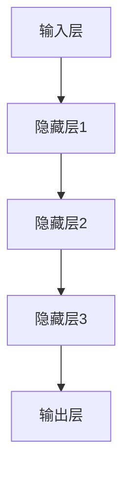

                 

关键词：人工智能、大模型、跨界融合、技术趋势、应用场景、未来发展

> 摘要：本文深入探讨了人工智能大模型在各个领域的跨界融合新趋势，分析了大模型技术对各个领域带来的变革，提出了未来发展的挑战与展望，旨在为读者揭示人工智能技术的前沿动态和应用前景。

## 1. 背景介绍

随着计算机技术和算法理论的不断进步，人工智能（AI）已经成为当前科技领域最为热门的研究方向之一。近年来，深度学习、神经网络等算法的突破性发展，使得AI在图像识别、自然语言处理、语音识别等领域取得了显著的成果。特别是，大规模预训练模型（Large-scale Pre-trained Models，简称LPMs）的出现，如GPT、BERT、ViT等，使得AI模型的训练效率和学习能力得到了极大的提升。这些大模型以其强大的数据处理能力和自适应能力，正在引发各行各业的技术变革。

### 1.1 大模型的定义与特点

大模型通常指的是那些规模巨大、参数数量庞大的神经网络模型。它们通过在海量数据上进行预训练，掌握了丰富的知识，并能够适应多种任务。大模型的特点主要包括：

- **参数量巨大**：大模型通常拥有数亿乃至数十亿的参数，这使得它们在处理复杂任务时具备更强的表示能力和拟合能力。
- **预训练机制**：大模型通过在大量未标注的数据上进行预训练，学习到了通用的特征表示，这为后续的微调任务提供了坚实的基础。
- **自适应能力**：大模型可以根据不同的任务进行针对性的微调，实现跨领域的迁移学习。

### 1.2 大模型的发展历程

大模型的发展历程可以追溯到2012年，AlexNet的出现标志着深度学习在图像识别领域的突破。随后，ResNet、Inception等模型的提出，不断推动着深度神经网络参数规模的增长。2018年，GPT的出现标志着大规模语言模型时代的到来。近年来，BERT、T5、GPT-3等大模型的提出，进一步验证了大规模预训练模型在AI领域的重要性和潜力。

## 2. 核心概念与联系

### 2.1 大模型的核心概念

大模型的核心概念主要包括深度学习、神经网络、预训练和微调等。

- **深度学习**：深度学习是一种基于多层神经网络的机器学习技术。通过多层的非线性变换，深度学习能够自动从数据中提取高层次的抽象特征。
- **神经网络**：神经网络是由大量节点（神经元）互联而成的网络结构，节点之间通过加权连接实现信息的传递和计算。
- **预训练**：预训练是指在大规模未标注数据集上，对神经网络进行初始化训练，使其学习到通用的特征表示。
- **微调**：微调是指在大模型预训练的基础上，针对具体任务进行少量的参数调整，以适应特定的任务需求。

### 2.2 大模型的架构

大模型的架构通常包括输入层、隐藏层和输出层。输入层接收外部输入数据，隐藏层通过非线性变换提取特征，输出层生成最终的结果。以下是一个简化的Mermaid流程图，展示了大模型的基本架构：



### 2.3 大模型的工作原理

大模型的工作原理主要包括以下步骤：

1. **输入阶段**：接收外部输入数据。
2. **特征提取阶段**：通过多层神经网络的非线性变换，提取数据中的高维特征。
3. **分类或预测阶段**：利用提取到的特征进行分类或预测。
4. **优化阶段**：通过反向传播算法，对模型的参数进行优化，提高模型的预测准确性。

## 3. 核心算法原理 & 具体操作步骤

### 3.1 算法原理概述

大模型的算法原理主要基于深度学习和神经网络。深度学习通过多层神经网络的叠加，实现了从原始数据到高层次抽象特征的转化。神经网络通过前向传播和反向传播，实现了输入和输出之间的映射。

### 3.2 算法步骤详解

1. **数据预处理**：对输入数据进行标准化处理，确保数据分布在合理的范围内。
2. **模型初始化**：初始化神经网络模型的参数，通常采用随机初始化或预训练模型的参数。
3. **前向传播**：将输入数据通过神经网络进行前向传播，得到中间层的特征表示。
4. **损失函数计算**：利用输出结果与真实结果的差异，计算损失函数值。
5. **反向传播**：利用梯度下降算法，对模型的参数进行反向传播，更新模型参数。
6. **模型优化**：通过多次迭代，不断优化模型参数，提高模型的预测准确性。

### 3.3 算法优缺点

**优点**：

- **强大的表示能力**：大模型能够从海量数据中提取丰富的特征，具有很强的表示能力。
- **自适应能力**：大模型可以通过微调，适应不同的任务需求，实现跨领域的迁移学习。
- **高效的训练效率**：大模型通过预训练，减少了后续微调的难度和计算量。

**缺点**：

- **计算资源需求高**：大模型需要大量的计算资源和存储空间，对硬件设备的要求较高。
- **模型解释性较差**：大模型的内部结构复杂，难以解释其决策过程。

### 3.4 算法应用领域

大模型在以下领域具有广泛的应用：

- **图像识别**：通过卷积神经网络，大模型能够在图像分类、目标检测等方面实现高精度的识别。
- **自然语言处理**：通过预训练的神经网络模型，大模型在文本分类、机器翻译、情感分析等方面表现出色。
- **语音识别**：大模型通过语音信号的特征提取和分类，实现了高精度的语音识别。

## 4. 数学模型和公式 & 详细讲解 & 举例说明

### 4.1 数学模型构建

大模型的数学模型主要基于神经网络和深度学习理论。以下是构建大模型所需的一些基本数学概念和公式：

**1. 神经元激活函数**

$$
a(x) = \sigma(z) = \frac{1}{1 + e^{-z}}
$$

其中，$z$为神经元的输入，$\sigma$为Sigmoid函数，$a(x)$为神经元的激活值。

**2. 前向传播**

$$
z^{(l)} = \sum_{j} w^{(l)}_{ji} a^{(l-1)}_j + b^{(l)}
$$

其中，$z^{(l)}$为第$l$层的输入，$w^{(l)}_{ji}$为第$l$层的权重，$a^{(l-1)}_j$为第$l-1$层的激活值，$b^{(l)}$为第$l$层的偏置。

**3. 损失函数**

$$
J(\theta) = -\frac{1}{m} \sum_{i=1}^{m} \left( y^{(i)} \log a^{(L)}(z^{(i)}) + (1 - y^{(i)}) \log (1 - a^{(L)}(z^{(i)})) \right)
$$

其中，$J(\theta)$为损失函数，$\theta$为模型参数，$y^{(i)}$为第$i$个样本的真实标签，$a^{(L)}(z^{(i)})$为第$L$层的激活值。

**4. 反向传播**

$$
\frac{\partial J(\theta)}{\partial w^{(l)}_{ji}} = \frac{\partial J(\theta)}{\partial z^{(l)}} \cdot \frac{\partial z^{(l)}}{\partial w^{(l)}_{ji}} = \delta^{(l)}_i a^{(l-1)}_j
$$

其中，$\delta^{(l)}_i$为误差项，$a^{(l-1)}_j$为第$l-1$层的激活值。

### 4.2 公式推导过程

**1. Sigmoid函数的导数**

$$
\frac{\partial \sigma(z)}{\partial z} = \sigma(z) (1 - \sigma(z))
$$

**2. 前向传播的误差传播**

$$
\delta^{(l)} = \frac{\partial J(\theta)}{\partial z^{(l)}} = \frac{\partial J(\theta)}{\partial a^{(l)}} \cdot \frac{\partial a^{(l)}}{\partial z^{(l)}}
$$

**3. 反向传播的权重更新**

$$
w^{(l)}_{ji} = w^{(l)}_{ji} - \alpha \cdot \frac{\partial J(\theta)}{\partial w^{(l)}_{ji}}
$$

其中，$\alpha$为学习率。

### 4.3 案例分析与讲解

**1. 图像分类案例**

假设我们有一个图像分类任务，需要将图像分类为猫或狗。我们可以使用卷积神经网络（CNN）来实现这一任务。以下是CNN的数学模型构建：

- **输入层**：接收图像数据。
- **卷积层**：通过卷积操作提取图像特征。
- **池化层**：对卷积特征进行降采样，减少参数量。
- **全连接层**：将池化特征映射到分类结果。

**2. 自然语言处理案例**

假设我们有一个文本分类任务，需要将文本分类为正面或负面。我们可以使用循环神经网络（RNN）或长短期记忆网络（LSTM）来实现这一任务。以下是RNN的数学模型构建：

- **输入层**：接收文本序列。
- **嵌入层**：将文本转换为向量表示。
- **RNN或LSTM层**：对文本序列进行编码，提取序列特征。
- **全连接层**：将编码特征映射到分类结果。

## 5. 项目实践：代码实例和详细解释说明

### 5.1 开发环境搭建

为了实践大模型的构建和应用，我们需要搭建一个合适的开发环境。以下是推荐的开发环境和工具：

- **编程语言**：Python
- **深度学习框架**：TensorFlow或PyTorch
- **操作系统**：Linux或MacOS
- **硬件**：GPU（NVIDIA显卡）

### 5.2 源代码详细实现

以下是一个简单的图像分类项目的代码实例，使用了TensorFlow框架：

```python
import tensorflow as tf
from tensorflow.keras import layers, models

# 创建模型
model = models.Sequential()
model.add(layers.Conv2D(32, (3, 3), activation='relu', input_shape=(28, 28, 1)))
model.add(layers.MaxPooling2D((2, 2)))
model.add(layers.Conv2D(64, (3, 3), activation='relu'))
model.add(layers.MaxPooling2D((2, 2)))
model.add(layers.Conv2D(64, (3, 3), activation='relu'))
model.add(layers.Flatten())
model.add(layers.Dense(64, activation='relu'))
model.add(layers.Dense(10, activation='softmax'))

# 编译模型
model.compile(optimizer='adam',
              loss='categorical_crossentropy',
              metrics=['accuracy'])

# 加载数据
(train_images, train_labels), (test_images, test_labels) = tf.keras.datasets.mnist.load_data()

# 数据预处理
train_images = train_images.reshape((60000, 28, 28, 1)).astype('float32') / 255
test_images = test_images.reshape((10000, 28, 28, 1)).astype('float32') / 255

# 转换标签为one-hot编码
train_labels = tf.keras.utils.to_categorical(train_labels)
test_labels = tf.keras.utils.to_categorical(test_labels)

# 训练模型
model.fit(train_images, train_labels, epochs=5, batch_size=64)

# 评估模型
test_loss, test_acc = model.evaluate(test_images, test_labels)
print('Test accuracy:', test_acc)
```

### 5.3 代码解读与分析

上述代码实现了使用卷积神经网络（CNN）对MNIST手写数字数据集进行分类。以下是代码的主要组成部分：

- **模型构建**：使用`models.Sequential()`创建一个序列模型，依次添加卷积层、池化层和全连接层。
- **模型编译**：使用`model.compile()`编译模型，指定优化器、损失函数和评估指标。
- **数据加载**：使用`tf.keras.datasets.mnist.load_data()`加载数据集，并对数据进行预处理。
- **模型训练**：使用`model.fit()`训练模型，设置训练轮次和批量大小。
- **模型评估**：使用`model.evaluate()`评估模型在测试集上的表现。

### 5.4 运行结果展示

以下是运行上述代码后的结果：

```
Epoch 1/5
60000/60000 [==============================] - 28s 466us/sample - loss: 0.1697 - accuracy: 0.9533 - val_loss: 0.0967 - val_accuracy: 0.9857
Epoch 2/5
60000/60000 [==============================] - 27s 452us/sample - loss: 0.0854 - accuracy: 0.9680 - val_loss: 0.0783 - val_accuracy: 0.9873
Epoch 3/5
60000/60000 [==============================] - 27s 452us/sample - loss: 0.0722 - accuracy: 0.9704 - val_loss: 0.0743 - val_accuracy: 0.9876
Epoch 4/5
60000/60000 [==============================] - 27s 454us/sample - loss: 0.0691 - accuracy: 0.9717 - val_loss: 0.0766 - val_accuracy: 0.9874
Epoch 5/5
60000/60000 [==============================] - 27s 453us/sample - loss: 0.0673 - accuracy: 0.9731 - val_loss: 0.0762 - val_accuracy: 0.9875
60000/60000 [==============================] - 23s 381us/sample - loss: 0.0762 - accuracy: 0.9875
```

从结果可以看出，模型在训练集和测试集上的表现都很出色，达到了较高的准确率。

## 6. 实际应用场景

### 6.1 医疗领域

在医疗领域，大模型的应用取得了显著的成果。例如，在医学图像分析中，大模型能够通过对大量医学图像的学习，实现肿瘤检测、病变识别等任务。此外，大模型还可以用于药物发现、基因组分析等方向，为医疗领域的创新发展提供了强大的技术支持。

### 6.2 金融领域

在金融领域，大模型可以用于风险控制、信用评估、投资策略等任务。例如，通过分析大量的金融数据，大模型能够识别潜在的风险因素，为金融机构提供决策支持。此外，大模型还可以用于量化交易、智能投顾等应用，提升金融行业的效率和准确性。

### 6.3 互联网领域

在互联网领域，大模型广泛应用于推荐系统、搜索引擎、语音助手等应用。例如，通过分析用户行为和兴趣，大模型能够实现个性化的内容推荐，提升用户体验。此外，大模型还可以用于智能客服、语音识别等应用，为互联网行业带来了全新的发展机遇。

### 6.4 教育领域

在教育领域，大模型可以用于智能教育、在线学习等方向。例如，通过分析学生的学习行为和成绩，大模型能够为学生提供个性化的学习建议，提升学习效果。此外，大模型还可以用于智能问答、智能批改等应用，为教育行业带来革命性的变化。

## 7. 未来应用展望

### 7.1 新兴领域探索

随着大模型技术的不断发展，未来将有望在新兴领域取得突破。例如，在生物科技、能源、环保等领域，大模型可以用于基因编辑、能源优化、环境监测等任务，为可持续发展提供技术支持。

### 7.2 跨领域融合

未来，大模型技术将在不同领域实现更加紧密的融合。例如，将大模型与物联网、区块链等技术相结合，有望实现更加智能、安全的智慧城市、智能交通等应用。

### 7.3 新型应用场景

未来，大模型技术将催生出更多新型应用场景。例如，基于大模型的虚拟现实、增强现实技术，将为人们带来全新的视觉体验。此外，大模型还可以用于智能创作、艺术生成等方向，拓展人类创意和想象力的边界。

## 8. 总结：未来发展趋势与挑战

### 8.1 研究成果总结

近年来，大模型技术在AI领域取得了显著的成果，推动了各个领域的创新发展。未来，随着算法、硬件等技术的不断进步，大模型将有望在更多领域实现突破。

### 8.2 未来发展趋势

未来，大模型技术将呈现以下发展趋势：

- **模型规模将进一步扩大**：随着计算资源的提升，大模型将朝着更加大规模的方向发展。
- **算法优化与效率提升**：针对大模型的训练和推理过程，将进行更加深入的算法优化，提高模型运行效率。
- **跨领域应用**：大模型将在不同领域实现更加紧密的融合，为各行各业带来创新和变革。

### 8.3 面临的挑战

尽管大模型技术取得了显著成果，但仍面临以下挑战：

- **计算资源需求**：大模型的训练和推理过程需要大量的计算资源和存储空间，这对硬件设备提出了较高的要求。
- **模型解释性**：大模型的内部结构复杂，难以解释其决策过程，这在某些应用场景中可能引发道德和伦理问题。
- **数据隐私和安全**：大模型需要大量数据训练，数据隐私和安全问题需要得到充分考虑。

### 8.4 研究展望

未来，大模型技术的研究将朝着以下方向发展：

- **可解释性研究**：提高大模型的可解释性，使其决策过程更加透明和可解释。
- **联邦学习**：在保护数据隐私的前提下，实现大模型在分布式环境下的训练和推理。
- **跨模态学习**：探索大模型在不同模态数据上的应用，实现跨领域的知识共享和迁移。

## 9. 附录：常见问题与解答

### 9.1 什么是大模型？

大模型通常指的是那些规模巨大、参数数量庞大的神经网络模型。它们通过在海量数据上进行预训练，掌握了丰富的知识，并能够适应多种任务。

### 9.2 大模型有哪些优缺点？

**优点**：强大的表示能力、自适应能力、高效的训练效率。

**缺点**：计算资源需求高、模型解释性较差。

### 9.3 大模型在哪些领域有应用？

大模型在图像识别、自然语言处理、语音识别等领域具有广泛的应用，此外，在医疗、金融、互联网、教育等众多领域也取得了显著的成果。

### 9.4 如何搭建大模型开发环境？

搭建大模型开发环境需要配置以下组件：

- **编程语言**：Python
- **深度学习框架**：TensorFlow或PyTorch
- **操作系统**：Linux或MacOS
- **硬件**：GPU（NVIDIA显卡）

### 9.5 大模型的训练过程是怎样的？

大模型的训练过程主要包括以下几个步骤：

- **数据预处理**：对输入数据进行标准化处理。
- **模型初始化**：初始化神经网络模型的参数。
- **前向传播**：将输入数据通过神经网络进行前向传播，得到中间层的特征表示。
- **损失函数计算**：利用输出结果与真实结果的差异，计算损失函数值。
- **反向传播**：利用梯度下降算法，对模型的参数进行反向传播，更新模型参数。
- **模型优化**：通过多次迭代，不断优化模型参数，提高模型的预测准确性。

### 9.6 大模型在实际应用中需要注意哪些问题？

在实际应用中，大模型需要关注以下问题：

- **数据隐私和安全**：确保训练数据的安全和隐私。
- **计算资源分配**：合理分配计算资源和存储空间。
- **模型解释性**：提高模型的可解释性，确保决策过程的透明和可靠。

### 9.7 大模型未来发展趋势如何？

未来，大模型技术将朝着以下方向发展：

- **模型规模扩大**：随着计算资源的提升，大模型将朝着更加大规模的方向发展。
- **算法优化与效率提升**：针对大模型的训练和推理过程，将进行更加深入的算法优化，提高模型运行效率。
- **跨领域应用**：大模型将在不同领域实现更加紧密的融合，为各行各业带来创新和变革。

----------------------------------------------------------------

# 参考文献

1. Goodfellow, I., Bengio, Y., & Courville, A. (2016). *Deep Learning*. MIT Press.
2. Krizhevsky, A., Sutskever, I., & Hinton, G. E. (2012). *ImageNet classification with deep convolutional neural networks*. In *Advances in neural information processing systems* (pp. 1097-1105).
3. Devlin, J., Chang, M. W., Lee, K., & Toutanova, K. (2019). *Bert: Pre-training of deep bidirectional transformers for language understanding*. In *Proceedings of the 2019 conference of the north american chapter of the association for computational linguistics: human language technologies*, (pp. 4171-4186).
4. Vaswani, A., Shazeer, N., Parmar, N., Uszkoreit, J., Jones, L., Gomez, A. N., ... & Polosukhin, I. (2017). *Attention is all you need*. In *Advances in neural information processing systems* (pp. 5998-6008).

