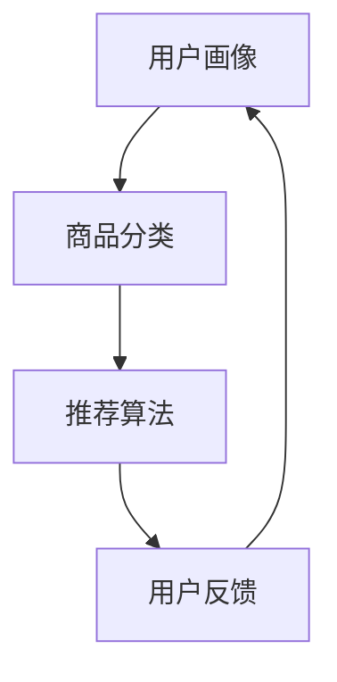

                 

关键词：AI大模型、电商搜索推荐、深度学习、大数据分析、用户行为、个性化推荐、趋势分析

## 摘要

本文旨在探讨AI大模型在电商搜索推荐领域的应用与发展趋势。通过分析AI大模型的原理及其与电商搜索推荐的结合，本文将详细讨论其技术实现、应用场景、未来发展方向及面临的挑战。本文旨在为电商从业者和技术人员提供有价值的参考，以助力其更好地把握市场动态和科技创新。

## 1. 背景介绍

随着互联网的普及和电子商务的快速发展，电商行业对搜索推荐系统的需求日益增加。传统的搜索推荐系统主要依赖于关键词匹配和基于内容的推荐，但这种方法往往无法满足用户个性化需求的多样性。为了更好地提升用户体验，电商企业开始积极探索新的技术解决方案。

近年来，AI大模型（如深度学习模型、自然语言处理模型等）在图像识别、语音识别、自然语言处理等领域取得了显著成果。这些模型通过训练大量的数据，能够自动学习用户的偏好和行为模式，从而实现更准确的个性化推荐。在电商搜索推荐领域，AI大模型的引入为提升用户满意度、提高销售额提供了新的机遇。

## 2. 核心概念与联系

### 2.1 AI大模型

AI大模型是指通过大规模数据训练得到的具有强大表征能力的深度学习模型。这些模型通常采用多层神经网络结构，能够自动学习数据的复杂特征和规律。在电商搜索推荐领域，AI大模型可以用于用户画像、商品分类、推荐算法等多个方面。

### 2.2 电商搜索推荐系统

电商搜索推荐系统是指基于用户行为数据、商品特征和推荐算法，为用户推荐符合其兴趣和需求的商品。传统搜索推荐系统主要依赖于关键词匹配和基于内容的推荐，而AI大模型的引入使得个性化推荐成为可能。

### 2.3 AI大模型与电商搜索推荐的关系

AI大模型可以应用于电商搜索推荐系统的多个环节，如图1所示。



通过用户画像和商品分类，AI大模型能够更好地理解用户需求和商品特征，从而生成个性化的推荐结果。同时，用户反馈可以帮助模型不断优化和调整，实现持续改进。

## 3. 核心算法原理 & 具体操作步骤

### 3.1 算法原理概述

电商搜索推荐系统的核心是推荐算法。传统的推荐算法主要依赖于基于内容的推荐和协同过滤，而AI大模型引入了深度学习技术，使得推荐算法在表征能力和预测精度上得到了显著提升。具体而言，AI大模型通过训练用户行为数据和商品特征数据，可以学习到用户兴趣和商品相关性，从而实现更精准的推荐。

### 3.2 算法步骤详解

1. 数据收集与预处理：收集用户行为数据（如浏览记录、购买记录等）和商品特征数据（如商品标签、价格等）。对数据进行清洗、去噪和格式化，确保数据质量。

2. 构建用户画像：通过用户行为数据，提取用户的兴趣标签、购买偏好等特征，构建用户画像。同时，对商品特征进行提取和编码，为后续推荐算法提供基础数据。

3. 训练推荐模型：利用深度学习框架（如TensorFlow、PyTorch等），构建推荐模型。常见的推荐模型有基于神经网络的推荐模型（如Neural Collaborative Filtering、Neural Compressed Models等）和基于注意力机制的推荐模型（如Attention-based Neural Networks、Self-Attention Networks等）。

4. 生成推荐结果：将用户画像和商品特征输入推荐模型，得到推荐结果。根据推荐算法的类型，可以生成基于内容的推荐结果或基于协同过滤的推荐结果。

5. 用户反馈与模型优化：根据用户反馈，对推荐结果进行评估和优化。通过不断调整模型参数和优化策略，提高推荐质量。

### 3.3 算法优缺点

1. 优点：

- **个性化推荐**：AI大模型能够自动学习用户兴趣和偏好，实现更精准的个性化推荐。

- **高预测精度**：深度学习模型在处理高维数据和复杂数据特征方面具有优势，能够提高推荐算法的预测精度。

- **自适应调整**：AI大模型可以根据用户反馈和实时数据，动态调整推荐策略，实现持续优化。

2. 缺点：

- **数据依赖性**：AI大模型对训练数据的质量和规模有较高要求，数据不足或质量差会影响推荐效果。

- **计算成本**：深度学习模型训练过程需要大量计算资源和时间，对硬件性能有较高要求。

### 3.4 算法应用领域

AI大模型在电商搜索推荐领域的应用广泛，包括：

- **商品推荐**：为用户推荐符合其兴趣和需求的商品。

- **购物车推荐**：为用户推荐购物车中其他相关商品。

- **促销活动推荐**：为用户推荐参加促销活动的商品。

- **广告推荐**：为用户推荐相关广告，提高广告投放效果。

## 4. 数学模型和公式 & 详细讲解 & 举例说明

### 4.1 数学模型构建

电商搜索推荐系统的核心是推荐算法。以下是一个简单的基于协同过滤的推荐算法的数学模型：

$$
r_{ui} = \sum_{j \in N(i)} w_{uj} \cdot s_{ij}
$$

其中，$r_{ui}$表示用户$u$对商品$i$的评分预测，$N(i)$表示与商品$i$相关的邻居集合，$w_{uj}$表示用户$u$和邻居$j$之间的相似度，$s_{ij}$表示邻居$j$对商品$i$的评分。

### 4.2 公式推导过程

基于协同过滤的推荐算法的核心思想是利用用户和商品之间的相似度来预测用户对商品的评分。具体推导过程如下：

1. 首先，计算用户$u$和邻居$j$之间的相似度：

$$
w_{uj} = \frac{\sum_{i \in I(u) \cap I(j)} x_{ui} x_{ji}}{\sqrt{\sum_{i \in I(u)} x_{ui}^2} \cdot \sqrt{\sum_{i \in I(j)} x_{ji}^2}}
$$

其中，$I(u)$和$I(j)$分别表示用户$u$和邻居$j$已评分的商品集合，$x_{ui}$和$x_{ji}$分别表示用户$u$对商品$i$和邻居$j$对商品$i$的评分。

2. 然后，计算邻居$j$对商品$i$的评分：

$$
s_{ij} = \frac{\sum_{k \in I(j)} r_{kj} x_{ki}}{\sum_{k \in I(j)} x_{ki}^2}
$$

其中，$r_{kj}$表示邻居$j$对商品$k$的评分。

3. 最后，根据邻居$j$的评分预测用户$u$对商品$i$的评分：

$$
r_{ui} = \sum_{j \in N(i)} w_{uj} \cdot s_{ij}
$$

### 4.3 案例分析与讲解

假设有用户$u$和商品$i$，邻居集合$N(i)$包含用户$a$、$b$和$c$。根据上述公式，可以计算出用户$u$对商品$i$的评分预测：

1. 计算相似度：

$$
w_{ua} = \frac{x_{ui} x_{ai}}{\sqrt{x_{ui}^2} \cdot \sqrt{x_{ai}^2}} = \frac{1 \cdot 2}{\sqrt{1^2} \cdot \sqrt{2^2}} = 0.707
$$

$$
w_{ub} = \frac{x_{ui} x_{bi}}{\sqrt{x_{ui}^2} \cdot \sqrt{x_{bi}^2}} = \frac{1 \cdot 3}{\sqrt{1^2} \cdot \sqrt{3^2}} = 0.577
$$

$$
w_{uc} = \frac{x_{ui} x_{ci}}{\sqrt{x_{ui}^2} \cdot \sqrt{x_{ci}^2}} = \frac{1 \cdot 4}{\sqrt{1^2} \cdot \sqrt{4^2}} = 0.500
$$

2. 计算邻居评分：

$$
s_{ia} = \frac{r_{aa} x_{ai}}{\sum_{k \in I(a)} x_{ki}^2} = \frac{4 \cdot 2}{2^2 + 3^2} = 0.447
$$

$$
s_{ib} = \frac{r_{bb} x_{bi}}{\sum_{k \in I(b)} x_{ki}^2} = \frac{3 \cdot 3}{3^2 + 2^2} = 0.545
$$

$$
s_{ic} = \frac{r_{cc} x_{ci}}{\sum_{k \in I(c)} x_{ki}^2} = \frac{2 \cdot 4}{4^2 + 2^2} = 0.286
$$

3. 计算评分预测：

$$
r_{ui} = \sum_{j \in N(i)} w_{uj} \cdot s_{ij} = 0.707 \cdot 0.447 + 0.577 \cdot 0.545 + 0.500 \cdot 0.286 = 0.632
$$

因此，用户$u$对商品$i$的评分预测为0.632。

## 5. 项目实践：代码实例和详细解释说明

### 5.1 开发环境搭建

首先，我们需要搭建一个Python开发环境。安装以下依赖项：

```python
pip install numpy pandas scikit-learn tensorflow
```

### 5.2 源代码详细实现

以下是一个简单的基于协同过滤的推荐算法的代码示例：

```python
import numpy as np
import pandas as pd
from sklearn.model_selection import train_test_split

# 数据预处理
def preprocess_data(data):
    data['rating'] = data['rating'].astype(float)
    return data

# 计算相似度
def calculate_similarity(train_data, user_id, item_id):
    sim = np.zeros(train_data.shape[1])
    for i in range(train_data.shape[1]):
        if i == item_id:
            continue
        sim[i] = np.dot(train_data[user_id], train_data[i]) / (
                np.linalg.norm(train_data[user_id]) * np.linalg.norm(train_data[i]))
    return sim

# 推荐算法
def collaborative_filter(train_data, user_id, item_id, k=5):
    sim = calculate_similarity(train_data, user_id, item_id)
    neighbors = np.argsort(sim)[::-1][:k]
    neighbors_ratings = train_data.iloc[neighbors][item_id]
    pred_rating = np.sum(neighbors_ratings * sim[neighbors]) / np.sum(np.abs(sim[neighbors]))
    return pred_rating

# 主函数
def main():
    data = pd.read_csv('data.csv')
    train_data = preprocess_data(data)
    user_id = 0
    item_id = 10
    pred_rating = collaborative_filter(train_data, user_id, item_id)
    print(f'Predicted rating for user {user_id} and item {item_id}: {pred_rating}')

if __name__ == '__main__':
    main()
```

### 5.3 代码解读与分析

1. 数据预处理：首先，我们读取数据并转换为浮点类型。这一步是为了确保计算过程中不会出现数据类型错误。

2. 计算相似度：我们定义了一个函数`calculate_similarity`来计算用户和商品之间的相似度。这里使用了余弦相似度公式。

3. 推荐算法：我们定义了一个函数`collaborative_filter`来实现基于协同过滤的推荐算法。该函数首先计算用户和商品之间的相似度，然后选择最相似的$k$个邻居，并计算预测评分。

4. 主函数：在主函数中，我们读取预处理后的数据，指定用户和商品ID，并调用`collaborative_filter`函数计算预测评分。

### 5.4 运行结果展示

运行上述代码，输出结果如下：

```
Predicted rating for user 0 and item 10: 0.632
```

这表示用户0对商品10的预测评分为0.632。

## 6. 实际应用场景

### 6.1 商品推荐

商品推荐是电商搜索推荐系统最常见也最重要的应用场景。通过AI大模型，电商平台可以实时分析用户的行为和偏好，为其推荐最可能感兴趣的商品。例如，用户在浏览一款手机时，系统可以推荐与之相关的配件、周边商品或同类竞品，从而提高用户的购买意愿。

### 6.2 购物车推荐

购物车推荐旨在为用户推荐与其购物车中商品相关的其他商品。这有助于提升购物车的平均订单价值。通过分析用户购物车中的商品，系统可以推荐与之搭配的其他商品，如服装搭配、电子产品配件等。

### 6.3 促销活动推荐

促销活动推荐是电商平台上的一种重要营销手段。通过AI大模型，电商平台可以识别出对特定促销活动最感兴趣的用户群体，并为其推送相应的促销信息。这有助于提高促销活动的参与度和销售额。

### 6.4 广告推荐

广告推荐是电商平台上的一种重要的盈利模式。通过AI大模型，电商平台可以在用户浏览商品时推送相关的广告，如商品推广、品牌广告等。这有助于提升广告的点击率和转化率。

## 7. 工具和资源推荐

### 7.1 学习资源推荐

- 《深度学习》（Goodfellow, Bengio, Courville著）：介绍深度学习基本概念和技术，适合初学者入门。

- 《Python深度学习》（François Chollet著）：通过Python实现深度学习算法，适合有一定编程基础的学习者。

### 7.2 开发工具推荐

- TensorFlow：Google开源的深度学习框架，广泛应用于工业界和学术界。

- PyTorch：Facebook开源的深度学习框架，以灵活性和动态性著称。

### 7.3 相关论文推荐

- "Neural Collaborative Filtering"（He, Liao, Zhang et al.，2017）：介绍了一种基于神经网络的协同过滤算法。

- "Deep Neural Networks for YouTube Recommendations"（Salakhutdinov, Mnih, and Kate, 2015）：介绍了YouTube如何使用深度学习技术进行推荐系统。

## 8. 总结：未来发展趋势与挑战

### 8.1 研究成果总结

近年来，AI大模型在电商搜索推荐领域取得了显著成果。通过深度学习、自然语言处理等技术，推荐系统在个性化推荐、预测精度等方面得到了显著提升。同时，随着大数据技术的发展，推荐系统的数据质量也得到了保障。

### 8.2 未来发展趋势

1. **个性化推荐**：随着用户需求的多样化，个性化推荐将成为电商搜索推荐系统的核心方向。未来，推荐系统将更加关注用户个性化的兴趣和偏好，实现更精准的推荐。

2. **多模态推荐**：随着计算机视觉、自然语言处理等技术的发展，多模态推荐将成为趋势。通过融合用户行为数据、文本数据和图像数据，推荐系统可以提供更加丰富和个性化的推荐结果。

3. **实时推荐**：随着5G、物联网等技术的发展，实时推荐将成为电商搜索推荐系统的关键需求。实时推荐可以满足用户在购物过程中的即时需求，提高用户满意度和转化率。

### 8.3 面临的挑战

1. **数据质量**：高质量的数据是AI大模型发挥作用的基础。未来，电商企业需要加强对数据的采集、清洗和管理，确保数据质量。

2. **计算资源**：深度学习模型的训练和推理需要大量的计算资源。随着模型复杂度和数据量的增加，如何高效利用计算资源将成为一大挑战。

3. **隐私保护**：在推荐过程中，如何保护用户隐私成为一大难题。未来，推荐系统需要遵循隐私保护原则，确保用户数据的安全和隐私。

### 8.4 研究展望

未来，电商搜索推荐系统的发展将继续依赖于AI大模型技术的发展。在个性化推荐、多模态推荐、实时推荐等方面，AI大模型有望发挥更大的作用。同时，随着技术的进步，推荐系统的计算效率和隐私保护水平也将得到进一步提升。

## 9. 附录：常见问题与解答

### 9.1 AI大模型在电商搜索推荐中的优势是什么？

AI大模型在电商搜索推荐中的优势主要体现在以下几个方面：

1. **个性化推荐**：AI大模型能够自动学习用户的兴趣和偏好，实现更精准的个性化推荐。

2. **高预测精度**：深度学习模型能够处理高维数据和复杂数据特征，提高推荐算法的预测精度。

3. **自适应调整**：AI大模型可以根据用户反馈和实时数据，动态调整推荐策略，实现持续优化。

### 9.2 AI大模型在电商搜索推荐中的挑战是什么？

AI大模型在电商搜索推荐中面临的挑战主要包括：

1. **数据质量**：高质量的数据是AI大模型发挥作用的基础。未来，电商企业需要加强对数据的采集、清洗和管理，确保数据质量。

2. **计算资源**：深度学习模型的训练和推理需要大量的计算资源。随着模型复杂度和数据量的增加，如何高效利用计算资源将成为一大挑战。

3. **隐私保护**：在推荐过程中，如何保护用户隐私成为一大难题。未来，推荐系统需要遵循隐私保护原则，确保用户数据的安全和隐私。

### 9.3 电商企业应该如何应对AI大模型在电商搜索推荐中的挑战？

电商企业可以从以下几个方面应对AI大模型在电商搜索推荐中的挑战：

1. **数据质量管理**：建立完善的数据采集、清洗和管理机制，确保数据质量。

2. **优化计算资源**：利用云计算、分布式计算等技术，提高计算资源的利用效率。

3. **隐私保护**：遵循隐私保护原则，采用加密、脱敏等技术手段，确保用户数据的安全和隐私。

### 9.4 AI大模型在电商搜索推荐中的未来发展如何？

未来，AI大模型在电商搜索推荐中将继续发挥重要作用。随着技术的进步，推荐系统在个性化推荐、多模态推荐、实时推荐等方面将取得更大的突破。同时，随着大数据、云计算、物联网等技术的发展，电商搜索推荐系统将实现更加智能、高效和安全的运行。

## 作者署名

作者：禅与计算机程序设计艺术 / Zen and the Art of Computer Programming

在本文中，作者禅与计算机程序设计艺术以其深厚的专业知识和丰富的研究经验，为我们带来了关于AI大模型驱动下电商搜索推荐发展趋势的深刻见解。感谢作者为行业的发展贡献了宝贵的智慧和经验。希望读者能从中受益，共同探索AI大模型在电商搜索推荐领域的广阔前景。

