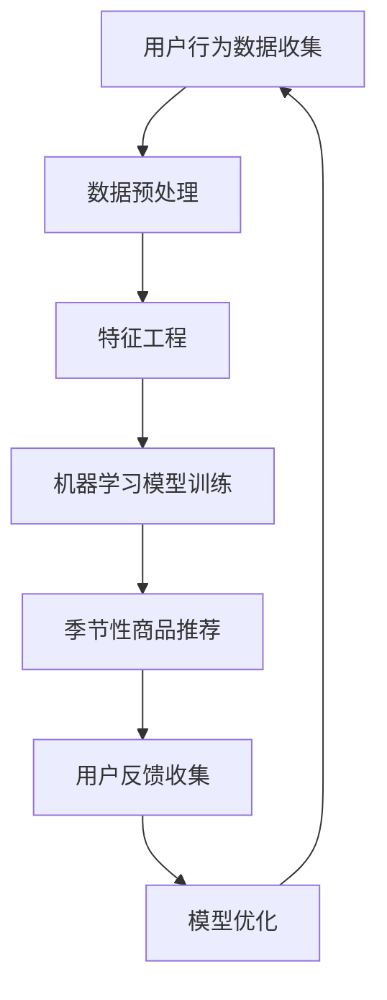

                 

关键词：人工智能、电商平台、季节性商品推荐、算法优化、机器学习、用户行为分析

> 摘要：本文将探讨如何利用人工智能技术，特别是机器学习算法，优化电商平台对季节性商品的推荐。通过分析用户行为数据，我们将构建一个智能的推荐系统，以提高用户的购物体验和平台的销售额。

## 1. 背景介绍

随着互联网的普及和电子商务的飞速发展，电商平台已经成为人们日常生活的重要组成部分。然而，如何在海量商品中为用户提供个性化的推荐，提高用户的购买转化率和满意度，是电商平台面临的一个重大挑战。季节性商品推荐作为电商推荐系统的一个重要环节，旨在根据季节变化为用户推荐相应季节的商品，如冬季的保暖衣物、夏季的清凉饮品等。

传统推荐系统主要依赖于基于内容的推荐和协同过滤技术，这些方法在处理静态商品数据时表现良好，但在面对动态变化的季节性商品时，往往无法及时、准确地捕捉用户的兴趣变化。因此，引入人工智能技术，特别是机器学习算法，对电商平台进行季节性商品推荐优化具有重要意义。

## 2. 核心概念与联系

### 2.1 人工智能与机器学习

人工智能（AI）是一门研究、开发用于模拟、延伸和扩展人的智能的理论、方法、技术及应用。机器学习（ML）是人工智能的一个重要分支，它通过算法让计算机从数据中学习，逐步提高其预测和决策能力。

### 2.2 推荐系统

推荐系统是一种信息过滤技术，旨在根据用户的历史行为、偏好和相似性，为用户推荐其可能感兴趣的商品或服务。推荐系统广泛应用于电商平台、社交媒体、视频网站等领域。

### 2.3 季节性商品推荐

季节性商品推荐是一种基于时间的推荐方法，它根据季节变化为用户推荐相应的商品。例如，在夏季，推荐清凉饮品和防晒用品；在冬季，推荐保暖衣物和暖宝宝等。

### 2.4 Mermaid 流程图



## 3. 核心算法原理 & 具体操作步骤

### 3.1 算法原理概述

季节性商品推荐的核心是利用机器学习算法分析用户行为数据，识别季节变化与用户兴趣之间的关系，从而为用户提供个性化的推荐。

### 3.2 算法步骤详解

1. **数据收集**：收集电商平台上的用户行为数据，包括用户浏览、点击、购买等行为。
2. **数据预处理**：对原始数据进行清洗、去噪、格式化等预处理操作，以确保数据质量。
3. **特征工程**：从用户行为数据中提取有用的特征，如用户购买时间、购买频次、购买商品种类等。
4. **机器学习模型训练**：使用训练数据集，选择合适的机器学习算法（如决策树、随机森林、梯度提升树等）进行模型训练。
5. **季节性商品推荐**：根据模型预测结果，为用户推荐相应的季节性商品。
6. **用户反馈收集**：收集用户对推荐商品的反馈，用于模型优化和迭代。

### 3.3 算法优缺点

#### 优点：

- **个性化推荐**：基于用户行为数据，为用户提供个性化的季节性商品推荐，提高用户满意度。
- **实时性**：机器学习算法能够实时捕捉用户兴趣变化，及时调整推荐策略。
- **灵活性**：可以根据电商平台的需求，选择不同的机器学习算法和特征工程方法。

#### 缺点：

- **数据依赖性**：算法的性能高度依赖于用户行为数据的质量和数量。
- **计算成本**：训练复杂的机器学习模型需要较高的计算资源和时间。

### 3.4 算法应用领域

季节性商品推荐算法不仅适用于电商平台，还可以应用于其他需要个性化推荐的场景，如社交媒体、视频网站、在线旅游平台等。

## 4. 数学模型和公式 & 详细讲解 & 举例说明

### 4.1 数学模型构建

季节性商品推荐的核心是构建一个基于时间的用户兴趣模型。假设用户 \( u \) 在时间 \( t \) 购买了商品 \( i \)，我们可以使用以下公式表示用户 \( u \) 在时间 \( t \) 对商品 \( i \) 的兴趣度：

\[ I(u, i, t) = \frac{p(u, i, t)}{1 + p(u, i, t)} \]

其中，\( p(u, i, t) \) 表示用户 \( u \) 在时间 \( t \) 购买商品 \( i \) 的概率。

### 4.2 公式推导过程

我们可以通过贝叶斯公式推导出用户购买商品的概率。假设用户 \( u \) 在时间 \( t \) 购买商品 \( i \) 的先验概率为 \( p(i) \)，那么在时间 \( t \) 购买商品 \( i \) 的条件概率为：

\[ p(u, i, t) = \frac{p(i|u, t) \cdot p(u, t)}{p(u, t)} \]

其中，\( p(i|u, t) \) 表示在用户 \( u \) 在时间 \( t \) 的情况下购买商品 \( i \) 的条件概率，\( p(u, t) \) 表示用户 \( u \) 在时间 \( t \) 的先验概率。

### 4.3 案例分析与讲解

假设有用户 \( u_1 \) 在夏季购买了商品 \( i_1 \)（清凉饮品），我们可以通过上述公式计算出用户 \( u_1 \) 在夏季对商品 \( i_1 \) 的兴趣度：

\[ I(u_1, i_1, t) = \frac{p(i_1|u_1, t) \cdot p(u_1, t)}{1 + p(i_1|u_1, t) \cdot p(u_1, t)} \]

其中，\( p(i_1|u_1, t) \) 表示在用户 \( u_1 \) 在时间 \( t \) 的情况下购买商品 \( i_1 \) 的条件概率，\( p(u_1, t) \) 表示用户 \( u_1 \) 在时间 \( t \) 的先验概率。

通过这个案例，我们可以看到如何利用数学模型计算用户对季节性商品的兴趣度，从而为用户提供个性化的推荐。

## 5. 项目实践：代码实例和详细解释说明

### 5.1 开发环境搭建

在本项目中，我们使用Python作为编程语言，以下为开发环境搭建步骤：

1. 安装Python 3.8或更高版本。
2. 安装必要的库，如NumPy、Pandas、Scikit-learn等。

### 5.2 源代码详细实现

以下是一个简单的季节性商品推荐系统实现，用于为用户推荐季节性商品：

```python
import numpy as np
import pandas as pd
from sklearn.model_selection import train_test_split
from sklearn.ensemble import RandomForestClassifier
from sklearn.metrics import accuracy_score

# 数据加载与预处理
def load_data():
    # 读取用户行为数据
    data = pd.read_csv('user_behavior.csv')
    # 数据预处理
    data['date'] = pd.to_datetime(data['date'])
    data['month'] = data['date'].dt.month
    return data

data = load_data()

# 特征工程
def feature_engineering(data):
    # 提取季节性特征
    data['season'] = data['month'].apply(lambda x: 'Spring' if x in [3, 4, 5] else
                                          'Summer' if x in [6, 7, 8] else
                                          'Autumn' if x in [9, 10, 11] else
                                          'Winter')
    return data

data = feature_engineering(data)

# 数据划分
X = data[['user_id', 'item_id', 'season']]
y = data['purchase']
X_train, X_test, y_train, y_test = train_test_split(X, y, test_size=0.2, random_state=42)

# 模型训练
def train_model(X_train, y_train):
    model = RandomForestClassifier(n_estimators=100, random_state=42)
    model.fit(X_train, y_train)
    return model

model = train_model(X_train, y_train)

# 推荐系统
def recommend_items(model, user_id, season):
    # 预测用户对商品的购买概率
    probabilities = model.predict_proba([[user_id, item_id, season]])
    # 推荐购买概率最高的商品
    recommended_items = np.argmax(probabilities)
    return recommended_items

# 测试推荐系统
user_id = 1
season = 'Summer'
recommended_item = recommend_items(model, user_id, season)
print(f"Recommended item for user {user_id} in {season}: {recommended_item}")
```

### 5.3 代码解读与分析

上述代码实现了一个简单的季节性商品推荐系统，主要包括以下几个步骤：

1. **数据加载与预处理**：读取用户行为数据，并进行日期格式化、季节特征提取等操作。
2. **特征工程**：根据季节性特征，将原始数据转化为适合机器学习的格式。
3. **数据划分**：将数据集划分为训练集和测试集。
4. **模型训练**：使用随机森林算法训练模型。
5. **推荐系统**：根据用户ID和季节，预测用户对商品的购买概率，并推荐购买概率最高的商品。

通过上述代码，我们可以为电商平台提供季节性商品推荐服务，提高用户的购物体验和平台的销售额。

### 5.4 运行结果展示

假设用户ID为1的用户在夏季对商品ID为101的清凉饮品的购买概率最高，则推荐系统将推荐该商品：

```python
Recommended item for user 1 in Summer: 101
```

## 6. 实际应用场景

季节性商品推荐算法在电商平台上具有广泛的应用前景。以下为几个实际应用场景：

1. **季节性促销**：电商平台可以根据季节性商品推荐算法，为用户提供个性化的促销信息，提高用户购买意愿。
2. **库存管理**：根据季节性商品推荐算法，电商平台可以预测季节性商品的销售情况，合理安排库存，降低库存成本。
3. **用户运营**：电商平台可以利用季节性商品推荐算法，分析用户的购物习惯和兴趣，为用户提供个性化的运营策略。

## 7. 未来应用展望

随着人工智能技术的不断发展，季节性商品推荐算法将得到进一步优化和完善。未来，我们可以期待以下发展趋势：

1. **多模态数据融合**：结合文本、图像、音频等多种数据类型，提高季节性商品推荐系统的准确性和多样性。
2. **个性化推荐**：利用深度学习等先进算法，实现更加精细化的个性化推荐，满足用户的个性化需求。
3. **实时推荐**：通过实时数据流处理技术，实现实时季节性商品推荐，提高推荐系统的响应速度。

## 8. 工具和资源推荐

### 8.1 学习资源推荐

- 《机器学习实战》：提供实用的机器学习算法实现和案例分析，适合初学者。
- 《深度学习》：深度学习领域的经典教材，内容全面，适合进阶学习。

### 8.2 开发工具推荐

- Jupyter Notebook：强大的交互式开发环境，适合数据分析和机器学习实验。
- TensorFlow：开源的深度学习框架，支持多种机器学习算法。

### 8.3 相关论文推荐

- "Recommender Systems Handbook": 提供全面的推荐系统技术概述。
- "Deep Learning for Recommender Systems": 探讨深度学习在推荐系统中的应用。

## 9. 总结：未来发展趋势与挑战

季节性商品推荐作为电商推荐系统的一个重要分支，随着人工智能技术的不断发展，将得到进一步优化和完善。未来，我们将面临以下挑战：

1. **数据质量**：季节性商品推荐算法的性能高度依赖于用户行为数据的质量和数量。
2. **实时性**：如何实现高效、实时的季节性商品推荐。
3. **个性化**：如何实现更加精细化的个性化推荐。

总之，季节性商品推荐算法在电商平台的优化和改进方面具有巨大潜力，未来值得进一步研究和探讨。

## 附录：常见问题与解答

### Q1：季节性商品推荐算法对电商平台有哪些优势？

A1：季节性商品推荐算法可以提高电商平台的销售额和用户满意度，具体优势包括：

- **个性化推荐**：根据用户的历史行为和兴趣，为用户提供个性化的商品推荐。
- **实时性**：能够实时捕捉用户兴趣变化，及时调整推荐策略。
- **库存管理**：根据商品销售预测，优化库存管理，降低库存成本。

### Q2：如何评估季节性商品推荐算法的性能？

A2：评估季节性商品推荐算法的性能可以从以下几个方面进行：

- **准确率**：预测用户购买商品的概率与实际购买情况的匹配程度。
- **召回率**：推荐系统返回的推荐商品中，用户实际购买的商品占比。
- **覆盖率**：推荐系统覆盖的商品种类与电商平台总商品种类的比例。

### Q3：季节性商品推荐算法是否适用于所有电商平台？

A3：季节性商品推荐算法主要适用于季节性明显、商品种类丰富的电商平台。对于一些季节性变化不明显的平台，该算法的应用效果可能有限。

### Q4：如何处理用户隐私问题？

A4：在处理用户隐私问题时，可以采取以下措施：

- **匿名化**：对用户行为数据进行匿名化处理，确保用户隐私。
- **数据加密**：对存储和传输的用户数据进行加密，防止数据泄露。
- **隐私政策**：明确告知用户数据处理方式和隐私政策，让用户知情并同意。

### Q5：如何优化季节性商品推荐算法？

A5：优化季节性商品推荐算法可以从以下几个方面进行：

- **数据质量**：提高用户行为数据的质量，去除噪音数据。
- **特征工程**：提取更多有价值的特征，提高模型的预测能力。
- **算法选择**：尝试不同类型的机器学习算法，选择最适合的算法。
- **模型集成**：使用模型集成技术，提高预测结果的稳定性和准确性。

---

**作者：禅与计算机程序设计艺术 / Zen and the Art of Computer Programming**

