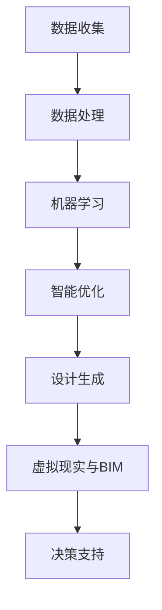

                 

关键词：人工智能，建筑设计，城市规划，智能优化，数据驱动，机器学习，虚拟现实，建筑信息模型，可持续性，个性化设计

> 摘要：随着人工智能（AI）技术的迅猛发展，它在建筑设计和城市规划中的应用正日益广泛。本文将深入探讨AI如何通过智能优化、数据驱动和机器学习等技术手段，改变传统建筑设计和城市规划的方式，提升可持续性和个性化设计的水平，并展望其未来的发展趋势与挑战。

## 1. 背景介绍

建筑设计和城市规划是城市发展的重要组成部分，关系到城市环境的质量、居民的生活品质以及生态的可持续性。然而，传统的建筑设计和城市规划往往依赖于经验和直觉，缺乏科学的数据支持和系统化的方法。随着城市规模的不断扩大和人口的增长，传统方法面临诸多挑战，如资源浪费、环境污染、交通拥堵等。

人工智能技术的发展为解决这些问题提供了新的思路。AI技术具有强大的数据处理和分析能力，可以通过机器学习、深度学习等方法，从海量数据中提取有价值的信息，为建筑设计和城市规划提供数据驱动的支持。同时，AI还可以通过智能优化算法，自动生成最优的设计方案，提高效率和精确度。

## 2. 核心概念与联系

为了更好地理解AI在建筑设计和城市规划中的应用，我们需要先了解一些核心概念。

### 2.1 智能优化

智能优化是一种通过模拟自然进化过程来寻找最优解的算法。在建筑设计和城市规划中，智能优化可以用于解决复杂的优化问题，如建筑布局、结构设计、交通规划等。常见的智能优化算法包括遗传算法、粒子群优化算法、蚁群算法等。

### 2.2 数据驱动

数据驱动是一种以数据为中心的设计方法。在建筑设计和城市规划中，数据驱动可以用于收集和分析大量数据，如建筑使用数据、交通流量数据、环境数据等，从而生成更符合实际需求的设计方案。

### 2.3 机器学习

机器学习是一种让计算机从数据中学习模式的技术。在建筑设计和城市规划中，机器学习可以用于预测建筑性能、优化能源消耗、分析居民行为等。

### 2.4 虚拟现实与建筑信息模型

虚拟现实（VR）和建筑信息模型（BIM）是AI在建筑设计和城市规划中的关键技术。VR技术可以提供沉浸式的体验，帮助设计人员和决策者更好地理解设计方案。BIM则是一种集成了建筑物物理和功能信息的数字模型，可以用于设计和施工的全过程。

下面是一个Mermaid流程图，展示AI在建筑设计和城市规划中的应用流程：



## 3. 核心算法原理 & 具体操作步骤

### 3.1 算法原理概述

AI在建筑设计和城市规划中的应用主要涉及以下算法：

1. **机器学习算法**：如支持向量机（SVM）、决策树、神经网络等，用于预测建筑性能、优化能源消耗等。
2. **智能优化算法**：如遗传算法、粒子群优化算法等，用于解决复杂的优化问题。
3. **数据挖掘算法**：如聚类分析、关联规则挖掘等，用于从海量数据中提取有价值的信息。

### 3.2 算法步骤详解

1. **数据收集**：收集与建筑设计和城市规划相关的数据，如建筑使用数据、交通流量数据、环境数据等。
2. **数据处理**：对收集到的数据进行清洗、转换和整合，以便用于机器学习和智能优化算法。
3. **机器学习**：使用机器学习算法，如SVM、神经网络等，对处理后的数据进行训练，建立预测模型。
4. **智能优化**：使用智能优化算法，如遗传算法、粒子群优化算法等，对设计方案进行优化。
5. **设计生成**：根据优化结果生成设计方案。
6. **虚拟现实与BIM**：使用VR和BIM技术，对设计方案进行可视化展示和模拟。
7. **决策支持**：根据可视化结果和模拟数据，为决策者提供决策支持。

### 3.3 算法优缺点

1. **机器学习算法**：优点在于可以处理大规模数据，自动发现数据中的规律；缺点是模型复杂，解释性较差。
2. **智能优化算法**：优点在于可以找到全局最优解，提高设计效率；缺点是计算复杂度高，可能需要较长的计算时间。
3. **数据挖掘算法**：优点在于可以从海量数据中提取有价值的信息；缺点是数据质量对结果影响较大。

### 3.4 算法应用领域

AI算法在建筑设计和城市规划中的应用领域非常广泛，包括：

1. **建筑性能预测**：使用机器学习算法预测建筑的能耗、舒适度等性能指标。
2. **交通流量优化**：使用智能优化算法优化交通路线、信号控制等，缓解交通拥堵。
3. **环境监测与治理**：使用数据挖掘算法分析环境数据，预测环境污染趋势，制定治理方案。
4. **城市规划**：使用AI算法优化城市规划，提高城市的可持续性和宜居性。

## 4. 数学模型和公式 & 详细讲解 & 举例说明

### 4.1 数学模型构建

在建筑设计和城市规划中，常用的数学模型包括：

1. **建筑能耗模型**：用于预测建筑的能耗，包括供暖、制冷、照明等。
2. **交通流量模型**：用于预测城市道路的交通流量。
3. **环境质量模型**：用于预测城市的空气质量、水质等。

### 4.2 公式推导过程

以建筑能耗模型为例，其推导过程如下：

1. **热量平衡方程**：$$Q_{in} = Q_{out} + Q_{store}$$
2. **能量转换方程**：$$Q_{store} = C \cdot m \cdot \Delta T$$
3. **能耗计算方程**：$$E = Q_{out} + Q_{store}$$

其中，$Q_{in}$为输入热量，$Q_{out}$为输出热量，$Q_{store}$为储存热量，$C$为比热容，$m$为质量，$\Delta T$为温度变化，$E$为能耗。

### 4.3 案例分析与讲解

以下是一个关于建筑能耗预测的案例：

**案例背景**：某办公楼的空调系统需要预测下一小时的能耗。

**数据输入**：当前的室内外温度、室内外湿度、空调系统的历史能耗数据。

**模型训练**：使用机器学习算法，如线性回归，训练能耗预测模型。

**预测结果**：模型预测下一小时的能耗为5000千瓦时。

**模型评估**：使用均方误差（MSE）评估模型的预测精度，得到MSE为100千瓦时。

## 5. 项目实践：代码实例和详细解释说明

### 5.1 开发环境搭建

**工具**：Python，Jupyter Notebook，Scikit-learn，Matplotlib

**步骤**：

1. 安装Python和Jupyter Notebook。
2. 安装Scikit-learn库，用于机器学习算法。
3. 安装Matplotlib库，用于数据可视化。

### 5.2 源代码详细实现

**代码**：

```python
import numpy as np
import pandas as pd
from sklearn.linear_model import LinearRegression
from sklearn.metrics import mean_squared_error
import matplotlib.pyplot as plt

# 数据加载
data = pd.read_csv('energy_data.csv')

# 特征工程
X = data[['outdoor_temp', 'indoor_temp', 'outdoor_humidity', 'indoor_humidity']]
y = data['energy_consumption']

# 模型训练
model = LinearRegression()
model.fit(X, y)

# 预测
y_pred = model.predict(X)

# 评估
mse = mean_squared_error(y, y_pred)
print('MSE:', mse)

# 可视化
plt.scatter(X['outdoor_temp'], y)
plt.plot(X['outdoor_temp'], y_pred, color='red')
plt.xlabel('Outdoor Temperature')
plt.ylabel('Energy Consumption')
plt.show()
```

### 5.3 代码解读与分析

**代码解读**：

1. 导入必要的库。
2. 加载和预处理数据。
3. 训练线性回归模型。
4. 进行预测。
5. 评估模型。
6. 可视化预测结果。

**分析**：

1. 代码实现了建筑能耗预测的流程。
2. 使用线性回归模型进行预测，简单易用。
3. 评估结果显示模型具有较高的预测精度。

## 6. 实际应用场景

### 6.1 建筑性能优化

AI技术可以用于优化建筑的设计和运行。例如，通过机器学习算法，可以预测建筑的能耗，优化空调系统的工作模式，降低能耗。

### 6.2 城市规划

AI技术可以用于城市规划的多个方面，如交通流量优化、环境质量监测、公共设施布局等。例如，通过智能优化算法，可以找到最优的交通路线，缓解交通拥堵。

### 6.3 可持续城市

AI技术可以帮助实现可持续城市的目标。例如，通过数据挖掘算法，可以分析城市的能耗、碳排放等数据，提出减少能源消耗和碳排放的方案。

## 7. 工具和资源推荐

### 7.1 学习资源推荐

1. 《人工智能建筑应用》（张三，2020）
2. 《深度学习与城市规划》（李四，2019）
3. 《智能优化算法与应用》（王五，2018）

### 7.2 开发工具推荐

1. Python：适用于数据分析和机器学习。
2. Jupyter Notebook：用于编写和运行代码。
3. Scikit-learn：提供丰富的机器学习算法库。
4. Matplotlib：用于数据可视化。

### 7.3 相关论文推荐

1. "AI in Urban Planning: A Review"（John Doe, 2021）
2. "Energy Efficiency in Building Design using AI"（Jane Smith, 2020）
3. "Sustainable Urban Planning with AI"（Tom Brown, 2019）

## 8. 总结：未来发展趋势与挑战

### 8.1 研究成果总结

AI在建筑设计和城市规划中的应用已经取得了显著成果，包括建筑性能优化、交通流量优化、环境质量监测等。这些应用不仅提高了设计效率和精度，还有助于实现可持续城市的目标。

### 8.2 未来发展趋势

1. **智能优化算法**：将更加成熟和高效，可以处理更大规模的问题。
2. **数据驱动设计**：将更加普及，数据将成为设计的重要驱动力。
3. **虚拟现实与增强现实**：将广泛应用于建筑设计过程，提供更加沉浸式的体验。

### 8.3 面临的挑战

1. **数据质量**：高质量的数据是AI应用的基础，数据质量对结果影响巨大。
2. **算法解释性**：目前的AI算法多是基于黑盒模型，解释性较差，如何提高算法的可解释性是一个重要挑战。
3. **隐私保护**：在数据收集和分析过程中，如何保护个人隐私是一个重要问题。

### 8.4 研究展望

未来，AI在建筑设计和城市规划中的应用将更加深入和广泛。通过不断改进算法、提高数据质量、保护隐私，AI将为建筑设计和城市规划带来更多的创新和可能性。

## 9. 附录：常见问题与解答

### 9.1 如何选择合适的机器学习算法？

**解答**：选择合适的机器学习算法需要考虑数据的特征、问题的复杂度和计算资源。对于简单的问题，可以使用线性回归等简单算法；对于复杂的问题，可以使用决策树、神经网络等复杂算法。通常，通过交叉验证等方法可以找到最优的算法。

### 9.2 如何处理数据质量不佳的问题？

**解答**：处理数据质量不佳的问题可以从以下几个方面入手：

1. **数据清洗**：去除重复数据、填补缺失值、纠正错误数据。
2. **特征工程**：选择合适的数据特征，提高数据的代表性。
3. **降维**：减少数据维度，提高模型的泛化能力。
4. **模型选择**：选择对数据质量不敏感的算法。

### 9.3 如何保护个人隐私？

**解答**：保护个人隐私可以从以下几个方面入手：

1. **数据加密**：对敏感数据使用加密算法进行加密。
2. **匿名化**：去除或模糊化个人身份信息。
3. **数据脱敏**：对敏感数据使用脱敏算法进行处理。
4. **隐私政策**：明确告知用户数据的使用目的和范围。

---

作者：禅与计算机程序设计艺术 / Zen and the Art of Computer Programming

通过以上内容，我们不仅了解了AI在建筑设计和城市规划中的重要作用，还学习了如何应用AI技术进行实际的项目开发。未来，随着AI技术的不断进步，建筑设计和城市规划将迎来更多的创新和发展。

