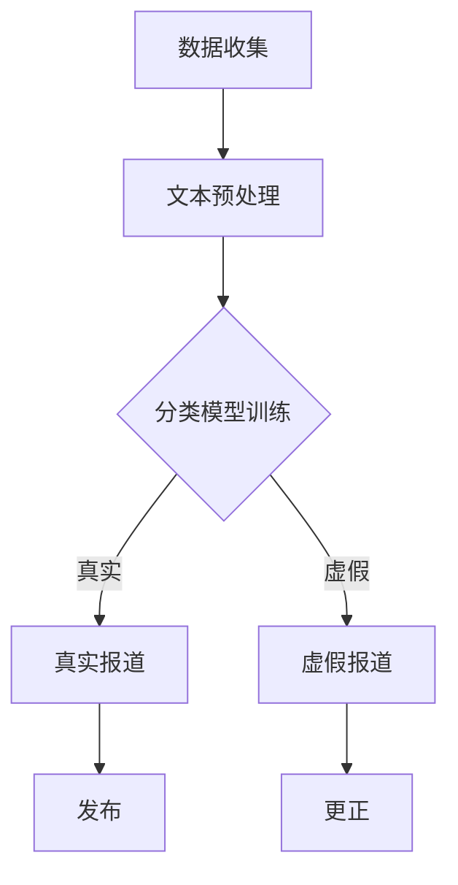

                 

关键词：人工智能、新闻、事实核查、算法、机器学习、深度学习、自然语言处理、信息验证

> 摘要：随着人工智能技术的飞速发展，新闻事实核查流程正经历着深刻的变革。本文将探讨人工智能如何通过机器学习和深度学习等技术，提高新闻事实核查的效率、准确性和全面性，同时分析这些技术在实际应用中面临的挑战和未来发展趋势。

## 1. 背景介绍

### 新闻事实核查的重要性

新闻事实核查（Fact-checking）是确保新闻报道真实性和准确性的重要环节。在信息爆炸的时代，虚假新闻、误报和谣言层出不穷，给公众、市场甚至社会稳定带来严重负面影响。新闻事实核查的目的是通过一系列验证手段，识别和揭露虚假信息，确保新闻报道的真实性和公正性。

### 人工核查的局限性

传统新闻事实核查主要依赖人工进行，包括记者、编辑和专业人士的判断。然而，人工核查面临以下局限性：

- **处理速度慢**：随着新闻事件数量的增加，人工核查的速度无法跟上。
- **主观性**：人工核查受个人经验和观点影响，难以避免主观偏见。
- **资源限制**：人工核查需要大量人力和时间成本，难以大规模应用。
- **信息覆盖不全**：人工核查难以覆盖到所有新闻来源，可能导致信息缺失。

### 人工智能的崛起

人工智能（AI）技术的发展为新闻事实核查提供了新的解决方案。通过机器学习和深度学习，AI系统可以自动分析、理解和处理大规模数据，提高事实核查的效率、准确性和全面性。此外，AI技术还可以辅助人类专家，提高整体核查质量。

## 2. 核心概念与联系

### 2.1 自然语言处理（NLP）

自然语言处理是AI的核心技术之一，它使计算机能够理解、处理和生成自然语言（如人类语言）。在新闻事实核查中，NLP技术主要用于：

- **文本分类**：将新闻报道文本分类为真实或虚假。
- **实体识别**：识别文本中的关键人物、地点、组织等。
- **情感分析**：分析文本中的情感倾向，判断报道是否偏颇。

### 2.2 机器学习和深度学习

机器学习和深度学习是AI的两大分支。机器学习通过训练模型来预测或分类数据，而深度学习则利用多层神经网络来模拟人类大脑的学习过程。

在新闻事实核查中，机器学习和深度学习技术主要用于：

- **特征提取**：从新闻报道中提取关键特征，用于训练模型。
- **模型训练**：使用大量标注数据训练模型，使其能够自动识别虚假新闻。
- **模型评估**：评估模型在验证数据上的性能，调整模型参数。

### 2.3 Mermaid 流程图

下面是新闻事实核查流程的Mermaid流程图：



### 3. 核心算法原理 & 具体操作步骤

#### 3.1 算法原理概述

新闻事实核查的核心算法通常是基于监督学习，特别是文本分类算法。算法通过训练大量已标注的真实和虚假新闻数据，构建分类模型。训练完成后，模型可以自动对新的新闻报道进行分类，判断其真实性。

#### 3.2 算法步骤详解

1. **数据收集**：收集大量已标注的真实和虚假新闻数据。这些数据可以来自公开数据集或专业事实核查机构。
2. **文本预处理**：对新闻报道文本进行清洗和格式化，包括去除停用词、标点符号、进行词干提取等。
3. **特征提取**：从预处理后的文本中提取关键特征，如词袋模型、TF-IDF等。
4. **模型训练**：使用已提取的特征和标注数据训练分类模型，如SVM、朴素贝叶斯、神经网络等。
5. **模型评估**：使用验证集评估模型性能，调整模型参数，优化模型。
6. **分类应用**：将训练好的模型应用于新的新闻报道，判断其真实性。

#### 3.3 算法优缺点

**优点**：

- **高效率**：能够快速处理大量新闻数据，提高核查速度。
- **客观性**：减少人工干预，降低主观偏见。
- **全面性**：能够覆盖更多新闻来源，提高信息覆盖面。

**缺点**：

- **数据依赖性**：模型性能高度依赖已标注数据的质量。
- **泛化能力**：对于未知或新类型的新闻可能存在识别困难。

#### 3.4 算法应用领域

- **媒体平台**：新闻网站、社交媒体等可以通过AI技术自动筛选和标记虚假新闻。
- **政府机构**：用于监控网络谣言、维护社会稳定。
- **商业应用**：企业可以利用AI技术进行市场监测、竞争对手分析等。

### 4. 数学模型和公式

#### 4.1 数学模型构建

新闻事实核查的数学模型通常基于逻辑回归、支持向量机（SVM）或神经网络等。以逻辑回归为例，其数学模型为：

$$
P(\text{虚假}) = \frac{1}{1 + e^{(-\beta_0 - \beta_1 x_1 - \beta_2 x_2 - \ldots - \beta_n x_n})}
$$

其中，$P(\text{虚假})$ 为新闻报道为虚假的概率，$x_1, x_2, \ldots, x_n$ 为特征，$\beta_0, \beta_1, \beta_2, \ldots, \beta_n$ 为模型参数。

#### 4.2 公式推导过程

逻辑回归模型的推导过程基于最大似然估计。具体推导过程如下：

1. **假设**：假设特征 $x_1, x_2, \ldots, x_n$ 与标签 $y$ 之间满足线性关系：

$$
y = \text{sign}(\beta_0 + \beta_1 x_1 + \beta_2 x_2 + \ldots + \beta_n x_n)
$$

2. **似然函数**：

$$
L(\theta) = \prod_{i=1}^n P(y_i | x_i; \theta)
$$

其中，$\theta = (\beta_0, \beta_1, \beta_2, \ldots, \beta_n)$。

3. **对数似然函数**：

$$
\ln L(\theta) = \sum_{i=1}^n \ln P(y_i | x_i; \theta)
$$

4. **梯度下降**：

对 $\ln L(\theta)$ 关于 $\theta$ 求导，并令导数为零，得到：

$$
\frac{\partial}{\partial \theta} \ln L(\theta) = 0
$$

经过一系列计算，可以得到逻辑回归模型的参数：

$$
\beta_0 = \beta_1 = \beta_2 = \ldots = \beta_n = \frac{1}{n} \sum_{i=1}^n (y_i - \text{sign}(\beta_0 + \beta_1 x_1 + \beta_2 x_2 + \ldots + \beta_n x_n))
$$

#### 4.3 案例分析与讲解

假设我们有一个简单的新闻数据集，包含两个特征：文本长度和文本中出现的关键词数量。我们使用逻辑回归模型进行事实核查。

1. **数据预处理**：将新闻文本进行预处理，提取文本长度和关键词数量。
2. **模型训练**：使用训练数据训练逻辑回归模型。
3. **模型评估**：使用验证集评估模型性能。
4. **应用模型**：对新的新闻报道应用模型，判断其真实性。

### 5. 项目实践：代码实例和详细解释说明

#### 5.1 开发环境搭建

- **Python**：安装Python 3.8及以上版本。
- **Scikit-learn**：安装Scikit-learn库，用于逻辑回归模型的训练和评估。
- **NLTK**：安装NLTK库，用于文本预处理。

#### 5.2 源代码详细实现

```python
import nltk
from nltk.tokenize import word_tokenize
from sklearn.feature_extraction.text import TfidfVectorizer
from sklearn.linear_model import LogisticRegression
from sklearn.model_selection import train_test_split
from sklearn.metrics import accuracy_score

# 数据预处理
def preprocess_text(text):
    tokens = word_tokenize(text.lower())
    filtered_tokens = [token for token in tokens if token.isalpha()]
    return " ".join(filtered_tokens)

# 加载数据
data = [...]  # 加载已标注的真实和虚假新闻数据
texts = [preprocess_text(text) for text in data['text']]
labels = data['label']

# 特征提取
vectorizer = TfidfVectorizer()
X = vectorizer.fit_transform(texts)
y = labels

# 模型训练
X_train, X_test, y_train, y_test = train_test_split(X, y, test_size=0.2, random_state=42)
model = LogisticRegression()
model.fit(X_train, y_train)

# 模型评估
y_pred = model.predict(X_test)
accuracy = accuracy_score(y_test, y_pred)
print("Accuracy:", accuracy)

# 应用模型
new_text = preprocess_text("新新闻报道的文本")
new_text_vectorized = vectorizer.transform([new_text])
prediction = model.predict(new_text_vectorized)
print("Prediction:", prediction)
```

#### 5.3 代码解读与分析

- **数据预处理**：使用NLTK库进行文本预处理，包括小写化、分词和去除非字母字符。
- **特征提取**：使用TF-IDF向量器提取文本特征。
- **模型训练**：使用Scikit-learn库训练逻辑回归模型。
- **模型评估**：使用测试集评估模型性能。
- **应用模型**：对新的新闻报道进行事实核查。

### 6. 实际应用场景

#### 6.1 媒体平台

新闻网站和社交媒体平台可以利用AI技术自动识别和标记虚假新闻，提高用户体验和平台可信度。例如，YouTube和Facebook已开始使用AI技术监控和过滤虚假视频和帖子。

#### 6.2 政府机构

政府机构和监管机构可以利用AI技术监测网络谣言和虚假信息，维护社会稳定。例如，英国政府使用AI技术监测社交媒体上的虚假信息，以应对选举期间的谣言传播。

#### 6.3 商业应用

企业可以利用AI技术进行市场监测、竞争对手分析和危机管理。例如，企业可以监控社交媒体上的负面评论，及时采取措施应对危机。

### 7. 工具和资源推荐

#### 7.1 学习资源推荐

- **《深度学习》（Goodfellow, Bengio, Courville）**：深度学习领域的经典教材。
- **《Python机器学习》（Sebastian Raschka）**：Python语言在机器学习领域的应用。

#### 7.2 开发工具推荐

- **TensorFlow**：Google开发的深度学习框架。
- **PyTorch**：Facebook开发的深度学习框架。

#### 7.3 相关论文推荐

- **“Deep Learning for Text Classification”**：讨论深度学习在文本分类中的应用。
- **“Neural Text Classification”**：介绍神经网络在文本分类中的最新进展。

### 8. 总结：未来发展趋势与挑战

#### 8.1 研究成果总结

近年来，AI技术在新闻事实核查领域取得了显著成果。通过机器学习和深度学习，AI系统在处理速度、准确性和全面性方面表现出色，为新闻事实核查提供了新的解决方案。

#### 8.2 未来发展趋势

未来，AI技术在新闻事实核查领域将继续发展，包括：

- **更先进的算法**：研发更高效的算法，提高事实核查的准确性和速度。
- **多模态数据融合**：结合文本、图像、音频等多模态数据，提高事实核查的全面性。
- **实时监测与预警**：实现实时监测和预警，快速识别和应对虚假信息。

#### 8.3 面临的挑战

尽管AI技术在新闻事实核查领域具有巨大潜力，但仍面临以下挑战：

- **数据质量和标注**：高质量、大规模的标注数据是训练高效模型的基础。
- **算法透明性和解释性**：提高算法的透明性和解释性，使其更具可信度和可接受性。
- **隐私保护**：在处理用户数据时，确保隐私保护。

#### 8.4 研究展望

未来，AI技术在新闻事实核查领域的应用将更加广泛和深入。通过不断优化算法、提高数据质量和加强合作，AI技术有望成为事实核查的重要工具，为构建真实、公正、可信的新闻环境贡献力量。

### 9. 附录：常见问题与解答

#### 问题1：AI技术能否完全取代人工核查？

解答：目前来看，AI技术还不能完全取代人工核查。虽然AI技术在处理速度和准确性方面具有优势，但在处理复杂、多变的信息时，人工核查仍然具有不可替代的作用。未来，AI技术可以与人类专家协同工作，共同提高事实核查的质量。

#### 问题2：如何确保AI系统的透明性和可解释性？

解答：确保AI系统的透明性和可解释性是当前研究的热点。可以通过以下方法提高AI系统的解释性：

- **模型可视化**：使用可视化工具展示模型的内部结构和决策过程。
- **可解释性算法**：研发具有可解释性的算法，如决策树、规则提取等。
- **合作与反馈**：与人类专家合作，不断优化和调整模型，提高其透明性和可接受性。

---

**作者：禅与计算机程序设计艺术 / Zen and the Art of Computer Programming**

