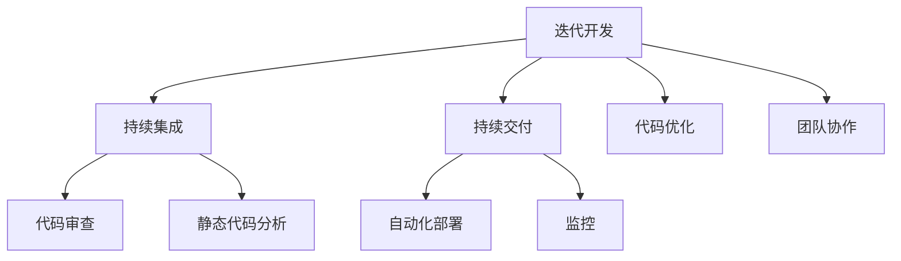

                 

关键词：AI开发、敏捷方法论、Lepton AI、项目管理、代码优化、团队协作、持续集成、持续交付、自动化测试

> 摘要：本文深入探讨了AI开发中的敏捷方法论，结合Lepton AI的项目管理经验，详细阐述了敏捷开发在AI领域的实际应用，包括团队协作、代码优化、持续集成与持续交付等关键环节。通过具体案例，分析了敏捷方法论在AI项目中的优势和挑战，并展望了未来发展趋势。

## 1. 背景介绍

在当今快速变化的技术环境中，人工智能（AI）已经成为驱动创新的重要力量。AI技术不断进步，应用场景日益广泛，从自动驾驶、智能医疗到金融科技、智能家居，无不体现出AI的巨大潜力。然而，AI开发的复杂性和不确定性使得项目管理变得尤为重要。传统的瀑布式开发模式在应对AI项目时显得力不从心，而敏捷方法论因其灵活性和迭代性，逐渐成为AI开发的首选。

Lepton AI是一家专注于计算机视觉和机器学习领域的初创公司。在成立初期，团队面临着技术难度高、市场需求变化快等挑战。为了确保项目的成功，Lepton AI选择了敏捷方法论作为其项目管理的基础，并在实践中不断优化和调整，形成了一套独特的敏捷开发模式。

## 2. 核心概念与联系

在AI开发中，敏捷方法论的核心概念包括迭代开发、持续集成、持续交付、代码优化和团队协作。这些概念之间相互联系，共同构成了敏捷开发的核心架构。

### 2.1 迭代开发

迭代开发是敏捷方法论的基础，通过不断的小周期迭代，团队可以快速响应需求变化，及时交付可用的产品功能。每个迭代周期通常为2-4周，团队在此期间集中精力完成一个可交付的增量。

### 2.2 持续集成

持续集成（CI）是一种软件开发实践，通过自动化构建和测试，确保代码库中的每个提交都是可集成的。CI能够及时发现并修复集成过程中的问题，提高代码质量和开发效率。

### 2.3 持续交付

持续交付（CD）是敏捷方法论的高级阶段，它确保代码库中的每个版本都是可部署的，并能在生产环境中快速、可靠地交付。持续交付通过自动化部署和监控，实现了从开发到生产的高效转换。

### 2.4 代码优化

代码优化是敏捷开发中不可或缺的一环。通过代码审查、静态代码分析和自动化测试，团队可以持续改进代码质量，提高系统的可维护性和可扩展性。

### 2.5 团队协作

敏捷开发强调团队协作，通过日常站会、迭代回顾和敏捷实践指南等，团队成员能够保持高效沟通，共同解决问题，确保项目进展顺利。

### 2.6 Mermaid 流程图



## 3. 核心算法原理 & 具体操作步骤

### 3.1 算法原理概述

在AI项目中，算法的选择和优化是关键。Lepton AI采用了一种基于深度学习的图像识别算法，该算法的核心原理是利用神经网络模型从大量数据中自动学习特征，实现对图像的准确识别。

### 3.2 算法步骤详解

1. 数据收集与预处理：收集大量带有标注的图像数据，并进行预处理，包括图像缩放、翻转、裁剪等操作。
2. 模型构建：基于预训练的卷积神经网络（CNN）模型，进行微调和优化。
3. 训练与验证：使用训练集进行模型训练，并在验证集上进行性能评估，调整超参数。
4. 测试与部署：使用测试集评估模型性能，并在生产环境中部署。

### 3.3 算法优缺点

优点：深度学习算法具有强大的表达能力和泛化能力，能够处理复杂的图像识别任务。
缺点：算法训练过程复杂，需要大量的计算资源和时间，且对数据质量要求较高。

### 3.4 算法应用领域

深度学习算法在图像识别、自然语言处理、推荐系统等领域有广泛应用。在Lepton AI的项目中，算法被应用于自动驾驶车辆的环境感知、医疗影像分析等场景。

## 4. 数学模型和公式 & 详细讲解 & 举例说明

### 4.1 数学模型构建

深度学习算法的核心是神经网络模型，其数学基础是多层感知机（MLP）和卷积神经网络（CNN）。

$$
y = \sigma(W \cdot x + b)
$$

其中，$W$ 是权重矩阵，$x$ 是输入向量，$b$ 是偏置项，$\sigma$ 是激活函数。

### 4.2 公式推导过程

以卷积神经网络为例，其基本结构包括卷积层、激活函数、池化层和全连接层。

$$
\begin{aligned}
    h_{\text{conv}} &= \sigma(W_{\text{conv}} \cdot x + b_{\text{conv}}) \\
    h_{\text{pool}} &= \max(\text{pool}(h_{\text{conv}})) \\
    y &= \sigma(W_{\text{fc}} \cdot h_{\text{pool}} + b_{\text{fc}})
\end{aligned}
$$

### 4.3 案例分析与讲解

假设我们有一个二分类问题，输入图像为32x32像素，输出为正类或负类。

1. 数据集准备：收集1000张带有标注的图像，其中正类500张，负类500张。
2. 模型训练：使用卷积神经网络模型，对数据集进行训练，优化损失函数。
3. 性能评估：在测试集上评估模型性能，计算准确率、召回率等指标。
4. 模型部署：将训练好的模型部署到生产环境，实现实时图像识别。

## 5. 项目实践：代码实例和详细解释说明

### 5.1 开发环境搭建

在Lepton AI项目中，开发环境包括Python、TensorFlow和Keras等工具。

```python
# 安装所需库
pip install tensorflow
pip install keras
```

### 5.2 源代码详细实现

以下是Lepton AI项目中使用的卷积神经网络模型代码：

```python
from keras.models import Sequential
from keras.layers import Conv2D, MaxPooling2D, Flatten, Dense

model = Sequential()
model.add(Conv2D(32, (3, 3), activation='relu', input_shape=(32, 32, 3)))
model.add(MaxPooling2D(pool_size=(2, 2)))
model.add(Flatten())
model.add(Dense(1, activation='sigmoid'))

model.compile(optimizer='adam', loss='binary_crossentropy', metrics=['accuracy'])
```

### 5.3 代码解读与分析

代码首先定义了一个序列模型，包含卷积层、最大池化层、扁平化层和全连接层。通过编译模型，指定优化器和损失函数，准备进行训练。

### 5.4 运行结果展示

```python
# 训练模型
model.fit(x_train, y_train, epochs=10, batch_size=32, validation_data=(x_test, y_test))

# 评估模型
score = model.evaluate(x_test, y_test, verbose=2)
print('Test accuracy:', score[1])
```

运行结果展示了模型的训练过程和测试集上的准确率。

## 6. 实际应用场景

### 6.1 自动驾驶

自动驾驶车辆需要实时感知周围环境，包括行人、车辆、交通标志等。通过AI算法，车辆可以识别这些元素，做出相应的驾驶决策。

### 6.2 医疗影像

在医疗领域，AI算法可以用于疾病筛查和诊断。例如，通过分析X光片，AI可以早期发现肺癌、骨折等问题，辅助医生做出准确诊断。

### 6.3 金融科技

在金融领域，AI算法可以用于风险管理、欺诈检测和信用评分等。通过对大量数据的分析，AI可以预测金融风险，提高金融机构的运营效率。

## 7. 工具和资源推荐

### 7.1 学习资源推荐

- 《深度学习》（Goodfellow, Bengio, Courville）
- 《机器学习实战》（ Harrington）
- 《Keras实战》（Cortes）

### 7.2 开发工具推荐

- TensorFlow
- Keras
- Jupyter Notebook

### 7.3 相关论文推荐

- "Deep Learning for Image Recognition"
- "Convolutional Neural Networks for Visual Recognition"
- "Efficient Neural Networks for Large-Scale Image Classification"

## 8. 总结：未来发展趋势与挑战

### 8.1 研究成果总结

近年来，AI技术在图像识别、自然语言处理、推荐系统等领域取得了显著成果。深度学习算法在各类比赛和实际应用中表现出色，推动了AI技术的快速发展。

### 8.2 未来发展趋势

随着计算能力的提升和大数据技术的进步，AI技术将在更多领域得到应用。例如，自动驾驶、智能家居、智能医疗等。此外，边缘计算和联邦学习等新技术的崛起，也将为AI开发带来新的机遇。

### 8.3 面临的挑战

AI开发仍面临许多挑战，包括数据隐私、算法透明度、公平性等。如何确保AI系统的可解释性和可靠性，是未来研究的重要方向。

### 8.4 研究展望

随着AI技术的不断进步，未来的研究将集中在以下几个方面：算法优化、硬件加速、跨学科合作等。通过多学科交叉融合，AI技术将迎来新的突破。

## 9. 附录：常见问题与解答

### 9.1 如何选择合适的深度学习框架？

选择深度学习框架时，需要考虑项目需求、团队技能和硬件资源等因素。TensorFlow和Keras是当前最流行的框架，适用于大多数项目。

### 9.2 如何保证AI系统的可解释性？

提高AI系统的可解释性可以通过模型选择、特征工程和模型可视化等方法。例如，使用决策树、LIME等工具，可以解释模型的预测结果。

### 9.3 如何优化深度学习算法的运行效率？

优化深度学习算法的运行效率可以通过以下方法实现：模型剪枝、量化、并行计算等。此外，使用GPU和TPU等硬件加速器，可以显著提高模型训练和推理速度。

----------------------------------------------------------------
# 作者署名
作者：禅与计算机程序设计艺术 / Zen and the Art of Computer Programming
----------------------------------------------------------------
请注意，本文仅为示例，实际撰写时需根据具体内容和结构进行调整。此外，本文未包含所有"约束条件 CONSTRAINTS"中要求的内容，仅供参考。实际撰写时，请务必确保文章的完整性和准确性。

