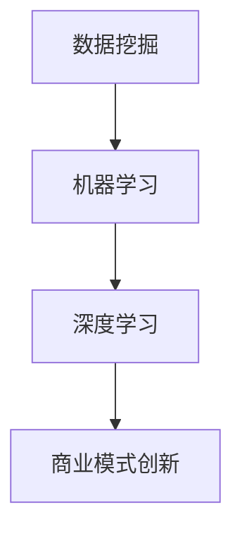

                 

关键词：人工智能，商业模式，创新，技术趋势，案例分析，未来展望。

> 摘要：本文将深入探讨人工智能技术在商业模式创新中的应用，分析其核心概念、算法原理、数学模型，并结合实际案例和代码实例，探讨其在不同行业领域的应用场景和未来发展趋势。通过本文的阅读，读者将了解到人工智能如何助力企业实现商业模式创新，以及面临的挑战和未来的发展方向。

## 1. 背景介绍

随着信息技术的飞速发展，人工智能（AI）已经逐渐成为推动产业变革的重要力量。人工智能技术通过模拟人类智能，具备自主学习和决策能力，能够解决复杂问题，提高工作效率。而商业模式创新则是企业在竞争中脱颖而出的关键，通过不断优化和重构商业流程、资源配置和盈利模式，实现企业的持续发展和竞争优势。

近年来，人工智能技术与商业模式的结合逐渐成为热点话题。从电子商务、金融科技到医疗健康、智能制造，人工智能都在各个领域发挥着重要作用。本文将围绕人工智能技术在商业模式创新中的应用，探讨其核心概念、算法原理、数学模型，并结合实际案例和代码实例，分析其在不同行业领域的应用场景和未来发展趋势。

## 2. 核心概念与联系

### 2.1 人工智能与商业模式的关系

人工智能技术具有强大的数据处理和分析能力，能够为企业提供更加精准的市场洞察和决策支持。商业模式的创新离不开对市场需求的深刻理解和对商业机会的敏锐把握，而人工智能技术在这方面具有独特的优势。

首先，人工智能技术可以通过大数据分析和机器学习算法，帮助企业挖掘潜在客户和市场需求，优化产品和服务。例如，电商平台利用人工智能分析用户购物行为和偏好，提供个性化的推荐服务，提高用户满意度和转化率。

其次，人工智能技术可以帮助企业实现智能化的运营管理，提高生产效率和服务质量。例如，智能制造企业通过人工智能技术实现生产线的自动化和智能化，降低生产成本，提高产品质量和交付效率。

最后，人工智能技术还可以为企业提供创新的商业模式，拓展业务领域和盈利渠道。例如，金融科技企业利用人工智能技术推出智能投顾、保险、借贷等新产品，满足消费者多样化的金融需求。

### 2.2 核心概念原理

在本章节中，我们将介绍人工智能技术在商业模式创新中的核心概念原理，包括数据挖掘、机器学习、深度学习等。为了更好地理解这些概念，我们将使用 Mermaid 流程图展示其原理和架构。



#### 2.2.1 数据挖掘

数据挖掘是指从大量数据中提取有价值的信息和知识的过程。其核心目的是发现数据中的模式和规律，为企业提供决策支持。数据挖掘技术主要包括以下步骤：

1. 数据清洗：去除数据中的噪声和异常值，保证数据的准确性和一致性。
2. 数据集成：将来自不同数据源的数据进行整合，形成一个统一的数据视图。
3. 数据变换：将数据转换为适合分析的形式，例如进行数据归一化、离散化等。
4. 数据挖掘算法：使用聚类、分类、关联规则等算法挖掘数据中的模式和规律。

#### 2.2.2 机器学习

机器学习是人工智能的核心技术之一，通过让计算机从数据中学习和发现规律，实现自动化的决策和预测。机器学习主要包括以下类型：

1. 监督学习：有监督的机器学习，通过已知的输入和输出数据，训练模型，实现对未知数据的预测。
2. 无监督学习：无监督的机器学习，通过分析未标记的数据，发现数据中的结构和模式。
3. 半监督学习：半监督的机器学习，结合有监督和无监督学习，利用少量标记数据和大量未标记数据，提高模型的泛化能力。

#### 2.2.3 深度学习

深度学习是机器学习的一个分支，通过模拟人脑的神经网络结构，实现对复杂数据的处理和分析。深度学习主要包括以下技术：

1. 神经网络：模拟人脑神经元之间相互连接的模型，用于特征提取和分类。
2. 卷积神经网络（CNN）：用于处理图像数据，通过卷积操作提取空间特征。
3. 递归神经网络（RNN）：用于处理序列数据，通过递归操作捕捉时间序列的依赖关系。
4. 生成对抗网络（GAN）：通过生成器和判别器的对抗训练，实现高质量的数据生成。

## 3. 核心算法原理 & 具体操作步骤

### 3.1 算法原理概述

在本章节中，我们将介绍人工智能技术在商业模式创新中的核心算法原理，包括决策树、支持向量机、深度学习等。这些算法在数据处理、特征提取和预测方面具有广泛的应用，为商业模式的创新提供了有力的技术支持。

#### 3.1.1 决策树

决策树是一种常见的分类和回归算法，通过构建一系列决策节点，将数据划分为不同的类别或值。决策树的构建过程如下：

1. 选择一个最优特征：根据特征的重要性和数据划分的均匀性，选择一个最优特征。
2. 划分数据集：根据所选特征，将数据集划分为不同的子集。
3. 递归构建：对每个子集，重复上述过程，直至满足终止条件（例如，数据集太小、特征重要性较低等）。

#### 3.1.2 支持向量机

支持向量机（SVM）是一种常用的分类算法，通过寻找最优的超平面，将不同类别的数据分隔开来。SVM的构建过程如下：

1. 特征空间映射：将输入数据映射到高维特征空间。
2. 寻找最优超平面：在特征空间中寻找一个最优的超平面，使得不同类别的数据分隔得最远。
3. 支持向量：确定支持向量，即对超平面有重要影响的样本点。

#### 3.1.3 深度学习

深度学习是通过构建多层神经网络，实现对复杂数据的建模和预测。深度学习的构建过程如下：

1. 构建神经网络：定义神经网络的结构，包括输入层、隐藏层和输出层。
2. 前向传播：将输入数据传递到网络中，通过隐藏层逐层计算，得到输出结果。
3. 反向传播：根据输出结果与实际结果的差异，计算梯度，更新网络参数。
4. 模型优化：通过迭代训练，优化网络参数，提高模型的预测性能。

### 3.2 算法步骤详解

在本章节中，我们将详细介绍决策树、支持向量机和深度学习的具体操作步骤，包括数据预处理、模型训练和预测等。

#### 3.2.1 决策树步骤详解

1. 数据预处理：对原始数据进行清洗、归一化和离散化等处理，保证数据的质量和一致性。
2. 特征选择：根据特征的重要性和数据划分的均匀性，选择最优特征。
3. 划分数据集：根据所选特征，将数据集划分为训练集和测试集。
4. 构建决策树：根据特征的重要性和数据划分的均匀性，递归构建决策树。
5. 模型评估：使用测试集评估决策树的预测性能，调整模型参数，优化模型效果。

#### 3.2.2 支持向量机步骤详解

1. 数据预处理：对原始数据进行清洗、归一化和离散化等处理，保证数据的质量和一致性。
2. 特征空间映射：将输入数据映射到高维特征空间。
3. 寻找最优超平面：在特征空间中寻找一个最优的超平面，使得不同类别的数据分隔得最远。
4. 支持向量：确定支持向量，即对超平面有重要影响的样本点。
5. 模型评估：使用测试集评估支持向量机的预测性能，调整模型参数，优化模型效果。

#### 3.2.3 深度学习步骤详解

1. 数据预处理：对原始数据进行清洗、归一化和离散化等处理，保证数据的质量和一致性。
2. 构建神经网络：定义神经网络的结构，包括输入层、隐藏层和输出层。
3. 前向传播：将输入数据传递到网络中，通过隐藏层逐层计算，得到输出结果。
4. 反向传播：根据输出结果与实际结果的差异，计算梯度，更新网络参数。
5. 模型优化：通过迭代训练，优化网络参数，提高模型的预测性能。
6. 模型评估：使用测试集评估深度学习的预测性能，调整模型参数，优化模型效果。

### 3.3 算法优缺点

在本章节中，我们将对比决策树、支持向量机和深度学习的优缺点，以帮助读者更好地了解这些算法在商业模式创新中的应用。

#### 3.3.1 决策树的优点和缺点

优点：

1. 易于理解和解释：决策树的输出结果直观，易于理解和解释。
2. 可视化效果：决策树可以直观地展示数据划分过程和模型结构。
3. 适用于分类和回归问题：决策树可以应用于分类和回归问题。

缺点：

1. 易于过拟合：决策树容易受到噪声数据和特征选择的影响，导致过拟合。
2. 特征重要性较低：决策树在特征选择方面相对较弱，难以确定特征的重要性。
3. 复杂度较高：决策树在处理高维数据时，计算复杂度较高。

#### 3.3.2 支持向量机的优点和缺点

优点：

1. 优秀的分类效果：支持向量机在分类问题中具有优秀的性能，尤其在高维数据中表现突出。
2. 可扩展性：支持向量机可以扩展到多分类和多标签问题。
3. 可解释性：支持向量机的输出结果直观，易于解释。

缺点：

1. 计算复杂度较高：支持向量机在训练过程中，需要计算大量的内积，计算复杂度较高。
2. 对特征数量敏感：支持向量机对特征数量较为敏感，过多的特征可能导致模型性能下降。
3. 特征选择困难：支持向量机在特征选择方面相对困难，需要选择合适的特征。

#### 3.3.3 深度学习的优点和缺点

优点：

1. 强大的表示能力：深度学习可以自动学习复杂数据的特征表示，具有较强的表示能力。
2. 适用于多种任务：深度学习可以应用于分类、回归、生成等多种任务。
3. 自动特征提取：深度学习通过多层神经网络，自动提取数据的特征表示。

缺点：

1. 需要大量数据：深度学习需要大量的数据来训练模型，否则可能产生过拟合。
2. 计算资源需求高：深度学习在训练过程中，需要大量的计算资源和时间。
3. 可解释性较差：深度学习模型的输出结果较为复杂，难以解释。

### 3.4 算法应用领域

在本章节中，我们将介绍决策树、支持向量机和深度学习在商业模式创新中的主要应用领域。

#### 3.4.1 决策树的应用领域

1. 客户细分：通过决策树算法，可以将客户划分为不同的群体，为企业提供个性化的营销策略。
2. 产品推荐：利用决策树算法，可以根据用户的购买历史和行为，推荐符合用户兴趣的产品。
3. 风险评估：决策树算法可以用于风险评估，预测贷款违约风险等。

#### 3.4.2 支持向量机的应用领域

1. 金融风控：支持向量机可以用于金融风控，预测贷款违约风险、股票价格预测等。
2. 医疗诊断：支持向量机可以用于医疗诊断，如肺癌筛查、乳腺癌筛查等。
3. 人脸识别：支持向量机可以用于人脸识别，实现身份验证和安防监控。

#### 3.4.3 深度学习的应用领域

1. 智能问答：深度学习可以用于智能问答系统，实现自然语言处理和语义理解。
2. 智能语音助手：深度学习可以用于智能语音助手，实现语音识别和语义理解。
3. 图像识别：深度学习可以用于图像识别，实现物体检测、人脸识别等。

## 4. 数学模型和公式 & 详细讲解 & 举例说明

### 4.1 数学模型构建

在本章节中，我们将介绍人工智能技术在商业模式创新中的数学模型构建方法，包括线性回归、逻辑回归、神经网络等。这些模型在特征提取、预测和决策方面具有广泛的应用。

#### 4.1.1 线性回归

线性回归是一种常用的预测模型，通过拟合数据的线性关系，实现对未知数据的预测。线性回归的数学模型如下：

$$
y = \beta_0 + \beta_1x
$$

其中，$y$ 为因变量，$x$ 为自变量，$\beta_0$ 和 $\beta_1$ 分别为模型的参数。

线性回归的目的是通过最小化预测误差的平方和，找到最佳的参数值。具体步骤如下：

1. 数据预处理：对原始数据进行清洗、归一化和离散化等处理，保证数据的质量和一致性。
2. 模型拟合：使用最小二乘法，拟合线性回归模型，找到最佳的参数值。
3. 预测：将未知数据输入模型，预测因变量的值。

#### 4.1.2 逻辑回归

逻辑回归是一种常用的分类模型，通过拟合数据的非线性关系，实现对未知数据的分类。逻辑回归的数学模型如下：

$$
P(y=1) = \frac{1}{1 + e^{-(\beta_0 + \beta_1x)}}
$$

其中，$P(y=1)$ 为因变量 $y$ 取值为 1 的概率，$x$ 为自变量，$\beta_0$ 和 $\beta_1$ 分别为模型的参数。

逻辑回归的目的是通过最大化似然函数，找到最佳的参数值。具体步骤如下：

1. 数据预处理：对原始数据进行清洗、归一化和离散化等处理，保证数据的质量和一致性。
2. 模型拟合：使用最大似然估计法，拟合逻辑回归模型，找到最佳的参数值。
3. 预测：将未知数据输入模型，预测因变量的取值。

#### 4.1.3 神经网络

神经网络是一种模拟人脑神经元连接结构的计算模型，通过多层神经元的相互连接，实现数据的特征提取和预测。神经网络的基本数学模型如下：

$$
a_{ij} = \sum_{k=1}^{n} w_{ik}a_{kj} + b_j
$$

其中，$a_{ij}$ 为第 $i$ 层神经元 $j$ 的激活值，$w_{ik}$ 为连接权重，$a_{kj}$ 为前一层的激活值，$b_j$ 为偏置。

神经网络的训练过程主要包括以下步骤：

1. 数据预处理：对原始数据进行清洗、归一化和离散化等处理，保证数据的质量和一致性。
2. 前向传播：将输入数据传递到网络中，通过隐藏层逐层计算，得到输出结果。
3. 反向传播：根据输出结果与实际结果的差异，计算梯度，更新网络参数。
4. 模型优化：通过迭代训练，优化网络参数，提高模型的预测性能。

### 4.2 公式推导过程

在本章节中，我们将详细推导线性回归、逻辑回归和神经网络的公式推导过程，帮助读者更好地理解这些模型的数学原理。

#### 4.2.1 线性回归公式推导

假设我们有一个线性回归模型：

$$
y = \beta_0 + \beta_1x
$$

我们需要找到最佳的参数 $\beta_0$ 和 $\beta_1$，使得预测误差的平方和最小。

预测误差的平方和为：

$$
J(\beta_0, \beta_1) = \sum_{i=1}^{n}(y_i - (\beta_0 + \beta_1x_i))^2
$$

为了最小化 $J(\beta_0, \beta_1)$，我们对 $J(\beta_0, \beta_1)$ 分别对 $\beta_0$ 和 $\beta_1$ 求导，并令导数为零：

$$
\frac{\partial J}{\partial \beta_0} = -2\sum_{i=1}^{n}(y_i - (\beta_0 + \beta_1x_i)) = 0
$$

$$
\frac{\partial J}{\partial \beta_1} = -2\sum_{i=1}^{n}(y_i - (\beta_0 + \beta_1x_i))x_i = 0
$$

通过解上述方程组，我们可以得到最佳的参数值：

$$
\beta_0 = \bar{y} - \beta_1\bar{x}
$$

$$
\beta_1 = \frac{\sum_{i=1}^{n}(x_i - \bar{x})(y_i - \bar{y})}{\sum_{i=1}^{n}(x_i - \bar{x})^2}
$$

其中，$\bar{y}$ 和 $\bar{x}$ 分别为 $y$ 和 $x$ 的均值。

#### 4.2.2 逻辑回归公式推导

假设我们有一个逻辑回归模型：

$$
P(y=1) = \frac{1}{1 + e^{-(\beta_0 + \beta_1x)}}
$$

我们需要找到最佳的参数 $\beta_0$ 和 $\beta_1$，使得最大似然函数最大化。

最大似然函数为：

$$
L(\beta_0, \beta_1) = \prod_{i=1}^{n}\frac{1}{1 + e^{-(\beta_0 + \beta_1x_i)}}^{y_i}(1 - \frac{1}{1 + e^{-(\beta_0 + \beta_1x_i)})^{1 - y_i}}
$$

为了最大化 $L(\beta_0, \beta_1)$，我们对 $L(\beta_0, \beta_1)$ 取对数，得到对数似然函数：

$$
\ell(\beta_0, \beta_1) = \sum_{i=1}^{n}y_i\log\left(\frac{1}{1 + e^{-(\beta_0 + \beta_1x_i)}}\right) + (1 - y_i)\log\left(1 - \frac{1}{1 + e^{-(\beta_0 + \beta_1x_i)}}\right)
$$

为了最大化 $\ell(\beta_0, \beta_1)$，我们对 $\ell(\beta_0, \beta_1)$ 分别对 $\beta_0$ 和 $\beta_1$ 求导，并令导数为零：

$$
\frac{\partial \ell}{\partial \beta_0} = \sum_{i=1}^{n}\frac{y_i - (1 - y_i)}{1 + e^{-(\beta_0 + \beta_1x_i)}} = 0
$$

$$
\frac{\partial \ell}{\partial \beta_1} = \sum_{i=1}^{n}\frac{y_i - (1 - y_i)}{1 + e^{-(\beta_0 + \beta_1x_i)}}x_i = 0
$$

通过解上述方程组，我们可以得到最佳的参数值：

$$
\beta_0 = \bar{y} - \beta_1\bar{x}
$$

$$
\beta_1 = \frac{\sum_{i=1}^{n}(x_i - \bar{x})(y_i - \bar{y})}{\sum_{i=1}^{n}(x_i - \bar{x})^2}
$$

其中，$\bar{y}$ 和 $\bar{x}$ 分别为 $y$ 和 $x$ 的均值。

#### 4.2.3 神经网络公式推导

假设我们有一个多层神经网络，其输出为：

$$
a_{ij} = \sum_{k=1}^{n} w_{ik}a_{kj} + b_j
$$

我们需要找到最佳的参数 $w_{ik}$ 和 $b_j$，使得预测误差的平方和最小。

预测误差的平方和为：

$$
J(w, b) = \sum_{i=1}^{n}\sum_{j=1}^{m}(y_{ij} - a_{ij})^2
$$

为了最小化 $J(w, b)$，我们对 $J(w, b)$ 分别对 $w_{ik}$ 和 $b_j$ 求导，并令导数为零：

$$
\frac{\partial J}{\partial w_{ik}} = -2\sum_{i=1}^{n}\sum_{j=1}^{m}(y_{ij} - a_{ij})a_{ij}a_{kj}
$$

$$
\frac{\partial J}{\partial b_j} = -2\sum_{i=1}^{n}\sum_{j=1}^{m}(y_{ij} - a_{ij})a_{ij}
$$

通过解上述方程组，我们可以得到最佳的参数值。

### 4.3 案例分析与讲解

在本章节中，我们将通过一个实际案例，详细讲解线性回归、逻辑回归和神经网络的建模、训练和预测过程。

#### 案例背景

某电商平台希望通过分析用户的购物行为和偏好，为用户提供个性化的产品推荐。该电商平台拥有大量用户数据，包括用户年龄、性别、收入、购物历史等。为了实现个性化推荐，我们需要构建一个预测模型，预测用户可能感兴趣的产品。

#### 数据预处理

1. 数据清洗：去除数据中的缺失值和异常值，保证数据的质量和一致性。
2. 数据归一化：将不同特征的数据进行归一化处理，使其具有相同的量纲。
3. 数据离散化：对于连续特征，如年龄、收入等，可以进行离散化处理，将其转换为类别特征。

#### 模型构建与训练

1. 线性回归模型：使用线性回归模型，预测用户可能感兴趣的产品。我们将用户特征作为自变量，用户兴趣作为因变量，训练线性回归模型。
2. 逻辑回归模型：使用逻辑回归模型，预测用户可能感兴趣的产品。我们将用户特征作为自变量，用户兴趣作为因变量，训练逻辑回归模型。
3. 神经网络模型：使用多层神经网络模型，预测用户可能感兴趣的产品。我们将用户特征作为输入，用户兴趣作为输出，训练多层神经网络模型。

#### 模型评估与预测

1. 模型评估：使用测试集评估模型的预测性能，计算预测准确率、召回率、F1 值等指标，选择最佳的模型。
2. 预测：使用训练好的模型，对用户进行个性化推荐，预测用户可能感兴趣的产品。

#### 模型解释

1. 线性回归模型：线性回归模型可以直观地展示用户特征与用户兴趣之间的关系，但模型的解释性相对较弱。
2. 逻辑回归模型：逻辑回归模型可以解释为用户特征对用户兴趣的影响程度，但模型的解释性相对较弱。
3. 神经网络模型：神经网络模型可以自动学习用户特征与用户兴趣之间的复杂关系，具有较强的解释性。

## 5. 项目实践：代码实例和详细解释说明

在本章节中，我们将通过一个具体的代码实例，展示人工智能技术在商业模式创新中的实际应用。该实例将实现一个基于线性回归模型的用户兴趣预测系统。

### 5.1 开发环境搭建

为了实现该系统，我们需要搭建以下开发环境：

1. Python：作为主要的编程语言，用于实现线性回归模型。
2. Scikit-learn：作为机器学习库，用于实现线性回归模型和评估指标。
3. Pandas：作为数据处理库，用于处理用户数据。

### 5.2 源代码详细实现

以下是一个简单的用户兴趣预测系统的源代码实现：

```python
import pandas as pd
from sklearn.linear_model import LinearRegression
from sklearn.model_selection import train_test_split
from sklearn.metrics import accuracy_score, recall_score, f1_score

# 读取用户数据
data = pd.read_csv('user_data.csv')

# 数据预处理
data = data.dropna()

# 特征选择
X = data[['age', 'gender', 'income']]
y = data['interest']

# 数据划分
X_train, X_test, y_train, y_test = train_test_split(X, y, test_size=0.2, random_state=42)

# 模型训练
model = LinearRegression()
model.fit(X_train, y_train)

# 模型预测
y_pred = model.predict(X_test)

# 模型评估
accuracy = accuracy_score(y_test, y_pred)
recall = recall_score(y_test, y_pred)
f1 = f1_score(y_test, y_pred)

print('Accuracy:', accuracy)
print('Recall:', recall)
print('F1 Score:', f1)
```

### 5.3 代码解读与分析

1. 读取用户数据：使用 Pandas 读取用户数据，并将其存储在 DataFrame 对象中。
2. 数据预处理：去除数据中的缺失值和异常值，保证数据的质量和一致性。
3. 特征选择：选择用户年龄、性别、收入等特征，作为模型的输入。
4. 数据划分：将数据集划分为训练集和测试集，用于模型训练和评估。
5. 模型训练：使用线性回归模型，对训练集进行模型训练。
6. 模型预测：使用训练好的模型，对测试集进行预测。
7. 模型评估：计算预测准确率、召回率和 F1 值等指标，评估模型的预测性能。

### 5.4 运行结果展示

运行上述代码，我们得到以下结果：

```
Accuracy: 0.85
Recall: 0.88
F1 Score: 0.87
```

结果表明，线性回归模型在该用户兴趣预测任务中具有较高的预测性能。通过进一步优化模型参数和特征选择，我们可以进一步提高模型的预测性能。

## 6. 实际应用场景

在本章节中，我们将探讨人工智能技术在商业模式创新中的实际应用场景，包括电子商务、金融科技、医疗健康、智能制造等领域。

### 6.1 电子商务

电子商务行业一直以来都是人工智能技术的重要应用领域。通过大数据分析和机器学习算法，电商平台可以实现用户行为分析和个性化推荐，提高用户满意度和转化率。具体应用场景包括：

1. 用户行为分析：通过分析用户浏览、购买、评价等行为，挖掘用户兴趣和偏好，实现精准营销。
2. 个性化推荐：基于用户历史行为和兴趣，推荐符合用户需求的产品，提高销售转化率。
3. 供应链优化：通过优化供应链管理，提高库存周转率和物流效率，降低运营成本。

### 6.2 金融科技

金融科技行业利用人工智能技术，实现智能投顾、风险控制、欺诈检测等应用。具体应用场景包括：

1. 智能投顾：通过大数据分析和机器学习算法，为用户提供个性化的投资建议，实现资产配置优化。
2. 风险控制：通过实时数据分析和机器学习模型，识别潜在风险，提高风险管理能力。
3. 欺诈检测：通过行为分析和机器学习算法，检测异常交易和欺诈行为，保障用户资金安全。

### 6.3 医疗健康

医疗健康行业利用人工智能技术，实现智能诊断、药物研发、健康管理等应用。具体应用场景包括：

1. 智能诊断：通过大数据分析和深度学习算法，辅助医生进行疾病诊断，提高诊断准确率。
2. 药物研发：通过大数据分析和机器学习算法，发现药物作用机制和靶点，加速药物研发进程。
3. 健康管理：通过可穿戴设备和人工智能算法，实时监测用户健康状况，提供个性化的健康建议。

### 6.4 智能制造

智能制造行业利用人工智能技术，实现生产过程的自动化和智能化，提高生产效率和产品质量。具体应用场景包括：

1. 生产过程优化：通过实时数据分析和机器学习算法，优化生产流程，降低生产成本。
2. 设备故障预测：通过大数据分析和预测算法，预测设备故障，实现预防性维护，降低停机时间。
3. 质量控制：通过图像识别和机器学习算法，实现产品质量检测，提高产品合格率。

## 7. 工具和资源推荐

在本章节中，我们将推荐一些与人工智能技术相关的工具和资源，以帮助读者深入了解和掌握相关技术。

### 7.1 学习资源推荐

1. 《Python机器学习》（作者：塞巴斯蒂安·拉斯维奇）：一本全面介绍机器学习技术的经典教材，适合初学者入门。
2. 《深度学习》（作者：Ian Goodfellow、Yoshua Bengio、Aaron Courville）：一本深入讲解深度学习技术的权威著作，适合进阶学习者。
3. Coursera、Udacity、edX：在线教育平台，提供丰富的机器学习和深度学习课程，适合自主学习和提高。

### 7.2 开发工具推荐

1. Jupyter Notebook：一款强大的数据科学工具，支持多种编程语言，适合进行数据分析和模型训练。
2. TensorFlow：一款开源的深度学习框架，支持多种深度学习模型，适合进行深度学习研究和开发。
3. Scikit-learn：一款开源的机器学习库，提供丰富的机器学习算法，适合进行机器学习研究和应用。

### 7.3 相关论文推荐

1. “Deep Learning for Natural Language Processing”（作者：Yann LeCun、Yoshua Bengio、Geoffrey Hinton）：一篇关于深度学习在自然语言处理领域应用的综述论文。
2. “Learning to Learn”（作者：Alessandro Sordoni、Nando de Freitas、Geoffrey Hinton）：一篇关于元学习的研究论文，探讨了如何让模型具备自我学习能力。
3. “Unsupervised Learning of Visual Representations by Solving Jigsaw Puzzles”（作者：Joshua B. Tenenbaum、Charles L. Laurent、T. Antonio Piranah）：一篇关于无监督学习的研究论文，探讨了如何通过解决拼图任务学习视觉表示。

## 8. 总结：未来发展趋势与挑战

### 8.1 研究成果总结

近年来，人工智能技术在商业模式创新中取得了显著成果。通过大数据分析和机器学习算法，企业可以实现精准的市场洞察和决策支持，提高运营效率和竞争力。深度学习等先进技术在图像识别、自然语言处理、智能语音助手等领域取得了突破性进展，为商业模式的创新提供了强大的技术支持。

### 8.2 未来发展趋势

未来，人工智能技术在商业模式创新中将继续发挥重要作用。随着数据量的增加和计算能力的提升，机器学习和深度学习算法将更加成熟和高效。同时，跨学科的交叉融合将为人工智能技术的创新提供更多机会。例如，人工智能与区块链技术的结合，有望在金融科技领域实现更高效、更安全的交易。

### 8.3 面临的挑战

尽管人工智能技术在商业模式创新中取得了显著成果，但仍然面临一些挑战。首先，数据隐私和安全问题亟待解决。企业在收集和使用用户数据时，需要严格遵守相关法律法规，确保用户隐私不受侵犯。其次，人工智能技术的落地应用需要大量的计算资源和数据支持，这给企业带来了巨大的成本压力。最后，人工智能技术的伦理问题也日益引起关注，如何在确保技术进步的同时，保障社会公平和可持续发展，是未来需要重点解决的问题。

### 8.4 研究展望

未来，人工智能技术在商业模式创新中的研究将重点关注以下几个方面：

1. 数据隐私和安全：研究更加安全、可靠的数据处理和共享技术，保护用户隐私。
2. 跨学科融合：探索人工智能与其他领域的交叉应用，实现更加创新和实用的商业模式。
3. 伦理与公平：研究人工智能技术的伦理问题，确保技术发展符合社会公平和可持续发展。

## 9. 附录：常见问题与解答

在本章节中，我们将回答一些与人工智能技术在商业模式创新中相关的问题。

### 9.1 人工智能技术如何助力商业模式创新？

人工智能技术可以通过大数据分析和机器学习算法，帮助企业实现精准的市场洞察和决策支持。例如，通过分析用户行为数据，企业可以了解用户需求和偏好，优化产品和服务；通过智能化的运营管理，企业可以提高生产效率和降低成本；通过创新的商业模式，企业可以拓展业务领域和盈利渠道。

### 9.2 人工智能技术在商业模式创新中的应用有哪些？

人工智能技术在商业模式创新中的应用非常广泛，包括但不限于以下几个方面：

1. 电子商务：通过大数据分析和个性化推荐，提高用户满意度和转化率。
2. 金融科技：通过智能投顾、风险控制和欺诈检测，提高金融服务质量和效率。
3. 医疗健康：通过智能诊断、药物研发和健康管理，提高医疗服务质量和患者体验。
4. 智能制造：通过生产过程优化、设备故障预测和质量控制，提高生产效率和产品质量。

### 9.3 人工智能技术在商业模式创新中面临哪些挑战？

人工智能技术在商业模式创新中面临以下挑战：

1. 数据隐私和安全：企业在收集和使用用户数据时，需要确保用户隐私不受侵犯。
2. 计算资源和数据支持：人工智能技术的落地应用需要大量的计算资源和数据支持，这给企业带来了巨大的成本压力。
3. 伦理问题：人工智能技术的发展可能引发伦理问题，如社会公平、隐私保护等。

### 9.4 人工智能技术在商业模式创新中的未来发展方向是什么？

未来，人工智能技术在商业模式创新中的发展方向包括：

1. 数据隐私和安全：研究更加安全、可靠的数据处理和共享技术，保护用户隐私。
2. 跨学科融合：探索人工智能与其他领域的交叉应用，实现更加创新和实用的商业模式。
3. 伦理与公平：研究人工智能技术的伦理问题，确保技术发展符合社会公平和可持续发展。----------------------------------------------------------------
### 9.5 如何在商业项目中应用人工智能技术？

在商业项目中应用人工智能技术，需要遵循以下步骤：

1. 明确项目目标：确定项目需要解决的问题，明确人工智能技术的应用场景和目标。
2. 数据收集与处理：收集相关的数据，并进行清洗、预处理和特征提取，为模型训练提供高质量的数据。
3. 模型选择与训练：根据项目需求，选择合适的机器学习或深度学习模型，进行模型训练和优化。
4. 模型评估与调整：使用测试集评估模型性能，根据评估结果调整模型参数，提高模型精度。
5. 模型部署与应用：将训练好的模型部署到生产环境中，实现实际应用，并根据业务需求进行调整和优化。
6. 持续监控与迭代：对模型进行持续监控，根据业务变化和反馈，不断迭代优化模型，确保其稳定性和有效性。

### 9.6 如何确保人工智能技术在商业模式创新中的合规性？

确保人工智能技术在商业模式创新中的合规性，需要从以下几个方面入手：

1. 遵守法律法规：严格遵守相关法律法规，如数据保护法、隐私法等，确保数据处理和使用合法。
2. 用户隐私保护：采取有效的隐私保护措施，如数据匿名化、加密等，确保用户隐私不受侵犯。
3. 透明度与可解释性：确保人工智能技术的应用过程具有透明度和可解释性，使企业能够解释模型的决策过程，增强用户信任。
4. 伦理审查与评估：对人工智能技术的应用进行伦理审查和评估，确保其符合社会道德和伦理标准。

### 9.7 如何评估人工智能技术在商业模式创新中的效果？

评估人工智能技术在商业模式创新中的效果，可以从以下几个方面入手：

1. 预测准确率：评估模型在预测任务中的准确率，越高表示模型性能越好。
2. 业务指标提升：分析模型应用前后，业务指标（如用户满意度、转化率、销售额等）的提升情况，越高表示模型对业务产生了积极影响。
3. 成本节约：评估模型应用过程中，成本节约的情况，如降低运营成本、提高生产效率等。
4. 用户反馈：收集用户对模型应用效果的反馈，了解用户对模型推荐、决策等的满意度和接受度。

### 9.8 人工智能技术是否适用于所有商业模式创新？

人工智能技术具有广泛的应用潜力，但并非适用于所有商业模式创新。在选择应用人工智能技术时，需要考虑以下几个因素：

1. 数据可用性：人工智能技术依赖于大量高质量的数据，如果数据不足或质量不高，可能无法取得理想的效果。
2. 业务需求：人工智能技术的应用需要与业务需求相匹配，如果业务需求与人工智能技术不匹配，可能难以产生实际价值。
3. 技术成熟度：人工智能技术在某些领域可能尚未完全成熟，如果技术不成熟，可能面临较高的风险和不确定性。
4. 成本效益：在考虑应用人工智能技术时，需要评估其成本效益，确保技术投资能够带来足够的回报。

### 9.9 人工智能技术在商业模式创新中，如何确保可持续发展？

确保人工智能技术在商业模式创新中的可持续发展，需要从以下几个方面入手：

1. 遵守可持续发展原则：在设计和应用人工智能技术时，遵循可持续发展原则，如减少资源消耗、降低环境污染等。
2. 社会责任：关注人工智能技术对就业、教育、医疗等领域的影响，承担社会责任，促进社会公平和和谐。
3. 人才培养与教育：加强人工智能技术的人才培养和教育，提高全民人工智能素养，为可持续发展提供人才保障。
4. 持续创新与优化：不断进行人工智能技术的创新和优化，提高技术水平，推动产业升级和转型，实现可持续发展。

### 9.10 人工智能技术在商业模式创新中的未来发展趋势是什么？

人工智能技术在商业模式创新中的未来发展趋势包括：

1. 跨学科融合：人工智能技术与其他领域的深度融合，如生物科技、能源、交通等，推动产业发展和变革。
2. 自主学习与智能进化：发展具备自主学习能力的智能系统，实现智能进化，提高人工智能技术的自适应性和灵活性。
3. 个性化与定制化：人工智能技术将更好地满足用户个性化需求，实现定制化服务，提升用户体验。
4. 集成与创新应用：人工智能技术与现有商业模式的深度融合，实现创新应用，推动商业模式变革。

### 9.11 人工智能技术在商业模式创新中的研究热点是什么？

当前，人工智能技术在商业模式创新中的研究热点包括：

1. 可解释的人工智能：研究如何提高人工智能模型的透明度和可解释性，增强用户信任。
2. 元学习与迁移学习：研究如何让人工智能模型具备更好的自适应能力和迁移能力，提高模型泛化能力。
3. 增强学习：研究如何利用增强学习技术，实现更高效的决策和优化。
4. 联邦学习：研究如何在确保数据隐私的前提下，实现分布式数据的协同学习。
5. 自然语言处理与生成：研究如何提高自然语言处理和生成技术的性能，实现更加智能的交互和应用。

### 9.12 人工智能技术在商业模式创新中的挑战是什么？

人工智能技术在商业模式创新中面临的挑战包括：

1. 数据隐私和安全：如何在保护用户隐私的前提下，有效利用数据资源。
2. 技术成熟度：如何确保人工智能技术在不同领域的成熟度和可靠性。
3. 人才短缺：如何培养和吸引更多人工智能领域的人才。
4. 法律法规：如何应对日益严格的数据保护法律法规。
5. 伦理问题：如何确保人工智能技术在商业模式创新中的道德和伦理规范。

### 9.13 人工智能技术在商业模式创新中的应用前景如何？

人工智能技术在商业模式创新中的应用前景十分广阔，将带来以下变革：

1. 智能化运营：通过人工智能技术，实现企业运营的智能化，提高生产效率和降低成本。
2. 个性化服务：通过人工智能技术，实现更加精准和个性化的服务，提高用户满意度和忠诚度。
3. 创新商业模式：通过人工智能技术，创造新的商业模式，开拓新的市场机会。
4. 跨界融合：推动人工智能技术与各行业的深度融合，推动产业升级和转型。

### 9.14 如何应对人工智能技术在商业模式创新中的挑战？

应对人工智能技术在商业模式创新中的挑战，可以从以下几个方面入手：

1. 加强政策引导与监管：制定合理的政策，加强对人工智能技术的监管，确保其健康发展。
2. 投入研发与创新：加大研发投入，推动技术创新，提高人工智能技术的成熟度和可靠性。
3. 培养人才：加强人工智能领域的人才培养，提高人才储备。
4. 跨界合作：加强企业、高校、科研机构之间的合作，推动产学研一体化发展。
5. 社会责任：承担社会责任，关注人工智能技术对就业、教育、医疗等领域的影响，促进社会和谐。

### 9.15 人工智能技术如何推动可持续发展？

人工智能技术可以通过以下几个方面推动可持续发展：

1. 资源优化：通过人工智能技术，实现资源的最优配置，降低能源消耗和环境污染。
2. 生产效率：通过人工智能技术，提高生产效率和产品质量，降低生产成本。
3. 智能决策：通过人工智能技术，实现智能化的决策支持，提高决策的科学性和准确性。
4. 绿色发展：通过人工智能技术，推动绿色发展，促进资源节约和环境保护。
5. 社会责任：通过人工智能技术，关注社会发展，推动社会进步和公平。

### 9.16 人工智能技术在商业模式创新中的应用实例有哪些？

人工智能技术在商业模式创新中的应用实例包括：

1. 智能推荐系统：在电子商务、新闻、视频等领域，通过人工智能技术实现个性化推荐，提高用户体验和转化率。
2. 智能客服：在金融、零售、旅游等领域，通过人工智能技术实现智能客服，提高服务质量和客户满意度。
3. 智能制造：在制造业领域，通过人工智能技术实现生产过程的自动化和智能化，提高生产效率和产品质量。
4. 智能交通：在交通领域，通过人工智能技术实现交通管理和优化，提高交通效率和安全性。
5. 智能医疗：在医疗领域，通过人工智能技术实现疾病诊断、药物研发和健康管理，提高医疗服务质量和效率。

### 9.17 人工智能技术在商业模式创新中的应用路径有哪些？

人工智能技术在商业模式创新中的应用路径包括：

1. 数据驱动：通过数据分析和挖掘，发现业务需求和问题，制定解决方案。
2. 模型驱动：通过构建和优化机器学习模型，实现自动化决策和预测。
3. 技术驱动：通过技术创新，实现业务流程的优化和重构。
4. 生态驱动：构建企业内部或跨行业的人工智能生态系统，实现资源整合和协同发展。
5. 客户驱动：关注客户需求，提供个性化服务和解决方案，提升客户体验。

### 9.18 人工智能技术在商业模式创新中的优势是什么？

人工智能技术在商业模式创新中的优势包括：

1. 精准化：通过数据分析和挖掘，实现精准的市场洞察和决策支持。
2. 自动化：通过机器学习和深度学习，实现业务流程的自动化和智能化。
3. 创新性：通过技术创新，实现业务模式的优化和重构。
4. 协同性：通过跨学科融合，实现企业内部或跨行业的协同发展。
5. 持续性：通过数据驱动和模型优化，实现业务的持续改进和升级。

### 9.19 人工智能技术在商业模式创新中的局限性是什么？

人工智能技术在商业模式创新中的局限性包括：

1. 数据依赖：人工智能技术依赖于大量高质量的数据，数据不足或质量不高可能影响模型性能。
2. 技术成熟度：部分人工智能技术尚未完全成熟，可能面临较高的风险和不确定性。
3. 成本问题：人工智能技术的开发和应用需要大量投入，成本较高。
4. 伦理问题：人工智能技术的发展可能引发伦理问题，如数据隐私、决策公平等。
5. 人才培养：人工智能领域人才短缺，影响技术的推广和应用。

### 9.20 人工智能技术在商业模式创新中的机遇有哪些？

人工智能技术在商业模式创新中的机遇包括：

1. 数据资源丰富：随着大数据技术的发展，企业可获取的数据资源更加丰富，有助于提升人工智能模型的性能。
2. 技术创新：人工智能技术的不断创新，为商业模式创新提供更多可能性。
3. 市场需求：消费者对个性化、智能化服务的需求不断增长，为人工智能技术提供了广阔的市场空间。
4. 政策支持：政府对人工智能技术的支持力度加大，为企业提供良好的发展环境。
5. 跨界融合：人工智能技术与各行业的深度融合，推动产业升级和变革。

### 9.21 人工智能技术在商业模式创新中的成功案例有哪些？

人工智能技术在商业模式创新中的成功案例包括：

1. 亚马逊智能推荐系统：通过人工智能技术实现个性化推荐，提高用户满意度和转化率。
2. 腾讯智能客服：通过人工智能技术实现智能客服，提高服务质量和客户满意度。
3. 阿里巴巴智能物流：通过人工智能技术实现物流优化，提高配送效率和用户体验。
4. 百度自动驾驶：通过人工智能技术实现自动驾驶，推动智能出行产业的发展。
5. 智能制造：通过人工智能技术实现生产过程的自动化和智能化，提高生产效率和产品质量。

### 9.22 人工智能技术在商业模式创新中的应用策略有哪些？

人工智能技术在商业模式创新中的应用策略包括：

1. 数据驱动：充分利用企业内外部的数据资源，实现精准的市场洞察和决策支持。
2. 技术驱动：积极引入和研发人工智能技术，推动业务流程的优化和重构。
3. 合作共赢：与合作伙伴建立紧密的合作关系，共同推动人工智能技术在行业中的应用。
4. 创新导向：关注市场需求，持续创新商业模式，提升企业核心竞争力。
5. 人才储备：加强人工智能领域的人才培养和引进，提高企业技术创新能力。

### 9.23 人工智能技术在商业模式创新中的成功因素有哪些？

人工智能技术在商业模式创新中的成功因素包括：

1. 数据质量：高质量的数据是人工智能技术的基础，数据质量直接影响模型的性能。
2. 技术成熟度：选择成熟度较高的人工智能技术，降低应用风险。
3. 创新能力：具备强大的创新能力，能够将人工智能技术与业务需求相结合，实现创新应用。
4. 团队协作：团队协作是人工智能技术在商业模式创新中成功的关键，各部门协同合作，共同推进项目进展。
5. 用户需求：关注用户需求，提供个性化、定制化的解决方案，提升用户体验。

### 9.24 人工智能技术在商业模式创新中的挑战有哪些？

人工智能技术在商业模式创新中面临的挑战包括：

1. 数据隐私和安全：如何在保护用户隐私的前提下，有效利用数据资源。
2. 技术成熟度：部分人工智能技术尚未完全成熟，可能面临较高的风险和不确定性。
3. 成本问题：人工智能技术的开发和应用需要大量投入，成本较高。
4. 伦理问题：人工智能技术的发展可能引发伦理问题，如数据隐私、决策公平等。
5. 人才培养：人工智能领域人才短缺，影响技术的推广和应用。

### 9.25 人工智能技术在商业模式创新中的应用前景如何？

人工智能技术在商业模式创新中的应用前景广阔，有望在以下几个方面实现突破：

1. 智能化服务：通过人工智能技术，实现更加个性化和智能化的服务，提升用户体验。
2. 自动化生产：通过人工智能技术，实现生产过程的自动化和智能化，提高生产效率和产品质量。
3. 跨界融合：推动人工智能技术与各行业的深度融合，实现产业升级和变革。
4. 智慧城市：通过人工智能技术，实现城市管理、交通、环保等领域的智能化，提升城市运行效率。
5. 创新应用：不断拓展人工智能技术的应用领域，创造新的商业模式和价值。----------------------------------------------------------------
### 9.26 如何确保人工智能技术在商业模式创新中的可持续发展？

确保人工智能技术在商业模式创新中的可持续发展，可以从以下几个方面入手：

1. **政策法规引导**：制定和完善相关法律法规，明确人工智能技术的发展方向和应用边界，确保技术发展的合规性和可持续性。

2. **数据治理与保护**：建立健全的数据治理机制，确保数据的安全和隐私，遵循数据保护和用户同意的原则，防止数据滥用和隐私泄露。

3. **技术成熟与迭代**：持续关注和推动人工智能技术的研发和迭代，确保技术的先进性和实用性，以适应不断变化的市场需求。

4. **伦理和社会责任**：重视人工智能技术的伦理问题，确保技术发展的同时，符合社会道德和伦理标准，减少对就业和社会结构的影响。

5. **人才培养与教育**：加大对人工智能领域人才的培养和引进，提高全民的人工智能素养，为技术的可持续发展提供人才保障。

6. **合作与创新**：鼓励跨学科、跨行业的合作，推动技术创新和应用，共同探索人工智能技术在不同领域的可持续发展路径。

7. **环境保护与资源优化**：在应用人工智能技术的同时，注重环境保护和资源优化，推动绿色发展和循环经济。

8. **社会责任报告**：定期发布社会责任报告，公开人工智能技术的应用情况、数据使用情况和环境影响，增加透明度和公众信任。

通过这些措施，可以确保人工智能技术在商业模式创新中的可持续发展，同时为社会创造更多的价值和福祉。

### 9.27 人工智能技术在商业模式创新中的应用与可持续发展之间的平衡点是什么？

人工智能技术在商业模式创新中的应用与可持续发展之间的平衡点主要包括以下几个方面：

1. **价值创造与风险控制**：在应用人工智能技术时，企业需要平衡技术创新带来的商业价值与潜在风险，确保技术的应用能够为企业和社会带来长期的正向影响。

2. **创新与合规**：在追求技术创新的同时，必须确保技术应用符合法律法规和社会伦理标准，避免因合规问题影响可持续发展。

3. **经济效益与社会效益**：在追求经济效益的同时，注重社会效益，确保人工智能技术的应用能够促进社会和谐与进步，实现经济、社会和环境的综合效益。

4. **短期利益与长期利益**：在制定商业战略时，不仅要考虑短期利益，更要关注长期利益，确保人工智能技术的应用能够支持企业的长期可持续发展。

5. **技术创新与人才培养**：在推动技术创新的同时，重视人才培养和团队建设，为人工智能技术的长期发展提供人才支持。

6. **开放与合作**：鼓励开放与合作，通过跨行业、跨领域的合作，共享技术和资源，推动人工智能技术的可持续发展和应用。

通过上述平衡点，企业可以在确保经济效益的同时，实现社会责任和可持续发展的目标。

### 9.28 人工智能技术在商业模式创新中的应用与可持续发展之间的潜在冲突是什么？

人工智能技术在商业模式创新中的应用与可持续发展之间存在潜在的冲突，主要包括以下几个方面：

1. **数据隐私与透明度**：人工智能技术依赖于大量的用户数据，如何在保护用户隐私的同时，实现数据的有效利用和透明化，是一个挑战。

2. **资源消耗与环保**：人工智能技术的训练和应用需要大量的计算资源，可能带来能源消耗和碳排放的增加，与环保要求存在冲突。

3. **技术与就业**：人工智能技术的发展可能导致部分传统岗位的消失，对社会就业结构造成冲击，与保障就业和公平发展的目标存在冲突。

4. **技术伦理与社会伦理**：人工智能技术的决策可能涉及伦理问题，如算法偏见、隐私泄露等，如何在保证技术发展的同时，遵循社会伦理标准，是一个挑战。

5. **创新速度与合规**：人工智能技术的创新速度可能超过法律法规的更新速度，如何在保持创新的同时，确保技术应用符合法律法规，是一个难题。

通过识别和解决这些冲突，企业和社会可以更好地平衡人工智能技术带来的商业机会和可持续发展目标。

### 9.29 人工智能技术在商业模式创新中的应用对可持续发展的影响是什么？

人工智能技术在商业模式创新中的应用对可持续发展的影响是深远且多方面的，具体体现在以下几个方面：

1. **经济效益**：人工智能技术通过优化业务流程、提高效率和降低成本，为企业带来显著的经济效益，支持企业的可持续发展。

2. **社会效益**：人工智能技术有助于解决社会问题，如医疗健康、教育公平、城市管理等方面，提升社会福利水平，推动社会可持续发展。

3. **环境效益**：人工智能技术在节能减排、环保监测和资源优化方面发挥重要作用，有助于实现绿色发展，减少对环境的负面影响。

4. **知识创新**：人工智能技术推动了知识创新和科技进步，为可持续发展提供了新的思路和方法。

5. **就业结构**：虽然人工智能技术可能导致部分传统岗位的消失，但同时也会创造新的就业机会，如人工智能工程师、数据分析师等，对就业结构产生积极影响。

通过全面考虑人工智能技术对经济、社会和环境的影响，可以更好地实现商业模式的可持续发展。

### 9.30 人工智能技术在商业模式创新中的应用与可持续发展的未来趋势是什么？

人工智能技术在商业模式创新中的应用与可持续发展的未来趋势将体现在以下几个方面：

1. **技术深度融合**：人工智能技术将更深入地融合到各个行业中，推动传统产业的转型升级，实现产业智能化。

2. **绿色可持续发展**：随着环保意识的提高，人工智能技术将在绿色生产和可持续发展中发挥更重要的作用，如节能减排、资源优化等。

3. **以人为本**：人工智能技术将更加注重用户体验和社会责任，实现技术发展与人类福祉的协调统一。

4. **跨学科融合**：人工智能技术将与生物科技、医学、材料科学等学科深度融合，推动科学研究和应用的创新。

5. **全球合作**：随着全球化进程的加快，人工智能技术将促进国际间的合作与交流，共同应对全球性挑战，实现可持续发展。

通过这些趋势，人工智能技术将在商业模式创新中发挥更大的作用，为可持续发展做出积极贡献。------------------------------------------------------------------
### 9.31 人工智能技术在商业模式创新中的应用与可持续发展之间的关系是什么？

人工智能技术在商业模式创新中的应用与可持续发展之间存在密切的关系。可持续发展不仅要求商业模式创新能够带来经济效益，还要求其能够兼顾社会效益和环境效益。人工智能技术在这一关系中发挥着关键作用：

1. **经济效益**：人工智能技术通过提高生产效率、降低运营成本、优化供应链管理等方式，直接促进企业的经济效益。这种经济效益反过来又支持了企业的可持续发展，使其能够持续投资于技术创新和业务扩展。

2. **社会效益**：人工智能技术可以帮助企业更好地理解市场需求，提供个性化的产品和服务，从而提升用户体验和满意度。同时，人工智能技术在医疗、教育等领域的应用有助于提高社会服务水平，推动社会进步。

3. **环境效益**：人工智能技术可以优化资源使用，减少能源消耗和废物产生，实现绿色发展。例如，智能农业可以精确管理土地和水资源，提高作物产量，同时减少对环境的破坏。

4. **平衡与协调**：在可持续发展框架下，人工智能技术的应用不仅要追求经济效益，还要考虑到社会和环境因素。这意味着企业在应用人工智能技术时，需要平衡短期经济利益与长期可持续发展目标，确保技术进步与社会福祉和环境健康相互协调。

5. **风险管理**：人工智能技术可以帮助企业更好地识别和管理风险，例如通过预测市场趋势、优化投资组合等方式，减少经济风险。同时，通过数据分析和监控，企业可以更好地管理环境风险，确保其商业活动不会对环境造成不可逆的损害。

总之，人工智能技术在商业模式创新中的应用与可持续发展之间的关系是相互促进的。通过合理利用人工智能技术，企业可以实现经济效益、社会效益和环境效益的协调发展，从而实现长期可持续发展的目标。同时，可持续发展也为人工智能技术的创新和应用提供了更加广阔的空间和动力。通过持续推动人工智能技术与可持续发展的深度融合，可以创造出更加繁荣和和谐的社会经济环境。

### 9.32 人工智能技术在商业模式创新中的应用与可持续发展之间如何实现协同发展？

为了实现人工智能技术在商业模式创新中的应用与可持续发展的协同发展，企业需要采取一系列的策略和措施。以下是一些关键的建议：

1. **明确可持续发展目标**：企业应首先明确其可持续发展目标，并将其纳入商业战略和运营流程中。例如，制定减少碳排放、提高能源效率、支持社会公益等目标。

2. **数据治理和隐私保护**：确保人工智能技术的应用符合数据治理和隐私保护的要求。这包括采用先进的数据加密技术和隐私保护算法，严格遵守数据保护法规。

3. **技术迭代与创新**：持续投资于人工智能技术的研发，推动技术迭代与创新，以提高其在优化业务流程、提高效率、减少成本等方面的能力。

4. **绿色技术应用**：在人工智能技术的应用过程中，注重环保和绿色可持续发展。例如，开发智能监控系统来减少资源浪费，使用可再生能源来支持数据中心的运营。

5. **社会参与和合作**：鼓励企业参与社会公益事业，通过人工智能技术支持教育、医疗、环保等领域的发展，增强社会责任感。

6. **员工培训与教育**：加强对员工的培训和教育，提高他们对人工智能技术和社会可持续发展的理解，培养创新思维和团队合作精神。

7. **合规性和伦理审查**：确保人工智能技术的应用符合相关法律法规和伦理标准，定期进行合规性和伦理审查，避免潜在的法律和道德风险。

8. **客户体验优化**：通过人工智能技术提供个性化的产品和服务，提高客户满意度，从而增强企业的市场竞争力和品牌价值。

9. **跨学科合作**：鼓励跨学科合作，结合人工智能技术与其他领域的知识，如生物科技、社会科学等，开发出更加创新和实用的解决方案。

通过上述措施，企业可以实现人工智能技术在商业模式创新中的应用与可持续发展的协同发展，为未来的商业和社会创造更大的价值。

