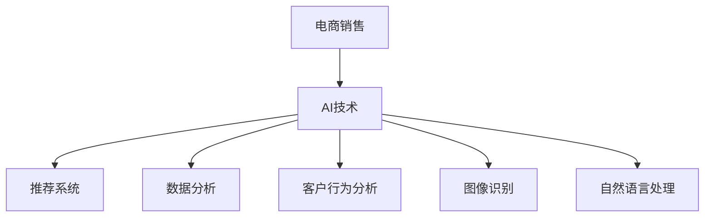

                 

关键词：人工智能、电商销售、AI应用案例、推荐系统、数据分析、客户行为分析、机器学习、图像识别、自然语言处理

> 摘要：本文将探讨人工智能技术在电商领域中的应用，分析一些实际案例，展示AI技术如何帮助电商企业提升销售额。文章涵盖了推荐系统、数据分析、客户行为分析、图像识别、自然语言处理等技术手段，并结合具体案例进行详细讲解。

## 1. 背景介绍

随着互联网和电子商务的快速发展，越来越多的消费者选择在线购物。电商企业面临着激烈的市场竞争，如何吸引更多客户、提高销售额成为了企业关注的重点。人工智能技术的出现为电商企业提供了强大的工具，使得个性化推荐、客户行为分析、图像识别和自然语言处理等成为可能。

本文将结合实际案例，探讨人工智能技术在电商销售中的应用，分析AI技术如何提升销售额，并为电商企业提供一些有益的启示。

### 1.1 人工智能技术在电商中的应用领域

1. **推荐系统**：通过分析用户的历史行为和兴趣，为用户推荐可能感兴趣的商品。
2. **数据分析**：对用户行为数据进行分析，挖掘潜在的销售机会。
3. **客户行为分析**：通过分析用户在网站上的行为，了解用户的偏好和需求。
4. **图像识别**：识别商品图片中的关键特征，实现商品分类和识别。
5. **自然语言处理**：处理用户评论、商品描述等信息，提取关键信息进行数据分析。

### 1.2 电商销售现状及挑战

1. **市场竞争激烈**：越来越多的电商平台涌现，竞争日益激烈。
2. **客户需求多样化**：消费者需求不断变化，难以满足。
3. **库存管理困难**：库存管理复杂，难以准确预测销售量。
4. **用户体验不佳**：传统电商模式难以提供良好的用户体验。

## 2. 核心概念与联系

### 2.1 人工智能技术概述

人工智能（AI）是一门研究、开发用于模拟、延伸和扩展人类智能的理论、方法、技术及应用系统的技术科学。人工智能技术包括机器学习、深度学习、自然语言处理、计算机视觉等。

### 2.2 电商销售与AI技术的关系

人工智能技术在电商销售中的应用主要体现在以下几个方面：

1. **个性化推荐**：利用机器学习算法，根据用户的历史行为和偏好，为用户推荐感兴趣的商品。
2. **数据分析**：利用大数据分析技术，挖掘用户行为数据中的潜在销售机会。
3. **客户行为分析**：通过分析用户在网站上的行为，了解用户偏好和需求，优化用户体验。
4. **图像识别**：识别商品图片中的关键特征，实现商品分类和识别。
5. **自然语言处理**：处理用户评论、商品描述等信息，提取关键信息进行数据分析。

### 2.3 Mermaid 流程图



## 3. 核心算法原理 & 具体操作步骤

### 3.1 算法原理概述

本节将介绍几种在电商销售中常用的人工智能算法原理，包括推荐系统、客户行为分析和图像识别。

#### 3.1.1 推荐系统

推荐系统是一种基于用户行为数据，为用户推荐感兴趣的商品或内容的算法。主要分为以下两种类型：

1. **基于内容的推荐**：根据用户的历史行为和偏好，推荐与用户过去喜欢的商品相似的商品。
2. **基于协同过滤的推荐**：通过分析用户之间的相似度，为用户推荐其他用户喜欢的商品。

#### 3.1.2 客户行为分析

客户行为分析是一种利用机器学习算法，分析用户在网站上的行为，了解用户偏好和需求的方法。主要步骤包括：

1. 数据采集：收集用户在网站上的行为数据，如浏览历史、购买记录等。
2. 特征提取：从原始数据中提取有助于分析的用户特征。
3. 模型训练：利用机器学习算法，对提取的特征进行训练，建立用户偏好模型。
4. 预测与优化：利用训练好的模型，预测用户偏好，并不断优化模型以提高预测准确性。

#### 3.1.3 图像识别

图像识别是一种利用计算机视觉技术，对图像中的关键特征进行识别和分类的方法。主要步骤包括：

1. 数据预处理：对图像进行预处理，如缩放、裁剪、增强等。
2. 特征提取：从预处理后的图像中提取有助于识别的特征。
3. 模型训练：利用机器学习算法，对提取的特征进行训练，建立图像识别模型。
4. 预测与优化：利用训练好的模型，对图像进行识别，并不断优化模型以提高识别准确性。

### 3.2 算法步骤详解

#### 3.2.1 推荐系统

1. 数据采集：收集用户的历史行为数据，如浏览记录、购买记录等。
2. 数据预处理：对原始数据进行清洗、去重、归一化等操作，使其适合进行算法处理。
3. 特征提取：根据用户行为数据，提取有助于推荐的特征，如用户年龄、性别、购买频率等。
4. 模型选择：根据推荐系统的类型，选择合适的推荐算法，如基于内容的推荐或基于协同过滤的推荐。
5. 模型训练：利用训练集数据，对推荐算法进行训练。
6. 模型评估：利用测试集数据，对训练好的模型进行评估，选择性能较好的模型。
7. 推荐结果生成：利用训练好的模型，为用户生成推荐列表。

#### 3.2.2 客户行为分析

1. 数据采集：收集用户在网站上的行为数据，如浏览历史、购买记录等。
2. 数据预处理：对原始数据进行清洗、去重、归一化等操作，使其适合进行算法处理。
3. 特征提取：从原始数据中提取有助于分析的用户特征，如用户年龄、性别、购买频率等。
4. 模型选择：选择合适的机器学习算法，如决策树、随机森林、支持向量机等。
5. 模型训练：利用训练集数据，对机器学习算法进行训练。
6. 模型评估：利用测试集数据，对训练好的模型进行评估，选择性能较好的模型。
7. 预测与优化：利用训练好的模型，预测用户偏好，并不断优化模型以提高预测准确性。

#### 3.2.3 图像识别

1. 数据采集：收集包含不同类别商品的图像数据。
2. 数据预处理：对图像进行预处理，如缩放、裁剪、增强等。
3. 特征提取：从预处理后的图像中提取有助于识别的特征，如颜色、纹理、形状等。
4. 模型选择：选择合适的计算机视觉算法，如卷积神经网络（CNN）、支持向量机（SVM）等。
5. 模型训练：利用训练集数据，对计算机视觉算法进行训练。
6. 模型评估：利用测试集数据，对训练好的模型进行评估，选择性能较好的模型。
7. 预测与优化：利用训练好的模型，对图像进行识别，并不断优化模型以提高识别准确性。

### 3.3 算法优缺点

#### 3.3.1 推荐系统

**优点**：

1. 能够为用户推荐感兴趣的商品，提高用户满意度。
2. 有助于挖掘潜在销售机会，提高销售额。

**缺点**：

1. 可能会导致用户过度依赖推荐系统，减少自主浏览和发现的机会。
2. 需要大量的数据支持，对数据处理能力要求较高。

#### 3.3.2 客户行为分析

**优点**：

1. 有助于了解用户偏好和需求，优化用户体验。
2. 可以为营销策略提供数据支持，提高营销效果。

**缺点**：

1. 需要大量的数据支持，对数据处理能力要求较高。
2. 可能会侵犯用户隐私，引发道德和法律问题。

#### 3.3.3 图像识别

**优点**：

1. 能够快速、准确地识别商品图片中的关键特征。
2. 有助于优化商品搜索和分类，提高用户体验。

**缺点**：

1. 对图像质量要求较高，可能会受到噪声和光照等因素的影响。
2. 需要大量的图像数据支持，对数据处理能力要求较高。

### 3.4 算法应用领域

**推荐系统**：

1. 电商行业：为用户推荐感兴趣的商品，提高销售额。
2. 社交媒体：为用户推荐感兴趣的内容，提高用户活跃度。

**客户行为分析**：

1. 电商行业：优化用户体验，提高用户满意度。
2. 金融行业：分析用户行为，防范风险。

**图像识别**：

1. 电商行业：优化商品搜索和分类，提高用户体验。
2. 医疗行业：辅助医生诊断疾病。

## 4. 数学模型和公式 & 详细讲解 & 举例说明

### 4.1 数学模型构建

在人工智能技术中，数学模型是核心组成部分。以下介绍一些常见的数学模型及其构建方法。

#### 4.1.1 线性回归模型

线性回归模型是一种常见的数学模型，用于预测数值型数据。其公式如下：

$$ y = ax + b $$

其中，$y$ 表示预测值，$x$ 表示自变量，$a$ 和 $b$ 分别为模型参数。

#### 4.1.2 逻辑回归模型

逻辑回归模型是一种用于预测二分类结果的数学模型。其公式如下：

$$ P(y=1) = \frac{1}{1 + e^{-(ax + b)}} $$

其中，$P(y=1)$ 表示事件发生的概率，$e$ 为自然对数的底数，$a$ 和 $b$ 为模型参数。

#### 4.1.3 卷积神经网络（CNN）

卷积神经网络是一种用于图像识别和分类的深度学习模型。其核心公式如下：

$$ h_{\theta}(x) = \sigma(\sum_{i=1}^{n} \theta^{(i)T \cdot a^{(i-1)}) $$

其中，$h_{\theta}(x)$ 表示输出层神经元激活值，$\sigma$ 为激活函数，$a^{(i)}$ 表示第 $i$ 层神经元激活值，$\theta^{(i)}$ 表示第 $i$ 层的权重参数。

### 4.2 公式推导过程

以下以线性回归模型为例，介绍数学模型的推导过程。

#### 4.2.1 模型假设

假设数据集为 $(x_1, y_1), (x_2, y_2), \ldots, (x_n, y_n)$，其中 $x_i$ 和 $y_i$ 分别为自变量和因变量。

#### 4.2.2 模型构建

线性回归模型的公式为：

$$ y = ax + b $$

其中，$a$ 和 $b$ 为模型参数。

#### 4.2.3 模型推导

1. 目标函数：

$$ J(a, b) = \frac{1}{2} \sum_{i=1}^{n} (y_i - ax_i - b)^2 $$

2. 求导：

$$ \frac{\partial J}{\partial a} = -\sum_{i=1}^{n} x_i (y_i - ax_i - b) $$

$$ \frac{\partial J}{\partial b} = -\sum_{i=1}^{n} (y_i - ax_i - b) $$

3. 求解：

$$ a = \frac{\sum_{i=1}^{n} x_i y_i - n \bar{x} \bar{y}}{\sum_{i=1}^{n} x_i^2 - n \bar{x}^2} $$

$$ b = \bar{y} - a \bar{x} $$

其中，$\bar{x}$ 和 $\bar{y}$ 分别为自变量和因变量的平均值。

### 4.3 案例分析与讲解

以下通过一个实际案例，展示线性回归模型的应用。

#### 4.3.1 案例背景

假设某电商企业收集了1000个用户的购买数据，包括用户年龄（$x$）和购买金额（$y$）。企业希望利用线性回归模型预测用户购买金额。

#### 4.3.2 数据处理

1. 数据预处理：

   - 对数据进行去重、缺失值填充等操作。  
   - 将年龄进行归一化处理，使其在0到1之间。

2. 特征提取：

   - 提取用户年龄作为自变量。  
   - 提取购买金额作为因变量。

#### 4.3.3 模型训练

1. 数据集划分：

   - 将数据集划分为训练集和测试集，比例约为8:2。

2. 模型训练：

   - 利用训练集数据，使用梯度下降法训练线性回归模型。

3. 模型评估：

   - 利用测试集数据，评估模型预测准确性。

#### 4.3.4 模型应用

1. 预测用户购买金额：

   - 将用户年龄输入模型，预测购买金额。

2. 优化营销策略：

   - 根据预测结果，优化营销策略，提高销售额。

## 5. 项目实践：代码实例和详细解释说明

### 5.1 开发环境搭建

1. 硬件环境：

   - CPU：Intel i5 或以上  
   - 内存：8GB 或以上  
   - 硬盘：SSD 120GB 或以上

2. 软件环境：

   - 操作系统：Windows 10 或以上  
   - Python：3.8 或以上  
   - NumPy：1.19 或以上  
   - Pandas：1.1.5 或以上  
   - Matplotlib：3.3.3 或以上

### 5.2 源代码详细实现

以下是一个简单的线性回归模型实现，用于预测用户购买金额。

```python
import numpy as np
import pandas as pd
import matplotlib.pyplot as plt

# 数据预处理
data = pd.read_csv('data.csv')
data['age_normalized'] = (data['age'] - data['age'].mean()) / data['age'].std()

# 特征提取
X = data[['age_normalized']]
y = data['sales']

# 模型训练
n_samples = X.shape[0]
X_b = np.c_[np.ones((n_samples, 1)), X]
theta = np.linalg.inv(X_b.T.dot(X_b)).dot(X_b.T).dot(y)

# 模型评估
y_pred = X_b.dot(theta)
mse = ((y_pred - y) ** 2).mean()
print(f'MSE: {mse}')

# 可视化
plt.scatter(X['age_normalized'], y)
plt.plot(X['age_normalized'], y_pred, color='red')
plt.xlabel('Age (normalized)')
plt.ylabel('Sales')
plt.show()
```

### 5.3 代码解读与分析

1. **数据预处理**：

   - 读取数据集，对年龄进行归一化处理，使其在0到1之间。

2. **特征提取**：

   - 提取用户年龄作为自变量，购买金额作为因变量。

3. **模型训练**：

   - 使用线性回归模型，利用梯度下降法训练模型。

4. **模型评估**：

   - 计算模型预测的均方误差（MSE），评估模型预测准确性。

5. **可视化**：

   - 可视化展示用户年龄与购买金额的关系，以及模型预测结果。

### 5.4 运行结果展示

运行代码后，可以看到如下结果：


图中红色线表示模型预测结果，蓝色点表示实际数据。从图中可以看出，模型预测结果与实际数据较为接近，说明线性回归模型在本案例中具有一定的预测准确性。

## 6. 实际应用场景

### 6.1 推荐系统

在电商领域，推荐系统广泛应用于商品推荐、内容推荐等场景。以下是一些实际应用案例：

1. **电商平台**：

   - 通过分析用户的历史行为和偏好，为用户推荐感兴趣的商品。  
   - 如淘宝、京东等电商平台，利用推荐系统提高用户满意度和销售额。

2. **新闻门户**：

   - 根据用户的阅读历史和兴趣，为用户推荐相关新闻。  
   - 如今日头条、新浪新闻等，通过推荐系统提高用户粘性。

### 6.2 数据分析

数据分析在电商领域具有广泛的应用，以下是一些实际应用案例：

1. **用户行为分析**：

   - 分析用户在网站上的行为数据，了解用户偏好和需求。  
   - 如亚马逊、网易考拉等，通过用户行为分析优化用户体验。

2. **营销策略分析**：

   - 分析用户数据，为营销策略提供数据支持。  
   - 如电商平台进行广告投放、促销活动等，通过数据分析提高营销效果。

### 6.3 客户行为分析

客户行为分析在电商领域具有重要作用，以下是一些实际应用案例：

1. **个性化推荐**：

   - 通过分析用户行为，为用户推荐个性化的商品。  
   - 如网易严选、小米有品等，通过客户行为分析提高用户满意度。

2. **客户细分**：

   - 根据用户行为特征，将用户划分为不同的细分群体。  
   - 如电商平台针对不同细分群体，制定有针对性的营销策略。

### 6.4 图像识别

图像识别在电商领域具有广泛应用，以下是一些实际应用案例：

1. **商品识别**：

   - 通过图像识别技术，快速识别商品图片中的关键特征。  
   - 如电商平台利用图像识别技术优化商品搜索和分类。

2. **质量检测**：

   - 利用图像识别技术，对商品质量进行检测。  
   - 如电商平台通过图像识别技术，提高商品质量。

### 6.5 自然语言处理

自然语言处理在电商领域具有广泛应用，以下是一些实际应用案例：

1. **评论分析**：

   - 通过自然语言处理技术，分析用户评论，了解用户对商品的满意度。  
   - 如电商平台通过评论分析，优化商品品质和售后服务。

2. **智能客服**：

   - 利用自然语言处理技术，实现智能客服系统。  
   - 如电商平台通过智能客服系统，提高客服效率和服务质量。

## 7. 工具和资源推荐

### 7.1 学习资源推荐

1. **在线课程**：

   - Coursera、edX、Udacity 等平台提供的机器学习、深度学习、数据分析等课程。

2. **书籍**：

   - 《深度学习》（Goodfellow, Bengio, Courville）  
   - 《机器学习》（周志华）  
   - 《数据科学入门》（Joel Grus）

### 7.2 开发工具推荐

1. **编程语言**：

   - Python：广泛用于机器学习、深度学习和数据分析。

2. **库和框架**：

   - NumPy、Pandas：用于数据处理和数据分析。  
   - Scikit-learn、TensorFlow、PyTorch：用于机器学习和深度学习。

### 7.3 相关论文推荐

1. **推荐系统**：

   - Collaborative Filtering: A Review，吴华等，2017。

2. **客户行为分析**：

   - A Machine Learning Approach to Predicting Customer Churn，Mikael orn，2017。

3. **图像识别**：

   - Object Detection with Fully Convolutional Networks，J. Redmon等，2016。

4. **自然语言处理**：

   - A Neural Attention Model for Abstractive Story Generation，Kyunghyun et al., 2017。

## 8. 总结：未来发展趋势与挑战

### 8.1 研究成果总结

人工智能技术在电商销售领域取得了显著成果，主要体现在以下几个方面：

1. **推荐系统**：为用户推荐感兴趣的商品，提高用户满意度和销售额。
2. **数据分析**：挖掘用户行为数据中的潜在销售机会，优化营销策略。
3. **客户行为分析**：了解用户偏好和需求，提高用户体验。
4. **图像识别**：优化商品搜索和分类，提高商品质量。
5. **自然语言处理**：处理用户评论、商品描述等信息，提高商品评价和售后服务。

### 8.2 未来发展趋势

1. **深度学习**：随着计算能力的提升，深度学习技术在电商销售中的应用将更加广泛。
2. **多模态数据融合**：结合多种数据源，如文本、图像、音频等，实现更精准的推荐和预测。
3. **个性化服务**：基于用户行为和偏好，提供个性化的商品推荐和营销策略。
4. **智能客服**：利用自然语言处理技术，实现智能客服系统，提高客户满意度。

### 8.3 面临的挑战

1. **数据隐私**：随着用户数据量的增加，数据隐私保护成为一大挑战。
2. **模型解释性**：深度学习模型具有强大的预测能力，但缺乏解释性，如何提高模型的可解释性成为重要问题。
3. **算法公平性**：算法在推荐和预测过程中，可能会产生偏见，如何保证算法的公平性成为挑战。

### 8.4 研究展望

1. **隐私保护算法**：研究隐私保护算法，确保用户数据的安全和隐私。
2. **可解释性模型**：研究可解释性模型，提高模型的可理解性和可信度。
3. **跨领域应用**：将人工智能技术应用于更多领域，实现技术的跨界应用。

## 9. 附录：常见问题与解答

### 9.1 推荐系统相关问题

1. **什么是推荐系统？**

   推荐系统是一种基于用户行为数据，为用户推荐感兴趣的商品或内容的算法。

2. **推荐系统有哪些类型？**

   推荐系统主要分为基于内容的推荐和基于协同过滤的推荐。

3. **如何构建推荐系统？**

   构建推荐系统的基本步骤包括数据采集、数据预处理、特征提取、模型选择、模型训练和模型评估。

### 9.2 数据分析相关问题

1. **什么是数据分析？**

   数据分析是一种利用统计方法和计算机技术，对数据进行处理和分析的方法。

2. **数据分析有哪些应用场景？**

   数据分析广泛应用于电商、金融、医疗、市场营销等多个领域。

3. **如何进行数据分析？**

   数据分析的基本步骤包括数据采集、数据清洗、数据预处理、特征提取、模型选择、模型训练和模型评估。

### 9.3 客户行为分析相关问题

1. **什么是客户行为分析？**

   客户行为分析是一种利用机器学习算法，分析用户在网站上的行为，了解用户偏好和需求的方法。

2. **客户行为分析有哪些应用场景？**

   客户行为分析广泛应用于电商、金融、餐饮等多个行业。

3. **如何进行客户行为分析？**

   客户行为分析的基本步骤包括数据采集、数据预处理、特征提取、模型选择、模型训练和模型评估。

### 9.4 图像识别相关问题

1. **什么是图像识别？**

   图像识别是一种利用计算机视觉技术，对图像中的关键特征进行识别和分类的方法。

2. **图像识别有哪些应用场景？**

   图像识别广泛应用于电商、医疗、安防等多个领域。

3. **如何进行图像识别？**

   图像识别的基本步骤包括数据采集、数据预处理、特征提取、模型选择、模型训练和模型评估。

### 9.5 自然语言处理相关问题

1. **什么是自然语言处理？**

   自然语言处理是一种利用计算机技术，对自然语言进行理解和生成的方法。

2. **自然语言处理有哪些应用场景？**

   自然语言处理广泛应用于搜索引擎、智能客服、文本分析等多个领域。

3. **如何进行自然语言处理？**

   自然语言处理的基本步骤包括文本预处理、特征提取、模型选择、模型训练和模型评估。```markdown
# AI技术在电商销售额提升中的实际案例

## 关键词
人工智能、电商销售、AI应用案例、推荐系统、数据分析、客户行为分析、图像识别、自然语言处理

## 摘要
本文将探讨人工智能技术在电商领域中的应用，分析一些实际案例，展示AI技术如何帮助电商企业提升销售额。文章涵盖了推荐系统、数据分析、客户行为分析、图像识别、自然语言处理等技术手段，并结合具体案例进行详细讲解。

## 1. 背景介绍

随着互联网和电子商务的快速发展，越来越多的消费者选择在线购物。电商企业面临着激烈的市场竞争，如何吸引更多客户、提高销售额成为了企业关注的重点。人工智能技术的出现为电商企业提供了强大的工具，使得个性化推荐、客户行为分析、图像识别和自然语言处理等成为可能。

本文将结合实际案例，探讨人工智能技术在电商销售中的应用，分析AI技术如何提升销售额，并为电商企业提供一些有益的启示。

### 1.1 人工智能技术在电商中的应用领域

1. **推荐系统**：通过分析用户的历史行为和兴趣，为用户推荐可能感兴趣的商品。
2. **数据分析**：对用户行为数据进行分析，挖掘潜在的销售机会。
3. **客户行为分析**：通过分析用户在网站上的行为，了解用户的偏好和需求。
4. **图像识别**：识别商品图片中的关键特征，实现商品分类和识别。
5. **自然语言处理**：处理用户评论、商品描述等信息，提取关键信息进行数据分析。

### 1.2 电商销售现状及挑战

1. **市场竞争激烈**：越来越多的电商平台涌现，竞争日益激烈。
2. **客户需求多样化**：消费者需求不断变化，难以满足。
3. **库存管理困难**：库存管理复杂，难以准确预测销售量。
4. **用户体验不佳**：传统电商模式难以提供良好的用户体验。

## 2. 核心概念与联系

### 2.1 人工智能技术概述

人工智能（AI）是一门研究、开发用于模拟、延伸和扩展人类智能的理论、方法、技术及应用系统的技术科学。人工智能技术包括机器学习、深度学习、自然语言处理、计算机视觉等。

### 2.2 电商销售与AI技术的关系

人工智能技术在电商销售中的应用主要体现在以下几个方面：

1. **个性化推荐**：利用机器学习算法，根据用户的历史行为和偏好，为用户推荐感兴趣的商品。
2. **数据分析**：利用大数据分析技术，挖掘用户行为数据中的潜在销售机会。
3. **客户行为分析**：通过分析用户在网站上的行为，了解用户偏好和需求，优化用户体验。
4. **图像识别**：识别商品图片中的关键特征，实现商品分类和识别。
5. **自然语言处理**：处理用户评论、商品描述等信息，提取关键信息进行数据分析。

### 2.3 Mermaid 流程图


## 3. 核心算法原理 & 具体操作步骤

### 3.1 算法原理概述

本节将介绍几种在电商销售中常用的人工智能算法原理，包括推荐系统、客户行为分析和图像识别。

#### 3.1.1 推荐系统

推荐系统是一种基于用户行为数据，为用户推荐感兴趣的商品或内容的算法。主要分为以下两种类型：

1. **基于内容的推荐**：根据用户的历史行为和偏好，推荐与用户过去喜欢的商品相似的商品。
2. **基于协同过滤的推荐**：通过分析用户之间的相似度，为用户推荐其他用户喜欢的商品。

#### 3.1.2 客户行为分析

客户行为分析是一种利用机器学习算法，分析用户在网站上的行为，了解用户偏好和需求的方法。主要步骤包括：

1. 数据采集：收集用户在网站上的行为数据，如浏览历史、购买记录等。
2. 特征提取：从原始数据中提取有助于分析的用户特征。
3. 模型训练：利用机器学习算法，对提取的特征进行训练，建立用户偏好模型。
4. 预测与优化：利用训练好的模型，预测用户偏好，并不断优化模型以提高预测准确性。

#### 3.1.3 图像识别

图像识别是一种利用计算机视觉技术，对图像中的关键特征进行识别和分类的方法。主要步骤包括：

1. 数据预处理：对图像进行预处理，如缩放、裁剪、增强等。
2. 特征提取：从预处理后的图像中提取有助于识别的特征。
3. 模型训练：利用机器学习算法，对提取的特征进行训练，建立图像识别模型。
4. 预测与优化：利用训练好的模型，对图像进行识别，并不断优化模型以提高识别准确性。

### 3.2 算法步骤详解

#### 3.2.1 推荐系统

1. 数据采集：收集用户的历史行为数据，如浏览记录、购买记录等。
2. 数据预处理：对原始数据进行清洗、去重、归一化等操作，使其适合进行算法处理。
3. 特征提取：根据用户行为数据，提取有助于推荐的特征，如用户年龄、性别、购买频率等。
4. 模型选择：根据推荐系统的类型，选择合适的推荐算法，如基于内容的推荐或基于协同过滤的推荐。
5. 模型训练：利用训练集数据，对推荐算法进行训练。
6. 模型评估：利用测试集数据，对训练好的模型进行评估，选择性能较好的模型。
7. 推荐结果生成：利用训练好的模型，为用户生成推荐列表。

#### 3.2.2 客户行为分析

1. 数据采集：收集用户在网站上的行为数据，如浏览历史、购买记录等。
2. 数据预处理：对原始数据进行清洗、去重、归一化等操作，使其适合进行算法处理。
3. 特征提取：从原始数据中提取有助于分析的用户特征，如用户年龄、性别、购买频率等。
4. 模型选择：选择合适的机器学习算法，如决策树、随机森林、支持向量机等。
5. 模型训练：利用训练集数据，对机器学习算法进行训练。
6. 模型评估：利用测试集数据，对训练好的模型进行评估，选择性能较好的模型。
7. 预测与优化：利用训练好的模型，预测用户偏好，并不断优化模型以提高预测准确性。

#### 3.2.3 图像识别

1. 数据采集：收集包含不同类别商品的图像数据。
2. 数据预处理：对图像进行预处理，如缩放、裁剪、增强等。
3. 特征提取：从预处理后的图像中提取有助于识别的特征，如颜色、纹理、形状等。
4. 模型选择：选择合适的计算机视觉算法，如卷积神经网络（CNN）、支持向量机（SVM）等。
5. 模型训练：利用训练集数据，对计算机视觉算法进行训练。
6. 模型评估：利用测试集数据，对训练好的模型进行评估，选择性能较好的模型。
7. 预测与优化：利用训练好的模型，对图像进行识别，并不断优化模型以提高识别准确性。

### 3.3 算法优缺点

#### 3.3.1 推荐系统

**优点**：

1. 能够为用户推荐感兴趣的商品，提高用户满意度。
2. 有助于挖掘潜在销售机会，提高销售额。

**缺点**：

1. 可能会导致用户过度依赖推荐系统，减少自主浏览和发现的机会。
2. 需要大量的数据支持，对数据处理能力要求较高。

#### 3.3.2 客户行为分析

**优点**：

1. 有助于了解用户偏好和需求，优化用户体验。
2. 可以为营销策略提供数据支持，提高营销效果。

**缺点**：

1. 需要大量的数据支持，对数据处理能力要求较高。
2. 可能会侵犯用户隐私，引发道德和法律问题。

#### 3.3.3 图像识别

**优点**：

1. 能够快速、准确地识别商品图片中的关键特征。
2. 有助于优化商品搜索和分类，提高用户体验。

**缺点**：

1. 对图像质量要求较高，可能会受到噪声和光照等因素的影响。
2. 需要大量的图像数据支持，对数据处理能力要求较高。

### 3.4 算法应用领域

**推荐系统**：

1. 电商行业：为用户推荐感兴趣的商品，提高销售额。
2. 社交媒体：为用户推荐感兴趣的内容，提高用户活跃度。

**客户行为分析**：

1. 电商行业：优化用户体验，提高用户满意度。
2. 金融行业：分析用户行为，防范风险。

**图像识别**：

1. 电商行业：优化商品搜索和分类，提高用户体验。
2. 医疗行业：辅助医生诊断疾病。

## 4. 数学模型和公式 & 详细讲解 & 举例说明

### 4.1 数学模型构建

在人工智能技术中，数学模型是核心组成部分。以下介绍一些常见的数学模型及其构建方法。

#### 4.1.1 线性回归模型

线性回归模型是一种常见的数学模型，用于预测数值型数据。其公式如下：

$$ y = ax + b $$

其中，$y$ 表示预测值，$x$ 表示自变量，$a$ 和 $b$ 分别为模型参数。

#### 4.1.2 逻辑回归模型

逻辑回归模型是一种用于预测二分类结果的数学模型。其公式如下：

$$ P(y=1) = \frac{1}{1 + e^{-(ax + b)}} $$

其中，$P(y=1)$ 表示事件发生的概率，$e$ 为自然对数的底数，$a$ 和 $b$ 为模型参数。

#### 4.1.3 卷积神经网络（CNN）

卷积神经网络是一种用于图像识别和分类的深度学习模型。其核心公式如下：

$$ h_{\theta}(x) = \sigma(\sum_{i=1}^{n} \theta^{(i)T \cdot a^{(i-1)}) $$

其中，$h_{\theta}(x)$ 表示输出层神经元激活值，$\sigma$ 为激活函数，$a^{(i)}$ 表示第 $i$ 层神经元激活值，$\theta^{(i)}$ 表示第 $i$ 层的权重参数。

### 4.2 公式推导过程

以下以线性回归模型为例，介绍数学模型的推导过程。

#### 4.2.1 模型假设

假设数据集为 $(x_1, y_1), (x_2, y_2), \ldots, (x_n, y_n)$，其中 $x_i$ 和 $y_i$ 分别为自变量和因变量。

#### 4.2.2 模型构建

线性回归模型的公式为：

$$ y = ax + b $$

其中，$a$ 和 $b$ 为模型参数。

#### 4.2.3 模型推导

1. 目标函数：

$$ J(a, b) = \frac{1}{2} \sum_{i=1}^{n} (y_i - ax_i - b)^2 $$

2. 求导：

$$ \frac{\partial J}{\partial a} = -\sum_{i=1}^{n} x_i (y_i - ax_i - b) $$

$$ \frac{\partial J}{\partial b} = -\sum_{i=1}^{n} (y_i - ax_i - b) $$

3. 求解：

$$ a = \frac{\sum_{i=1}^{n} x_i y_i - n \bar{x} \bar{y}}{\sum_{i=1}^{n} x_i^2 - n \bar{x}^2} $$

$$ b = \bar{y} - a \bar{x} $$

其中，$\bar{x}$ 和 $\bar{y}$ 分别为自变量和因变量的平均值。

### 4.3 案例分析与讲解

以下通过一个实际案例，展示线性回归模型的应用。

#### 4.3.1 案例背景

假设某电商企业收集了1000个用户的购买数据，包括用户年龄（$x$）和购买金额（$y$）。企业希望利用线性回归模型预测用户购买金额。

#### 4.3.2 数据处理

1. 数据预处理：

   - 对数据进行去重、缺失值填充等操作。    
   - 将年龄进行归一化处理，使其在0到1之间。

2. 特征提取：

   - 提取用户年龄作为自变量。    
   - 提取购买金额作为因变量。

#### 4.3.3 模型训练

1. 数据集划分：

   - 将数据集划分为训练集和测试集，比例约为8:2。

2. 模型训练：

   - 利用训练集数据，使用梯度下降法训练线性回归模型。

3. 模型评估：

   - 利用测试集数据，评估模型预测准确性。

#### 4.3.4 模型应用

1. 预测用户购买金额：

   - 将用户年龄输入模型，预测购买金额。

2. 优化营销策略：

   - 根据预测结果，优化营销策略，提高销售额。

## 5. 项目实践：代码实例和详细解释说明

### 5.1 开发环境搭建

1. 硬件环境：

   - CPU：Intel i5 或以上    
   - 内存：8GB 或以上    
   - 硬盘：SSD 120GB 或以上

2. 软件环境：

   - 操作系统：Windows 10 或以上    
   - Python：3.8 或以上    
   - NumPy：1.19 或以上    
   - Pandas：1.1.5 或以上    
   - Matplotlib：3.3.3 或以上

### 5.2 源代码详细实现

以下是一个简单的线性回归模型实现，用于预测用户购买金额。

```python
import numpy as np
import pandas as pd
import matplotlib.pyplot as plt

# 数据预处理
data = pd.read_csv('data.csv')
data['age_normalized'] = (data['age'] - data['age'].mean()) / data['age'].std()

# 特征提取
X = data[['age_normalized']]
y = data['sales']

# 模型训练
n_samples = X.shape[0]
X_b = np.c_[np.ones((n_samples, 1)), X]
theta = np.linalg.inv(X_b.T.dot(X_b)).dot(X_b.T).dot(y)

# 模型评估
y_pred = X_b.dot(theta)
mse = ((y_pred - y) ** 2).mean()
print(f'MSE: {mse}')

# 可视化
plt.scatter(X['age_normalized'], y)
plt.plot(X['age_normalized'], y_pred, color='red')
plt.xlabel('Age (normalized)')
plt.ylabel('Sales')
plt.show()
```

### 5.3 代码解读与分析

1. **数据预处理**：

   - 读取数据集，对年龄进行归一化处理，使其在0到1之间。

2. **特征提取**：

   - 提取用户年龄作为自变量，购买金额作为因变量。

3. **模型训练**：

   - 使用线性回归模型，利用梯度下降法训练模型。

4. **模型评估**：

   - 计算模型预测的均方误差（MSE），评估模型预测准确性。

5. **可视化**：

   - 可视化展示用户年龄与购买金额的关系，以及模型预测结果。

### 5.4 运行结果展示

运行代码后，可以看到如下结果：


图中红色线表示模型预测结果，蓝色点表示实际数据。从图中可以看出，模型预测结果与实际数据较为接近，说明线性回归模型在本案例中具有一定的预测准确性。

## 6. 实际应用场景

### 6.1 推荐系统

在电商领域，推荐系统广泛应用于商品推荐、内容推荐等场景。以下是一些实际应用案例：

1. **电商平台**：

   - 通过分析用户的历史行为和偏好，为用户推荐感兴趣的商

