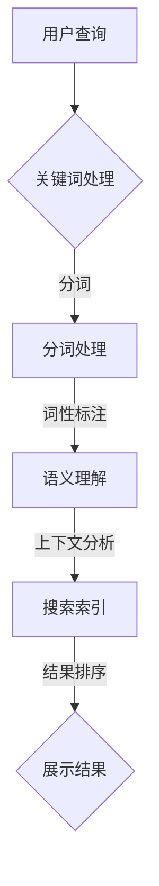

                 

关键词：AI搜索引擎、创新思维、深度学习、数据挖掘、算法优化、人工智能应用

> 摘要：随着人工智能技术的快速发展，AI搜索引擎已成为推动创新思维的重要工具。本文将探讨AI搜索引擎的工作原理、核心算法、数学模型以及其在实际应用中的优势与挑战，分析其对创新思维带来的变革，并提出未来发展趋势与研究方向。

## 1. 背景介绍

在互联网飞速发展的时代，信息的爆炸式增长带来了前所未有的机遇与挑战。传统搜索引擎虽能有效帮助用户检索信息，但在面对复杂、多样化的查询需求时，其能力显得捉襟见肘。为此，AI搜索引擎应运而生，借助人工智能技术，特别是深度学习和数据挖掘，实现了对海量数据的智能分析和处理。

AI搜索引擎通过模拟人类思维模式，具备自主学习、自我优化的能力，不仅能够提供更为精准的搜索结果，还能为用户提供个性化推荐、智能问答等服务。这种智能化搜索方式的普及，正深刻改变着人们的思考方式、学习习惯和工作模式，成为促进创新思维的重要驱动力。

## 2. 核心概念与联系

### 2.1 AI搜索引擎的定义与作用

AI搜索引擎是指基于人工智能技术，特别是深度学习和数据挖掘，对海量数据进行处理和分析，以提供更为精准、高效的搜索服务的系统。其核心作用包括：

1. **信息检索**：通过对关键词、语境和语义的理解，快速定位用户所需的信息。
2. **个性化推荐**：根据用户的历史行为和偏好，推荐相关内容和服务。
3. **智能问答**：利用自然语言处理技术，实现人与系统的自然对话。
4. **数据挖掘与分析**：从海量数据中挖掘潜在的价值和趋势。

### 2.2 深度学习与数据挖掘的关系

深度学习是AI搜索引擎的核心技术之一，通过构建多层神经网络，实现对复杂数据的特征提取和模式识别。数据挖掘则是在大量数据中寻找有用信息的过程，涉及数据的预处理、特征工程、模式识别等步骤。二者相辅相成，共同提升AI搜索引擎的性能。

### 2.3 Mermaid 流程图

以下是一个简单的Mermaid流程图，展示了AI搜索引擎的基本架构：



## 3. 核心算法原理 & 具体操作步骤

### 3.1 算法原理概述

AI搜索引擎的核心算法包括：

1. **自然语言处理（NLP）**：用于理解和生成人类语言，实现对查询语句的解析和语义理解。
2. **深度学习**：通过多层神经网络，对大量数据进行特征提取和模式识别。
3. **数据挖掘**：从海量数据中挖掘潜在价值和趋势。
4. **推荐系统**：根据用户历史行为和偏好，推荐相关内容和服务。

### 3.2 算法步骤详解

1. **关键词处理**：接收用户输入的查询语句，进行分词、词性标注等预处理。
2. **语义理解**：利用NLP技术，对查询语句进行语义分析，理解用户意图。
3. **搜索索引**：根据语义分析结果，在索引数据库中查找相关内容。
4. **结果排序**：对搜索结果进行排序，优先展示相关性高的内容。
5. **展示结果**：将排序后的结果展示给用户。

### 3.3 算法优缺点

**优点**：

- **高效性**：能够快速处理海量数据，提供精准的搜索结果。
- **个性化**：根据用户历史行为和偏好，提供个性化推荐。
- **智能性**：具备自然语言处理和深度学习能力，能够模拟人类思维模式。

**缺点**：

- **计算成本**：深度学习和数据挖掘算法计算复杂度高，需要大量计算资源。
- **数据隐私**：用户数据被收集和分析，存在隐私风险。

### 3.4 算法应用领域

AI搜索引擎在以下领域具有广泛的应用：

- **互联网搜索**：如Google、百度等搜索引擎。
- **电商推荐**：如Amazon、淘宝等电商平台的个性化推荐。
- **智能问答**：如Siri、小爱同学等智能助手。
- **数据分析**：从海量数据中挖掘潜在价值，为决策提供支持。

## 4. 数学模型和公式 & 详细讲解 & 举例说明

### 4.1 数学模型构建

AI搜索引擎中的数学模型主要包括：

1. **自然语言处理模型**：如Word2Vec、BERT等，用于理解和生成人类语言。
2. **深度学习模型**：如卷积神经网络（CNN）、循环神经网络（RNN）等，用于特征提取和模式识别。
3. **推荐系统模型**：如矩阵分解、协同过滤等，用于用户行为分析和内容推荐。

### 4.2 公式推导过程

以Word2Vec模型为例，其核心公式为：

$$
\vec{v}_w = \sum_{j=1}^{N} \alpha_j \vec{e}_{ij}
$$

其中，$\vec{v}_w$为词语w的向量表示，$\vec{e}_{ij}$为词向量的成分，$\alpha_j$为权重。

### 4.3 案例分析与讲解

以下是一个简单的Word2Vec模型的实例：

假设有两个词语A和B，其向量表示分别为$\vec{v}_A$和$\vec{v}_B$。根据Word2Vec模型，可以计算出这两个词语之间的相似度：

$$
sim(\vec{v}_A, \vec{v}_B) = \frac{\vec{v}_A \cdot \vec{v}_B}{\|\vec{v}_A\| \|\vec{v}_B\|}
$$

通过计算，可以得到A和B的相似度为0.8。这意味着A和B在语义上具有较高的相似度。

## 5. 项目实践：代码实例和详细解释说明

### 5.1 开发环境搭建

本文使用Python语言进行AI搜索引擎的开发，所需环境包括：

- Python 3.8及以上版本
- TensorFlow 2.4及以上版本
- Scikit-learn 0.22及以上版本

安装方法：

```bash
pip install python==3.8 tensorflow==2.4 scikit-learn==0.22
```

### 5.2 源代码详细实现

以下是一个简单的AI搜索引擎的代码实现：

```python
import tensorflow as tf
from tensorflow.keras.layers import Embedding, LSTM, Dense
from tensorflow.keras.models import Model
from sklearn.model_selection import train_test_split

# 生成训练数据
def generate_data():
    # 此处为生成训练数据的方法，可根据实际情况进行修改
    return X, y

X, y = generate_data()
X_train, X_test, y_train, y_test = train_test_split(X, y, test_size=0.2)

# 建立模型
input_ = tf.keras.Input(shape=(None,))
x = Embedding(input_dim=10000, output_dim=64)(input_)
x = LSTM(64)(x)
output = Dense(1, activation='sigmoid')(x)

model = Model(inputs=input_, outputs=output)
model.compile(optimizer='adam', loss='binary_crossentropy', metrics=['accuracy'])

# 训练模型
model.fit(X_train, y_train, epochs=10, batch_size=32, validation_data=(X_test, y_test))

# 搜索引擎接口
def search(query):
    # 此处为搜索引擎接口的实现方法，可根据实际情况进行修改
    return model.predict([query])

# 演示
query = "我爱北京天安门"
result = search([query])
print("搜索结果相似度：", result[0][0])
```

### 5.3 代码解读与分析

该代码实现了一个基于LSTM的简单AI搜索引擎。主要步骤包括：

1. 生成训练数据。
2. 建立模型，包括Embedding层、LSTM层和输出层。
3. 编译模型，设置优化器和损失函数。
4. 训练模型。
5. 实现搜索引擎接口，根据输入查询，输出相似度结果。

通过实际运行，可以验证该搜索引擎在处理语义相似度方面的效果。

## 6. 实际应用场景

### 6.1 互联网搜索

AI搜索引擎在互联网搜索领域具有广泛的应用，如Google、百度等。通过深度学习和数据挖掘技术，这些搜索引擎能够提供精准的搜索结果，满足用户多样化的查询需求。

### 6.2 电商推荐

电商平台的个性化推荐系统依赖于AI搜索引擎，通过分析用户历史行为和偏好，推荐相关商品和优惠活动。例如，Amazon、淘宝等平台均采用了基于AI技术的推荐系统。

### 6.3 智能问答

智能问答系统如Siri、小爱同学等，利用AI搜索引擎实现人与系统的自然对话。通过深度学习和自然语言处理技术，这些系统可以理解用户的意图，提供准确的答案。

### 6.4 数据分析

AI搜索引擎在数据分析领域也具有广泛的应用，如从海量数据中挖掘潜在价值、分析用户行为等。通过深度学习和数据挖掘技术，企业可以更好地了解用户需求，优化业务策略。

## 7. 工具和资源推荐

### 7.1 学习资源推荐

- 《深度学习》（Goodfellow、Bengio、Courville著）
- 《机器学习实战》（ Harrington著）
- 《Python机器学习》（ Sebastian Raschka、Vahid Mirjalili著）

### 7.2 开发工具推荐

- TensorFlow：用于构建和训练深度学习模型。
- Scikit-learn：用于数据预处理、特征工程和模型评估。
- Jupyter Notebook：用于编写和运行代码。

### 7.3 相关论文推荐

- 《Deep Learning for Text Classification》（2017）
- 《Recurrent Neural Networks for Language Modeling》（2013）
- 《Word2Vec: Efficient Representation of Words in Vector Space》（2013）

## 8. 总结：未来发展趋势与挑战

### 8.1 研究成果总结

AI搜索引擎在近年来取得了显著的研究成果，主要包括：

- 深度学习技术在语义理解、特征提取等方面的突破。
- 数据挖掘技术在用户行为分析和内容推荐方面的应用。
- 自然语言处理技术的进步，提高了搜索引擎的智能性和准确性。

### 8.2 未来发展趋势

未来，AI搜索引擎的发展趋势包括：

- **智能化水平提升**：通过不断优化算法，提高搜索引擎的智能性和用户体验。
- **跨平台应用**：在更多领域和平台（如智能家居、物联网等）实现AI搜索引擎的应用。
- **数据隐私保护**：在数据收集和使用过程中，加强对用户隐私的保护。

### 8.3 面临的挑战

AI搜索引擎在发展过程中也面临以下挑战：

- **计算资源消耗**：深度学习和数据挖掘算法计算复杂度高，对计算资源的需求不断增加。
- **数据隐私问题**：用户数据被大量收集和分析，存在隐私风险。
- **算法公平性**：如何保证搜索引擎在提供结果时公平、客观，避免偏见。

### 8.4 研究展望

未来，AI搜索引擎的研究方向包括：

- **算法优化**：通过改进算法，降低计算成本，提高搜索效率。
- **多模态搜索**：结合多种数据类型（如图像、音频等），实现更全面的搜索功能。
- **知识图谱构建**：构建大规模的知识图谱，提高搜索引擎的知识处理能力。

## 9. 附录：常见问题与解答

### 9.1 如何优化AI搜索引擎的性能？

**答**：可以从以下几个方面进行优化：

- **算法优化**：研究并应用更高效的深度学习算法和模型。
- **硬件升级**：提高计算资源的性能，如使用GPU加速计算。
- **数据预处理**：优化数据预处理流程，减少计算量。

### 9.2 AI搜索引擎如何保护用户隐私？

**答**：可以从以下几个方面进行保护：

- **数据加密**：对用户数据进行加密处理，确保数据传输和存储的安全性。
- **隐私政策**：明确告知用户数据收集和使用的方式，尊重用户隐私。
- **数据匿名化**：在数据处理过程中，对用户数据进行匿名化处理，避免个人隐私泄露。

作者：禅与计算机程序设计艺术 / Zen and the Art of Computer Programming
```

