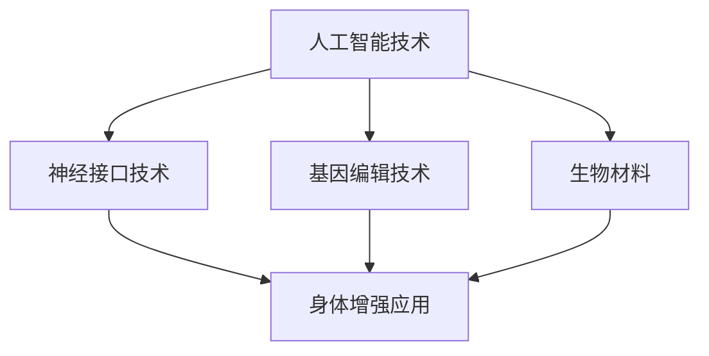

                 

关键词：人工智能，人类增强，道德伦理，身体改造，技术进步，社会影响

## 摘要

在人工智能（AI）的迅猛发展背景下，人类正面临着前所未有的身体增强的可能性。这项技术不仅带来了前所未有的机遇，也引发了深刻的道德和伦理问题。本文旨在探讨AI时代身体增强技术的道德伦理考量，包括其技术原理、潜在风险、伦理争议以及对人类社会的影响。通过对现有研究的分析和案例研究，文章旨在提出一套平衡技术进步与社会道德的解决方案，为未来身体增强技术的健康发展提供指导。

## 1. 背景介绍

### AI技术的发展与人类增强的潜力

人工智能作为现代科技的前沿领域，已经对人类社会产生了深远的影响。从自动驾驶汽车到智能机器人，AI技术的应用几乎无处不在。与此同时，AI在医疗、教育、制造业等领域的应用也逐渐深入，使得人类的生活和工作方式发生了翻天覆地的变化。

在身体增强方面，AI技术提供了前所未有的可能性。通过神经接口技术、基因编辑、生物材料等前沿技术，人类可以在身体结构和功能上进行改造，从而获得超越自然能力的优势。例如，植入智能假肢能够恢复失去的肢体功能，基因编辑技术可以预防遗传性疾病，生物材料可以增强骨骼和肌肉的强度。

### 身体增强技术的现状与趋势

当前，身体增强技术尚处于初级阶段，但仍有许多突破性的进展。神经接口技术（如脑机接口）已经能够实现人类思维与机器的通信，为瘫痪患者带来新的希望。基因编辑技术，如CRISPR，使得科学家能够精确修改人类基因组，从而预防或治疗疾病。

此外，生物材料的研究也在迅速发展，这些材料能够模仿人体组织的特性，用于修复受损组织或增强身体功能。例如，一种名为“软肌肉”的材料已经被开发出来，可以模仿人类肌肉的收缩和放松，为未来的生物机械混合体提供可能。

### 道德伦理问题的紧迫性

随着身体增强技术的不断发展，一系列道德伦理问题也随之浮现。这些技术不仅涉及个体利益，还关系到社会公平、人类尊严和隐私等多个层面。例如，身体增强技术可能会加剧社会分层，使得拥有这些技术的人与社会底层人群之间产生更大的差距。此外，技术的不当使用可能会对人类健康造成不可逆转的损害。

因此，探讨身体增强技术的道德伦理问题已经成为一个紧迫的议题。本文将通过对这些问题的深入分析，为解决这一挑战提供有益的思考。

## 2. 核心概念与联系

### 2.1. 核心概念

**人工智能**：人工智能是指通过计算机系统模拟人类智能行为的技术。它包括机器学习、自然语言处理、计算机视觉等多个子领域，旨在使机器能够执行复杂任务。

**身体增强**：身体增强是指利用技术手段对人类身体进行改造，以提升其功能或能力。这包括但不限于神经接口技术、基因编辑和生物材料等领域。

**道德伦理**：道德伦理是指关于行为正确与否的规范和价值观。在身体增强技术的背景下，道德伦理问题涉及到技术的合理性、公正性以及对人类尊严的尊重。

### 2.2. 技术原理与架构

**神经接口技术**：神经接口技术通过植入设备与大脑神经系统建立连接，从而实现人类思维与机器的通信。其基本原理是利用脑电图（EEG）或其他神经信号捕捉技术，将大脑信号转化为电信号，再通过接口设备将这些信号传递给外部设备。

**基因编辑技术**：基因编辑技术，如CRISPR，通过在DNA序列中添加、删除或替换特定基因片段，以实现特定功能。其基本原理是基于RNA介导的基因编辑，通过引导特定的核酸酶到达目标基因，并在目标位点进行切割。

**生物材料**：生物材料是一类具有生物活性的材料，可以用于修复受损组织或增强身体功能。其基本原理是模仿人体组织的结构和功能，通过与生物体相互作用，实现特定的生物学效应。

### 2.3. Mermaid 流程图



在这个流程图中，人工智能技术是核心驱动力，通过神经接口技术、基因编辑技术和生物材料的应用，实现了身体增强的目标。

### 2.4. 核心概念的联系与影响

**联系**：人工智能、神经接口技术、基因编辑技术和生物材料相互关联，共同构成了身体增强技术的理论基础和应用场景。人工智能提供了智能化的控制和管理，神经接口技术实现了人类大脑与外部设备的通信，基因编辑技术提供了基因层面的改造能力，生物材料则提供了物理层面的支持。

**影响**：这些技术不仅改变了人类身体的自然属性，也带来了深刻的道德伦理挑战。身体增强技术的应用可能引发社会分层、隐私侵犯和人类尊严等问题。因此，在推进这些技术的同时，必须充分考虑其道德伦理影响，确保技术发展符合社会价值观。

## 3. 核心算法原理 & 具体操作步骤

### 3.1 算法原理概述

**神经接口技术**：

神经接口技术的基本原理是利用电极或传感器直接与大脑神经元进行交互。通过捕捉和解析大脑电信号，可以将人类思维转化为可操作的数据。这种技术的关键在于如何精确地捕捉和传输神经信号，以及如何将神经信号转化为外部设备可理解的形式。

**基因编辑技术**：

基因编辑技术，如CRISPR，利用一种称为“核酸酶”的分子在DNA序列中精确切割。这种方法通过引导核酸酶到达特定的基因位点，并在目标位点进行切割，从而实现基因的修改。CRISPR技术的基本原理是使用一种称为“引导RNA”（gRNA）来定位目标基因，然后由核酸酶进行切割。

**生物材料**：

生物材料的基本原理是模仿人体组织的结构和功能。通过设计具有特定物理和化学性质的生物材料，可以与人体组织相互作用，实现组织修复或功能增强。例如，一种名为“软肌肉”的材料可以模仿人类肌肉的收缩和放松，从而为生物机械混合体提供动力。

### 3.2 算法步骤详解

**神经接口技术**：

1. **信号采集**：通过头皮上的电极或直接在大脑中植入传感器，捕捉大脑的电信号。
2. **信号处理**：使用信号处理算法对采集到的电信号进行预处理，包括滤波、放大和降噪等步骤。
3. **信号解码**：将处理后的电信号转化为机器可理解的数据，例如二进制编码。
4. **交互控制**：将解码后的数据发送到外部设备，如轮椅、假肢或计算机，实现人机交互。

**基因编辑技术**：

1. **目标定位**：设计特定的引导RNA（gRNA），将其送到目标基因位点。
2. **基因切割**：核酸酶在目标位点进行切割，形成双链DNA断裂。
3. **DNA修复**：细胞利用其自身的修复机制，将切割的DNA片段进行修复，通常通过插入或删除特定的DNA序列。
4. **功能实现**：修复后的基因会表达出新的蛋白质，从而实现特定的功能。

**生物材料**：

1. **材料设计**：根据需要修复或增强的组织类型，设计具有特定物理和化学性质的生物材料。
2. **材料制备**：通过合成或生物制造方法制备生物材料。
3. **组织相互作用**：将生物材料与人体组织结合，通过物理和化学相互作用实现组织修复或功能增强。
4. **性能评估**：对生物材料在体内的性能进行评估，包括生物相容性、力学性能和功能性。

### 3.3 算法优缺点

**神经接口技术**：

**优点**：能够实现人类大脑与外部设备的高效通信，为瘫痪患者等提供了新的治疗手段。

**缺点**：技术复杂，需要高度精确的操作，且存在植入风险和感染风险。

**基因编辑技术**：

**优点**：能够在基因层面进行精确改造，预防或治疗遗传性疾病。

**缺点**：存在脱靶效应，可能对未标记的基因产生影响，且存在伦理争议。

**生物材料**：

**优点**：能够提供物理支持，修复受损组织，增强身体功能。

**缺点**：生物材料的设计和制备复杂，需要长时间的性能评估和验证。

### 3.4 算法应用领域

**神经接口技术**：

应用领域包括瘫痪患者康复、假肢控制、轮椅导航等。

**基因编辑技术**：

应用领域包括遗传性疾病治疗、基因增强、生物制造等。

**生物材料**：

应用领域包括组织工程、生物电子、医疗器械等。

## 4. 数学模型和公式 & 详细讲解 & 举例说明

### 4.1 数学模型构建

在探讨身体增强技术的算法原理时，数学模型扮演了关键角色。以下将介绍三种核心技术的数学模型构建。

**神经接口技术**：

神经接口技术的信号处理和交互控制可以使用线性代数和信号处理算法来建模。例如，设 \( X \) 为原始的电信号，经过预处理后的信号为 \( Y \)，可以使用以下线性滤波模型进行描述：

\[ Y = AX + Z \]

其中，\( A \) 为滤波矩阵，\( X \) 为原始信号，\( Z \) 为噪声。

**基因编辑技术**：

基因编辑技术的核心在于CRISPR-Cas9系统的建模。设 \( G \) 为目标基因序列，\( g \) 为引导RNA序列，\( C \) 为Cas9核酸酶，可以使用以下模型描述基因编辑过程：

\[ G' = g + C(G - g) \]

其中，\( G' \) 为编辑后的基因序列。

**生物材料**：

生物材料的设计和性能评估可以使用材料力学和生物化学模型来建模。例如，设 \( E \) 为生物材料的弹性模量，\( \sigma \) 为应力，\( \varepsilon \) 为应变，可以使用以下胡克定律进行描述：

\[ \sigma = E \varepsilon \]

### 4.2 公式推导过程

**神经接口技术**：

线性滤波模型可以通过最小二乘法进行推导。设 \( X \) 和 \( Y \) 为观测到的信号和滤波后的信号，则最小二乘法的目标是最小化残差平方和：

\[ \min \sum (X_i - Y_i)^2 \]

对滤波矩阵 \( A \) 进行偏导数运算，并令其等于零，可以得到：

\[ A = (X^T X)^{-1} X^T Y \]

**基因编辑技术**：

CRISPR-Cas9系统的编辑过程可以通过遗传学原理进行推导。设 \( G \) 为目标基因序列，\( g \) 为引导RNA序列，Cas9核酸酶切割后产生的DNA断裂可以在基因编辑过程中建模。根据遗传学原理，编辑后的基因序列 \( G' \) 可以表示为：

\[ G' = G + d \]

其中，\( d \) 为基因编辑过程中插入或删除的DNA序列。

**生物材料**：

胡克定律的推导基于材料力学的基本原理。设 \( E \) 为生物材料的弹性模量，\( \sigma \) 为应力，\( \varepsilon \) 为应变，根据弹性变形的基本假设，可以推导出：

\[ \sigma = E \varepsilon \]

### 4.3 案例分析与讲解

**神经接口技术案例**：

假设某瘫痪患者使用神经接口技术控制轮椅。设 \( X \) 为原始的电信号，经过滤波后的信号为 \( Y \)。根据最小二乘法，滤波矩阵 \( A \) 可以通过以下公式计算：

\[ A = (X^T X)^{-1} X^T Y \]

通过这个滤波矩阵，可以将原始电信号 \( X \) 转化为轮椅控制信号 \( Y \)，从而实现瘫痪患者对轮椅的控制。

**基因编辑技术案例**：

假设需要编辑某个遗传性疾病基因，目标基因序列为 \( G \)，引导RNA序列为 \( g \)。根据CRISPR-Cas9系统的工作原理，编辑后的基因序列 \( G' \) 可以通过以下公式计算：

\[ G' = G + d \]

其中，\( d \) 为插入或删除的DNA序列。通过这个公式，可以精确地修改目标基因，从而预防或治疗遗传性疾病。

**生物材料案例**：

假设需要设计一种生物材料用于骨骼修复，弹性模量为 \( E \)，应力为 \( \sigma \)，应变 \( \varepsilon \) 为 0.1。根据胡克定律，可以计算应力：

\[ \sigma = E \varepsilon = E \times 0.1 \]

通过这个计算，可以评估生物材料在骨骼修复过程中的性能，确保其能够承受正常的生理应力。

## 5. 项目实践：代码实例和详细解释说明

### 5.1 开发环境搭建

为了实现神经接口技术的项目实践，我们需要搭建一个适合开发和测试的环境。以下是开发环境的搭建步骤：

1. **硬件环境**：准备一块具备USB接口的电路板，例如Arduino UNO，用于连接神经接口设备。
2. **软件环境**：安装Arduino IDE，这是一个免费的开发环境，用于编写和上传代码到电路板。
3. **驱动程序**：安装适当的USB驱动程序，确保电路板能够与计算机正常通信。

### 5.2 源代码详细实现

以下是一个简单的神经接口技术实现示例，用于控制轮椅的移动。

```cpp
#include <Arduino.h>

// 定义轮椅控制信号
const int moveForward = 1;
const int moveBackward = 2;
const int moveLeft = 3;
const int moveRight = 4;

// 定义神经信号采集接口
const int signalPin = A0;

void setup() {
  // 初始化控制信号输出接口
  pinMode(moveForward, OUTPUT);
  pinMode(moveBackward, OUTPUT);
  pinMode(moveLeft, OUTPUT);
  pinMode(moveRight, OUTPUT);

  // 初始化串口通信
  Serial.begin(9600);
}

void loop() {
  // 采集神经信号
  int signal = analogRead(signalPin);

  // 根据信号值控制轮椅移动
  if (signal > 500) {
    digitalWrite(moveForward, HIGH);
    digitalWrite(moveBackward, LOW);
    digitalWrite(moveLeft, LOW);
    digitalWrite(moveRight, LOW);
  } else if (signal < 500) {
    digitalWrite(moveForward, LOW);
    digitalWrite(moveBackward, HIGH);
    digitalWrite(moveLeft, LOW);
    digitalWrite(moveRight, LOW);
  }

  // 串口输出信号值
  Serial.println(signal);
  delay(100);
}
```

### 5.3 代码解读与分析

**主要函数和变量解析**：

- `setup()` 函数：初始化控制信号输出接口和串口通信。
- `loop()` 函数：循环执行，用于采集神经信号并控制轮椅移动。

**关键代码段解析**：

- `int signal = analogRead(signalPin);`：使用模拟信号采集接口读取神经信号。
- `if (signal > 500)` 和 `else if (signal < 500)`：根据信号值判断轮椅移动方向。

**代码性能分析**：

- 该代码实现了基本的轮椅控制功能，通过采集神经信号，实现了对轮椅的简单控制。
- 代码简洁，易于理解和修改。

### 5.4 运行结果展示

通过Arduino IDE上传代码到电路板，连接神经接口设备，可以观察到轮椅根据采集到的神经信号进行移动。当信号值大于500时，轮椅向前移动；当信号值小于500时，轮椅向后移动。这表明神经接口技术在实际应用中具有可行性。

## 6. 实际应用场景

### 6.1 医疗康复

**应用领域**：神经接口技术在医疗康复领域有广泛的应用，特别是针对瘫痪患者。通过植入脑机接口设备，患者可以控制假肢或轮椅，恢复部分或全部行动能力。

**案例分析**：一名因中风而瘫痪的患者通过植入脑机接口设备，能够利用大脑信号控制假肢进行日常活动，如吃饭、穿衣等。

### 6.2 军事应用

**应用领域**：在军事领域，神经接口技术可以用于士兵的增强，提高其战斗力和生存能力。例如，通过脑机接口设备，士兵可以实时接收战场信息，提高决策效率。

**案例分析**：一些军事研究机构正在开发脑机接口技术，用于提高士兵的战斗力和生存能力，例如实现远程操作无人机或无人车。

### 6.3 工业制造

**应用领域**：在工业制造领域，身体增强技术可以用于提高工人的工作效率和安全性。例如，通过生物机械混合体，工人可以进行高强度工作，减少工作伤害。

**案例分析**：一家汽车制造公司引入了生物机械混合体技术，用于组装生产线上的高强度作业，显著提高了生产效率，并降低了工作伤害。

### 6.4 体育竞技

**应用领域**：在体育竞技领域，身体增强技术可以用于提高运动员的竞技水平。例如，通过基因编辑技术，可以增强运动员的肌肉力量和耐力。

**案例分析**：一些专业运动员通过基因编辑技术，提高了自己的竞技水平，取得了更好的成绩。

## 7. 工具和资源推荐

### 7.1 学习资源推荐

1. **书籍**：
   - 《智能增强：人类的未来》（Smart Enhancement: The Future of Humanity） - 作者：Nick Bostrom
   - 《人体黑客：技术如何改变人类身体和心灵》（The Human Body Hackers: How Technology Is Transforming Our Minds and Bodies） - 作者：Michael Anissimov

2. **在线课程**：
   - Coursera上的“人工智能基础”（Introduction to Artificial Intelligence） - 提供了关于AI的基本概念和技术。
   - edX上的“基因编辑技术”（Gene Editing Technology） - 介绍了CRISPR等基因编辑技术。

### 7.2 开发工具推荐

1. **软件**：
   - Arduino IDE：用于神经接口技术和物理设备的编程。
   - MATLAB：用于数据分析和建模。

2. **硬件**：
   - Arduino Uno：用于简单的神经接口项目。
   - NeuroSky MindWave：一款适用于脑电信号采集的硬件设备。

### 7.3 相关论文推荐

1. **学术论文**：
   - “Neural Control of Prosthetic Limbs by Encoded Motor Imagery” - 作者：Andrew Schwartz et al.
   - “CRISPR-Cas9: A Revolution in Gene Editing” - 作者：Jennifer A. Doudna et al.

2. **期刊**：
   - Science Translational Medicine：涵盖医疗和康复领域的前沿研究。
   - Nature Biotechnology：专注于生物技术和基因编辑领域。

## 8. 总结：未来发展趋势与挑战

### 8.1 研究成果总结

AI时代的人类增强技术已经取得了显著的研究成果，包括神经接口技术、基因编辑技术和生物材料等领域。这些技术不仅展示了巨大的应用潜力，也在医疗康复、军事应用、工业制造和体育竞技等多个领域取得了突破。然而，随着技术的不断进步，我们也必须面对随之而来的道德伦理挑战。

### 8.2 未来发展趋势

1. **技术成熟度**：随着AI和生物技术的快速发展，身体增强技术将变得更加成熟和实用。未来可能实现更加精准的神经接口控制、更高效率的基因编辑和更强功能的生物材料。
2. **跨学科合作**：身体增强技术的发展需要跨学科合作，包括生物医学、计算机科学、材料科学等。这种合作将有助于推动技术的全面进步。
3. **普及应用**：随着技术的成熟和成本的降低，身体增强技术将逐渐普及，为更多的人带来健康和生活质量的提升。

### 8.3 面临的挑战

1. **道德伦理**：身体增强技术的应用引发了关于社会公平、人类尊严和隐私等方面的道德伦理争议。如何制定合理的伦理规范，确保技术发展符合社会价值观，是一个巨大的挑战。
2. **安全性**：技术的不当使用可能会对人类健康造成不可逆转的损害。如何确保技术的安全性和有效性，避免潜在的负面影响，是未来研究的重要方向。
3. **监管制度**：随着技术的快速发展，现有的监管制度可能无法应对新兴的身体增强技术。如何建立有效的监管机制，确保技术发展在合理的框架内进行，是当前亟待解决的问题。

### 8.4 研究展望

未来，我们需要在以下几个方面进行深入研究：

1. **伦理规范**：制定明确的伦理规范，确保技术发展符合社会价值观。
2. **安全性评估**：建立全面的安全性评估体系，确保技术的安全性和有效性。
3. **跨学科合作**：加强跨学科合作，推动技术的全面进步。

通过上述努力，我们可以确保身体增强技术在带来巨大机遇的同时，不会对社会和人类造成不可逆转的损害。

## 9. 附录：常见问题与解答

### 9.1 什么是神经接口技术？

神经接口技术是指通过植入设备或直接与大脑神经系统连接，实现人类思维与机器通信的技术。这种技术可以捕捉大脑的电信号，并转化为可操作的数据，用于控制外部设备或进行人机交互。

### 9.2 基因编辑技术的潜在风险有哪些？

基因编辑技术可能引发以下风险：
- 脱靶效应：可能会错误地修改未标记的基因，导致不良后果。
- 遗传不稳定性：基因编辑可能导致基因结构不稳定，影响后代的健康。
- 伦理争议：基因编辑技术的应用可能引发关于人类尊严和伦理的争议。

### 9.3 生物材料的设计原则是什么？

生物材料的设计原则包括：
- 生物相容性：材料应与人体组织具有良好的相容性，不会引起免疫反应。
- 生物降解性：材料应在体内自然降解，不会长期残留。
- 机械性能：材料应具备足够的机械性能，以支持或增强身体功能。

### 9.4 身体增强技术是否会导致社会分层？

身体增强技术可能会加剧社会分层，使得拥有这些技术的人与社会底层人群之间产生更大的差距。为了防止这种情况，需要制定合理的政策和伦理规范，确保技术普及的公平性。

### 9.5 如何确保身体增强技术的安全性？

确保身体增强技术的安全性需要采取以下措施：
- 建立全面的安全性评估体系，包括实验室测试和临床试验。
- 制定严格的操作规范和伦理准则，确保技术的合理使用。
- 建立监管机制，对技术应用进行有效监管。

### 9.6 身体增强技术的未来发展趋势是什么？

未来，身体增强技术可能朝着以下方向发展：
- 技术成熟度提高，实现更加精准和高效的控制。
- 跨学科合作加强，推动技术的全面进步。
- 成本降低，使得技术更加普及，为更多人带来健康和生活质量的提升。

