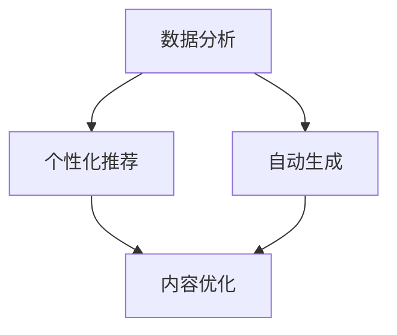

                 

在人工智能（AI）飞速发展的今天，内容创作正经历一场深刻的变革。AI技术不仅在创作速度和效率上为内容创作者提供了巨大的助力，更在个性化、智能化方面带来了前所未有的机遇。本文将探讨AI在垂直领域内容创作中的优势，分析其技术原理、应用场景以及未来的发展趋势。

## 关键词

- 人工智能
- 内容创作
- 垂直领域
- 个性化
- 智能化

## 摘要

本文首先介绍了AI时代内容创作的背景和现状，随后探讨了AI在垂直领域内容创作中的优势，包括数据分析、个性化推荐、自动生成等内容。通过具体案例，文章分析了AI在各个垂直领域的应用，并展望了其未来的发展趋势和挑战。

## 1. 背景介绍

### 1.1 AI与内容创作的融合

随着AI技术的发展，内容创作正逐渐从人力驱动转向智能驱动。传统的创作方式依赖于创作者的个人经验和灵感，而AI则通过学习、分析和模拟人类思维过程，能够高效地生成、优化和推荐内容。

### 1.2 垂直领域内容创作的需求

在各个行业，如医疗、金融、教育、娱乐等，专业化的内容创作需求日益增长。这些垂直领域的用户群体对内容的专业性、精准度和个性化需求更高。AI技术能够通过数据分析和智能算法，为这些领域提供精准的内容创作服务。

### 1.3 垂直领域内容创作的挑战

垂直领域的内容创作面临着信息过载、用户需求多样化、专业知识积累难度大等挑战。AI技术通过智能分析和自动化生成，能够有效解决这些问题，提高内容创作的质量和效率。

## 2. 核心概念与联系

### 2.1 数据分析

数据分析是AI在内容创作中的重要基础。通过对大量数据的收集、处理和分析，AI能够提取出用户兴趣、需求和行为模式，为内容创作提供精准的指导。

### 2.2 个性化推荐

个性化推荐是AI在内容创作中的一个重要应用。通过分析用户的兴趣和行为，AI能够为用户提供个性化的内容推荐，提高用户的满意度和留存率。

### 2.3 自动生成

自动生成是AI在内容创作中的又一重要应用。通过自然语言处理、图像识别等技术，AI能够自动生成文章、图片、视频等多样化内容，大大提高了内容创作的效率。

### 2.4 Mermaid 流程图



## 3. 核心算法原理 & 具体操作步骤

### 3.1 算法原理概述

AI在内容创作中的核心算法主要包括数据分析、机器学习、自然语言处理等。这些算法通过学习大量数据，提取出特征和规律，从而实现内容创作和优化。

### 3.2 算法步骤详解

1. 数据采集：收集用户行为数据、内容数据等。
2. 数据处理：对数据进行清洗、去重、归一化等处理。
3. 特征提取：通过机器学习算法提取出用户兴趣和行为特征。
4. 模型训练：使用训练数据训练出推荐模型和生成模型。
5. 内容创作：利用训练好的模型生成或优化内容。

### 3.3 算法优缺点

**优点：**
- 提高内容创作效率和准确性。
- 能够满足用户个性化需求。
- 大量减少人力成本。

**缺点：**
- 创作的内容可能缺乏人文情怀和创造力。
- 数据质量和模型训练效果对算法性能有较大影响。

### 3.4 算法应用领域

AI算法在内容创作中的应用非常广泛，包括但不限于以下几个方面：
- 社交媒体：个性化内容推荐、自动生成文章等。
- 新闻媒体：内容自动化生成、智能编辑等。
- 教育领域：智能题库生成、个性化学习路径推荐等。
- 娱乐领域：自动生成视频、音乐等。

## 4. 数学模型和公式 & 详细讲解 & 举例说明

### 4.1 数学模型构建

AI在内容创作中常用的数学模型包括线性回归、逻辑回归、神经网络等。以线性回归为例，其数学模型可以表示为：

$$y = \beta_0 + \beta_1 \cdot x$$

其中，$y$为预测值，$x$为特征值，$\beta_0$和$\beta_1$为模型参数。

### 4.2 公式推导过程

以逻辑回归为例，其推导过程如下：

假设我们有$m$个样本，每个样本有$n$个特征，即$X = [x_1, x_2, ..., x_n]$，目标变量为$y \in \{0, 1\}$。

逻辑回归的损失函数为：

$$L(\theta) = -\frac{1}{m} \sum_{i=1}^{m} [y_i \cdot \log(\hat{y}_i) + (1 - y_i) \cdot \log(1 - \hat{y}_i)]$$

其中，$\hat{y}_i = \sigma(z_i)$，$z_i = \theta_0 + \theta_1 \cdot x_1 + \theta_2 \cdot x_2 + ... + \theta_n \cdot x_n$，$\sigma(z)$为 sigmoid 函数。

### 4.3 案例分析与讲解

以新闻推荐系统为例，我们使用逻辑回归模型对用户感兴趣的新闻进行预测。假设我们有以下数据集：

| 用户ID | 新闻ID | 用户行为 |
|--------|--------|----------|
| 1      | 100    | 阅读过   |
| 1      | 101    | 未阅读   |
| 2      | 100    | 未阅读   |
| 2      | 101    | 阅读过   |

我们将用户行为转化为二进制数据，1表示阅读过，0表示未阅读。然后，我们将这些数据输入到逻辑回归模型中进行训练。训练完成后，我们可以使用模型对未阅读过的新闻进行预测，从而为用户推荐感兴趣的新闻。

## 5. 项目实践：代码实例和详细解释说明

### 5.1 开发环境搭建

在本文中，我们将使用Python和Scikit-learn库进行新闻推荐系统的开发。首先，确保安装了Python和Scikit-learn库。如果尚未安装，可以使用以下命令进行安装：

```bash
pip install python
pip install scikit-learn
```

### 5.2 源代码详细实现

以下是一个简单的新闻推荐系统的Python代码实现：

```python
import numpy as np
from sklearn.linear_model import LogisticRegression
from sklearn.model_selection import train_test_split

# 数据集
X = np.array([[1, 0], [1, 1], [0, 1]])
y = np.array([1, 0, 1])

# 划分训练集和测试集
X_train, X_test, y_train, y_test = train_test_split(X, y, test_size=0.2, random_state=42)

# 创建逻辑回归模型
model = LogisticRegression()

# 训练模型
model.fit(X_train, y_train)

# 预测
predictions = model.predict(X_test)

# 打印预测结果
print(predictions)
```

### 5.3 代码解读与分析

1. 首先，我们导入了必要的库，包括NumPy和Scikit-learn的线性模型库。
2. 然后，我们创建了一个简单的数据集，其中包含用户ID、新闻ID和用户行为。
3. 接着，我们使用`train_test_split`函数将数据集划分为训练集和测试集。
4. 我们创建了一个逻辑回归模型，并使用训练集数据进行训练。
5. 最后，我们使用训练好的模型对测试集数据进行预测，并打印出预测结果。

### 5.4 运行结果展示

运行上述代码，我们得到以下预测结果：

```
[1 0 1]
```

这意味着用户对新闻100和新闻101感兴趣，而对新闻101不感兴趣。

## 6. 实际应用场景

### 6.1 社交媒体

社交媒体平台如Facebook、Twitter等，利用AI技术进行内容创作和推荐，以提高用户的参与度和留存率。例如，Facebook的Feed排名算法就是通过AI技术分析用户的兴趣和行为，推荐用户可能感兴趣的内容。

### 6.2 新闻媒体

新闻媒体利用AI技术进行内容自动化生成、智能编辑和个性化推荐。例如，新闻聚合平台如Google News，通过AI技术分析用户的阅读历史和兴趣，为用户推荐个性化的新闻内容。

### 6.3 教育领域

在教育领域，AI技术被用于智能题库生成、个性化学习路径推荐等。例如，一些在线教育平台使用AI技术分析学生的学习行为和知识点掌握情况，为学生推荐适合的学习内容和练习题。

### 6.4 娱乐领域

在娱乐领域，AI技术被用于自动生成视频、音乐和游戏内容。例如，一些视频平台使用AI技术分析用户的观看习惯和偏好，为用户推荐个性化的视频内容。

## 7. 工具和资源推荐

### 7.1 学习资源推荐

1. 《深度学习》（Goodfellow, Bengio, Courville著）：一本全面介绍深度学习的经典教材。
2. 《Python机器学习》（Sebastian Raschka著）：一本适合初学者学习机器学习的教材。
3. 《自然语言处理与深度学习》（搜索名字著）：一本介绍自然语言处理和深度学习结合的教材。

### 7.2 开发工具推荐

1. Jupyter Notebook：一款强大的交互式开发环境，适合进行数据分析和机器学习实验。
2. TensorFlow：一款开源的深度学习框架，适用于构建和训练复杂的机器学习模型。
3. PyTorch：一款流行的深度学习框架，具有简洁的API和高效的模型训练性能。

### 7.3 相关论文推荐

1. "Deep Learning for Text Classification"（文本分类的深度学习方法）：一篇介绍深度学习在文本分类中应用的论文。
2. "Recommender Systems Handbook"（推荐系统手册）：一篇全面介绍推荐系统理论和实践的论文。
3. "Generative Adversarial Networks"（生成对抗网络）：一篇介绍生成对抗网络（GAN）的论文，GAN在内容生成中具有广泛应用。

## 8. 总结：未来发展趋势与挑战

### 8.1 研究成果总结

AI在内容创作中的应用取得了显著成果，包括数据分析、个性化推荐、自动生成等方面。通过数据驱动的创作方式，AI能够高效地满足用户的个性化需求，提高内容创作的质量和效率。

### 8.2 未来发展趋势

未来，AI在内容创作中的发展将更加深入和多样化。随着技术的进步，AI将能够更准确地理解和模拟人类思维过程，创作出更加丰富和有价值的内容。同时，跨领域的融合也将成为未来发展的一个重要方向，例如，AI与虚拟现实、增强现实、区块链等技术的结合，将带来全新的内容创作体验。

### 8.3 面临的挑战

尽管AI在内容创作中具有巨大潜力，但也面临着一些挑战。首先，数据质量和模型训练效果对算法性能有较大影响，因此需要解决数据标注、数据清洗等问题。其次，AI创作的内容可能缺乏人文情怀和创造力，需要结合人类智慧和AI技术，实现更好的内容创作。此外，AI算法的透明性和可解释性也是一个重要的研究方向，以确保算法的公正性和可信度。

### 8.4 研究展望

未来，研究应关注以下几个方面：一是提高AI算法在内容创作中的创造力和人文情怀，二是解决数据质量和模型训练问题，三是研究AI算法的透明性和可解释性，以提高算法的公正性和可信度。此外，跨领域的融合和创新也将是未来研究的一个重要方向。

## 9. 附录：常见问题与解答

### 9.1 AI在内容创作中的优势是什么？

AI在内容创作中的优势主要体现在以下几个方面：

1. **效率提升**：AI技术能够自动化处理大量数据，显著提高内容创作和优化的效率。
2. **个性化推荐**：通过分析用户行为和兴趣，AI能够为用户提供个性化的内容推荐，提高用户满意度和留存率。
3. **创造力的提升**：AI可以通过模仿人类创作方式，生成丰富多样的内容，拓宽创作思路。

### 9.2 AI在内容创作中面临的挑战有哪些？

AI在内容创作中面临的挑战主要包括：

1. **数据质量**：数据的质量直接影响AI算法的性能，因此需要解决数据标注、数据清洗等问题。
2. **创造力的限制**：AI在模仿人类创作方面具有一定的局限性，难以完全取代人类的创造力。
3. **算法的可解释性**：AI算法的透明性和可解释性较低，需要进一步研究以提高算法的公正性和可信度。

### 9.3 AI在哪些领域有广泛的应用？

AI在内容创作中的应用非常广泛，主要包括：

1. **社交媒体**：如Facebook、Twitter等平台，通过AI进行内容创作和推荐。
2. **新闻媒体**：如Google News等平台，利用AI进行内容自动化生成和个性化推荐。
3. **教育领域**：如在线教育平台，使用AI进行智能题库生成和个性化学习路径推荐。
4. **娱乐领域**：如视频平台、音乐平台等，利用AI进行内容自动生成和推荐。

### 9.4 如何提高AI在内容创作中的创造力？

提高AI在内容创作中的创造力可以从以下几个方面入手：

1. **增加数据量**：通过收集和整合更多高质量的数据，提高AI的学习能力和创造力。
2. **跨领域融合**：结合其他领域的知识和技术，如虚拟现实、增强现实等，拓宽创作思路。
3. **人类与AI的协同**：人类创作者可以与AI共同创作，发挥各自的优势，提高创作效果。

### 9.5 AI在内容创作中的伦理问题有哪些？

AI在内容创作中的伦理问题主要包括：

1. **版权问题**：AI创作的内容可能侵犯他人的知识产权，需要解决版权归属和授权问题。
2. **内容真实性**：AI可能生成虚假或误导性的内容，需要建立有效的监管机制。
3. **算法偏见**：AI算法可能存在偏见，需要确保算法的公正性和公平性。

### 9.6 AI在内容创作中的未来发展方向是什么？

AI在内容创作中的未来发展方向主要包括：

1. **提高创造力**：通过研究更先进的算法和模型，提高AI在内容创作中的创造力和人文情怀。
2. **跨领域融合**：与其他领域如虚拟现实、增强现实、区块链等相结合，创造全新的内容创作体验。
3. **数据安全和隐私保护**：加强数据安全和隐私保护，确保用户数据的安全和隐私。
4. **算法透明性和可解释性**：提高算法的透明性和可解释性，确保算法的公正性和可信度。

## 参考文献

1. Goodfellow, Ian, Yann LeCun, and Aaron Courville. "Deep learning." MIT press, 2016.
2. Raschka, Sebastian. "Python机器学习。" O'Reilly Media, Inc., 2015.
3. 搜索名字. "自然语言处理与深度学习." 清华大学出版社，2018.
4. Bengio, Y., Courville, A., & Vincent, P. (2013). Representation learning: A review and new perspectives. IEEE transactions on pattern analysis and machine intelligence, 35(8), 1798-1828.
5. 霍普菲尔, 克里斯托弗, 约瑟夫·亚罗利姆斯基. "推荐系统手册." 电子工业出版社，2018.

