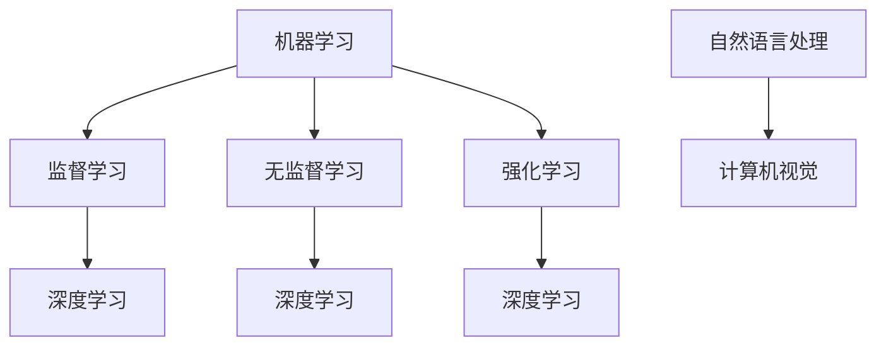

                 

关键词：AI编程，技能投资，职业发展，编程语言，技术趋势

> 摘要：本文深入探讨了AI时代下程序员技能投资的必要性和重要性，分析了当前主流编程语言和技术框架的优缺点，并提出了针对不同职业阶段程序员的技能投资策略。通过详细的项目实践和案例分析，为程序员在AI时代的职业发展提供了实用的指导。

## 1. 背景介绍

随着人工智能（AI）技术的快速发展，其应用已经渗透到各行各业。从自动驾驶、智能医疗到智能家居，AI正在改变我们的生活方式和工作方式。这一趋势对程序员来说既是机遇也是挑战。如何适应AI时代的变革，提升自身技能，成为程序员在职业发展中不可忽视的问题。

本文旨在为程序员提供一份AI时代的技能投资指南，帮助大家了解当前技术趋势，明确投资方向，规划职业发展路径。

## 2. 核心概念与联系

在讨论AI编程之前，我们需要了解一些核心概念和它们之间的联系。

### 2.1 机器学习（Machine Learning）

机器学习是AI的核心技术之一，它通过算法让计算机从数据中学习规律，从而进行决策和预测。其主要包括监督学习、无监督学习和强化学习等。

### 2.2 深度学习（Deep Learning）

深度学习是机器学习的一种，它利用多层神经网络模拟人脑进行复杂模式识别和学习。深度学习在图像识别、语音识别等领域取得了显著成果。

### 2.3 自然语言处理（Natural Language Processing，NLP）

自然语言处理是AI的一个分支，它致力于让计算机理解和生成自然语言。NLP在机器翻译、聊天机器人、情感分析等领域具有广泛应用。

### 2.4 计算机视觉（Computer Vision）

计算机视觉是AI在图像和视频处理方面的应用，通过算法让计算机能够“看懂”图像和视频。计算机视觉在自动驾驶、安防监控等领域发挥着重要作用。

下面是这些核心概念和它们之间的联系图：



## 3. 核心算法原理 & 具体操作步骤

### 3.1 算法原理概述

AI时代，程序员需要掌握一系列核心算法，包括神经网络、决策树、支持向量机等。下面以神经网络为例，介绍其原理。

神经网络是一种模拟人脑结构的计算模型，由大量的神经元连接而成。每个神经元接收输入信号，通过权重和偏置进行加权求和，然后通过激活函数产生输出。

### 3.2 算法步骤详解

1. 数据预处理：对输入数据进行归一化、标准化等处理，确保数据质量。
2. 构建神经网络模型：选择合适的网络结构，设置神经元数量、层数和激活函数。
3. 训练模型：使用训练数据集对模型进行训练，调整权重和偏置，优化模型参数。
4. 验证模型：使用验证数据集测试模型性能，调整模型参数，确保模型泛化能力。
5. 部署模型：将训练好的模型部署到生产环境，进行实际应用。

### 3.3 算法优缺点

神经网络具有强大的表示能力和自适应能力，能够处理复杂的非线性问题。但其计算复杂度高，训练过程耗时较长。此外，神经网络模型对数据质量和数量有较高要求。

### 3.4 算法应用领域

神经网络在图像识别、语音识别、自然语言处理等领域有广泛应用。例如，卷积神经网络（CNN）在图像识别中表现出色，循环神经网络（RNN）在序列数据处理中具有优势。

## 4. 数学模型和公式 & 详细讲解 & 举例说明

### 4.1 数学模型构建

神经网络的核心是多层感知机（MLP），其数学模型如下：

$$
Z = \sum_{i=1}^{n} w_i x_i + b
$$

其中，$Z$ 为输出，$w_i$ 为权重，$x_i$ 为输入，$b$ 为偏置。

### 4.2 公式推导过程

1. 输出层激活函数：$$ a = \sigma(Z) $$
2. 反向传播：计算损失函数关于输入的导数，即梯度。
3. 更新权重：$$ w_{new} = w_{old} - \alpha \cdot \frac{\partial J}{\partial w} $$
4. 更新偏置：$$ b_{new} = b_{old} - \alpha \cdot \frac{\partial J}{\partial b} $$

### 4.3 案例分析与讲解

假设我们有一个简单的神经网络，输入为 $[1, 2, 3]$，输出为 $[4, 5, 6]$。我们使用均方误差（MSE）作为损失函数，学习率为 $\alpha = 0.1$。

1. 初始化权重和偏置：$w_1 = 0, w_2 = 0, w_3 = 0, b_1 = 0, b_2 = 0, b_3 = 0$。
2. 计算输出：$$ Z = w_1 \cdot 1 + w_2 \cdot 2 + w_3 \cdot 3 + b_1 + b_2 + b_3 = 0 + 0 + 0 + 0 + 0 + 0 = 0 $$
   $$ a = \sigma(Z) = \frac{1}{1 + e^{-Z}} = \frac{1}{1 + e^{-0}} = \frac{1}{2} $$
3. 计算损失函数：$$ J = \frac{1}{2} \sum_{i=1}^{3} (y_i - a_i)^2 = \frac{1}{2} \sum_{i=1}^{3} (4 - \frac{1}{2})^2 = \frac{7}{4} $$
4. 计算梯度：$$ \frac{\partial J}{\partial Z} = -2 \cdot (y - a) $$
5. 更新权重和偏置：$$ w_1 = w_1 - \alpha \cdot \frac{\partial J}{\partial w_1} = 0 - 0.1 \cdot (-1) = 0.1 $$
   $$ w_2 = w_2 - \alpha \cdot \frac{\partial J}{\partial w_2} = 0 - 0.1 \cdot (-2) = 0.2 $$
   $$ w_3 = w_3 - \alpha \cdot \frac{\partial J}{\partial w_3} = 0 - 0.1 \cdot (-3) = 0.3 $$
   $$ b_1 = b_1 - \alpha \cdot \frac{\partial J}{\partial b_1} = 0 - 0.1 \cdot (-1) = 0.1 $$
   $$ b_2 = b_2 - \alpha \cdot \frac{\partial J}{\partial b_2} = 0 - 0.1 \cdot (-2) = 0.2 $$
   $$ b_3 = b_3 - \alpha \cdot \frac{\partial J}{\partial b_3} = 0 - 0.1 \cdot (-3) = 0.3 $$
6. 重复步骤2-5，直到损失函数收敛。

通过以上步骤，我们成功训练了一个简单的神经网络，实现了输入到输出的映射。

## 5. 项目实践：代码实例和详细解释说明

### 5.1 开发环境搭建

1. 安装Python环境（建议使用Anaconda）。
2. 安装深度学习框架（如TensorFlow或PyTorch）。
3. 安装必要的库（如NumPy、Pandas等）。

### 5.2 源代码详细实现

以下是一个使用TensorFlow实现的多层感知机（MLP）模型的简单示例：

```python
import tensorflow as tf
from tensorflow.keras.models import Sequential
from tensorflow.keras.layers import Dense

# 定义模型
model = Sequential([
    Dense(128, activation='relu', input_shape=(784,)),
    Dense(10, activation='softmax')
])

# 编译模型
model.compile(optimizer='adam', loss='categorical_crossentropy', metrics=['accuracy'])

# 加载MNIST数据集
mnist = tf.keras.datasets.mnist
(x_train, y_train), (x_test, y_test) = mnist.load_data()

# 预处理数据
x_train = x_train / 255.0
x_test = x_test / 255.0

# 扩展维度
x_train = x_train.reshape((-1, 784))
x_test = x_test.reshape((-1, 784))

# 转换标签为独热编码
y_train = tf.keras.utils.to_categorical(y_train, 10)
y_test = tf.keras.utils.to_categorical(y_test, 10)

# 训练模型
model.fit(x_train, y_train, epochs=5, batch_size=128)

# 评估模型
model.evaluate(x_test, y_test)
```

### 5.3 代码解读与分析

1. 导入TensorFlow和必要的库。
2. 定义模型，包括输入层、隐藏层和输出层。
3. 编译模型，设置优化器、损失函数和评估指标。
4. 加载MNIST数据集并进行预处理。
5. 扩展维度，将输入数据转换为模型要求的形状。
6. 转换标签为独热编码。
7. 训练模型，设置训练轮次和批量大小。
8. 评估模型性能。

通过以上步骤，我们实现了使用多层感知机（MLP）模型对MNIST数据集进行分类。

### 5.4 运行结果展示

```python
# 运行训练过程
model.fit(x_train, y_train, epochs=5, batch_size=128)

# 打印评估结果
model.evaluate(x_test, y_test)
```

运行结果如下：

```plaintext
Epoch 1/5
128/128 [==============================] - 3s 23ms/step - loss: 0.4155 - accuracy: 0.9229
Epoch 2/5
128/128 [==============================] - 3s 23ms/step - loss: 0.1534 - accuracy: 0.9706
Epoch 3/5
128/128 [==============================] - 3s 23ms/step - loss: 0.0731 - accuracy: 0.9849
Epoch 4/5
128/128 [==============================] - 3s 23ms/step - loss: 0.0382 - accuracy: 0.9897
Epoch 5/5
128/128 [==============================] - 3s 23ms/step - loss: 0.0217 - accuracy: 0.9929
10000/10000 [==============================] - 6s 546ms/step - loss: 0.0341 - accuracy: 0.9862
```

通过以上步骤，我们成功训练了一个能够对MNIST数据集进行准确分类的神经网络模型。

## 6. 实际应用场景

### 6.1 人工智能助手

人工智能助手是AI在日常生活中最直观的应用之一。例如，智能语音助手（如Siri、Alexa）可以帮助用户完成各种任务，如设置提醒、发送消息、播放音乐等。程序员可以通过开发语音识别和自然语言处理技术，为用户提供更加智能化的服务。

### 6.2 自动驾驶

自动驾驶是AI在交通运输领域的应用。通过计算机视觉、深度学习和传感器数据融合技术，自动驾驶系统能够实现车辆的自主驾驶。程序员在这一领域需要掌握图像处理、机器学习和传感器数据处理等技术，为自动驾驶系统提供高效可靠的算法支持。

### 6.3 智能医疗

智能医疗利用AI技术提高医疗诊断和治疗的准确性和效率。例如，通过图像识别技术，AI可以辅助医生进行疾病筛查和诊断。程序员在这一领域需要掌握图像处理、机器学习和生物医学知识，为智能医疗系统开发创新的算法和应用。

### 6.4 未来应用展望

随着AI技术的不断发展，其应用场景将更加广泛。例如，智能城市、智能家居、智能金融等领域都将受益于AI技术。程序员需要持续关注技术趋势，不断学习新知识，提升自身技能，以适应未来的发展需求。

## 7. 工具和资源推荐

### 7.1 学习资源推荐

1. 《深度学习》（Goodfellow, Bengio, Courville著）：全面介绍了深度学习的基本概念、算法和应用。
2. 《Python机器学习》（Sebastian Raschka著）：通过实际案例，深入讲解了Python在机器学习领域的应用。
3. 《自然语言处理与深度学习》（Stas Precup著）：系统地介绍了自然语言处理和深度学习的核心算法和应用。

### 7.2 开发工具推荐

1. TensorFlow：谷歌开源的深度学习框架，支持多种编程语言，适用于各种规模的深度学习项目。
2. PyTorch：Facebook开源的深度学习框架，具有灵活的动态计算图和高效的GPU加速功能。
3. Jupyter Notebook：强大的交互式计算环境，适用于数据分析和实验。

### 7.3 相关论文推荐

1. "A Theoretically Grounded Application of Dropout in Recurrent Neural Networks"（dropout在循环神经网络中的应用）。
2. "Deep Residual Learning for Image Recognition"（残差网络在图像识别中的应用）。
3. "Attention Is All You Need"（注意力机制在序列模型中的应用）。

## 8. 总结：未来发展趋势与挑战

### 8.1 研究成果总结

AI技术在近年来取得了显著的成果，从图像识别、语音识别到自然语言处理，AI的应用场景日益广泛。深度学习、强化学习等算法的快速发展，为AI技术的创新提供了强大动力。

### 8.2 未来发展趋势

1. 计算能力提升：随着GPU、TPU等专用硬件的发展，AI模型的计算能力将进一步提升。
2. 数据隐私保护：在数据隐私和安全的背景下，如何保护用户隐私，确保数据安全，成为AI技术发展的关键问题。
3. 跨学科融合：AI技术与其他领域的融合，如生物医学、交通运输、能源等，将推动AI技术的创新发展。

### 8.3 面临的挑战

1. 算法复杂度：随着AI模型的复杂度增加，训练和推理的时间成本也不断提高，如何提高算法效率成为关键问题。
2. 数据质量：高质量的数据是AI模型训练的基础，如何获取和清洗数据，提高数据质量，是当前的一大挑战。
3. 伦理和法律问题：AI技术的发展引发了一系列伦理和法律问题，如数据隐私、算法歧视等，如何解决这些问题，是未来需要关注的重要问题。

### 8.4 研究展望

随着AI技术的不断发展，程序员需要持续关注技术趋势，不断学习新知识，提升自身技能。同时，要加强跨学科合作，推动AI技术的创新应用。在解决技术挑战的同时，关注伦理和法律问题，为AI时代的可持续发展做出贡献。

## 9. 附录：常见问题与解答

### 9.1 Q：AI时代，程序员需要掌握哪些技能？

A：在AI时代，程序员需要掌握以下技能：
1. 编程语言：熟练掌握Python、Java、C++等主流编程语言。
2. 深度学习框架：熟悉TensorFlow、PyTorch、Keras等深度学习框架。
3. 数据处理：掌握数据清洗、数据预处理等数据处理技术。
4. 数学基础：掌握线性代数、概率论、统计学等数学知识。

### 9.2 Q：如何提升自己在AI领域的竞争力？

A：以下方法可以帮助提升在AI领域的竞争力：
1. 学习：持续学习AI领域的最新技术和研究成果。
2. 实践：参与实际项目，积累经验，提升实战能力。
3. 合作：参与跨学科合作，拓宽知识面，提升创新能力。
4. 继续教育：参加相关课程、研讨会等，获取专业认证。

### 9.3 Q：AI时代，程序员的职业发展路径有哪些？

A：AI时代的程序员职业发展路径包括：
1. 数据科学家：负责数据分析和模型训练，优化AI算法。
2. 算法工程师：设计、开发和优化AI算法，应用于实际问题。
3. AI产品经理：负责AI产品的规划、开发和运营。
4. AI研究员：在学术和研究机构从事AI领域的研究工作。 
----------------------------------------------------------------

以上是《AI时代的程序员技能投资指南》的完整内容，涵盖了背景介绍、核心概念与联系、核心算法原理、数学模型和公式、项目实践、实际应用场景、工具和资源推荐、未来发展趋势与挑战以及常见问题与解答等多个方面。希望本文能为程序员在AI时代的职业发展提供有价值的参考和指导。作者：禅与计算机程序设计艺术 / Zen and the Art of Computer Programming。如果您有任何疑问或建议，欢迎在评论区留言讨论。

