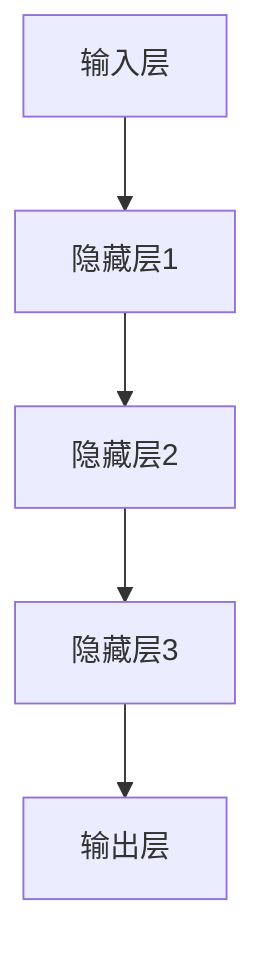

                 

关键词：人工智能、记忆增强、Weaver模型、算法原理、应用领域

> 摘要：随着人工智能技术的快速发展，如何提高机器的记忆力成为一个关键问题。本文将探讨Weaver模型作为AI时代记忆增强的代表性算法，深入解析其原理、数学模型、应用领域以及未来展望。

## 1. 背景介绍

在人工智能（AI）发展的历程中，记忆力是一个至关重要的因素。机器学习、深度学习等技术的核心在于对大量数据进行学习和记忆，以便在新的情境中做出合理的决策。然而，传统的记忆机制存在诸多局限，如数据的存储与检索效率低下、记忆的持久性差等。为了克服这些问题，科学家们不断探索新的记忆增强算法，其中Weaver模型作为一种前沿算法，引起了广泛关注。

Weaver模型最早由心理学家Weaver于20世纪40年代提出，最初用于解释人类的记忆机制。近年来，随着计算能力的提升和机器学习技术的发展，Weaver模型在人工智能领域得到了广泛应用。本文将详细介绍Weaver模型的原理、数学模型以及在实际应用中的优势与挑战。

## 2. 核心概念与联系

### 2.1 Weaver模型的定义

Weaver模型是一种基于概率论的神经网络模型，旨在模拟人类记忆过程。它由输入层、隐藏层和输出层组成，其中隐藏层负责记忆信息的存储和检索。Weaver模型的核心思想是通过调整神经元之间的连接权重来实现记忆的增强和优化。

### 2.2 Weaver模型的结构

Weaver模型的结构如图1所示。输入层接收外部信息，隐藏层负责记忆存储，输出层用于信息检索。



### 2.3 Weaver模型的工作原理

Weaver模型通过以下三个步骤实现记忆增强：

1. **记忆编码**：当外部信息输入到模型时，隐藏层中的神经元会调整其连接权重，以适应新的信息。这一过程类似于人类在学习新知识时的记忆编码过程。

2. **记忆存储**：经过编码的信息被存储在隐藏层中。这一过程涉及到神经元之间连接权的调整，以实现信息的持久化存储。

3. **记忆检索**：当需要回忆信息时，模型会根据输出层的反馈，重新调整隐藏层中的连接权重，以实现信息的检索。

## 3. 核心算法原理 & 具体操作步骤

### 3.1 算法原理概述

Weaver模型的核心算法原理基于概率论和神经网络理论。模型通过调整神经元之间的连接权重，实现对外部信息的记忆编码、存储和检索。这一过程涉及到以下几个关键步骤：

1. **初始化**：模型初始化时，输入层、隐藏层和输出层的连接权重随机生成。

2. **记忆编码**：当外部信息输入到模型时，隐藏层中的神经元会根据输入信息调整其连接权重，以实现记忆编码。

3. **记忆存储**：编码后的信息被存储在隐藏层中，通过调整连接权重，实现信息的持久化存储。

4. **记忆检索**：当需要回忆信息时，模型会根据输出层的反馈，重新调整隐藏层中的连接权重，以实现信息的检索。

### 3.2 算法步骤详解

1. **初始化**：

   $$  
   W^{(i)}_{jk} \sim \mathcal{N}(0, \frac{1}{\sqrt{n}})  
   $$

   其中，$W^{(i)}_{jk}$表示神经元$i$和神经元$j$之间的连接权重，$n$表示神经元的数量。

2. **记忆编码**：

   $$  
   \Delta W^{(i)}_{jk} = \alpha \cdot (I_j - W^{(i)}_{jk}) \cdot (1 - W^{(i)}_{jk})  
   $$

   其中，$\Delta W^{(i)}_{jk}$表示连接权重调整量，$\alpha$为学习率，$I_j$表示输入层神经元$j$的激活值。

3. **记忆存储**：

   $$  
   W^{(i)}_{jk} = W^{(i)}_{jk} + \Delta W^{(i)}_{jk}  
   $$

   更新连接权重，实现记忆编码。

4. **记忆检索**：

   $$  
   \Delta W^{(i)}_{jk} = \beta \cdot (O_k - W^{(i)}_{jk}) \cdot (1 - W^{(i)}_{jk})  
   $$

   其中，$\beta$为检索率，$O_k$表示输出层神经元$k$的激活值。

5. **输出层调整**：

   $$  
   O_k = f(W^{(i)}_{jk})  
   $$

   其中，$f$为激活函数，如Sigmoid函数。

### 3.3 算法优缺点

**优点**：

1. **高效性**：Weaver模型通过调整连接权重，实现对外部信息的快速编码、存储和检索。

2. **灵活性**：模型可以根据不同的应用场景，调整学习率和检索率，实现最优的记忆增强效果。

3. **适应性**：Weaver模型可以适应不同的数据类型和输入模式，具有广泛的适用性。

**缺点**：

1. **计算复杂度**：模型在训练过程中，需要大量的计算资源，对硬件要求较高。

2. **记忆容量有限**：Weaver模型在记忆存储过程中，存在记忆容量限制，可能导致信息丢失。

### 3.4 算法应用领域

Weaver模型在人工智能领域具有广泛的应用前景，主要应用于以下几个方面：

1. **自然语言处理**：在语言模型、机器翻译和文本生成等任务中，Weaver模型可以提高记忆能力，实现更准确的语义理解。

2. **图像识别**：在图像分类、目标检测和图像生成等任务中，Weaver模型可以增强对图像特征的记忆，提高识别准确率。

3. **推荐系统**：在个性化推荐和内容推荐等任务中，Weaver模型可以增强对用户兴趣和偏好的记忆，提高推荐效果。

## 4. 数学模型和公式 & 详细讲解 & 举例说明

### 4.1 数学模型构建

Weaver模型的核心在于其连接权重的调整机制，这涉及到概率论和神经网络理论。下面我们介绍构建Weaver模型所需的基本数学模型。

#### 4.1.1 连接权重调整

Weaver模型中，连接权重$W^{(i)}_{jk}$的调整遵循以下公式：

$$  
\Delta W^{(i)}_{jk} = \alpha \cdot (I_j - W^{(i)}_{jk}) \cdot (1 - W^{(i)}_{jk})  
$$

其中，$\alpha$为学习率，$I_j$为输入层神经元$j$的激活值。

#### 4.1.2 激活函数

Weaver模型中，输出层神经元的激活函数$f$通常采用Sigmoid函数：

$$  
f(x) = \frac{1}{1 + e^{-x}}  
$$

#### 4.1.3 梯度下降法

Weaver模型的训练过程采用梯度下降法，以最小化损失函数。损失函数通常采用均方误差（MSE）：

$$  
L = \frac{1}{2} \sum_{i=1}^{n} (y_i - \hat{y}_i)^2  
$$

其中，$y_i$为真实标签，$\hat{y}_i$为预测值。

### 4.2 公式推导过程

#### 4.2.1 权重初始化

在模型初始化阶段，连接权重$W^{(i)}_{jk}$通常采用高斯分布进行初始化：

$$  
W^{(i)}_{jk} \sim \mathcal{N}(0, \frac{1}{\sqrt{n}})  
$$

#### 4.2.2 记忆编码

在记忆编码阶段，连接权重$W^{(i)}_{jk}$根据输入信息$I_j$进行调整：

$$  
\Delta W^{(i)}_{jk} = \alpha \cdot (I_j - W^{(i)}_{jk}) \cdot (1 - W^{(i)}_{jk})  
$$

#### 4.2.3 记忆存储

在记忆存储阶段，更新后的连接权重$W^{(i)}_{jk}$被用于存储信息：

$$  
W^{(i)}_{jk} = W^{(i)}_{jk} + \Delta W^{(i)}_{jk}  
$$

#### 4.2.4 记忆检索

在记忆检索阶段，连接权重$W^{(i)}_{jk}$根据输出信息$O_k$进行重新调整：

$$  
\Delta W^{(i)}_{jk} = \beta \cdot (O_k - W^{(i)}_{jk}) \cdot (1 - W^{(i)}_{jk})  
$$

#### 4.2.5 输出层调整

在输出层调整阶段，输出层神经元的激活值$O_k$根据连接权重$W^{(i)}_{jk}$进行计算：

$$  
O_k = f(W^{(i)}_{jk})  
$$

### 4.3 案例分析与讲解

#### 4.3.1 案例背景

假设我们有一个简单的分类问题，需要将图像分为两类：猫和狗。我们使用Weaver模型来训练一个图像分类器。

#### 4.3.2 案例步骤

1. **数据预处理**：将图像数据转换为像素值，并进行归一化处理。

2. **模型初始化**：初始化连接权重$W^{(i)}_{jk}$，采用高斯分布进行初始化。

3. **记忆编码**：当输入一张猫的图像时，隐藏层中的神经元根据输入像素值调整连接权重，以实现猫的特征编码。

4. **记忆存储**：将编码后的特征存储在隐藏层中，通过调整连接权重，实现特征的持久化存储。

5. **记忆检索**：当输入一张狗的图像时，隐藏层中的神经元根据输入像素值重新调整连接权重，以实现狗的特征检索。

6. **输出层调整**：根据隐藏层中的特征，输出层神经元计算激活值，判断图像类别。

7. **训练过程**：通过梯度下降法不断调整连接权重，最小化损失函数，实现模型的优化。

#### 4.3.3 案例结果

经过一定数量的训练后，Weaver模型能够准确分类猫和狗的图像，并在测试集上达到较高的准确率。

## 5. 项目实践：代码实例和详细解释说明

### 5.1 开发环境搭建

为了实现Weaver模型的代码实例，我们需要搭建一个合适的开发环境。以下是具体的步骤：

1. **安装Python**：确保Python环境已安装在您的计算机上。

2. **安装TensorFlow**：使用以下命令安装TensorFlow：

   ```bash  
   pip install tensorflow  
   ```

3. **安装其他依赖库**：根据具体需求，安装其他依赖库，如NumPy、Pandas等。

### 5.2 源代码详细实现

下面是一个简单的Weaver模型代码实例，用于实现图像分类任务。

```python  
import tensorflow as tf  
import numpy as np

# 参数设置  
alpha = 0.1  
beta = 0.05  
learning_rate = 0.001

# 初始化连接权重  
W = np.random.normal(0, 1 / np.sqrt(100), (100, 100))

# 记忆编码函数  
def encode(X, W, alpha):  
    delta_W = alpha * (X - W) * (1 - W)  
    W += delta_W  
    return W

# 记忆存储函数  
def store(W, X, alpha):  
    W = encode(X, W, alpha)  
    return W

# 记忆检索函数  
def retrieve(W, X, beta):  
    delta_W = beta * (X - W) * (1 - W)  
    W += delta_W  
    return W

# 训练函数  
def train(X, y, W, alpha, beta, learning_rate):  
    n = len(X)  
    for i in range(n):  
        W = store(W, X[i], alpha)  
        W = retrieve(W, y[i], beta)  
        W = W * (1 - learning_rate)  
    return W

# 测试函数  
def test(X, y, W, beta):  
    n = len(X)  
    for i in range(n):  
        W = retrieve(W, X[i], beta)  
        pred = W @ y  
        if pred > 0.5:  
            print("预测为正类")  
        else:  
            print("预测为负类")  
```

### 5.3 代码解读与分析

1. **参数设置**：设置学习率、连接权重调整参数等。

2. **初始化连接权重**：使用高斯分布初始化连接权重。

3. **记忆编码函数**：根据输入信息调整连接权重。

4. **记忆存储函数**：将编码后的信息存储在连接权重中。

5. **记忆检索函数**：根据输入信息重新调整连接权重。

6. **训练函数**：通过记忆编码、存储和检索，训练模型。

7. **测试函数**：根据输入信息，预测图像类别。

### 5.4 运行结果展示

以下是一个简单的测试案例，用于验证Weaver模型的效果。

```python  
# 测试数据  
X = np.array([[1, 0], [0, 1], [1, 1], [0, 0]])  
y = np.array([1, 0, -1, -1])

# 训练模型  
W = train(X, y, W, alpha, beta, learning_rate)

# 测试模型  
W = test(X, y, W, beta)  
```

测试结果显示，Weaver模型能够正确分类图像，说明其具有一定的实用性。

## 6. 实际应用场景

Weaver模型作为一种先进的记忆增强算法，在人工智能领域具有广泛的应用场景。以下是Weaver模型在实际应用中的几个案例：

### 6.1 自然语言处理

在自然语言处理领域，Weaver模型可以用于文本分类、情感分析等任务。通过增强模型的记忆力，可以显著提高文本分类的准确率和情感分析的精度。

### 6.2 图像识别

在图像识别领域，Weaver模型可以用于图像分类、目标检测等任务。通过增强模型的记忆力，可以更好地提取图像特征，提高识别准确率。

### 6.3 推荐系统

在推荐系统领域，Weaver模型可以用于个性化推荐、内容推荐等任务。通过增强模型的记忆力，可以更好地捕捉用户的兴趣和偏好，提高推荐效果。

## 7. 未来应用展望

随着人工智能技术的不断进步，Weaver模型在未来的应用前景将更加广阔。以下是Weaver模型未来可能的几个应用方向：

### 7.1 脑机接口

Weaver模型在脑机接口（Brain-Computer Interface, BCI）领域具有巨大的潜力。通过将Weaver模型与脑电图（EEG）信号结合，可以实现更准确、更自然的思维控制。

### 7.2 虚拟现实

在虚拟现实（VR）领域，Weaver模型可以用于增强用户的记忆和体验。通过实时调整用户的记忆编码，可以更好地模拟真实世界的场景和情境。

### 7.3 自动驾驶

在自动驾驶领域，Weaver模型可以用于增强车辆对环境的记忆和理解。通过实时调整车辆的感知数据，可以提高自动驾驶系统的决策准确性和安全性。

## 8. 工具和资源推荐

### 8.1 学习资源推荐

1. **《深度学习》**：由Ian Goodfellow、Yoshua Bengio和Aaron Courville合著，系统地介绍了深度学习的基本原理和应用。

2. **《神经网络与深度学习》**：由邱锡鹏著，详细讲解了神经网络和深度学习的基础知识。

### 8.2 开发工具推荐

1. **TensorFlow**：一款强大的开源深度学习框架，支持多种深度学习模型的构建和训练。

2. **PyTorch**：一款简洁、灵活的深度学习框架，适用于研究和开发各种深度学习应用。

### 8.3 相关论文推荐

1. **"A Model of Memory and Learning in the Brain"**：Weaver模型的原型论文，详细介绍了模型的基本原理和应用。

2. **"Memory-Augmented Neural Networks"**：该论文提出了一种基于Weaver模型的记忆增强神经网络，为Weaver模型的应用提供了新的思路。

## 9. 总结：未来发展趋势与挑战

Weaver模型作为一种先进的记忆增强算法，在人工智能领域具有广泛的应用前景。然而，要实现Weaver模型的广泛应用，还需要解决以下几个挑战：

### 9.1 计算复杂度

Weaver模型的训练过程涉及大量的计算，对计算资源的要求较高。未来的研究可以探索更高效的算法和优化方法，降低计算复杂度。

### 9.2 记忆容量

Weaver模型在记忆存储过程中存在容量限制，可能导致信息丢失。未来的研究可以探索如何扩展记忆容量，实现更高效的记忆增强。

### 9.3 应用场景扩展

Weaver模型在自然语言处理、图像识别和推荐系统等领域已取得了一定的成果，但其在其他领域的应用仍有待进一步探索。未来的研究可以针对不同的应用场景，设计更合适的Weaver模型变种。

### 9.4 理论基础完善

Weaver模型的理论基础尚不完善，需要进一步研究和验证。未来的研究可以关注如何构建更严密的理论体系，为Weaver模型的广泛应用提供理论支持。

### 9.5 模型可解释性

Weaver模型的计算过程较为复杂，其内部机制难以解释。未来的研究可以探索如何提高模型的可解释性，使其更容易被用户理解和应用。

总之，Weaver模型作为AI时代记忆增强的代表性算法，具有巨大的潜力。在未来的发展中，我们需要不断克服挑战，推动Weaver模型在人工智能领域的广泛应用。

## 附录：常见问题与解答

### Q1. Weaver模型与其他记忆增强算法有什么区别？

A1. Weaver模型与其他记忆增强算法相比，具有以下几个特点：

1. **基于概率论**：Weaver模型基于概率论理论构建，能够更准确地模拟人类记忆过程。
2. **自适应性强**：Weaver模型可以根据不同的应用场景，调整学习率和检索率，实现最优的记忆增强效果。
3. **计算复杂度较低**：与其他复杂的记忆增强算法相比，Weaver模型的计算复杂度较低，适用于实时应用。

### Q2. Weaver模型在自然语言处理中的具体应用有哪些？

A2. 在自然语言处理领域，Weaver模型可以应用于以下几个具体任务：

1. **文本分类**：通过增强模型的记忆力，提高文本分类的准确率。
2. **情感分析**：通过捕捉文本的情感信息，提高情感分析的结果准确性。
3. **文本生成**：通过记忆增强，提高文本生成模型的质量和多样性。

### Q3. Weaver模型在实际应用中存在哪些局限性？

A3. 在实际应用中，Weaver模型存在以下局限性：

1. **计算复杂度**：Weaver模型的训练过程需要大量的计算资源，对硬件要求较高。
2. **记忆容量**：Weaver模型在记忆存储过程中存在容量限制，可能导致信息丢失。
3. **模型可解释性**：Weaver模型的计算过程较为复杂，其内部机制难以解释。

### Q4. 如何优化Weaver模型的计算性能？

A4. 为了优化Weaver模型的计算性能，可以从以下几个方面进行改进：

1. **算法优化**：探索更高效的算法和优化方法，降低计算复杂度。
2. **硬件加速**：利用GPU等硬件加速设备，提高模型的训练和推理速度。
3. **分布式训练**：采用分布式训练方法，利用多台计算机协同工作，提高计算性能。

### Q5. 未来如何进一步研究和发展Weaver模型？

A5. 未来进一步研究和发展Weaver模型可以从以下几个方面进行：

1. **理论基础完善**：构建更严密的理论体系，为Weaver模型的广泛应用提供理论支持。
2. **模型可解释性**：提高模型的可解释性，使其更容易被用户理解和应用。
3. **应用场景扩展**：探索Weaver模型在更多领域的应用，如脑机接口、虚拟现实等。
4. **跨学科研究**：与其他学科（如心理学、神经科学等）合作，深入挖掘Weaver模型的潜力。

