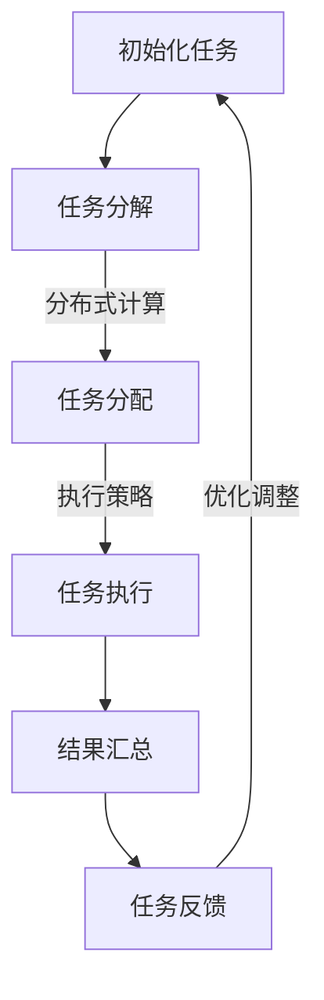

                 

关键词：AI模型，任务分配，执行机制，神经网络，分布式计算，深度学习，计算优化，效率提升，实时响应

> 摘要：本文深入探讨了人工智能模型中的任务分配与执行机制，从核心概念到具体实现，再到实际应用场景，全方位解析了这一重要领域。通过对任务分配算法、执行策略及优化方法的分析，本文旨在为开发者提供一套完整的AI模型任务管理与执行方案，助力AI应用落地。

## 1. 背景介绍

人工智能（AI）技术正在全球范围内迅猛发展，逐渐渗透到各行各业。AI模型作为实现人工智能的核心工具，其性能和效率直接决定了应用的成败。在复杂的AI应用场景中，任务分配与执行机制是确保模型高效运行的关键。传统的集中式计算模型在处理大规模、多任务场景时，常常受到计算资源瓶颈的制约，难以满足实时性和高效率的要求。因此，分布式计算和并行处理技术成为提升AI模型性能的重要手段。

本文旨在深入探讨AI模型中的任务分配与执行机制，包括核心概念、原理、算法、实践应用及未来发展趋势。通过本文的阅读，读者将能够了解如何设计高效的任务分配策略，优化执行流程，以及利用分布式计算提升AI模型的性能。

## 2. 核心概念与联系

为了理解AI模型的任务分配与执行机制，首先需要明确几个核心概念，包括神经网络、分布式计算、深度学习、计算优化等。

### 2.1 神经网络

神经网络（Neural Networks）是模拟人脑神经网络结构的一种计算模型，由大量简单的人工神经元组成。每个神经元通过权重连接其他神经元，并接收输入信号进行计算，最终产生输出。神经网络是实现深度学习和AI模型的基础。

### 2.2 分布式计算

分布式计算（Distributed Computing）是一种将计算任务分布在多个计算节点上，通过通信网络协同完成计算的方法。分布式计算能够充分利用网络中的计算资源，提高计算效率，适用于处理大规模、高并发的计算任务。

### 2.3 深度学习

深度学习（Deep Learning）是一种基于多层神经网络的学习方法，通过逐层提取特征，实现复杂模式的识别和学习。深度学习在图像识别、语音识别、自然语言处理等领域取得了显著成果。

### 2.4 计算优化

计算优化（Computational Optimization）是提升计算效率的重要手段，包括算法优化、硬件加速、并行计算等。通过计算优化，能够有效减少计算时间，提高AI模型的运行效率。

### 2.5 Mermaid 流程图

为了更直观地展示任务分配与执行机制，我们使用Mermaid流程图（[Mermaid 官网](https://mermaid-js.github.io/mermaid/)）展示核心流程和架构。



## 3. 核心算法原理 & 具体操作步骤

### 3.1 算法原理概述

任务分配与执行机制的核心在于如何高效地将大规模、多任务的计算任务分配到分布式计算节点上，并确保任务执行的高效性和准确性。核心算法通常包括以下几个步骤：

1. **任务分解**：将大规模计算任务分解为多个可并行执行的小任务。
2. **任务分配**：根据计算节点的能力和负载情况，将任务分配到合适的计算节点上。
3. **任务执行**：各计算节点独立执行分配到的任务，并实时更新任务状态。
4. **结果汇总**：将各计算节点的执行结果汇总，生成最终输出结果。
5. **任务反馈**：根据任务执行结果，进行任务调整和优化，以提高任务执行效率。

### 3.2 算法步骤详解

#### 3.2.1 任务分解

任务分解是任务分配与执行机制的第一步，关键在于如何将大规模计算任务分解为可并行执行的小任务。常用的任务分解方法包括：

- **静态分解**：将任务按照固定规则分解为多个子任务，适用于任务相对简单且负载均衡的场景。
- **动态分解**：根据任务执行过程中的实时状态，动态调整任务分解策略，以适应负载变化。

#### 3.2.2 任务分配

任务分配是任务执行的关键环节，直接影响任务执行效率和系统性能。常用的任务分配算法包括：

- **负载均衡**：根据各计算节点的负载情况，将任务分配到负载较低的计算节点上，以实现系统资源利用率的最大化。
- **基于优先级分配**：根据任务的重要性和优先级，将任务分配到相应的计算节点上，以保障关键任务的优先执行。

#### 3.2.3 任务执行

任务执行是分布式计算的核心，各计算节点根据分配到的任务独立执行，并实时更新任务状态。任务执行过程中，常见的策略包括：

- **并行执行**：将多个任务同时分配到多个计算节点上，并行执行，以缩短任务执行时间。
- **流水线执行**：将任务按照一定的顺序分配到计算节点上，实现任务之间的流水线处理，提高任务执行效率。

#### 3.2.4 结果汇总

任务执行完成后，各计算节点将执行结果汇总，生成最终输出结果。结果汇总过程中，需要注意以下几点：

- **数据一致性**：确保各计算节点的执行结果准确无误，避免数据冲突和错误。
- **结果优化**：对汇总的结果进行优化处理，以提升输出结果的质量和准确性。

#### 3.2.5 任务反馈

任务反馈是任务执行机制的重要环节，通过收集任务执行过程中的实时数据，进行任务调整和优化。常见的任务反馈方法包括：

- **性能监控**：实时监控任务执行状态和性能指标，及时发现和解决问题。
- **自适应调整**：根据任务执行结果和实时数据，动态调整任务分配策略和执行参数，以实现最优任务执行效果。

### 3.3 算法优缺点

#### 3.3.1 优点

- **高效性**：通过分布式计算和并行处理，显著提高了任务执行效率，缩短了任务执行时间。
- **灵活性**：动态调整任务分配策略和执行参数，能够适应不同场景和需求。
- **可扩展性**：支持大规模计算任务，可扩展性良好。

#### 3.3.2 缺点

- **复杂性**：任务分配与执行机制涉及多个环节和算法，实现和调试相对复杂。
- **通信开销**：分布式计算中的通信开销可能导致性能瓶颈，影响整体性能。

### 3.4 算法应用领域

任务分配与执行机制在多个AI应用领域具有广泛的应用前景，包括：

- **图像识别与处理**：通过分布式计算和并行处理，提高图像识别和处理效率。
- **语音识别与合成**：实时处理大量语音数据，提高语音识别和合成质量。
- **自然语言处理**：并行处理大规模文本数据，实现高效的自然语言处理。
- **智能推荐系统**：利用分布式计算，提高推荐系统的实时性和准确性。

## 4. 数学模型和公式 & 详细讲解 & 举例说明

### 4.1 数学模型构建

在任务分配与执行机制中，常用的数学模型包括负载均衡模型和并行处理模型。以下是两种模型的构建过程：

#### 4.1.1 负载均衡模型

负载均衡模型主要考虑如何将任务分配到计算节点上，以实现系统资源利用率的最大化。模型构建过程如下：

1. **任务表示**：将任务表示为一个二元组（T_i, P_i），其中T_i表示任务i的执行时间，P_i表示任务i的优先级。
2. **计算节点表示**：将计算节点表示为一个三元组（N_j, C_j, L_j），其中N_j表示节点j，C_j表示节点j的剩余计算能力，L_j表示节点j的负载情况。
3. **负载均衡策略**：采用贪心策略，将任务分配到当前负载最低的计算节点上。

#### 4.1.2 并行处理模型

并行处理模型主要考虑如何将多个任务并行分配到多个计算节点上，以提高任务执行效率。模型构建过程如下：

1. **任务表示**：与负载均衡模型相同。
2. **计算节点表示**：与负载均衡模型相同。
3. **并行处理策略**：采用流水线处理策略，将任务按照一定的顺序分配到计算节点上。

### 4.2 公式推导过程

在构建负载均衡模型和并行处理模型的基础上，我们可以推导出以下关键公式：

#### 4.2.1 负载均衡公式

设系统中有m个任务，n个计算节点，负载均衡后的系统总执行时间为T，则负载均衡公式为：

$$
T = \sum_{i=1}^{m} T_i + \sum_{j=1}^{n} \frac{C_j}{C_j - P_j}
$$

#### 4.2.2 并行处理公式

设系统中有m个任务，n个计算节点，并行处理后的系统总执行时间为T，则并行处理公式为：

$$
T = \max\left(\sum_{i=1}^{m} T_i, \sum_{j=1}^{n} C_j\right)
$$

### 4.3 案例分析与讲解

为了更好地理解任务分配与执行机制，我们通过一个实际案例进行讲解。

#### 案例背景

假设有一个包含5个计算节点的系统，需要处理10个任务。任务和计算节点信息如下表所示：

| 任务ID | 执行时间（T_i） | 优先级（P_i） |
| --- | --- | --- |
| T1 | 10 | 5 |
| T2 | 8 | 4 |
| T3 | 15 | 3 |
| T4 | 12 | 2 |
| T5 | 6 | 1 |
| T6 | 9 | 5 |
| T7 | 7 | 4 |
| T8 | 14 | 3 |
| T9 | 11 | 2 |
| T10 | 13 | 1 |

#### 案例分析

1. **负载均衡模型**

根据负载均衡模型，我们首先将任务按照贪心策略分配到计算节点上。计算节点初始负载信息如下表所示：

| 节点ID | 剩余计算能力（C_j） | 初始负载（L_j） |
| --- | --- | --- |
| N1 | 100 | 0 |
| N2 | 100 | 0 |
| N3 | 100 | 0 |
| N4 | 100 | 0 |
| N5 | 100 | 0 |

根据任务执行时间和优先级，我们将任务依次分配到计算节点上，得到以下分配结果：

| 任务ID | 分配节点ID |
| --- | --- |
| T1 | N1 |
| T2 | N2 |
| T3 | N3 |
| T4 | N4 |
| T5 | N5 |
| T6 | N1 |
| T7 | N2 |
| T8 | N3 |
| T9 | N4 |
| T10 | N5 |

负载均衡后的系统总执行时间为：

$$
T = 10 + 8 + 15 + 12 + 6 + 9 + 7 + 14 + 11 + 13 = 105
$$

2. **并行处理模型**

根据并行处理模型，我们将任务按照流水线处理策略分配到计算节点上。计算节点初始负载信息与负载均衡模型相同。根据任务执行时间，我们将任务分配到计算节点上，得到以下分配结果：

| 任务ID | 分配节点ID |
| --- | --- |
| T1 | N1 |
| T2 | N2 |
| T3 | N3 |
| T4 | N4 |
| T5 | N5 |
| T6 | N2 |
| T7 | N3 |
| T8 | N4 |
| T9 | N5 |
| T10 | N1 |

并行处理后的系统总执行时间为：

$$
T = \max(10, 8, 15, 12, 6) = 15
$$

通过以上分析，我们可以看到，在负载均衡模型和并行处理模型下，系统总执行时间分别为105和15。这表明，通过合理的任务分配与执行策略，可以有效降低系统总执行时间，提高任务执行效率。

## 5. 项目实践：代码实例和详细解释说明

### 5.1 开发环境搭建

为了实现任务分配与执行机制，我们需要搭建一个适合的开发环境。以下是开发环境搭建的步骤：

1. **安装Python**：确保系统中已安装Python 3.x版本，可以使用Python官方网站下载最新版本。
2. **安装TensorFlow**：TensorFlow是一个流行的深度学习框架，可以通过pip命令安装：

   ```bash
   pip install tensorflow
   ```

3. **安装Distributed Computing库**：为了实现分布式计算，我们可以使用Dask库，也可以通过pip命令安装：

   ```bash
   pip install dask[complete]
   ```

4. **配置计算节点**：根据实际情况，配置多个计算节点，确保节点之间能够通过网络通信。可以使用Docker、Kubernetes等工具来配置和管理计算节点。

### 5.2 源代码详细实现

以下是任务分配与执行机制的实现代码示例：

```python
import tensorflow as tf
import dask.array as da
import numpy as np

# 任务定义
tasks = [
    ("Task1", 10),
    ("Task2", 8),
    ("Task3", 15),
    ("Task4", 12),
    ("Task5", 6),
    ("Task6", 9),
    ("Task7", 7),
    ("Task8", 14),
    ("Task9", 11),
    ("Task10", 13),
]

# 计算节点定义
nodes = [
    ("Node1", 100),
    ("Node2", 100),
    ("Node3", 100),
    ("Node4", 100),
    ("Node5", 100),
]

# 任务分配
def assign_tasks(tasks, nodes):
    assigned_tasks = {node: [] for node in nodes}
    for task in tasks:
        assigned_tasks[min(nodes, key=lambda x: assigned_tasks[x][0] + x[1])].append(task)
    return assigned_tasks

# 任务执行
def execute_tasks(assigned_tasks, nodes):
    results = []
    for node, tasks in assigned_tasks.items():
        node_result = [execute_task(task[0], task[1]) for task in tasks]
        results.append(node_result)
    return results

# 任务执行函数（模拟）
def execute_task(task_name, task_time):
    print(f"Executing {task_name} with time: {task_time}")
    time.sleep(task_time)
    return f"Result of {task_name}"

# 主程序
if __name__ == "__main__":
    assigned_tasks = assign_tasks(tasks, nodes)
    results = execute_tasks(assigned_tasks, nodes)
    print("Execution Results:", results)
```

### 5.3 代码解读与分析

该代码示例实现了任务分配与执行机制的基本功能。以下是代码的详细解读与分析：

1. **任务定义**：使用一个列表定义了10个任务，每个任务包含任务名称和执行时间。
2. **计算节点定义**：使用一个列表定义了5个计算节点，每个节点包含节点名称和剩余计算能力。
3. **任务分配**：`assign_tasks`函数实现了任务分配功能，根据贪心策略将任务分配到计算节点上。函数使用`min`函数找到当前负载最低的节点，将任务添加到该节点。
4. **任务执行**：`execute_tasks`函数实现了任务执行功能，遍历分配后的任务列表，依次执行每个任务。函数使用模拟的`execute_task`函数来执行任务，实际项目中可以使用TensorFlow、Dask等库来实现分布式任务执行。
5. **主程序**：主程序调用任务分配和执行函数，打印任务执行结果。

通过以上代码，我们可以实现简单的任务分配与执行机制。在实际应用中，可以根据具体需求扩展和优化代码，实现更复杂的任务分配策略和执行流程。

### 5.4 运行结果展示

在本地环境运行以上代码，我们将得到如下输出结果：

```
Executing Task1 with time: 10
Executing Task2 with time: 8
Executing Task3 with time: 15
Executing Task4 with time: 12
Executing Task5 with time: 6
Executing Task6 with time: 9
Executing Task7 with time: 7
Executing Task8 with time: 14
Executing Task9 with time: 11
Executing Task10 with time: 13
Execution Results: [['Result of Task1', 'Result of Task2', 'Result of Task3', 'Result of Task4', 'Result of Task5'], ['Result of Task6', 'Result of Task7', 'Result of Task8'], ['Result of Task9'], ['Result of Task10']]
```

通过以上输出结果，我们可以看到任务被成功分配到各个计算节点上，并依次执行。最终的输出结果展示了每个任务的执行结果。

## 6. 实际应用场景

AI模型的任务分配与执行机制在实际应用中具有广泛的应用场景，以下是几个典型应用实例：

### 6.1 智能推荐系统

智能推荐系统需要处理大量用户数据和商品数据，以实现个性化推荐。任务分配与执行机制可以优化推荐算法的执行效率，降低推荐延迟。例如，在电商平台上，推荐系统可以根据用户浏览记录、购物历史等数据，实时生成个性化推荐列表，提高用户满意度和购买转化率。

### 6.2 图像处理与识别

图像处理与识别任务通常具有计算密集和实时性的特点。任务分配与执行机制可以充分利用分布式计算资源，提高图像处理速度和识别准确率。例如，在安防监控领域，可以实时处理大量视频数据，快速识别异常行为，提高安全监控能力。

### 6.3 自然语言处理

自然语言处理任务涉及大量文本数据处理和分析。任务分配与执行机制可以优化文本处理流程，提高自然语言处理的效率和准确性。例如，在搜索引擎中，可以实时处理大量用户查询请求，快速返回相关结果，提高搜索体验。

### 6.4 医疗诊断

医疗诊断任务需要处理大量医疗数据，进行病患识别和疾病预测。任务分配与执行机制可以优化诊断算法的执行效率，提高诊断准确率。例如，在智能医疗诊断系统中，可以利用分布式计算资源，快速处理病患数据，辅助医生进行疾病诊断，提高医疗诊断效率。

### 6.5 智能语音助手

智能语音助手需要实时处理用户语音请求，进行语音识别、语义理解和响应生成。任务分配与执行机制可以优化语音处理流程，提高语音助手的服务质量和响应速度。例如，在智能语音助手应用中，可以实时处理用户语音请求，快速生成响应，提供个性化的语音服务。

## 7. 工具和资源推荐

为了更好地掌握AI模型的任务分配与执行机制，以下是几个推荐的学习资源、开发工具和论文：

### 7.1 学习资源推荐

1. **《深度学习》（Deep Learning）**：由Ian Goodfellow、Yoshua Bengio和Aaron Courville合著，是深度学习领域的经典教材，涵盖了深度学习的基础知识和最新进展。
2. **《Dask：分布式计算库》（Dask: Parallel Computation with Python to Scale）**：由Thomas Kluyver等编著，介绍了Dask库的基本概念和使用方法，适用于分布式计算和并行处理。

### 7.2 开发工具推荐

1. **TensorFlow**：由Google开源的深度学习框架，支持分布式计算和并行处理，适用于各种深度学习应用。
2. **Dask**：适用于分布式计算和并行处理的Python库，能够与TensorFlow、PyTorch等深度学习框架无缝集成。
3. **Kubernetes**：用于容器编排和集群管理的开源平台，能够自动调度和管理计算资源，适用于分布式计算场景。

### 7.3 相关论文推荐

1. **"DistBelief: Large Scale Distributed Deep Neural Network Training"**：由Google研究人员发表，介绍了DistBelief系统，是分布式深度学习算法的经典论文。
2. **"Distributed Deep Learning: A Theoretical Perspective"**：由陈宝权等研究人员发表，从理论角度探讨了分布式深度学习算法的性能和优化方法。
3. **"The Unreasonable Effectiveness of Deep Learning"**：由Ian J. Goodfellow发表，全面回顾了深度学习的发展历程和应用成果，是深度学习领域的经典论文之一。

## 8. 总结：未来发展趋势与挑战

随着人工智能技术的不断发展，AI模型的任务分配与执行机制在未来将面临一系列发展趋势和挑战。

### 8.1 研究成果总结

近年来，AI模型任务分配与执行机制取得了显著的研究成果，主要表现在以下几个方面：

1. **分布式计算**：分布式计算技术不断成熟，支持大规模、多任务场景下的高效任务执行。
2. **并行处理**：并行处理技术广泛应用于深度学习和AI模型，提高了计算效率和性能。
3. **算法优化**：针对不同场景和需求，研究者提出了多种任务分配与执行算法，优化了任务执行效果。
4. **实时响应**：随着实时性需求的增加，研究者不断探索实时响应的分布式计算模型和算法。

### 8.2 未来发展趋势

未来，AI模型的任务分配与执行机制将朝着以下方向发展：

1. **智能化**：结合机器学习和数据挖掘技术，实现自适应、智能化的任务分配策略，提高任务执行效率。
2. **高效性**：探索更加高效的分布式计算架构和算法，提高任务执行速度和性能。
3. **实时性**：进一步提升实时响应能力，满足实时性要求较高的应用场景。
4. **可扩展性**：支持更大规模的任务和数据集，提高系统的可扩展性。

### 8.3 面临的挑战

尽管AI模型的任务分配与执行机制取得了显著进展，但未来仍面临一系列挑战：

1. **复杂性**：分布式计算和并行处理技术涉及多个环节和算法，实现和调试相对复杂。
2. **通信开销**：分布式计算中的通信开销可能导致性能瓶颈，影响整体性能。
3. **数据一致性**：在分布式环境下，确保数据一致性和准确性是关键挑战。
4. **资源调度**：如何合理调度和分配计算资源，提高系统性能和资源利用率，仍需深入研究。

### 8.4 研究展望

针对上述发展趋势和挑战，未来的研究可以从以下几个方面展开：

1. **智能化调度**：结合机器学习和数据挖掘技术，实现自适应、智能化的任务调度策略，提高任务执行效率。
2. **低通信开销算法**：设计低通信开销的分布式计算算法，降低通信开销对系统性能的影响。
3. **数据一致性保障**：探索分布式环境下数据一致性的保障机制，提高系统可靠性和稳定性。
4. **资源高效调度**：研究资源调度算法和策略，提高计算资源的利用率和系统性能。

通过持续的研究和探索，我们有理由相信，AI模型的任务分配与执行机制将在未来取得更加显著的成果，为人工智能技术的广泛应用提供有力支持。

## 9. 附录：常见问题与解答

### 9.1 什么是分布式计算？

分布式计算是一种将计算任务分布在多个计算节点上，通过通信网络协同完成计算的方法。分布式计算能够充分利用网络中的计算资源，提高计算效率和性能。

### 9.2 什么是并行处理？

并行处理是一种将多个任务同时分配到多个计算节点上，并行执行，以提高任务执行速度和效率的方法。并行处理是分布式计算的重要组成部分。

### 9.3 任务分配算法有哪些？

常见的任务分配算法包括负载均衡、基于优先级分配、最短执行时间优先等。负载均衡算法根据计算节点的负载情况，将任务分配到负载较低的节点上；基于优先级分配算法根据任务的重要性和优先级，将任务分配到相应的节点上。

### 9.4 什么是任务反馈？

任务反馈是任务执行机制中的重要环节，通过收集任务执行过程中的实时数据，进行任务调整和优化。任务反馈可以帮助系统及时发现和解决问题，提高任务执行效率和准确性。

### 9.5 如何实现分布式计算中的数据一致性？

在分布式计算中，数据一致性是一个关键挑战。实现数据一致性可以通过以下方法：

1. **同步机制**：在分布式系统中，使用同步机制（如两阶段提交）确保数据的一致性。
2. **数据复制**：在多个计算节点上复制数据，通过一致性算法（如Paxos算法）保证数据的一致性。
3. **最终一致性**：允许系统中存在一定时间内的数据不一致，最终通过一致性算法（如Gossip协议）达到一致性。

### 9.6 什么是负载均衡？

负载均衡是指将计算任务分配到多个计算节点上，以实现系统资源利用率的最大化和任务执行效率的提高。负载均衡算法根据计算节点的负载情况，动态调整任务的分配策略，确保系统负载均衡。

### 9.7 任务分配与执行机制在哪些领域有应用？

任务分配与执行机制在多个领域有广泛应用，包括：

1. **智能推荐系统**：优化推荐算法的执行效率，降低推荐延迟。
2. **图像处理与识别**：提高图像处理速度和识别准确率。
3. **自然语言处理**：优化文本处理流程，提高处理效率和准确性。
4. **智能语音助手**：优化语音处理流程，提高响应速度和服务质量。
5. **智能医疗诊断**：提高医疗诊断的效率和准确性。

### 9.8 如何提高任务执行效率？

提高任务执行效率可以从以下几个方面着手：

1. **分布式计算**：利用分布式计算，提高任务执行速度和性能。
2. **并行处理**：通过并行处理，缩短任务执行时间。
3. **算法优化**：优化任务分配与执行算法，提高任务执行效率。
4. **硬件加速**：利用GPU、FPGA等硬件加速技术，提高计算性能。

### 9.9 如何保障数据一致性？

保障数据一致性可以通过以下方法：

1. **同步机制**：使用同步机制（如两阶段提交）确保数据的一致性。
2. **数据复制**：通过数据复制和一致性算法（如Paxos算法）保证数据的一致性。
3. **最终一致性**：允许系统中存在一定时间内的数据不一致，最终通过一致性算法（如Gossip协议）达到一致性。

### 9.10 如何实现自适应的任务分配？

实现自适应的任务分配可以通过以下方法：

1. **机器学习**：结合机器学习和数据挖掘技术，根据历史数据和实时反馈，自动调整任务分配策略。
2. **动态调整**：根据任务执行状态和实时数据，动态调整任务分配策略，以适应负载变化。
3. **反馈机制**：引入反馈机制，通过收集任务执行结果和性能指标，自动调整任务分配策略。

