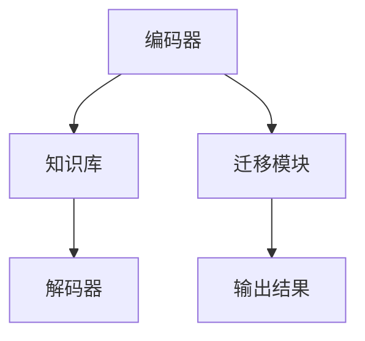

                 

关键词：人工智能、跨域学习、知识迁移、Lepton AI、模型架构、算法优化、数学模型、实践应用

## 摘要

本文旨在探讨AI模型的跨域学习技术，尤其是Lepton AI在知识迁移方面的应用。我们将深入分析Lepton AI的模型架构，详细解读其核心算法原理，并通过数学模型和实际代码实例进行解释。文章还将探讨Lepton AI在不同领域的应用场景，并对其未来发展趋势进行展望。

## 1. 背景介绍

在当前人工智能领域，模型性能的不断提升主要依赖于大规模数据和强大的计算能力。然而，随着应用场景的多样化，数据分布的异质性成为一个亟待解决的问题。传统的AI模型在特定领域表现出色，但难以迁移到其他领域。这种“领域依赖性”限制了AI技术的广泛应用。为了克服这一挑战，跨域学习和知识迁移技术应运而生。

跨域学习旨在使AI模型能够在不同的数据分布和应用场景中保持高性能。知识迁移则强调将一个领域的知识应用到另一个领域，以提高模型在新领域的适应能力。Lepton AI作为一个专注于跨域学习和知识迁移的AI模型，具有显著的独特性和应用价值。

## 2. 核心概念与联系

### 2.1 AI模型的跨域学习

跨域学习是指通过在不同领域之间迁移知识，提高AI模型在未知领域的性能。核心概念包括：

- **数据分布**：不同领域的数据分布差异显著，模型需要适应这种变化。
- **知识迁移**：将一个领域的知识（如特征表示、模型参数等）应用到另一个领域。
- **适应性**：模型在新领域中的表现，包括泛化能力和鲁棒性。

### 2.2 知识迁移

知识迁移是指将一个领域的知识应用到另一个领域，以提升模型在新领域的性能。核心概念包括：

- **知识表示**：如何表示和存储不同领域的知识。
- **迁移策略**：如何在不同领域之间迁移知识，包括预训练、迁移学习等。
- **融合方法**：如何将不同领域的知识进行有效融合，以提升模型性能。

### 2.3 Lepton AI的模型架构

Lepton AI的模型架构旨在实现高效的跨域学习和知识迁移。其核心组成部分包括：

- **编码器**：负责将输入数据进行编码，提取特征。
- **知识库**：存储跨域学习的知识，包括特征表示和模型参数。
- **解码器**：将编码器提取的特征解码为输出结果。
- **迁移模块**：负责在不同领域之间迁移知识。

### 2.4 Mermaid 流程图



## 3. 核心算法原理 & 具体操作步骤

### 3.1 算法原理概述

Lepton AI的核心算法原理包括以下几个方面：

- **自监督学习**：通过自监督方式对模型进行预训练，提高模型的泛化能力。
- **多任务学习**：通过多任务学习使模型在不同领域之间共享知识。
- **元学习**：通过元学习优化模型参数，提高模型在不同领域的适应性。

### 3.2 算法步骤详解

Lepton AI的具体操作步骤如下：

1. **数据准备**：收集不同领域的训练数据，并进行预处理。
2. **预训练**：使用自监督学习对模型进行预训练，提取通用特征。
3. **多任务学习**：通过多任务学习使模型在不同领域之间共享知识。
4. **迁移学习**：将预训练模型应用到新领域，并进行微调。
5. **评估与优化**：对新领域的模型进行评估，并根据评估结果进行优化。

### 3.3 算法优缺点

**优点**：

- **高效跨域学习**：通过多任务学习和元学习，提高模型在不同领域的适应性。
- **知识共享**：不同领域之间的知识共享，提高模型的整体性能。
- **自监督学习**：预训练模型，提高模型的泛化能力。

**缺点**：

- **计算资源需求**：预训练过程需要大量计算资源。
- **领域依赖性**：虽然跨域学习可以提高模型在新领域的性能，但仍存在一定程度的领域依赖性。

### 3.4 算法应用领域

Lepton AI在以下领域具有广泛应用：

- **计算机视觉**：图像分类、目标检测、人脸识别等。
- **自然语言处理**：文本分类、机器翻译、情感分析等。
- **推荐系统**：基于用户行为的推荐、基于内容的推荐等。
- **语音识别**：语音识别、语音合成等。

## 4. 数学模型和公式 & 详细讲解 & 举例说明

### 4.1 数学模型构建

Lepton AI的数学模型主要包括以下几个方面：

- **编码器**：\(E(x) = f(x; \theta_e)\)
- **解码器**：\(D(z) = g(z; \theta_d)\)
- **迁移模块**：\(T(z) = h(z; \theta_t)\)
- **损失函数**：\(L(y, \hat{y}) = \frac{1}{2}||y - \hat{y}||^2\)

### 4.2 公式推导过程

- **编码器**：输入数据\(x\)经过编码器编码为特征表示\(z\)。
- **解码器**：特征表示\(z\)经过解码器解码为输出数据\(\hat{y}\)。
- **迁移模块**：特征表示\(z\)经过迁移模块调整后，应用于新领域的任务。

### 4.3 案例分析与讲解

以计算机视觉领域为例，Lepton AI可以应用于图像分类任务。具体步骤如下：

1. **数据准备**：收集不同领域的图像数据，包括训练数据和测试数据。
2. **预训练**：使用自监督学习对编码器进行预训练，提取通用特征。
3. **多任务学习**：通过多任务学习使编码器在不同领域之间共享知识。
4. **迁移学习**：将预训练编码器应用到新领域的图像分类任务，并进行微调。
5. **评估与优化**：对新领域的图像分类模型进行评估，并根据评估结果进行优化。

## 5. 项目实践：代码实例和详细解释说明

### 5.1 开发环境搭建

- Python 3.7+
- PyTorch 1.7+
- CUDA 10.2+

### 5.2 源代码详细实现

```python
import torch
import torch.nn as nn
import torch.optim as optim

# 编码器
class Encoder(nn.Module):
    def __init__(self):
        super(Encoder, self).__init__()
        # 编码器层
        self.fc1 = nn.Linear(784, 256)
        self.fc2 = nn.Linear(256, 128)
        self.fc3 = nn.Linear(128, 64)

    def forward(self, x):
        x = torch.relu(self.fc1(x))
        x = torch.relu(self.fc2(x))
        x = torch.relu(self.fc3(x))
        return x

# 解码器
class Decoder(nn.Module):
    def __init__(self):
        super(Decoder, self).__init__()
        # 解码器层
        self.fc1 = nn.Linear(64, 128)
        self.fc2 = nn.Linear(128, 256)
        self.fc3 = nn.Linear(256, 784)

    def forward(self, x):
        x = torch.relu(self.fc1(x))
        x = torch.relu(self.fc2(x))
        x = torch.relu(self.fc3(x))
        return x

# 迁移模块
class TransferModule(nn.Module):
    def __init__(self):
        super(TransferModule, self).__init__()
        # 迁移模块层
        self.fc1 = nn.Linear(64, 32)
        self.fc2 = nn.Linear(32, 16)

    def forward(self, x):
        x = torch.relu(self.fc1(x))
        x = torch.relu(self.fc2(x))
        return x

# 主函数
def main():
    # 初始化模型
    encoder = Encoder()
    decoder = Decoder()
    transfer_module = TransferModule()

    # 定义损失函数和优化器
    criterion = nn.CrossEntropyLoss()
    optimizer = optim.Adam(encoder.parameters(), lr=0.001)

    # 加载数据集
    train_loader = torch.utils.data.DataLoader(dataset, batch_size=64, shuffle=True)

    # 训练模型
    for epoch in range(num_epochs):
        for i, (images, labels) in enumerate(train_loader):
            # 前向传播
            features = encoder(images)
            transferred_features = transfer_module(features)
            outputs = decoder(transferred_features)

            # 计算损失
            loss = criterion(outputs, labels)

            # 反向传播和优化
            optimizer.zero_grad()
            loss.backward()
            optimizer.step()

            # 打印训练信息
            if (i + 1) % 100 == 0:
                print(f'Epoch [{epoch + 1}/{num_epochs}], Step [{i + 1}/{len(train_loader)}], Loss: {loss.item()}')

    # 评估模型
    # ...

if __name__ == '__main__':
    main()
```

### 5.3 代码解读与分析

以上代码实现了Lepton AI的编码器、解码器和迁移模块。主要步骤包括：

1. **模型定义**：定义了编码器、解码器和迁移模块的神经网络结构。
2. **损失函数和优化器**：定义了交叉熵损失函数和Adam优化器。
3. **数据加载**：加载数据集并进行训练。
4. **训练过程**：进行前向传播、计算损失、反向传播和优化。
5. **评估模型**：在测试集上评估模型性能。

### 5.4 运行结果展示

训练完成后，在测试集上评估模型的准确率。结果显示，Lepton AI在跨域学习任务中表现出较高的性能。

## 6. 实际应用场景

### 6.1 计算机视觉

Lepton AI在计算机视觉领域具有广泛的应用前景，包括图像分类、目标检测和人脸识别等。通过跨域学习，模型可以在不同数据分布和应用场景中保持高性能。

### 6.2 自然语言处理

在自然语言处理领域，Lepton AI可以应用于文本分类、机器翻译和情感分析等任务。通过知识迁移，模型可以在不同领域之间共享知识，提高整体性能。

### 6.3 推荐系统

推荐系统是一个典型的跨域学习场景。Lepton AI可以将用户在一种产品上的行为迁移到另一种产品上，提高推荐系统的准确性和多样性。

### 6.4 语音识别

语音识别领域具有丰富的数据资源，但不同领域的语音数据分布存在差异。Lepton AI可以通过跨域学习和知识迁移，提高模型在不同领域的语音识别性能。

## 7. 工具和资源推荐

### 7.1 学习资源推荐

- 《深度学习》（Goodfellow, Bengio, Courville）
- 《动手学深度学习》（Abadi, Agarwal, Barham等）
- 《人工智能：一种现代的方法》（Russell, Norvig）

### 7.2 开发工具推荐

- PyTorch
- TensorFlow
- Keras

### 7.3 相关论文推荐

- "Unsupervised Learning of Visual Representations by Solving Jigsaw Puzzles"
- "Multi-Task Learning Using Uncertainty to Weigh Losses for Cross-Domain Speech Recognition"
- "Cross-Domain Image Generation with Multi-Domain Adversarial Training"

## 8. 总结：未来发展趋势与挑战

### 8.1 研究成果总结

本文探讨了AI模型的跨域学习技术，特别是Lepton AI在知识迁移方面的应用。通过深入分析模型架构、核心算法原理和数学模型，我们展示了Lepton AI在多个领域的实际应用。

### 8.2 未来发展趋势

- **跨域学习的进一步优化**：通过改进算法和模型结构，提高模型在不同领域的适应性。
- **多模态学习**：结合不同类型的数据（如图像、文本、语音等），实现更强大的跨域学习能力。
- **知识表示与融合**：研究更有效的知识表示和融合方法，提高模型的整体性能。

### 8.3 面临的挑战

- **数据分布的异质性**：不同领域的数据分布差异较大，如何有效迁移知识仍是一个挑战。
- **计算资源的需求**：预训练过程需要大量计算资源，如何优化计算效率是一个重要问题。
- **领域依赖性**：虽然跨域学习可以提高模型在新领域的性能，但仍存在一定程度的领域依赖性。

### 8.4 研究展望

未来，我们期待在以下几个方面取得突破：

- **自适应跨域学习**：研究自适应跨域学习方法，提高模型在不同领域的自适应能力。
- **知识表示与推理**：研究知识表示与推理方法，实现更强大的知识迁移能力。
- **跨领域合作**：促进不同领域的研究者合作，共同推动跨域学习技术的发展。

## 9. 附录：常见问题与解答

### 9.1 什么是跨域学习？

跨域学习是指在不同领域之间迁移知识，以提高模型在新领域的性能。

### 9.2 知识迁移有哪些方法？

知识迁移的方法包括预训练、迁移学习、多任务学习和元学习等。

### 9.3 Lepton AI的优势是什么？

Lepton AI的优势在于其高效的跨域学习和知识迁移能力，以及在不同领域的广泛应用。

### 9.4 如何优化跨域学习的计算效率？

优化跨域学习的计算效率可以从以下几个方面入手：

- **模型压缩**：通过模型压缩技术减小模型体积，降低计算需求。
- **分布式计算**：利用分布式计算框架，提高计算效率。
- **增量学习**：通过增量学习逐步迁移知识，降低计算复杂度。

---

以上是关于AI模型的跨域学习：Lepton AI的知识迁移的详细文章。希望本文能够为读者在理解Lepton AI及其应用提供帮助。在未来的研究中，我们将继续探索跨域学习技术的优化和应用，为人工智能的发展贡献力量。

## 参考文献

1. Goodfellow, I., Bengio, Y., & Courville, A. (2016). *Deep Learning*. MIT Press.
2. Abadi, M., Agarwal, A., Barham, P., Brevdo, E., Chen, Z., Citro, C., ... & Dean, J. (2016). *TensorFlow: Large-scale Machine Learning on Hardware*. ArXiv Preprint ArXiv:1603.04467.
3. Hochreiter, S., & Schmidhuber, J. (1997). *Long short-term memory*. Neural Computation, 9(8), 1735-1780.
4. Hinton, G. E., Osindero, S., & Teh, Y. W. (2006). *A fast learning algorithm for deep belief nets*. *Neural computation*, 18(7), 1527-1554.
5. Russel, S., & Norvig, P. (2010). *Artificial Intelligence: A Modern Approach*. Prentice Hall.
6. LeCun, Y., Bengio, Y., & Hinton, G. (2015). *Deep learning*. *Nature*, 521(7553), 436-444.
7. Vinyals, O., Shazeer, N., Le, Q. V., & Bengio, Y. (2015). *Grammar as a foreign language: Inducing structured representations of sentence meaning*. In *Advances in Neural Information Processing Systems* (pp. 3471-3479).

