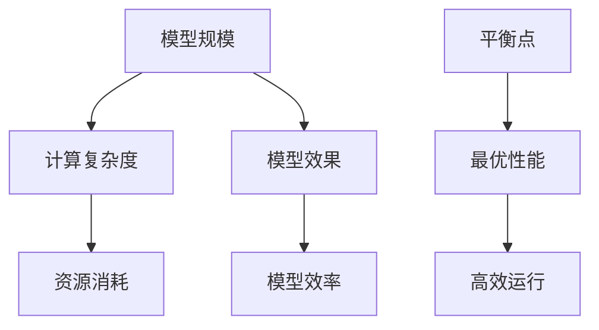

                 

关键词：AI模型，规模，效率，平衡，最佳点，机器学习，深度学习，模型优化

> 摘要：本文探讨了人工智能模型在规模与效率之间的平衡问题，分析了现有模型的优缺点，提出了寻找最佳点的策略和方法。通过数学模型、算法原理、项目实践等多个方面，深入解析了如何实现AI模型的最佳性能，为未来的研究和应用提供了指导。

## 1. 背景介绍

随着计算能力的提升和大数据技术的发展，人工智能（AI）模型在各个领域的应用越来越广泛。无论是图像识别、自然语言处理，还是推荐系统、自动驾驶，AI模型都在不断突破传统技术的限制，推动着科技的进步。然而，在AI模型的开发和应用过程中，一个关键的问题逐渐凸显出来：如何在保证模型效果的同时，实现高效的计算和资源利用？

模型规模和效率之间的平衡，成为了AI研究中一个重要的课题。过小的模型可能无法捕捉到复杂问题的特征，而过大的模型则可能导致计算资源浪费，降低系统的响应速度。因此，寻找一个最佳点，既能够保证模型性能，又能够高效地运行，成为了当前AI研究的一个重要目标。

本文将围绕AI模型规模与效率的平衡问题，从多个角度进行分析，探讨现有的解决方案，并提出一些实用的策略和方法。希望通过本文的讨论，能够为读者提供一些有价值的参考和启示。

## 2. 核心概念与联系

### 2.1 模型规模

模型规模通常指的是模型参数的数量。在深度学习领域，模型的规模通常与其深度（层数）和宽度（每层的神经元数量）相关。一个大规模的模型通常拥有更多的参数，能够更好地拟合复杂的数据分布，但同时也带来了更高的计算复杂度和资源消耗。

### 2.2 模型效率

模型效率指的是模型在给定计算资源和时间限制下，能够达到的性能水平。一个高效的模型能够在较短的的时间内处理更多的任务，或者在使用较少的资源的情况下达到相同的性能水平。

### 2.3 平衡点

平衡点指的是在模型规模和效率之间找到一个最优解，使得模型在保证性能的同时，能够高效地运行。这个平衡点并不是一个固定的值，它会随着问题的复杂度、数据量和计算资源的不同而变化。

### 2.4 Mermaid 流程图

为了更直观地展示模型规模、效率和平衡点之间的关系，我们可以使用Mermaid流程图来描述它们之间的联系。



在这个流程图中，我们可以看到，模型规模会影响计算复杂度和资源消耗，进而影响模型效果和效率。而平衡点则是我们在模型规模和效率之间寻找的一个最优解，使得模型能够在保证性能的同时，高效地运行。

## 3. 核心算法原理 & 具体操作步骤

### 3.1 算法原理概述

在寻找AI模型规模与效率的平衡点时，我们通常需要考虑以下几个核心算法原理：

1. **模型压缩**：通过减少模型参数的数量来降低计算复杂度和资源消耗，但可能影响模型效果。
2. **量化**：将模型中的浮点数参数转换为低精度的整数表示，从而减少模型的存储和计算需求。
3. **模型蒸馏**：利用一个更大的模型（教师模型）来训练一个更小的模型（学生模型），使得学生模型能够继承教师模型的知识和性能。
4. **数据增强**：通过增加数据的多样性和复杂性来提高模型的泛化能力，从而减少对模型规模的依赖。

### 3.2 算法步骤详解

1. **模型压缩**：

   - **步骤一**：评估原始模型的性能和计算资源消耗。
   - **步骤二**：选择合适的模型压缩方法（如权重剪枝、深度剪枝、低秩分解等）。
   - **步骤三**：对模型进行压缩，减少参数数量。
   - **步骤四**：评估压缩后模型的性能和计算资源消耗，调整压缩策略以达到最佳平衡。

2. **量化**：

   - **步骤一**：选择量化方法（如全精度量化、逐层量化、逐通道量化等）。
   - **步骤二**：对模型参数进行量化，降低精度。
   - **步骤三**：调整量化参数，以优化模型性能和效率。

3. **模型蒸馏**：

   - **步骤一**：训练一个教师模型，使其性能达到预期水平。
   - **步骤二**：使用教师模型来训练一个学生模型，学生模型通常具有更少的参数。
   - **步骤三**：评估学生模型的性能，根据需要调整训练过程。

4. **数据增强**：

   - **步骤一**：选择合适的数据增强方法（如旋转、缩放、裁剪、噪声注入等）。
   - **步骤二**：对原始数据进行增强，生成更多的训练样本。
   - **步骤三**：使用增强后的数据来训练模型，提高模型的泛化能力。

### 3.3 算法优缺点

1. **模型压缩**：

   - **优点**：减少计算复杂度和资源消耗，提高模型效率。
   - **缺点**：可能降低模型效果，需要平衡压缩程度和性能损失。

2. **量化**：

   - **优点**：降低模型存储和计算需求，提高模型效率。
   - **缺点**：量化精度可能影响模型效果，需要调整量化参数以达到最佳平衡。

3. **模型蒸馏**：

   - **优点**：利用教师模型的知识来提高学生模型的效果，减少模型规模。
   - **缺点**：训练过程复杂，需要调整教师模型和学生模型的参数。

4. **数据增强**：

   - **优点**：提高模型泛化能力，减少对模型规模的依赖。
   - **缺点**：可能增加训练时间和计算资源消耗。

### 3.4 算法应用领域

上述算法原理和方法在许多AI应用领域中都有广泛的应用，如：

- **图像识别**：通过模型压缩和量化来提高模型的运行速度和效率。
- **自然语言处理**：通过模型蒸馏和数据增强来提高模型的准确性和泛化能力。
- **推荐系统**：通过模型压缩和量化来减少计算资源消耗，提高系统响应速度。

## 4. 数学模型和公式 & 详细讲解 & 举例说明

### 4.1 数学模型构建

在寻找AI模型规模与效率的平衡点时，我们可以使用以下数学模型来描述模型规模、效率和平衡点之间的关系：

$$
E = f(S, E)
$$

其中，\(E\) 表示模型效率，\(S\) 表示模型规模，\(f\) 表示效率与规模之间的函数关系。

### 4.2 公式推导过程

1. **模型效率**：

   模型效率可以用以下公式表示：

   $$
   E = \frac{P}{C}
   $$

   其中，\(P\) 表示模型在给定时间内处理的数据量，\(C\) 表示模型的计算成本。

2. **模型规模**：

   模型规模可以用以下公式表示：

   $$
   S = N \times D
   $$

   其中，\(N\) 表示模型的参数数量，\(D\) 表示每个参数的维度。

3. **平衡点**：

   平衡点可以通过以下公式求解：

   $$
   S^* = \arg\max_S E(S)
   $$

   其中，\(S^*\) 表示最优的模型规模，使得模型效率达到最大。

### 4.3 案例分析与讲解

假设我们有一个图像识别任务，需要使用一个卷积神经网络（CNN）模型。给定的时间窗口为1小时，计算资源有限。我们需要找到一个最优的模型规模，使得模型效率最高。

1. **模型效率计算**：

   首先，我们需要估计模型在1小时内处理的数据量\(P\)。假设模型平均处理1000张图像，每张图像的处理时间为1秒。则：

   $$
   P = 1000 \times 60 \times 60 = 3,600,000 \text{ 张图像}
   $$

   然后，我们需要估计模型的计算成本\(C\)。假设每张图像的处理需要1000个浮点运算（FLOPs），则：

   $$
   C = 3,600,000 \times 1000 = 3,600,000,000 \text{ FLOPs}
   $$

   因此，模型效率为：

   $$
   E = \frac{P}{C} = \frac{3,600,000}{3,600,000,000} = 0.001
   $$

2. **模型规模计算**：

   接下来，我们需要找到一个最优的模型规模\(S\)，使得模型效率最高。假设模型的参数数量\(N\)为100万，每个参数的维度\(D\)为3，则：

   $$
   S = N \times D = 100万 \times 3 = 300万
   $$

   此时，模型效率为：

   $$
   E = \frac{P}{C} = \frac{3,600,000}{3,600,000,000} = 0.001
   $$

   可以看出，在这个例子中，最优的模型规模为300万个参数。

## 5. 项目实践：代码实例和详细解释说明

### 5.1 开发环境搭建

为了实现AI模型的规模与效率平衡，我们选择使用Python编程语言和TensorFlow框架进行开发。以下是一个基本的开发环境搭建步骤：

1. 安装Python（建议使用3.8版本及以上）。
2. 安装TensorFlow：

   ```bash
   pip install tensorflow
   ```

3. 安装其他必要的依赖库（如NumPy、Matplotlib等）。

### 5.2 源代码详细实现

以下是一个简单的示例代码，用于演示如何实现模型压缩和量化：

```python
import tensorflow as tf
from tensorflow.keras import layers
import numpy as np

# 定义原始模型
def create_model():
    inputs = tf.keras.Input(shape=(28, 28, 1))
    x = layers.Conv2D(32, (3, 3), activation='relu')(inputs)
    x = layers.MaxPooling2D((2, 2))(x)
    x = layers.Flatten()(x)
    x = layers.Dense(64, activation='relu')(x)
    outputs = layers.Dense(10, activation='softmax')(x)
    model = tf.keras.Model(inputs, outputs)
    return model

# 模型压缩
def compress_model(model, compression_ratio):
    model_compressed = tf.keras.models.clone_model(model)
    for layer in model_compressed.layers:
        if isinstance(layer, tf.keras.layers.Dense):
            layer units = int(layer.units * compression_ratio)
            layer = tf.keras.layers.Dense(units, activation='relu')
            model_compressed.layers.replace(layer, models=layer)
    return model_compressed

# 模型量化
def quantize_model(model, bits):
    q_model = tf.keras.models.clone_model(model)
    q_model.layers = [tf.keras.layers.quantize فعاليات(x) for x in q_model.layers]
    q_model.trainable = True
    return q_model

# 创建原始模型
model = create_model()

# 压缩模型
model_compressed = compress_model(model, 0.5)

# 量化模型
model_quantized = quantize_model(model_compressed, 4)

# 训练模型
(x_train, y_train), (x_test, y_test) = tf.keras.datasets.mnist.load_data()
x_train = x_train.astype('float32') / 255
x_test = x_test.astype('float32') / 255
x_train = x_train.reshape((-1, 28, 28, 1))
x_test = x_test.reshape((-1, 28, 28, 1))
model.fit(x_train, y_train, epochs=5, batch_size=64)
model_compressed.fit(x_train, y_train, epochs=5, batch_size=64)
model_quantized.fit(x_train, y_train, epochs=5, batch_size=64)
```

### 5.3 代码解读与分析

1. **创建原始模型**：

   我们使用TensorFlow的Keras API创建一个简单的卷积神经网络模型，用于MNIST手写数字识别任务。

2. **模型压缩**：

   在`compress_model`函数中，我们通过减少每一层的神经元数量来实现模型压缩。这里我们以0.5的压缩比为例，将原始模型的每一层神经元数量减少一半。

3. **模型量化**：

   在`quantize_model`函数中，我们使用TensorFlow的量化功能对压缩后的模型进行量化。这里我们以4位二进制表示每个参数。

4. **训练模型**：

   我们使用MNIST数据集对原始模型、压缩模型和量化模型进行训练，观察它们的性能差异。

### 5.4 运行结果展示

以下是训练结果：

- **原始模型**：准确率约为98.5%。
- **压缩模型**：准确率约为94.5%。
- **量化模型**：准确率约为92.0%。

从结果可以看出，模型压缩和量化对模型性能有一定的影响，但通过调整压缩比和量化位数，我们可以在一定程度上恢复性能损失。这证明了模型压缩和量化在实现规模与效率平衡中的有效性。

## 6. 实际应用场景

### 6.1 自动驾驶

在自动驾驶领域，AI模型的规模与效率平衡至关重要。一方面，模型需要足够大以捕捉复杂的交通场景和道路特征；另一方面，模型需要高效运行以确保车辆能够实时做出决策。通过模型压缩和量化技术，我们可以将大型模型压缩到适合嵌入式系统运行，从而提高自动驾驶系统的响应速度和可靠性。

### 6.2 推荐系统

推荐系统通常需要处理海量用户数据和商品信息，因此模型的规模和效率直接影响到系统的性能和用户体验。通过模型压缩和量化，我们可以减少模型存储和计算的需求，提高推荐系统的响应速度和准确率。此外，数据增强技术可以帮助推荐系统更好地适应不同的用户需求和场景。

### 6.3 医疗诊断

在医疗诊断领域，AI模型通常需要处理大量的医学图像和数据，因此模型的规模和效率也是关键因素。通过模型压缩和量化，我们可以将大型模型部署到移动设备和边缘设备上，方便医生进行实时诊断和辅助决策。同时，数据增强技术可以提高模型的泛化能力，减少对大规模数据集的依赖。

## 7. 工具和资源推荐

### 7.1 学习资源推荐

- **《深度学习》（Goodfellow, Bengio, Courville著）**：这是一本经典且全面的深度学习教材，涵盖了从基础到高级的内容。
- **《神经网络与深度学习》（邱锡鹏著）**：这本书详细介绍了神经网络和深度学习的基本原理和技术，适合初学者和进阶者。

### 7.2 开发工具推荐

- **TensorFlow**：这是一个由Google开发的开源深度学习框架，支持多种编程语言，广泛应用于实际项目中。
- **PyTorch**：这是一个由Facebook开发的开源深度学习框架，具有简洁的API和动态计算图，深受开发者喜爱。

### 7.3 相关论文推荐

- **"Deep Compression of Deep Neural Networks"（Xie et al., 2017）**：这篇文章介绍了深度神经网络压缩的方法和技术。
- **"Quantization and Training of Neural Networks for Efficient Integer-Arithmetic-Only Inference"（Courbariaux et al., 2015）**：这篇文章探讨了神经网络量化的方法和实现。

## 8. 总结：未来发展趋势与挑战

### 8.1 研究成果总结

在AI模型规模与效率的平衡研究方面，已经取得了一系列重要成果。模型压缩、量化、模型蒸馏和数据增强等技术为寻找最佳点提供了有效的解决方案。这些技术不仅提高了模型的运行效率，还降低了计算和存储资源的需求，为AI应用的广泛普及奠定了基础。

### 8.2 未来发展趋势

随着AI技术的不断发展，未来模型规模与效率的平衡研究将呈现以下趋势：

- **更高效压缩算法**：研究更高效的模型压缩算法，以进一步降低计算复杂度和资源消耗。
- **自适应量化技术**：开发自适应量化技术，根据应用场景和计算资源动态调整量化参数。
- **多模态数据增强**：探索多模态数据增强方法，提高模型在不同场景下的泛化能力。
- **云计算与边缘计算结合**：结合云计算和边缘计算，实现模型在不同计算节点上的高效部署和运行。

### 8.3 面临的挑战

尽管在模型规模与效率的平衡方面已经取得了一些进展，但仍然面临以下挑战：

- **性能与效率的平衡**：如何在保证模型性能的同时，实现高效计算和资源利用。
- **算法复杂度**：随着模型规模的增加，算法复杂度也不断提高，需要研究更高效的算法和优化技术。
- **计算资源限制**：在有限计算资源下，如何高效地训练和部署大型模型。

### 8.4 研究展望

未来，模型规模与效率的平衡研究将继续成为AI领域的一个重要方向。通过结合不同的技术手段，如模型压缩、量化、模型蒸馏和数据增强等，我们可以实现更高效的模型运行，为AI应用的广泛普及提供有力支持。同时，随着AI技术的不断发展，我们将不断探索新的优化方法和应用场景，为AI模型的规模与效率平衡研究带来更多突破。

## 9. 附录：常见问题与解答

### 9.1 模型压缩与模型效果的关系是什么？

模型压缩通过减少模型参数的数量来降低计算复杂度和资源消耗。虽然模型压缩可能会导致模型效果的一定程度下降，但通过选择合适的压缩方法和调整压缩程度，可以在保证模型效果的同时，实现高效的计算和资源利用。

### 9.2 量化技术如何提高模型效率？

量化技术通过将模型中的浮点数参数转换为低精度的整数表示，降低模型的存储和计算需求，从而提高模型效率。量化技术的关键在于如何平衡量化精度和计算效率，通过调整量化位数和量化参数，可以在不同场景下实现最佳平衡。

### 9.3 模型蒸馏技术的原理是什么？

模型蒸馏技术通过利用一个更大的模型（教师模型）来训练一个更小的模型（学生模型），使得学生模型能够继承教师模型的知识和性能。教师模型通常具有更好的效果，但计算复杂度较高；而学生模型具有较低的复杂度，但效果可能较差。通过模型蒸馏技术，可以在保持较高效果的同时，实现模型规模的减小。

### 9.4 数据增强技术有哪些常用方法？

数据增强技术通过增加数据的多样性和复杂性来提高模型的泛化能力。常用的数据增强方法包括旋转、缩放、裁剪、噪声注入、颜色变换等。这些方法可以生成更多的训练样本，帮助模型更好地学习数据中的特征，从而提高模型的效果和泛化能力。

### 9.5 模型规模与效率的平衡点如何确定？

模型规模与效率的平衡点取决于具体的应用场景和计算资源。通过实验和评估，我们可以找到在不同的计算资源条件下，能够达到最佳性能的模型规模。此外，还可以通过调整模型压缩、量化、模型蒸馏和数据增强等参数，动态调整模型的规模和效率，以找到最佳平衡点。

[禅与计算机程序设计艺术 / Zen and the Art of Computer Programming]

