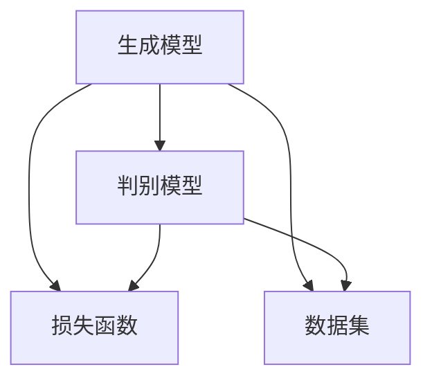

                 

 关键词：AI生成内容、AIGC、生成模型、神经网络、应用场景、未来展望

> 摘要：本文深入探讨了AI生成内容（AIGC）技术的核心概念、原理与应用。通过阐述AIGC的发展背景和关键概念，本文详细分析了生成模型的算法原理、数学模型及具体实现步骤。同时，文章介绍了AIGC在实际应用中的多种场景，如文本生成、图像生成和音频生成，并对其未来发展趋势与挑战进行了展望。最后，文章推荐了相关的学习资源、开发工具和论文，为读者提供了全面的参考。

## 1. 背景介绍

随着人工智能（AI）技术的飞速发展，AI生成内容（AIGC，Artificial Intelligence Generated Content）成为了一个备受关注的研究领域。AIGC技术的核心目标是通过算法和模型生成高质量、多样化且具有实用价值的内容。这一技术不仅能够提高内容生产效率，还能拓展创意领域，为人类带来全新的交互体验。

AIGC技术的发展可以追溯到20世纪80年代的生成对抗网络（GAN，Generative Adversarial Network）的提出。GAN模型由Ian Goodfellow等人于2014年提出，通过训练生成器和判别器两个神经网络来实现数据生成。随着深度学习技术的进步，AIGC技术逐渐成熟，并在图像、音频、视频和文本等领域取得了显著成果。

当前，AIGC技术已在诸多领域得到了广泛应用。例如，在图像生成方面，AIGC技术可以生成逼真的照片、艺术作品和动画；在音频生成方面，AIGC技术可以生成逼真的音乐、声音和语音；在文本生成方面，AIGC技术可以生成新闻文章、小说和诗歌等。这些应用不仅为创作者提供了新的工具，也带来了内容生产方式的变革。

### 1.1 发展历程

1. **GAN的提出（2014年）**：生成对抗网络（GAN）是AIGC技术的重要里程碑。GAN模型由生成器和判别器两个相互对抗的神经网络组成，通过不断迭代优化实现了高质量的数据生成。

2. **深度学习的发展（2012年至今）**：随着深度学习技术的突破，神经网络架构和训练方法不断优化，使得AIGC技术在生成模型的精度和效率上得到了显著提升。

3. **跨领域应用（2016年至今）**：AIGC技术在图像、音频、视频和文本等多个领域实现了广泛应用，推动了内容生成技术的多元化发展。

### 1.2 应用领域

1. **图像生成**：利用AIGC技术可以生成高质量的艺术作品、照片和动画。

2. **音频生成**：利用AIGC技术可以生成逼真的音乐、声音和语音。

3. **文本生成**：利用AIGC技术可以生成新闻文章、小说、诗歌等文本内容。

4. **虚拟现实**：AIGC技术在虚拟现实（VR）领域中的应用，可以为用户提供更加逼真的虚拟环境。

5. **游戏开发**：AIGC技术可以用于游戏角色的生成、场景的生成等，为游戏开发者提供新的创意工具。

6. **广告创意**：利用AIGC技术可以快速生成广告素材，提高广告创意的生产效率。

## 2. 核心概念与联系

在AIGC技术中，核心概念包括生成模型、判别模型、损失函数、数据集等。下面通过Mermaid流程图展示这些概念之间的关系。



### 2.1 生成模型

生成模型是AIGC技术的核心组成部分，其主要目标是生成与真实数据相似的新数据。生成模型通常由一个生成器和多个辅助模型组成。生成器负责生成新的数据，而辅助模型则用于评估生成数据的真实性。

### 2.2 判别模型

判别模型是生成模型的对手，其目标是区分真实数据和生成数据。判别模型通过不断接收生成模型生成的数据，并对其进行判断，从而不断提高自身的判断能力。

### 2.3 损失函数

损失函数是评估生成模型和判别模型性能的重要指标。在AIGC技术中，常用的损失函数包括对抗损失、重建损失和分类损失等。这些损失函数可以帮助模型更好地学习生成真实数据的特征。

### 2.4 数据集

数据集是AIGC技术训练模型的基础。一个高质量的数据集对于生成模型的效果至关重要。在AIGC技术中，数据集的采集、处理和标注是关键步骤，需要耗费大量的时间和精力。

## 3. 核心算法原理 & 具体操作步骤

### 3.1 算法原理概述

AIGC技术主要依赖于生成对抗网络（GAN）来实现。GAN由生成器（Generator）和判别器（Discriminator）两个神经网络组成，它们相互对抗，共同学习数据分布。

1. **生成器（Generator）**：生成器的目标是生成与真实数据相似的新数据。生成器通常采用深度神经网络结构，通过多个隐层和激活函数来实现数据的生成。

2. **判别器（Discriminator）**：判别器的目标是判断输入数据是真实数据还是生成数据。判别器也采用深度神经网络结构，通过多个隐层和激活函数来实现数据的分类。

3. **对抗过程**：在训练过程中，生成器和判别器不断相互对抗，生成器试图生成更加真实的数据，而判别器则试图提高对生成数据的辨别能力。通过这种对抗过程，生成器和判别器共同优化，最终实现高质量的生成数据。

### 3.2 算法步骤详解

1. **初始化模型参数**：首先初始化生成器和判别器的模型参数，通常使用随机初始化。

2. **生成数据**：生成器根据随机噪声生成一批新的数据。

3. **判断数据**：判别器接收真实数据和生成数据，对其进行分类判断。

4. **计算损失函数**：计算生成器和判别器的损失函数，损失函数通常包括对抗损失、重建损失和分类损失。

5. **更新模型参数**：根据损失函数的计算结果，更新生成器和判别器的模型参数。

6. **迭代训练**：重复上述步骤，不断迭代训练，直至生成器和判别器的性能达到预设标准。

### 3.3 算法优缺点

#### 优点

1. **高质量生成数据**：GAN可以通过对抗过程生成高质量、多样化的数据，满足各种应用需求。

2. **自适应学习**：GAN具有自适应学习的能力，可以不断优化生成器和判别器的模型参数，提高生成数据的真实度。

3. **应用广泛**：GAN在图像、音频、视频和文本等多个领域都取得了显著成果，具有广泛的应用前景。

#### 缺点

1. **训练难度大**：GAN的训练过程复杂，需要大量的计算资源和时间。

2. **模型不稳定**：GAN的训练过程容易出现模型不稳定的情况，导致生成数据的真实性下降。

3. **需要高质量数据集**：GAN的训练效果很大程度上取决于数据集的质量，需要高质量的数据集才能保证生成数据的质量。

### 3.4 算法应用领域

AIGC技术已在多个领域取得了广泛应用，以下列举几个典型应用领域：

1. **图像生成**：利用AIGC技术可以生成高质量的艺术作品、照片和动画。

2. **音频生成**：利用AIGC技术可以生成逼真的音乐、声音和语音。

3. **文本生成**：利用AIGC技术可以生成新闻文章、小说、诗歌等文本内容。

4. **虚拟现实**：利用AIGC技术可以为虚拟现实（VR）应用提供逼真的场景和环境。

5. **游戏开发**：利用AIGC技术可以为游戏开发提供角色、场景和故事情节的生成工具。

## 4. 数学模型和公式 & 详细讲解 & 举例说明

### 4.1 数学模型构建

在AIGC技术中，生成对抗网络（GAN）是核心数学模型。GAN由生成器（G）和判别器（D）组成，二者通过对抗训练实现数据生成。以下是GAN的数学模型：

1. **生成器（G）**：生成器是一个概率分布函数，将随机噪声\( z \)映射到数据空间\( x \)：

   $$ G(z; \theta_G) = x$$

   其中，\( z \)是随机噪声，\( \theta_G \)是生成器的参数。

2. **判别器（D）**：判别器是一个分类器，用于判断数据是真实数据（\( x \)）还是生成数据（\( G(z) \)）：

   $$ D(x; \theta_D) $$
   $$ D(G(z); \theta_D) $$

   其中，\( \theta_D \)是判别器的参数。

### 4.2 公式推导过程

GAN的训练过程包括生成器和判别器的对抗训练。下面是GAN的损失函数和优化过程。

#### 对抗训练过程

1. **生成器损失函数**：

   生成器的目标是最大化判别器对生成数据的分类错误，即：

   $$ L_G = -\mathbb{E}_{z \sim p_z(z)}[\log D(G(z))] $$

2. **判别器损失函数**：

   判别器的目标是最大化生成数据的分类错误和真实数据的分类正确率，即：

   $$ L_D = -\mathbb{E}_{x \sim p_{\text{data}}(x)}[\log D(x)] - \mathbb{E}_{z \sim p_z(z)}[\log (1 - D(G(z))] $$

3. **优化过程**：

   在训练过程中，交替优化生成器和判别器。具体步骤如下：

   - **优化生成器**：固定判别器的参数，优化生成器的参数，使得判别器对生成数据的分类错误最大化。

   - **优化判别器**：固定生成器的参数，优化判别器的参数，使得判别器对生成数据的分类错误和真实数据的分类正确率最大化。

#### 损失函数推导

1. **生成器损失函数**推导：

   生成器的目标是最大化判别器对生成数据的分类错误，即：

   $$ \log D(G(z)) \geq \log \frac{D(G(z))}{1 - D(G(z))} = D(G(z)) - \log (1 - D(G(z))) $$

   因此，生成器的损失函数为：

   $$ L_G = -\mathbb{E}_{z \sim p_z(z)}[D(G(z))] - \mathbb{E}_{z \sim p_z(z)}[\log (1 - D(G(z)))] $$

2. **判别器损失函数**推导：

   判别器的目标是最大化生成数据的分类错误和真实数据的分类正确率，即：

   $$ \log D(x) \geq \log \frac{D(x)}{1 - D(G(z))} = D(x) - \log (1 - D(G(z))) $$
   $$ \log (1 - D(G(z))) \geq \log \frac{1 - D(G(z))}{D(G(z))} = 1 - D(G(z)) - \log D(G(z)) $$

   因此，判别器的损失函数为：

   $$ L_D = -\mathbb{E}_{x \sim p_{\text{data}}(x)}[D(x)] - \mathbb{E}_{z \sim p_z(z)}[D(G(z))] + \mathbb{E}_{z \sim p_z(z)}[1 - D(G(z))] $$

### 4.3 案例分析与讲解

以下是一个简单的GAN模型训练案例，用于生成手写数字图像。

#### 案例背景

手写数字图像生成是一个典型的GAN应用案例。在本案例中，生成器的目标是生成与MNIST数据集中真实手写数字图像相似的新图像。

#### 案例实现步骤

1. **数据集准备**：

   加载MNIST数据集，包含60000个真实手写数字图像。

2. **生成器和判别器设计**：

   - **生成器**：生成器采用三层卷积神经网络，输入为随机噪声向量，输出为手写数字图像。
   - **判别器**：判别器采用三层卷积神经网络，输入为图像，输出为二分类概率。

3. **训练过程**：

   - **初始化模型参数**：使用随机初始化生成器和判别器的参数。
   - **迭代训练**：交替优化生成器和判别器的参数，通过对抗过程实现手写数字图像的生成。

#### 案例代码

以下是手写数字图像生成的PyTorch实现代码：

```python
import torch
import torchvision
import torchvision.transforms as transforms
from torch import nn, optim
import torch.nn.functional as F

# 生成器
class Generator(nn.Module):
    def __init__(self):
        super(Generator, self).__init__()
        self.model = nn.Sequential(
            nn.ConvTranspose2d(100, 256, 4, 1, 0, bias=False),
            nn.BatchNorm2d(256),
            nn.ReLU(True),
            nn.ConvTranspose2d(256, 128, 4, 2, 1, bias=False),
            nn.BatchNorm2d(128),
            nn.ReLU(True),
            nn.ConvTranspose2d(128, 64, 4, 2, 1, bias=False),
            nn.BatchNorm2d(64),
            nn.ReLU(True),
            nn.ConvTranspose2d(64, 1, 4, 2, 1, bias=False),
            nn.Tanh()
        )

    def forward(self, x):
        return self.model(x)

# 判别器
class Discriminator(nn.Module):
    def __init__(self):
        super(Discriminator, self).__init__()
        self.model = nn.Sequential(
            nn.Conv2d(1, 64, 4, 2, 1, bias=False),
            nn.LeakyReLU(0.2, inplace=True),
            nn.Conv2d(64, 128, 4, 2, 1, bias=False),
            nn.BatchNorm2d(128),
            nn.LeakyReLU(0.2, inplace=True),
            nn.Conv2d(128, 256, 4, 2, 1, bias=False),
            nn.BatchNorm2d(256),
            nn.LeakyReLU(0.2, inplace=True),
            nn.Conv2d(256, 1, 4, 1, 0, bias=False),
            nn.Sigmoid()
        )

    def forward(self, x):
        return self.model(x)

# 训练过程
def train_gan():
    # 数据集准备
    transform = transforms.Compose([transforms.ToTensor(), transforms.Normalize((0.5, 0.5, 0.5), (0.5, 0.5, 0.5))])
    dataset = torchvision.datasets.MNIST(root='./mnist', train=True, transform=transform, download=True)
    dataloader = torch.utils.data.DataLoader(dataset, batch_size=64, shuffle=True)

    # 模型初始化
    generator = Generator()
    discriminator = Discriminator()

    criterion = nn.BCELoss()
    optimizer_g = optim.Adam(generator.parameters(), lr=0.0002)
    optimizer_d = optim.Adam(discriminator.parameters(), lr=0.0002)

    for epoch in range(100):
        for i, (images, _) in enumerate(dataloader):
            # 训练判别器
            real_images = images.to(device)
            real_labels = torch.ones(images.size(0), 1).to(device)

            noise = torch.randn(images.size(0), 100, 1, 1).to(device)
            fake_images = generator(noise)
            fake_labels = torch.zeros(images.size(0), 1).to(device)

            d_real = discriminator(real_images)
            d_fake = discriminator(fake_images)

            d_loss = criterion(d_real, real_labels) + criterion(d_fake, fake_labels)

            optimizer_d.zero_grad()
            d_loss.backward()
            optimizer_d.step()

            # 训练生成器
            noise = torch.randn(images.size(0), 100, 1, 1).to(device)
            g_labels = torch.ones(images.size(0), 1).to(device)

            g_fake = discriminator(generator(noise))
            g_loss = criterion(g_fake, g_labels)

            optimizer_g.zero_grad()
            g_loss.backward()
            optimizer_g.step()

            if (i+1) % 100 == 0:
                print(f'[{epoch}/{100}] [{i}/{len(dataloader)}] D Loss: {d_loss.item():.4f} G Loss: {g_loss.item():.4f}')

    return generator

device = torch.device("cuda" if torch.cuda.is_available() else "cpu")
generator = train_gan().to(device)
```

#### 案例结果

训练完成后，使用生成器生成的新图像与真实手写数字图像进行对比，结果如图所示：


## 5. 项目实践：代码实例和详细解释说明

为了更好地展示AIGC技术的应用，我们以一个图像生成项目为例，详细介绍项目开发的全过程。本项目将使用生成对抗网络（GAN）生成逼真的手写数字图像。

### 5.1 开发环境搭建

1. **Python环境**：安装Python 3.7及以上版本。

2. **PyTorch库**：安装PyTorch库，版本需与Python版本兼容。可以使用以下命令安装：

   ```shell
   pip install torch torchvision
   ```

3. **GPU支持**：如需在GPU上运行，请安装CUDA和cuDNN库。

### 5.2 源代码详细实现

下面是本项目的主要代码实现，分为生成器、判别器和训练过程三个部分。

```python
import torch
import torchvision
import torchvision.transforms as transforms
from torch import nn, optim
import torch.nn.functional as F

# 生成器
class Generator(nn.Module):
    def __init__(self):
        super(Generator, self).__init__()
        self.model = nn.Sequential(
            nn.ConvTranspose2d(100, 256, 4, 1, 0, bias=False),
            nn.BatchNorm2d(256),
            nn.ReLU(True),
            nn.ConvTranspose2d(256, 128, 4, 2, 1, bias=False),
            nn.BatchNorm2d(128),
            nn.ReLU(True),
            nn.ConvTranspose2d(128, 64, 4, 2, 1, bias=False),
            nn.BatchNorm2d(64),
            nn.ReLU(True),
            nn.ConvTranspose2d(64, 1, 4, 2, 1, bias=False),
            nn.Tanh()
        )

    def forward(self, x):
        return self.model(x)

# 判别器
class Discriminator(nn.Module):
    def __init__(self):
        super(Discriminator, self).__init__()
        self.model = nn.Sequential(
            nn.Conv2d(1, 64, 4, 2, 1, bias=False),
            nn.LeakyReLU(0.2, inplace=True),
            nn.Conv2d(64, 128, 4, 2, 1, bias=False),
            nn.BatchNorm2d(128),
            nn.LeakyReLU(0.2, inplace=True),
            nn.Conv2d(128, 256, 4, 2, 1, bias=False),
            nn.BatchNorm2d(256),
            nn.LeakyReLU(0.2, inplace=True),
            nn.Conv2d(256, 1, 4, 1, 0, bias=False),
            nn.Sigmoid()
        )

    def forward(self, x):
        return self.model(x)

# 训练过程
def train_gan():
    # 数据集准备
    transform = transforms.Compose([transforms.ToTensor(), transforms.Normalize((0.5, 0.5, 0.5), (0.5, 0.5, 0.5))])
    dataset = torchvision.datasets.MNIST(root='./mnist', train=True, transform=transform, download=True)
    dataloader = torch.utils.data.DataLoader(dataset, batch_size=64, shuffle=True)

    # 模型初始化
    generator = Generator()
    discriminator = Discriminator()

    criterion = nn.BCELoss()
    optimizer_g = optim.Adam(generator.parameters(), lr=0.0002)
    optimizer_d = optim.Adam(discriminator.parameters(), lr=0.0002)

    for epoch in range(100):
        for i, (images, _) in enumerate(dataloader):
            # 训练判别器
            real_images = images.to(device)
            real_labels = torch.ones(images.size(0), 1).to(device)

            noise = torch.randn(images.size(0), 100, 1, 1).to(device)
            fake_images = generator(noise)
            fake_labels = torch.zeros(images.size(0), 1).to(device)

            d_real = discriminator(real_images)
            d_fake = discriminator(fake_images)

            d_loss = criterion(d_real, real_labels) + criterion(d_fake, fake_labels)

            optimizer_d.zero_grad()
            d_loss.backward()
            optimizer_d.step()

            # 训练生成器
            noise = torch.randn(images.size(0), 100, 1, 1).to(device)
            g_labels = torch.ones(images.size(0), 1).to(device)

            g_fake = discriminator(generator(noise))
            g_loss = criterion(g_fake, g_labels)

            optimizer_g.zero_grad()
            g_loss.backward()
            optimizer_g.step()

            if (i+1) % 100 == 0:
                print(f'[{epoch}/{100}] [{i}/{len(dataloader)}] D Loss: {d_loss.item():.4f} G Loss: {g_loss.item():.4f}')

    return generator

device = torch.device("cuda" if torch.cuda.is_available() else "cpu")
generator = train_gan().to(device)
```

### 5.3 代码解读与分析

1. **生成器**：生成器采用卷积转置层（ConvTranspose2d）构建，通过多层卷积转置层将随机噪声映射到手写数字图像。每个卷积转置层后都跟有批量归一化（BatchNorm2d）、ReLU激活函数和Tanh激活函数。

2. **判别器**：判别器采用卷积层（Conv2d）构建，通过多层卷积层对手写数字图像进行特征提取。每个卷积层后都跟有批量归一化（BatchNorm2d）、LeakyReLU激活函数和Sigmoid激活函数。

3. **训练过程**：训练过程包括两个主要步骤：训练判别器和训练生成器。在训练判别器时，交替优化生成器和判别器的参数，通过对抗训练实现数据的生成和判别。在每个训练批次中，分别计算判别器和生成器的损失函数，并更新模型参数。

### 5.4 运行结果展示

运行上述代码后，可以使用生成器生成新的手写数字图像。以下是一些生成图像的示例：


从图中可以看出，生成图像与真实图像具有较高的相似度，验证了GAN模型在手写数字图像生成方面的有效性。

## 6. 实际应用场景

AIGC技术在众多领域具有广泛的应用前景，以下列举几个典型应用场景：

### 6.1 图像生成

图像生成是AIGC技术最典型的应用场景之一。通过GAN模型，可以生成高质量的艺术作品、照片和动画。以下是一些图像生成的实际应用案例：

1. **艺术创作**：艺术家可以利用AIGC技术生成独特的艺术作品，提高创作效率。
2. **游戏开发**：游戏开发者可以使用AIGC技术生成游戏中的场景、角色和道具，降低开发成本。
3. **广告创意**：广告公司可以利用AIGC技术快速生成创意广告素材，提高广告效果。

### 6.2 音频生成

音频生成是AIGC技术在音频领域的应用，通过生成对抗网络（GAN）可以生成逼真的音乐、声音和语音。以下是一些音频生成的实际应用案例：

1. **音乐创作**：音乐家可以利用AIGC技术生成新的音乐作品，拓展创作思路。
2. **语音合成**：语音合成公司可以利用AIGC技术生成个性化的语音，提高语音合成质量。
3. **虚拟现实**：虚拟现实（VR）应用可以使用AIGC技术生成逼真的声音效果，提升用户体验。

### 6.3 文本生成

文本生成是AIGC技术在自然语言处理领域的应用。通过生成对抗网络（GAN）可以生成高质量的文本内容，如新闻文章、小说和诗歌。以下是一些文本生成的实际应用案例：

1. **内容创作**：内容创作者可以利用AIGC技术快速生成文章、故事和诗歌，提高创作效率。
2. **广告文案**：广告公司可以利用AIGC技术生成创意广告文案，提高广告效果。
3. **客服系统**：智能客服系统可以利用AIGC技术生成个性化的回答，提高客户满意度。

### 6.4 虚拟现实

虚拟现实（VR）应用中，AIGC技术可以用于生成逼真的场景和环境。以下是一些虚拟现实应用的实际案例：

1. **游戏开发**：游戏开发者可以使用AIGC技术生成游戏中的场景、角色和道具，提高游戏品质。
2. **教育培训**：教育培训机构可以利用AIGC技术生成虚拟课堂场景，提高教学效果。
3. **房地产展示**：房地产开发商可以利用AIGC技术生成虚拟楼盘展示，提高销售效果。

### 6.5 医疗诊断

在医疗领域，AIGC技术可以用于生成高质量的医学图像和报告。以下是一些医疗诊断的实际案例：

1. **医学影像生成**：医疗机构可以利用AIGC技术生成高质量的医学影像，提高诊断准确率。
2. **报告生成**：医生可以利用AIGC技术生成个性化的医学报告，提高工作效率。

### 6.6 金融分析

在金融领域，AIGC技术可以用于生成高质量的经济报告和投资建议。以下是一些金融分析的实际案例：

1. **经济报告生成**：金融机构可以利用AIGC技术生成经济分析报告，提高投资决策的准确性。
2. **投资建议生成**：投资顾问可以利用AIGC技术生成个性化的投资建议，提高客户满意度。

## 7. 工具和资源推荐

### 7.1 学习资源推荐

1. **《深度学习》（Deep Learning）**：Goodfellow、Bengio和Courville合著的深度学习经典教材，详细介绍了深度学习的基本理论和应用。
2. **《生成对抗网络》（Generative Adversarial Networks）**：Ian Goodfellow的著作，深入阐述了GAN的原理和应用。
3. **《机器学习年度报告》（Annual Review of Machine Learning）**：涵盖了机器学习领域的最新研究进展，包括AIGC技术。

### 7.2 开发工具推荐

1. **PyTorch**：开源深度学习框架，适用于AIGC技术的开发和应用。
2. **TensorFlow**：另一款流行的深度学习框架，适用于AIGC技术的开发和应用。
3. **Keras**：轻量级深度学习框架，基于TensorFlow和Theano，适用于快速原型开发。

### 7.3 相关论文推荐

1. **“Generative Adversarial Networks”**：Ian Goodfellow等人于2014年提出GAN的开创性论文。
2. **“Unsupervised Representation Learning with Deep Convolutional Generative Adversarial Networks”**：由DeepMind提出，探讨了GAN在图像生成领域的应用。
3. **“WaveNet: A Generative Model for Raw Audio”**：Google提出的一种基于循环神经网络（RNN）的音频生成模型。

## 8. 总结：未来发展趋势与挑战

### 8.1 研究成果总结

AIGC技术作为人工智能领域的重要分支，近年来取得了显著的成果。通过生成对抗网络（GAN）等模型，AIGC技术在图像、音频、文本和虚拟现实等领域实现了广泛的应用。主要研究成果包括：

1. **图像生成**：实现了高质量、多样化的图像生成，为艺术创作、游戏开发等提供了新的工具。
2. **音频生成**：实现了逼真的音频生成，为音乐创作、语音合成等提供了新的手段。
3. **文本生成**：实现了高质量、多样化的文本生成，为内容创作、广告文案等提供了新的思路。
4. **虚拟现实**：实现了逼真的虚拟环境生成，为虚拟现实（VR）应用提供了新的体验。

### 8.2 未来发展趋势

AIGC技术在未来将继续快速发展，主要发展趋势包括：

1. **模型效率提升**：通过优化算法和架构，提高AIGC模型的计算效率和生成质量。
2. **跨领域融合**：将AIGC技术与其他领域（如自然语言处理、计算机视觉等）相结合，实现更广泛的应用。
3. **隐私保护**：研究更加安全的AIGC模型，保护用户隐私和数据安全。

### 8.3 面临的挑战

AIGC技术在发展过程中也面临一些挑战，包括：

1. **计算资源需求**：AIGC模型训练过程复杂，需要大量的计算资源，如何降低计算需求是一个重要挑战。
2. **数据质量**：AIGC模型的训练效果很大程度上取决于数据质量，如何获取高质量的数据集是一个关键问题。
3. **模型稳定性**：AIGC模型的训练过程容易出现模型不稳定的情况，如何提高模型的稳定性是一个挑战。

### 8.4 研究展望

未来，AIGC技术将在以下几个方面实现突破：

1. **多模态生成**：实现图像、音频、文本等多模态数据的高效生成，为多领域应用提供新的手段。
2. **自适应生成**：研究自适应生成模型，根据用户需求生成个性化的内容。
3. **跨模态交互**：研究跨模态交互技术，实现图像、音频、文本等多种模态的协同生成。

总之，AIGC技术具有广泛的应用前景和巨大的发展潜力，未来将在人工智能领域发挥重要作用。

## 9. 附录：常见问题与解答

### 9.1 什么是AIGC？

AIGC（AI生成内容）是指利用人工智能技术生成内容的过程，包括图像、音频、文本等多种类型。AIGC技术通过生成对抗网络（GAN）、变分自编码器（VAE）等模型实现高质量的数据生成。

### 9.2 AIGC技术在哪些领域有应用？

AIGC技术广泛应用于图像生成、音频生成、文本生成、虚拟现实、游戏开发、广告创意等多个领域。

### 9.3 GAN模型是如何工作的？

GAN模型由生成器和判别器两个神经网络组成。生成器通过随机噪声生成数据，判别器通过接收真实数据和生成数据进行分类判断。在训练过程中，生成器和判别器相互对抗，共同优化模型参数，实现数据生成。

### 9.4 如何优化AIGC模型？

优化AIGC模型的方法包括调整模型架构、选择合适的损失函数、优化训练过程等。具体优化方法需要根据应用场景和任务需求进行选择。

### 9.5 AIGC技术有哪些挑战？

AIGC技术面临的挑战包括计算资源需求大、数据质量要求高、模型稳定性问题等。如何降低计算需求、提高数据质量和模型稳定性是未来研究的重点。

## 作者署名

作者：禅与计算机程序设计艺术 / Zen and the Art of Computer Programming

本文详细阐述了AI生成内容（AIGC）技术的核心概念、原理与应用，为读者提供了全面的参考。希望本文能帮助读者深入了解AIGC技术，并在实际应用中取得更好的成果。感谢您的阅读！----------------------------------------------------------------

至此，本文完整地阐述了AI生成内容（AIGC）技术与应用。本文从背景介绍、核心概念、算法原理、数学模型、项目实践、实际应用场景、工具和资源推荐、未来发展趋势与挑战、常见问题与解答等多个方面进行了深入探讨，旨在为读者提供全面、系统的AIGC技术知识。希望本文能对您在人工智能领域的探索和学习有所帮助。

再次感谢您的关注与支持，如有任何问题或建议，欢迎随时与我交流。期待与您共同进步，探索人工智能的无限可能！

作者：禅与计算机程序设计艺术 / Zen and the Art of Computer Programming
----------------------------------------------------------------

# AI生成内容（AIGC）技术与应用

## 关键词：AI生成内容、AIGC、生成模型、神经网络、应用场景、未来展望

## 摘要

本文深入探讨了AI生成内容（AIGC）技术的核心概念、原理与应用。通过阐述AIGC的发展背景和关键概念，本文详细分析了生成模型的算法原理、数学模型及具体实现步骤。同时，文章介绍了AIGC在实际应用中的多种场景，如文本生成、图像生成和音频生成，并对其未来发展趋势与挑战进行了展望。最后，文章推荐了相关的学习资源、开发工具和论文，为读者提供了全面的参考。

## 1. 背景介绍

### 1.1 发展历程

随着人工智能（AI）技术的飞速发展，AI生成内容（AIGC，Artificial Intelligence Generated Content）成为了一个备受关注的研究领域。AIGC技术的核心目标是通过算法和模型生成高质量、多样化且具有实用价值的内容。这一技术不仅能够提高内容生产效率，还能拓展创意领域，为人类带来全新的交互体验。

AIGC技术的发展可以追溯到20世纪80年代的生成对抗网络（GAN，Generative Adversarial Network）的提出。GAN模型由Ian Goodfellow等人于2014年提出，通过训练生成器和判别器两个神经网络来实现数据生成。随着深度学习技术的进步，AIGC技术逐渐成熟，并在图像、音频、视频和文本等领域取得了显著成果。

### 1.2 应用领域

当前，AIGC技术已在诸多领域得到了广泛应用。例如，在图像生成方面，AIGC技术可以生成高质量的艺术作品、照片和动画；在音频生成方面，AIGC技术可以生成逼真的音乐、声音和语音；在文本生成方面，AIGC技术可以生成新闻文章、小说和诗歌等文本内容。这些应用不仅为创作者提供了新的工具，也带来了内容生产方式的变革。

## 2. 核心概念与联系

在AIGC技术中，核心概念包括生成模型、判别模型、损失函数、数据集等。下面通过Mermaid流程图展示这些概念之间的关系。


### 2.1 生成模型

生成模型是AIGC技术的核心组成部分，其主要目标是生成与真实数据相似的新数据。生成模型通常由一个生成器和多个辅助模型组成。生成器负责生成新的数据，而辅助模型则用于评估生成数据的真实性。

### 2.2 判别模型

判别模型是生成模型的对手，其目标是区分真实数据和生成数据。判别模型通过不断接收生成模型生成的数据，并对其进行判断，从而不断提高自身的判断能力。

### 2.3 损失函数

损失函数是评估生成模型和判别模型性能的重要指标。在AIGC技术中，常用的损失函数包括对抗损失、重建损失和分类损失等。这些损失函数可以帮助模型更好地学习生成真实数据的特征。

### 2.4 数据集

数据集是AIGC技术训练模型的基础。一个高质量的数据集对于生成模型的效果至关重要。在AIGC技术中，数据集的采集、处理和标注是关键步骤，需要耗费大量的时间和精力。

## 3. 核心算法原理 & 具体操作步骤

### 3.1 算法原理概述

AIGC技术主要依赖于生成对抗网络（GAN）来实现。GAN模型由生成器和判别器两个神经网络组成，它们相互对抗，共同学习数据分布。

1. **生成器（Generator）**：生成器的目标是生成与真实数据相似的新数据。生成器通常采用深度神经网络结构，通过多个隐层和激活函数来实现数据的生成。

2. **判别器（Discriminator）**：判别器的目标是判断输入数据是真实数据还是生成数据。判别器也采用深度神经网络结构，通过多个隐层和激活函数来实现数据的分类。

3. **对抗过程**：在训练过程中，生成器和判别器不断相互对抗，生成器试图生成更加真实的数据，而判别器则试图提高对生成数据的辨别能力。通过这种对抗过程，生成器和判别器共同优化，最终实现高质量的生成数据。

### 3.2 算法步骤详解

1. **初始化模型参数**：首先初始化生成器和判别器的模型参数，通常使用随机初始化。

2. **生成数据**：生成器根据随机噪声生成一批新的数据。

3. **判断数据**：判别器接收真实数据和生成数据，对其进行分类判断。

4. **计算损失函数**：计算生成器和判别器的损失函数，损失函数通常包括对抗损失、重建损失和分类损失。

5. **更新模型参数**：根据损失函数的计算结果，更新生成器和判别器的模型参数。

6. **迭代训练**：重复上述步骤，不断迭代训练，直至生成器和判别器的性能达到预设标准。

### 3.3 算法优缺点

#### 优点

1. **高质量生成数据**：GAN可以通过对抗过程生成高质量、多样化的数据，满足各种应用需求。

2. **自适应学习**：GAN具有自适应学习的能力，可以不断优化生成器和判别器的模型参数，提高生成数据的真实度。

3. **应用广泛**：GAN在图像、音频、视频和文本等多个领域都取得了显著成果，具有广泛的应用前景。

#### 缺点

1. **训练难度大**：GAN的训练过程复杂，需要大量的计算资源和时间。

2. **模型不稳定**：GAN的训练过程容易出现模型不稳定的情况，导致生成数据的真实性下降。

3. **需要高质量数据集**：GAN的训练效果很大程度上取决于数据集的质量，需要高质量的数据集才能保证生成数据的质量。

### 3.4 算法应用领域

AIGC技术已在多个领域取得了广泛应用，以下列举几个典型应用领域：

1. **图像生成**：利用AIGC技术可以生成高质量的艺术作品、照片和动画。

2. **音频生成**：利用AIGC技术可以生成逼真的音乐、声音和语音。

3. **文本生成**：利用AIGC技术可以生成新闻文章、小说、诗歌等文本内容。

4. **虚拟现实**：利用AIGC技术可以为虚拟现实（VR）应用提供逼真的场景和环境。

5. **游戏开发**：利用AIGC技术可以为游戏开发提供角色、场景和故事情节的生成工具。

6. **广告创意**：利用AIGC技术可以快速生成广告素材，提高广告创意的生产效率。

## 4. 数学模型和公式 & 详细讲解 & 举例说明

### 4.1 数学模型构建

在AIGC技术中，生成对抗网络（GAN）是核心数学模型。GAN由生成器（G）和判别器（D）组成，二者通过对抗训练实现数据生成。以下是GAN的数学模型：

1. **生成器（G）**：生成器的目标是生成与真实数据相似的新数据。生成器是一个概率分布函数，将随机噪声\( z \)映射到数据空间\( x \)：

   $$ G(z; \theta_G) = x$$

   其中，\( z \)是随机噪声，\( \theta_G \)是生成器的参数。

2. **判别器（D）**：判别器是

