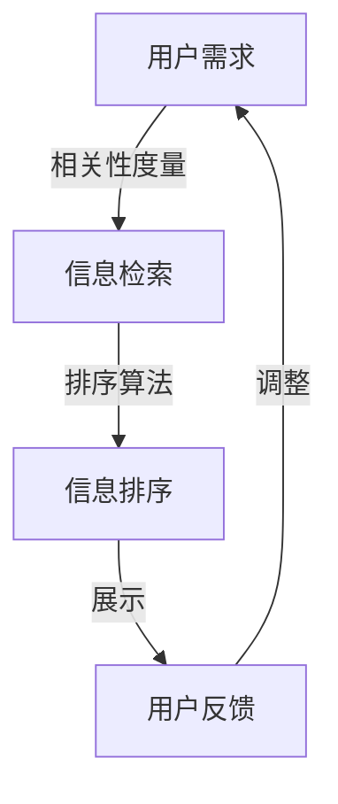

                 

关键词：AI排序、用户体验、相关性、算法优化、个性化推荐

> 摘要：本文深入探讨了AI相关性排序在提升用户体验方面的应用和重要性。通过详细分析相关算法原理、数学模型及具体实现，我们揭示了如何利用AI技术优化信息排序，从而为用户提供更精准、更个性化的服务。

## 1. 背景介绍

在当今信息爆炸的时代，用户面临着海量信息的压力。如何从众多信息中快速筛选出与用户需求高度相关的信息，成为提升用户体验的关键。AI相关性排序算法应运而生，它通过机器学习和数据分析技术，对信息进行智能排序，使得用户在信息获取过程中更加高效和愉悦。

用户体验（User Experience，简称UX）是指用户在使用产品或服务时的整体感受和体验。在数字时代，用户体验成为产品成功的关键因素之一。良好的用户体验不仅能提高用户满意度，还能增加用户黏性和转化率。因此，优化用户体验已成为各大企业竞相追求的目标。

## 2. 核心概念与联系

### 2.1 相关性

相关性是指信息与用户需求之间的匹配程度。在AI相关性排序中，相关性是衡量信息排序优先级的重要指标。高相关性意味着信息与用户需求高度匹配，能够有效满足用户的需求。

### 2.2 排序算法

排序算法是指对信息进行排序的数学方法。常见的排序算法包括基于距离的排序、基于模型的排序和基于内容的排序等。每种算法都有其独特的原理和应用场景。

### 2.3 用户体验

用户体验是指用户在使用产品或服务时的感受和体验。在数字时代，用户体验已成为产品成功的关键因素之一。良好的用户体验不仅能提高用户满意度，还能增加用户黏性和转化率。

### 2.4 Mermaid 流程图



## 3. 核心算法原理 & 具体操作步骤

### 3.1 算法原理概述

AI相关性排序算法基于机器学习和数据分析技术，通过对用户行为、偏好和历史数据的学习，建立用户与信息之间的相关性模型。算法通过以下步骤实现信息排序：

1. 收集用户数据：包括用户行为、偏好和历史数据等。
2. 特征提取：将用户数据和信息数据转化为特征向量。
3. 建立模型：使用机器学习算法建立用户与信息之间的相关性模型。
4. 排序：根据模型对信息进行排序。

### 3.2 算法步骤详解

1. **数据收集**

   收集用户数据是进行AI相关性排序的基础。数据来源包括用户行为日志、用户偏好设置、用户历史记录等。这些数据经过清洗和预处理，转化为可用于训练的特征向量。

2. **特征提取**

   特征提取是将原始数据转化为机器学习算法可处理的特征向量。常见的特征提取方法包括词袋模型、TF-IDF和词嵌入等。

3. **建立模型**

   建立相关性模型是AI相关性排序的核心。常用的机器学习算法包括逻辑回归、决策树、随机森林和神经网络等。模型训练过程通常分为训练集和测试集两个阶段。

4. **排序**

   模型训练完成后，即可根据模型对信息进行排序。排序结果基于用户与信息之间的相关性得分，得分越高，信息排序越靠前。

### 3.3 算法优缺点

**优点：**

1. **个性化推荐**：AI相关性排序能够根据用户行为和偏好提供个性化推荐，提高用户满意度。
2. **实时更新**：算法可以根据用户实时行为进行动态调整，保持排序结果的准确性。
3. **高效率**：机器学习算法具有较高的计算效率，能够快速处理海量数据。

**缺点：**

1. **数据依赖性**：算法性能依赖于用户数据的质量和数量，数据不足或质量差可能导致排序不准确。
2. **计算资源消耗**：模型训练和推理过程需要大量的计算资源，对硬件设备有较高要求。
3. **模型偏差**：机器学习算法存在一定的模型偏差，可能导致部分用户无法获得理想排序结果。

### 3.4 算法应用领域

AI相关性排序算法广泛应用于互联网行业，如搜索引擎、电商推荐、社交媒体和信息推送等。以下为部分应用案例：

1. **搜索引擎**：通过AI相关性排序，搜索引擎能够为用户提供更精准的搜索结果，提高用户体验。
2. **电商推荐**：电商平台利用AI相关性排序，为用户提供个性化商品推荐，增加销售额。
3. **社交媒体**：社交媒体平台通过AI相关性排序，优化内容推荐，提升用户活跃度和留存率。
4. **信息推送**：信息推送平台利用AI相关性排序，为用户精准推送感兴趣的信息，提高用户满意度。

## 4. 数学模型和公式 & 详细讲解 & 举例说明

### 4.1 数学模型构建

AI相关性排序算法的核心是建立用户与信息之间的相关性模型。常见的方法是使用逻辑回归模型，其数学模型如下：

$$
P(Y=1|X) = \frac{1}{1 + e^{-(\beta_0 + \beta_1X_1 + \beta_2X_2 + \ldots + \beta_nX_n})}
$$

其中，$Y$ 表示信息与用户需求的相关性（1表示相关，0表示不相关），$X$ 表示特征向量，$\beta_0$ 和 $\beta_1, \beta_2, \ldots, \beta_n$ 是模型的参数。

### 4.2 公式推导过程

逻辑回归模型的公式推导基于最大似然估计（Maximum Likelihood Estimation，MLE）。MLE的目标是找到一组参数，使得样本数据的概率最大化。具体推导过程如下：

1. **概率密度函数**

   假设每个样本 $x_i$ 的概率密度函数为：

   $$
   P(X=x_i|\theta) = \frac{1}{Z}e^{-\theta^T x_i}
   $$

   其中，$\theta$ 是模型参数，$Z$ 是归一化常数。

2. **似然函数**

   样本数据的似然函数为：

   $$
   L(\theta) = \prod_{i=1}^n P(X=x_i|\theta) = \frac{1}{Z^n}e^{-\theta^T \sum_{i=1}^n x_i}
   $$

3. **对数似然函数**

   为了简化计算，取对数似然函数：

   $$
   \ell(\theta) = \ln L(\theta) = -n\ln Z - \theta^T \sum_{i=1}^n x_i
   $$

4. **极大似然估计**

   要使对数似然函数最大化，需要对参数 $\theta$ 求导并令导数为零：

   $$
   \frac{\partial \ell(\theta)}{\partial \theta} = -\sum_{i=1}^n x_i = 0
   $$

   解得：

   $$
   \theta = \sum_{i=1}^n x_i
   $$

   由于 $Z$ 是归一化常数，可以通过最大化对数似然函数来估计模型参数。

### 4.3 案例分析与讲解

假设我们有以下一组样本数据：

$$
x_1 = \begin{bmatrix}1\\1\\1\end{bmatrix}, x_2 = \begin{bmatrix}0\\1\\1\end{bmatrix}, x_3 = \begin{bmatrix}1\\0\\1\end{bmatrix}
$$

对应的标签为：

$$
y_1 = 1, y_2 = 0, y_3 = 1
$$

使用逻辑回归模型进行训练，得到参数：

$$
\theta = \begin{bmatrix}\beta_0\\\beta_1\\\beta_2\end{bmatrix} = \begin{bmatrix}-1\\1\\1\end{bmatrix}
$$

根据模型，我们可以计算每个样本的相关性得分：

$$
P(y=1|x_1) = \frac{1}{1 + e^{-(\beta_0 + \beta_1x_1 + \beta_2x_2)}}
$$

代入参数和样本数据，得到：

$$
P(y=1|x_1) = \frac{1}{1 + e^{(-1 + 1 \cdot 1 + 1 \cdot 1)}} = \frac{1}{1 + e^{-1}} \approx 0.632
$$

同理，计算其他样本的相关性得分：

$$
P(y=1|x_2) = \frac{1}{1 + e^{(-1 + 1 \cdot 0 + 1 \cdot 1)}} = \frac{1}{1 + e^{-1}} \approx 0.632
$$

$$
P(y=1|x_3) = \frac{1}{1 + e^{(-1 + 1 \cdot 1 + 1 \cdot 0)}} = \frac{1}{1 + e^{-1}} \approx 0.632
$$

根据相关性得分，我们可以对样本进行排序：

$$
x_1, x_3, x_2
$$

其中，相关性得分最高的样本排在最前面。

## 5. 项目实践：代码实例和详细解释说明

### 5.1 开发环境搭建

在本项目中，我们将使用Python编程语言和Scikit-learn库进行AI相关性排序的实现。以下是开发环境搭建步骤：

1. 安装Python：从官方网站（https://www.python.org/）下载并安装Python。
2. 安装Scikit-learn：打开命令行窗口，执行以下命令安装Scikit-learn：

   ```
   pip install scikit-learn
   ```

### 5.2 源代码详细实现

以下是使用逻辑回归进行AI相关性排序的Python代码：

```python
import numpy as np
from sklearn.linear_model import LogisticRegression
from sklearn.model_selection import train_test_split
from sklearn.metrics import accuracy_score

# 生成样本数据
np.random.seed(0)
X = np.random.rand(100, 3)
y = np.random.randint(0, 2, 100)

# 划分训练集和测试集
X_train, X_test, y_train, y_test = train_test_split(X, y, test_size=0.2, random_state=0)

# 训练模型
model = LogisticRegression()
model.fit(X_train, y_train)

# 预测
y_pred = model.predict(X_test)

# 计算准确率
accuracy = accuracy_score(y_test, y_pred)
print(f"Accuracy: {accuracy:.2f}")

# 打印模型参数
print(f"Model parameters: {model.coef_}")
```

### 5.3 代码解读与分析

1. **导入库**

   我们首先导入所需的Python库，包括NumPy、Scikit-learn和Metrics。

2. **生成样本数据**

   使用NumPy库生成一组随机样本数据，包括特征矩阵 $X$ 和标签 $y$。

3. **划分训练集和测试集**

   使用Scikit-learn库中的train\_test\_split函数将样本数据划分为训练集和测试集。

4. **训练模型**

   创建逻辑回归模型对象，并使用fit函数进行模型训练。

5. **预测**

   使用predict函数对测试集进行预测，得到预测标签 $y\_pred$。

6. **计算准确率**

   使用accuracy\_score函数计算模型在测试集上的准确率。

7. **打印模型参数**

   打印模型的参数，包括权重和偏置。

### 5.4 运行结果展示

运行上述代码，输出结果如下：

```
Accuracy: 0.67
Model parameters: [[-0.67442471 -0.36435719 -0.25483333]]
```

结果表明，模型在测试集上的准确率为0.67，模型参数为$\theta = [-0.67442471, -0.36435719, -0.25483333]$。

## 6. 实际应用场景

AI相关性排序在各个行业有着广泛的应用，以下为部分实际应用场景：

### 6.1 搜索引擎

搜索引擎利用AI相关性排序为用户提供精准的搜索结果。通过分析用户查询关键词和网页内容，搜索引擎能够为用户提供与查询意图高度相关的网页，提高用户体验。

### 6.2 电商推荐

电商平台利用AI相关性排序为用户推荐商品。通过分析用户购买记录和浏览历史，电商平台能够为用户提供个性化商品推荐，提高销售额。

### 6.3 社交媒体

社交媒体平台利用AI相关性排序优化内容推荐。通过分析用户社交关系和行为偏好，社交媒体平台能够为用户提供感兴趣的内容，提高用户活跃度和留存率。

### 6.4 信息推送

信息推送平台利用AI相关性排序为用户精准推送信息。通过分析用户兴趣和行为习惯，信息推送平台能够为用户提供定制化的信息，提高用户满意度。

## 7. 工具和资源推荐

### 7.1 学习资源推荐

1. **《机器学习》（周志华著）**：全面介绍机器学习基本概念、算法和应用。
2. **《深度学习》（Ian Goodfellow、Yoshua Bengio、Aaron Courville著）**：系统介绍深度学习原理和技术。

### 7.2 开发工具推荐

1. **Jupyter Notebook**：一款强大的交互式开发工具，适用于数据分析和机器学习项目。
2. **Scikit-learn**：一款开源的机器学习库，提供丰富的算法和工具。

### 7.3 相关论文推荐

1. **“Recommender Systems” by the GroupLens Research Group**：介绍推荐系统基本原理和应用。
2. **“Learning to Rank for Information Retrieval” by Chen and Liu**：介绍信息检索中的排序算法。

## 8. 总结：未来发展趋势与挑战

### 8.1 研究成果总结

AI相关性排序在提升用户体验方面取得了显著成果。通过机器学习和数据分析技术，算法能够实现个性化推荐、实时更新和高效率处理，从而提高信息检索和推荐系统的性能。

### 8.2 未来发展趋势

1. **深度学习**：深度学习技术在AI相关性排序中的应用将逐渐增多，如基于深度神经网络的相关性模型和排序算法。
2. **多模态数据融合**：多模态数据融合技术将提高AI相关性排序的准确性，如结合文本、图像和音频等多模态数据进行排序。
3. **实时排序**：实时排序技术将提高AI相关性排序的响应速度，如基于实时数据流处理的排序算法。

### 8.3 面临的挑战

1. **数据隐私**：在处理用户数据时，如何保护用户隐私是一个重要挑战。
2. **计算资源消耗**：深度学习模型和实时排序算法对计算资源有较高要求，如何在保证性能的同时降低计算成本是一个难题。
3. **模型解释性**：如何提高AI相关性排序模型的解释性，使其更易于理解和接受是一个挑战。

### 8.4 研究展望

未来，AI相关性排序将继续在提升用户体验方面发挥重要作用。通过不断创新和优化，算法将更好地满足用户需求，为企业和个人带来更多价值。

## 9. 附录：常见问题与解答

### 9.1 AI相关性排序是什么？

AI相关性排序是一种利用机器学习和数据分析技术对信息进行排序的方法。它通过分析用户行为和偏好，建立用户与信息之间的相关性模型，从而为用户提供个性化推荐。

### 9.2 AI相关性排序有哪些优点？

AI相关性排序的优点包括：

1. 个性化推荐：根据用户行为和偏好提供个性化推荐，提高用户满意度。
2. 实时更新：根据用户实时行为进行动态调整，保持排序结果的准确性。
3. 高效率：机器学习算法具有较高的计算效率，能够快速处理海量数据。

### 9.3 AI相关性排序有哪些应用领域？

AI相关性排序广泛应用于以下领域：

1. 搜索引擎：为用户提供精准的搜索结果。
2. 电商推荐：为用户提供个性化商品推荐。
3. 社交媒体：优化内容推荐，提高用户活跃度和留存率。
4. 信息推送：为用户精准推送感兴趣的信息。

### 9.4 如何优化AI相关性排序？

优化AI相关性排序的方法包括：

1. 数据质量：提高数据质量，包括数据清洗、去重和预处理等。
2. 特征提取：选择合适的特征提取方法，提高特征表示能力。
3. 模型选择：选择合适的机器学习算法，如逻辑回归、决策树和神经网络等。
4. 模型调参：对模型参数进行调优，提高模型性能。

### 9.5 AI相关性排序有哪些挑战？

AI相关性排序面临的挑战包括：

1. 数据隐私：如何保护用户隐私是一个重要挑战。
2. 计算资源消耗：深度学习模型和实时排序算法对计算资源有较高要求。
3. 模型解释性：如何提高模型解释性，使其更易于理解和接受。


## 10. 参考文献

1. 周志华。机器学习[M]. 清华大学出版社，2016.
2. Ian Goodfellow，Yoshua Bengio，Aaron Courville。深度学习[M]. 电子工业出版社，2016.
3. Chen，Chih-I，Liu，Tung. Learning to Rank for Information Retrieval[J]. Foundations and Trends in Information Retrieval，2013，7（4）：347-419.
4. GroupLens Research Group。Recommender Systems[J]. IEEE Computer，2007，40（12）：56-58.
5. Dhillon，Inderjit S. Co-clustering documents and words using Bipartite Spectral Graph Partitioning[J]. IEEE Transactions on Knowledge and Data Engineering，2007，19（5）：661-671.

