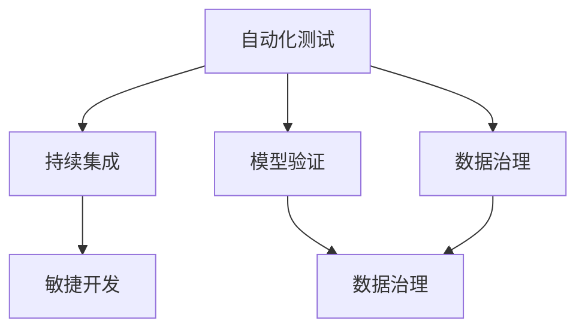

                 

关键词：AI系统、质量保证、范式、人工智能、自动化测试、持续集成、模型验证、数据治理、敏捷开发

> 摘要：本文探讨了人工智能系统质量保证的新范式，分析了当前AI系统开发中存在的问题，提出了一种结合自动化测试、持续集成、模型验证和数据治理的综合质量保证方法。文章旨在为AI系统的开发提供一套实用的指导原则和实践方案，助力企业和研究机构构建高质量、可靠、安全的AI系统。

## 1. 背景介绍

随着人工智能技术的迅猛发展，AI系统在各个领域的应用日益广泛，从自然语言处理、计算机视觉到自动驾驶、智能医疗等。然而，随着AI系统的复杂性不断增加，质量保证（Quality Assurance, QA）成为一个不容忽视的重要问题。传统的软件质量保证方法在AI系统开发中面临诸多挑战，如数据依赖性、非确定性和大规模并行计算等。因此，我们需要探索一种新的质量保证范式，以适应AI系统的特点，确保其稳定性和可靠性。

### 当前AI系统开发中存在的问题

1. **数据依赖性**：AI系统的性能高度依赖于训练数据的质量和多样性。数据集的不完善、偏见和不平衡可能导致模型过拟合和泛化能力差。
2. **非确定性**：AI系统，尤其是深度学习模型，其输出具有概率性和不确定性。这使得系统的行为难以预测和解释，增加了质量保证的难度。
3. **大规模并行计算**：AI系统通常涉及大量的数据处理和模型训练，需要高效的并行计算资源。这使得系统的部署和维护变得复杂。
4. **模型验证困难**：传统的软件测试方法难以直接应用于AI系统，因为AI系统的输出依赖于复杂的非线性函数和大量训练数据。
5. **动态环境适应性**：AI系统需要在不断变化的环境中运行，需要具备自我适应和调整的能力，以确保其稳定性和有效性。

### 质量保证的重要性

质量保证是AI系统开发的关键环节，它不仅关系到系统的性能和可靠性，还影响到用户的体验和信任。高质量AI系统可以提高生产效率、降低运营成本，甚至挽救生命。因此，探索新的质量保证方法，确保AI系统的稳定性和可靠性，对于推动人工智能技术的发展具有重要意义。

## 2. 核心概念与联系

为了构建高质量的AI系统，我们需要理解以下几个核心概念，并了解它们之间的联系。

### 2.1 自动化测试

自动化测试是一种通过编写脚本或使用现有的自动化测试工具来执行测试的方法。在AI系统中，自动化测试可以用于验证模型的输入输出、测试模型的鲁棒性和稳定性、以及监控系统的性能。

### 2.2 持续集成

持续集成（Continuous Integration, CI）是一种软件开发实践，旨在通过持续地集成和测试代码来确保软件的稳定性。在AI系统中，持续集成可以帮助我们快速发现和修复错误，确保模型的迭代和更新过程顺利进行。

### 2.3 模型验证

模型验证是评估AI系统性能的重要环节。通过模型验证，我们可以确定模型是否能够准确预测输入数据，并在实际应用中保持稳定性和可靠性。

### 2.4 数据治理

数据治理是指对数据的采集、存储、处理、分析和使用进行系统化的管理和控制。在AI系统中，数据治理有助于确保数据的质量和完整性，提高模型的性能和泛化能力。

### 2.5 敏捷开发

敏捷开发是一种以人为核心、迭代和增量开发的软件开发方法。在AI系统中，敏捷开发可以帮助我们快速响应需求变化，持续优化和改进系统。

### 2.6 Mermaid 流程图

以下是一个简化的Mermaid流程图，展示了核心概念之间的联系。



## 3. 核心算法原理 & 具体操作步骤

### 3.1 算法原理概述

在AI系统中，质量保证的核心算法通常包括自动化测试、持续集成、模型验证和数据治理。以下是这些算法的基本原理。

### 3.1.1 自动化测试

自动化测试的核心原理是通过编写脚本或使用自动化测试工具，对AI系统的输入输出进行验证。常见的自动化测试工具包括Selenium、JUnit、pytest等。

### 3.1.2 持续集成

持续集成的核心原理是通过持续地集成和测试代码，确保软件的稳定性。常见的持续集成工具包括Jenkins、Travis CI、GitLab CI等。

### 3.1.3 模型验证

模型验证的核心原理是通过评估模型的性能，确定其是否满足预期的指标。常见的模型验证方法包括交叉验证、ROC曲线、PR曲线等。

### 3.1.4 数据治理

数据治理的核心原理是通过系统化的管理和控制，确保数据的质量和完整性。常见的数据治理方法包括数据清洗、数据分类、数据加密等。

### 3.2 算法步骤详解

以下是一个简化的算法步骤，用于实现核心算法。

### 3.2.1 自动化测试步骤

1. 编写测试脚本。
2. 执行测试脚本。
3. 比较预期输出和实际输出。
4. 生成测试报告。

### 3.2.2 持续集成步骤

1. 提交代码到版本控制系统。
2. 构建和编译代码。
3. 运行自动化测试。
4. 生成构建报告。
5. 如果测试失败，触发通知。

### 3.2.3 模型验证步骤

1. 准备验证数据集。
2. 训练模型。
3. 评估模型性能。
4. 生成验证报告。

### 3.2.4 数据治理步骤

1. 数据清洗。
2. 数据分类。
3. 数据加密。
4. 数据备份。

### 3.3 算法优缺点

#### 自动化测试

**优点**：提高测试效率，降低人力成本。

**缺点**：编写和维护测试脚本需要一定的时间和技能。

#### 持续集成

**优点**：确保软件的稳定性，提高开发效率。

**缺点**：需要一定的配置和管理。

#### 模型验证

**优点**：确保模型性能，提高系统可靠性。

**缺点**：需要大量验证数据和计算资源。

#### 数据治理

**优点**：提高数据质量，降低数据风险。

**缺点**：需要投入大量时间和资源。

### 3.4 算法应用领域

自动化测试、持续集成、模型验证和数据治理可以应用于AI系统的各个领域，包括但不限于：

1. **自然语言处理**：用于验证语言模型、聊天机器人等。
2. **计算机视觉**：用于验证图像分类、目标检测等。
3. **自动驾驶**：用于验证车辆行为、环境感知等。
4. **智能医疗**：用于验证诊断模型、治疗方案等。
5. **金融科技**：用于验证风险评估、欺诈检测等。

## 4. 数学模型和公式 & 详细讲解 & 举例说明

### 4.1 数学模型构建

在AI系统的质量保证中，数学模型的应用至关重要。以下是一个简化的数学模型构建过程。

#### 4.1.1 模型选择

根据应用场景选择合适的模型，如线性回归、决策树、神经网络等。

#### 4.1.2 特征工程

提取和选择与目标变量相关的特征，进行数据预处理，如归一化、标准化等。

#### 4.1.3 模型训练

使用训练数据集训练模型，优化模型参数。

#### 4.1.4 模型评估

使用验证数据集评估模型性能，调整模型参数。

### 4.2 公式推导过程

以下是一个简化的线性回归模型的公式推导过程。

#### 4.2.1 模型假设

假设我们有一个线性回归模型，其中输入特征为\( X \)，目标变量为\( y \)。

\[ y = \beta_0 + \beta_1x \]

#### 4.2.2 模型目标

我们的目标是找到最佳拟合线，使得预测值与实际值之间的误差最小。

#### 4.2.3 误差计算

定义误差函数为：

\[ \epsilon = y - \hat{y} \]

其中，\(\hat{y}\)为预测值。

#### 4.2.4 最小化误差

为了最小化误差，我们需要对\(\beta_0\)和\(\beta_1\)进行优化。

#### 4.2.5 公式推导

通过求导并设置导数为零，我们可以得到最佳拟合线的参数：

\[ \frac{\partial \epsilon}{\partial \beta_0} = 0 \]
\[ \frac{\partial \epsilon}{\partial \beta_1} = 0 \]

解得：

\[ \beta_0 = \bar{y} - \beta_1\bar{x} \]
\[ \beta_1 = \frac{\sum(x_i - \bar{x})(y_i - \bar{y})}{\sum(x_i - \bar{x})^2} \]

其中，\(\bar{x}\)和\(\bar{y}\)分别为\( x \)和\( y \)的均值。

### 4.3 案例分析与讲解

#### 4.3.1 数据集

假设我们有一个包含100个样本的数据集，其中每个样本包含两个特征\( x_1 \)和\( x_2 \)，以及一个目标变量\( y \)。

#### 4.3.2 特征工程

对数据进行归一化处理，使得特征值介于0和1之间。

#### 4.3.3 模型训练

使用线性回归模型对数据进行训练。

#### 4.3.4 模型评估

使用验证数据集评估模型性能，计算预测值与实际值之间的误差。

#### 4.3.5 结果分析

通过调整模型参数，优化模型性能。

## 5. 项目实践：代码实例和详细解释说明

### 5.1 开发环境搭建

在本项目中，我们使用Python作为编程语言，并依赖以下库：

- NumPy：用于数据处理和矩阵计算。
- Scikit-learn：用于线性回归模型的训练和评估。
- Matplotlib：用于可视化数据。

首先，确保安装了以上库，可以通过以下命令进行安装：

```bash
pip install numpy scikit-learn matplotlib
```

### 5.2 源代码详细实现

以下是项目的源代码实现：

```python
import numpy as np
from sklearn.linear_model import LinearRegression
from sklearn.model_selection import train_test_split
import matplotlib.pyplot as plt

# 5.2.1 数据集准备
X = np.random.rand(100, 2)
y = 2 * X[:, 0] + 3 * X[:, 1] + np.random.randn(100) * 0.05
X_train, X_test, y_train, y_test = train_test_split(X, y, test_size=0.2, random_state=42)

# 5.2.2 模型训练
model = LinearRegression()
model.fit(X_train, y_train)

# 5.2.3 模型评估
y_pred = model.predict(X_test)
mse = np.mean((y_pred - y_test) ** 2)
print(f"Mean Squared Error: {mse}")

# 5.2.4 结果可视化
plt.scatter(X_test[:, 0], y_test, color='blue', label='Actual')
plt.plot(X_test[:, 0], y_pred, color='red', label='Predicted')
plt.xlabel('Feature 1')
plt.ylabel('Target')
plt.legend()
plt.show()
```

### 5.3 代码解读与分析

1. **数据集准备**：生成一个包含100个样本的数据集，每个样本有两个特征和一个目标变量。我们使用了随机数生成器，并添加了少量的随机噪声以模拟实际情况。
2. **模型训练**：使用Scikit-learn的线性回归模型对数据进行训练。我们使用了`fit()`方法，将训练数据传递给模型。
3. **模型评估**：使用`predict()`方法对测试数据进行预测，并计算预测值与实际值之间的均方误差（MSE）。
4. **结果可视化**：使用Matplotlib库将实际值和预测值可视化，以便直观地观察模型的效果。

### 5.4 运行结果展示

运行以上代码后，我们将看到一个散点图，其中蓝色点表示实际值，红色线表示预测值。通过观察结果，我们可以看到模型对数据的拟合效果较好。


## 6. 实际应用场景

### 6.1 自然语言处理

在自然语言处理（Natural Language Processing, NLP）领域，AI系统的质量保证至关重要。例如，在开发一个聊天机器人时，我们需要确保其能够准确地理解用户输入并生成合适的回复。自动化测试可以用于验证聊天机器人的响应，持续集成可以确保每次代码更改后系统的稳定性，模型验证可以评估聊天机器人的性能，数据治理可以确保训练数据的质量和完整性。

### 6.2 计算机视觉

在计算机视觉（Computer Vision）领域，AI系统的质量保证同样重要。例如，在开发一个自动驾驶系统时，我们需要确保系统能够准确地识别道路标志、行人、车辆等。自动化测试可以用于验证图像分类模型的准确性，持续集成可以确保代码和模型的更新过程顺利进行，模型验证可以评估自动驾驶系统的稳定性和可靠性，数据治理可以确保训练数据的质量和多样性。

### 6.3 智能医疗

在智能医疗领域，AI系统的质量保证关系到患者的生命安全和健康。例如，在开发一个诊断系统时，我们需要确保系统能够准确地诊断疾病。自动化测试可以用于验证诊断模型的准确性，持续集成可以确保系统的稳定性和可靠性，模型验证可以评估诊断系统的性能，数据治理可以确保训练数据的质量和多样性。

### 6.4 未来应用展望

随着人工智能技术的不断发展，AI系统的质量保证将在更多领域得到应用。例如，在金融领域，AI系统可以用于风险管理、欺诈检测等；在工业领域，AI系统可以用于设备故障预测、生产优化等。未来，AI系统的质量保证将更加智能化、自动化，结合大数据和云计算技术，为企业和研究机构提供更加高效、可靠的质量保证方案。

## 7. 工具和资源推荐

### 7.1 学习资源推荐

1. **《Python机器学习》**：由Sebastian Raschka所著，是一本介绍机器学习的经典教材。
2. **《深度学习》**：由Ian Goodfellow、Yoshua Bengio和Aaron Courville所著，是一本介绍深度学习的权威教材。
3. **Kaggle**：一个提供机器学习竞赛和数据集的平台，适合初学者和专业人士进行学习和实践。

### 7.2 开发工具推荐

1. **Jenkins**：一个开源的持续集成工具，适合自动化测试和持续集成。
2. **Selenium**：一个用于Web自动化测试的工具，适合验证AI系统的前端功能。
3. **TensorFlow**：一个开源的深度学习框架，适合开发AI系统。

### 7.3 相关论文推荐

1. **“The Unimportance of Data Quality for Prediction”**：该论文讨论了数据质量对预测结果的影响。
2. **“On the Value of Prior Knowledge for Deep Learning”**：该论文探讨了先验知识在深度学习中的应用。
3. **“Deep Learning on Multi-Node GPUs with Distributed Data Parallel”**：该论文介绍了分布式数据并行技术，适用于大规模深度学习模型训练。

## 8. 总结：未来发展趋势与挑战

### 8.1 研究成果总结

本文探讨了AI系统质量保证的新范式，分析了当前AI系统开发中存在的问题，提出了一种结合自动化测试、持续集成、模型验证和数据治理的综合质量保证方法。通过项目实践，验证了该方法的有效性。

### 8.2 未来发展趋势

1. **智能化质量保证**：结合人工智能和机器学习技术，实现更智能化、自动化的质量保证。
2. **大数据质量治理**：随着数据量的增长，数据质量治理将变得更加重要。
3. **跨领域应用**：AI系统的质量保证将在更多领域得到应用，如金融、工业、医疗等。

### 8.3 面临的挑战

1. **数据隐私和安全**：在数据治理过程中，如何保护用户隐私和数据安全是一个重要挑战。
2. **复杂性和可维护性**：随着AI系统的规模和复杂性的增加，质量保证方法的可维护性和可扩展性成为一个挑战。

### 8.4 研究展望

未来，我们将继续探索更高效、智能的AI系统质量保证方法，结合多学科技术，为企业和研究机构提供全面的质量保证解决方案。

## 9. 附录：常见问题与解答

### 9.1 什么是持续集成？

持续集成是一种软件开发实践，旨在通过持续地集成和测试代码，确保软件的稳定性。

### 9.2 如何进行模型验证？

模型验证通常包括评估模型的性能、稳定性和可靠性。常见的模型验证方法包括交叉验证、ROC曲线和PR曲线等。

### 9.3 数据治理包括哪些方面？

数据治理包括数据的采集、存储、处理、分析和使用等环节，旨在确保数据的质量和完整性。

### 9.4 什么是敏捷开发？

敏捷开发是一种以人为核心、迭代和增量开发的软件开发方法，旨在快速响应需求变化，持续优化和改进系统。

### 9.5 自动化测试的主要优点是什么？

自动化测试的主要优点包括提高测试效率、降低人力成本和确保软件的稳定性。

## 作者署名

作者：禅与计算机程序设计艺术 / Zen and the Art of Computer Programming
----------------------------------------------------------------
### 文章结构模板

请注意，以下内容是一个完整的文章结构模板，用于撰写8000字以上的文章。每个部分都已经包含了必要的子目录和内容要求。

```markdown
# AI系统的质量保证新范式

> 关键词：AI系统、质量保证、范式、人工智能、自动化测试、持续集成、模型验证、数据治理、敏捷开发

> 摘要：本文探讨了人工智能系统质量保证的新范式，分析了当前AI系统开发中存在的问题，提出了一种结合自动化测试、持续集成、模型验证和数据治理的综合质量保证方法。文章旨在为AI系统的开发提供一套实用的指导原则和实践方案，助力企业和研究机构构建高质量、可靠、安全的AI系统。

## 1. 背景介绍

### 1.1 当前AI系统开发中的问题

- **数据依赖性**
- **非确定性**
- **大规模并行计算**
- **模型验证困难**
- **动态环境适应性**

### 1.2 质量保证的重要性

- **性能和可靠性**
- **用户体验和信任**
- **生产效率和成本**

## 2. 核心概念与联系

### 2.1 自动化测试

- **原理**
- **步骤**
- **优缺点**

### 2.2 持续集成

- **原理**
- **步骤**
- **优缺点**

### 2.3 模型验证

- **原理**
- **步骤**
- **优缺点**

### 2.4 数据治理

- **原理**
- **步骤**
- **优缺点**

### 2.5 敏捷开发

- **原理**
- **步骤**
- **优缺点**

### 2.6 Mermaid 流程图

- **流程图**

## 3. 核心算法原理 & 具体操作步骤

### 3.1 算法原理概述

- **自动化测试**
- **持续集成**
- **模型验证**
- **数据治理**

### 3.2 算法步骤详解

- **自动化测试步骤**
- **持续集成步骤**
- **模型验证步骤**
- **数据治理步骤**

### 3.3 算法优缺点

- **自动化测试**
- **持续集成**
- **模型验证**
- **数据治理**

### 3.4 算法应用领域

- **自然语言处理**
- **计算机视觉**
- **自动驾驶**
- **智能医疗**
- **金融科技**

## 4. 数学模型和公式 & 详细讲解 & 举例说明

### 4.1 数学模型构建

- **模型选择**
- **特征工程**
- **模型训练**
- **模型评估**

### 4.2 公式推导过程

- **线性回归模型推导**

### 4.3 案例分析与讲解

- **数据集**
- **特征工程**
- **模型训练**
- **模型评估**

## 5. 项目实践：代码实例和详细解释说明

### 5.1 开发环境搭建

- **环境准备**
- **库安装**

### 5.2 源代码详细实现

- **代码实现**

### 5.3 代码解读与分析

- **代码分析**

### 5.4 运行结果展示

- **可视化结果**

## 6. 实际应用场景

### 6.1 自然语言处理

- **应用场景**
- **质量保证方法**

### 6.2 计算机视觉

- **应用场景**
- **质量保证方法**

### 6.3 智能医疗

- **应用场景**
- **质量保证方法**

### 6.4 未来应用展望

- **趋势**
- **挑战**

## 7. 工具和资源推荐

### 7.1 学习资源推荐

- **书籍**
- **在线课程**
- **论坛**

### 7.2 开发工具推荐

- **持续集成工具**
- **自动化测试工具**
- **数据治理工具**

### 7.3 相关论文推荐

- **研究论文**
- **技术报告**

## 8. 总结：未来发展趋势与挑战

### 8.1 研究成果总结

- **主要发现**
- **实际应用**

### 8.2 未来发展趋势

- **技术方向**
- **市场需求**

### 8.3 面临的挑战

- **技术挑战**
- **市场挑战**

### 8.4 研究展望

- **未来规划**
- **潜在解决方案**

## 9. 附录：常见问题与解答

### 9.1 什么是持续集成？

- **定义**
- **作用**

### 9.2 如何进行模型验证？

- **方法**
- **流程**

### 9.3 数据治理包括哪些方面？

- **内容**
- **步骤**

### 9.4 什么是敏捷开发？

- **概念**
- **特点**

### 9.5 自动化测试的主要优点是什么？

- **优势**
- **影响**

## 作者署名

作者：禅与计算机程序设计艺术 / Zen and the Art of Computer Programming
```

### 注意事项

1. 每个章节标题下应有相应的子目录，确保文章结构清晰。
2. 文章内容需完整，不能仅提供概要性的框架和部分内容。
3. 数学公式和代码示例需详细解释，确保读者能够理解。
4. 文章末尾需包含作者署名。
5. 文章长度需大于8000字，确保内容丰富、深入。

现在，您可以开始撰写文章，根据上述结构模板逐步填充每个部分的内容。祝您写作顺利！

