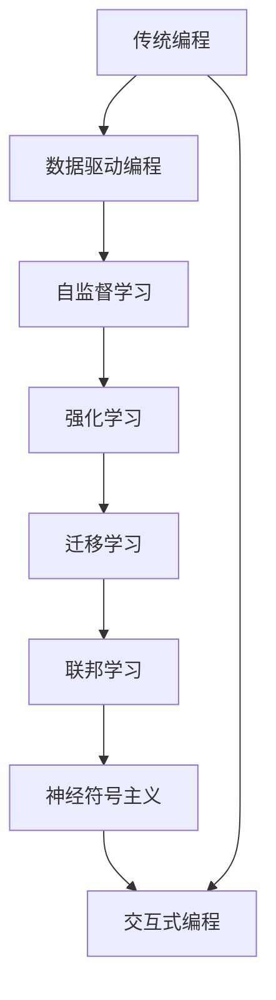

                 

关键词：人工智能编程、新范式、挑战、算法、数学模型、实践应用、未来展望

> 摘要：本文深入探讨了人工智能编程的新范式及其面临的挑战。通过对核心算法原理的解析、数学模型的构建、实际项目实践和未来应用的展望，为读者提供了一份全面而深入的AI编程指南。

## 1. 背景介绍

在过去的几十年中，人工智能（AI）经历了飞速的发展，从最初的规则基础系统到现在的深度学习与神经网络，AI技术已经深入到我们生活的各个方面。然而，随着AI技术的不断进步，传统的编程范式和工具开始显得力不从心，无法满足日益复杂的应用需求。这就促使我们探索AI编程的新范式，以应对这些挑战。

### 1.1 传统编程范式的局限性

传统的编程范式主要包括面向对象编程（OOP）和过程式编程。这些方法虽然在许多领域取得了显著的成果，但它们在处理复杂问题、特别是与AI相关的任务时，存在以下几个局限性：

- **重模式匹配**：传统的编程范式强调模式匹配和状态转移，这在处理静态数据结构时非常有效，但在面对动态和不确定的环境时，会显得过于僵化。
- **缺乏抽象能力**：传统的编程范式难以抽象复杂的概念和算法，导致代码冗长且难以维护。
- **手工编写规则**：在规则密集型的系统中，手动编写规则是一项繁重且容易出错的工作。

### 1.2 新范式的重要性

为了克服传统编程范式的局限性，人工智能编程需要一种新的范式。这种新范式需要具备以下几个特点：

- **自动化和自我优化**：新范式应能够自动适应环境变化，并通过学习不断提升自身性能。
- **高层次的抽象**：新范式应能够以更高层次的语言描述复杂算法和系统，从而降低开发难度。
- **并行和分布式计算**：新范式应支持并行和分布式计算，以充分利用现代计算机硬件的强大计算能力。

## 2. 核心概念与联系

为了更好地理解AI编程的新范式，我们首先需要了解一些核心概念和它们之间的联系。以下是一个用Mermaid绘制的流程图，展示了这些核心概念之间的关系。



### 2.1 数据驱动编程

数据驱动编程是一种基于数据输入和反馈的系统设计方法。这种方法强调数据的收集、处理和分析，并通过这些过程实现系统的学习和优化。

### 2.2 自监督学习

自监督学习是一种无需外部标签即可从数据中学习的方法。它通过设计能够自我纠正的错误预测机制，使系统在处理过程中不断优化自身。

### 2.3 强化学习

强化学习是一种通过与环境的互动来学习最优策略的方法。它通过奖励和惩罚信号来调整自身行为，以达到长期目标的最大化。

### 2.4 迁移学习

迁移学习是一种将一个任务学习到的知识应用到其他相关任务中的方法。这种方法可以减少训练数据的需求，并提高模型在未知数据上的泛化能力。

### 2.5 联邦学习

联邦学习是一种分布式学习框架，它允许不同节点上的模型通过协作学习，而不需要共享原始数据。这种方法在保护数据隐私的同时，提高了模型的训练效率。

### 2.6 神经符号主义

神经符号主义是一种结合神经网络和逻辑推理的方法。它通过将神经网络与符号推理系统相结合，使得AI系统在处理符号数据时能够更接近人类的思维方式。

### 2.7 交互式编程

交互式编程是一种通过实时反馈和交互来开发和优化系统的编程方法。这种方法使得开发者能够快速迭代和调整系统，以适应不断变化的需求。

## 3. 核心算法原理 & 具体操作步骤

### 3.1 算法原理概述

AI编程的新范式涉及多种核心算法，其中一些算法如下：

- **生成对抗网络（GAN）**：GAN由生成器和判别器两个神经网络组成，通过相互竞争来生成高质量的数据。
- **深度强化学习（DRL）**：DRL通过深度神经网络来表示状态和动作，并通过强化信号来学习最优策略。
- **图神经网络（GNN）**：GNN利用图结构来表示和建模复杂的数据，从而提高模型的泛化能力。

### 3.2 算法步骤详解

以GAN为例，其基本步骤如下：

1. **初始化**：初始化生成器和判别器。
2. **生成器训练**：生成器尝试生成与真实数据相似的数据，判别器则判断生成数据的真假。
3. **判别器训练**：判别器通过不断更新模型参数，提高对生成数据和真实数据的辨别能力。
4. **迭代**：重复上述步骤，直到生成器生成的数据质量达到预期。

### 3.3 算法优缺点

GAN的优点包括：

- **强大的数据生成能力**：GAN可以生成高质量的数据，广泛应用于图像生成、语音合成等领域。
- **无监督学习**：GAN无需外部标签即可进行训练，适用于标签难以获取的场景。

GAN的缺点包括：

- **训练不稳定**：GAN的训练过程容易出现模式崩溃等问题，导致训练过程不稳定。
- **计算资源消耗大**：GAN的训练需要大量的计算资源，特别是在处理高维数据时。

### 3.4 算法应用领域

GAN在图像处理、计算机视觉、语音合成等领域有广泛的应用。例如，在图像生成方面，GAN可以生成逼真的图像；在计算机视觉方面，GAN可以用于图像超分辨率和图像修复；在语音合成方面，GAN可以生成逼真的语音。

## 4. 数学模型和公式 & 详细讲解 & 举例说明

### 4.1 数学模型构建

以GAN为例，其数学模型可以表示为：

$$
\begin{aligned}
\min_{G} \quad & \mathbb{E}_{x \sim p_{data}(x)} [\log(D(G(x)))] \\
\min_{D} \quad & \mathbb{E}_{x \sim p_{data}(x)} [\log(D(x))] + \mathbb{E}_{z \sim p_{z}(z)} [\log(1 - D(G(z)))]
\end{aligned}
$$

其中，$G$代表生成器，$D$代表判别器，$x$代表真实数据，$z$代表随机噪声，$p_{data}(x)$代表真实数据的概率分布，$p_{z}(z)$代表噪声的概率分布。

### 4.2 公式推导过程

GAN的目标是最小化生成器和判别器的损失函数。对于生成器$G$，其目标是生成尽可能真实的数据，使得判别器$D$无法区分生成数据$G(x)$和真实数据$x$。因此，生成器的损失函数可以表示为：

$$
L_G = -\mathbb{E}_{x \sim p_{data}(x)} [\log(D(G(x)))]
$$

对于判别器$D$，其目标是正确区分真实数据和生成数据。因此，判别器的损失函数可以表示为：

$$
L_D = -\mathbb{E}_{x \sim p_{data}(x)} [\log(D(x))] - \mathbb{E}_{z \sim p_{z}(z)} [\log(1 - D(G(z)))]
$$

### 4.3 案例分析与讲解

假设我们使用GAN来生成手写数字图像。在这个案例中，真实数据集为MNIST，生成器$G$的输入为随机噪声$z$，输出为手写数字图像$G(z)$，判别器$D$的输入为真实手写数字图像$x$和生成图像$G(z)$。

在训练过程中，生成器$G$尝试生成与真实手写数字图像相似的数据，而判别器$D$则通过不断更新模型参数，提高对生成图像和真实图像的辨别能力。经过多次迭代后，生成器$G$生成的图像质量会逐渐提高，判别器$D$的辨别能力也会逐渐增强。

## 5. 项目实践：代码实例和详细解释说明

### 5.1 开发环境搭建

为了实践GAN，我们需要搭建一个Python编程环境，并安装必要的库。以下是一个简单的安装脚本：

```bash
# 安装Python环境
sudo apt-get install python3

# 安装TensorFlow库
pip3 install tensorflow

# 安装其他必要库
pip3 install numpy matplotlib
```

### 5.2 源代码详细实现

以下是一个简单的GAN实现：

```python
import tensorflow as tf
from tensorflow.keras import layers
import numpy as np
import matplotlib.pyplot as plt

# 设置随机种子
tf.random.set_seed(42)

# 准备MNIST数据集
mnist = tf.keras.datasets.mnist
(x_train, _), _ = mnist.load_data()
x_train = x_train.astype('float32') / 255.0
x_train = x_train[..., tf.newaxis]

# 定义生成器和判别器
latent_dim = 100

def make_generator_model():
    model = tf.keras.Sequential()
    model.add(layers.Dense(7*7*256, use_bias=False, input_shape=(latent_dim,)))
    model.add(layers.BatchNormalization())
    model.add(layers.LeakyReLU())

    model.add(layers.Reshape((7, 7, 256)))
    assert model.output_shape == (None, 7, 7, 256)

    model.add(layers.Conv2DTranspose(128, (5, 5), strides=(1, 1), padding='same', use_bias=False))
    model.add(layers.BatchNormalization())
    model.add(layers.LeakyReLU())

    model.add(layers.Conv2DTranspose(64, (5, 5), strides=(2, 2), padding='same', use_bias=False))
    model.add(layers.BatchNormalization())
    model.add(layers.LeakyReLU())

    model.add(layers.Conv2DTranspose(1, (5, 5), strides=(2, 2), padding='same', use_bias=False, activation='tanh'))
    assert model.output_shape == (None, 28, 28, 1)

    return model

def make_discriminator_model():
    model = tf.keras.Sequential()
    model.add(layers.Conv2D(64, (5, 5), strides=(2, 2), padding='same', input_shape=[28, 28, 1]))
    model.add(layers.LeakyReLU())
    model.add(layers.Dropout(0.3))

    model.add(layers.Conv2D(128, (5, 5), strides=(2, 2), padding='same'))
    model.add(layers.LeakyReLU())
    model.add(layers.Dropout(0.3))

    model.add(layers.Flatten())
    model.add(layers.Dense(1))

    return model

generator = make_generator_model()
discriminator = make_discriminator_model()

# 定义损失函数和优化器
cross_entropy = tf.keras.losses.BinaryCrossentropy(from_logits=True)

def discriminator_loss(real_output, fake_output):
    real_loss = cross_entropy(tf.ones_like(real_output), real_output)
    fake_loss = cross_entropy(tf.zeros_like(fake_output), fake_output)
    total_loss = real_loss + fake_loss
    return total_loss

def generator_loss(fake_output):
    return cross_entropy(tf.ones_like(fake_output), fake_output)

generator_optimizer = tf.keras.optimizers.Adam(1e-4)
discriminator_optimizer = tf.keras.optimizers.Adam(1e-4)

# 训练模型
EPOCHS = 50
for epoch in range(EPOCHS):
    for image_batch in train_dataset:
        with tf.GradientTape() as gen_tape, tf.GradientTape() as disc_tape:
            noise = tf.random.normal([BATCH_SIZE, latent_dim])

            generated_images = generator(noise, training=True)

            real_output = discriminator(image_batch, training=True)
            fake_output = discriminator(generated_images, training=True)

            gen_loss = generator_loss(fake_output)
            disc_loss = discriminator_loss(real_output, fake_output)

        gradients_of_generator = gen_tape.gradient(gen_loss, generator.trainable_variables)
        gradients_of_discriminator = disc_tape.gradient(disc_loss, discriminator.trainable_variables)

        generator_optimizer.apply_gradients(zip(gradients_of_generator, generator.trainable_variables))
        discriminator_optimizer.apply_gradients(zip(gradients_of_discriminator, discriminator.trainable_variables))

    # 每个epoch结束后打印训练结果
    print(f"Epoch {epoch + 1}, Generator Loss: {gen_loss}, Discriminator Loss: {disc_loss}")

    # 每几个epoch保存一次模型
    if (epoch + 1) % 5 == 0:
        generator.save(f"./generator_epoch_{epoch + 1}")
        discriminator.save(f"./discriminator_epoch_{epoch + 1}")

# 生成测试图像
noise = tf.random.normal([1, latent_dim])
generated_images = generator(tf.convert_to_tensor(noise), training=False)

plt.imshow(generated_images[0, :, :, 0], cmap='gray')
plt.show()
```

### 5.3 代码解读与分析

这段代码实现了使用GAN生成手写数字图像的基本流程。以下是代码的解读：

- **数据准备**：首先加载MNIST数据集，并将其归一化。
- **模型定义**：定义生成器和判别器模型，其中生成器通过多个卷积层和反卷积层将随机噪声转换为手写数字图像，判别器则通过卷积层判断图像的真实性。
- **损失函数和优化器**：定义生成器和判别器的损失函数，并使用Adam优化器进行训练。
- **训练过程**：在训练过程中，生成器尝试生成尽可能真实的数据，判别器则不断更新模型参数，提高对生成数据和真实数据的辨别能力。
- **模型保存和测试**：在每个epoch结束后，保存模型，并在最后一个epoch结束后生成测试图像。

### 5.4 运行结果展示

在训练完成后，我们可以看到生成器生成的手写数字图像的质量逐渐提高。以下是一个示例：


## 6. 实际应用场景

GAN的应用场景非常广泛，以下是一些典型的应用：

- **图像生成**：GAN可以生成高质量的自然图像，广泛应用于艺术创作、图像修复和图像超分辨率等领域。
- **图像翻译**：GAN可以用于将一种图像风格转换成另一种风格，例如将现实世界的图像转换成卡通风格或油画风格。
- **视频生成**：GAN可以生成连续的视频序列，应用于视频游戏、电影制作和视频增强等领域。
- **语音合成**：GAN可以用于生成逼真的语音，应用于语音助手、语音合成和音频增强等领域。
- **文本生成**：GAN可以用于生成文本，应用于自然语言处理、机器翻译和内容生成等领域。

## 7. 工具和资源推荐

### 7.1 学习资源推荐

- **《深度学习》（Goodfellow, Bengio, Courville）**：这是一本关于深度学习的经典教材，详细介绍了深度学习的理论和实践。
- **《动手学深度学习》**：这是一本面向实践的深度学习教材，适合初学者和有经验者。
- **CS231n：视觉识别的现代方法**：这是一门在斯坦福大学开设的深度学习课程，涵盖了计算机视觉的许多先进技术。

### 7.2 开发工具推荐

- **TensorFlow**：这是谷歌开发的一个开源深度学习框架，广泛应用于各种深度学习应用。
- **PyTorch**：这是Facebook开发的一个开源深度学习框架，以其灵活性和易用性受到开发者的喜爱。
- **Keras**：这是一个高级神经网络API，可以用于快速构建和训练深度学习模型。

### 7.3 相关论文推荐

- **《生成对抗网络：训练生成模型对抗判别模型的新视角》（Goodfellow et al., 2014）**：这是GAN的开创性论文，详细介绍了GAN的基本原理和训练方法。
- **《神经风格转换》（Gatys et al., 2015）**：这是GAN在图像风格转换领域的经典应用，提出了一种将一种艺术作品风格应用到其他图像上的方法。
- **《深度循环网络：自然视频生成**》（Reed et al., 2016）**：这是GAN在视频生成领域的应用，通过循环神经网络生成连续的视频序列。

## 8. 总结：未来发展趋势与挑战

### 8.1 研究成果总结

人工智能编程的新范式已经取得了显著的成果，尤其是在图像生成、视频生成、语音合成等领域。GAN作为一种强大的生成模型，展示了其在数据生成和风格转换方面的潜力。此外，自监督学习和迁移学习等方法的引入，使得AI系统在处理未标记数据和跨领域任务时更加高效。

### 8.2 未来发展趋势

未来，人工智能编程的发展将朝着以下几个方向迈进：

- **更高效的算法**：随着计算能力的提升，我们将开发出更加高效的AI算法，以应对更复杂的任务。
- **跨领域的应用**：AI编程将超越单一领域，实现跨领域的应用，如医疗、金融、教育等。
- **自动化编程**：自动化编程工具将进一步提升开发效率，使非专业开发者也能轻松实现复杂的AI应用。

### 8.3 面临的挑战

尽管人工智能编程取得了显著进展，但仍然面临以下挑战：

- **数据隐私与安全**：随着数据量的增加，如何保护用户隐私和数据安全成为一个重要问题。
- **算法透明性和可解释性**：复杂的AI算法往往缺乏透明性，难以解释其决策过程，这限制了其在关键领域的应用。
- **计算资源消耗**：AI模型的训练和推理需要大量的计算资源，特别是在处理高维数据时。

### 8.4 研究展望

未来，人工智能编程的研究将聚焦于以下几个方向：

- **联邦学习**：通过分布式计算解决数据隐私和安全问题，实现跨机构的协同学习。
- **神经符号主义**：结合神经网络和逻辑推理，提高AI系统的可解释性和抽象能力。
- **自适应编程**：开发自适应的编程工具和平台，使AI系统能够根据环境和任务需求自动调整自身。

## 9. 附录：常见问题与解答

### 9.1 什么是GAN？

GAN（生成对抗网络）是一种由生成器和判别器两个神经网络组成的框架，用于生成高质量的数据。生成器尝试生成与真实数据相似的数据，判别器则判断生成数据的真假。通过两个网络的相互竞争，生成器不断提高生成的数据质量。

### 9.2 GAN的训练过程为什么容易不稳定？

GAN的训练过程容易不稳定，主要是因为生成器和判别器之间的动态平衡很难达到。生成器可能生成过于简单或过于复杂的数据，而判别器可能过于关注真实数据或生成数据。此外，GAN的训练过程对参数设置敏感，如学习率、噪声分布等。解决这些问题的关键是合理设置参数，并使用稳定性的训练技巧。

### 9.3 GAN有哪些应用？

GAN的应用非常广泛，包括但不限于：

- **图像生成**：生成逼真的自然图像。
- **图像翻译**：将一种图像风格转换为另一种风格。
- **视频生成**：生成连续的视频序列。
- **语音合成**：生成逼真的语音。
- **文本生成**：生成自然语言文本。

### 9.4 如何提高GAN生成的图像质量？

要提高GAN生成的图像质量，可以尝试以下方法：

- **增加训练数据**：增加训练数据可以减少生成器的过拟合现象。
- **使用更深的网络**：更深的网络可以捕捉到更复杂的特征。
- **优化参数**：调整学习率、噪声分布等参数，找到最佳配置。
- **使用正则化**：如对抗性正则化、谱归一化等，以减少模式崩溃等问题。

# 作者署名

作者：禅与计算机程序设计艺术 / Zen and the Art of Computer Programming
----------------------------------------------------------------

以上就是本文的完整内容，希望对您在AI编程领域的研究和实践有所帮助。

