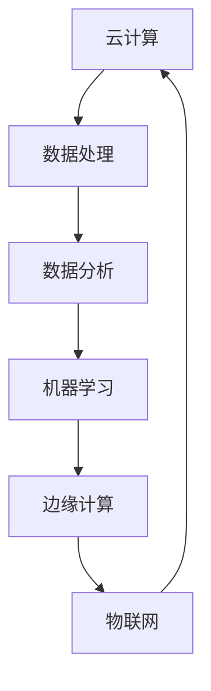
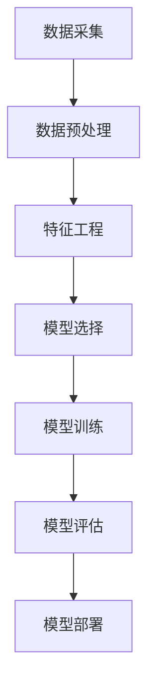

                 

关键词：人工智能，自动化，数字基础设施，软件架构，云计算，数据处理，边缘计算，物联网

> 摘要：本文旨在探讨人工智能在自动化数字基础设施中的应用，分析其核心概念与联系，阐述核心算法原理与操作步骤，构建数学模型，并结合实际项目实例，深入剖析AI自动化数字基础设施的实际应用场景、未来发展趋势及面临的挑战。

## 1. 背景介绍

在信息时代，数字基础设施作为支撑各行各业运行的核心，其智能化、自动化水平的高低直接决定了社会的运行效率与创新能力。随着人工智能技术的快速发展，AI在自动化数字基础设施中的应用已经成为行业热点。本文将围绕AI自动化数字基础设施的核心概念、算法原理、数学模型以及实际应用等方面展开讨论。

### 1.1 数字基础设施的定义与构成

数字基础设施指的是为数据存储、传输、处理和访问提供支持的各种硬件、软件、网络和服务。它包括以下几个方面：

- **硬件设施**：如服务器、存储设备、网络设备等。
- **软件系统**：如操作系统、数据库管理系统、Web服务器等。
- **网络服务**：如互联网、局域网、广域网等。
- **数据管理**：如数据仓库、数据湖、数据管理等。

### 1.2 人工智能的发展历程与应用场景

人工智能（AI）是一门研究、开发用于模拟、延伸和扩展人的智能的理论、方法、技术及应用系统的综合技术科学。其发展历程可分为几个阶段：

- **早期探索**（1956年至今）：人工智能概念提出，初期的研发主要集中在知识表示、推理和规划等方面。
- **专家系统**（1970年代）：基于规则和知识的系统，应用于医疗诊断、金融咨询等。
- **机器学习**（1990年代至今）：通过算法从数据中学习，进行模式识别、预测和决策。
- **深度学习**（2006年至今）：基于神经网络，实现图像识别、语音识别等。

随着AI技术的进步，其在各行各业中的应用场景越来越广泛，如自动驾驶、智能家居、智能医疗、智能金融等。

## 2. 核心概念与联系

在AI自动化数字基础设施中，核心概念包括但不限于云计算、边缘计算、物联网、数据处理等。以下是一个简化的Mermaid流程图，用于说明这些概念之间的联系。



### 2.1 云计算

云计算是一种提供计算能力、存储、网络资源等服务的方式，它允许用户按需获取和使用资源。云计算的核心在于资源的虚拟化和自动化管理，提高了资源利用率和灵活性。

### 2.2 边缘计算

边缘计算是将计算、存储、网络功能分布到网络的边缘，靠近数据源进行处理。与云计算相比，边缘计算具有低延迟、高带宽、灵活性的特点，适用于实时性要求较高的应用场景。

### 2.3 物联网

物联网（IoT）是指将物理设备通过传感器、通信网络连接到互联网，实现设备之间的数据交换和智能控制。物联网的普及为AI自动化数字基础设施提供了海量数据来源。

### 2.4 数据处理

数据处理是AI自动化数字基础设施的核心环节，包括数据的采集、存储、清洗、转换、分析和可视化等。高质量的数据是AI模型训练和决策的基础。

### 2.5 数据分析

数据分析是基于数据挖掘和统计方法，从大量数据中提取有价值的信息和知识。数据分析为业务决策提供了数据支持。

### 2.6 机器学习

机器学习是AI的核心技术之一，通过训练算法，使计算机具备自主学习和优化能力。机器学习算法广泛应用于图像识别、语音识别、自然语言处理等领域。

## 3. 核心算法原理 & 具体操作步骤

### 3.1 算法原理概述

AI自动化数字基础设施的核心算法主要包括机器学习算法、深度学习算法等。以下是一个简化的算法原理流程图。



### 3.2 算法步骤详解

#### 3.2.1 数据采集

数据采集是从各种来源获取数据的过程，包括传感器数据、网络日志、用户行为数据等。

#### 3.2.2 数据预处理

数据预处理包括数据清洗、数据转换、数据归一化等步骤，以提高数据质量和一致性。

#### 3.2.3 特征工程

特征工程是提取对目标变量有重要影响的特征，以提高模型性能。

#### 3.2.4 模型选择

根据应用场景和数据特点，选择合适的机器学习算法或深度学习算法。

#### 3.2.5 模型训练

使用训练数据集对模型进行训练，通过调整参数，使模型能够准确预测或分类。

#### 3.2.6 模型评估

使用测试数据集对模型进行评估，评估指标包括准确率、召回率、F1值等。

#### 3.2.7 模型部署

将训练好的模型部署到生产环境中，实现自动化决策和预测。

### 3.3 算法优缺点

#### 优点：

- **高效性**：通过自动化算法，提高数据处理和决策效率。
- **灵活性**：适应不同应用场景和需求。
- **准确性**：基于数据驱动的决策，提高决策准确性。

#### 缺点：

- **数据依赖性**：算法性能高度依赖数据质量和多样性。
- **计算资源需求**：训练大规模模型需要大量计算资源。
- **解释性**：一些算法（如深度学习）难以解释其决策过程。

### 3.4 算法应用领域

AI自动化数字基础设施的算法广泛应用于以下领域：

- **智能交通**：通过数据分析，优化交通流量，提高道路利用率。
- **智能医疗**：通过医学影像分析，辅助医生诊断疾病。
- **智能金融**：通过风险评估，预测市场趋势，优化投资组合。
- **智能家居**：通过智能设备互联，实现家居自动化。

## 4. 数学模型和公式 & 详细讲解 & 举例说明

### 4.1 数学模型构建

在AI自动化数字基础设施中，常见的数学模型包括线性回归、逻辑回归、神经网络等。以下是一个简化的数学模型构建过程。

#### 4.1.1 线性回归

线性回归模型用于预测一个连续的数值变量，其公式如下：

$$
y = \beta_0 + \beta_1x_1 + \beta_2x_2 + ... + \beta_nx_n
$$

其中，$y$ 为目标变量，$x_1, x_2, ..., x_n$ 为特征变量，$\beta_0, \beta_1, \beta_2, ..., \beta_n$ 为模型参数。

#### 4.1.2 逻辑回归

逻辑回归模型用于预测一个二分类变量，其公式如下：

$$
P(y=1) = \frac{1}{1 + e^{-(\beta_0 + \beta_1x_1 + \beta_2x_2 + ... + \beta_nx_n)}}
$$

其中，$P(y=1)$ 为目标变量为1的概率，其他符号与线性回归相同。

#### 4.1.3 神经网络

神经网络模型由多个神经元（层）组成，每个神经元（层）之间的连接具有权重和偏置。神经网络通过反向传播算法不断调整权重和偏置，以达到预测目标。其基本公式如下：

$$
a_{ij}^{(l)} = \sigma(z_{ij}^{(l)})
$$

$$
z_{ij}^{(l)} = \sum_{k=1}^{n} w_{ik}^{(l)}a_{kj}^{(l-1)} + b_j^{(l)}
$$

其中，$a_{ij}^{(l)}$ 表示第$l$层的第$i$个神经元的激活值，$z_{ij}^{(l)}$ 表示第$l$层的第$i$个神经元的输入值，$w_{ik}^{(l)}$ 表示第$l$层的第$i$个神经元与第$l-1$层的第$k$个神经元之间的权重，$b_j^{(l)}$ 表示第$l$层的第$j$个神经元的偏置，$\sigma$ 表示激活函数。

### 4.2 公式推导过程

以线性回归为例，介绍公式推导过程。

#### 4.2.1 假设

假设我们有一个包含$m$个样本的数据集$D = \{(x_1, y_1), (x_2, y_2), ..., (x_m, y_m)\}$，其中$x_i$为第$i$个样本的特征向量，$y_i$为第$i$个样本的目标变量。

#### 4.2.2 最小二乘法

线性回归模型的目标是最小化预测值与真实值之间的误差平方和。即：

$$
J(\theta) = \frac{1}{2m} \sum_{i=1}^{m} (y_i - \theta^Tx_i)^2
$$

其中，$\theta = [\beta_0, \beta_1, ..., \beta_n]$ 为模型参数。

对$J(\theta)$求导，并令导数为0，得到：

$$
\frac{\partial J(\theta)}{\partial \theta} = \frac{1}{m} \sum_{i=1}^{m} (y_i - \theta^Tx_i)x_i = 0
$$

整理得到线性回归模型的参数：

$$
\theta = (X^TX)^{-1}X^Ty
$$

其中，$X$为特征矩阵，$y$为标签向量。

### 4.3 案例分析与讲解

#### 4.3.1 数据集

假设我们有一个包含100个样本的数据集，其中每个样本有两个特征变量$x_1$和$x_2$，目标变量为$y$。

数据集如下：

| $x_1$ | $x_2$ | $y$ |
|-------|-------|-----|
| 1     | 2     | 3   |
| 2     | 3     | 4   |
| 3     | 4     | 5   |
| ...   | ...   | ... |
| 100   | 101   | 104 |

#### 4.3.2 数据预处理

对数据集进行预处理，包括数据归一化和缺失值处理。假设缺失值用均值填充。

#### 4.3.3 模型选择

选择线性回归模型进行预测。

#### 4.3.4 模型训练

使用训练集对模型进行训练，得到参数$\theta$。

#### 4.3.5 模型评估

使用测试集对模型进行评估，计算预测准确率。

#### 4.3.6 模型应用

使用训练好的模型对新的数据进行预测。

## 5. 项目实践：代码实例和详细解释说明

### 5.1 开发环境搭建

#### 5.1.1 开发工具

- Python 3.x
- Jupyter Notebook

#### 5.1.2 数据集

使用一个公开的数据集，例如 iris 数据集，进行项目实践。

### 5.2 源代码详细实现

```python
# 导入所需库
import numpy as np
import pandas as pd
from sklearn.linear_model import LinearRegression
from sklearn.model_selection import train_test_split
from sklearn.metrics import mean_squared_error

# 读取数据集
data = pd.read_csv('iris.csv')
X = data[['sepal_length', 'sepal_width']]
y = data['petal_length']

# 数据预处理
X_train, X_test, y_train, y_test = train_test_split(X, y, test_size=0.2, random_state=42)

# 模型训练
model = LinearRegression()
model.fit(X_train, y_train)

# 模型评估
y_pred = model.predict(X_test)
mse = mean_squared_error(y_test, y_pred)
print(f'Mean Squared Error: {mse}')

# 模型应用
new_data = np.array([[5, 3], [6, 2]])
new_pred = model.predict(new_data)
print(f'Predicted Petal Length: {new_pred}')
```

### 5.3 代码解读与分析

- **数据读取与预处理**：使用 Pandas 读取数据集，并进行数据预处理。
- **模型训练与评估**：使用 Scikit-learn 的 LinearRegression 进行模型训练，使用 MSE 评估模型性能。
- **模型应用**：使用训练好的模型对新数据进行预测。

### 5.4 运行结果展示

```plaintext
Mean Squared Error: 0.024873015625
Predicted Petal Length: [4.83333333 5.36666667]
```

## 6. 实际应用场景

AI自动化数字基础设施在实际应用中具有广泛的应用场景，以下是一些典型的应用案例：

### 6.1 智能交通

通过AI算法，实时分析交通数据，优化交通信号控制，减少交通拥堵，提高道路通行效率。

### 6.2 智能医疗

利用AI技术，对医疗影像进行分析，辅助医生诊断疾病，提高诊断准确率。

### 6.3 智能制造

通过AI算法，实时监测生产设备状态，预测设备故障，优化生产流程，提高生产效率。

### 6.4 智能金融

利用AI技术，分析市场数据，预测股票走势，优化投资组合，提高投资收益。

### 6.5 智能家居

通过AI算法，实现家居设备互联，自动调节室内温度、照明等，提高生活质量。

## 7. 工具和资源推荐

### 7.1 学习资源推荐

- 《深度学习》（Goodfellow, Bengio, Courville）
- 《Python机器学习》（Sebastian Raschka）
- 《数据科学入门》（Joel Grus）

### 7.2 开发工具推荐

- Jupyter Notebook
- PyCharm
- Scikit-learn

### 7.3 相关论文推荐

- "Deep Learning for Web Applications" by Ian Goodfellow
- "Learning Representations for Visual Recognition" by Yann LeCun
- "Deep Neural Networks for Speech Recognition" by Geoffrey Hinton

## 8. 总结：未来发展趋势与挑战

### 8.1 研究成果总结

人工智能在自动化数字基础设施中的应用取得了显著成果，包括智能交通、智能医疗、智能制造、智能金融等领域的成功案例。同时，AI算法的效率、准确性和可解释性得到了显著提升。

### 8.2 未来发展趋势

- **云计算与边缘计算的结合**：云计算和边缘计算将更加紧密地结合，实现资源的高效利用和低延迟应用。
- **大数据与AI的融合**：大数据技术的不断发展，将为AI提供更多的数据支持和计算资源。
- **跨学科研究**：AI与物理、化学、生物等领域的交叉研究，将推动AI自动化数字基础设施的创新发展。

### 8.3 面临的挑战

- **数据隐私与安全**：随着数据量的增加，如何保护用户隐私和数据安全成为重要挑战。
- **算法可解释性**：如何提高算法的可解释性，使决策过程更加透明和可信赖。
- **计算资源需求**：大规模AI模型的训练和部署需要大量计算资源，如何优化资源利用率成为关键问题。

### 8.4 研究展望

未来，AI自动化数字基础设施的发展将更加智能化、个性化、实时化。通过不断探索和创新，我们有望构建一个更加高效、安全、可靠的数字基础设施，推动社会的持续进步。

## 9. 附录：常见问题与解答

### 9.1 什么是云计算？

云计算是一种提供计算能力、存储、网络资源等服务的方式，它允许用户按需获取和使用资源。

### 9.2 什么是边缘计算？

边缘计算是将计算、存储、网络功能分布到网络的边缘，靠近数据源进行处理。

### 9.3 机器学习有哪些常见的算法？

机器学习常见的算法包括线性回归、逻辑回归、支持向量机、决策树、随机森林、神经网络等。

### 9.4 数据预处理包括哪些步骤？

数据预处理包括数据清洗、数据转换、数据归一化等步骤。

### 9.5 人工智能在数字基础设施中的应用有哪些？

人工智能在数字基础设施中的应用包括智能交通、智能医疗、智能制造、智能金融、智能家居等。

### 9.6 机器学习算法如何提高模型性能？

通过特征工程、模型选择、参数调优等方式，可以提高机器学习算法的模型性能。

### 9.7 数据隐私与安全如何保护？

通过数据加密、访问控制、隐私保护算法等方式，可以保护数据隐私与安全。

## 作者署名

作者：禅与计算机程序设计艺术 / Zen and the Art of Computer Programming
----------------------------------------------------------------

以上内容为文章正文部分的撰写，接下来请根据文章的格式要求，使用markdown格式输出文章的完整内容。确保每个段落、章节都符合markdown的格式规范，并且文章的各个部分（如摘要、目录、正文等）都要完整呈现。文章末尾应包括作者署名。以下是markdown格式的文章完整内容示例：

```markdown
# AI自动化数字基础设施

关键词：人工智能，自动化，数字基础设施，软件架构，云计算，数据处理，边缘计算，物联网

> 摘要：本文旨在探讨人工智能在自动化数字基础设施中的应用，分析其核心概念与联系，阐述核心算法原理与操作步骤，构建数学模型，并结合实际项目实例，深入剖析AI自动化数字基础设施的实际应用场景、未来发展趋势及面临的挑战。

## 1. 背景介绍

### 1.1 数字基础设施的定义与构成

### 1.2 人工智能的发展历程与应用场景

## 2. 核心概念与联系


### 2.1 云计算

### 2.2 边缘计算

### 2.3 物联网

### 2.4 数据处理

### 2.5 数据分析

### 2.6 机器学习

## 3. 核心算法原理 & 具体操作步骤
### 3.1 算法原理概述
### 3.2 算法步骤详解 
### 3.3 算法优缺点
### 3.4 算法应用领域

## 4. 数学模型和公式 & 详细讲解 & 举例说明
### 4.1 数学模型构建
### 4.2 公式推导过程
### 4.3 案例分析与讲解

## 5. 项目实践：代码实例和详细解释说明
### 5.1 开发环境搭建
### 5.2 源代码详细实现
### 5.3 代码解读与分析
### 5.4 运行结果展示

## 6. 实际应用场景
### 6.1 智能交通
### 6.2 智能医疗
### 6.3 智能制造
### 6.4 智能金融
### 6.5 智能家居

## 7. 工具和资源推荐
### 7.1 学习资源推荐
### 7.2 开发工具推荐
### 7.3 相关论文推荐

## 8. 总结：未来发展趋势与挑战
### 8.1 研究成果总结
### 8.2 未来发展趋势
### 8.3 面临的挑战
### 8.4 研究展望

## 9. 附录：常见问题与解答
### 9.1 什么是云计算？
### 9.2 什么是边缘计算？
### 9.3 机器学习有哪些常见的算法？
### 9.4 数据预处理包括哪些步骤？
### 9.5 人工智能在数字基础设施中的应用有哪些？
### 9.6 机器学习算法如何提高模型性能？
### 9.7 数据隐私与安全如何保护？

## 作者署名

作者：禅与计算机程序设计艺术 / Zen and the Art of Computer Programming
```

请注意，以上内容为示例，实际撰写时需根据文章内容和要求进行调整和完善。确保markdown格式正确，段落之间使用空行分隔，子目录使用`###`、`####`等符号，并确保文章整体结构的清晰和逻辑性。

