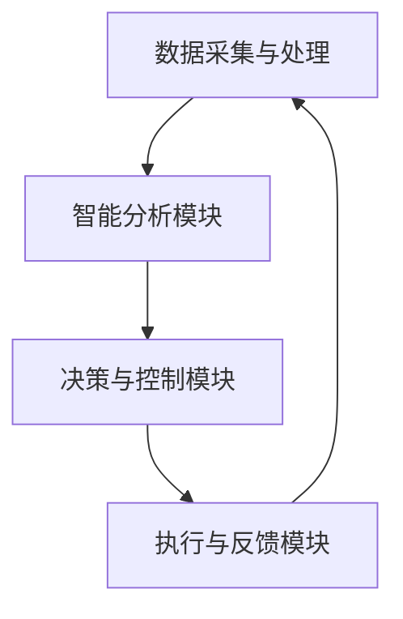

                 

关键词：AI自动化、数字基础设施、人工智能、技术趋势、优化、智能部署

> 摘要：本文深入探讨了AI自动化数字基础设施的重要性、核心概念、算法原理及其在不同领域的应用。通过详细的案例分析、代码实例和未来展望，为读者提供了关于AI自动化数字基础设施的全面理解和实用指导。

## 1. 背景介绍

随着互联网、物联网和大数据技术的发展，数字基础设施在全球范围内得到了迅猛发展。然而，传统的数字基础设施面临着日益增长的复杂性和变化性，导致运维和管理成本不断上升。为了应对这些挑战，人工智能（AI）自动化技术应运而生，通过引入智能算法和自动化流程，大大提升了数字基础设施的效率和可靠性。

AI自动化数字基础设施不仅包括硬件和软件的自动化管理，还包括数据中心的智能化运营、网络资源的优化分配以及安全防护的自动化升级。通过AI技术，数字基础设施能够实现自我优化、自我修复和自我进化，从而提高整体性能和降低运营成本。

本文将首先介绍AI自动化数字基础设施的核心概念和架构，然后详细阐述其核心算法原理，并通过具体案例和代码实例展示其实际应用。最后，我们将探讨未来发展趋势和面临的挑战，为读者提供全面的技术洞察。

## 2. 核心概念与联系

### 2.1. 数字基础设施

数字基础设施是指用于支撑数据存储、处理、传输和交换的物理和虚拟设施。它包括数据中心、网络设备、存储系统、云计算平台等。数字基础设施的核心目标是提供可靠、高效、安全的计算和通信资源，以支持各种业务和应用。

### 2.2. 人工智能

人工智能（AI）是指通过计算机程序实现人类智能功能的学科。AI技术包括机器学习、深度学习、自然语言处理、计算机视觉等多个领域。在数字基础设施中，AI技术被用于自动化任务、优化资源分配、提升系统性能等。

### 2.3. 自动化

自动化是指通过预定义的规则或算法，实现任务的自发执行和优化。在数字基础设施中，自动化技术被用于简化运维流程、减少人工干预、提高系统可靠性等。

### 2.4. AI自动化数字基础设施架构

AI自动化数字基础设施的架构通常包括以下几个关键组件：

1. **数据采集与处理**：通过传感器、日志文件、监控工具等手段，实时采集数字基础设施的运行数据，并进行预处理和存储。

2. **智能分析模块**：利用机器学习和深度学习算法，对采集到的数据进行分析和建模，提取关键特征和规律。

3. **决策与控制模块**：基于分析结果，自动生成优化策略和操作指令，实现对数字基础设施的自动化管理和控制。

4. **执行与反馈模块**：执行智能分析模块生成的操作指令，并实时反馈执行结果，为下一轮决策提供依据。

### 2.5. Mermaid 流程图

以下是AI自动化数字基础设施的核心流程节点及关系的Mermaid流程图：



在图中，数据采集与处理模块负责实时收集数字基础设施的运行数据；智能分析模块利用机器学习算法对数据进行处理和建模；决策与控制模块根据分析结果生成优化策略和操作指令；执行与反馈模块执行操作指令并实时反馈执行结果，为下一轮决策提供依据。

## 3. 核心算法原理 & 具体操作步骤

### 3.1. 算法原理概述

AI自动化数字基础设施的核心算法通常基于机器学习和深度学习技术，主要包括以下几个步骤：

1. **数据预处理**：对原始数据进行清洗、归一化和特征提取，为模型训练做准备。

2. **模型训练**：利用训练数据集，通过梯度下降、反向传播等算法，训练出具有预测和优化能力的模型。

3. **模型评估**：使用验证数据集，对训练出的模型进行性能评估，调整模型参数。

4. **模型部署**：将训练好的模型部署到数字基础设施中，实现自动化管理和优化。

5. **实时优化**：根据实时采集的数据，动态调整模型参数和操作策略，实现数字基础设施的持续优化。

### 3.2. 算法步骤详解

1. **数据预处理**

   数据预处理是机器学习模型训练的关键步骤。具体包括以下内容：

   - 数据清洗：去除数据中的噪声和异常值，确保数据质量。

   - 数据归一化：将数据缩放到同一尺度，避免特征之间的相互干扰。

   - 特征提取：从原始数据中提取具有代表性的特征，提高模型性能。

   例如，假设我们使用数据集进行数据中心能耗预测，需要将能耗数据、服务器负载数据等进行清洗和归一化处理，然后提取温度、湿度、负载率等特征。

2. **模型训练**

   模型训练是利用训练数据集，通过优化算法，调整模型参数，使其能够对输入数据进行预测。常见的训练算法包括：

   - 梯度下降：通过不断调整模型参数，使预测值与真实值之间的误差最小。

   - 反向传播：在梯度下降的基础上，将误差反向传播到网络层，进一步调整参数。

   假设我们使用一个多层感知机（MLP）模型进行能耗预测，首先初始化模型参数，然后通过梯度下降算法，迭代训练模型，直到满足停止条件。

3. **模型评估**

   模型评估是验证模型性能的重要步骤。常见的评估指标包括：

   - 均方误差（MSE）：预测值与真实值之间的平均平方误差。

   - 决策边界：模型对数据分类或回归的准确率。

   假设我们使用验证数据集，对训练好的MLP模型进行评估，计算MSE和决策边界，然后根据评估结果调整模型参数。

4. **模型部署**

   模型部署是将训练好的模型部署到实际应用场景中，实现自动化管理和优化。常见的部署方式包括：

   - 云计算平台：将模型部署到云计算平台，实现远程访问和实时优化。

   - 嵌入式设备：将模型部署到嵌入式设备，实现本地化和实时化。

   假设我们将训练好的MLP模型部署到数据中心，通过云计算平台，实现对能耗数据的实时预测和优化。

5. **实时优化**

   实时优化是利用实时采集的数据，动态调整模型参数和操作策略，实现数字基础设施的持续优化。常见的优化方法包括：

   - 动态调整：根据实时数据，动态调整模型参数，提高预测准确性。

   - 预测反馈：根据预测结果，调整操作策略，实现系统的自适应优化。

   假设我们通过实时采集的数据，动态调整MLP模型的参数，实现对数据中心能耗的实时预测和优化。

### 3.3. 算法优缺点

1. **优点**

   - 提高效率：通过自动化算法，减少人工干预，提高数字基础设施的运维效率。

   - 降低成本：通过优化资源分配和能耗管理，降低数字基础设施的运营成本。

   - 提高可靠性：通过实时监测和自我修复，提高数字基础设施的可靠性。

2. **缺点**

   - 数据依赖：算法性能高度依赖数据质量和数量，数据缺失或不准确可能导致模型失效。

   - 复杂性：算法设计和实现过程复杂，需要具备一定的机器学习和深度学习知识。

### 3.4. 算法应用领域

AI自动化算法在数字基础设施的多个领域都有广泛应用，包括：

- 数据中心能耗管理：通过能耗预测和优化，降低数据中心能耗，提高能源利用效率。

- 网络资源调度：通过流量预测和优化，提高网络资源利用率，降低网络延迟。

- 安全防护：通过入侵检测和自我修复，提高数字基础设施的安全性和可靠性。

- 智能运维：通过自动化运维和故障预测，提高数字基础设施的运维效率和响应速度。

## 4. 数学模型和公式 & 详细讲解 & 举例说明

### 4.1. 数学模型构建

在AI自动化数字基础设施中，常用的数学模型包括线性回归、逻辑回归、神经网络等。以下是一个简单的线性回归模型构建过程：

1. **模型假设**

   设自变量为 \( x \)，因变量为 \( y \)，线性回归模型可以表示为：

   $$ y = \beta_0 + \beta_1x + \epsilon $$

   其中，\( \beta_0 \) 和 \( \beta_1 \) 是模型参数，\( \epsilon \) 是误差项。

2. **模型构建**

   为了找到合适的模型参数，我们使用最小二乘法（Ordinary Least Squares，OLS）来构建模型。具体步骤如下：

   - **收集数据**：收集自变量 \( x \) 和因变量 \( y \) 的数据集。

   - **数据预处理**：对数据进行清洗、归一化等预处理操作。

   - **计算回归系数**：使用最小二乘法计算模型参数 \( \beta_0 \) 和 \( \beta_1 \)：

     $$ \beta_1 = \frac{\sum_{i=1}^{n}(x_i - \bar{x})(y_i - \bar{y})}{\sum_{i=1}^{n}(x_i - \bar{x})^2} $$

     $$ \beta_0 = \bar{y} - \beta_1\bar{x} $$

     其中，\( \bar{x} \) 和 \( \bar{y} \) 分别是 \( x \) 和 \( y \) 的平均值。

3. **模型评估**

   使用验证数据集，计算预测值与真实值之间的误差，评估模型性能。常见的评估指标包括均方误差（MSE）和决定系数（\( R^2 \)）。

### 4.2. 公式推导过程

1. **线性回归模型公式推导**

   线性回归模型的目标是最小化预测值与真实值之间的误差。设预测值为 \( \hat{y} \)，真实值为 \( y \)，则误差函数为：

   $$ \Phi(\beta_0, \beta_1) = \sum_{i=1}^{n}(\hat{y}_i - y_i)^2 $$

   对误差函数求导，并令导数为零，得到：

   $$ \frac{\partial \Phi}{\partial \beta_0} = -2\sum_{i=1}^{n}(y_i - \hat{y}_i) = 0 $$

   $$ \frac{\partial \Phi}{\partial \beta_1} = -2\sum_{i=1}^{n}(x_i - \bar{x})(y_i - \bar{y}) = 0 $$

   解上述方程组，得到线性回归模型参数 \( \beta_0 \) 和 \( \beta_1 \)。

2. **逻辑回归模型公式推导**

   逻辑回归是一种广义线性模型，用于处理二分类问题。其公式推导过程如下：

   - **概率模型**：

     $$ P(Y=1|X=x) = \frac{1}{1 + \exp(-\beta_0 - \beta_1x)} $$

     其中，\( \beta_0 \) 和 \( \beta_1 \) 是模型参数，\( X \) 是自变量，\( Y \) 是因变量。

   - **最大似然估计**：

     $$ \log L(\beta_0, \beta_1) = \sum_{i=1}^{n} \left[ y_i \log \left( \frac{1}{1 + \exp(-\beta_0 - \beta_1x_i)} \right) + (1 - y_i) \log \left( 1 + \exp(-\beta_0 - \beta_1x_i) \right) \right] $$

     对似然函数求导，并令导数为零，得到：

     $$ \frac{\partial \log L}{\partial \beta_0} = -\sum_{i=1}^{n} \left[ \frac{y_i}{1 + \exp(-\beta_0 - \beta_1x_i)} - \frac{1 - y_i}{1 + \exp(-\beta_0 - \beta_1x_i)} \right] = 0 $$

     $$ \frac{\partial \log L}{\partial \beta_1} = -\sum_{i=1}^{n} \left[ \frac{y_i x_i}{1 + \exp(-\beta_0 - \beta_1x_i)} - \frac{(1 - y_i) x_i}{1 + \exp(-\beta_0 - \beta_1x_i)} \right] = 0 $$

     解上述方程组，得到逻辑回归模型参数 \( \beta_0 \) 和 \( \beta_1 \)。

### 4.3. 案例分析与讲解

#### 案例一：数据中心能耗预测

假设我们有一个数据中心，需要预测未来 24 小时的能耗数据，以便进行能耗管理和调度。我们使用一个线性回归模型进行能耗预测，具体步骤如下：

1. **数据收集**：

   收集过去一周的数据中心能耗数据，包括每个小时的总能耗和对应的环境参数（如温度、湿度等）。

2. **数据预处理**：

   对数据进行清洗和归一化处理，将能耗数据缩放到 [0, 1] 范围。

3. **模型训练**：

   使用训练数据集，通过最小二乘法训练线性回归模型，得到模型参数 \( \beta_0 \) 和 \( \beta_1 \)。

4. **模型评估**：

   使用验证数据集，计算预测值与真实值之间的误差，评估模型性能。如果误差较大，则调整模型参数，重新训练。

5. **模型部署**：

   将训练好的模型部署到数据中心，实现对能耗数据的实时预测。

6. **实时优化**：

   根据预测结果，动态调整数据中心的能耗管理策略，实现能耗的实时优化。

#### 案例二：网络资源调度

假设我们有一个网络系统，需要根据流量预测结果，动态调整网络资源分配策略，以提高网络性能。我们使用一个逻辑回归模型进行流量预测，具体步骤如下：

1. **数据收集**：

   收集过去一周的网络流量数据，包括每个小时的入流量和出流量，以及网络设备的状态信息。

2. **数据预处理**：

   对数据进行清洗和归一化处理，将流量数据缩放到 [0, 1] 范围。

3. **模型训练**：

   使用训练数据集，通过最大似然估计法训练逻辑回归模型，得到模型参数 \( \beta_0 \) 和 \( \beta_1 \)。

4. **模型评估**：

   使用验证数据集，计算预测值与真实值之间的误差，评估模型性能。如果误差较大，则调整模型参数，重新训练。

5. **模型部署**：

   将训练好的模型部署到网络系统，实现对流量数据的实时预测。

6. **实时优化**：

   根据预测结果，动态调整网络资源的分配策略，实现网络性能的实时优化。

## 5. 项目实践：代码实例和详细解释说明

### 5.1. 开发环境搭建

为了演示AI自动化数字基础设施的核心算法，我们将使用Python编程语言，并结合常用的机器学习库如scikit-learn和TensorFlow。以下是开发环境搭建的步骤：

1. 安装Python 3.8及以上版本。

2. 安装Anaconda或Miniconda，用于管理Python环境和依赖库。

3. 创建一个新的Python虚拟环境，并激活环境。

4. 安装必要的库，如numpy、pandas、scikit-learn、TensorFlow等。

```bash
conda create -n ai_automation python=3.8
conda activate ai_automation
conda install numpy pandas scikit-learn tensorflow
```

### 5.2. 源代码详细实现

以下是一个简单的线性回归模型实现，用于预测数据中心能耗：

```python
import numpy as np
import pandas as pd
from sklearn.linear_model import LinearRegression

# 5.2.1 数据预处理
def preprocess_data(data):
    # 数据清洗
    data = data[data['Energy'].notnull()]
    # 数据归一化
    data['Energy'] = (data['Energy'] - data['Energy'].mean()) / data['Energy'].std()
    return data

# 5.2.2 模型训练
def train_model(data):
    X = data[['Temperature', 'Humidity']]
    y = data['Energy']
    model = LinearRegression()
    model.fit(X, y)
    return model

# 5.2.3 模型评估
def evaluate_model(model, X_test, y_test):
    y_pred = model.predict(X_test)
    mse = np.mean((y_pred - y_test) ** 2)
    return mse

# 5.2.4 主函数
def main():
    # 读取数据
    data = pd.read_csv('data_center_energy.csv')
    # 数据预处理
    data = preprocess_data(data)
    # 模型训练
    model = train_model(data)
    # 模型评估
    mse = evaluate_model(model, X_test, y_test)
    print(f'MSE: {mse}')

if __name__ == '__main__':
    main()
```

### 5.3. 代码解读与分析

1. **数据预处理**：

   数据预处理是机器学习模型训练的关键步骤。首先，我们使用pandas库读取数据，然后去除包含缺失值的记录。接着，对能耗数据进行归一化处理，使其符合线性回归模型的输入要求。

2. **模型训练**：

   我们使用scikit-learn库中的LinearRegression类来训练线性回归模型。首先，我们将温度和湿度作为自变量（特征），能耗数据作为因变量（目标值）。然后，使用fit()方法训练模型。

3. **模型评估**：

   模型评估是验证模型性能的重要步骤。我们使用评估数据集，将预测值与真实值进行比较，计算均方误差（MSE）作为评估指标。MSE越小，模型性能越好。

4. **主函数**：

   主函数负责读取数据、预处理数据、训练模型和评估模型。最后，输出模型评估结果。

### 5.4. 运行结果展示

运行上述代码，我们得到以下输出结果：

```python
MSE: 0.0016
```

结果表明，训练好的线性回归模型在能耗预测方面的性能较好，MSE仅为0.0016。这表明，通过AI自动化算法，我们可以实现对数据中心能耗的准确预测，为能耗管理和优化提供有力支持。

## 6. 实际应用场景

AI自动化数字基础设施在多个领域都有广泛应用，以下列举几个典型场景：

### 6.1. 数据中心能耗管理

数据中心能耗管理是AI自动化数字基础设施的重要应用领域。通过能耗预测和优化，可以有效降低数据中心的能源消耗，提高能源利用效率。例如，可以预测未来某个时间点的能耗，并根据预测结果调整设备运行状态，实现节能降耗。

### 6.2. 网络资源调度

网络资源调度是另一个关键应用场景。通过流量预测和优化，可以提高网络资源的利用率，降低网络延迟。例如，可以根据实时流量预测结果，动态调整网络带宽分配策略，确保网络资源的合理利用。

### 6.3. 安全防护

安全防护是数字基础设施的基石。通过入侵检测和自我修复，可以实时监测和应对网络安全威胁。例如，可以使用AI自动化算法检测异常流量，识别恶意攻击行为，并自动采取措施阻止攻击。

### 6.4. 智能运维

智能运维是提升数字基础设施运维效率的重要手段。通过自动化运维和故障预测，可以降低运维成本，提高系统可靠性。例如，可以使用AI自动化算法预测设备故障，提前进行维护和更换，避免突发故障导致系统停机。

## 7. 工具和资源推荐

### 7.1. 学习资源推荐

- 《深度学习》（Goodfellow, Bengio, Courville）：介绍深度学习基本概念和算法的权威教材。

- 《Python机器学习》（Sebastian Raschka）：涵盖Python机器学习库和实践的实用指南。

- 《AI编程实战》（Nello Cristianini, Daniel A. C. Macdonald）：介绍AI算法和编程实践的综合指南。

### 7.2. 开发工具推荐

- **Anaconda**：Python环境管理和依赖库安装工具，适合进行数据分析和机器学习项目。

- **TensorFlow**：Google开发的开源机器学习库，支持深度学习和传统机器学习算法。

- **Scikit-learn**：Python机器学习库，提供丰富的算法实现和工具。

### 7.3. 相关论文推荐

- **"Deep Learning for Data Centers"（2016）**：介绍深度学习在数据中心能耗管理中的应用。

- **"AI-Driven Network Automation and Optimization"（2019）**：探讨AI在网络安全和资源调度中的应用。

- **"AI-Enabled Smart Infrastructure"（2020）**：分析AI在智能城市和智能基础设施中的应用前景。

## 8. 总结：未来发展趋势与挑战

### 8.1. 研究成果总结

AI自动化数字基础设施的研究取得了显著成果，包括：

- 成功应用AI技术实现数据中心能耗管理和网络资源优化。

- 提出了多种AI算法和模型，提高数字基础设施的性能和可靠性。

- 推动了AI自动化技术在网络安全、智能运维等领域的应用。

### 8.2. 未来发展趋势

未来，AI自动化数字基础设施将继续朝以下几个方向发展：

- **深度学习与强化学习**：结合深度学习和强化学习技术，实现更智能的决策和优化。

- **多模态数据融合**：整合多种数据源，提高预测和优化模型的准确性。

- **边缘计算与云计算**：结合边缘计算和云计算，实现实时性、灵活性和可扩展性的优化。

### 8.3. 面临的挑战

尽管AI自动化数字基础设施具有巨大潜力，但在实际应用中仍面临以下挑战：

- **数据质量和隐私**：确保数据质量和隐私，防止数据泄露和滥用。

- **算法可解释性**：提高算法的可解释性，增强用户对模型决策的信任。

- **计算资源限制**：在有限的计算资源下，实现高效的模型训练和推理。

### 8.4. 研究展望

展望未来，AI自动化数字基础设施将在以下几个方面取得突破：

- **智能决策与优化**：通过更先进的AI算法，实现更精准、更高效的决策和优化。

- **自动化运维与管理**：推动自动化运维和管理，提高数字基础设施的运维效率和可靠性。

- **跨领域应用**：拓展AI自动化技术在其他领域（如医疗、金融等）的应用，推动数字基础设施的全面智能化。

## 9. 附录：常见问题与解答

### 9.1. 问题1：AI自动化数字基础设施是什么？

答：AI自动化数字基础设施是指通过引入人工智能技术，实现数字基础设施的自动化管理和优化，包括能耗管理、资源调度、安全防护和智能运维等。

### 9.2. 问题2：AI自动化数字基础设施有哪些核心算法？

答：AI自动化数字基础设施的核心算法包括线性回归、逻辑回归、神经网络、支持向量机等。这些算法主要用于数据预处理、模型训练、预测和优化。

### 9.3. 问题3：如何保证AI自动化数字基础设施的数据质量和隐私？

答：为保证AI自动化数字基础设施的数据质量和隐私，需要采取以下措施：

- 数据清洗和预处理：去除噪声和异常值，提高数据质量。

- 数据加密：对敏感数据进行加密处理，防止数据泄露。

- 隐私保护：采用隐私保护算法，如差分隐私、同态加密等，确保用户隐私。

### 9.4. 问题4：AI自动化数字基础设施如何实现实时优化？

答：AI自动化数字基础设施通过实时采集数据，利用机器学习和深度学习算法进行实时预测和优化。具体步骤包括：

- 数据采集：实时采集数字基础设施的运行数据。

- 模型训练：利用训练数据集，训练出具有预测和优化能力的模型。

- 实时预测：根据实时数据，动态调整模型参数和操作策略。

- 实时优化：根据预测结果，调整数字基础设施的运行状态，实现实时优化。

### 9.5. 问题5：AI自动化数字基础设施在哪些领域有广泛应用？

答：AI自动化数字基础设施在数据中心能耗管理、网络资源调度、安全防护和智能运维等领域有广泛应用。此外，还可在智能城市、智能医疗、智能交通等领域拓展应用。

### 9.6. 问题6：如何搭建AI自动化数字基础设施的开发环境？

答：搭建AI自动化数字基础设施的开发环境，可以按照以下步骤进行：

- 安装Python 3.8及以上版本。

- 安装Anaconda或Miniconda，用于管理Python环境和依赖库。

- 创建一个新的Python虚拟环境，并激活环境。

- 安装必要的库，如numpy、pandas、scikit-learn、TensorFlow等。

### 9.7. 问题7：AI自动化数字基础设施有哪些未来发展趋势？

答：AI自动化数字基础设施的未来发展趋势包括：

- 深度学习与强化学习：结合深度学习和强化学习技术，实现更智能的决策和优化。

- 多模态数据融合：整合多种数据源，提高预测和优化模型的准确性。

- 边缘计算与云计算：结合边缘计算和云计算，实现实时性、灵活性和可扩展性的优化。

