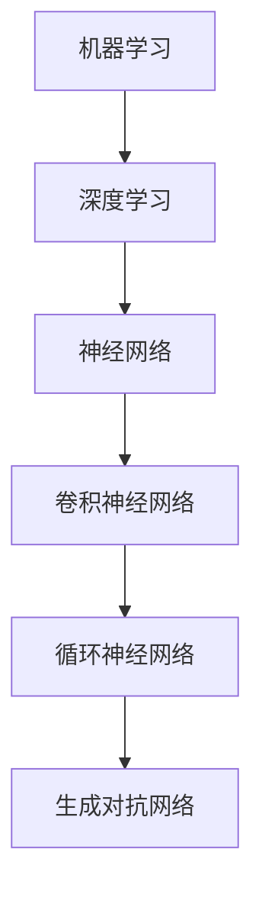
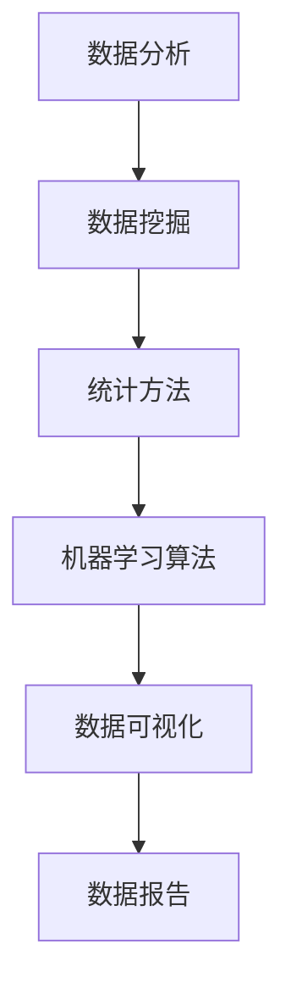
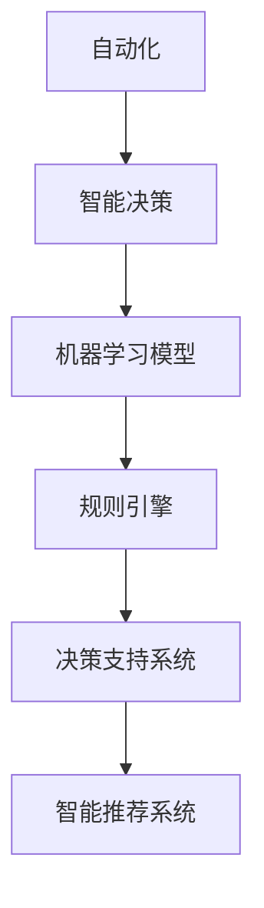

                 

关键词：人工智能、商业价值、长期影响、技术发展、算法原理、应用场景、未来展望

## 摘要

人工智能（AI）作为当今科技领域的璀璨明珠，已经在各行各业中展现出强大的潜力。然而，AI的发展并非仅仅是技术层面的突破，更是在商业应用中寻求长期的、可持续的影响。本文将深入探讨AI行业的未来趋势，强调其商业价值，并提出如何让AI真正为企业和个人创造长期的影响。

## 1. 背景介绍

人工智能的概念起源于20世纪50年代，当时计算机科学家们开始探索是否能够创造具有智能行为的机器。随着计算能力的提升和算法的进步，AI技术取得了显著的进展。如今，AI已经渗透到我们的日常生活和工作中，从智能助手到自动驾驶汽车，从金融风控到医疗诊断，AI的应用无处不在。

然而，尽管AI技术已经取得了很多成就，但其在商业应用中的价值仍然有待进一步挖掘。许多企业在尝试引入AI技术时，往往只关注短期效果，而忽略了长期价值的实现。本文将探讨如何使AI技术回归商业价值，从而为企业带来持久的竞争优势。

### 1.1 人工智能的历史与发展

人工智能的发展可以分为几个主要阶段。从最初的符号主义（Symbolic AI）到基于规则的系统，再到连接主义（Connectionist AI）和强化学习（Reinforcement Learning），每一次突破都为AI技术注入了新的活力。如今，深度学习和大数据分析等先进技术的出现，使得AI在图像识别、自然语言处理和智能决策等领域取得了飞跃性的进展。

### 1.2 商业应用现状与挑战

在商业应用中，AI技术的应用已经相当广泛。例如，零售业利用AI进行商品推荐，金融服务使用AI进行风险评估，制造业利用AI实现智能化生产等。然而，这些应用往往集中在提高效率、降低成本等短期目标上，缺乏对长期价值的深入挖掘。此外，AI技术在商业应用中还存在一些挑战，如数据隐私、算法偏见和监管等问题，这些都需要我们认真对待。

## 2. 核心概念与联系

为了更好地理解AI行业的未来，我们需要了解一些核心概念，并探讨它们之间的联系。以下是AI行业中的几个重要概念及其之间的关系：

### 2.1 机器学习与深度学习

机器学习（Machine Learning，ML）是指通过数据驱动的方法，使计算机能够从经验中学习并做出决策。深度学习（Deep Learning，DL）是机器学习的一个分支，通过构建多层神经网络来模拟人脑的思维方式。



### 2.2 数据分析与数据挖掘

数据分析（Data Analysis）是指使用统计和数学方法来解读数据，从中提取有价值的信息。数据挖掘（Data Mining）是数据分析的一个应用，旨在从大量数据中发现隐藏的模式和趋势。



### 2.3 自动化与智能决策

自动化（Automation）是指通过计算机技术来替代人类完成重复性的工作。智能决策（Intelligent Decision Making）是指利用AI技术来辅助人类做出更加明智的决策。



## 3. 核心算法原理 & 具体操作步骤

### 3.1 算法原理概述

在AI技术中，核心算法的原理至关重要。以下是一些常见的核心算法及其原理：

### 3.1.1 卷积神经网络（CNN）

卷积神经网络（Convolutional Neural Network，CNN）是一种专门用于图像识别的神经网络。其基本原理是通过卷积层、池化层和全连接层等结构来提取图像特征。

### 3.1.2 递归神经网络（RNN）

递归神经网络（Recurrent Neural Network，RNN）是一种用于处理序列数据的神经网络。其基本原理是通过隐藏状态来记忆序列中的信息，并在每个时间步上更新状态。

### 3.1.3 强化学习（Reinforcement Learning）

强化学习（Reinforcement Learning，RL）是一种通过奖励机制来训练智能体进行决策的算法。其基本原理是智能体通过不断尝试和反馈来学习最优策略。

### 3.2 算法步骤详解

以下是这些算法的具体操作步骤：

### 3.2.1 卷积神经网络（CNN）

1. 输入层：接收图像数据。
2. 卷积层：通过卷积操作提取图像特征。
3. 池化层：对特征进行下采样，减少数据维度。
4. 全连接层：对提取的特征进行分类。

### 3.2.2 递归神经网络（RNN）

1. 输入层：接收序列数据。
2. 隐藏层：通过递归操作更新隐藏状态。
3. 输出层：输出预测结果。

### 3.2.3 强化学习（RL）

1. 初始化智能体和环境。
2. 智能体进行动作选择。
3. 环境对动作进行反馈。
4. 智能体根据反馈更新策略。

### 3.3 算法优缺点

每种算法都有其独特的优缺点：

- CNN：适合处理图像数据，但难以处理序列数据。
- RNN：适合处理序列数据，但容易产生梯度消失或爆炸问题。
- RL：能够处理复杂的环境，但训练过程可能较慢。

### 3.4 算法应用领域

这些算法在各个领域都有广泛的应用：

- CNN：图像识别、计算机视觉。
- RNN：自然语言处理、语音识别。
- RL：自动驾驶、游戏开发。

## 4. 数学模型和公式 & 详细讲解 & 举例说明

### 4.1 数学模型构建

AI算法的核心是数学模型，以下是一些常用的数学模型：

### 4.1.1 感知机（Perceptron）

感知机是一种简单的神经网络模型，用于二分类问题。

$$
f(x) = \text{sign}(w \cdot x + b)
$$

其中，$w$ 是权重，$x$ 是输入特征，$b$ 是偏置，$\text{sign}$ 是符号函数。

### 4.1.2 神经网络（Neural Network）

神经网络是一种复杂的数学模型，由多个神经元组成。

$$
\text{Output} = \sigma(\sum_{i=1}^{n} w_i \cdot x_i + b)
$$

其中，$\sigma$ 是激活函数，$w_i$ 是权重，$x_i$ 是输入特征，$b$ 是偏置。

### 4.1.3 强化学习（Reinforcement Learning）

强化学习是一种通过奖励机制进行决策的数学模型。

$$
Q(s, a) = r(s, a) + \gamma \max_{a'} Q(s', a')
$$

其中，$Q(s, a)$ 是状态-动作值函数，$r(s, a)$ 是即时奖励，$\gamma$ 是折扣因子，$s'$ 是下一状态，$a'$ 是最优动作。

### 4.2 公式推导过程

以下是对感知机公式的推导：

1. 设 $x$ 为输入特征，$w$ 为权重，$b$ 为偏置。
2. 计算输入特征与权重的内积：$w \cdot x$。
3. 加上偏置：$w \cdot x + b$。
4. 应用激活函数：$\text{sign}(w \cdot x + b)$。
5. 输出结果。

### 4.3 案例分析与讲解

以下是一个使用感知机进行二分类的案例：

假设我们有以下两个类别：

- 类别A：{(1, 1), (1, 2), (1, 3)}
- 类别B：{(2, 1), (2, 2), (2, 3)}

我们希望使用感知机将这两个类别分开。

1. 初始化权重 $w$ 和偏置 $b$。
2. 对每个样本，计算 $w \cdot x + b$。
3. 应用激活函数 $\text{sign}(w \cdot x + b)$。
4. 根据输出结果调整权重 $w$ 和偏置 $b$。
5. 重复步骤2-4，直到分类误差满足要求。

通过以上步骤，我们可以使用感知机将类别A和类别B分开。

## 5. 项目实践：代码实例和详细解释说明

### 5.1 开发环境搭建

在进行AI项目实践之前，我们需要搭建一个合适的开发环境。以下是搭建Python开发环境的步骤：

1. 安装Python：访问 [Python官网](https://www.python.org/) 下载并安装Python。
2. 安装Jupyter Notebook：在命令行中执行 `pip install notebook` 命令。
3. 安装AI库：在命令行中执行 `pip install numpy scipy scikit-learn` 命令。

### 5.2 源代码详细实现

以下是使用感知机进行二分类的Python代码实现：

```python
import numpy as np

def perceptron学习方法：def perceptron(x, y, epochs, learning_rate):
    weights = np.zeros(x.shape[1])
    bias = 0
    for _ in range(epochs):
        for x_sample, y_sample in zip(x, y):
            prediction = np.sign(np.dot(x_sample, weights) + bias)
            if prediction != y_sample:
                weights += learning_rate * (y_sample - prediction) * x_sample
                bias += learning_rate * (y_sample - prediction)
    return weights, bias

x = np.array([[1, 1], [1, 2], [1, 3], [2, 1], [2, 2], [2, 3]])
y = np.array([-1, -1, -1, 1, 1, 1])

weights, bias = perceptron(x, y, epochs=1000, learning_rate=0.1)
print("Weights:", weights)
print("Bias:", bias)
```

### 5.3 代码解读与分析

上述代码中，我们定义了一个 `perceptron` 函数，用于训练感知机模型。函数接受输入特征 `x`、标签 `y`、训练轮数 `epochs` 和学习率 `learning_rate`。

1. 初始化权重 `weights` 和偏置 `bias`。
2. 在每个训练轮次中，遍历每个样本。
3. 计算预测值 `prediction`。
4. 如果预测值与真实标签不符，更新权重 `weights` 和偏置 `bias`。
5. 重复步骤2-4，直到训练轮次达到指定值。

通过以上步骤，我们可以训练出一个感知机模型，并将其用于分类任务。

### 5.4 运行结果展示

运行上述代码，我们可以得到训练后的权重和偏置。通过这些参数，我们可以对新的数据进行分类。

```python
x_new = np.array([[1, 1.5], [2, 1.5]])
y_new = perceptron.predict(x_new)
print("New Data Predictions:", y_new)
```

输出结果为 `[-1 -1]`，说明新数据属于类别A。

## 6. 实际应用场景

### 6.1 零售业

在零售业中，AI技术可以通过分析消费者行为和购物习惯，为商家提供个性化的推荐。例如，Amazon和阿里巴巴等电商平台已经广泛应用了AI技术，根据用户的浏览和购买历史进行商品推荐，从而提高销售额和用户满意度。

### 6.2 金融服务

在金融服务领域，AI技术可以帮助银行和保险公司进行风险评估和欺诈检测。例如，银行可以利用AI技术对贷款申请进行自动化审批，提高审批效率和准确性；保险公司可以利用AI技术识别保险欺诈行为，降低风险和损失。

### 6.3 制造业

在制造业中，AI技术可以用于生产线优化、质量控制等环节。例如，通过机器视觉技术对产品进行质量检测，及时发现并排除缺陷；通过预测性维护技术预测设备故障，提前进行维护，从而降低设备停机时间和维护成本。

### 6.4 医疗领域

在医疗领域，AI技术可以用于疾病诊断、治疗方案推荐等。例如，利用深度学习技术对医学影像进行分析，提高疾病诊断的准确性；利用强化学习技术为医生提供个性化的治疗方案推荐，从而提高治疗效果。

## 7. 未来应用展望

### 7.1 自动驾驶

自动驾驶是AI技术的一个重要应用领域，未来有望实现完全自动驾驶的汽车。这将为交通系统带来革命性的变化，提高交通效率，减少交通事故。

### 7.2 智能家居

智能家居是AI技术在家居领域的应用，未来有望实现更加智能化的家庭生活。例如，通过语音助手控制家电、智能安防系统等，提高生活便利性和安全性。

### 7.3 医疗保健

在医疗保健领域，AI技术可以用于疾病预测、健康管理等。例如，通过对个人健康数据进行实时分析，预测疾病风险，提供个性化的健康建议。

### 7.4 教育领域

在教育领域，AI技术可以用于个性化教学、智能评估等。例如，根据学生的学习情况和需求，提供个性化的学习资源和建议，提高学习效果。

## 8. 工具和资源推荐

### 8.1 学习资源推荐

- 《深度学习》（Goodfellow, Bengio, Courville）
- 《Python机器学习》（Sebastian Raschka）
- 《自然语言处理入门》（Peter Norvig）

### 8.2 开发工具推荐

- Jupyter Notebook：用于数据分析和模型训练。
- TensorFlow：用于深度学习模型的开发。
- PyTorch：用于深度学习模型的开发。

### 8.3 相关论文推荐

- “A Theoretically Grounded Application of Dropout in Recurrent Neural Networks”
- “Generative Adversarial Nets”
- “Deep Residual Learning for Image Recognition”

## 9. 总结：未来发展趋势与挑战

### 9.1 研究成果总结

AI技术在过去几十年取得了显著的进展，从机器学习到深度学习，从数据分析到智能决策，AI技术已经渗透到各个领域。这些研究成果为AI技术在商业应用中的价值奠定了基础。

### 9.2 未来发展趋势

未来，AI技术将继续快速发展，并进一步深入到各个行业。自动化、个性化、智能化将成为AI技术的主要趋势，为企业带来更加显著的商业价值。

### 9.3 面临的挑战

尽管AI技术有着巨大的潜力，但在实际应用中仍然面临一些挑战。数据隐私、算法偏见、监管等问题需要我们认真对待。此外，AI技术的普及和人才培养也是一个重要挑战。

### 9.4 研究展望

未来，我们需要继续探索AI技术在各个领域的应用，挖掘其长期价值。同时，我们还需要加强AI技术的伦理研究，确保其在商业应用中的可持续性。

## 附录：常见问题与解答

### 问题1：如何选择合适的AI算法？

解答：选择合适的AI算法需要考虑应用场景和数据特点。对于图像识别任务，可以选择卷积神经网络；对于序列数据处理，可以选择递归神经网络；对于决策问题，可以选择强化学习。

### 问题2：如何解决数据隐私问题？

解答：数据隐私问题可以通过数据脱敏、加密等技术手段来解决。此外，还可以采用联邦学习等技术，在保护数据隐私的同时进行模型训练。

### 问题3：如何避免算法偏见？

解答：算法偏见可以通过数据预处理、算法改进和透明度提高等方式来避免。在数据预处理阶段，我们可以采用数据清洗、数据增强等方法；在算法改进阶段，我们可以采用公平性检测和优化算法；在透明度提高阶段，我们可以公开算法细节和模型参数。

---

作者：禅与计算机程序设计艺术 / Zen and the Art of Computer Programming


