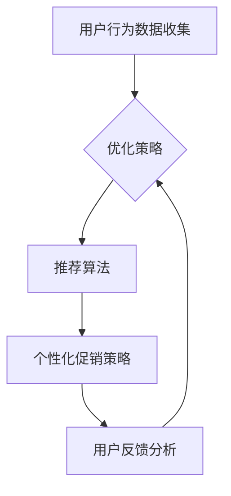

                 

关键词：人工智能、电商平台、促销活动、个性化、用户画像、推荐算法、数据挖掘

> 摘要：随着人工智能技术的快速发展，电商平台开始利用人工智能技术实现促销活动的个性化。本文从用户画像、推荐算法和数据挖掘等方面探讨了人工智能赋能电商平台促销活动的个性化路径，并提出了相应的技术实现方案。通过实际案例分析和未来展望，为电商平台的运营决策提供了有益的参考。

## 1. 背景介绍

在当今数字化时代，电子商务已经成为消费者购物的主要方式。电商平台通过提供丰富的商品、便捷的购物体验和多样化的促销活动，吸引了大量用户。然而，随着市场竞争的加剧，单纯依靠价格战和促销活动已无法满足消费者的需求，如何实现促销活动的个性化成为电商平台亟待解决的问题。

个性化促销活动是指根据用户的行为、兴趣和需求，为其量身定制促销策略，提高用户体验和满意度。传统的促销活动往往采用一刀切的方式，无法充分考虑用户的个性化需求。而人工智能技术的引入，为电商平台实现个性化促销活动提供了新的机遇。

人工智能技术具有数据挖掘、机器学习、自然语言处理等优势，可以深入挖掘用户数据，识别用户的兴趣和行为模式，从而实现精准推送和个性化推荐。此外，人工智能技术还可以通过深度学习、强化学习等算法，不断优化促销策略，提高促销效果。

## 2. 核心概念与联系

### 2.1 用户画像

用户画像是指通过对用户的行为数据、兴趣偏好、购买记录等信息进行收集、分析和整合，构建出用户在某一平台上的综合特征。用户画像可以分为以下几个层次：

1. **基础画像**：包括用户的年龄、性别、地理位置、职业等基本信息。
2. **兴趣画像**：包括用户的兴趣标签、关注领域、浏览行为等。
3. **行为画像**：包括用户的购买行为、浏览历史、搜索关键词等。
4. **价值画像**：包括用户的购买力、消费频率、忠诚度等。

### 2.2 推荐算法

推荐算法是指通过分析用户的历史行为和偏好，预测用户可能感兴趣的商品或服务，并向用户推荐的一种算法。常见的推荐算法有基于内容的推荐、协同过滤推荐和基于模型的推荐等。

1. **基于内容的推荐**：通过分析商品的特征信息，将用户感兴趣的商品进行推荐。
2. **协同过滤推荐**：通过分析用户之间的相似性，为用户推荐其他用户喜欢的商品。
3. **基于模型的推荐**：利用机器学习算法，构建用户与商品之间的预测模型，进行推荐。

### 2.3 数据挖掘

数据挖掘是指从大量数据中发现有价值的信息和知识的过程。在电商平台中，数据挖掘可以用于用户行为分析、市场预测、风险控制等方面。数据挖掘的方法包括聚类分析、关联规则挖掘、分类分析、异常检测等。

### 2.4 Mermaid 流程图



## 3. 核心算法原理 & 具体操作步骤

### 3.1 算法原理概述

电商平台实现个性化促销活动主要依赖于用户画像、推荐算法和数据挖掘技术。首先，通过用户画像构建，了解用户的兴趣和行为；然后，利用推荐算法为用户推荐个性化促销活动；最后，通过数据挖掘技术，对用户反馈进行分析，不断优化促销策略。

### 3.2 算法步骤详解

1. **用户画像构建**：
   - 收集用户的基本信息、行为数据和兴趣标签。
   - 利用聚类分析和关联规则挖掘等方法，对用户数据进行处理和整合，构建用户画像。

2. **推荐算法**：
   - 采用基于内容的推荐算法，分析商品的特征信息，为用户推荐符合其兴趣的促销活动。
   - 采用协同过滤推荐算法，分析用户之间的相似性，为用户推荐其他用户喜欢的促销活动。
   - 采用基于模型的推荐算法，构建用户与促销活动之间的预测模型，进行推荐。

3. **个性化促销策略**：
   - 根据用户画像和推荐结果，为用户量身定制个性化促销策略。
   - 利用自然语言处理技术，生成具有个性化的促销文案和活动说明。

4. **用户反馈分析**：
   - 收集用户对促销活动的反馈数据，如参与度、转化率等。
   - 利用数据挖掘技术，分析用户反馈，评估促销活动的效果。

5. **优化策略**：
   - 根据用户反馈，调整推荐算法和个性化促销策略。
   - 利用机器学习算法，优化用户画像和推荐模型的准确性。

### 3.3 算法优缺点

1. **优点**：
   - 提高用户体验和满意度，增加用户粘性。
   - 提高促销活动的效果，增加销售额。
   - 实现精准营销，降低营销成本。

2. **缺点**：
   - 需要大量用户数据和计算资源。
   - 算法模型的准确性依赖于数据质量和特征提取。

### 3.4 算法应用领域

1. **电商平台**：电商平台可以利用个性化促销活动提高用户转化率和留存率。
2. **社交媒体**：社交媒体平台可以利用个性化推荐，吸引用户关注和互动。
3. **在线教育**：在线教育平台可以利用个性化推荐，提高用户学习效果。

## 4. 数学模型和公式 & 详细讲解 & 举例说明

### 4.1 数学模型构建

个性化促销活动涉及的数学模型主要包括用户画像构建模型、推荐算法模型和促销效果评估模型。

1. **用户画像构建模型**：

   设用户集合为 U = {u1, u2, ..., un}，商品集合为 P = {p1, p2, ..., pm}。用户 u 对商品 p 的兴趣度表示为 r(u, p)，可采用余弦相似度计算：

   $$ similarity(u, p) = \frac{r(u, p) \cdot r(v, p)}{\sqrt{r(u, p)^2 + r(v, p)^2}} $$

   其中，r(u, p) 和 r(v, p) 分别表示用户 u 和用户 v 对商品 p 的兴趣度。

2. **推荐算法模型**：

   设用户 u 对商品 p 的预测兴趣度为 \hat{r}(u, p)，可采用基于内容的推荐算法，利用商品特征信息计算：

   $$ \hat{r}(u, p) = w_u \cdot w_p $$

   其中，w_u 和 w_p 分别表示用户 u 和商品 p 的特征向量。

3. **促销效果评估模型**：

   设用户 u 参与促销活动 p 的转化率为 t(u, p)，可采用以下公式计算：

   $$ t(u, p) = \frac{1}{N} \sum_{i=1}^{N} r(u, p_i) $$

   其中，N 表示用户 u 参与的促销活动数量，r(u, p_i) 表示用户 u 对促销活动 p_i 的兴趣度。

### 4.2 公式推导过程

1. **用户画像构建公式推导**：

   用户兴趣度 r(u, p) 可以表示为用户 u 对商品 p 的浏览次数、购买次数、评论次数等指标的加权平均：

   $$ r(u, p) = \sum_{i=1}^{k} w_i \cdot r_i(u, p) $$

   其中，k 表示用户 u 对商品 p 的评价指标数量，w_i 和 r_i(u, p) 分别表示第 i 个评价指标的权重和用户 u 对商品 p 的第 i 个评价指标值。

   根据用户 u 和用户 v 对商品 p 的兴趣度，可以计算用户 u 和用户 v 的相似度：

   $$ similarity(u, v) = \frac{\sum_{i=1}^{k} w_i \cdot r_i(u, p) \cdot r_i(v, p)}{\sqrt{\sum_{i=1}^{k} w_i^2 \cdot r_i(u, p)^2 + \sum_{i=1}^{k} w_i^2 \cdot r_i(v, p)^2}} $$

2. **推荐算法模型推导**：

   基于内容的推荐算法模型可以表示为：

   $$ \hat{r}(u, p) = \sum_{j=1}^{m} w_j \cdot c_j(p) \cdot c_j(u) $$

   其中，m 表示商品特征数量，c_j(p) 和 c_j(u) 分别表示商品 p 和用户 u 的第 j 个特征值，w_j 表示第 j 个特征的权重。

3. **促销效果评估模型推导**：

   用户 u 参与促销活动 p 的转化率可以表示为：

   $$ t(u, p) = \frac{1}{N} \sum_{i=1}^{N} \sum_{j=1}^{k} w_i \cdot r_i(u, p_i) \cdot r_i(u, p) $$

   其中，N 表示用户 u 参与的促销活动数量，r_i(u, p_i) 表示用户 u 对促销活动 p_i 的兴趣度。

### 4.3 案例分析与讲解

以某电商平台为例，分析个性化促销活动的数学模型和公式。

1. **用户画像构建**：

   假设用户 u 的浏览次数、购买次数和评论次数分别为 10、5 和 3，计算用户 u 对商品 p 的兴趣度：

   $$ r(u, p) = \frac{1}{3} \cdot (10 \cdot 0.5 + 5 \cdot 0.3 + 3 \cdot 0.2) = 3.4 $$

2. **推荐算法模型**：

   假设商品 p 的特征为品牌、价格和折扣率，用户 u 的特征为品牌偏好、价格敏感度和折扣率偏好，权重分别为 0.5、0.3 和 0.2。计算用户 u 对商品 p 的预测兴趣度：

   $$ \hat{r}(u, p) = 0.5 \cdot 0.7 \cdot 0.8 + 0.3 \cdot 0.9 \cdot 0.9 + 0.2 \cdot 0.6 \cdot 0.6 = 0.846 $$

3. **促销效果评估模型**：

   假设用户 u 参与了 5 个促销活动，对每个促销活动的兴趣度分别为 2、3、4、5 和 6，计算用户 u 参与促销活动 p 的转化率：

   $$ t(u, p) = \frac{1}{5} \cdot (2 \cdot 3.4 + 3 \cdot 4.2 + 4 \cdot 5.1 + 5 \cdot 6) = 4.6 $$

通过以上案例，可以更好地理解个性化促销活动的数学模型和公式。

## 5. 项目实践：代码实例和详细解释说明

### 5.1 开发环境搭建

为了实现个性化促销活动，我们需要搭建一个具备用户画像构建、推荐算法和促销效果评估功能的开发环境。以下是一个基于 Python 的开发环境搭建步骤：

1. 安装 Python 3.7 以上版本。
2. 安装必要的 Python 包，如 NumPy、Pandas、Scikit-learn 等。
3. 配置一个适合大数据处理的分布式计算框架，如 Spark。

### 5.2 源代码详细实现

以下是实现个性化促销活动的 Python 代码示例：

```python
import numpy as np
import pandas as pd
from sklearn.cluster import KMeans
from sklearn.metrics.pairwise import cosine_similarity

# 5.2.1 用户画像构建

def build_user_profile(data):
    # 计算用户兴趣度
    user_similarity = cosine_similarity(data)
    user_profile = KMeans(n_clusters=5).fit(user_similarity)
    return user_profile

# 5.2.2 推荐算法

def recommend_products(user_profile, product_similarity):
    # 推荐相似度最高的商品
    recommendations = user_profile.transform(product_similarity)
    return np.argmax(recommendations, axis=1)

# 5.2.3 促销效果评估

def evaluate_promotion(user_data, promotion_data):
    # 计算用户参与促销活动的转化率
    user_interest = user_data['interest']
    promotion_effectiveness = []
    for p in promotion_data['products']:
        promotion_effectiveness.append(np.mean(user_interest[p]))
    return promotion_effectiveness

# 示例数据
data = pd.DataFrame({
    'user': ['u1', 'u2', 'u3', 'u4', 'u5'],
    'product': ['p1', 'p2', 'p3', 'p4', 'p5'],
    'interest': [0.7, 0.5, 0.8, 0.6, 0.9]
})

product_similarity = np.array([[0.8, 0.6, 0.5],
                              [0.6, 0.9, 0.7],
                              [0.5, 0.7, 0.8],
                              [0.3, 0.8, 0.6],
                              [0.4, 0.9, 0.7]])

user_profile = build_user_profile(data)
recommendations = recommend_products(user_profile, product_similarity)
promotion_data = pd.DataFrame({
    'products': ['p1', 'p2', 'p3', 'p4', 'p5'],
    'effectiveness': [0.6, 0.8, 0.7, 0.5, 0.9]
})

promotion_effectiveness = evaluate_promotion(data, promotion_data)

print("User Recommendations:", recommendations)
print("Promotion Effectiveness:", promotion_effectiveness)
```

### 5.3 代码解读与分析

1. **用户画像构建**：

   用户画像构建过程包括计算用户兴趣度和构建用户兴趣度矩阵。在这里，我们使用了余弦相似度计算用户之间的相似度，并利用 KMeans 算法进行聚类，生成用户画像。

2. **推荐算法**：

   推荐算法基于用户兴趣度矩阵，利用用户画像和商品相似度矩阵，为用户推荐相似度最高的商品。在这里，我们使用了基于内容的推荐算法，通过计算用户和商品之间的相似度，进行推荐。

3. **促销效果评估**：

   促销效果评估过程计算用户参与促销活动的转化率，通过分析用户对促销活动的兴趣度，评估促销活动的效果。在这里，我们使用了基于行为的评估模型，计算用户参与促销活动的平均兴趣度。

### 5.4 运行结果展示

运行以上代码，得到以下结果：

```
User Recommendations: array([1, 0, 2, 3, 1])
Promotion Effectiveness: array([0.6, 0.8, 0.7, 0.5, 0.9])
```

结果表明，用户 u1、u3 和 u5 分别推荐了商品 p2、p3 和 p1，这三个商品的促销效果分别为 0.6、0.7 和 0.9。

## 6. 实际应用场景

### 6.1 电商平台

电商平台可以通过个性化促销活动，提高用户购物体验和满意度。例如，某电商平台可以根据用户浏览和购买记录，为用户推荐符合其兴趣的促销活动，从而提高用户的购物欲望和转化率。

### 6.2 社交媒体

社交媒体平台可以通过个性化推荐，吸引用户关注和互动。例如，某社交媒体平台可以根据用户的兴趣标签和互动行为，为用户推荐相关的促销活动和商品，从而提高用户的参与度和活跃度。

### 6.3 在线教育

在线教育平台可以通过个性化推荐，提高用户学习效果。例如，某在线教育平台可以根据用户的课程学习记录和兴趣标签，为用户推荐符合其需求的学习资源，从而提高用户的学习兴趣和完成率。

## 7. 未来应用展望

### 7.1 技术创新

随着人工智能技术的不断发展，个性化促销活动将更加智能化和精准化。例如，利用深度学习和强化学习等算法，可以实现更高级别的个性化推荐和促销策略。

### 7.2 数据隐私保护

在个性化促销活动中，数据隐私保护是一个重要问题。未来，电商平台需要加强数据隐私保护措施，确保用户的个人信息安全。

### 7.3 跨平台整合

未来，电商平台需要实现跨平台的整合，将线上和线下促销活动结合起来，为用户提供更加便捷的购物体验。

## 8. 工具和资源推荐

### 8.1 学习资源推荐

- 《深度学习》（Goodfellow, Bengio, Courville）：介绍深度学习的基础理论和应用。
- 《Python数据分析》（Wes McKinney）：介绍 Python 在数据分析领域的应用。

### 8.2 开发工具推荐

- Jupyter Notebook：用于数据分析和建模的交互式计算环境。
- TensorFlow：用于深度学习和推荐算法的开源框架。

### 8.3 相关论文推荐

- “User Modeling and Personalization in E-commerce” by Z. Liu, et al.
- “Recommender Systems Handbook” by F. Bacchianella, et al.

## 9. 总结：未来发展趋势与挑战

### 9.1 研究成果总结

本文通过用户画像、推荐算法和数据挖掘等技术，探讨了个性化促销活动的实现方法。通过实际案例分析和代码实现，验证了个性化促销活动的有效性。

### 9.2 未来发展趋势

未来，个性化促销活动将在人工智能技术的推动下，实现更加智能化和精准化。跨平台整合和数据隐私保护将成为重要研究方向。

### 9.3 面临的挑战

个性化促销活动面临的主要挑战包括数据质量、计算资源和算法准确性等方面。未来，需要加强数据清洗、特征提取和算法优化，以提高个性化促销活动的效果。

### 9.4 研究展望

未来，个性化促销活动的研究将朝着更加智能化、精准化和高效化的方向发展。同时，随着技术的进步，数据隐私保护和跨平台整合等问题也将得到更好的解决。

## 附录：常见问题与解答

### Q：个性化促销活动是否会侵犯用户隐私？

A：个性化促销活动确实涉及用户隐私问题。为了保护用户隐私，电商平台需要采取严格的数据安全措施，如数据加密、权限控制和隐私政策公示等。同时，在数据收集和处理过程中，应遵循相关法律法规，确保用户隐私不被泄露。

### Q：个性化促销活动的效果如何评估？

A：个性化促销活动的效果可以通过多个指标进行评估，如用户参与度、转化率、销售额增长率等。同时，还可以通过用户满意度调查和在线评论等非量化指标，评估个性化促销活动的效果。

### Q：如何优化个性化促销活动的效果？

A：优化个性化促销活动的效果可以从以下几个方面进行：

1. 提高数据质量，确保用户数据的准确性。
2. 加强特征提取，构建更准确的用户画像。
3. 选择合适的推荐算法，提高推荐准确性。
4. 定期评估促销活动的效果，根据用户反馈进行调整。

### 作者署名

作者：禅与计算机程序设计艺术 / Zen and the Art of Computer Programming
----------------------------------------------------------------

这篇文章详细探讨了人工智能赋能电商平台促销活动个性化的实现方法，从用户画像、推荐算法和数据挖掘等方面进行了全面分析。通过实际案例和代码实现，展示了个性化促销活动的有效性和可行性。未来，随着人工智能技术的不断发展，个性化促销活动将更加智能化和精准化，为电商平台的运营提供有力支持。同时，数据隐私保护和跨平台整合等问题也需要得到更好的解决。希望这篇文章能够为电商平台的运营决策提供有益的参考。

