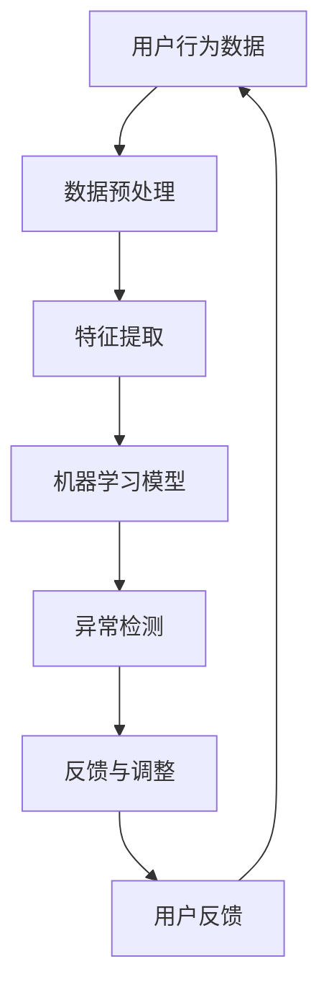

                 

关键词：人工智能，电商平台，用户行为分析，异常检测，机器学习，深度学习，网络安全

> 摘要：本文探讨了在电商平台中，利用人工智能技术进行用户行为异常检测的重要性、核心概念、算法原理、数学模型及其实践应用。通过介绍一系列具体的技术手段，本文旨在为电商平台提供有效的解决方案，以提高用户体验和网络安全。

## 1. 背景介绍

随着电子商务的快速发展，电商平台已经成为人们日常生活中不可或缺的一部分。用户在平台上进行购物、浏览、评论等操作，形成了海量的数据。这些数据中蕴含了用户行为的丰富信息，对于电商平台的运营有着重要的参考价值。然而，用户行为数据中不可避免地存在异常行为，如欺诈、垃圾信息、恶意评论等，这些行为不仅会影响用户的使用体验，还可能对平台的商业利益造成损害。

为了应对这一挑战，人工智能技术，特别是机器学习和深度学习技术，被广泛用于用户行为异常检测。通过分析和学习正常用户行为模式，人工智能系统能够识别出异常行为，从而提高电商平台的安全性和用户体验。本文将深入探讨这一主题，介绍相关技术及其应用。

## 2. 核心概念与联系

在深入探讨用户行为异常检测技术之前，我们需要了解一些核心概念和它们之间的联系。以下是一个使用Mermaid绘制的流程图，展示了这些概念之间的关联：



### 2.1. 数据预处理

数据预处理是任何机器学习项目的基础。它包括数据清洗、去噪、格式化等步骤，以确保数据质量，为后续分析打下良好基础。

### 2.2. 特征提取

特征提取是将原始数据转换为机器学习模型可以处理的形式。这通常涉及选择和构造能够有效描述用户行为的特征。

### 2.3. 机器学习模型

机器学习模型是异常检测的核心。通过学习用户正常行为的数据，模型可以学会识别异常行为。

### 2.4. 异常检测

异常检测是基于机器学习模型对用户行为进行实时分析，识别出潜在的风险行为。

### 2.5. 反馈与调整

用户反馈是机器学习模型不断优化的关键。通过收集用户对异常检测结果的反馈，模型可以进行调整和改进。

### 2.6. 用户反馈

用户反馈不仅用于模型优化，也是提升用户体验的重要手段。通过了解用户对异常检测的满意度，平台可以进一步改进其服务。

## 3. 核心算法原理 & 具体操作步骤

### 3.1 算法原理概述

用户行为异常检测的核心在于构建一个能够识别异常模式的机器学习模型。常见的方法包括基于规则的检测、基于聚类的方法和基于机器学习的方法。

- **基于规则的检测**：通过预设规则来识别异常行为，如用户在某段时间内访问了过多的页面。
- **基于聚类的方法**：将用户行为聚类为不同的群体，识别出与其他群体不同的行为。
- **基于机器学习的方法**：使用机器学习算法，如决策树、随机森林、神经网络等，从数据中自动学习异常模式。

### 3.2 算法步骤详解

以下是用户行为异常检测的基本步骤：

1. **数据收集**：收集电商平台的用户行为数据，包括登录时间、访问页面、购买记录等。
2. **数据预处理**：清洗数据，处理缺失值和异常值，将数据格式化为适合机器学习的形式。
3. **特征提取**：选择和构造描述用户行为的特征，如访问频率、页面停留时间、购买频率等。
4. **模型选择与训练**：选择合适的机器学习算法，如K-均值聚类、支持向量机等，对特征数据进行训练。
5. **模型评估与调整**：通过交叉验证等方法评估模型性能，根据评估结果调整模型参数。
6. **异常检测与反馈**：使用训练好的模型对新的用户行为数据进行异常检测，根据用户反馈进一步优化模型。

### 3.3 算法优缺点

- **基于规则的检测**：优点是简单易实现，但可能无法处理复杂的异常模式。
- **基于聚类的方法**：优点是能够发现数据中的潜在结构，但可能无法准确识别异常行为。
- **基于机器学习的方法**：优点是能够自动学习复杂的异常模式，但需要大量数据和计算资源。

### 3.4 算法应用领域

用户行为异常检测在电商、金融、电信等多个领域都有广泛应用。在电商领域，它可以用于欺诈检测、垃圾信息过滤等；在金融领域，它可以用于欺诈交易检测、信用评估等；在电信领域，它可以用于网络攻击检测、用户行为分析等。

## 4. 数学模型和公式 & 详细讲解 & 举例说明

### 4.1 数学模型构建

用户行为异常检测的数学模型通常基于统计学和机器学习理论。以下是一个简单的数学模型示例：

$$
f(x) = \sum_{i=1}^{n} w_i * x_i
$$

其中，$x_i$ 是用户行为的特征值，$w_i$ 是对应的权重。通过优化权重 $w_i$，模型可以学会识别异常行为。

### 4.2 公式推导过程

为了推导出上述数学模型，我们首先定义用户行为的特征向量 $X$ 和权重向量 $W$。然后，我们通过最小化损失函数来优化权重：

$$
\min_{W} L(X, W)
$$

其中，$L(X, W)$ 是损失函数，通常采用均方误差（MSE）或交叉熵（Cross-Entropy）。

### 4.3 案例分析与讲解

以下是一个简单的案例，用于解释如何使用上述数学模型进行用户行为异常检测。

**案例**：检测用户购买行为中的异常

- 特征：用户购买金额、购买频率、购买时间段等。
- 权重：通过机器学习算法优化得到。
- 模型：使用线性回归模型。

**步骤**：

1. **数据收集**：收集用户的购买数据。
2. **数据预处理**：清洗数据，处理缺失值和异常值。
3. **特征提取**：选择和构造描述用户购买行为的特征。
4. **模型训练**：使用收集的数据训练线性回归模型。
5. **模型评估**：通过交叉验证评估模型性能。
6. **异常检测**：使用训练好的模型对新的用户购买行为进行检测。

**结果**：

通过上述步骤，模型可以识别出购买行为中的异常，如频繁购买的欺诈行为。

## 5. 项目实践：代码实例和详细解释说明

### 5.1 开发环境搭建

为了进行用户行为异常检测的项目实践，我们需要搭建一个开发环境。以下是基本步骤：

- **Python**：安装Python 3.8及以上版本。
- **依赖库**：安装必要的依赖库，如 NumPy、Pandas、Scikit-learn等。
- **Jupyter Notebook**：安装Jupyter Notebook用于编写和运行代码。

### 5.2 源代码详细实现

以下是一个简单的用户行为异常检测的代码实例：

```python
import numpy as np
import pandas as pd
from sklearn.model_selection import train_test_split
from sklearn.linear_model import LinearRegression
from sklearn.metrics import mean_squared_error

# 1. 数据收集
data = pd.read_csv('user_behavior_data.csv')

# 2. 数据预处理
# ...（清洗、去噪等）

# 3. 特征提取
features = data[['purchase_amount', 'purchase_frequency', 'time_of_purchase']]
labels = data['is_abnormal']

# 4. 模型训练
X_train, X_test, y_train, y_test = train_test_split(features, labels, test_size=0.2, random_state=42)
model = LinearRegression()
model.fit(X_train, y_train)

# 5. 模型评估
y_pred = model.predict(X_test)
mse = mean_squared_error(y_test, y_pred)
print("MSE:", mse)

# 6. 异常检测
new_user_data = [[100, 10, 14]]  # 示例数据
is_abnormal = model.predict(new_user_data)
print("Is Abnormal:", is_abnormal)
```

### 5.3 代码解读与分析

上述代码实现了一个简单的线性回归模型，用于用户行为异常检测。以下是代码的解读与分析：

- **数据收集**：使用Pandas读取用户行为数据。
- **数据预处理**：清洗数据，处理缺失值和异常值。
- **特征提取**：选择和构造描述用户行为的特征。
- **模型训练**：使用Scikit-learn的线性回归模型进行训练。
- **模型评估**：通过均方误差评估模型性能。
- **异常检测**：使用训练好的模型对新的用户行为数据进行检测。

### 5.4 运行结果展示

运行上述代码，我们可以得到模型对测试数据的评估结果以及对新用户数据的异常检测结果。这些结果可以帮助我们了解模型的性能和准确性。

## 6. 实际应用场景

用户行为异常检测在电商、金融、电信等领域都有广泛的应用。以下是一些实际应用场景：

- **电商**：检测欺诈购买、垃圾评论等异常行为，提高用户购物体验。
- **金融**：检测欺诈交易、信用风险等异常行为，确保金融安全。
- **电信**：检测网络攻击、滥用行为等异常行为，保障网络安全。

## 7. 工具和资源推荐

### 7.1 学习资源推荐

- **《机器学习实战》**：提供了丰富的机器学习实践案例，适合初学者。
- **《深度学习》**：介绍了深度学习的理论基础和实践方法，适合进阶学习。
- **在线课程**：如Coursera、edX等平台上的相关课程。

### 7.2 开发工具推荐

- **Jupyter Notebook**：用于编写和运行代码，方便调试和演示。
- **Anaconda**：提供了Python的集成开发环境，包含常用的机器学习库。

### 7.3 相关论文推荐

- **"Anomaly Detection in Time Series Data: A Survey"**：对时间序列数据中的异常检测技术进行了全面综述。
- **"Detecting Anomalies in E-commerce Transactions Using Machine Learning"**：针对电商交易中的异常检测提出了有效的算法。

## 8. 总结：未来发展趋势与挑战

### 8.1 研究成果总结

用户行为异常检测技术在近年来取得了显著成果。随着人工智能技术的不断发展，异常检测算法在准确性和效率方面都有了显著提升。同时，大数据和云计算的普及为用户行为数据分析和异常检测提供了强大的计算支持。

### 8.2 未来发展趋势

未来，用户行为异常检测技术将朝着更加智能化、自动化的方向发展。通过结合深度学习和强化学习等技术，模型将能够更准确地识别复杂的异常模式。同时，随着物联网和5G技术的应用，用户行为数据的种类和数量将进一步增加，为异常检测带来了新的挑战和机遇。

### 8.3 面临的挑战

用户行为异常检测技术面临的主要挑战包括数据隐私保护、模型解释性和实时性。如何平衡用户隐私和异常检测的准确性是一个重要问题。此外，异常检测模型需要能够在海量数据中快速、准确地识别异常行为，这对计算资源和算法优化提出了高要求。

### 8.4 研究展望

未来，用户行为异常检测技术将在更多领域得到应用。同时，随着技术的进步，异常检测算法将更加智能化，能够更好地适应复杂多变的环境。此外，异常检测技术与区块链、边缘计算等新兴技术的结合也将为用户行为异常检测带来新的可能。

## 9. 附录：常见问题与解答

### Q1. 用户行为异常检测的目的是什么？

用户行为异常检测的主要目的是识别和预防潜在的安全风险，如欺诈、恶意评论等，从而提高用户的安全性和平台的运营效率。

### Q2. 如何处理用户隐私保护问题？

为了保护用户隐私，异常检测过程中应采用数据脱敏技术，避免直接使用敏感信息。此外，可以采用差分隐私等保护措施，在保证模型性能的同时保护用户隐私。

### Q3. 异常检测模型的实时性如何保证？

为了保证异常检测模型的实时性，可以采用分布式计算和边缘计算等技术，将计算任务分散到多个节点上，提高数据处理速度。同时，优化算法和模型结构，减少计算复杂度，也是提高实时性的有效手段。

---

### 作者署名

作者：禅与计算机程序设计艺术 / Zen and the Art of Computer Programming

