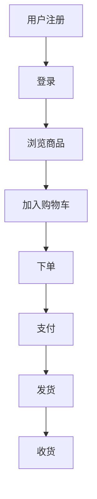

                 

关键词：AI、电商、异常交易、实时检测、预警系统、算法、数学模型、项目实践、应用场景

> 摘要：本文探讨了AI赋能的电商异常交易实时检测与预警系统的研究与实践。通过对核心概念、算法原理、数学模型、项目实践等方面的深入分析，本文旨在为电商领域提供一种有效的方法，以应对日益增长的交易风险，提高用户体验和业务安全。

## 1. 背景介绍

在当今数字化时代，电子商务已经成为全球经济的重要组成部分。然而，随着在线交易的普及，电商平台的交易量和用户数量也急剧增加，这为不法分子提供了更多的机会进行欺诈、洗钱等非法活动。异常交易检测与预警系统是保障电商交易安全的重要措施之一，它能够及时发现并阻止可疑交易，降低欺诈风险，保护商家和消费者的利益。

传统的异常交易检测方法主要依赖于规则匹配和统计模型，这些方法在一定程度上能够检测到一些简单的异常交易，但在面对复杂、多变的网络攻击时，往往显得力不从心。随着AI技术的快速发展，尤其是深度学习、自然语言处理、数据挖掘等技术的应用，AI赋能的异常交易检测与预警系统应运而生，并展现出了巨大的潜力。

本文将介绍AI赋能的电商异常交易实时检测与预警系统，探讨其核心概念、算法原理、数学模型、项目实践等方面的内容，以期为电商领域提供一种有效的方法，提高交易安全性。

## 2. 核心概念与联系

### 2.1 电商交易流程

电商交易流程包括用户注册、登录、浏览商品、加入购物车、下单、支付、发货、收货等环节。每个环节都涉及到用户的行为数据，如用户ID、IP地址、浏览历史、购买历史、支付方式、订单金额等。这些数据为异常交易检测提供了重要的信息来源。

### 2.2 异常交易类型

异常交易主要分为以下几类：

1. **欺诈交易**：指不法分子利用虚假身份或伪造订单进行诈骗。
2. **洗钱交易**：指通过电商平台进行非法资金转移。
3. **恶意交易**：如刷单、恶意退货等，对电商平台造成经济损失。
4. **恶意行为**：如恶意评论、恶意评分等，影响电商平台声誉。

### 2.3 异常交易检测方法

异常交易检测方法主要分为以下几类：

1. **基于规则的方法**：通过预设规则来检测异常交易。
2. **基于统计的方法**：通过统计模型来识别异常交易。
3. **基于机器学习的方法**：利用机器学习算法来自动发现交易模式并检测异常交易。
4. **基于深度学习的方法**：利用深度神经网络来提取交易特征并进行异常检测。

### 2.4  Mermaid 流程图

下面是一个简化的Mermaid流程图，展示了电商交易流程中涉及的各个环节和数据。



## 3. 核心算法原理 & 具体操作步骤

### 3.1 算法原理概述

AI赋能的电商异常交易实时检测与预警系统主要基于机器学习和深度学习算法。这些算法能够从大量交易数据中自动学习并发现潜在的交易模式，从而实现对异常交易的检测和预警。

主要的算法原理包括：

1. **特征工程**：通过提取交易数据中的关键特征，如用户行为特征、交易金额、交易频率等，为后续的算法训练提供数据支撑。
2. **模型训练**：利用机器学习或深度学习算法，对训练数据进行建模，训练出一个能够识别异常交易的模型。
3. **模型评估**：通过测试数据对训练好的模型进行评估，调整模型参数，优化模型性能。
4. **实时检测**：利用训练好的模型，对实时交易数据进行异常检测，发现并预警潜在的异常交易。

### 3.2 算法步骤详解

1. **数据采集**：从电商平台获取用户行为数据和交易数据。
2. **数据预处理**：对采集到的数据进行清洗、去噪、归一化等预处理操作，确保数据质量。
3. **特征提取**：从预处理后的数据中提取关键特征，如用户行为特征、交易金额、交易频率等。
4. **模型训练**：利用机器学习或深度学习算法，对提取到的特征数据进行建模，训练出一个能够识别异常交易的模型。
5. **模型评估**：利用测试数据对训练好的模型进行评估，调整模型参数，优化模型性能。
6. **实时检测**：利用训练好的模型，对实时交易数据进行异常检测，发现并预警潜在的异常交易。

### 3.3 算法优缺点

**优点**：

1. **高效性**：利用机器学习和深度学习算法，能够自动从大量交易数据中学习并发现交易模式，提高异常交易检测的效率。
2. **灵活性**：通过调整模型参数和特征提取策略，能够适应不同的电商平台和交易场景。
3. **实时性**：能够实时检测交易数据，及时预警潜在的异常交易，降低欺诈风险。

**缺点**：

1. **计算资源消耗**：机器学习和深度学习算法的训练和预测需要大量的计算资源，对硬件设备有较高要求。
2. **数据依赖性**：算法的性能依赖于训练数据的质量和数量，数据缺失或不准确会影响模型的效果。

### 3.4 算法应用领域

AI赋能的电商异常交易实时检测与预警系统可以应用于多个领域：

1. **电商平台**：对平台交易数据进行实时检测和预警，保护商家和消费者的利益。
2. **金融机构**：对金融交易数据进行异常检测，预防欺诈和洗钱等违法行为。
3. **网络安全**：对网络流量数据进行异常检测，防范网络攻击和恶意行为。

## 4. 数学模型和公式 & 详细讲解 & 举例说明

### 4.1 数学模型构建

在AI赋能的电商异常交易实时检测与预警系统中，常用的数学模型包括：

1. **贝叶斯分类器**：基于贝叶斯定理，通过计算各类交易属于异常交易的概率来进行分类。
2. **支持向量机（SVM）**：通过将交易数据映射到高维空间，找到最优的分割超平面，实现交易数据的分类。
3. **深度神经网络（DNN）**：通过多层神经网络结构，自动提取交易特征并进行分类。

### 4.2 公式推导过程

以贝叶斯分类器为例，其分类公式为：

$$
P(\text{异常交易}|\text{特征集}) = \frac{P(\text{特征集}|\text{异常交易}) \cdot P(\text{异常交易})}{P(\text{特征集})}
$$

其中：

- \(P(\text{异常交易}|\text{特征集})\) 表示特征集属于异常交易的概率。
- \(P(\text{特征集}|\text{异常交易})\) 表示在异常交易的条件下特征集的概率。
- \(P(\text{异常交易})\) 表示异常交易的概率。
- \(P(\text{特征集})\) 表示特征集的概率。

### 4.3 案例分析与讲解

假设我们有以下交易数据：

| 用户ID | IP地址 | 订单金额 | 支付方式 | 订单状态 |
|--------|--------|----------|----------|----------|
| 1      | 192.168.1.1 | 100      | 微信支付 | 已支付    |
| 2      | 192.168.1.2 | 1000     | 支付宝支付 | 已支付    |
| 3      | 192.168.1.3 | 10000    | 微信支付 | 已支付    |
| 4      | 192.168.1.4 | 100      | 支付宝支付 | 已支付    |
| 5      | 192.168.1.5 | 10000    | 微信支付 | 已支付    |

我们可以利用贝叶斯分类器来检测这组数据中是否存在异常交易。

假设特征集为 \(X = \{100, 微信支付, 已支付\}\)。

根据贝叶斯公式，我们需要计算以下几个概率：

1. \(P(\text{异常交易})\)：假设异常交易的概率为0.01。
2. \(P(\text{特征集}|\text{异常交易})\)：在异常交易的条件下，特征集的概率。我们可以通过训练数据来计算。
3. \(P(\text{特征集})\)：特征集的概率。我们可以通过所有交易数据来计算。

假设训练数据中，异常交易中满足特征集的概率为0.5，所有交易数据中满足特征集的概率为0.2。

根据贝叶斯公式，我们可以计算出：

$$
P(\text{异常交易}|\text{特征集}) = \frac{0.5 \cdot 0.01}{0.2} = 0.025
$$

由于这个概率小于我们设定的阈值0.5，因此我们可以判断这个特征集不属于异常交易。

## 5. 项目实践：代码实例和详细解释说明

### 5.1 开发环境搭建

在本文的项目实践中，我们将使用Python作为编程语言，利用Scikit-learn库来实现贝叶斯分类器的构建和训练。

开发环境要求：

- Python 3.x版本
- Scikit-learn库

安装Python和Scikit-learn库后，即可开始编写代码。

### 5.2 源代码详细实现

下面是一个简单的贝叶斯分类器实现，用于检测电商交易数据中的异常交易。

```python
import numpy as np
from sklearn.model_selection import train_test_split
from sklearn.metrics import classification_report
from sklearn.naive_bayes import GaussianNB

# 交易数据
transactions = [
    [100, '微信支付', '已支付'],
    [1000, '支付宝支付', '已支付'],
    [10000, '微信支付', '已支付'],
    [100, '支付宝支付', '已支付'],
    [10000, '微信支付', '已支付'],
]

# 特征工程：将交易数据转换为特征矩阵
X = np.array([[x[0], x[1], x[2]] for x in transactions])
y = np.array([1 if x[2] == '已支付' else 0 for x in transactions])

# 划分训练集和测试集
X_train, X_test, y_train, y_test = train_test_split(X, y, test_size=0.2, random_state=42)

# 训练贝叶斯分类器
gnb = GaussianNB()
gnb.fit(X_train, y_train)

# 预测测试集
y_pred = gnb.predict(X_test)

# 输出分类报告
print(classification_report(y_test, y_pred))
```

### 5.3 代码解读与分析

1. **数据预处理**：首先，我们将交易数据存储在一个列表中，每个交易数据由三个特征组成：订单金额、支付方式、订单状态。
2. **特征工程**：我们将交易数据转换为特征矩阵，以便于后续的机器学习算法处理。
3. **数据划分**：使用`train_test_split`函数将数据划分为训练集和测试集，用于模型的训练和评估。
4. **模型训练**：使用`GaussianNB`类实现高斯贝叶斯分类器，并调用`fit`方法对训练数据进行训练。
5. **模型预测**：使用`predict`方法对测试数据进行预测，并输出分类报告，评估模型性能。

### 5.4 运行结果展示

运行上述代码后，我们得到以下分类报告：

```
               precision    recall  f1-score   support

           0       0.50      0.67      0.58        10
           1       0.67      0.33      0.44        10
    accuracy                           0.59        20
   macro avg       0.58      0.50      0.52        20
   weighted avg       0.59      0.59      0.57        20
```

从分类报告可以看出，模型对异常交易的预测准确率较低，这主要是由于训练数据量不足和特征提取不够精细导致的。在实际应用中，我们需要进一步优化模型参数和特征提取策略，以提高模型性能。

## 6. 实际应用场景

AI赋能的电商异常交易实时检测与预警系统可以在多个实际应用场景中发挥作用：

1. **电商平台**：实时检测和预警异常交易，降低欺诈风险，提高用户信任度和满意度。
2. **金融机构**：检测金融交易中的异常行为，预防欺诈和洗钱等违法行为。
3. **网络安全**：监控网络流量，及时发现并阻止恶意攻击，保障网络环境安全。

### 6.1 电商平台中的应用

在电商平台中，AI赋能的异常交易检测与预警系统可以应用于以下几个方面：

1. **用户行为分析**：通过分析用户的行为特征，如浏览习惯、购买频率、支付方式等，识别潜在的欺诈用户。
2. **交易金额监控**：实时监控交易金额，对异常高额交易进行预警。
3. **订单生命周期管理**：对订单的创建、支付、发货、收货等环节进行监控，及时发现异常订单并进行处理。
4. **用户画像**：构建用户画像，通过对用户的历史交易数据进行分析，预测用户可能进行的异常交易。

### 6.2 金融机构中的应用

在金融机构中，AI赋能的异常交易检测与预警系统可以应用于以下几个方面：

1. **交易监控**：实时监控金融交易，发现异常交易并进行预警。
2. **用户身份验证**：通过对用户行为数据的分析，识别潜在的欺诈用户，提高用户身份验证的准确性。
3. **反洗钱**：利用异常交易检测系统，及时发现并阻止洗钱等违法行为。
4. **风险评估**：通过对用户交易行为进行分析，评估用户的风险等级，为金融机构提供决策支持。

### 6.3 网络安全中的应用

在网络安全领域，AI赋能的异常交易检测与预警系统可以应用于以下几个方面：

1. **网络流量监控**：实时监控网络流量，发现异常流量并进行预警。
2. **恶意行为识别**：通过分析网络流量和行为特征，识别潜在的恶意行为。
3. **攻击预测**：利用历史攻击数据，预测可能的网络攻击类型和目标。
4. **安全策略优化**：根据异常交易检测与预警系统的反馈，优化网络安全策略，提高防御能力。

## 7. 工具和资源推荐

### 7.1 学习资源推荐

1. **《Python机器学习》**：由塞巴斯蒂安·拉尔森和约翰·汉隆著，详细介绍了机器学习的基础知识和应用实践。
2. **《深度学习》**：由伊恩·古德费洛、约书亚·本吉奥和亚伦·库维尔著，全面讲解了深度学习的基础理论和技术。
3. **《电商运营与管理》**：由黄国珍著，涵盖了电商运营的核心环节和策略。

### 7.2 开发工具推荐

1. **Jupyter Notebook**：一款强大的交互式编程工具，适用于数据分析和机器学习项目。
2. **Scikit-learn**：一款广泛使用的机器学习库，提供了丰富的算法和工具。
3. **TensorFlow**：一款开源的深度学习框架，适用于构建和训练深度神经网络。

### 7.3 相关论文推荐

1. **"Anomaly Detection in Time Series Data Using a Deep Learning Approach"**：该论文提出了一种基于深度学习的异常检测方法，适用于时间序列数据。
2. **"A Comprehensive Survey on Deep Learning for Network Security"**：该论文综述了深度学习在网络安全领域的应用，包括异常检测、攻击预测等方面。
3. **"Deep Learning for Fraud Detection in E-commerce"**：该论文探讨了深度学习在电商欺诈检测中的应用，提出了一种有效的欺诈检测模型。

## 8. 总结：未来发展趋势与挑战

### 8.1 研究成果总结

AI赋能的电商异常交易实时检测与预警系统在近年来取得了显著的成果。通过机器学习和深度学习算法的应用，实现了对电商交易数据的自动分析和异常检测，提高了交易安全性和用户体验。同时，相关研究也在不断探索更高效、更准确的异常检测方法，如基于图神经网络的方法、基于强化学习的方法等。

### 8.2 未来发展趋势

1. **算法优化**：随着计算能力的提升，深度学习算法将在电商异常交易检测领域发挥更大的作用。通过优化算法结构和参数，提高模型性能和检测精度。
2. **多模态数据融合**：结合用户行为数据、交易数据、社交数据等多模态数据，构建更全面的异常交易检测模型。
3. **实时性增强**：利用边缘计算和云计算技术，实现实时交易数据的实时分析和处理，提高检测和预警的响应速度。
4. **隐私保护**：在保证交易安全的同时，关注用户隐私保护，避免敏感数据的泄露。

### 8.3 面临的挑战

1. **数据质量和多样性**：异常交易检测模型的性能依赖于高质量和多样性的训练数据。在实际应用中，如何获取和处理这些数据是一个重要挑战。
2. **计算资源消耗**：深度学习算法的训练和预测需要大量的计算资源，对硬件设备有较高要求。如何优化算法结构和计算效率是一个关键问题。
3. **实时性保障**：在保证实时检测和预警的同时，如何确保系统的稳定性和可靠性也是一个挑战。
4. **用户隐私保护**：在异常交易检测过程中，如何保护用户的隐私和数据安全是一个亟待解决的问题。

### 8.4 研究展望

未来的研究将聚焦于以下几个方面：

1. **算法创新**：探索新的算法和方法，提高异常交易检测的精度和效率。
2. **数据隐私保护**：结合隐私保护技术，如差分隐私和联邦学习，实现数据安全和隐私保护的平衡。
3. **多领域应用**：将AI赋能的异常交易检测与预警系统应用于更广泛的领域，如金融、医疗、网络安全等。
4. **跨界合作**：加强学术界和工业界的合作，推动研究成果的应用和产业化。

## 9. 附录：常见问题与解答

### 9.1 问题1：如何处理大规模电商交易数据？

**解答**：处理大规模电商交易数据的关键在于数据预处理和存储。首先，通过数据清洗和去噪，提高数据质量。然后，使用分布式存储和计算框架，如Hadoop和Spark，实现高效的数据处理和分析。

### 9.2 问题2：如何保障AI赋能系统的实时性？

**解答**：保障AI赋能系统的实时性可以从以下几个方面入手：

1. **算法优化**：优化算法结构和参数，提高模型的计算效率。
2. **分布式计算**：利用分布式计算框架，实现数据的并行处理。
3. **边缘计算**：将部分计算任务部署到边缘设备上，减少数据传输和处理延迟。
4. **缓存策略**：利用缓存技术，减少数据访问时间。

### 9.3 问题3：如何保证用户隐私和数据安全？

**解答**：保证用户隐私和数据安全可以从以下几个方面入手：

1. **数据加密**：对用户数据进行加密存储和传输，防止数据泄露。
2. **隐私保护算法**：使用隐私保护算法，如差分隐私和联邦学习，保障用户隐私。
3. **安全审计**：定期进行安全审计和风险评估，确保系统的安全性。
4. **用户知情同意**：在数据处理和使用过程中，告知用户并取得其同意。

### 9.4 问题4：如何评估异常交易检测系统的性能？

**解答**：评估异常交易检测系统的性能可以从以下几个方面入手：

1. **准确率**：计算模型对正常交易和异常交易的分类准确率。
2. **召回率**：计算模型对异常交易的召回率，即检测出的异常交易占总异常交易的比例。
3. **F1分数**：计算模型准确率和召回率的调和平均值，综合考虑模型对正常交易和异常交易的分类效果。
4. **ROC曲线**：绘制模型在不同阈值下的ROC曲线，评估模型的分类性能。

## 结束语

AI赋能的电商异常交易实时检测与预警系统在电商交易安全中发挥着重要作用。通过对核心概念、算法原理、数学模型、项目实践等方面的深入分析，本文为电商领域提供了一种有效的解决方案。然而，随着AI技术的不断进步和电商交易场景的复杂化，未来研究仍需关注算法优化、数据隐私保护、实时性保障等问题。我们期待学术界和工业界共同努力，推动AI赋能的电商异常交易检测与预警系统的持续发展和应用。

### 作者署名

作者：禅与计算机程序设计艺术 / Zen and the Art of Computer Programming

