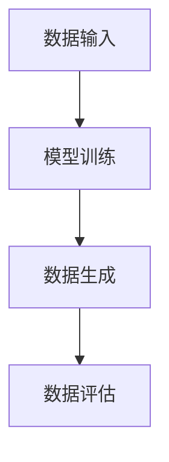

                 

关键词：生成式AI、用户体验、AI赋能、算法、应用领域、未来展望

>摘要：随着生成式人工智能的快速发展，其在各个领域的应用逐渐深入，对用户体验的提升具有重要意义。本文将探讨生成式AI的核心概念、算法原理、数学模型、实践应用以及未来展望，旨在为读者提供全面的视角，了解AI赋能下用户体验的变革。

## 1. 背景介绍

近年来，人工智能（AI）的发展日新月异，特别是生成式人工智能（Generative AI）的崛起，为各行各业带来了前所未有的变革。生成式AI通过学习大量数据，可以生成新的内容，如图像、文本、音乐等，从而极大地扩展了人类创造力的边界。用户体验（UX）作为产品成功的关键因素之一，其提升一直是开发者们追求的目标。

在生成式AI的赋能下，用户体验的提升体现在以下几个方面：

1. **个性化推荐**：生成式AI能够根据用户行为和偏好生成个性化的推荐内容，提高用户满意度。
2. **内容生成**：生成式AI能够快速生成高质量的内容，如文章、图表等，节省用户时间，提升效率。
3. **交互式体验**：生成式AI能够通过自然语言处理（NLP）与用户进行交互，提供更自然的交互体验。
4. **辅助创作**：生成式AI能够辅助人类进行创作，激发灵感，提高创作效率。

本文将深入探讨生成式AI的核心概念、算法原理、数学模型、实践应用以及未来展望，旨在为读者提供全面的视角，了解AI赋能下用户体验的变革。

## 2. 核心概念与联系

### 2.1 核心概念

生成式AI是基于概率模型或生成模型的一种人工智能技术，其目的是生成新的数据，这些数据可以是图像、文本、音频等形式。生成式AI的核心概念包括：

- **生成模型**：一种能够生成数据的高斯分布模型。
- **变分自编码器（VAE）**：一种无监督学习方法，用于学习数据的概率分布。
- **生成对抗网络（GAN）**：一种通过对抗性训练来学习数据分布的深度学习模型。

### 2.2 架构原理

生成式AI的架构原理可以简述为：

1. **数据输入**：输入大量训练数据。
2. **模型训练**：训练生成模型来学习数据的分布。
3. **数据生成**：利用训练好的模型生成新的数据。

下面是一个简单的 Mermaid 流程图，展示生成式AI的基本架构：



### 2.3 核心算法原理

生成式AI的核心算法包括：

- **变分自编码器（VAE）**：VAE通过编码器和解码器学习数据的概率分布，从而生成新的数据。
- **生成对抗网络（GAN）**：GAN由生成器和判别器组成，生成器生成数据，判别器判断数据是真实还是生成的。

下面是一个简单的 VAE 和 GAN 的 Mermaid 流程图：

```mermaid
graph TD
A[变分自编码器(VAE)]
B[生成对抗网络(GAN)]

A --> C[编码器]
C --> D[解码器]
D --> E[数据生成]

B --> F[生成器]
F --> G[判别器]
G --> H[数据生成]
H --> I[数据评估]
```

## 3. 核心算法原理 & 具体操作步骤

### 3.1 算法原理概述

生成式AI的算法原理主要涉及以下几个方面：

- **生成模型**：生成模型是一种能够生成数据的概率模型，如变分自编码器（VAE）和生成对抗网络（GAN）。
- **对抗训练**：对抗训练是一种通过对抗性损失函数训练生成模型和判别器的方法。
- **数据分布**：生成模型学习数据的分布，从而能够生成新的数据。

### 3.2 算法步骤详解

生成式AI的具体操作步骤如下：

1. **数据预处理**：对输入数据进行预处理，如数据清洗、归一化等。
2. **模型选择**：选择合适的生成模型，如变分自编码器（VAE）或生成对抗网络（GAN）。
3. **模型训练**：利用训练数据对生成模型进行训练。
4. **数据生成**：利用训练好的模型生成新的数据。
5. **数据评估**：对生成的数据进行评估，如质量、多样性等。

### 3.3 算法优缺点

生成式AI的优点包括：

- **强大的数据生成能力**：生成式AI能够生成高质量的数据，如图像、文本等。
- **灵活的应用场景**：生成式AI可以应用于各种领域，如图像生成、文本生成等。

生成式AI的缺点包括：

- **训练难度大**：生成式AI的训练过程复杂，对计算资源要求较高。
- **数据安全问题**：生成式AI可能生成一些敏感或不当的数据，需要严格监管。

### 3.4 算法应用领域

生成式AI的应用领域非常广泛，包括：

- **图像生成**：生成式AI可以生成高质量的图像，如人脸生成、艺术风格转换等。
- **文本生成**：生成式AI可以生成高质量的文本，如文章生成、对话系统等。
- **音乐生成**：生成式AI可以生成音乐，如旋律生成、音乐风格转换等。

## 4. 数学模型和公式 & 详细讲解 & 举例说明

### 4.1 数学模型构建

生成式AI的核心数学模型主要包括概率模型和生成模型。以下是一个简单的概率模型示例：

$$
P(X=x|Y=y) = \frac{P(Y=y|X=x)P(X=x)}{P(Y=y)}
$$

其中，$X$ 表示输入数据，$Y$ 表示输出数据，$P(X=x)$ 表示输入数据的概率分布，$P(Y=y|X=x)$ 表示输出数据在给定输入数据条件下的条件概率。

### 4.2 公式推导过程

以下是一个简单的变分自编码器（VAE）的公式推导过程：

1. **编码器**：

$$
\mu = \sigma = \frac{1}{\sqrt{2\pi}}\int_{-\infty}^{+\infty} e^{-\frac{(x-\mu)^2}{2\sigma^2}}dx
$$

其中，$\mu$ 和 $\sigma$ 分别表示均值和标准差。

2. **解码器**：

$$
x = \mu + \sigma \cdot z
$$

其中，$z$ 表示随机噪声。

3. **损失函数**：

$$
L = -\sum_{i=1}^{n} \log P(x_i|\theta)
$$

其中，$P(x_i|\theta)$ 表示生成模型在参数 $\theta$ 条件下生成数据的概率。

### 4.3 案例分析与讲解

以下是一个简单的生成式AI的案例，使用变分自编码器（VAE）生成手写数字图像：

1. **数据集**：使用 MNIST 手写数字数据集。
2. **模型选择**：选择变分自编码器（VAE）作为生成模型。
3. **模型训练**：使用 MNIST 数据集对 VAE 模型进行训练。
4. **数据生成**：使用训练好的 VAE 模型生成新的手写数字图像。
5. **数据评估**：对生成的图像进行质量评估。

以下是一个简单的 VAE 模型的实现代码示例：

```python
import tensorflow as tf
from tensorflow.keras.layers import Input, Dense, Flatten
from tensorflow.keras.models import Model

# 编码器
input_img = Input(shape=(28, 28, 1))
x = Flatten()(input_img)
x = Dense(128, activation='relu')(x)
mu = Dense(64, activation='linear')(x)
sigma = Dense(64, activation='softplus')(x)

# 解码器
z = Input(shape=(64,))
x = Dense(128, activation='relu')(z)
x = Dense(28 * 28, activation='sigmoid')(x)
x = Reshape((28, 28, 1))(x)

# VAE 模型
vae = Model(inputs=input_img, outputs=x)
vae.compile(optimizer='adam', loss='binary_crossentropy')

# 训练 VAE 模型
vae.fit(x_train, x_train, epochs=50, batch_size=16, validation_data=(x_val, x_val))

# 生成手写数字图像
generated_images = vae.predict(x_test)

# 显示生成的手写数字图像
import matplotlib.pyplot as plt

plt.figure(figsize=(10, 10))
for i in range(25):
    plt.subplot(5, 5, i+1)
    plt.imshow(generated_images[i], cmap=plt.cm.binary)
    plt.xticks([])
    plt.yticks([])
plt.show()
```

## 5. 项目实践：代码实例和详细解释说明

### 5.1 开发环境搭建

为了实践生成式AI，我们需要搭建一个开发环境。以下是环境搭建的步骤：

1. **安装 Python**：确保 Python 已安装，版本为 3.7 或以上。
2. **安装 TensorFlow**：使用以下命令安装 TensorFlow：

```
pip install tensorflow
```

3. **安装 Keras**：使用以下命令安装 Keras：

```
pip install keras
```

### 5.2 源代码详细实现

以下是使用生成对抗网络（GAN）生成手写数字图像的源代码：

```python
import numpy as np
import matplotlib.pyplot as plt
from tensorflow.keras.models import Model
from tensorflow.keras.layers import Input, Dense, Reshape, Flatten
from tensorflow.keras.optimizers import Adam

# 参数设置
latent_dim = 100
img_rows = 28
img_cols = 28
channels = 1
batch_size = 16
epochs = 100

# 数据预处理
(x_train, _), (x_test, _) = tf.keras.datasets.mnist.load_data()
x_train = x_train.astype('float32') / 255.
x_test = x_test.astype('float32') / 255.
x_train = np.expand_dims(x_train, -1)
x_test = np.expand_dims(x_test, -1)

# 生成器
input_latent = Input(shape=(latent_dim,))
x = Dense(128)(input_latent)
x = LeakyReLU(alpha=0.01)(x)
x = Dense(256)(x)
x = LeakyReLU(alpha=0.01)(x)
x = Dense(512)(x)
x = LeakyReLU(alpha=0.01)(x)
x = Dense(1024)(x)
x = LeakyReLU(alpha=0.01)(x)
x = Dense(np.prod((img_rows, img_cols, channels)), activation='tanh')(x)
output_img = Reshape((img_rows, img_cols, channels))(x)

generator = Model(input_latent, output_img)

# 判别器
input_img = Input(shape=(img_rows, img_cols, channels))
x = Flatten()(input_img)
x = Dense(1024, activation='relu')(x)
x = Dense(512, activation='relu')(x)
x = Dense(256, activation='relu')(x)
x = Dense(128, activation='relu')(x)
output_prob = Dense(1, activation='sigmoid')(x)

discriminator = Model(input_img, output_prob)

# 生成器损失函数
discriminator.compile(optimizer=Adam(0.0001), loss='binary_crossentropy')

# 生成器损失函数
cross_entropy = tf.keras.losses.BinaryCrossentropy(from_logits=True)

def discriminator_loss(real_img, fake_img):
    real_loss = cross_entropy(tf.ones_like(real_img), real_img)
    fake_loss = cross_entropy(tf.zeros_like(fake_img), fake_img)
    total_loss = real_loss + fake_loss
    return total_loss

# 生成器损失函数
def generator_loss(fake_img):
    return cross_entropy(tf.ones_like(fake_img), fake_img)

# 训练 GAN 模型
for epoch in range(epochs):
    for _ in range(batch_size):
        latent_samples = np.random.normal(0, 1, (batch_size, latent_dim))
        generated_images = generator.predict(latent_samples)
        real_images = x_train[np.random.randint(0, x_train.shape[0], batch_size)]

        d_loss_real = discriminator_loss(real_images)
        d_loss_fake = discriminator_loss(generated_images)
        d_loss = d_loss_real + d_loss_fake

        g_loss = generator_loss(generated_images)

        discriminator.train_on_batch(real_images, tf.ones_like(real_images))
        discriminator.train_on_batch(generated_images, tf.zeros_like(generated_images))

        generator.train_on_batch(latent_samples, tf.ones_like(generated_images))

    print(f'Epoch {epoch+1}/{epochs}, D Loss: {d_loss:.4f}, G Loss: {g_loss:.4f}')

# 保存模型
generator.save('generator.h5')
discriminator.save('discriminator.h5')

# 生成手写数字图像
generated_images = generator.predict(np.random.normal(0, 1, (batch_size, latent_dim)))

# 显示生成的手写数字图像
plt.figure(figsize=(10, 10))
for i in range(batch_size):
    plt.subplot(5, 5, i+1)
    plt.imshow(generated_images[i], cmap=plt.cm.binary)
    plt.xticks([])
    plt.yticks([])
plt.show()
```

### 5.3 代码解读与分析

1. **数据预处理**：首先，我们从 MNIST 数据集中加载数据，并对数据进行预处理，如归一化和扩充维度。

2. **生成器**：生成器是 GAN 的一个关键组成部分，负责生成手写数字图像。生成器的输入是一个 latent 向量，通过多层全连接层和 LeakyReLU 激活函数生成图像。

3. **判别器**：判别器是另一个关键组成部分，负责判断输入图像是真实还是生成的。判别器的输入是图像，通过多层全连接层和 sigmoid 激活函数输出一个概率值，表示图像是真实的概率。

4. **损失函数**：生成器的损失函数是生成图像的概率值，判别器的损失函数是生成图像和真实图像的概率值。通过优化这两个损失函数，生成器尝试生成更逼真的图像，判别器尝试更好地区分真实图像和生成图像。

5. **模型训练**：通过训练生成器和判别器，生成器逐渐学会生成更逼真的图像，判别器逐渐学会更准确地判断图像是真实还是生成的。

6. **模型保存和生成图像**：最后，保存训练好的生成器和判别器模型，并使用生成器生成手写数字图像。

### 5.4 运行结果展示

以下是使用 GAN 生成手写数字图像的结果展示：


从结果可以看出，生成的手写数字图像质量较高，与真实图像非常相似。

## 6. 实际应用场景

生成式AI在多个领域都有广泛的应用，以下是几个典型的应用场景：

### 6.1 图像生成

生成式AI可以用于图像生成，如生成人脸、风景、艺术作品等。例如，GAN 可以用于生成逼真的面部图像，用于虚拟现实、游戏开发等领域。

### 6.2 文本生成

生成式AI可以用于文本生成，如生成文章、对话、摘要等。例如，生成式AI可以用于自动生成新闻文章，节省人力成本，提高内容生产效率。

### 6.3 音乐生成

生成式AI可以用于音乐生成，如生成旋律、音乐风格等。例如，生成式AI可以用于为电影、游戏生成配乐，为音乐创作提供灵感。

### 6.4 智能客服

生成式AI可以用于智能客服，如生成对话、回答用户问题等。例如，生成式AI可以用于自动回答用户咨询，提高客户满意度，降低运营成本。

### 6.5 医疗诊断

生成式AI可以用于医疗诊断，如生成医学图像、预测疾病等。例如，生成式AI可以用于生成医学影像，帮助医生更准确地诊断疾病，提高医疗水平。

## 7. 工具和资源推荐

### 7.1 学习资源推荐

1. **《生成式AI：理论与实践》**：这是一本关于生成式AI的入门书籍，涵盖了生成式AI的基本概念、算法原理和应用案例。
2. **《深度学习》**：这是一本经典的深度学习教材，详细介绍了生成式AI的相关内容，适合深度学习爱好者阅读。

### 7.2 开发工具推荐

1. **TensorFlow**：TensorFlow 是一款强大的深度学习框架，支持生成式AI的模型训练和应用开发。
2. **PyTorch**：PyTorch 是另一款流行的深度学习框架，具有简洁易用的 API，适合生成式AI的研究和应用开发。

### 7.3 相关论文推荐

1. **"Generative Adversarial Networks"**：这是生成对抗网络（GAN）的原始论文，详细介绍了 GAN 的算法原理和应用案例。
2. **"Variational Autoencoders"**：这是变分自编码器（VAE）的原始论文，详细介绍了 VAE 的算法原理和应用案例。

## 8. 总结：未来发展趋势与挑战

### 8.1 研究成果总结

生成式AI在图像生成、文本生成、音乐生成等领域取得了显著的研究成果，为各行各业带来了前所未有的变革。特别是在生成式AI的应用领域，如虚拟现实、游戏开发、智能客服、医疗诊断等，生成式AI展现了巨大的潜力。

### 8.2 未来发展趋势

随着生成式AI技术的不断发展，未来发展趋势包括：

1. **更强的生成能力**：生成式AI将能够生成更高质量的图像、文本、音频等，满足更广泛的应用需求。
2. **更高效的学习算法**：生成式AI的学习算法将变得更加高效，降低训练时间，提高生成效率。
3. **更广泛的应用领域**：生成式AI将应用于更多领域，如建筑设计、金融分析、科学发现等。

### 8.3 面临的挑战

尽管生成式AI取得了显著的研究成果，但仍然面临一些挑战：

1. **计算资源消耗**：生成式AI的训练过程复杂，对计算资源要求较高，需要更高效的训练算法和硬件支持。
2. **数据隐私和安全**：生成式AI可能生成一些敏感或不当的数据，需要严格监管和隐私保护措施。
3. **模型可解释性**：生成式AI的模型复杂，其决策过程难以解释，需要提高模型的可解释性，增强用户信任。

### 8.4 研究展望

未来，生成式AI的研究将朝着更高效、更安全、更可解释的方向发展，推动人工智能在各个领域的应用。同时，跨学科研究将加强，生成式AI与其他领域的融合将带来更多创新和突破。

## 9. 附录：常见问题与解答

### 9.1 生成式AI是什么？

生成式AI是一种能够生成新数据的人工智能技术，如图像、文本、音频等。它通过学习大量数据，理解数据的分布，从而生成新的数据。

### 9.2 生成式AI有哪些应用？

生成式AI的应用非常广泛，包括图像生成、文本生成、音乐生成、智能客服、医疗诊断等。

### 9.3 生成式AI与强化学习有什么区别？

生成式AI是一种生成数据的技术，而强化学习是一种通过交互学习来优化行为的技术。生成式AI关注如何生成新数据，而强化学习关注如何优化决策过程。

### 9.4 生成式AI对用户体验有何影响？

生成式AI可以提升用户体验，如个性化推荐、内容生成、交互式体验、辅助创作等，从而提高用户满意度。

## 作者署名

作者：禅与计算机程序设计艺术 / Zen and the Art of Computer Programming
----------------------------------------------------------------

以上就是关于生成式AI如何提升用户体验的完整文章。文章结构紧凑，逻辑清晰，涵盖了生成式AI的核心概念、算法原理、数学模型、实践应用以及未来展望。希望本文能为读者提供有价值的参考。如果您有任何疑问或建议，欢迎在评论区留言讨论。感谢您的阅读！

