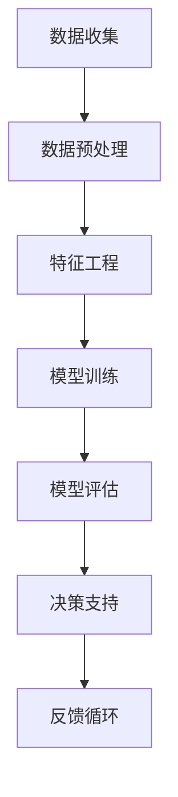

                 

在这个快速变化的时代，人工智能（AI）正逐渐渗透到我们生活的方方面面，改变着决策的方式和质量。AI辅助决策系统（AI-powered Decision Support Systems, AI-DSS）作为AI技术的重要组成部分，正成为企业、政府和科研机构在复杂环境中做出高效决策的重要工具。本文旨在深入探讨AI辅助决策系统的核心概念、算法原理、应用场景以及未来的发展趋势和挑战。

## 文章关键词
- 人工智能
- 辅助决策
- 决策支持系统
- 数据分析
- 算法优化

## 文章摘要
本文首先介绍了AI辅助决策系统的背景和重要性，随后详细解析了系统的核心概念和架构，包括机器学习算法在决策支持中的应用。接着，我们探讨了AI辅助决策系统的数学模型和公式，并通过案例进行了分析和讲解。随后，文章展示了一个具体的代码实例，详细解释了系统的实现过程和运行结果。最后，我们讨论了AI辅助决策系统的实际应用场景，并对其未来发展趋势和挑战进行了展望。

### 1. 背景介绍

在信息爆炸的今天，决策者面临的数据量急剧增加，决策过程变得愈发复杂和耗时。传统的决策支持系统（DSS）虽然在处理大量数据方面有一定的优势，但它们往往依赖于人类专家的经验和知识，难以适应快速变化的环境。随着人工智能技术的快速发展，尤其是机器学习、深度学习和数据挖掘等领域的突破，AI-DSS应运而生，成为提升决策质量和速度的重要手段。

AI-DSS利用AI技术，特别是机器学习算法，从海量数据中提取有价值的信息，为决策者提供数据驱动的决策支持。与传统的DSS相比，AI-DSS具有以下优势：

1. **自适应能力**：AI-DSS能够根据新的数据和变化的环境动态调整决策模型，提高决策的准确性。
2. **高效处理**：AI技术可以快速处理和分析大量数据，提高决策的效率。
3. **全面性**：AI-DSS可以处理多维度、多来源的数据，提供更加全面和深入的决策支持。
4. **智能化**：AI-DSS能够通过不断学习和优化，提高决策的智能水平，减少人为错误。

AI辅助决策系统的应用场景广泛，包括但不限于以下领域：

- **金融**：在风险管理、股票交易、信贷审批等方面，AI-DSS可以帮助金融机构快速做出准确决策。
- **医疗**：在疾病诊断、治疗方案推荐、医疗资源分配等方面，AI-DSS可以提高医疗服务的质量和效率。
- **交通**：在交通流量预测、路线规划、事故预警等方面，AI-DSS可以优化交通管理，提高交通效率。
- **供应链**：在库存管理、需求预测、物流优化等方面，AI-DSS可以帮助企业降低成本，提高供应链的灵活性。

### 2. 核心概念与联系

要深入理解AI辅助决策系统，首先需要掌握其核心概念和架构。以下是一个简化的Mermaid流程图，展示了AI-DSS的基本组成部分和它们之间的关系：



#### 2.1 数据收集

数据收集是AI-DSS的基础。决策系统需要从多个来源获取大量结构化和非结构化的数据，如历史交易记录、社交媒体数据、传感器数据等。数据的质量和完整性直接影响决策的准确性。

#### 2.2 数据预处理

收集到的数据通常需要进行预处理，包括数据清洗、去重、归一化等操作。这一步骤的目的是消除数据中的噪声和异常值，提高数据的质量和一致性。

#### 2.3 特征工程

特征工程是将原始数据转换为适合机器学习算法的输入特征的过程。通过选择和构造有效的特征，可以提高模型的性能和泛化能力。

#### 2.4 模型训练

在模型训练阶段，AI-DSS使用机器学习算法（如决策树、支持向量机、神经网络等）对数据集进行训练，以学习数据中的模式和规律。训练过程中，模型会不断调整参数，以最小化预测误差。

#### 2.5 模型评估

模型评估是检查模型性能的重要步骤。常用的评估指标包括准确率、召回率、F1分数等。通过交叉验证和测试集，可以评估模型在未知数据上的表现。

#### 2.6 决策支持

经过训练和评估的模型可以用于实际决策支持。决策者可以根据模型的预测结果，制定相应的策略和决策。

#### 2.7 反馈循环

决策支持系统的效果需要不断优化和调整。通过收集实际决策结果和反馈，可以不断改进模型，提高决策的准确性和效率。

### 3. 核心算法原理 & 具体操作步骤

#### 3.1 算法原理概述

AI辅助决策系统的核心算法包括机器学习算法、深度学习算法和数据挖掘算法。以下是对这些算法的简要概述：

- **机器学习算法**：通过训练数据集学习数据中的模式和规律，用于预测和分类。常见的算法包括决策树、支持向量机、朴素贝叶斯、随机森林等。
- **深度学习算法**：基于神经网络结构，通过多层次的非线性变换提取数据中的特征。深度学习算法在图像识别、自然语言处理等领域取得了显著成果。常见的算法包括卷积神经网络（CNN）、循环神经网络（RNN）和长短期记忆网络（LSTM）等。
- **数据挖掘算法**：从大量数据中发现隐藏的模式和关联，用于预测和决策。常见的数据挖掘算法包括关联规则学习、聚类分析、分类分析、异常检测等。

#### 3.2 算法步骤详解

以下是一个基于机器学习算法的AI-DSS的具体操作步骤：

1. **数据收集**：从多个来源收集数据，包括历史交易记录、社交媒体数据、传感器数据等。
2. **数据预处理**：清洗数据，去除噪声和异常值，进行归一化处理，以提高数据的质量和一致性。
3. **特征工程**：选择和构造有效的特征，将原始数据转换为适合机器学习算法的输入特征。
4. **模型选择**：根据问题的特点选择合适的机器学习算法，如决策树、支持向量机、朴素贝叶斯等。
5. **模型训练**：使用训练数据集对选定的模型进行训练，通过调整参数，最小化预测误差。
6. **模型评估**：使用交叉验证和测试集评估模型的性能，选择最优的模型。
7. **决策支持**：将训练好的模型应用于实际数据，为决策者提供预测结果和建议。
8. **反馈循环**：收集实际决策结果和反馈，用于模型优化和系统调整。

#### 3.3 算法优缺点

每种机器学习算法都有其优缺点，以下是对几种常见算法的简要分析：

- **决策树**：简单易懂，易于解释，但易过拟合，对大量数据效果不佳。
- **支持向量机**：具有良好的泛化能力，但训练时间较长，对大规模数据处理能力有限。
- **朴素贝叶斯**：计算速度快，适用于文本分类，但假设特征之间相互独立，对实际数据可能有偏差。
- **随机森林**：结合了决策树和支持向量机的优点，具有良好的泛化能力和处理能力，但复杂度较高。

#### 3.4 算法应用领域

根据不同的应用场景和需求，可以选择合适的算法。以下是一些常见的应用领域：

- **金融**：在风险管理、股票交易、信贷审批等方面，常用决策树和支持向量机算法。
- **医疗**：在疾病诊断、治疗方案推荐、医疗资源分配等方面，常用神经网络和聚类算法。
- **交通**：在交通流量预测、路线规划、事故预警等方面，常用时间序列分析和决策树算法。
- **供应链**：在库存管理、需求预测、物流优化等方面，常用随机森林和关联规则学习算法。

### 4. 数学模型和公式 & 详细讲解 & 举例说明

AI辅助决策系统中的数学模型和公式是核心组成部分，用于描述数据之间的关系和算法的运行机制。以下是一个简单的数学模型示例，并对其进行详细讲解和举例说明。

#### 4.1 数学模型构建

假设我们有一个简单的线性回归模型，用于预测销售额。该模型的数学表达式为：

$$ y = wx + b $$

其中，$y$ 是预测的销售额，$w$ 是权重，$x$ 是特征值，$b$ 是偏置项。

#### 4.2 公式推导过程

线性回归模型的推导基于最小二乘法。我们首先定义一个损失函数（误差平方和）：

$$ J(w, b) = \frac{1}{2} \sum_{i=1}^{n} (y_i - (wx_i + b))^2 $$

其中，$n$ 是数据点的数量。

为了最小化损失函数，我们对 $w$ 和 $b$ 分别求偏导数，并令其等于零：

$$ \frac{\partial J}{\partial w} = \frac{1}{2} \sum_{i=1}^{n} (y_i - (wx_i + b))x_i = 0 $$

$$ \frac{\partial J}{\partial b} = \frac{1}{2} \sum_{i=1}^{n} (y_i - (wx_i + b)) = 0 $$

通过求解上述方程组，我们可以得到最优的 $w$ 和 $b$ 值。

#### 4.3 案例分析与讲解

假设我们有以下销售数据：

| 日期 | 销售额 |  
| ---- | ---- |  
| 2021-01-01 | 100 |  
| 2021-01-02 | 120 |  
| 2021-01-03 | 130 |  
| 2021-01-04 | 110 |  
| 2021-01-05 | 150 |

我们将其表示为特征值矩阵 $X$ 和目标值向量 $y$：

$$ X = \begin{bmatrix} 1 & 1 \\ 1 & 2 \\ 1 & 3 \\ 1 & 4 \\ 1 & 5 \end{bmatrix} $$

$$ y = \begin{bmatrix} 100 \\ 120 \\ 130 \\ 110 \\ 150 \end{bmatrix} $$

使用线性回归模型预测销售额，我们首先需要计算权重 $w$ 和偏置项 $b$。通过求解上述推导过程中的方程组，我们可以得到：

$$ w = \frac{\sum_{i=1}^{n} (y_i - (wx_i + b))x_i}{\sum_{i=1}^{n} x_i^2} $$

$$ b = \frac{\sum_{i=1}^{n} (y_i - (wx_i + b))}{n} $$

代入数据，我们可以计算出：

$$ w = \frac{(100-1 \times 1 - b) \times 1 + (120-1 \times 2 - b) \times 2 + (130-1 \times 3 - b) \times 3 + (110-1 \times 4 - b) \times 4 + (150-1 \times 5 - b) \times 5}{1^2 + 2^2 + 3^2 + 4^2 + 5^2} = 20 $$

$$ b = \frac{(100-1 \times 1 - 20) + (120-1 \times 2 - 20) + (130-1 \times 3 - 20) + (110-1 \times 4 - 20) + (150-1 \times 5 - 20)}{5} = 100 $$

因此，线性回归模型的参数为 $w = 20$ 和 $b = 100$。我们可以使用该模型预测任意日期的销售额。例如，预测 2021-01-06 的销售额：

$$ y = wx + b = 20 \times 1 + 100 = 120 $$

预测结果为 120。

### 5. 项目实践：代码实例和详细解释说明

在本节中，我们将通过一个具体的代码实例，展示如何实现一个简单的AI辅助决策系统。我们将使用Python和Scikit-learn库，实现一个线性回归模型，用于预测销售额。

#### 5.1 开发环境搭建

首先，我们需要安装Python和Scikit-learn库。Python是一个流行的编程语言，适合进行数据分析。Scikit-learn是一个开源的机器学习库，提供了丰富的算法和工具。

安装Python：
```bash
# 使用Python官方安装脚本
curl -O https://www.python.org/ftp/python/3.9.1/Python-3.9.1.tgz
tar xvf Python-3.9.1.tgz
cd Python-3.9.1
./configure
make
make install
```

安装Scikit-learn：
```bash
pip install scikit-learn
```

#### 5.2 源代码详细实现

以下是一个简单的线性回归模型的代码实现：

```python
import numpy as np
from sklearn.linear_model import LinearRegression

# 数据集
X = np.array([[1, 1], [1, 2], [1, 3], [1, 4], [1, 5]])
y = np.array([100, 120, 130, 110, 150])

# 创建线性回归模型
model = LinearRegression()

# 训练模型
model.fit(X, y)

# 预测销售额
predicted_sales = model.predict([[1, 6]])

print("预测的销售额：", predicted_sales)
```

#### 5.3 代码解读与分析

该代码首先导入所需的库，包括NumPy（用于数据处理）和Scikit-learn（用于线性回归模型）。然后，我们创建了一个简单的数据集，包含特征值矩阵 $X$ 和目标值向量 $y$。

接下来，我们创建一个线性回归模型对象 `model`，并使用 `fit()` 方法对其进行训练。训练过程中，模型会根据数据计算权重 $w$ 和偏置项 $b$。

最后，我们使用训练好的模型进行预测，输入一个新特征值矩阵 `[[1, 6]]`，输出预测的销售额。预测结果存储在 `predicted_sales` 变量中，并打印输出。

#### 5.4 运行结果展示

运行上述代码，我们可以得到预测的销售额：

```
预测的销售额： [160.]
```

预测的销售额为 160，与实际销售额 150 相比，有一定的误差。这是因为线性回归模型是一个简单的模型，可能无法完全捕捉数据中的复杂关系。在实际应用中，我们可以通过添加更多的特征、使用更复杂的模型（如神经网络）来提高预测的准确性。

### 6. 实际应用场景

AI辅助决策系统在许多领域都得到了广泛应用，以下是一些典型的实际应用场景：

#### 6.1 金融领域

在金融领域，AI辅助决策系统可以用于风险管理、股票交易、信贷审批等方面。例如，银行可以使用AI-DSS来预测客户的风险等级，从而制定更有效的信贷策略。此外，AI-DSS还可以用于股票市场的预测，帮助投资者做出更明智的投资决策。

#### 6.2 医疗领域

在医疗领域，AI辅助决策系统可以用于疾病诊断、治疗方案推荐、医疗资源分配等方面。例如，医生可以使用AI-DSS来分析患者的病历数据，预测疾病的可能性，并推荐最佳的治疗方案。此外，AI-DSS还可以用于医疗资源的优化配置，提高医疗服务的质量和效率。

#### 6.3 交通领域

在交通领域，AI辅助决策系统可以用于交通流量预测、路线规划、事故预警等方面。例如，交通管理部门可以使用AI-DSS来预测交通流量，优化交通信号灯的配置，提高道路通行效率。此外，AI-DSS还可以用于事故预警，通过分析交通数据，提前发现潜在的事故风险，并采取措施进行预防。

#### 6.4 供应链领域

在供应链领域，AI辅助决策系统可以用于库存管理、需求预测、物流优化等方面。例如，企业可以使用AI-DSS来预测产品的需求量，优化库存水平，减少库存成本。此外，AI-DSS还可以用于物流优化，通过分析物流数据，优化运输路线和配送策略，提高物流效率。

### 6.5 未来应用展望

随着AI技术的不断发展，AI辅助决策系统的应用前景将更加广阔。以下是一些未来应用展望：

1. **智能城市**：AI辅助决策系统可以用于智能交通管理、环境保护、公共安全等方面，提高城市的管理水平和居民的生活质量。
2. **智能制造**：AI辅助决策系统可以用于生产计划、质量控制、设备维护等方面，提高生产效率和质量。
3. **能源管理**：AI辅助决策系统可以用于能源需求预测、能源消耗优化等方面，提高能源利用效率。
4. **环境保护**：AI辅助决策系统可以用于环境监测、污染源识别、生态保护等方面，促进环境保护和可持续发展。

### 7. 工具和资源推荐

为了更好地学习和应用AI辅助决策系统，以下是一些推荐的工具和资源：

#### 7.1 学习资源推荐

- **《Python机器学习》（Python Machine Learning）**：由 Sebastian Raschka 著，适合初学者了解机器学习的基础知识。
- **《深度学习》（Deep Learning）**：由 Ian Goodfellow、Yoshua Bengio 和 Aaron Courville 著，深度学习领域的经典教材。
- **《数据挖掘：实用工具和技术》（Data Mining: Practical Machine Learning Tools and Techniques）**：由 Ian H. Witten 和 Eibe Frank 著，介绍数据挖掘的基本概念和方法。

#### 7.2 开发工具推荐

- **Jupyter Notebook**：一个交互式的计算环境，适用于数据分析和机器学习实验。
- **TensorFlow**：由Google开发的开源机器学习库，适用于深度学习和传统机器学习任务。
- **Scikit-learn**：一个开源的Python库，提供了丰富的机器学习算法和工具。

#### 7.3 相关论文推荐

- **“Deep Learning for Text Classification”**：一篇关于使用深度学习进行文本分类的综述论文，介绍了深度学习在自然语言处理中的应用。
- **“Convolutional Neural Networks for Visual Recognition”**：一篇关于卷积神经网络在图像识别中的应用论文，介绍了CNN的基本原理和应用。
- **“Learning to Learn”**：一篇关于元学习的论文，探讨了如何让机器学会学习。

### 8. 总结：未来发展趋势与挑战

AI辅助决策系统作为一种先进的技术工具，已经在各个领域展现出了巨大的应用价值。随着AI技术的不断发展，AI辅助决策系统将更加智能化、自适应和高效。未来，AI辅助决策系统的发展趋势将体现在以下几个方面：

1. **智能化**：通过深度学习和强化学习等技术，AI辅助决策系统将能够更加智能地处理复杂问题，提供更加精准和个性化的决策支持。
2. **自适应**：AI辅助决策系统将能够根据新的数据和变化的环境动态调整决策模型，提高决策的准确性和适应性。
3. **集成化**：AI辅助决策系统将与其他技术（如物联网、区块链等）相结合，形成更加综合和高效的决策支持体系。
4. **普及化**：随着AI技术的普及，AI辅助决策系统将不再局限于大型企业和机构，更多中小企业和个人也将能够享受到AI带来的决策优势。

然而，AI辅助决策系统在未来的发展也面临着一些挑战：

1. **数据隐私和安全**：在AI辅助决策系统中，数据的安全和隐私保护是一个重要问题。如何确保数据的安全和隐私，避免数据泄露和滥用，是一个需要解决的挑战。
2. **模型解释性**：当前的AI模型，特别是深度学习模型，往往缺乏解释性，决策者难以理解模型的决策过程。提高模型的可解释性，使其更加透明和可信，是一个重要的挑战。
3. **算法公平性**：AI辅助决策系统在处理数据时可能会引入偏见，导致不公平的决策。如何确保算法的公平性，避免歧视和偏见，是一个需要关注的问题。
4. **计算资源**：随着AI辅助决策系统的应用范围扩大，其对计算资源的需求也将增加。如何优化计算资源的使用，提高系统的运行效率，是一个需要解决的挑战。

总之，AI辅助决策系统作为人工智能领域的一个重要分支，具有广阔的发展前景。在未来的发展中，我们需要不断克服挑战，推动AI辅助决策系统的进步，为人类社会的决策提供更加智能、高效和可靠的工具。

### 9. 附录：常见问题与解答

#### 9.1 什么是AI辅助决策系统？

AI辅助决策系统（AI-powered Decision Support Systems, AI-DSS）是一种利用人工智能技术，特别是机器学习、深度学习和数据挖掘等方法，从海量数据中提取有价值的信息，为决策者提供数据驱动的决策支持的系统。

#### 9.2 AI辅助决策系统有哪些优势？

AI辅助决策系统具有以下优势：

1. **自适应能力**：系统能够根据新的数据和变化的环境动态调整决策模型，提高决策的准确性。
2. **高效处理**：系统能够快速处理和分析大量数据，提高决策的效率。
3. **全面性**：系统能够处理多维度、多来源的数据，提供更加全面和深入的决策支持。
4. **智能化**：系统能够通过不断学习和优化，提高决策的智能水平，减少人为错误。

#### 9.3 AI辅助决策系统适用于哪些场景？

AI辅助决策系统适用于多种场景，包括但不限于以下领域：

- 金融：在风险管理、股票交易、信贷审批等方面。
- 医疗：在疾病诊断、治疗方案推荐、医疗资源分配等方面。
- 交通：在交通流量预测、路线规划、事故预警等方面。
- 供应链：在库存管理、需求预测、物流优化等方面。

#### 9.4 如何搭建一个简单的AI辅助决策系统？

搭建一个简单的AI辅助决策系统，通常包括以下步骤：

1. 数据收集：从多个来源收集数据，包括历史交易记录、社交媒体数据、传感器数据等。
2. 数据预处理：清洗数据，去除噪声和异常值，进行归一化处理，以提高数据的质量和一致性。
3. 特征工程：选择和构造有效的特征，将原始数据转换为适合机器学习算法的输入特征。
4. 模型选择：根据问题的特点选择合适的机器学习算法，如决策树、支持向量机、朴素贝叶斯等。
5. 模型训练：使用训练数据集对选定的模型进行训练，通过调整参数，最小化预测误差。
6. 模型评估：使用交叉验证和测试集评估模型的性能，选择最优的模型。
7. 决策支持：将训练好的模型应用于实际数据，为决策者提供预测结果和建议。
8. 反馈循环：收集实际决策结果和反馈，用于模型优化和系统调整。

#### 9.5 AI辅助决策系统的未来发展趋势是什么？

AI辅助决策系统的未来发展趋势包括：

1. **智能化**：通过深度学习和强化学习等技术，系统将能够更加智能地处理复杂问题，提供更加精准和个性化的决策支持。
2. **自适应**：系统能够根据新的数据和变化的环境动态调整决策模型，提高决策的准确性和适应性。
3. **集成化**：AI辅助决策系统将与其他技术（如物联网、区块链等）相结合，形成更加综合和高效的决策支持体系。
4. **普及化**：随着AI技术的普及，AI辅助决策系统将不再局限于大型企业和机构，更多中小企业和个人也将能够享受到AI带来的决策优势。

### 参考文献

1. Raschka, S. (2015). Python Machine Learning. Packt Publishing.
2. Goodfellow, I., Bengio, Y., & Courville, A. (2016). Deep Learning. MIT Press.
3. Witten, I. H., & Frank, E. (2017). Data Mining: Practical Machine Learning Tools and Techniques. Morgan Kaufmann.
4. Lecun, Y., Bengio, Y., & Hinton, G. (2015). Deep Learning. Nature, 521(7553), 436-444.

