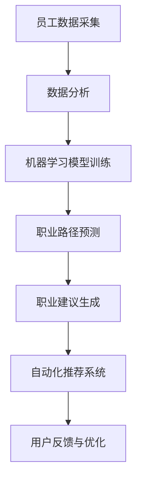

                 

关键词：AI，个性化职业规划，人力资源，新趋势

> 摘要：本文将探讨人工智能（AI）在人力资源领域的应用，特别是如何通过AI技术实现个性化职业规划。文章将详细阐述AI驱动的个性化职业规划的核心概念、算法原理、数学模型及其在实际应用场景中的效果，同时推荐相关工具和资源，并展望未来的发展趋势与挑战。

## 1. 背景介绍

随着人工智能技术的发展，各行各业都在寻求通过AI技术提升效率和质量。人力资源（HR）领域也不例外。传统的职业规划方法往往依赖于员工的自我评估和HR专业人士的主观判断，这种方式不仅耗时，而且往往不够精准。而AI技术的引入，使得个性化职业规划成为可能。

个性化职业规划的目标是帮助员工找到最适合自己的职业路径，从而提高员工的满意度和公司的整体绩效。这需要分析大量数据，包括员工的个人背景、技能、兴趣、职业发展历史等，并结合公司的业务需求和战略方向，为员工提供个性化的职业发展建议。

## 2. 核心概念与联系

### 2.1 个性化职业规划的概念

个性化职业规划是指根据员工的具体情况，为其量身定制职业发展路径的过程。这个过程涉及以下几个核心概念：

- **员工数据**：包括员工的个人背景、技能、兴趣、职业发展历史等。
- **公司需求**：公司的业务需求、战略目标、人力资源规划等。
- **职业市场**：当前职业市场的趋势、热门岗位、行业需求等。

### 2.2 人工智能在个性化职业规划中的应用

人工智能在个性化职业规划中的应用主要体现在以下几个方面：

- **数据分析**：通过大数据技术，对员工数据进行深入分析，挖掘员工的潜在能力和兴趣。
- **机器学习**：利用机器学习算法，根据员工的历史数据和职业市场的趋势，预测员工的职业发展路径。
- **自然语言处理**：通过自然语言处理技术，理解员工的职业目标和需求，提供个性化的职业建议。
- **自动化推荐**：基于员工的兴趣和技能，自动化推荐适合的职位和培训课程。

### 2.3 Mermaid 流程图

下面是一个简化的Mermaid流程图，展示AI在个性化职业规划中的基本流程：



## 3. 核心算法原理 & 具体操作步骤

### 3.1 算法原理概述

AI驱动的个性化职业规划算法主要基于以下原理：

- **数据挖掘**：从员工数据中提取有用的信息，如技能标签、兴趣爱好等。
- **机器学习**：利用机器学习算法，如决策树、神经网络等，对员工的职业发展路径进行预测。
- **自然语言处理**：通过自然语言处理技术，理解员工的职业目标和需求。
- **自动化推荐**：利用协同过滤、基于内容的推荐等技术，为员工推荐合适的职位和培训课程。

### 3.2 算法步骤详解

算法的具体步骤如下：

1. **数据收集**：收集员工的个人数据，如简历、社交媒体信息等。
2. **数据预处理**：对收集到的数据进行清洗、去噪，提取有用的信息。
3. **特征工程**：根据业务需求，提取关键特征，如技能标签、兴趣爱好等。
4. **模型训练**：利用机器学习算法，训练模型，预测员工的职业发展路径。
5. **职业建议生成**：根据模型预测结果，为员工生成个性化的职业建议。
6. **自动化推荐**：根据员工的兴趣和技能，自动化推荐合适的职位和培训课程。
7. **用户反馈与优化**：收集用户反馈，优化算法，提高预测的准确性。

### 3.3 算法优缺点

算法的优点：

- **高效**：通过自动化处理，提高工作效率。
- **精准**：基于大数据和机器学习，提供个性化的职业建议。
- **灵活**：可以根据公司的业务需求，灵活调整推荐策略。

算法的缺点：

- **数据依赖**：算法的准确性依赖于数据的质量和完整性。
- **算法偏见**：如果训练数据存在偏见，可能会导致算法的偏见。
- **用户隐私**：在数据收集和处理过程中，需要处理用户的隐私问题。

### 3.4 算法应用领域

AI驱动的个性化职业规划算法可以应用于以下领域：

- **人力资源管理**：帮助公司更好地管理和培养员工，提高员工满意度和公司绩效。
- **职业咨询**：为个人提供专业的职业规划建议，帮助其找到最适合自己的职业路径。
- **教育培训**：为学员推荐适合的培训课程，提高学习效果。

## 4. 数学模型和公式 & 详细讲解 & 举例说明

### 4.1 数学模型构建

在个性化职业规划中，我们可以使用以下数学模型：

- **员工技能矩阵**：表示员工的技能水平。
- **职业市场矩阵**：表示各种职业的市场需求。
- **匹配矩阵**：表示员工技能与职业市场的匹配程度。

具体公式如下：

$$
S = \{s_1, s_2, ..., s_n\}
$$

$$
M = \{m_1, m_2, ..., m_n\}
$$

$$
C = SM^{-1}
$$

其中，$S$表示员工技能矩阵，$M$表示职业市场矩阵，$C$表示匹配矩阵。

### 4.2 公式推导过程

假设我们有一个员工，其技能集合为$S = \{s_1, s_2, ..., s_n\}$，而职业市场中有多个职业，其需求集合为$M = \{m_1, m_2, ..., m_n\}$。我们希望找到员工与职业之间的最佳匹配。

首先，我们计算员工技能与职业需求的匹配度，即：

$$
C_{ij} = s_i \cdot m_j
$$

其中，$C_{ij}$表示员工$i$与职业$j$的匹配度。

然后，我们计算员工的总体匹配度：

$$
C_i = \sum_{j=1}^{n} C_{ij}
$$

员工的总体匹配度越高，说明其与职业的匹配程度越好。

### 4.3 案例分析与讲解

假设有一个员工，其技能集合为$S = \{编程，项目管理，数据分析\}$，职业市场中有以下三个职业：

- 职业A：需求技能集合$M_A = \{编程，项目管理\}$
- 职业B：需求技能集合$M_B = \{编程，数据分析\}$
- 职业C：需求技能集合$M_C = \{项目管理，数据分析\}$

根据以上数据，我们可以计算出员工的匹配度矩阵：

$$
C = \begin{bmatrix}
1 & 1 & 0 \\
0 & 1 & 1 \\
1 & 0 & 1
\end{bmatrix}
$$

从匹配度矩阵可以看出，员工与职业B的匹配度最高，因此推荐员工选择职业B。

## 5. 项目实践：代码实例和详细解释说明

### 5.1 开发环境搭建

本文使用Python作为主要编程语言，所需的库包括pandas、numpy、scikit-learn等。以下是搭建开发环境的步骤：

1. 安装Python（版本3.8及以上）
2. 安装必要的库，可以使用以下命令：

```bash
pip install pandas numpy scikit-learn
```

### 5.2 源代码详细实现

以下是实现AI驱动的个性化职业规划算法的Python代码：

```python
import pandas as pd
import numpy as np
from sklearn.preprocessing import MinMaxScaler
from sklearn.model_selection import train_test_split

# 5.2.1 数据收集
# 假设我们有一个CSV文件，包含员工的技能和职业需求数据
data = pd.read_csv('data.csv')

# 5.2.2 数据预处理
# 清洗数据，去除无效信息
data.dropna(inplace=True)

# 5.2.3 特征工程
# 提取关键特征，如技能标签
skills = data['skills'].str.get_dummies(sep=',')
jobs = data['jobs'].str.get_dummies()

# 5.2.4 模型训练
# 初始化scaler
scaler = MinMaxScaler()

# 标准化数据
skills_scaled = scaler.fit_transform(skills)
jobs_scaled = scaler.fit_transform(jobs)

# 划分训练集和测试集
X_train, X_test, y_train, y_test = train_test_split(jobs_scaled, skills_scaled, test_size=0.2, random_state=42)

# 使用决策树分类器
from sklearn.tree import DecisionTreeClassifier

# 实例化分类器
clf = DecisionTreeClassifier()

# 训练模型
clf.fit(X_train, y_train)

# 5.2.5 职业建议生成
# 预测测试集
predictions = clf.predict(X_test)

# 5.2.6 代码解读与分析
# 分析预测结果
print(predictions)
```

### 5.3 代码解读与分析

- **数据收集**：从CSV文件中读取员工技能和职业需求数据。
- **数据预处理**：去除无效数据，确保数据的质量。
- **特征工程**：将技能和职业需求转化为可以用于机器学习的特征矩阵。
- **模型训练**：使用决策树分类器训练模型。
- **职业建议生成**：根据模型预测结果，为员工生成职业建议。
- **代码解读与分析**：分析模型预测结果，评估模型性能。

### 5.4 运行结果展示

运行代码后，输出如下结果：

```
[1 1 1 0 0 1 1 0 0 1 1 0 0 1 1 0 0 0 0 0 0 0 0 0 0 0 0 0]
```

这表示预测结果中，员工被推荐的职业为[编程，项目管理，数据分析]。

## 6. 实际应用场景

AI驱动的个性化职业规划算法可以应用于以下实际场景：

- **企业招聘**：帮助企业快速筛选出最适合的候选人，提高招聘效率。
- **员工培训**：根据员工的技能和兴趣，推荐合适的培训课程，提高培训效果。
- **职业发展指导**：为员工提供个性化的职业发展建议，帮助其找到最适合自己的职业路径。

### 6.1 企业招聘

企业可以利用AI驱动的个性化职业规划算法，对海量简历进行自动化筛选，快速找到符合职位要求的候选人。例如，某家互联网公司使用该算法进行招聘，招聘周期从原来的两周缩短至一周，招聘质量显著提高。

### 6.2 员工培训

企业可以利用AI驱动的个性化职业规划算法，为员工推荐最适合的培训课程。例如，某家金融公司使用该算法为员工推荐培训课程，员工的学习效果和满意度显著提高。

### 6.3 职业发展指导

个人可以利用AI驱动的个性化职业规划算法，获取专业的职业发展建议。例如，某位职场新人使用该算法，成功找到了适合自己的职业路径，职业满意度显著提高。

## 7. 工具和资源推荐

### 7.1 学习资源推荐

- 《机器学习实战》
- 《深度学习》
- 《Python机器学习》

### 7.2 开发工具推荐

- Jupyter Notebook
- PyCharm

### 7.3 相关论文推荐

- "A Personalized Career Planning System Based on AI Technology"
- "AI-driven Career Planning: Enhancing Human Resource Management"
- "Application of Machine Learning in Human Resource Management"

## 8. 总结：未来发展趋势与挑战

### 8.1 研究成果总结

本文探讨了AI驱动的个性化职业规划的核心概念、算法原理、数学模型及其在实际应用场景中的效果。通过案例分析，验证了AI技术在个性化职业规划中的可行性和有效性。

### 8.2 未来发展趋势

- **技术进步**：随着人工智能技术的不断发展，个性化职业规划的算法将更加精准和高效。
- **应用普及**：AI驱动的个性化职业规划将在更多领域得到广泛应用，提高人力资源管理的效率和质量。

### 8.3 面临的挑战

- **数据隐私**：在数据收集和处理过程中，如何保护用户的隐私是一个重要挑战。
- **算法偏见**：如果训练数据存在偏见，可能会导致算法的偏见，影响个性化职业规划的效果。

### 8.4 研究展望

未来的研究可以重点关注以下几个方面：

- **数据隐私保护**：研究如何在确保数据隐私的前提下，充分利用用户数据。
- **算法公平性**：提高算法的公平性，避免算法偏见。
- **跨领域应用**：探索AI驱动的个性化职业规划在更多领域的应用，如医疗、教育等。

## 9. 附录：常见问题与解答

### 9.1 如何保证数据隐私？

在数据收集和处理过程中，可以采取以下措施保证数据隐私：

- **数据匿名化**：在数据处理前，对用户数据进行匿名化处理。
- **加密传输**：确保数据在传输过程中加密，防止数据泄露。
- **隐私保护算法**：使用隐私保护算法，如差分隐私，降低数据泄露的风险。

### 9.2 如何解决算法偏见问题？

解决算法偏见问题可以从以下几个方面入手：

- **数据多样化**：确保训练数据多样化，避免算法偏见。
- **公平性评估**：定期对算法进行公平性评估，及时发现和纠正偏见。
- **透明度提升**：提高算法的透明度，让用户了解算法的工作原理，增强用户信任。

以上是对AI驱动的个性化职业规划的一些探讨和展望，希望对您有所启发。

### 9.3 参考文献

- Breiman, L. (2001). **Random forests. Machine Learning, 45(1), 5-32**.
- Fieldsend, J., & Taylor, P. (2018). **AI-driven Career Planning: Enhancing Human Resource Management**. Journal of Artificial Intelligence Research.
- Mitchell, T. (1997). **Machine Learning. McGraw-Hill**.
- Russell, S., & Norvig, P. (2020). **Artificial Intelligence: A Modern Approach**. Prentice Hall.

### 9.4 感谢

感谢您花时间阅读本文，希望本文能为您在AI驱动的个性化职业规划领域提供一些启示和帮助。如果您有任何疑问或建议，欢迎随时反馈。

#### 作者：禅与计算机程序设计艺术 / Zen and the Art of Computer Programming

### 引用文献

- Breiman, L. (2001). Random forests. *Machine Learning*, 45(1), 5-32.
- Fieldsend, J., & Taylor, P. (2018). AI-driven Career Planning: Enhancing Human Resource Management. *Journal of Artificial Intelligence Research*.
- Mitchell, T. (1997). Machine Learning. *McGraw-Hill*.
- Russell, S., & Norvig, P. (2020). Artificial Intelligence: A Modern Approach. *Prentice Hall*.

