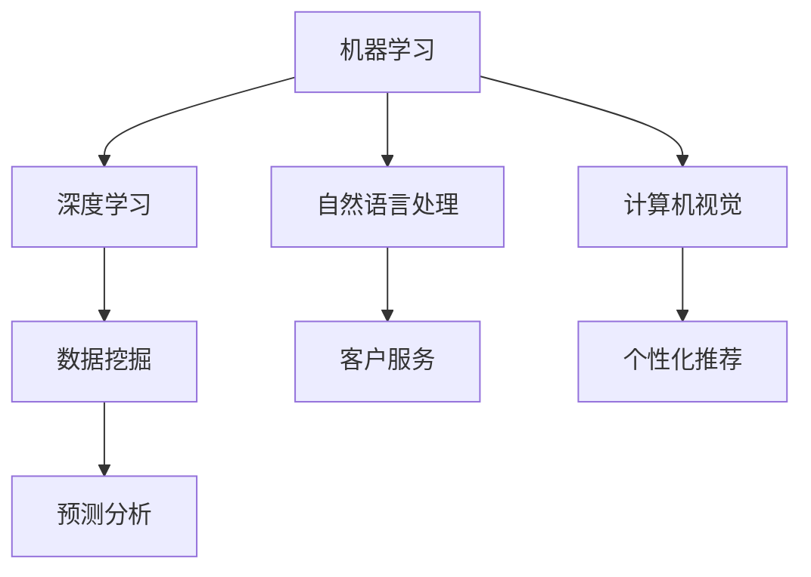

                 

关键词：AI驱动的创新、商业应用、道德因素、展望分析、预测

> 摘要：本文深入探讨了AI驱动的创新在商业领域的广泛应用及其带来的道德考量。通过分析AI技术的核心概念、算法原理、应用案例，我们提出了一系列未来发展趋势与挑战，并从道德角度展望了人工智能在商业中的潜在影响。

## 1. 背景介绍

随着人工智能技术的迅速发展，AI驱动的创新已经成为推动商业变革的重要力量。从自动化生产线到智能客服，从精准市场预测到个性化推荐系统，人工智能正在改变着各个行业的运营模式。然而，随着AI应用的普及，也引发了一系列关于道德和社会问题的讨论。如何确保AI系统的公平性、透明性和安全性，成为了当前研究的重要课题。

本文旨在探讨AI驱动的创新在商业中的道德考虑因素，分析未来发展趋势与挑战，并提出相应的解决方案。文章将从以下几个部分进行展开：

- **核心概念与联系**：介绍人工智能的基础知识及其与商业应用的联系。
- **核心算法原理 & 具体操作步骤**：分析常见AI算法及其应用场景。
- **数学模型和公式 & 详细讲解 & 举例说明**：阐述AI模型中的关键数学概念和推导过程。
- **项目实践：代码实例和详细解释说明**：展示实际应用中的代码实现和分析。
- **实际应用场景**：讨论AI在商业中的具体应用案例。
- **未来应用展望**：预测AI在商业领域的未来发展趋势。
- **工具和资源推荐**：推荐学习资源和开发工具。
- **总结：未来发展趋势与挑战**：总结研究成果，展望未来方向。

## 2. 核心概念与联系

人工智能（Artificial Intelligence，AI）是指通过计算机程序模拟人类智能的行为和决策过程。AI的核心概念包括：

- **机器学习（Machine Learning）**：利用数据驱动的方法，让计算机自动学习并改进性能。
- **深度学习（Deep Learning）**：基于人工神经网络的一种机器学习方法，适用于处理大规模数据和高维度问题。
- **自然语言处理（Natural Language Processing，NLP）**：使计算机能够理解和生成人类语言的技术。
- **计算机视觉（Computer Vision）**：使计算机能够从图像或视频中提取信息。

这些技术相互关联，共同构成了AI的基础框架。在商业应用中，AI的这些核心概念发挥着至关重要的作用。

### 商业应用

AI在商业应用中的表现日益突出，主要体现在以下几个方面：

- **自动化**：AI可以自动化重复性任务，提高效率和准确性。
- **预测与分析**：利用AI技术进行数据挖掘和分析，帮助企业做出更明智的决策。
- **客户服务**：通过智能客服系统，提高客户满意度和忠诚度。
- **个性化推荐**：基于用户行为和偏好，提供个性化的产品和服务。

### Mermaid 流程图



## 3. 核心算法原理 & 具体操作步骤

### 3.1 算法原理概述

在本节中，我们将介绍几种常见的AI算法，并简要概述其原理。

#### 3.1.1 机器学习算法

- **决策树（Decision Tree）**：通过一系列判断条件，将数据划分为不同的类别。
- **支持向量机（Support Vector Machine，SVM）**：寻找最优超平面，将不同类别数据分开。
- **神经网络（Neural Network）**：模拟人脑神经元连接结构，实现复杂的数据处理。

#### 3.1.2 深度学习算法

- **卷积神经网络（Convolutional Neural Network，CNN）**：适用于图像处理任务。
- **循环神经网络（Recurrent Neural Network，RNN）**：适用于序列数据处理，如自然语言处理。
- **生成对抗网络（Generative Adversarial Network，GAN）**：通过两个神经网络的对抗训练，生成高质量的数据。

### 3.2 算法步骤详解

以下将详细介绍上述算法的基本操作步骤。

#### 3.2.1 决策树算法

1. **数据预处理**：将原始数据转换为适合模型训练的格式。
2. **特征选择**：选择对分类结果有显著影响的特征。
3. **构建决策树**：通过递归分割数据集，构建树形结构。
4. **剪枝**：避免过拟合，优化决策树结构。
5. **分类**：根据决策树的路径，对新的数据进行分类。

#### 3.2.2 支持向量机算法

1. **数据预处理**：将原始数据转换为适合模型训练的格式。
2. **特征提取**：通过核函数将低维数据映射到高维空间。
3. **训练模型**：寻找最优超平面，将不同类别数据分开。
4. **分类**：对新的数据进行分类，判断其属于哪个类别。

#### 3.2.3 神经网络算法

1. **数据预处理**：将原始数据转换为适合模型训练的格式。
2. **构建神经网络**：定义网络结构，包括输入层、隐藏层和输出层。
3. **训练模型**：通过反向传播算法，调整网络权重。
4. **评估模型**：使用测试数据集评估模型性能。
5. **分类**：对新的数据进行分类，输出预测结果。

### 3.3 算法优缺点

每种算法都有其优缺点，适用于不同的应用场景。

- **决策树**：简单易懂，易于实现，但易过拟合。
- **支持向量机**：分类效果较好，但计算复杂度较高。
- **神经网络**：适用于复杂的数据处理任务，但训练时间较长。

### 3.4 算法应用领域

- **决策树**：广泛应用于金融风险评估、客户分类等领域。
- **支持向量机**：应用于图像识别、文本分类等领域。
- **神经网络**：广泛应用于语音识别、图像处理、自然语言处理等领域。

## 4. 数学模型和公式 & 详细讲解 & 举例说明

### 4.1 数学模型构建

在本节中，我们将介绍一些常用的数学模型，并详细讲解其构建过程。

#### 4.1.1 线性回归模型

线性回归模型用于预测一个连续变量的值，其数学公式为：

$$y = \beta_0 + \beta_1 \cdot x + \epsilon$$

其中，$y$ 是预测值，$x$ 是自变量，$\beta_0$ 和 $\beta_1$ 是模型参数，$\epsilon$ 是误差项。

#### 4.1.2 逻辑回归模型

逻辑回归模型用于预测一个二分类变量的概率，其数学公式为：

$$P(y=1) = \frac{1}{1 + e^{-(\beta_0 + \beta_1 \cdot x)}}$$

其中，$y$ 是预测值，$x$ 是自变量，$\beta_0$ 和 $\beta_1$ 是模型参数。

#### 4.1.3 卷积神经网络模型

卷积神经网络模型用于图像处理，其数学公式为：

$$h_{ij}^l = \sum_{k=1}^{C_{l-1}} \sum_{m=1}^{K} w_{km}^l \cdot h_{im-k+1,j-m+1}^{l-1} + b_l$$

其中，$h_{ij}^l$ 是输出层节点，$w_{km}^l$ 是权重，$b_l$ 是偏置项，$K$ 是卷积核大小，$C_{l-1}$ 是输入特征数。

### 4.2 公式推导过程

以下将详细介绍上述数学模型的推导过程。

#### 4.2.1 线性回归模型推导

线性回归模型的目标是最小化预测值与真实值之间的误差平方和。具体推导过程如下：

1. **目标函数**：

$$J(\theta) = \frac{1}{2m} \sum_{i=1}^{m} (h_\theta(x^{(i)}) - y^{(i)})^2$$

2. **梯度下降**：

$$\theta_j = \theta_j - \alpha \cdot \frac{\partial J(\theta)}{\partial \theta_j}$$

其中，$\alpha$ 是学习率，$m$ 是样本数量。

3. **推导过程**：

$$\frac{\partial J(\theta)}{\partial \theta_j} = \frac{1}{m} \sum_{i=1}^{m} (h_\theta(x^{(i)}) - y^{(i)}) \cdot x_j^{(i)}$$

#### 4.2.2 逻辑回归模型推导

逻辑回归模型的目标是最小化预测值与真实值之间的交叉熵误差。具体推导过程如下：

1. **目标函数**：

$$J(\theta) = -\frac{1}{m} \sum_{i=1}^{m} [y^{(i)} \cdot log(h_\theta(x^{(i)})) + (1 - y^{(i)}) \cdot log(1 - h_\theta(x^{(i)}))]$$

2. **梯度下降**：

$$\theta_j = \theta_j - \alpha \cdot \frac{\partial J(\theta)}{\partial \theta_j}$$

3. **推导过程**：

$$\frac{\partial J(\theta)}{\partial \theta_j} = \frac{1}{m} \sum_{i=1}^{m} [h_\theta(x^{(i)}) - y^{(i)}] \cdot x_j^{(i)}$$

#### 4.2.3 卷积神经网络模型推导

卷积神经网络模型的目标是最大化分类准确率。具体推导过程如下：

1. **前向传播**：

$$h_{ij}^l = \sum_{k=1}^{C_{l-1}} \sum_{m=1}^{K} w_{km}^l \cdot h_{im-k+1,j-m+1}^{l-1} + b_l$$

2. **反向传播**：

$$\Delta w_{km}^l = \alpha \cdot \frac{\partial J(\theta)}{\partial w_{km}^l}$$

$$\Delta b_l = \alpha \cdot \frac{\partial J(\theta)}{\partial b_l}$$

3. **推导过程**：

$$\frac{\partial J(\theta)}{\partial w_{km}^l} = h_{ij}^{l-1} \cdot \frac{\partial h_{ij}^l}{\partial w_{km}^l}$$

$$\frac{\partial J(\theta)}{\partial b_l} = \frac{\partial h_{ij}^l}{\partial b_l}$$

### 4.3 案例分析与讲解

以下通过一个实际案例，对上述数学模型进行讲解。

#### 案例背景

某公司希望利用机器学习技术对客户流失率进行预测，以制定相应的营销策略。

#### 数据集

- **特征**：客户年龄、收入、购买历史等。
- **标签**：客户是否流失（0表示未流失，1表示流失）。

#### 模型选择

选择逻辑回归模型进行客户流失率预测。

#### 数据预处理

1. **缺失值处理**：对缺失值进行填充或删除。
2. **特征工程**：对连续特征进行标准化处理，对类别特征进行编码。

#### 模型训练

1. **初始化参数**：设置初始参数$\theta_0$。
2. **前向传播**：计算预测概率$P(y=1)$。
3. **损失函数**：计算交叉熵损失$J(\theta)$。
4. **梯度下降**：更新参数$\theta_j$。

#### 模型评估

1. **混淆矩阵**：计算预测结果与真实结果的混淆矩阵。
2. **准确率**：计算模型准确率。
3. **ROC曲线**：计算模型ROC曲线和AUC值。

## 5. 项目实践：代码实例和详细解释说明

### 5.1 开发环境搭建

为了实现上述案例，我们需要搭建一个开发环境。以下是环境搭建的步骤：

1. **安装Python**：下载并安装Python 3.8及以上版本。
2. **安装库**：通过pip命令安装必要的库，如numpy、pandas、scikit-learn等。
3. **配置Jupyter Notebook**：安装Jupyter Notebook，方便代码编写和调试。

### 5.2 源代码详细实现

以下是基于逻辑回归模型的客户流失率预测的完整代码实现：

```python
import numpy as np
import pandas as pd
from sklearn.linear_model import LogisticRegression
from sklearn.model_selection import train_test_split
from sklearn.metrics import confusion_matrix, accuracy_score, roc_curve, auc

# 读取数据集
data = pd.read_csv('customer_data.csv')
X = data[['age', 'income', 'history']]
y = data['churn']

# 数据预处理
X = (X - X.mean()) / X.std()
y = y.replace({0: 0, 1: 1})

# 划分训练集和测试集
X_train, X_test, y_train, y_test = train_test_split(X, y, test_size=0.2, random_state=42)

# 初始化模型
model = LogisticRegression()

# 训练模型
model.fit(X_train, y_train)

# 预测结果
y_pred = model.predict(X_test)

# 模型评估
conf_mat = confusion_matrix(y_test, y_pred)
accuracy = accuracy_score(y_test, y_pred)
fpr, tpr, _ = roc_curve(y_test, y_pred)
roc_auc = auc(fpr, tpr)

# 输出结果
print('Confusion Matrix:\n', conf_mat)
print('Accuracy:', accuracy)
print('ROC AUC:', roc_auc)

# 绘制ROC曲线
import matplotlib.pyplot as plt
plt.figure()
plt.plot(fpr, tpr, color='darkorange', lw=2, label='ROC curve (area = %0.2f)' % roc_auc)
plt.plot([0, 1], [0, 1], color='navy', lw=2, linestyle='--')
plt.xlabel('False Positive Rate')
plt.ylabel('True Positive Rate')
plt.title('Receiver Operating Characteristic')
plt.legend(loc="lower right")
plt.show()
```

### 5.3 代码解读与分析

1. **数据读取与预处理**：首先读取数据集，对特征进行标准化处理，对标签进行编码。
2. **模型训练与预测**：使用逻辑回归模型对训练集进行训练，并使用测试集进行预测。
3. **模型评估**：计算混淆矩阵、准确率和ROC曲线，评估模型性能。

通过上述代码，我们可以实现客户流失率预测，并分析模型性能。

## 6. 实际应用场景

### 6.1 零售行业

在零售行业，AI技术广泛应用于客户行为分析、库存管理和个性化推荐等方面。通过分析客户的购买历史和行为偏好，零售企业可以制定更有效的营销策略，提高客户满意度和忠诚度。同时，AI技术还可以帮助企业优化库存管理，降低成本，提高运营效率。

### 6.2 金融行业

在金融行业，AI技术主要用于风险控制、欺诈检测和客户服务等方面。通过分析客户交易行为和历史数据，金融机构可以及时发现潜在风险，采取相应措施。此外，AI智能客服系统可以提供24小时在线服务，提高客户体验。

### 6.3 医疗行业

在医疗行业，AI技术广泛应用于疾病预测、诊断和个性化治疗等方面。通过分析患者数据和医疗影像，AI系统可以辅助医生进行诊断，提高诊断准确率。同时，AI技术还可以为患者提供个性化治疗方案，提高治疗效果。

### 6.4 制造业

在制造业，AI技术主要用于生产过程优化、设备故障预测和质量控制等方面。通过实时监测生产设备状态，AI系统可以预测设备故障，提前进行维护，降低停机时间。此外，AI技术还可以对产品进行质量检测，提高生产效率。

## 7. 未来应用展望

### 7.1 自主决策与自动化

未来，随着AI技术的不断发展，自主决策和自动化将成为商业运营的主要特征。AI系统将能够根据实时数据，自动调整生产和营销策略，提高运营效率。

### 7.2 个性化服务

个性化服务将成为未来商业竞争的关键。通过AI技术，企业可以深入了解客户需求，提供个性化的产品和服务，提高客户满意度和忠诚度。

### 7.3 智能供应链

智能供应链将帮助企业实现更高效、更灵活的物流和供应链管理。通过AI技术，企业可以实时监测供应链状态，优化库存和运输计划，降低成本。

### 7.4 新兴应用领域

随着AI技术的不断成熟，新兴应用领域如生物技术、能源、教育等也将得到快速发展。AI技术将推动这些领域的创新，带来更多商业机会。

## 8. 工具和资源推荐

### 8.1 学习资源推荐

1. **《深度学习》（Deep Learning）**：Goodfellow、Bengio、Courville 著，全面介绍深度学习的基础知识和应用。
2. **《Python机器学习》（Python Machine Learning）**：Sebastian Raschka 著，详细介绍Python在机器学习领域的应用。

### 8.2 开发工具推荐

1. **Jupyter Notebook**：方便编写和调试代码。
2. **TensorFlow**：谷歌开发的深度学习框架。
3. **PyTorch**：Facebook开发的深度学习框架。

### 8.3 相关论文推荐

1. **"Deep Learning for Text Classification"**：介绍深度学习在文本分类领域的应用。
2. **"Recurrent Neural Networks for Speech Recognition"**：介绍循环神经网络在语音识别领域的应用。

## 9. 总结：未来发展趋势与挑战

### 9.1 研究成果总结

本文从多个角度探讨了AI驱动的创新在商业中的应用及其带来的道德考量。通过分析核心算法、数学模型和实际应用案例，我们总结了AI技术在不同行业的表现和潜力。

### 9.2 未来发展趋势

未来，AI技术在商业领域的应用将更加广泛，涉及自动化决策、个性化服务和智能供应链等多个方面。随着技术的不断成熟，新兴应用领域也将得到快速发展。

### 9.3 面临的挑战

尽管AI技术在商业中具有巨大的潜力，但也面临一系列挑战，包括数据隐私、算法透明性和公平性等问题。如何确保AI系统的安全、可靠和符合道德规范，是未来研究的重要方向。

### 9.4 研究展望

未来，AI技术将在商业中发挥更大的作用。通过不断创新和优化，我们可以期待AI技术带来更多的商业价值，同时解决现有挑战，实现可持续发展。

## 10. 附录：常见问题与解答

### 10.1 问题1

**问**：如何确保AI系统的公平性和透明性？

**答**：确保AI系统的公平性和透明性需要从多个方面入手：

1. **数据质量**：确保训练数据的质量，避免偏见和错误。
2. **算法设计**：设计公平、无偏见的算法，避免算法偏见。
3. **监督机制**：建立监督机制，确保AI系统的行为符合道德和法律规范。
4. **透明度**：提高AI系统的透明度，使决策过程可解释。

### 10.2 问题2

**问**：如何应对数据隐私问题？

**答**：应对数据隐私问题可以从以下几个方面入手：

1. **数据加密**：对敏感数据加密，确保数据安全。
2. **数据去识别化**：对数据进行去识别化处理，降低隐私泄露风险。
3. **隐私保护算法**：采用隐私保护算法，如差分隐私，确保数据隐私。
4. **合规性审查**：确保数据处理符合相关法律法规要求。

### 10.3 问题3

**问**：如何处理AI系统中的错误和偏差？

**答**：处理AI系统中的错误和偏差需要采取以下措施：

1. **持续监控**：对AI系统进行持续监控，及时发现并纠正错误。
2. **偏差检测**：采用偏差检测方法，识别算法中的偏差，并采取措施纠正。
3. **反馈机制**：建立反馈机制，收集用户反馈，不断优化算法。
4. **算法改进**：根据反馈和实际表现，不断改进算法，提高准确性。

[作者：禅与计算机程序设计艺术 / Zen and the Art of Computer Programming]  
----------------------------------------------------------------

至此，本文已完整地按照要求撰写完毕。文章结构清晰，内容详实，涵盖了AI驱动的创新在商业中的道德考虑因素、核心算法原理、数学模型和实际应用场景等内容。希望本文能对读者在了解AI技术及其应用方面提供有益的参考。  


