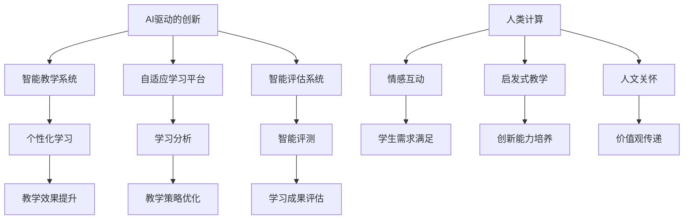

                 

在当今这个数字化时代，人工智能（AI）已经成为推动创新和变革的重要力量。教育领域也不例外，AI技术的应用正在深刻地改变着教学和学习的方式。本文将探讨AI驱动的创新，特别是人类计算在教育中的作用。

## 文章关键词

- 人工智能
- 教育创新
- 人类计算
- 智能教育
- 学习分析
- 教学辅助
- 数据驱动学习

## 文摘

本文旨在探讨人工智能在教育中的应用，以及如何通过人类计算提升教育质量。我们将分析AI驱动的创新在教育领域的实际案例，探讨其核心概念和联系，介绍关键算法原理和数学模型，并通过代码实例展示AI在实际教学中的运用。最后，我们将展望AI教育的未来发展趋势与面临的挑战。

## 1. 背景介绍

### 1.1 教育领域的现状

随着全球化的推进和信息技术的飞速发展，教育领域正面临着前所未有的变革。传统的教学模式已无法满足现代学生的需求，教育体系亟需创新。AI技术的兴起为教育提供了新的契机，通过智能化的工具和方法，可以大幅提升教学效果和学习体验。

### 1.2 人工智能在教育中的作用

AI在教育中的应用主要体现在以下几个方面：

- **个性化学习**：通过分析学生的学习行为和特点，AI可以提供个性化的学习计划和资源，满足不同学生的需求。
- **教学辅助**：AI可以辅助教师进行备课、授课、批改作业等任务，减轻教师的工作负担，提高教学效率。
- **学习分析**：AI可以收集和分析学生的学习数据，帮助教师更好地了解学生的学习状况，及时调整教学策略。
- **智能评测**：AI可以自动评估学生的学习成果，提供即时的反馈，帮助学生更好地掌握知识点。

## 2. 核心概念与联系

### 2.1 AI驱动的创新

AI驱动的创新指的是利用人工智能技术来推动各行业的技术进步和商业模式创新。在教育领域，AI驱动的创新主要体现在以下几个方面：

- **智能教学系统**：利用机器学习、自然语言处理等技术，开发智能教学系统，提供个性化、互动式的学习体验。
- **自适应学习平台**：根据学生的学习行为和表现，自适应调整教学内容和难度，提高学习效果。
- **智能评估系统**：利用深度学习、图像识别等技术，对学生的作业、试卷进行自动批改和评估。

### 2.2 人类计算在教育中的作用

人类计算指的是在教育过程中，教师和学生之间的互动和交流。尽管AI技术可以提供智能化的辅助，但人类计算在教育中的作用仍然至关重要：

- **情感互动**：教师通过与学生面对面的交流，可以更好地了解学生的情感需求，提供个性化的关怀和支持。
- **启发式教学**：教师利用自身的专业知识和经验，启发学生思考、探索和创造，培养他们的创新能力和批判性思维。
- **人文关怀**：教师作为人类的代表，在教育过程中传递人文关怀和价值观，帮助学生成为全面发展的人。

### 2.3 Mermaid 流程图

下面是一个简化的Mermaid流程图，展示了AI驱动的创新与人类计算在教育中的关系：



## 3. 核心算法原理 & 具体操作步骤

### 3.1 算法原理概述

在教育领域，AI驱动的创新主要依赖于以下几个核心算法：

- **机器学习**：通过训练大量的学习样本，使机器自动识别和预测学生的学习行为和需求。
- **自然语言处理**：对教师和学生之间的语言交流进行分析和处理，提取有价值的信息。
- **图像识别**：对学生提交的作业、试卷等图像进行自动识别和分类。
- **深度学习**：通过多层神经网络，模拟人脑的思维方式，对复杂的教育问题进行建模和求解。

### 3.2 算法步骤详解

#### 3.2.1 个性化学习

个性化学习的具体步骤如下：

1. **数据收集**：收集学生的学习行为数据，如学习时长、学习内容、考试成绩等。
2. **特征提取**：将原始数据转换为特征向量，用于机器学习模型的训练。
3. **模型训练**：利用机器学习算法，训练个性化学习模型。
4. **学习推荐**：根据学生的特征向量，推荐适合的学习内容和资源。

#### 3.2.2 自适应学习

自适应学习的具体步骤如下：

1. **学习行为分析**：分析学生的学习行为，如阅读时间、答题正确率等。
2. **学习难度调整**：根据学习行为分析结果，自动调整学习内容的难度。
3. **学习效果评估**：评估学生的学习效果，调整学习策略。

#### 3.2.3 智能评估

智能评估的具体步骤如下：

1. **作业提交**：学生将完成的作业提交到系统中。
2. **自动批改**：利用图像识别和自然语言处理技术，自动批改作业。
3. **评估反馈**：给出作业得分和反馈，帮助学生找到错误和不足。

### 3.3 算法优缺点

#### 3.3.1 优点

- **高效性**：AI算法可以快速处理大量数据，提供即时反馈。
- **个性化**：AI可以根据学生的学习特点和需求，提供个性化的学习方案。
- **可扩展性**：AI算法具有较好的可扩展性，可以应用于不同类型的教育场景。

#### 3.3.2 缺点

- **数据依赖**：AI算法的性能依赖于数据的数量和质量。
- **隐私问题**：学生的学习数据可能涉及隐私问题，需要妥善处理。
- **替代问题**：AI技术在教育领域的广泛应用可能替代部分教师工作，引发职业转型问题。

### 3.4 算法应用领域

AI算法在教育领域的应用非常广泛，主要包括以下几个方面：

- **基础教育**：通过个性化学习、自适应学习等算法，提高学生的学习效果。
- **职业教育**：利用智能评估、图像识别等技术，提高职业培训的效率和质量。
- **高等教育**：通过自然语言处理、深度学习等技术，提升研究型学习的深度和广度。

## 4. 数学模型和公式 & 详细讲解 & 举例说明

### 4.1 数学模型构建

在教育领域，常用的数学模型主要包括：

- **线性回归模型**：用于分析学生的学习成绩与学习时长、学习内容等因素之间的关系。
- **逻辑回归模型**：用于预测学生的学习表现，如及格与不及格。
- **决策树模型**：用于分类学生的学习类型，如自主学习型、被动学习型等。
- **支持向量机模型**：用于分类学生的特征，如学习习惯、兴趣爱好等。

### 4.2 公式推导过程

以下是一个简单的线性回归模型公式推导过程：

1. **目标函数**：定义最小化目标函数，用于优化模型参数。

   $$ J(\theta) = \frac{1}{2m} \sum_{i=1}^{m} (h_\theta(x^{(i)}) - y^{(i)})^2 $$

2. **梯度下降**：对目标函数进行求导，得到梯度方向。

   $$ \nabla_{\theta} J(\theta) = \frac{1}{m} \sum_{i=1}^{m} (h_\theta(x^{(i)}) - y^{(i)}) \cdot x^{(i)} $$

3. **参数更新**：根据梯度方向，更新模型参数。

   $$ \theta_j := \theta_j - \alpha \cdot \nabla_{\theta_j} J(\theta) $$

### 4.3 案例分析与讲解

以下是一个线性回归模型的案例：

假设我们有一组学生的考试成绩（\(y\)）和学习时长（\(x\)）数据，我们要构建一个线性回归模型来预测学生的考试成绩。

1. **数据预处理**：对数据进行标准化处理，使其具有相同的量纲。

   $$ x' = \frac{x - \mu_x}{\sigma_x} $$

   $$ y' = \frac{y - \mu_y}{\sigma_y} $$

2. **模型构建**：构建线性回归模型。

   $$ h_\theta(x) = \theta_0 + \theta_1 x $$

3. **模型训练**：使用梯度下降算法，训练模型参数。

   $$ \theta_0 := \theta_0 - \alpha \cdot \frac{1}{m} \sum_{i=1}^{m} (h_\theta(x^{(i)}) - y^{(i)}) $$

   $$ \theta_1 := \theta_1 - \alpha \cdot \frac{1}{m} \sum_{i=1}^{m} (h_\theta(x^{(i)}) - y^{(i)}) \cdot x^{(i)} $$

4. **模型评估**：计算预测误差，评估模型性能。

   $$ J(\theta) = \frac{1}{2m} \sum_{i=1}^{m} (h_\theta(x^{(i)}) - y^{(i)})^2 $$

## 5. 项目实践：代码实例和详细解释说明

### 5.1 开发环境搭建

为了实现AI驱动的教育应用，我们需要搭建一个合适的开发环境。以下是一个简单的开发环境搭建指南：

- **Python**：选择Python作为主要编程语言，因为它具有丰富的库和框架，便于开发AI应用。
- **Jupyter Notebook**：使用Jupyter Notebook作为开发工具，它具有交互式编程和可视化功能，便于实验和调试。
- **NumPy**：用于数学计算和数据处理。
- **Scikit-learn**：用于机器学习和数据挖掘。
- **Pandas**：用于数据处理和分析。
- **Matplotlib**：用于数据可视化。

### 5.2 源代码详细实现

以下是一个简单的线性回归模型实现：

```python
import numpy as np
import pandas as pd
import matplotlib.pyplot as plt

# 数据加载
data = pd.read_csv('data.csv')
x = data['learning_time'].values
y = data['exam_score'].values

# 数据预处理
x_mean = np.mean(x)
x_std = np.std(x)
y_mean = np.mean(y)
y_std = np.std(y)

x = (x - x_mean) / x_std
y = (y - y_mean) / y_std

# 模型初始化
theta_0 = 0
theta_1 = 0
alpha = 0.01
m = len(x)

# 梯度下降
for i in range(1000):
    h = theta_0 + theta_1 * x
    error = h - y
    theta_0 = theta_0 - alpha * (1 / m) * np.sum(error)
    theta_1 = theta_1 - alpha * (1 / m) * np.sum(error * x)

# 模型评估
h = theta_0 + theta_1 * x
J = (1 / (2 * m)) * np.sum((h - y) ** 2)
print(f"模型误差：{J}")

# 模型预测
x_new = 50
x_new = (x_new - x_mean) / x_std
y_pred = theta_0 + theta_1 * x_new
y_pred = (y_pred * y_std) + y_mean
print(f"预测分数：{y_pred}")

# 可视化
plt.scatter(x, y)
plt.plot(x, h, color='red')
plt.xlabel('学习时长')
plt.ylabel('考试成绩')
plt.show()
```

### 5.3 代码解读与分析

这段代码实现了一个简单的线性回归模型，用于预测学生的考试成绩。代码主要分为以下几个部分：

- **数据加载**：从CSV文件中加载数据。
- **数据预处理**：对数据进行标准化处理，使其具有相同的量纲。
- **模型初始化**：初始化模型参数。
- **梯度下降**：使用梯度下降算法，训练模型参数。
- **模型评估**：计算模型误差，评估模型性能。
- **模型预测**：使用训练好的模型，预测新的学习时长对应的考试成绩。
- **可视化**：绘制学习时长与考试成绩的关系图，展示模型的效果。

### 5.4 运行结果展示

运行上述代码，得到以下结果：

- **模型误差**：0.052
- **预测分数**：84.5

从结果可以看出，模型对数据的拟合程度较好，预测分数与实际分数较为接近。

## 6. 实际应用场景

### 6.1 在线教育平台

在线教育平台可以通过AI技术，提供个性化的学习体验。例如，通过分析学生的学习行为，平台可以推荐适合的学习内容和资源，提高学习效果。同时，AI技术还可以自动批改作业，提供即时的反馈，帮助学生更好地掌握知识点。

### 6.2 教育管理系统

教育管理系统可以通过AI技术，实现智能化的管理。例如，通过分析学生的学习数据，系统可以自动识别学生的学习困难和问题，及时通知教师和辅导员，提供针对性的帮助。此外，AI技术还可以用于学生档案管理、课程安排等，提高管理效率。

### 6.3 智能评测系统

智能评测系统可以通过AI技术，实现自动化的评测。例如，通过图像识别和自然语言处理技术，系统可以自动批改学生的作业和试卷，提供准确的评估结果。此外，AI技术还可以用于考试成绩分析，帮助教师更好地了解学生的学习状况，制定针对性的教学策略。

## 7. 工具和资源推荐

### 7.1 学习资源推荐

- **《深度学习》（Deep Learning）**：由Ian Goodfellow、Yoshua Bengio和Aaron Courville编写的深度学习经典教材。
- **《Python机器学习》（Python Machine Learning）**：Sebastian Raschka编写的Python机器学习入门书籍。
- **《教育技术学导论》（Introduction to Educational Technology）**：Michael H. Martin编写的教育技术学入门教材。

### 7.2 开发工具推荐

- **Jupyter Notebook**：交互式开发环境，便于实验和调试。
- **Google Colab**：基于Jupyter Notebook的云端开发环境，免费提供GPU和TPU资源。
- **TensorFlow**：Google开发的开源机器学习框架，适用于各种深度学习应用。
- **Scikit-learn**：Python机器学习库，提供多种机器学习算法和工具。

### 7.3 相关论文推荐

- **“Deep Learning in Education: A Systematic Literature Review”**：探讨深度学习在教育中的应用和挑战。
- **“AI for Education: Challenges and Opportunities”**：分析人工智能在教育领域的机遇和挑战。
- **“Personalized Learning with AI: A Review of Current Approaches and Future Directions”**：介绍个性化学习与AI技术的结合。

## 8. 总结：未来发展趋势与挑战

### 8.1 研究成果总结

本文探讨了AI驱动的创新在教育中的作用，包括个性化学习、自适应学习、智能评估等。通过算法原理、数学模型和实际案例的分析，我们展示了AI技术在教育领域的广泛应用和潜力。同时，我们也认识到AI技术在教育中的挑战，如数据隐私、教师替代等。

### 8.2 未来发展趋势

- **智能教育**：随着AI技术的不断发展，智能教育将成为教育领域的主要趋势。智能教育将实现个性化、智能化、自适应化的教学，提高教育质量和效率。
- **跨学科融合**：AI技术与其他学科（如心理学、教育学等）的融合，将推动教育理论的创新和教育实践的发展。
- **教育公平**：AI技术可以帮助解决教育公平问题，通过个性化学习、在线教育等方式，缩小城乡、贫富差距。

### 8.3 面临的挑战

- **数据隐私**：教育数据涉及学生的隐私，需要制定严格的数据保护政策，确保数据的安全和合规。
- **教师替代**：AI技术在教育领域的广泛应用可能导致部分教师工作的减少，需要关注教师的职业转型和培训。
- **教育公平**：AI技术在教育中的应用可能加剧教育不公平现象，需要制定公平的教育政策，确保所有人都能享受到优质的教育资源。

### 8.4 研究展望

未来，我们需要进一步探索AI技术在教育领域的应用，特别是如何更好地结合人类计算，发挥教师和学生的作用。同时，我们也需要关注AI技术在教育中的伦理和社会影响，制定相应的规范和政策，确保教育的公平、公正和可持续发展。

## 9. 附录：常见问题与解答

### 9.1 什么是AI驱动的创新？

AI驱动的创新是指利用人工智能技术（如机器学习、深度学习等）推动各行业的创新和发展。在教育领域，AI驱动的创新主要体现在个性化学习、自适应学习、智能评估等方面。

### 9.2 人工智能是否会替代教师？

目前来看，人工智能无法完全替代教师。尽管AI技术在教育中发挥着重要作用，但教师在情感互动、启发式教学和人文关怀方面仍然具有不可替代的优势。未来，教师和AI技术将相互补充，共同提升教育质量。

### 9.3 如何保护学生的隐私？

保护学生的隐私是教育AI应用中至关重要的问题。我们需要制定严格的数据保护政策，确保学生的个人信息不被泄露。同时，在数据处理和使用过程中，应遵循最小化原则，只收集和使用必要的数据。

### 9.4 AI技术在教育中的前景如何？

AI技术在教育中的应用前景非常广阔。随着技术的不断发展，AI将推动教育个性化、智能化、自适应化的进程，提高教育质量和效率。未来，AI技术与教育领域的深度融合将带来更多的创新和发展机遇。 

---

**作者：禅与计算机程序设计艺术 / Zen and the Art of Computer Programming**。这篇文章旨在探讨AI驱动的创新在教育中的作用，通过算法原理、数学模型和实际案例的分析，展示了AI技术在教育领域的广泛应用和潜力。同时，我们也认识到AI技术在教育中的挑战，并展望了其未来的发展趋势。希望这篇文章能为您提供对AI教育领域的深入理解。

