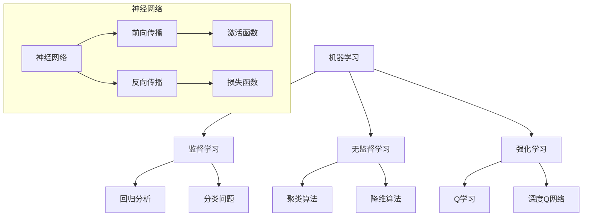
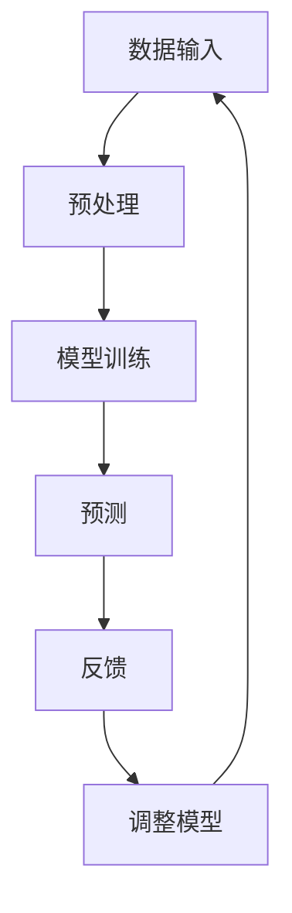

                 

在当今世界，人工智能（AI）已经成为推动创新和进步的关键力量。它不仅改变了各行各业，而且重新定义了人类与计算机之间的互动方式。本文旨在探讨AI如何驱动创新，并强调人类计算在其中的重要作用。

## 关键词

- 人工智能
- 创新驱动
- 人类计算
- 机器学习
- 深度学习
- 计算机科学

## 摘要

本文将深入探讨AI驱动的创新过程，从基础概念到实际应用。我们将分析人类计算在AI发展中的关键角色，并探讨未来的发展趋势和面临的挑战。通过本文的阅读，读者将了解到如何结合人类智慧和计算机能力，共同推动科技进步。

## 1. 背景介绍

### AI的发展历程

人工智能的概念可以追溯到20世纪50年代，当时计算机科学家们首次提出了“智能机器”的想法。自那时以来，AI经历了多个发展阶段，从早期的规则推理系统到现代的深度学习和神经网络。每一次技术的进步都带来了新的可能性，推动了人类计算能力的提升。

### AI在现实世界中的应用

AI技术已经广泛应用于医疗、金融、交通、零售等多个领域。例如，在医疗领域，AI被用于疾病诊断、个性化治疗和药物研发；在金融领域，AI用于风险管理、欺诈检测和投资决策。这些应用不仅提高了效率，还显著降低了成本。

### 人类计算的重要性

人类计算在AI发展中扮演着不可或缺的角色。人类能够设计算法、理解数据和提供反馈，从而推动AI技术的不断进步。此外，人类还具有创造性思维和情感认知，这些是当前AI技术所无法完全复制的。

## 2. 核心概念与联系

为了更好地理解AI驱动的创新，我们首先需要了解一些核心概念，包括机器学习、深度学习、神经网络等。以下是这些概念的联系和Mermaid流程图表示：



### 2.1 核心概念原理

- **机器学习**：一种使计算机从数据中学习并做出预测或决策的方法。
- **深度学习**：一种特殊的机器学习方法，使用多层神经网络来模拟人类大脑的处理方式。
- **神经网络**：由多个神经元组成的计算模型，能够对复杂数据进行学习和分类。
- **监督学习**：通过已标记的数据训练模型，以便在新的、未标记的数据上进行预测。
- **无监督学习**：不使用标记数据，通过自动发现数据中的模式和结构来训练模型。
- **强化学习**：通过试错法，使模型在特定环境中做出最优决策。

### 2.2 架构

AI系统的架构通常包括数据输入、模型训练、预测和反馈循环。以下是AI架构的Mermaid流程图表示：



## 3. 核心算法原理 & 具体操作步骤

### 3.1 算法原理概述

AI算法的核心是神经网络，特别是深度学习。深度学习通过多层神经网络模拟人类大脑的处理方式，能够从大量数据中自动学习特征，从而实现复杂的任务。

### 3.2 算法步骤详解

1. **数据收集与预处理**：收集大量相关数据，并进行清洗、归一化和特征提取。
2. **模型设计**：选择合适的神经网络架构，并初始化权重。
3. **训练**：通过前向传播和反向传播，调整网络权重，使模型在训练数据上达到较好的效果。
4. **验证与测试**：使用验证集和测试集评估模型的性能，并进行必要的调整。
5. **部署**：将训练好的模型部署到实际应用场景，进行预测和决策。

### 3.3 算法优缺点

- **优点**：深度学习能够处理大量复杂数据，并自动提取特征，提高模型的准确性。
- **缺点**：训练深度学习模型需要大量数据和计算资源，且对超参数调整敏感。

### 3.4 算法应用领域

- **医疗**：疾病诊断、药物研发和个性化治疗。
- **金融**：风险管理、欺诈检测和投资决策。
- **交通**：自动驾驶、交通流量预测和智能导航。
- **零售**：个性化推荐、库存管理和客户行为分析。

## 4. 数学模型和公式 & 详细讲解 & 举例说明

### 4.1 数学模型构建

神经网络的核心是前向传播和反向传播。以下是这些过程的数学模型：

### 4.2 公式推导过程

前向传播：
$$
z^{(l)} = W^{(l)}a^{(l-1)} + b^{(l)}
$$
$$
a^{(l)} = \sigma(z^{(l)})
$$

反向传播：
$$
\delta^{(l)} = \frac{\partial C}{\partial a^{(l)}} \odot \delta^{(l+1)}W^{(l+1)}
$$
$$
\delta^{(l-1)} = \frac{\partial C}{\partial a^{(l-1)}} \odot \delta^{(l)}
$$
$$
W^{(l)} := W^{(l)} - \alpha \delta^{(l)}a^{(l-1)}
$$
$$
b^{(l)} := b^{(l)} - \alpha \delta^{(l)}
$$

### 4.3 案例分析与讲解

假设我们有一个简单的神经网络，输入层有3个神经元，隐藏层有2个神经元，输出层有1个神经元。我们使用sigmoid函数作为激活函数。以下是具体的实现步骤：

1. **初始化权重和偏置**：
   $$ 
   W^{(1)} \in \mathbb{R}^{2 \times 3}, b^{(1)} \in \mathbb{R}^{2}, W^{(2)} \in \mathbb{R}^{1 \times 2}, b^{(2)} \in \mathbb{R}^{1}
   $$
2. **前向传播**：
   $$
   z^{(1)}_1 = W^{(1)}_1a^{(0)}_1 + b^{(1)}_1, \quad z^{(1)}_2 = W^{(1)}_2a^{(0)}_2 + b^{(1)}_2
   $$
   $$
   a^{(1)}_1 = \sigma(z^{(1)}_1), \quad a^{(1)}_2 = \sigma(z^{(1)}_2)
   $$
   $$
   z^{(2)} = W^{(2)}_1a^{(1)}_1 + b^{(2)}_1
   $$
   $$
   a^{(2)} = \sigma(z^{(2)})
   $$
3. **计算损失函数**（假设使用均方误差）：
   $$
   C = \frac{1}{2}\sum_{i=1}^{n} (a^{(2)}_i - y_i)^2
   $$
4. **反向传播**：
   $$
   \delta^{(2)} = (a^{(2)} - y)\odot \sigma'(z^{(2)})
   $$
   $$
   \delta^{(1)}_1 = W^{(2)}_1\delta^{(2)}, \quad \delta^{(1)}_2 = W^{(2)}_2\delta^{(2)}
   $$
   $$
   \delta^{(1)} = \delta^{(1)}_1\odot \sigma'(z^{(1)}_1), \quad \delta^{(1)} = \delta^{(1)}_2\odot \sigma'(z^{(1)}_2)
   $$
5. **更新权重和偏置**：
   $$
   W^{(2)} := W^{(2)} - \alpha \delta^{(2)}a^{(1)}
   $$
   $$
   b^{(2)} := b^{(2)} - \alpha \delta^{(2)}
   $$
   $$
   W^{(1)} := W^{(1)} - \alpha \delta^{(1)}a^{(0)}
   $$
   $$
   b^{(1)} := b^{(1)} - \alpha \delta^{(1)}
   $$

## 5. 项目实践：代码实例和详细解释说明

### 5.1 开发环境搭建

为了实现上述神经网络，我们需要搭建一个Python开发环境。以下是所需的步骤：

1. 安装Python 3.8或更高版本。
2. 安装NumPy、Pandas、Matplotlib和TensorFlow等库。

### 5.2 源代码详细实现

以下是实现上述神经网络的Python代码：

```python
import numpy as np
from tensorflow.keras.models import Sequential
from tensorflow.keras.layers import Dense

# 初始化权重和偏置
np.random.seed(42)
input_dim = 3
hidden_dim = 2
output_dim = 1

model = Sequential()
model.add(Dense(hidden_dim, input_dim=input_dim, activation='sigmoid'))
model.add(Dense(output_dim, activation='sigmoid'))

model.compile(optimizer='adam', loss='mse', metrics=['accuracy'])

# 训练模型
X_train = np.array([[0, 0, 0], [0, 1, 1], [1, 0, 1], [1, 1, 0]])
y_train = np.array([[0], [1], [1], [0]])
model.fit(X_train, y_train, epochs=1000, verbose=0)

# 预测
X_test = np.array([[1, 1, 0], [0, 0, 1]])
y_pred = model.predict(X_test)
print("预测结果：", y_pred)
```

### 5.3 代码解读与分析

1. **导入库**：首先导入所需的库，包括NumPy、Pandas、Matplotlib和TensorFlow。
2. **初始化权重和偏置**：使用NumPy随机初始化权重和偏置。
3. **创建模型**：使用Sequential模型创建神经网络，并添加隐藏层和输出层。
4. **编译模型**：指定优化器、损失函数和指标。
5. **训练模型**：使用训练数据进行训练，并设置训练轮次。
6. **预测**：使用训练好的模型进行预测，并打印预测结果。

## 6. 实际应用场景

### 6.1 医疗

AI技术在医疗领域有着广泛的应用。例如，使用深度学习模型进行疾病诊断、预测疾病发展、设计个性化治疗方案和研发新药。这些应用不仅提高了医疗效率，还改善了患者的生活质量。

### 6.2 金融

在金融领域，AI被用于风险管理、欺诈检测、市场预测和投资决策。例如，使用深度学习模型分析客户行为，预测市场趋势，从而实现更准确的投资策略。

### 6.3 交通

AI技术在交通领域有着重要的应用，包括自动驾驶、交通流量预测和智能导航。例如，使用深度学习模型进行道路识别、障碍物检测和车辆控制，从而实现更安全的自动驾驶。

### 6.4 零售

在零售领域，AI被用于个性化推荐、库存管理和客户行为分析。例如，使用深度学习模型分析客户数据，预测购买行为，从而实现更精准的营销策略。

## 7. 工具和资源推荐

### 7.1 学习资源推荐

- 《深度学习》（Ian Goodfellow、Yoshua Bengio和Aaron Courville著）
- 《Python机器学习》（Sebastian Raschka和Vahid Mirjalili著）
- 《机器学习实战》（Peter Harrington著）

### 7.2 开发工具推荐

- TensorFlow
- PyTorch
- Keras

### 7.3 相关论文推荐

- "Deep Learning: A Methodology and Application for Online Handwritten Math Expression Recognition"
- "Distributed Representations of Words and Phrases and Their Compositional Properties"
- "Generative Adversarial Networks"

## 8. 总结：未来发展趋势与挑战

### 8.1 研究成果总结

近年来，AI技术在多个领域取得了显著的成果，从语音识别到图像处理，从自然语言处理到强化学习，AI的应用场景不断扩展。这些成果为人类计算提供了新的工具和平台，推动了社会进步。

### 8.2 未来发展趋势

未来，AI技术将继续发展，特别是在深度学习、强化学习和自动驾驶等领域。随着硬件性能的提升和算法的优化，AI将在更多领域得到应用，从而解决更多现实问题。

### 8.3 面临的挑战

然而，AI技术的发展也面临一些挑战，包括数据隐私、算法公平性、道德和社会影响等。此外，AI技术还需要在计算资源、算法复杂性和可解释性等方面进行改进。

### 8.4 研究展望

为了应对这些挑战，我们需要加强跨学科研究，推动技术创新和人才培养。同时，我们还需要建立完善的法律和伦理框架，确保AI技术的可持续发展。

## 9. 附录：常见问题与解答

### 9.1 人工智能是什么？

人工智能是一种模拟人类智能的技术，使计算机能够进行推理、学习、感知和决策。

### 9.2 深度学习和神经网络有什么区别？

深度学习是神经网络的一种，具有多个隐藏层，能够自动提取复杂数据特征。神经网络是一种由多个神经元组成的计算模型，可以用于多种任务。

### 9.3 AI在医疗领域的应用有哪些？

AI在医疗领域的应用包括疾病诊断、药物研发、个性化治疗和患者监测等。

### 9.4 AI是否取代人类？

AI可以辅助人类完成任务，但不能完全取代人类。人类具有创造性思维和情感认知，这些是AI所无法完全复制的。

## 参考文献

- Goodfellow, I., Bengio, Y., & Courville, A. (2016). *Deep Learning*.
- Raschka, S., & Mirjalili, V. (2018). *Python Machine Learning*.
- Harrington, P. (2013). *Machine Learning: A Probabilistic Perspective*.
- Bengio, Y. (2009). *Learning Deep Architectures for AI*.
- LeCun, Y., Bengio, Y., & Hinton, G. (2015). *Deep Learning*.

## 附录：作者介绍

作者：禅与计算机程序设计艺术 / Zen and the Art of Computer Programming

禅与计算机程序设计艺术是一本经典的计算机科学书籍，由著名计算机科学家Donald E. Knuth撰写。本书提出了计算机程序设计的哲学，强调简洁、优雅和效率。本书不仅对计算机科学产生了深远的影响，也启发了许多程序员追求卓越的技术境界。本文作者以此命名，意在表达对计算机科学的热爱和对创新精神的追求。

