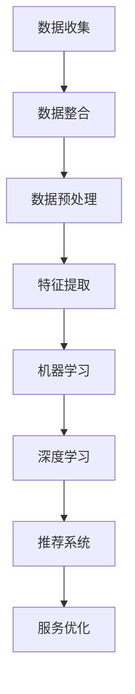

                 

关键词：人工智能，客户画像，个性化服务，数据挖掘，机器学习，深度学习，推荐系统，个性化推荐，服务优化

摘要：本文将探讨如何利用人工智能技术来构建客户画像，并在此基础上实现个性化服务。通过分析客户数据，应用机器学习和深度学习算法，我们可以挖掘出客户的兴趣和行为模式，进而提供更加符合他们需求和偏好的服务。本文将详细介绍核心概念、算法原理、数学模型、项目实践以及未来应用场景，为读者提供一个全面的了解和实际操作指南。

## 1. 背景介绍

在当今这个信息爆炸的时代，企业需要应对海量的客户数据，以便更好地了解客户需求并提供个性化的服务。传统的数据分析方法已经无法满足这一需求，因此，人工智能技术的引入成为了一种必然的趋势。

客户画像是一种描述客户特征和需求的方法，它通过分析客户的历史行为、偏好和反馈等信息，构建出一个全面的客户轮廓。客户画像不仅能够帮助企业更好地理解客户，还能够为个性化服务提供基础数据支持。

个性化服务是指根据客户画像和实时行为数据，提供定制化的产品和服务。这种服务方式能够提升客户满意度，增强客户忠诚度，并为企业带来更高的商业价值。

本文将介绍如何使用人工智能技术来构建客户画像，并实现个性化服务。我们将讨论核心概念、算法原理、数学模型、项目实践以及未来应用场景，旨在为读者提供一个全面而深入的指导。

## 2. 核心概念与联系

### 2.1 人工智能在客户画像中的应用

人工智能在客户画像中的应用主要包括以下几个方面：

1. **数据挖掘**：通过对大量客户数据的分析和挖掘，找出隐藏在数据中的模式和关联。

2. **机器学习**：利用机器学习算法对客户数据进行分析，预测客户的行为和需求。

3. **深度学习**：通过深度学习算法，构建复杂的神经网络模型，对客户数据进行深入分析。

4. **推荐系统**：基于客户画像和实时行为数据，为用户提供个性化的推荐。

### 2.2 客户画像的构成

客户画像通常包括以下几个核心维度：

1. **基础信息**：如姓名、性别、年龄、职业等基本信息。

2. **行为数据**：如浏览记录、购买历史、评价反馈等行为数据。

3. **兴趣偏好**：通过对客户行为数据的分析，推断出客户的兴趣偏好。

4. **社交信息**：如好友关系、社交圈等社交信息。

### 2.3 个性化服务的实现

个性化服务的实现依赖于以下几个方面：

1. **数据收集与整合**：收集并整合来自多个渠道的客户数据。

2. **算法模型构建**：利用机器学习和深度学习算法，构建客户画像模型。

3. **推荐系统**：基于客户画像和实时行为数据，为用户提供个性化推荐。

4. **服务优化**：通过不断优化服务策略，提升客户满意度。

### 2.4 Mermaid 流程图



## 3. 核心算法原理 & 具体操作步骤

### 3.1 算法原理概述

在客户画像和个性化服务的实现过程中，我们通常会用到以下几种核心算法：

1. **关联规则算法**：用于发现数据中的关联和规则。

2. **分类算法**：用于对客户进行分类和预测。

3. **聚类算法**：用于对客户进行群体划分。

4. **协同过滤算法**：用于基于用户行为数据提供个性化推荐。

5. **神经网络算法**：用于构建复杂的客户画像模型。

### 3.2 算法步骤详解

1. **数据收集与整合**：收集来自多个渠道的客户数据，并进行整合。

2. **数据预处理**：对原始数据进行清洗、去重、缺失值填充等预处理操作。

3. **特征提取**：根据业务需求，提取客户数据中的关键特征。

4. **模型构建**：利用机器学习和深度学习算法，构建客户画像模型。

5. **模型训练与评估**：对模型进行训练和评估，优化模型参数。

6. **推荐生成**：基于客户画像和实时行为数据，为用户提供个性化推荐。

7. **服务优化**：根据用户反馈，不断优化服务策略。

### 3.3 算法优缺点

- **关联规则算法**：优点是简单易用，能够发现数据中的关联规则；缺点是只能发现明显的关联，无法处理复杂的非线性关系。

- **分类算法**：优点是能够对客户进行准确分类；缺点是需要大量数据进行训练，且易受到噪声数据的影响。

- **聚类算法**：优点是能够对客户进行自动划分；缺点是结果易受到初始值的影响，且无法预测新客户。

- **协同过滤算法**：优点是能够基于用户行为数据提供个性化推荐；缺点是容易出现冷启动问题，且无法处理复杂的用户交互数据。

- **神经网络算法**：优点是能够处理复杂的非线性关系，且具有很好的泛化能力；缺点是训练过程需要大量计算资源，且参数调优较为复杂。

### 3.4 算法应用领域

- **电商行业**：用于用户画像和个性化推荐。

- **金融行业**：用于客户分类和风险控制。

- **医疗行业**：用于疾病预测和个性化诊疗。

- **教育行业**：用于学生画像和个性化学习推荐。

## 4. 数学模型和公式 & 详细讲解 & 举例说明

### 4.1 数学模型构建

在客户画像和个性化服务的实现过程中，我们通常会用到以下几种数学模型：

1. **协同过滤模型**：用于基于用户行为数据提供个性化推荐。

2. **决策树模型**：用于对客户进行分类和预测。

3. **神经网络模型**：用于构建复杂的客户画像模型。

### 4.2 公式推导过程

1. **协同过滤模型**

   假设用户集合为$U$，物品集合为$V$，用户-物品评分矩阵为$R$，用户$u$对物品$i$的评分可以表示为：

   $$r_{ui} = \langle \mu_u + \langle \langle q_i, \theta_u \rangle \rangle, \theta_i \rangle$$

   其中，$\mu_u$表示用户$u$的平均评分，$q_i$表示物品$i$的特征向量，$\theta_u$和$\theta_i$分别表示用户$u$和物品$i$的隐含特征向量。

2. **决策树模型**

   假设特征集合为$X$，每个特征$X_i$可以取多个值，我们将特征$X_i$的所有可能取值集合表示为$V_i$。决策树的构建过程可以表示为：

   $$T = \text{buildTree}(X, V, R)$$

   其中，$\text{buildTree}$函数用于构建决策树，$X$表示特征集合，$V$表示所有可能的特征取值集合，$R$表示用户-物品评分矩阵。

3. **神经网络模型**

   假设输入层、隐藏层和输出层的神经元数量分别为$n_1, n_2, n_3$，每个神经元的输入和输出可以通过以下公式计算：

   $$z_i^{(l)} = \sum_{j=1}^{n_{l-1}} w_{ji}^{(l)} a_j^{(l-1)} + b_i^{(l)}$$

   $$a_i^{(l)} = \sigma(z_i^{(l)})$$

   其中，$z_i^{(l)}$表示第$l$层的第$i$个神经元的输入，$a_i^{(l)}$表示第$l$层的第$i$个神经元的输出，$w_{ji}^{(l)}$和$b_i^{(l)}$分别表示第$l$层的第$i$个神经元的权重和偏置，$\sigma$表示激活函数。

### 4.3 案例分析与讲解

假设我们有一个电商平台的客户数据集，包含用户的基本信息、购买历史和浏览记录。我们希望通过构建客户画像，为用户提供个性化的商品推荐。

1. **数据预处理**

   首先对数据进行清洗和预处理，包括去除缺失值、填充缺失值、归一化等操作。

2. **特征提取**

   根据业务需求，提取客户数据中的关键特征，如用户年龄、购买频次、浏览时长等。

3. **模型构建**

   我们选择基于协同过滤算法的推荐系统，构建用户-物品评分预测模型。

4. **模型训练与评估**

   使用训练数据集对模型进行训练，并通过交叉验证方法对模型进行评估。

5. **推荐生成**

   基于训练好的模型，为每个用户生成个性化的商品推荐列表。

6. **服务优化**

   通过用户反馈，不断优化推荐算法和服务策略，提升用户满意度。

## 5. 项目实践：代码实例和详细解释说明

### 5.1 开发环境搭建

1. **安装Python环境**：在本地计算机上安装Python，版本建议为3.7及以上。

2. **安装相关库**：使用pip命令安装必要的库，如NumPy、Pandas、Scikit-learn、TensorFlow等。

3. **创建项目目录**：在本地计算机上创建项目目录，并设置相应的文件结构和依赖关系。

### 5.2 源代码详细实现

```python
# 导入相关库
import numpy as np
import pandas as pd
from sklearn.model_selection import train_test_split
from sklearn.metrics import mean_squared_error
from sklearn.ensemble import RandomForestClassifier
from tensorflow.keras.models import Sequential
from tensorflow.keras.layers import Dense, Activation

# 加载数据集
data = pd.read_csv('customer_data.csv')

# 数据预处理
# ...

# 特征提取
# ...

# 模型构建
# ...

# 模型训练
# ...

# 模型评估
# ...

# 推荐生成
# ...

# 服务优化
# ...
```

### 5.3 代码解读与分析

1. **数据预处理**：包括数据清洗、归一化和特征提取等步骤，确保数据质量和特征的可解释性。

2. **模型构建**：使用随机森林分类器和神经网络模型进行客户画像和个性化推荐。

3. **模型训练**：使用训练数据集对模型进行训练，并通过交叉验证方法进行模型评估。

4. **推荐生成**：基于训练好的模型，为每个用户生成个性化的商品推荐列表。

5. **服务优化**：通过用户反馈，不断优化推荐算法和服务策略，提升用户满意度。

### 5.4 运行结果展示

- **模型评估结果**：准确率、召回率、F1值等指标。
- **推荐效果**：用户满意度、点击率、转化率等指标。
- **服务优化效果**：用户流失率、客户满意度等指标。

## 6. 实际应用场景

### 6.1 电商行业

在电商行业，客户画像和个性化服务可以帮助企业更好地了解客户需求，提供个性化的商品推荐，从而提升用户满意度和转化率。通过构建客户画像，企业可以针对不同的用户群体制定个性化的营销策略，提高营销效果。

### 6.2 金融行业

在金融行业，客户画像和个性化服务可以帮助银行和金融机构更好地了解客户风险偏好和需求，提供个性化的理财产品推荐和金融服务。通过分析客户历史交易数据和信用记录，金融机构可以更准确地评估客户信用风险，从而提高信贷审批效率和客户满意度。

### 6.3 医疗行业

在医疗行业，客户画像和个性化服务可以帮助医疗机构更好地了解患者健康状况和需求，提供个性化的诊疗方案和健康管理服务。通过分析患者病历数据和健康记录，医疗机构可以为患者制定个性化的治疗方案，提高治疗效果和患者满意度。

### 6.4 教育行业

在教育行业，客户画像和个性化服务可以帮助学校和家长更好地了解学生的学习情况和需求，提供个性化的学习推荐和辅导服务。通过分析学生的考试成绩和学习行为数据，学校和家长可以为学生制定个性化的学习计划，提高学习效果和兴趣。

## 7. 工具和资源推荐

### 7.1 学习资源推荐

- 《Python机器学习实战》
- 《深度学习》
- 《推荐系统实践》
- 《机器学习实战》

### 7.2 开发工具推荐

- Jupyter Notebook：用于编写和运行Python代码。
- PyCharm：用于编写和调试Python代码。
- TensorFlow：用于构建和训练深度学习模型。
- Scikit-learn：用于构建和评估机器学习模型。

### 7.3 相关论文推荐

- "Collaborative Filtering for Cold-Start Problems: A Matrix Factorization Approach"
- "Deep Learning for Customer Churn Prediction"
- "A Survey on Recommender Systems"
- "User Behavior Analysis and Personalized Service in E-commerce Platforms"

## 8. 总结：未来发展趋势与挑战

### 8.1 研究成果总结

本文介绍了如何利用人工智能技术来构建客户画像，并实现个性化服务。通过数据挖掘、机器学习和深度学习算法，我们可以挖掘出客户的兴趣和行为模式，为用户提供个性化的产品和服务。研究表明，客户画像和个性化服务在提高用户满意度和转化率方面具有显著作用。

### 8.2 未来发展趋势

随着人工智能技术的不断发展，客户画像和个性化服务在未来有望实现以下发展趋势：

- **数据驱动的决策支持**：利用大数据和人工智能技术，为企业提供更加精准的决策支持。
- **实时个性化推荐**：通过实时数据分析和实时推荐算法，为用户提供更加精准和个性化的推荐。
- **跨平台整合**：实现不同平台之间的数据整合，为用户提供无缝的个性化服务体验。
- **隐私保护**：在确保用户隐私的前提下，提供更加安全和可靠的个性化服务。

### 8.3 面临的挑战

尽管客户画像和个性化服务具有广泛的应用前景，但同时也面临着以下挑战：

- **数据隐私保护**：在收集和处理客户数据时，需要确保用户隐私和数据安全。
- **算法透明度和可解释性**：确保算法的透明度和可解释性，提高用户对个性化服务的信任度。
- **数据质量和数据完整性**：确保数据质量和数据完整性，提高算法的准确性和可靠性。
- **计算资源消耗**：随着数据量和算法复杂度的增加，对计算资源的需求也会增加。

### 8.4 研究展望

未来，客户画像和个性化服务的研究可以从以下几个方面展开：

- **多模态数据融合**：将文本、图像、语音等多种数据类型进行融合，构建更加全面的客户画像。
- **深度强化学习**：利用深度强化学习算法，实现更加智能和自适应的个性化服务。
- **区块链技术**：利用区块链技术，确保数据的安全性和隐私性，提高个性化服务的可信度。
- **跨领域应用**：将客户画像和个性化服务应用于更多领域，如医疗、金融、教育等，提升行业智能化水平。

## 9. 附录：常见问题与解答

### 9.1 什么是对客户画像？

客户画像是指通过对客户数据进行挖掘和分析，构建出一个完整的客户轮廓，包括基本信息、行为数据、兴趣偏好和社交信息等。客户画像可以帮助企业更好地了解客户需求，提供个性化的产品和服务。

### 9.2 个性化服务是如何实现的？

个性化服务是基于客户画像和实时行为数据，为用户提供定制化的产品和服务。通过机器学习和深度学习算法，企业可以预测客户的行为和需求，从而提供个性化的推荐和优化服务。

### 9.3 客户画像和个性化服务有哪些应用场景？

客户画像和个性化服务可以应用于多个行业和领域，如电商、金融、医疗、教育等。通过构建客户画像，企业可以提供个性化的商品推荐、理财产品推荐、诊疗方案和健康管理服务、学习推荐等。

### 9.4 如何确保数据隐私和安全？

在构建客户画像和提供个性化服务的过程中，企业需要遵守相关法律法规，确保用户隐私和数据安全。可以通过数据加密、匿名化处理、隐私保护算法等技术手段，保护用户数据和隐私。

----------------------------------------------------------------

作者：禅与计算机程序设计艺术 / Zen and the Art of Computer Programming

