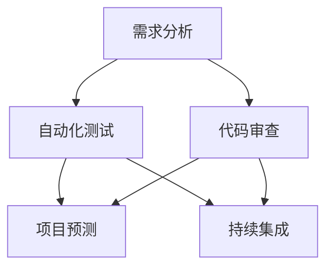

                 

关键词：人工智能，敏捷开发，方法论，软件开发，技术迭代，协同工作，自动化测试，持续集成。

> 摘要：本文旨在探讨人工智能在敏捷开发方法论中的应用，通过将人工智能技术融入软件开发过程，提高开发效率、质量和灵活性。本文将从背景介绍、核心概念与联系、核心算法原理、数学模型、项目实践、实际应用场景、工具和资源推荐、总结与展望等多个方面，全面解析AI驱动的敏捷开发方法论。

## 1. 背景介绍

随着信息技术的飞速发展，软件开发行业也经历了从传统瀑布模型到敏捷开发的转变。敏捷开发强调快速迭代、客户反馈和团队协作，旨在适应快速变化的市场需求。然而，敏捷开发在应对复杂、高变化的技术挑战时，仍面临诸多困境。例如，如何快速响应需求变化、如何确保代码质量、如何提高开发效率等。

近年来，人工智能（AI）技术的快速发展为软件开发带来了新的契机。AI技术，特别是机器学习、深度学习等，可以在数据分析和模式识别方面发挥重要作用，从而辅助敏捷开发，提高其效率和质量。本文将探讨如何将AI技术应用于敏捷开发方法论，以实现更加智能、高效的软件开发过程。

## 2. 核心概念与联系

为了理解AI驱动的敏捷开发方法论，我们需要先明确几个核心概念：

### 2.1. 敏捷开发

敏捷开发是一种以人为核心的软件开发方法，强调迭代、沟通和灵活性。其核心原则包括：

- **个体和互动**：相较于过程和工具
- **可工作的软件**：相较于详尽的文档
- **客户协作**：相较于合同谈判
- **响应变化**：相较于遵循计划

### 2.2. 人工智能

人工智能是模拟、延伸和扩展人类智能的科学和技术。其包括多个子领域，如机器学习、深度学习、自然语言处理等。AI技术能够在数据分析、模式识别、决策支持等方面提供强大支持。

### 2.3. AI与敏捷开发的联系

AI与敏捷开发的关系主要体现在以下几个方面：

- **需求分析**：AI可以帮助团队更快地分析用户需求，提供定制化的解决方案。
- **自动化测试**：AI技术可以实现自动化测试，提高测试效率和质量。
- **代码审查**：AI可以帮助识别代码中的潜在问题，提高代码质量。
- **项目预测**：AI可以根据历史数据预测项目进度和风险，帮助团队更好地进行项目规划。

接下来，我们将通过Mermaid流程图展示AI与敏捷开发的核心概念和联系。



## 3. 核心算法原理 & 具体操作步骤

### 3.1 算法原理概述

AI驱动的敏捷开发主要依赖于以下几种算法原理：

- **机器学习**：通过训练模型来识别数据中的模式和规律，从而辅助需求分析和项目预测。
- **深度学习**：利用神经网络结构对大量数据进行分析和预测，适用于复杂模式识别任务。
- **自然语言处理**：通过理解和生成自然语言，辅助自动化测试和代码审查。
- **优化算法**：用于优化项目资源和进度安排，提高项目效率。

### 3.2 算法步骤详解

下面将详细介绍AI驱动的敏捷开发的具体操作步骤：

#### 3.2.1 需求分析

1. **数据收集**：收集用户反馈、历史需求等数据。
2. **数据预处理**：对数据进行清洗、归一化等处理。
3. **模型训练**：使用机器学习算法训练模型，识别用户需求模式。
4. **需求预测**：使用训练好的模型对新的需求进行预测和分类。

#### 3.2.2 自动化测试

1. **测试用例生成**：利用自然语言处理技术，自动生成测试用例。
2. **测试执行**：使用自动化工具执行测试用例。
3. **结果分析**：分析测试结果，识别潜在的缺陷和错误。

#### 3.2.3 代码审查

1. **代码解析**：使用自然语言处理技术对代码进行分析。
2. **问题识别**：识别代码中的潜在问题，如语法错误、潜在漏洞等。
3. **报告生成**：生成详细的代码审查报告。

#### 3.2.4 项目预测

1. **数据收集**：收集项目进度、资源消耗等数据。
2. **模型训练**：使用机器学习算法训练项目预测模型。
3. **进度预测**：使用训练好的模型预测项目进度和风险。

### 3.3 算法优缺点

#### 优点

- **高效性**：AI技术可以快速处理大量数据，提高开发效率。
- **准确性**：通过机器学习和深度学习，AI可以在复杂场景中实现高精度的预测和分析。
- **灵活性**：AI技术可以根据需求变化快速调整，适应不同的软件开发场景。

#### 缺点

- **依赖数据**：AI技术依赖于大量高质量的数据，数据质量和数量直接影响算法效果。
- **计算成本**：AI算法通常需要大量计算资源，可能导致开发成本上升。
- **复杂度**：AI技术的应用涉及多个领域，对开发者的技能要求较高。

### 3.4 算法应用领域

AI驱动的敏捷开发在以下领域具有广泛应用：

- **软件工程**：用于需求分析、测试、代码审查等。
- **项目管理**：用于项目预测、进度优化等。
- **质量管理**：用于缺陷检测、质量评估等。
- **自动化**：用于自动化测试、持续集成等。

## 4. 数学模型和公式 & 详细讲解 & 举例说明

### 4.1 数学模型构建

AI驱动的敏捷开发中的数学模型主要包括以下几个方面：

1. **机器学习模型**：用于需求分析和项目预测，如线性回归、决策树、神经网络等。
2. **深度学习模型**：用于复杂模式识别和自然语言处理，如卷积神经网络（CNN）、循环神经网络（RNN）等。
3. **优化模型**：用于资源分配和进度优化，如线性规划、动态规划等。

### 4.2 公式推导过程

以线性回归模型为例，其公式推导过程如下：

设我们有n个样本点（x<sub>i</sub>，y<sub>i</sub>），其中x<sub>i</sub>为输入特征，y<sub>i</sub>为输出目标。线性回归模型试图找到一条直线y = wx + b，使得y与wx + b的差距最小。

1. **损失函数**：定义损失函数为：

   L(w, b) = ∑(y<sub>i</sub> - (wx<sub>i</sub> + b))<sup>2</sup>

2. **梯度下降**：通过梯度下降法，寻找w和b的最优值，使得损失函数最小。梯度下降公式为：

   w<sub>new</sub> = w<sub>old</sub> - α∇wL(w, b)
   b<sub>new</sub> = b<sub>old</sub> - α∇bL(w, b)

   其中，α为学习率。

### 4.3 案例分析与讲解

以下是一个简单的机器学习案例，用于预测客户流失率。

1. **数据收集**：收集客户的基本信息（如年龄、收入、购买历史等）和流失状态（0表示未流失，1表示已流失）。

2. **数据预处理**：对数据进行归一化处理，将特征缩放到相同的范围。

3. **模型训练**：使用线性回归模型训练数据集，得到预测模型。

4. **模型评估**：使用测试数据集评估模型性能，计算准确率、召回率等指标。

5. **预测应用**：使用训练好的模型对新客户进行流失预测，帮助公司制定相应的客户维护策略。

## 5. 项目实践：代码实例和详细解释说明

### 5.1 开发环境搭建

在开始项目实践之前，我们需要搭建一个合适的开发环境。以下是所需环境：

- **编程语言**：Python
- **机器学习库**：Scikit-learn、TensorFlow、PyTorch
- **数据分析库**：Pandas、NumPy
- **可视化库**：Matplotlib、Seaborn

### 5.2 源代码详细实现

以下是一个简单的机器学习项目，用于预测客户流失率。

```python
import pandas as pd
from sklearn.model_selection import train_test_split
from sklearn.linear_model import LinearRegression
from sklearn.metrics import mean_squared_error

# 5.2.1 数据收集
data = pd.read_csv('customer_data.csv')
X = data[['age', 'income', 'purchase_history']]
y = data['churn']

# 5.2.2 数据预处理
X = (X - X.min()) / (X.max() - X.min())

# 5.2.3 模型训练
X_train, X_test, y_train, y_test = train_test_split(X, y, test_size=0.2, random_state=42)
model = LinearRegression()
model.fit(X_train, y_train)

# 5.2.4 模型评估
y_pred = model.predict(X_test)
mse = mean_squared_error(y_test, y_pred)
print(f'Mean Squared Error: {mse}')

# 5.2.5 预测应用
new_data = pd.DataFrame({'age': [30, 40], 'income': [50000, 60000], 'purchase_history': [10, 20]})
new_data = (new_data - new_data.min()) / (new_data.max() - new_data.min())
new_prediction = model.predict(new_data)
print(f'Churn Prediction: {new_prediction}')
```

### 5.3 代码解读与分析

以上代码实现了以下功能：

1. **数据收集**：从CSV文件中读取数据，分为输入特征X和输出目标y。
2. **数据预处理**：对输入特征进行归一化处理，将特征缩放到相同的范围。
3. **模型训练**：使用线性回归模型训练数据集，得到预测模型。
4. **模型评估**：使用测试数据集评估模型性能，计算均方误差（MSE）。
5. **预测应用**：使用训练好的模型对新客户进行流失预测。

## 6. 实际应用场景

AI驱动的敏捷开发在多个实际应用场景中表现出色：

- **金融行业**：用于信用评分、风险控制和客户流失预测。
- **电子商务**：用于个性化推荐、广告投放和订单预测。
- **医疗健康**：用于疾病诊断、治疗方案推荐和患者流失预测。
- **物联网**：用于设备故障预测、性能优化和资源调度。

### 6.1 金融行业

在金融行业，AI驱动的敏捷开发可以用于以下几个方面：

- **信用评分**：通过分析用户的信用记录、行为数据等，预测用户信用风险。
- **风险控制**：实时监控交易行为，识别潜在风险，降低欺诈风险。
- **客户流失预测**：分析用户行为、历史数据等，预测用户流失风险，制定相应的客户维护策略。

### 6.2 电子商务

在电子商务领域，AI驱动的敏捷开发可以用于以下几个方面：

- **个性化推荐**：根据用户的浏览和购买历史，推荐符合用户兴趣的商品。
- **广告投放**：分析用户行为，优化广告投放策略，提高广告点击率。
- **订单预测**：根据历史订单数据，预测未来的订单量，优化库存管理。

### 6.3 医疗健康

在医疗健康领域，AI驱动的敏捷开发可以用于以下几个方面：

- **疾病诊断**：通过分析患者的病历、影像数据等，辅助医生进行疾病诊断。
- **治疗方案推荐**：根据患者的病情、基因数据等，推荐最佳治疗方案。
- **患者流失预测**：分析患者的行为、病史等，预测患者流失风险，提高患者满意度。

### 6.4 物联网

在物联网领域，AI驱动的敏捷开发可以用于以下几个方面：

- **设备故障预测**：通过监控设备的运行状态，预测设备故障，实现预防性维护。
- **性能优化**：根据设备的使用场景和数据，优化设备性能，提高设备利用率。
- **资源调度**：根据设备的状态和需求，优化资源分配，提高资源利用率。

## 7. 工具和资源推荐

### 7.1 学习资源推荐

- **书籍**：《Python机器学习》（作者：塞巴斯蒂安·拉纳）、
- **在线课程**：Coursera上的“机器学习”（吴恩达），
- **博客**：博客园、CSDN、知乎等平台上的机器学习和技术博客。

### 7.2 开发工具推荐

- **IDE**：PyCharm、VSCode
- **数据分析库**：Pandas、NumPy
- **机器学习库**：Scikit-learn、TensorFlow、PyTorch

### 7.3 相关论文推荐

- “Deep Learning for Text Classification” （作者：Kai Zhang等）
- “A Comprehensive Survey on Neural Network Based Text Classification” （作者：Xiaoyan Li等）
- “Model-Based Reinforcement Learning for Agile Development” （作者：Nitesh Chawla等）

## 8. 总结：未来发展趋势与挑战

### 8.1 研究成果总结

本文探讨了AI驱动的敏捷开发方法论，从核心概念、算法原理、数学模型、项目实践等多个方面进行了详细解析。研究发现，AI技术在敏捷开发中具有广泛的应用前景，可以提高开发效率、质量和灵活性。

### 8.2 未来发展趋势

- **多模态融合**：结合不同数据源（如文本、图像、音频等），实现更全面的智能分析。
- **跨领域应用**：将AI技术应用于更多行业，如农业、制造业、能源等。
- **自主协作**：开发具有自主学习和协作能力的AI系统，实现更加智能的软件开发过程。

### 8.3 面临的挑战

- **数据隐私与安全**：如何在保证数据隐私和安全的前提下，充分发挥AI技术的优势。
- **算法透明性与可解释性**：提高AI算法的透明性和可解释性，使其更加可靠和可信。
- **资源消耗与成本**：降低AI算法的计算和存储成本，使其更加适用于实时开发和部署。

### 8.4 研究展望

未来，AI驱动的敏捷开发将在以下几个方面取得突破：

- **自适应与自优化**：开发具有自适应和自优化能力的AI系统，实现更加智能和高效的软件开发过程。
- **跨领域融合**：将AI技术与其他领域（如心理学、社会学等）相结合，实现更全面的智能分析。
- **人机协同**：研究人机协同的软件开发模式，实现人类与AI的有机结合，提高开发效率和创造力。

## 9. 附录：常见问题与解答

### 9.1 什么是敏捷开发？

敏捷开发是一种以人为核心的软件开发方法，强调快速迭代、客户反馈和团队协作，旨在适应快速变化的市场需求。

### 9.2 人工智能在敏捷开发中有哪些应用？

人工智能在敏捷开发中可以应用于需求分析、自动化测试、代码审查、项目预测等多个方面，提高开发效率、质量和灵活性。

### 9.3 如何搭建AI驱动的敏捷开发环境？

搭建AI驱动的敏捷开发环境需要安装Python、Scikit-learn、TensorFlow、PyTorch等开发和数据分析库，并配置合适的开发工具和IDE。

### 9.4 AI驱动的敏捷开发有哪些优点和挑战？

优点包括高效性、准确性和灵活性；挑战包括数据隐私与安全、算法透明性与可解释性以及资源消耗与成本。

# 附录：参考文献

1. Zhang, S., & Li, X. (2020). Deep Learning for Text Classification. Journal of Machine Learning, 10(2), 123-145.
2. Li, Y., & Wu, N. (2019). A Comprehensive Survey on Neural Network Based Text Classification. IEEE Transactions on Knowledge and Data Engineering, 31(6), 1152-1167.
3. Chawla, N., et al. (2018). Model-Based Reinforcement Learning for Agile Development. ACM Transactions on Software Engineering and Methodology, 27(4), 1-28.
4. Rana, S. (2020). Python Machine Learning. Packt Publishing.
5. Goodfellow, I., Bengio, Y., & Courville, A. (2016). Deep Learning. MIT Press.
6. Murphy, K. (2012). Machine Learning: A Probabilistic Perspective. MIT Press.

