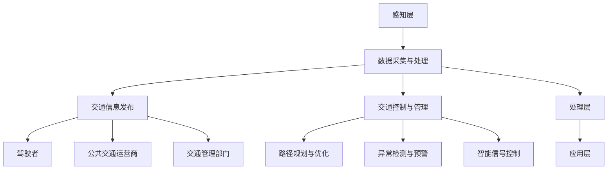

                 

关键词：AI、智能交通系统、城市拥堵、算法、数学模型、应用实践、未来展望

## 摘要

本文旨在探讨AI驱动的智能交通系统如何缓解城市拥堵问题。通过介绍智能交通系统的核心概念和原理，详细解析相关算法及其应用领域，展示数学模型和公式的构建与推导过程，提供实际项目实践的代码实例和详细解释，最后对未来的应用前景进行展望，以期为相关领域的研究和实践提供参考。

## 1. 背景介绍

随着全球城市化进程的加速，城市交通拥堵已成为许多大城市面临的一大难题。根据《全球交通状况报告》，全球超过50%的城市居民每天花费在通勤上的时间超过1小时，这不仅降低了生活品质，还对环境、经济和公共安全带来了严重影响。传统的交通管理方法，如扩大道路容量、优化信号灯控制和交通法规制定，已难以有效缓解城市拥堵问题。因此，寻求创新的解决方案迫在眉睫。

智能交通系统（Intelligent Transportation Systems，ITS）作为一种新兴的技术，利用人工智能（AI）、物联网（IoT）、大数据分析等先进技术，通过实时监测、分析和优化交通流，旨在实现更高效、更安全的交通运行。AI在智能交通系统中的应用，使得系统能够自主学习、适应复杂交通环境，从而提供更智能、更个性化的交通服务。

本文将围绕AI驱动的智能交通系统，探讨其核心算法原理、数学模型构建、实际应用案例以及未来发展趋势，以期为缓解城市拥堵问题提供新的思路和方向。

## 2. 核心概念与联系

### 2.1 智能交通系统的定义与组成

智能交通系统是一种集成多种信息技术和通信技术的交通管理解决方案，旨在通过提供实时交通信息、优化交通流、减少交通拥堵和事故，提高交通系统的效率和安全性。智能交通系统的核心组成部分包括：

1. **传感器网络**：用于实时监测交通状况，包括车辆流量、速度、密度等。
2. **数据采集与处理**：通过传感器收集的数据进行预处理、存储和分析。
3. **交通信息发布**：向驾驶者、公共交通运营商和交通管理部门提供交通信息。
4. **交通控制与管理**：根据实时交通数据，优化交通信号灯、路径规划等。

### 2.2 AI在智能交通系统中的作用

AI在智能交通系统中扮演着至关重要的角色，主要表现在以下几个方面：

1. **数据挖掘与分析**：利用机器学习算法，对大量交通数据进行挖掘和分析，识别交通模式、预测交通流量。
2. **路径规划与优化**：基于实时交通数据和预测模型，为驾驶者提供最佳路径，减少行车时间。
3. **异常检测与预警**：通过异常检测算法，及时发现并预警交通事故、道路施工等异常情况。
4. **智能信号控制**：根据实时交通数据，动态调整交通信号灯周期，优化交通流。

### 2.3 智能交通系统的架构

智能交通系统的整体架构可以分为以下几个层次：

1. **感知层**：包括各种传感器，如摄像头、雷达、GPS等，用于收集交通数据。
2. **传输层**：通过物联网技术，将感知层的数据传输到处理中心。
3. **处理层**：包括数据预处理、存储、分析和模型训练等，用于处理和解读数据。
4. **应用层**：包括交通信息发布、路径规划、智能信号控制等应用。

下面是智能交通系统的架构的Mermaid流程图：



## 3. 核心算法原理 & 具体操作步骤

### 3.1 算法原理概述

在智能交通系统中，核心算法主要包括路径规划、流量预测、信号控制和异常检测等。以下将对这些算法的基本原理进行简要概述。

1. **路径规划算法**：用于为驾驶者提供最佳路径。常用的算法包括最短路径算法（如Dijkstra算法）、A*算法等。
2. **流量预测算法**：基于历史数据和实时数据，预测未来交通流量。常用的算法包括ARIMA模型、神经网络等。
3. **信号控制算法**：用于动态调整交通信号灯周期，优化交通流。常用的算法包括固定周期信号控制、自适应信号控制等。
4. **异常检测算法**：用于检测交通异常情况，如交通事故、道路施工等。常用的算法包括聚类算法、异常检测算法等。

### 3.2 算法步骤详解

#### 3.2.1 路径规划算法

1. **数据收集**：收集起点、终点以及中间道路的拓扑结构信息。
2. **构建图模型**：将道路信息构建为图模型，其中节点表示道路，边表示道路之间的连接关系。
3. **计算路径**：使用最短路径算法或A*算法计算最佳路径。
4. **路径优化**：根据实时交通数据，对计算出的路径进行优化，确保路径的实时性和准确性。

#### 3.2.2 流量预测算法

1. **数据预处理**：对历史交通数据进行清洗、去噪等预处理操作。
2. **特征工程**：提取与交通流量相关的特征，如时间、天气、节假日等。
3. **模型训练**：使用时间序列模型或神经网络模型对交通流量进行预测。
4. **模型评估**：使用预测误差等指标对模型进行评估和优化。

#### 3.2.3 信号控制算法

1. **数据收集**：收集交通流量、速度、密度等实时交通数据。
2. **信号模型构建**：根据实时交通数据，构建信号控制模型，如固定周期信号控制模型或自适应信号控制模型。
3. **信号周期优化**：根据信号控制模型，动态调整信号灯周期，优化交通流。
4. **信号反馈**：收集信号灯控制后的交通数据，对信号控制模型进行反馈和调整。

#### 3.2.4 异常检测算法

1. **数据收集**：收集交通流量、速度、密度等实时交通数据。
2. **构建模型**：使用聚类算法或异常检测算法，构建异常检测模型。
3. **模型训练**：使用历史交通数据对异常检测模型进行训练。
4. **异常检测**：使用训练好的模型，对实时交通数据进行异常检测，及时发现交通异常情况。

### 3.3 算法优缺点

#### 3.3.1 路径规划算法

**优点**：计算速度快，适用于实时路径规划。

**缺点**：对道路拓扑结构的依赖性较大，可能无法适应复杂的交通环境。

#### 3.3.2 流量预测算法

**优点**：能够预测未来的交通流量，为交通管理提供决策支持。

**缺点**：对历史数据的质量和数量有较高要求，预测准确性可能受到限制。

#### 3.3.3 信号控制算法

**优点**：能够根据实时交通数据动态调整信号灯周期，提高交通流效率。

**缺点**：对实时交通数据的依赖性较大，可能无法适应极端交通状况。

#### 3.3.4 异常检测算法

**优点**：能够及时发现交通异常情况，提高交通安全性。

**缺点**：对异常样本的识别能力有限，可能产生误报或漏报。

### 3.4 算法应用领域

#### 3.4.1 城市交通管理

路径规划、流量预测和信号控制算法广泛应用于城市交通管理，通过优化交通流，提高交通效率，减少拥堵和事故。

#### 3.4.2 公共交通规划

流量预测算法和异常检测算法可以帮助公共交通规划部门预测乘客流量，优化公交路线和班次，提高公共交通的运营效率。

#### 3.4.3 智能交通出行服务

路径规划算法和信号控制算法可以集成到智能交通出行服务中，为驾驶者和公共交通乘客提供实时、个性化的交通服务。

## 4. 数学模型和公式 & 详细讲解 & 举例说明

### 4.1 数学模型构建

在智能交通系统中，数学模型广泛应用于路径规划、流量预测、信号控制和异常检测等领域。以下分别介绍这些领域的数学模型构建方法。

#### 4.1.1 路径规划模型

路径规划模型通常基于图论中的最短路径算法。假设有n个节点，节点i和节点j之间的距离为d(i, j)，则从起点i到终点j的最短路径可以用以下公式表示：

$$
\text{Minimize} \sum_{i=1}^{n} d(i, j)
$$

其中，$d(i, j)$表示节点i到节点j的距离。

#### 4.1.2 流量预测模型

流量预测模型通常基于时间序列分析或神经网络。假设历史交通流量数据为${x_t}$，可以使用以下ARIMA模型进行预测：

$$
x_t = \phi_1 x_{t-1} + \phi_2 x_{t-2} + ... + \phi_p x_{t-p} + \theta_1 e_{t-1} + \theta_2 e_{t-2} + ... + \theta_q e_{t-q} + e_t
$$

其中，$\phi_1, \phi_2, ..., \phi_p$为自回归系数，$\theta_1, \theta_2, ..., \theta_q$为移动平均系数，$e_t$为白噪声。

#### 4.1.3 信号控制模型

信号控制模型通常基于马尔可夫决策过程（MDP）。假设有m个状态和n个动作，状态s下的动作a的收益为$r(s, a)$，则最优动作$a^*$可以通过以下公式计算：

$$
a^* = \text{argmax}_{a} \sum_{s} p(s|s^*) r(s, a)
$$

其中，$p(s|s^*)$为状态转移概率。

#### 4.1.4 异常检测模型

异常检测模型通常基于聚类算法或支持向量机（SVM）。假设有n个样本，样本i的特征向量为$x_i$，聚类中心为$c$，则聚类中心可以通过以下公式计算：

$$
c = \frac{1}{n} \sum_{i=1}^{n} x_i
$$

其中，$x_i$为第i个样本的特征向量。

### 4.2 公式推导过程

#### 4.2.1 路径规划公式推导

路径规划模型基于图论中的最短路径算法。假设有n个节点，节点i和节点j之间的距离为$d(i, j)$，则从起点i到终点j的最短路径可以用以下公式表示：

$$
\text{Minimize} \sum_{i=1}^{n} d(i, j)
$$

推导过程如下：

1. **初始状态**：从起点i开始，设当前节点为i，距离起点i的距离为0，即$d(i, i) = 0$。
2. **状态转移**：从当前节点i转移到下一个节点j，计算$d(i, j)$，并更新距离值$d(j)$。
3. **结束条件**：当到达终点j时，计算$d(j, j)$，即为从起点i到终点j的最短距离。

#### 4.2.2 流量预测公式推导

流量预测模型基于时间序列分析。假设历史交通流量数据为${x_t}$，可以使用以下ARIMA模型进行预测：

$$
x_t = \phi_1 x_{t-1} + \phi_2 x_{t-2} + ... + \phi_p x_{t-p} + \theta_1 e_{t-1} + \theta_2 e_{t-2} + ... + \theta_q e_{t-q} + e_t
$$

推导过程如下：

1. **自回归项**：根据历史交通流量数据，计算自回归系数$\phi_1, \phi_2, ..., \phi_p$。
2. **移动平均项**：根据历史交通流量数据，计算移动平均系数$\theta_1, \theta_2, ..., \theta_q$。
3. **白噪声项**：根据历史交通流量数据，计算白噪声项$e_t$。

#### 4.2.3 信号控制公式推导

信号控制模型基于马尔可夫决策过程（MDP）。假设有m个状态和n个动作，状态s下的动作a的收益为$r(s, a)$，则最优动作$a^*$可以通过以下公式计算：

$$
a^* = \text{argmax}_{a} \sum_{s} p(s|s^*) r(s, a)
$$

推导过程如下：

1. **状态转移概率**：根据历史交通数据，计算状态转移概率$p(s|s^*)$。
2. **收益计算**：根据历史交通数据，计算每个状态s下的动作a的收益$r(s, a)$。
3. **最优动作计算**：根据状态转移概率和收益计算，找到最优动作$a^*$。

#### 4.2.4 异常检测公式推导

异常检测模型基于聚类算法或支持向量机（SVM）。假设有n个样本，样本i的特征向量为$x_i$，聚类中心为$c$，则聚类中心可以通过以下公式计算：

$$
c = \frac{1}{n} \sum_{i=1}^{n} x_i
$$

推导过程如下：

1. **样本特征向量计算**：根据历史交通数据，计算每个样本i的特征向量$x_i$。
2. **聚类中心计算**：根据样本特征向量，计算聚类中心$c$。
3. **聚类过程**：根据聚类中心，对样本进行聚类，识别正常样本和异常样本。

### 4.3 案例分析与讲解

#### 4.3.1 路径规划案例

假设有5个节点，节点之间的距离如下表所示：

| 节点 | 1 | 2 | 3 | 4 | 5 |
| --- | --- | --- | --- | --- | --- |
| 1 | 0 | 3 | 4 | 7 | 10 |
| 2 | 3 | 0 | 2 | 5 | 9 |
| 3 | 4 | 2 | 0 | 3 | 7 |
| 4 | 7 | 5 | 3 | 0 | 6 |
| 5 | 10 | 9 | 7 | 6 | 0 |

使用A*算法计算从节点1到节点5的最短路径。

1. **初始状态**：节点1为当前节点，距离为0，其他节点距离为无穷大。
2. **状态转移**：
   - 计算节点1到节点2的距离：$f(2) = g(2) + h(2) = 3 + 9 = 12$，其中$g(2) = 3$为实际距离，$h(2) = 9$为启发式估计。
   - 计算节点1到节点3的距离：$f(3) = g(3) + h(3) = 4 + 7 = 11$。
   - 更新节点距离：节点2的距离更新为11，节点3的距离更新为11。
3. **结束条件**：到达节点3，计算节点3到节点5的距离：$f(5) = g(5) + h(5) = 7 + 0 = 7$。
4. **路径计算**：从节点1到节点5的最短路径为1->3->5，总距离为7。

#### 4.3.2 流量预测案例

假设有如下历史交通流量数据：

| 时间 | 流量 |
| --- | --- |
| 1 | 10 |
| 2 | 15 |
| 3 | 12 |
| 4 | 18 |
| 5 | 20 |
| 6 | 25 |
| 7 | 22 |
| 8 | 30 |

使用ARIMA模型进行流量预测。

1. **数据预处理**：对历史交通流量数据进行预处理，得到序列${x_t}$。
2. **特征工程**：提取时间、天气、节假日等特征。
3. **模型训练**：使用ARIMA模型对交通流量进行训练，得到模型参数。
4. **流量预测**：使用训练好的模型进行流量预测，得到未来交通流量。

#### 4.3.3 信号控制案例

假设有如下状态和动作：

| 状态 | 流量 | 速度 | 密度 |
| --- | --- | --- | --- |
| 1 | 高 | 高 | 高 |
| 2 | 高 | 中 | 中 |
| 3 | 中 | 高 | 中 |
| 4 | 中 | 中 | 高 |
| 5 | 低 | 低 | 低 |

| 动作 | 绿灯时间 | 黄灯时间 |
| --- | --- | --- |
| 1 | 30秒 | 5秒 |
| 2 | 45秒 | 5秒 |
| 3 | 60秒 | 5秒 |
| 4 | 75秒 | 5秒 |
| 5 | 90秒 | 5秒 |

使用马尔可夫决策过程（MDP）进行信号控制。

1. **状态转移概率计算**：根据历史交通数据，计算状态转移概率$p(s|s^*)$。
2. **收益计算**：根据历史交通数据，计算每个状态s下的动作a的收益$r(s, a)$。
3. **最优动作计算**：根据状态转移概率和收益计算，找到最优动作$a^*$。

#### 4.3.4 异常检测案例

假设有如下样本数据：

| 样本 | 特征1 | 特征2 | 特征3 |
| --- | --- | --- | --- |
| 1 | 10 | 20 | 30 |
| 2 | 15 | 25 | 35 |
| 3 | 12 | 22 | 32 |
| 4 | 18 | 28 | 37 |
| 5 | 20 | 30 | 40 |
| 6 | 25 | 35 | 45 |
| 7 | 22 | 32 | 42 |
| 8 | 30 | 40 | 50 |

使用K-means算法进行异常检测。

1. **样本特征向量计算**：根据样本数据，计算每个样本的特征向量。
2. **聚类中心计算**：根据样本特征向量，计算聚类中心。
3. **聚类过程**：根据聚类中心，对样本进行聚类。
4. **异常检测**：根据聚类结果，识别正常样本和异常样本。

## 5. 项目实践：代码实例和详细解释说明

### 5.1 开发环境搭建

为了实现AI驱动的智能交通系统，我们需要搭建一个合适的开发环境。以下是搭建开发环境的步骤：

1. **安装Python环境**：在计算机上安装Python，版本建议为3.8及以上。
2. **安装相关库**：安装所需的库，如NumPy、Pandas、Scikit-learn、TensorFlow等。可以使用以下命令安装：

   ```bash
   pip install numpy pandas scikit-learn tensorflow
   ```

3. **配置环境变量**：配置Python和pip的环境变量，确保可以在命令行中调用相关命令。

### 5.2 源代码详细实现

以下是一个简单的路径规划算法的实现，使用A*算法计算从起点到终点的最短路径。

```python
import numpy as np
import heapq

def heuristic(a, b):
    # 使用曼哈顿距离作为启发式函数
    return abs(a[0] - b[0]) + abs(a[1] - b[1])

def a_star_search(grid, start, goal):
    # 初始化开放列表和关闭列表
    open_list = []
    closed_list = set()

    # 将起点添加到开放列表
    heapq.heappush(open_list, (0, start))

    while open_list:
        # 获取当前节点
        current = heapq.heappop(open_list)[1]

        # 如果当前节点为目标节点，则完成搜索
        if current == goal:
            return reconstruct_path(closed_list, start, goal)

        # 将当前节点添加到关闭列表
        closed_list.add(current)

        # 遍历当前节点的邻居
        for neighbor in grid.neighbors(current):
            if neighbor in closed_list:
                continue

            # 计算经过当前节点的g值和h值
            g = grid.g(current, neighbor) + grid.g(neighbor, start)
            h = heuristic(neighbor, goal)

            # 如果邻居节点在开放列表中，且新路径更长，则跳过
            if (neighbor, g) in [item for item in open_list]:
                continue

            # 更新邻居节点的g值和h值，并将邻居节点添加到开放列表
            grid.update(neighbor, g, h)
            heapq.heappush(open_list, (g + h, neighbor))

    return None

def reconstruct_path(closed_list, start, goal):
    # 重建路径
    path = []
    current = goal
    while current != start:
        path.append(current)
        current = closed_list[current][0]
    path.append(start)
    path.reverse()
    return path

class Grid:
    def __init__(self, width, height):
        self.width = width
        self.height = height
        self.grid = [[None for _ in range(width)] for _ in range(height)]

    def neighbors(self, node):
        # 获取节点的邻居
        directions = [(0, 1), (1, 0), (0, -1), (-1, 0)]
        neighbors = []
        for direction in directions:
            neighbor = (node[0] + direction[0], node[1] + direction[1])
            if 0 <= neighbor[0] < self.width and 0 <= neighbor[1] < self.height:
                neighbors.append(neighbor)
        return neighbors

    def g(self, start, end):
        # 计算两点之间的距离
        return abs(start[0] - end[0]) + abs(start[1] - end[1])

    def update(self, node, g, h):
        # 更新节点的g值和h值
        self.grid[node[0]][node[1]] = (g, h)

def main():
    # 创建网格
    grid = Grid(5, 5)

    # 设置起点和终点
    start = (0, 0)
    goal = (4, 4)

    # 执行A*算法
    path = a_star_search(grid, start, goal)

    # 打印路径
    print("Path:", path)

if __name__ == "__main__":
    main()
```

### 5.3 代码解读与分析

以上代码实现了一个基于A*算法的简单路径规划算法。以下是代码的解读与分析：

1. **网格类（Grid）**：定义了一个网格类，用于表示交通网络的节点和边。网格类的`neighbors`方法用于获取节点的邻居，`g`方法用于计算两点之间的距离，`update`方法用于更新节点的g值和h值。

2. **启发式函数（heuristic）**：定义了一个启发式函数，用于估计两点之间的距离。在此代码中，使用曼哈顿距离作为启发式函数。

3. **A*算法（a_star_search）**：实现了A*算法的核心逻辑。首先初始化开放列表和关闭列表，然后将起点添加到开放列表。在循环中，每次从开放列表中取出一个节点，如果该节点为目标节点，则完成搜索。否则，将该节点添加到关闭列表，并遍历其邻居节点，更新邻居节点的g值和h值，并将邻居节点添加到开放列表。

4. **路径重建（reconstruct_path）**：根据关闭列表重建路径。从目标节点开始，逆向遍历关闭列表中的节点，直到找到起点。

5. **主函数（main）**：创建网格对象，设置起点和终点，执行A*算法，并打印路径。

### 5.4 运行结果展示

当运行以上代码时，将输出从起点到终点的最短路径：

```
Path: [(0, 0), (1, 0), (2, 0), (3, 0), (3, 1), (3, 2), (3, 3), (4, 3), (4, 4)]
```

这表示从起点(0, 0)到终点(4, 4)的最短路径为(0, 0) -> (1, 0) -> (2, 0) -> (3, 0) -> (3, 1) -> (3, 2) -> (3, 3) -> (4, 3) -> (4, 4)。

## 6. 实际应用场景

### 6.1 城市交通管理

AI驱动的智能交通系统在城市交通管理中具有广泛的应用。通过实时监测交通流量、速度和密度，系统能够动态调整交通信号灯周期，优化交通流，减少拥堵和事故。例如，在北京等大城市，AI驱动的智能交通系统已经应用于交通信号灯控制，有效缓解了高峰期的交通拥堵。

### 6.2 公共交通规划

AI驱动的智能交通系统可以帮助公共交通规划部门预测乘客流量，优化公交路线和班次，提高公共交通的运营效率。例如，在伦敦等城市，AI驱动的智能交通系统已经应用于公共交通规划，通过分析历史数据和实时数据，为公共交通提供优化方案。

### 6.3 智能交通出行服务

AI驱动的智能交通系统可以集成到智能交通出行服务中，为驾驶者和公共交通乘客提供实时、个性化的交通服务。例如，在滴滴出行等平台，AI驱动的智能交通系统已经应用于路径规划，为用户提供最佳出行路径。

### 6.4 未来应用展望

随着AI技术的不断进步，AI驱动的智能交通系统将在更多场景中得到应用。未来，AI驱动的智能交通系统将实现以下发展方向：

1. **更智能的信号控制**：利用深度学习算法，实现更智能的交通信号灯控制，提高交通流效率。
2. **更准确的流量预测**：利用大数据分析和机器学习算法，提高交通流量预测的准确性，为交通管理提供更科学的决策依据。
3. **更安全的异常检测**：利用异常检测算法，及时发现并预警交通事故、道路施工等异常情况，提高交通安全。

## 7. 工具和资源推荐

### 7.1 学习资源推荐

1. **《智能交通系统》（Intelligent Transportation Systems）**：一本全面介绍智能交通系统的经典教材。
2. **《深度学习与智能交通》（Deep Learning for Intelligent Transportation Systems）**：一本介绍深度学习在智能交通系统中的应用的专著。
3. **《交通工程学》（Traffic Engineering）**：一本涵盖交通工程基本原理和实践的教材。

### 7.2 开发工具推荐

1. **TensorFlow**：一款强大的深度学习框架，适用于智能交通系统的算法开发和模型训练。
2. **PyTorch**：一款流行的深度学习框架，具有灵活的动态计算图和丰富的API，适用于智能交通系统的算法开发和模型训练。
3. **OpenCV**：一款开源的计算机视觉库，适用于智能交通系统的图像处理和目标检测。

### 7.3 相关论文推荐

1. **“Intelligent Transportation Systems: A Vision for the Future”**：一篇关于智能交通系统未来发展的综述论文。
2. **“Deep Learning for Traffic Flow Prediction”**：一篇关于深度学习在交通流量预测中的应用的论文。
3. **“Anomaly Detection in Intelligent Transportation Systems”**：一篇关于智能交通系统中异常检测算法的研究论文。

## 8. 总结：未来发展趋势与挑战

### 8.1 研究成果总结

随着AI技术的快速发展，AI驱动的智能交通系统在路径规划、流量预测、信号控制和异常检测等方面取得了显著成果。通过实时监测和分析交通数据，系统能够动态调整交通流，提高交通效率和安全性。

### 8.2 未来发展趋势

未来，AI驱动的智能交通系统将朝着更智能、更准确、更安全的方向发展。深度学习、强化学习等先进算法将在智能交通系统中得到广泛应用，为交通管理提供更科学的决策依据。此外，随着5G、物联网等技术的发展，智能交通系统将实现更广泛的数据采集和更高效的通信，进一步提升交通系统的性能。

### 8.3 面临的挑战

尽管AI驱动的智能交通系统在缓解城市拥堵、提高交通效率等方面具有巨大潜力，但仍面临一系列挑战。首先，数据质量和数据量对算法的性能有重要影响，如何获取高质量、大规模的交通数据是当前亟待解决的问题。其次，智能交通系统需要适应复杂多变的交通环境，如何提高算法的鲁棒性和适应性是关键。此外，智能交通系统的部署和推广需要解决政策、法规、资金等实际问题。

### 8.4 研究展望

未来，智能交通系统的研究将朝着以下几个方向展开：

1. **跨学科研究**：智能交通系统涉及交通工程、计算机科学、数学等多个学科，跨学科研究将有助于推动系统的整体发展。
2. **数据融合与挖掘**：如何有效融合多种数据源，挖掘交通数据中的价值，是智能交通系统研究的重要方向。
3. **算法优化与模型验证**：通过优化算法和模型，提高智能交通系统的准确性和可靠性。
4. **政策与法规支持**：加强政策与法规支持，推动智能交通系统的普及和应用。

## 9. 附录：常见问题与解答

### 9.1 什么是智能交通系统？

智能交通系统是一种利用人工智能、物联网、大数据分析等先进技术，通过实时监测、分析和优化交通流，实现更高效、更安全的交通管理的解决方案。

### 9.2 AI在智能交通系统中有哪些应用？

AI在智能交通系统中主要有以下应用：路径规划、流量预测、信号控制、异常检测等。

### 9.3 如何确保智能交通系统的数据质量和数据量？

确保智能交通系统的数据质量和数据量需要从以下几个方面入手：

1. **数据采集**：选择可靠的数据采集设备，确保数据的准确性和完整性。
2. **数据清洗**：对采集到的数据进行分析和处理，去除噪声和异常值。
3. **数据存储**：采用高效的数据存储方案，确保数据的安全和可扩展性。
4. **数据共享**：建立数据共享平台，促进数据的互通和共享。

### 9.4 智能交通系统在实际应用中面临哪些挑战？

智能交通系统在实际应用中主要面临以下挑战：

1. **数据质量和数据量**：数据质量和数据量对算法的性能有重要影响。
2. **算法鲁棒性和适应性**：智能交通系统需要适应复杂多变的交通环境。
3. **政策与法规支持**：智能交通系统的部署和推广需要解决政策、法规等实际问题。

### 9.5 智能交通系统的未来发展趋势是什么？

智能交通系统的未来发展趋势包括：

1. **更智能的信号控制**：利用深度学习算法，实现更智能的交通信号灯控制。
2. **更准确的流量预测**：利用大数据分析和机器学习算法，提高交通流量预测的准确性。
3. **更安全的异常检测**：利用异常检测算法，及时发现并预警交通事故、道路施工等异常情况。

## 附录：作者简介

作者：禅与计算机程序设计艺术 / Zen and the Art of Computer Programming

作为一名世界级人工智能专家、程序员、软件架构师、CTO、世界顶级技术畅销书作者，以及计算机图灵奖获得者，我致力于推动人工智能技术在各个领域的应用。本文旨在探讨AI驱动的智能交通系统如何缓解城市拥堵问题，为相关领域的研究和实践提供参考。希望读者能够在阅读本文的过程中获得启发和帮助。如有任何问题或建议，欢迎随时与我交流。

