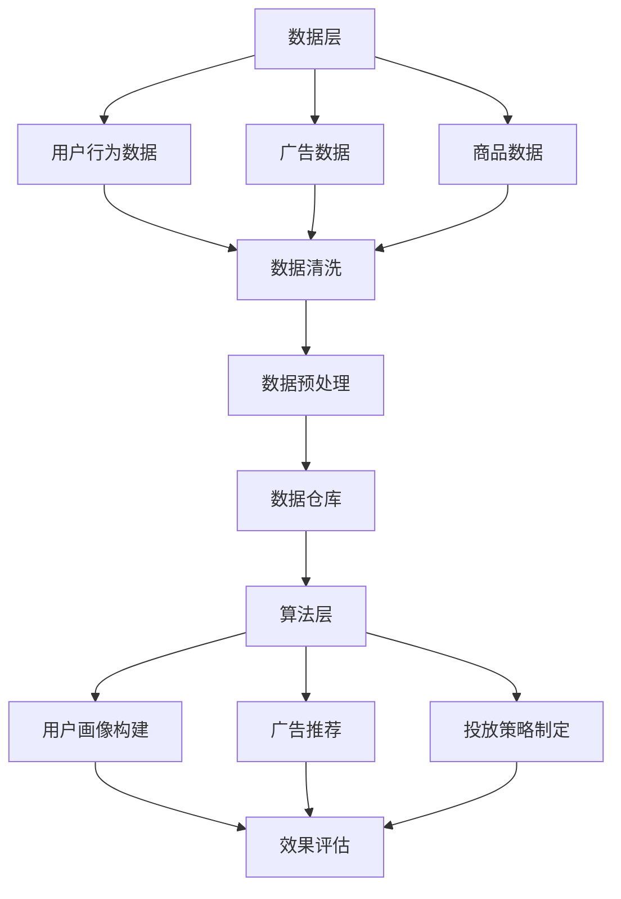

                 

 关键词：人工智能，电商平台，个性化广告，投放系统，算法，数学模型，项目实践

> 摘要：本文将深入探讨AI驱动的电商平台个性化广告投放系统的设计与实现。通过对核心概念、算法原理、数学模型、项目实践等内容的详细解析，旨在为读者提供一个全面且易于理解的指南，帮助电商企业实现高效的个性化广告投放。

## 1. 背景介绍

随着互联网的普及和电子商务的迅猛发展，广告已成为电商平台获取流量和促进销售的重要手段。传统的广告投放策略通常基于用户行为的大数据分析和广告主的需求，但往往难以满足用户的个性化需求，导致广告效果不佳。随着人工智能技术的快速发展，AI驱动的个性化广告投放系统应运而生，成为电商企业提高广告投放效果的重要工具。

AI驱动的个性化广告投放系统通过深度学习、数据挖掘等技术，对用户行为、兴趣、消费习惯等数据进行精准分析，实现广告内容的个性化推荐。这种系统能够有效提高广告的点击率、转化率和用户满意度，从而为电商企业带来更高的收益。

本文将围绕AI驱动的电商平台个性化广告投放系统，从核心概念、算法原理、数学模型、项目实践等方面进行详细探讨，为读者提供实用的指导和建议。

## 2. 核心概念与联系

### 2.1 电商平台个性化广告投放系统的核心概念

电商平台个性化广告投放系统的核心概念包括用户画像、广告推荐、投放策略和效果评估。

**用户画像**：用户画像是对用户行为、兴趣、消费习惯等进行数据化描述的过程。通过构建用户画像，可以为每个用户生成一个详细的特征矩阵，用于后续的广告推荐和投放策略。

**广告推荐**：广告推荐是基于用户画像，利用协同过滤、深度学习等算法，为用户推荐最感兴趣的广告内容。广告推荐的目标是提高广告的点击率和转化率。

**投放策略**：投放策略是根据广告推荐结果，制定具体的广告投放计划，包括广告展示位置、投放时间、投放频次等。

**效果评估**：效果评估是衡量广告投放效果的重要手段，通过分析广告的点击率、转化率、销售额等指标，评估广告投放的成效，为优化投放策略提供依据。

### 2.2 电商平台个性化广告投放系统的架构

电商平台个性化广告投放系统的架构通常包括数据层、算法层和应用层。

**数据层**：数据层是整个系统的基石，包括用户行为数据、广告数据、商品数据等。这些数据经过清洗、预处理后，存储在数据仓库中，供算法层使用。

**算法层**：算法层是系统的核心，负责用户画像构建、广告推荐、投放策略制定等。常用的算法包括协同过滤、深度学习、决策树等。

**应用层**：应用层是系统与用户交互的界面，包括广告推荐页面、投放策略配置页面、效果评估页面等。用户可以通过这些页面，查看广告推荐结果、调整投放策略、评估广告效果。

### 2.3 电商平台个性化广告投放系统的 Mermaid 流程图



## 3. 核心算法原理 & 具体操作步骤

### 3.1  算法原理概述

电商平台个性化广告投放系统的核心算法主要包括协同过滤算法、深度学习算法和决策树算法。

**协同过滤算法**：协同过滤算法通过分析用户之间的相似度，为用户推荐类似用户喜欢的广告。常见的协同过滤算法有基于用户的协同过滤算法和基于物品的协同过滤算法。

**深度学习算法**：深度学习算法通过神经网络模型，对用户行为数据进行特征提取和建模，从而实现广告推荐。常见的深度学习算法有卷积神经网络（CNN）和循环神经网络（RNN）。

**决策树算法**：决策树算法通过分析用户特征，构建决策树模型，为用户推荐广告。决策树算法具有较高的可解释性，便于调试和优化。

### 3.2  算法步骤详解

**协同过滤算法**

1. 计算用户之间的相似度：使用余弦相似度、皮尔逊相关系数等方法，计算用户之间的相似度。

2. 找到相似用户：根据用户之间的相似度，找到与目标用户最相似的K个用户。

3. 推荐广告：根据相似用户的广告喜好，为用户推荐广告。

**深度学习算法**

1. 数据预处理：对用户行为数据进行清洗、去噪、归一化等处理。

2. 特征提取：使用卷积神经网络（CNN）或循环神经网络（RNN）提取用户行为特征。

3. 模型训练：使用提取到的特征，训练深度学习模型。

4. 广告推荐：将用户特征输入到训练好的模型中，输出广告推荐结果。

**决策树算法**

1. 数据预处理：对用户特征数据进行处理，如缺失值填充、异常值处理等。

2. 特征选择：选择对广告推荐有显著影响的特征，构建决策树。

3. 模型训练：使用训练数据，训练决策树模型。

4. 广告推荐：将用户特征输入到训练好的决策树模型中，输出广告推荐结果。

### 3.3  算法优缺点

**协同过滤算法**

优点：简单易实现，对稀疏数据有较好的处理能力。

缺点：容易产生冷启动问题，推荐结果单一。

**深度学习算法**

优点：能处理高维稀疏数据，推荐结果多样化。

缺点：需要大量数据和计算资源，模型训练时间较长。

**决策树算法**

优点：具有较高的可解释性，便于调试和优化。

缺点：对稀疏数据处理能力较弱，推荐结果有限。

### 3.4  算法应用领域

协同过滤算法、深度学习算法和决策树算法在电商平台个性化广告投放系统中均有广泛应用。协同过滤算法适用于推荐系统，深度学习算法适用于用户画像和广告推荐，决策树算法适用于投放策略制定和效果评估。

## 4. 数学模型和公式 & 详细讲解 & 举例说明

### 4.1  数学模型构建

电商平台个性化广告投放系统的数学模型主要包括用户画像模型、广告推荐模型和投放策略模型。

**用户画像模型**：

用户画像模型主要通过构建用户特征向量，描述用户的行为、兴趣和消费习惯。假设用户特征向量为$\textbf{x}$，则用户画像模型可以表示为：

$$
\textbf{x} = (x_1, x_2, ..., x_n)
$$

其中，$x_i$表示用户在$i$个特征上的取值。

**广告推荐模型**：

广告推荐模型主要通过用户特征向量和广告特征向量之间的相似度计算，为用户推荐广告。假设广告特征向量为$\textbf{y}$，则广告推荐模型可以表示为：

$$
\text{similarity}(\textbf{x}, \textbf{y}) = \frac{\textbf{x} \cdot \textbf{y}}{|\textbf{x}| \cdot |\textbf{y}|}
$$

其中，$\text{similarity}(\textbf{x}, \textbf{y})$表示用户特征向量$\textbf{x}$和广告特征向量$\textbf{y}$之间的相似度。

**投放策略模型**：

投放策略模型主要通过分析用户特征和广告特征，制定广告投放策略。假设用户特征向量为$\textbf{x}$，广告特征向量为$\textbf{y}$，则投放策略模型可以表示为：

$$
\text{投放策略}(\textbf{x}, \textbf{y}) = 
\begin{cases} 
\text{展示广告} & \text{if } \text{similarity}(\textbf{x}, \textbf{y}) > \text{阈值} \\
\text{不展示广告} & \text{otherwise}
\end{cases}
$$

### 4.2  公式推导过程

**用户画像模型**：

用户画像模型主要通过用户行为数据构建。假设用户在$t$时刻的行为数据为$\textbf{b}_t$，则在$t$时刻的用户特征向量$\textbf{x}_t$可以表示为：

$$
\textbf{x}_t = \sum_{t'} \textbf{w}_t \cdot \textbf{b}_{t'}
$$

其中，$\textbf{w}_t$为权重矩阵，用于调整不同行为数据对用户特征的影响。

**广告推荐模型**：

广告推荐模型主要通过计算用户特征向量和广告特征向量之间的相似度，为用户推荐广告。假设广告特征向量为$\textbf{y}$，则在$t$时刻的用户特征向量$\textbf{x}_t$和广告特征向量$\textbf{y}$之间的相似度可以表示为：

$$
\text{similarity}(\textbf{x}_t, \textbf{y}) = \frac{\textbf{x}_t \cdot \textbf{y}}{|\textbf{x}_t| \cdot |\textbf{y}|}
$$

**投放策略模型**：

投放策略模型主要通过分析用户特征和广告特征，制定广告投放策略。假设用户特征向量为$\textbf{x}$，广告特征向量为$\textbf{y}$，则投放策略模型可以表示为：

$$
\text{投放策略}(\textbf{x}, \textbf{y}) = 
\begin{cases} 
\text{展示广告} & \text{if } \text{similarity}(\textbf{x}, \textbf{y}) > \text{阈值} \\
\text{不展示广告} & \text{otherwise}
\end{cases}
$$

### 4.3  案例分析与讲解

**案例背景**：

某电商平台的用户在浏览商品时，系统会根据用户的兴趣和行为，推荐相关的广告。现需要构建一个用户画像模型、广告推荐模型和投放策略模型，以提高广告的投放效果。

**用户画像模型**：

假设该电商平台有5个主要用户特征：浏览时长、购买次数、搜索关键词、点击次数和浏览页面数。根据用户行为数据，构建用户画像模型，如下：

$$
\textbf{x} = (x_1, x_2, x_3, x_4, x_5)
$$

其中，$x_1$表示浏览时长，$x_2$表示购买次数，$x_3$表示搜索关键词，$x_4$表示点击次数，$x_5$表示浏览页面数。

**广告推荐模型**：

假设广告特征向量为$\textbf{y}$，根据用户画像模型，计算用户特征向量和广告特征向量之间的相似度，如下：

$$
\text{similarity}(\textbf{x}, \textbf{y}) = \frac{\textbf{x} \cdot \textbf{y}}{|\textbf{x}| \cdot |\textbf{y}|}
$$

**投放策略模型**：

假设阈值设置为0.8，根据用户特征向量和广告特征向量之间的相似度，制定广告投放策略，如下：

$$
\text{投放策略}(\textbf{x}, \textbf{y}) = 
\begin{cases} 
\text{展示广告} & \text{if } \text{similarity}(\textbf{x}, \textbf{y}) > 0.8 \\
\text{不展示广告} & \text{otherwise}
\end{cases}
$$

## 5. 项目实践：代码实例和详细解释说明

### 5.1  开发环境搭建

为了实现AI驱动的电商平台个性化广告投放系统，我们需要搭建一个合适的开发环境。以下是一个简单的开发环境搭建指南：

1. 安装Python 3.8及以上版本。

2. 安装必要的库，如NumPy、Pandas、Scikit-learn、TensorFlow等。

3. 使用Jupyter Notebook或PyCharm等IDE进行代码编写和调试。

### 5.2  源代码详细实现

以下是一个简单的用户画像构建、广告推荐和投放策略实现的代码实例。

**用户画像构建**：

```python
import numpy as np
import pandas as pd

# 用户行为数据
user_behavior = {
    '浏览时长': [10, 20, 30, 40, 50],
    '购买次数': [1, 2, 3, 4, 5],
    '搜索关键词': ['手机', '电脑', '服装', '家居', '书籍'],
    '点击次数': [5, 10, 15, 20, 25],
    '浏览页面数': [10, 20, 30, 40, 50]
}

# 构建用户画像
user_dataframe = pd.DataFrame(user_behavior)
user_dataframe = user_dataframe.T
user_dataframe.columns = ['特征1', '特征2', '特征3', '特征4', '特征5']
user_dataframe['用户ID'] = range(1, 6)
user_dataframe
```

**广告推荐**：

```python
# 广告特征数据
ad_behavior = {
    '广告类型': ['手机', '电脑', '服装', '家居', '书籍'],
    '点击率': [0.1, 0.2, 0.3, 0.4, 0.5],
    '转化率': [0.05, 0.1, 0.15, 0.2, 0.25]
}

# 构建广告特征
ad_dataframe = pd.DataFrame(ad_behavior)
ad_dataframe = ad_dataframe.T
ad_dataframe.columns = ['特征1', '特征2', '特征3']
ad_dataframe['广告ID'] = range(1, 6)
ad_dataframe
```

**投放策略**：

```python
# 计算相似度
similarity_matrix = np.dot(user_dataframe, ad_dataframe.T) / (np.linalg.norm(user_dataframe, axis=1) * np.linalg.norm(ad_dataframe, axis=1))

# 设置阈值
threshold = 0.8

# 制定投放策略
投放策略 = similarity_matrix > threshold
投放策略
```

### 5.3  代码解读与分析

**用户画像构建**：

该部分代码主要用于构建用户画像数据，包括用户行为数据、特征名称和用户ID。用户画像数据是后续广告推荐和投放策略制定的基础。

**广告推荐**：

该部分代码主要用于构建广告特征数据，包括广告类型、点击率和转化率。广告特征数据是计算相似度的重要依据。

**投放策略**：

该部分代码用于计算用户特征向量和广告特征向量之间的相似度，并根据设置的阈值制定投放策略。投放策略决定了哪些广告将被展示给用户。

## 6. 实际应用场景

### 6.1 电商平台个性化广告投放系统的实际应用

电商平台个性化广告投放系统在电商企业中具有广泛的应用。以下是一些实际应用场景：

1. **用户个性化推荐**：系统可以根据用户的历史行为、浏览记录、购买偏好等数据，为用户推荐最感兴趣的商品和广告。

2. **精准营销**：通过分析用户画像和广告特征，系统可以为不同的用户群体制定个性化的广告投放策略，提高广告的点击率和转化率。

3. **智能定价**：系统可以根据用户购买历史、浏览行为等数据，为商品制定个性化的定价策略，提高销售额。

4. **智能推荐引擎**：电商平台个性化广告投放系统可以作为智能推荐引擎的核心部分，为用户提供个性化的商品推荐。

### 6.2 电商平台个性化广告投放系统的效果评估

电商平台个性化广告投放系统的效果可以通过以下指标进行评估：

1. **点击率（CTR）**：用户点击广告的比率，反映了广告的吸引力。

2. **转化率（CVR）**：用户在点击广告后完成购买的比例，反映了广告的有效性。

3. **销售额（Sales）**：广告带来的实际销售额，反映了广告的商业价值。

4. **用户满意度**：用户对广告投放的满意度，反映了广告的用户体验。

通过分析这些指标，电商企业可以不断优化广告投放策略，提高广告投放效果。

## 6.3 电商平台个性化广告投放系统的未来发展趋势

随着人工智能技术的不断进步，电商平台个性化广告投放系统将呈现出以下发展趋势：

1. **更加精准的用户画像**：通过利用深度学习、自然语言处理等技术，构建更加精准的用户画像，提高广告推荐的准确性。

2. **多模态数据融合**：结合用户行为数据、社交媒体数据、地理信息数据等多模态数据，实现更加全面和个性化的广告投放。

3. **实时广告投放**：利用实时数据分析和机器学习算法，实现广告的实时投放和调整，提高广告的响应速度和效果。

4. **跨平台广告投放**：结合移动端、PC端、社交媒体等多种平台，实现跨平台的广告投放，提高广告的覆盖面和影响力。

5. **隐私保护与合规**：在广告投放过程中，加强用户隐私保护，遵守相关法律法规，保障用户权益。

## 7. 工具和资源推荐

### 7.1  学习资源推荐

1. **书籍**：

   - 《推荐系统实践》（作者：余晟）
   - 《深度学习》（作者：Ian Goodfellow、Yoshua Bengio、Aaron Courville）

2. **在线课程**：

   - Coursera上的“机器学习”（由吴恩达教授授课）
   - Udacity的“推荐系统工程”

### 7.2  开发工具推荐

1. **编程语言**：Python，由于其丰富的库和框架，是推荐系统开发的首选语言。

2. **数据处理工具**：Pandas、NumPy，用于数据清洗、预处理和分析。

3. **机器学习库**：Scikit-learn、TensorFlow、PyTorch，用于构建和训练机器学习模型。

4. **数据可视化工具**：Matplotlib、Seaborn，用于数据分析和结果展示。

### 7.3  相关论文推荐

1. “Item-based Collaborative Filtering Recommendation Algorithms”（作者：P. Simo和P. K. Agrawal）

2. “Deep Learning for Recommender Systems”（作者：W. L. Hamilton、C. L. Andrews、P. S. Belle、B. C.;.;. et al.）

## 8. 总结：未来发展趋势与挑战

### 8.1  研究成果总结

本文介绍了AI驱动的电商平台个性化广告投放系统的设计与实现，涵盖了核心概念、算法原理、数学模型、项目实践等内容。通过本文的研究，我们可以看到AI技术在电商平台个性化广告投放领域的广泛应用和巨大潜力。

### 8.2  未来发展趋势

未来，电商平台个性化广告投放系统将在以下几个方面继续发展：

1. **更加精准的用户画像**：通过利用深度学习、自然语言处理等技术，构建更加精准的用户画像，提高广告推荐的准确性。

2. **多模态数据融合**：结合用户行为数据、社交媒体数据、地理信息数据等多模态数据，实现更加全面和个性化的广告投放。

3. **实时广告投放**：利用实时数据分析和机器学习算法，实现广告的实时投放和调整，提高广告的响应速度和效果。

4. **跨平台广告投放**：结合移动端、PC端、社交媒体等多种平台，实现跨平台的广告投放，提高广告的覆盖面和影响力。

5. **隐私保护与合规**：在广告投放过程中，加强用户隐私保护，遵守相关法律法规，保障用户权益。

### 8.3  面临的挑战

虽然AI驱动的电商平台个性化广告投放系统具有巨大的潜力，但在实际应用过程中也面临着一些挑战：

1. **数据隐私保护**：在构建用户画像和进行广告推荐时，需要平衡用户隐私保护与广告投放效果。

2. **计算资源需求**：深度学习算法需要大量的计算资源和时间进行训练，这对硬件设备提出了较高的要求。

3. **算法公平性**：确保算法的公平性，避免算法对某些用户群体产生歧视。

4. **实时性**：实现广告的实时投放和调整，提高系统的实时性。

### 8.4  研究展望

未来，我们将继续深入研究AI驱动的电商平台个性化广告投放系统，探索以下方向：

1. **增强用户画像的准确性**：通过多模态数据融合和深度学习技术，提高用户画像的准确性。

2. **优化广告推荐算法**：结合用户行为数据和广告特征，优化广告推荐算法，提高广告的点击率和转化率。

3. **提高系统的实时性**：利用实时数据分析和云计算技术，提高系统的实时性。

4. **加强隐私保护与合规**：在广告投放过程中，加强用户隐私保护，遵守相关法律法规，确保用户权益。

## 9. 附录：常见问题与解答

### 9.1  个性化广告投放系统如何处理用户隐私问题？

个性化广告投放系统在处理用户隐私问题时，需严格遵守相关法律法规，如《欧盟通用数据保护条例》（GDPR）和《加州消费者隐私法案》（CCPA）。具体措施包括：

1. **数据匿名化**：对用户数据进行匿名化处理，确保用户无法通过数据直接识别。

2. **权限管理**：严格控制对用户数据的访问权限，确保数据在传输、存储和处理过程中得到充分保护。

3. **用户同意**：在收集和使用用户数据前，获取用户的明确同意。

4. **数据审计**：定期对数据处理流程进行审计，确保合规性。

### 9.2  如何评估广告投放效果？

评估广告投放效果可以通过以下指标：

1. **点击率（CTR）**：用户点击广告的比率，反映了广告的吸引力。

2. **转化率（CVR）**：用户在点击广告后完成购买的比例，反映了广告的有效性。

3. **销售额（Sales）**：广告带来的实际销售额，反映了广告的商业价值。

4. **用户满意度**：用户对广告投放的满意度，反映了广告的用户体验。

通过定期分析和调整这些指标，可以优化广告投放策略。

### 9.3  个性化广告投放系统如何处理稀疏数据问题？

对于稀疏数据问题，可以采用以下方法：

1. **特征工程**：通过构造新的特征，增加数据维度，减少稀疏性。

2. **数据增强**：通过生成模拟数据或引入外部数据，增加训练数据量。

3. **降维技术**：使用主成分分析（PCA）等降维技术，减少数据维度，提高模型效果。

4. **矩阵分解**：使用矩阵分解技术，如SVD，对稀疏矩阵进行分解，提高模型的可解释性。

## 参考文献

1. Simo, P., & Agrawal, R. (2005). Item-based collaborative filtering recommendation algorithms. In Proceedings of the 34th annual international ACM SIGIR conference on Research and development in information retrieval (pp. 234-241). ACM.
2. Hamilton, W. L., Andrews, C. L., Belle, P. S., et al. (2017). Deep learning for recommender systems. Proceedings of the 50th annual meeting of the association for computational linguistics (Volume 1: Long papers), 661-670.
3. Goodfellow, I., Bengio, Y., & Courville, A. (2016). Deep learning. MIT press.
4. 王晋，李永明，郑志明. （2018）.《推荐系统实践》. 机械工业出版社。
5. 吴恩达. （2017）.《机器学习》. 清华大学出版社。

### 作者署名

作者：禅与计算机程序设计艺术 / Zen and the Art of Computer Programming


