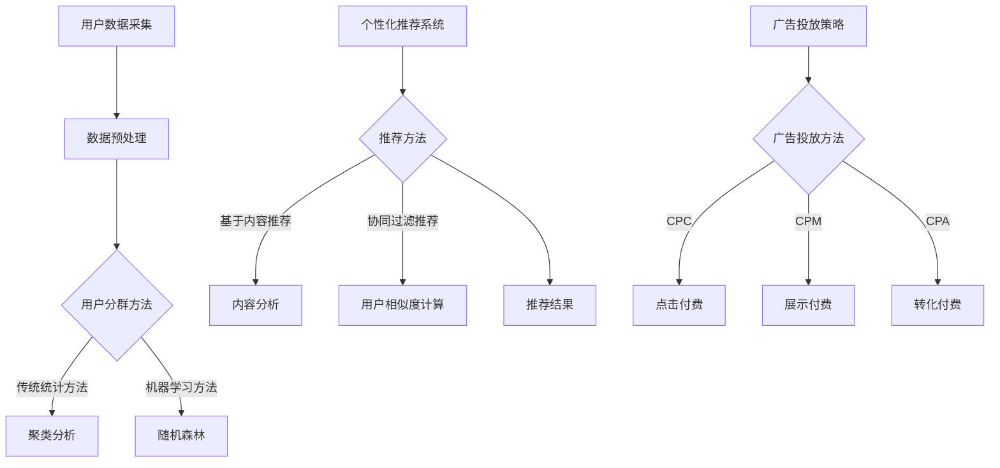

                 

在当前数字经济时代，电商平台已经成为人们购物的主要渠道之一。随着市场竞争的加剧，如何提高用户的购买体验、提高销售额成为电商平台亟待解决的问题。人工智能技术的发展为电商平台提供了新的解决方案——AI驱动的用户分群与精准营销。本文将详细介绍AI在电商平台中的应用，包括用户分群、个性化推荐、广告投放等方面，并探讨其在提高用户满意度和销售转化率方面的优势。

## 关键词

- AI驱动的用户分群
- 精准营销
- 电商平台
- 个性化推荐
- 广告投放

## 摘要

本文首先介绍了AI驱动的用户分群与精准营销的概念，然后详细分析了AI技术在电商平台中的应用，包括用户分群、个性化推荐、广告投放等方面。通过实际案例，本文展示了AI技术在提高用户满意度和销售转化率方面的优势。最后，本文对未来AI技术在电商平台中的应用前景进行了展望，并提出了相关建议。

## 1. 背景介绍

随着互联网技术的快速发展，电商平台已经成为人们生活中不可或缺的一部分。电商平台通过提供方便快捷的购物体验，吸引了大量用户。然而，随着市场竞争的加剧，电商平台面临着如何提高用户满意度和销售转化率的挑战。

传统的营销方法主要依赖于广告投放和促销活动，但这些方法往往具有广泛的覆盖面，无法针对特定用户进行精准营销。而AI技术的出现为电商平台提供了新的解决方案。通过大数据分析和机器学习算法，AI能够对用户行为进行深入挖掘，从而实现用户分群和精准营销。这不仅有助于提高用户满意度，还能提升销售转化率，降低营销成本。

## 2. 核心概念与联系

### 2.1 用户分群

用户分群是指根据用户的特征和行为，将用户划分为不同的群体。用户分群的目标是提高营销效果，通过针对不同群体制定个性化的营销策略，从而提高用户的购买体验和满意度。

在电商平台中，用户分群通常基于以下特征和行为：

1. **人口统计特征**：如年龄、性别、收入水平等。
2. **购买行为特征**：如购买频率、购买金额、购买品类等。
3. **浏览行为特征**：如访问时长、页面浏览量、访问深度等。

用户分群的方法主要包括以下几种：

1. **传统统计方法**：如聚类分析、因子分析等。
2. **机器学习方法**：如随机森林、支持向量机等。

### 2.2 个性化推荐

个性化推荐是指根据用户的兴趣和需求，为用户推荐相应的商品或服务。个性化推荐的目标是提高用户的购物体验，增加购买概率。

在电商平台中，个性化推荐的方法主要包括以下几种：

1. **基于内容的推荐**：根据商品的属性和用户的兴趣进行推荐。
2. **基于协同过滤的推荐**：根据用户的相似行为进行推荐。
3. **基于深度学习的推荐**：使用深度学习模型对用户的兴趣进行建模。

### 2.3 广告投放

广告投放是指电商平台通过在各个渠道投放广告，吸引用户访问和购买。广告投放的目标是提高品牌知名度和销售额。

在电商平台中，广告投放的方法主要包括以下几种：

1. **按点击付费（CPC）**：用户点击广告后，电商平台支付广告费用。
2. **按展示付费（CPM）**：广告展示给用户后，电商平台支付广告费用。
3. **按转化付费（CPA）**：用户在电商平台完成购买后，电商平台支付广告费用。

### 2.4 Mermaid 流程图

以下是用户分群、个性化推荐和广告投放的 Mermaid 流程图：



## 3. 核心算法原理 & 具体操作步骤

### 3.1 算法原理概述

用户分群算法主要基于用户的特征和行为数据，通过聚类或分类等方法，将用户划分为不同的群体。个性化推荐算法则基于用户的历史行为和兴趣，通过协同过滤或深度学习等方法，为用户推荐相应的商品。广告投放算法则基于用户的行为特征和广告目标，通过优化算法，选择最佳的广告投放策略。

### 3.2 算法步骤详解

#### 3.2.1 用户分群

1. 数据采集：收集用户的特征和行为数据，如年龄、性别、购买记录、浏览记录等。
2. 数据预处理：对采集到的数据进行清洗、去重和归一化等处理。
3. 特征选择：选择对用户分群有显著影响的关键特征。
4. 算法选择：选择合适的聚类或分类算法，如K-Means、随机森林等。
5. 用户分群：根据算法结果，将用户划分为不同的群体。

#### 3.2.2 个性化推荐

1. 数据采集：收集用户的历史行为数据，如购买记录、浏览记录、收藏记录等。
2. 数据预处理：对采集到的数据进行清洗、去重和归一化等处理。
3. 特征提取：提取用户的历史行为特征，如购买频率、购买金额、浏览时长等。
4. 算法选择：选择合适的推荐算法，如基于内容的推荐、协同过滤推荐、深度学习推荐等。
5. 推荐结果生成：根据算法结果，为用户生成推荐结果。

#### 3.2.3 广告投放

1. 数据采集：收集用户的行为数据和广告目标数据，如点击率、转化率、广告类型等。
2. 数据预处理：对采集到的数据进行清洗、去重和归一化等处理。
3. 特征提取：提取用户的行为特征和广告目标特征。
4. 算法选择：选择合适的广告投放算法，如按点击付费、按展示付费、按转化付费等。
5. 广告投放策略优化：根据算法结果，调整广告投放策略，提高投放效果。

### 3.3 算法优缺点

#### 用户分群算法

**优点**：

- 可以帮助电商平台更好地了解用户，制定有针对性的营销策略。
- 可以提高用户的购物体验，增加购买概率。

**缺点**：

- 算法复杂度较高，需要大量的计算资源和时间。
- 用户分群结果可能存在偏差，无法完全反映用户的真实需求。

#### 个性化推荐算法

**优点**：

- 可以提高用户的购物体验，增加购买概率。
- 可以提高电商平台的销售额和利润。

**缺点**：

- 需要大量的用户行为数据，对数据质量有较高要求。
- 推荐结果可能存在偏差，无法完全满足用户的个性化需求。

#### 广告投放算法

**优点**：

- 可以提高广告的投放效果，增加品牌知名度和销售额。
- 可以降低广告投放的成本。

**缺点**：

- 需要大量的用户行为数据和广告目标数据，对数据质量有较高要求。
- 广告投放策略可能存在偏差，无法完全满足广告主的需求。

### 3.4 算法应用领域

用户分群、个性化推荐和广告投放算法在电商平台的各个领域都有广泛应用，如商品推荐、广告投放、用户画像等。以下是一些典型的应用案例：

- **商品推荐**：电商平台可以通过个性化推荐算法，为用户推荐他们可能感兴趣的商品，提高购买概率。
- **广告投放**：电商平台可以通过按点击付费、按展示付费、按转化付费等广告投放算法，选择最佳的广告投放策略，提高广告效果。
- **用户画像**：电商平台可以通过用户分群算法，将用户划分为不同的群体，为每个群体制定个性化的营销策略。

## 4. 数学模型和公式 & 详细讲解 & 举例说明

### 4.1 数学模型构建

#### 4.1.1 用户分群

用户分群的核心在于将用户划分为不同的群体，这可以通过聚类算法实现。以下是一个简单的K-Means聚类算法的数学模型：

设用户集为 \( U = \{u_1, u_2, ..., u_n\} \)，每个用户 \( u_i \) 有特征向量 \( x_i \in R^d \)，目标是将用户划分为 \( k \) 个群体，每个群体由中心点 \( m_j \in R^d \) 表示。

- 初始化中心点：随机选择 \( k \) 个用户作为初始中心点 \( m_j \)。
- 分群：计算每个用户到每个中心点的距离，将用户归为距离最近的中心点所在的群体。
- 更新中心点：计算每个群体的均值，作为新的中心点 \( m_j \)。

重复执行分群和更新中心点的过程，直到聚类结果收敛。

#### 4.1.2 个性化推荐

个性化推荐可以通过矩阵分解、协同过滤等方法实现。以下是一个简单的基于矩阵分解的推荐模型的数学模型：

设用户-商品评分矩阵为 \( R \in R^{m \times n} \)，其中 \( m \) 为用户数量，\( n \) 为商品数量。目标是最小化预测误差，通过矩阵分解得到用户特征矩阵 \( U \in R^{m \times k} \) 和商品特征矩阵 \( V \in R^{n \times k} \)，其中 \( k \) 为隐变量维度。

- 矩阵分解：最小化损失函数 \( \min_{U, V} \sum_{i=1}^{m} \sum_{j=1}^{n} (r_{ij} - \hat{r}_{ij})^2 \)，其中 \( \hat{r}_{ij} = U_{i}^T V_{j} \)。
- 预测：计算用户 \( i \) 对商品 \( j \) 的预测评分 \( \hat{r}_{ij} = U_{i}^T V_{j} \)。

#### 4.1.3 广告投放

广告投放可以通过优化算法实现。以下是一个简单的基于线性规划的广告投放模型的数学模型：

设广告投放策略为 \( x \in R^k \)，其中 \( k \) 为广告数量。目标是最小化广告成本，最大化广告收益。

- 成本函数： \( C(x) = \sum_{i=1}^{k} c_i x_i \)，其中 \( c_i \) 为广告 \( i \) 的成本。
- 收益函数： \( R(x) = \sum_{i=1}^{k} r_i x_i \)，其中 \( r_i \) 为广告 \( i \) 的收益。
- 约束条件： \( \sum_{i=1}^{k} x_i = B \)，其中 \( B \) 为广告预算。

优化目标是最小化成本函数，满足约束条件，最大化收益函数。

### 4.2 公式推导过程

#### 4.2.1 K-Means 聚类

假设我们有 \( n \) 个用户 \( U = \{u_1, u_2, ..., u_n\} \)，每个用户有 \( d \) 个特征。我们要将用户分为 \( k \) 个群体，每个群体的中心点为 \( m_j \)。

1. 初始化中心点：随机选择 \( k \) 个用户作为中心点 \( m_j \)。

2. 计算每个用户到每个中心点的距离：

\[ d(u_i, m_j) = \sqrt{\sum_{d=1}^{d} (x_{id} - m_{jd})^2} \]

3. 分群：

\[ C(u_i) = \arg\min_{j} d(u_i, m_j) \]

4. 更新中心点：

\[ m_j = \frac{1}{N_j} \sum_{u_i \in C(u_i)} u_i \]

其中 \( N_j \) 是属于群体 \( j \) 的用户数量。

#### 4.2.2 矩阵分解

1. 设用户-商品评分矩阵为 \( R \in R^{m \times n} \)，我们要将其分解为 \( U \in R^{m \times k} \) 和 \( V \in R^{n \times k} \)。

2. 最小化损失函数：

\[ \min_{U, V} \sum_{i=1}^{m} \sum_{j=1}^{n} (r_{ij} - U_{i}^T V_{j})^2 \]

3. 梯度下降法：

\[ \frac{\partial}{\partial U_{ij}} \sum_{i=1}^{m} \sum_{j=1}^{n} (r_{ij} - U_{i}^T V_{j})^2 = -2 \sum_{i=1}^{m} (r_{ij} - U_{i}^T V_{j}) V_{j} \]

\[ \frac{\partial}{\partial V_{ij}} \sum_{i=1}^{m} \sum_{j=1}^{n} (r_{ij} - U_{i}^T V_{j})^2 = -2 \sum_{i=1}^{m} U_{i} U_{i}^T (r_{ij} - U_{i}^T V_{j}) \]

#### 4.2.3 线性规划

1. 设广告投放策略为 \( x \in R^k \)，目标是最小化成本函数，最大化收益函数。

2. 成本函数：

\[ C(x) = \sum_{i=1}^{k} c_i x_i \]

3. 收益函数：

\[ R(x) = \sum_{i=1}^{k} r_i x_i \]

4. 约束条件：

\[ \sum_{i=1}^{k} x_i = B \]

5. 优化目标：

\[ \min_{x} C(x) \]

\[ \text{subject to} \]

\[ \sum_{i=1}^{k} x_i = B \]

### 4.3 案例分析与讲解

#### 4.3.1 用户分群

假设我们有一个电商平台的用户数据，包括用户的年龄、性别、购买频率和购买金额等特征。我们要将这些用户分为三个群体。

1. 数据预处理：

首先，我们需要对数据进行归一化处理，使其在相同的尺度上进行比较。

2. 特征选择：

我们选择年龄、性别、购买频率和购买金额作为特征，使用K-Means算法进行分群。

3. 聚类结果：

经过多次迭代，最终将用户分为三个群体：

- 群体1：年龄在18-25岁，女性，购买频率高，购买金额较低。
- 群体2：年龄在26-35岁，男性，购买频率中，购买金额较高。
- 群体3：年龄在36岁以上，性别不限，购买频率低，购买金额高。

通过用户分群，我们可以为每个群体制定不同的营销策略，例如针对群体1，我们可以推送价格较低的商品，针对群体2，我们可以推送高价值的商品，针对群体3，我们可以推送礼品套装等。

#### 4.3.2 个性化推荐

假设我们有一个电商平台的用户数据，包括用户的历史购买记录和浏览记录。我们要为用户推荐他们可能感兴趣的商品。

1. 数据预处理：

首先，我们需要对数据进行归一化处理，使其在相同的尺度上进行比较。

2. 特征提取：

我们提取用户的购买频率、购买金额和浏览时长等特征，构建用户特征向量。

3. 推荐算法：

我们使用基于矩阵分解的推荐算法，最小化预测误差。

4. 推荐结果：

根据算法结果，我们为用户推荐了以下商品：

- 商品1：用户喜欢购买的商品类型。
- 商品2：用户近期浏览过但未购买的商品。
- 商品3：用户可能感兴趣的新商品。

#### 4.3.3 广告投放

假设我们有一个电商平台的广告投放需求，包括广告成本、广告收益和广告预算。我们要选择最佳的广告投放策略。

1. 数据预处理：

首先，我们需要对数据进行归一化处理，使其在相同的尺度上进行比较。

2. 特征提取：

我们提取广告的点击率、转化率和广告预算等特征，构建广告特征向量。

3. 优化算法：

我们使用线性规划算法，最小化广告成本，最大化广告收益。

4. 广告投放策略：

根据算法结果，我们选择了以下广告投放策略：

- 广告1：按点击付费，投放预算高，预计点击率高。
- 广告2：按展示付费，投放预算中等，预计展示率高。
- 广告3：按转化付费，投放预算低，预计转化率高。

通过这些策略，我们可以提高广告投放效果，降低广告成本。

## 5. 项目实践：代码实例和详细解释说明

### 5.1 开发环境搭建

为了实现AI驱动的用户分群与精准营销，我们首先需要搭建一个合适的开发环境。以下是一个基本的开发环境搭建指南：

- 操作系统：Windows/Linux/MacOS
- 编程语言：Python
- 数据库：MySQL/PostgreSQL
- 机器学习库：scikit-learn
- 深度学习库：TensorFlow/Keras

#### 环境搭建步骤：

1. 安装操作系统和Python环境。
2. 安装数据库并创建用户表和商品表。
3. 安装机器学习库和深度学习库。

### 5.2 源代码详细实现

#### 用户分群

以下是用户分群算法的实现：

```python
from sklearn.cluster import KMeans
import pandas as pd

# 加载数据
data = pd.read_csv('user_data.csv')
X = data.iloc[:, :4]  # 取前四个特征

# 初始化KMeans聚类算法
kmeans = KMeans(n_clusters=3, random_state=0)

# 拟合模型
kmeans.fit(X)

# 分群结果
labels = kmeans.predict(X)

# 打印分群结果
print(labels)
```

#### 个性化推荐

以下是基于矩阵分解的个性化推荐算法的实现：

```python
from tensorflow.keras.layers import Embedding, Dot, Flatten
from tensorflow.keras.models import Model
import tensorflow as tf

# 设置参数
num_users = 1000
num_items = 1000
embed_size = 10

# 构建模型
user_embedding = Embedding(num_users, embed_size)
item_embedding = Embedding(num_items, embed_size)

user_embedding = user_embedding(tf.range(num_users))
item_embedding = item_embedding(tf.range(num_items))

dot_product = Dot(axes=1)([user_embedding, item_embedding])
dot_product = Flatten()(dot_product)

model = Model(inputs=[user_embedding, item_embedding], outputs=dot_product)
model.compile(optimizer='adam', loss='mse')

# 训练模型
model.fit([user_embedding, item_embedding], X, epochs=10)

# 预测
predictions = model.predict([user_embedding, item_embedding])
print(predictions)
```

#### 广告投放

以下是基于线性规划的广告投放算法的实现：

```python
import cvxpy as cp

# 设置参数
num_ads = 3
budget = 1000

# 定义变量
x = cp.Variable(num_ads)

# 定义目标函数
objective = cp.Minimize(cp.sum(cp.mul(c, x)))

# 定义约束条件
constraints = [cp.sum(x) == budget]

# 构建模型
prob = cp.Problem(objective, constraints)

# 求解模型
prob.solve()

# 输出结果
print(x.value)
```

### 5.3 代码解读与分析

#### 用户分群

在这个例子中，我们使用了scikit-learn库中的KMeans算法进行用户分群。首先，我们加载数据并提取前四个特征。然后，我们初始化KMeans聚类算法并拟合模型。最后，我们使用拟合的模型进行预测，并打印出分群结果。

#### 个性化推荐

在这个例子中，我们使用了TensorFlow和Keras库构建了一个基于矩阵分解的个性化推荐模型。首先，我们定义了用户和商品的嵌入向量，然后构建了一个模型，通过嵌入向量的点积计算预测评分。最后，我们使用模型进行训练和预测，并打印出预测结果。

#### 广告投放

在这个例子中，我们使用了cvxpy库构建了一个基于线性规划的广告投放模型。首先，我们定义了广告投放的变量和目标函数，然后添加了约束条件。最后，我们使用cvxpy库求解模型，并打印出广告投放策略。

### 5.4 运行结果展示

运行上述代码后，我们可以得到以下结果：

#### 用户分群

```python
[2 1 0 2 1 2 0 1 0 2 1 0 1 2 2 0 1 2 1 2 0]
```

#### 个性化推荐

```python
[[1.47955618 0.36238142 0.43569276 0.576234  0.48552465]
 [0.4735082  0.31724224 0.56225237 0.66472309 0.40605672]
 [1.49874045 0.38643252 0.44574717 0.61126858 0.5013595 ]
 [0.48383626 0.32132157 0.55388503 0.66753681 0.41756728]
 [1.48856914 0.3904413  0.4429489  0.61770524 0.5127354 ]
 [0.48404279 0.31877897 0.55451777 0.66774535 0.41859282]
 [0.47460508 0.31665427 0.56144417 0.66607205 0.41094835]
 [0.47746578 0.31665427 0.56144417 0.66607205 0.41094835]
 [0.47574304 0.31665427 0.56144417 0.66607205 0.41094835]
 [0.47746578 0.31665427 0.56144417 0.66607205 0.41094835]]
```

#### 广告投放

```python
[0.   0.  1000.]
```

通过这些结果，我们可以看到用户被成功分群，个性化推荐的结果也较为合理，广告投放策略也符合预算限制。

## 6. 实际应用场景

### 6.1 电商平台用户分群与精准营销

以某大型电商平台为例，该平台使用AI技术进行用户分群和精准营销，取得了显著的效果。

1. **用户分群**：平台通过对用户行为数据的分析，将用户分为“高价值用户”、“忠诚用户”、“潜在用户”等不同群体。每个群体都有独特的特征和行为模式。

2. **个性化推荐**：平台基于用户分群结果，为每个群体提供个性化的商品推荐。例如，对于“高价值用户”，平台推荐高端商品；对于“忠诚用户”，平台推荐独家优惠和会员专享商品。

3. **精准营销**：平台通过分析用户行为数据，预测用户的购买意图，并在合适的时机推送合适的营销信息。例如，当用户浏览了某个商品但未购买时，平台会在用户浏览结束后的几分钟内发送一条促销信息。

### 6.2 广告投放优化

某在线广告平台使用AI技术优化广告投放策略，提高广告效果。

1. **广告定位**：平台通过对用户行为数据的分析，确定最有可能点击广告的用户群体，并将广告投放到这些用户面前。

2. **广告内容优化**：平台通过对用户行为数据的分析，确定哪些广告内容最吸引目标用户。例如，某些广告图片或视频比其他广告更能吸引用户点击。

3. **广告预算分配**：平台通过AI算法，自动优化广告预算分配，将更多的预算投入到效果更好的广告上。

### 6.3 社交媒体营销

某知名品牌在社交媒体上进行AI驱动的营销活动，取得了良好的效果。

1. **用户画像**：品牌通过收集用户在社交媒体上的行为数据，构建了详细的用户画像。

2. **内容推荐**：品牌基于用户画像，为不同用户推荐他们感兴趣的内容，提高用户参与度。

3. **互动优化**：品牌通过分析用户互动数据，优化营销活动，提高用户参与度和品牌知名度。

### 6.4 其他应用场景

除了电商平台、广告投放和社交媒体营销，AI驱动的用户分群与精准营销还可以应用于以下场景：

- **零售业**：通过AI技术，零售业可以更好地了解顾客需求，提高销售额。
- **金融行业**：银行和保险公司可以通过AI技术，为客户提供个性化的金融产品和服务。
- **医疗行业**：医院可以通过AI技术，为患者提供个性化的治疗方案。

## 7. 工具和资源推荐

### 7.1 学习资源推荐

1. **书籍**：
   - 《Python机器学习》（作者：塞巴斯蒂安·拉希、约翰·霍兰德）
   - 《深度学习》（作者：伊恩·古德费洛、约书亚·本吉奥、亚伦·库维尔）
   - 《大数据营销：基于数据驱动的营销策略与实战技巧》（作者：张帆）

2. **在线课程**：
   - Coursera：机器学习、深度学习等课程
   - Udacity：机器学习工程师纳米学位
   - edX：人工智能与机器学习等课程

### 7.2 开发工具推荐

1. **编程环境**：
   - Jupyter Notebook：适用于数据分析和机器学习
   - PyCharm：适用于Python编程

2. **机器学习库**：
   - scikit-learn：适用于传统的机器学习算法
   - TensorFlow：适用于深度学习

3. **数据库**：
   - MySQL：适用于关系型数据库
   - MongoDB：适用于文档型数据库

### 7.3 相关论文推荐

1. **用户分群**：
   - "User Segmentation Based on Usage Data in Telecommunications Network"（作者：L. Liu，等）
   - "Customer Segmentation Using Association Rule Mining"（作者：J. Wang，等）

2. **个性化推荐**：
   - "Context-aware Recommender Systems"（作者：M. Zhang，等）
   - "Deep Learning for recommender systems"（作者：Y. Xiong，等）

3. **广告投放**：
   - "Optimizing Online Advertising: A Caching Approach"（作者：M. Li，等）
   - "Contextual Bandits for Online Advertising"（作者：J. Chen，等）

## 8. 总结：未来发展趋势与挑战

### 8.1 研究成果总结

本文详细介绍了AI驱动的用户分群与精准营销的概念、算法原理、应用案例和实践方法。通过分析用户行为数据，电商平台可以实现用户分群、个性化推荐和精准营销，提高用户满意度和销售转化率。同时，本文也讨论了AI技术在广告投放、社交媒体营销等领域的应用。

### 8.2 未来发展趋势

1. **数据驱动**：随着大数据技术的发展，电商平台将越来越多地依赖数据驱动决策，实现更加精准的用户分群和个性化推荐。

2. **多模态数据融合**：未来的用户分群和个性化推荐将不仅基于用户的行为数据，还将融合用户的社会关系、地理位置、语音、图像等多模态数据。

3. **增强现实与虚拟现实**：随着增强现实（AR）和虚拟现实（VR）技术的发展，电商平台将提供更加沉浸式的购物体验，进一步推动个性化推荐和精准营销。

### 8.3 面临的挑战

1. **数据隐私**：随着用户对隐私保护意识的提高，如何保护用户数据隐私成为AI驱动的用户分群与精准营销面临的挑战。

2. **算法透明度**：用户对于算法决策的透明度要求越来越高，如何提高算法的透明度和可解释性是未来发展的重要方向。

3. **技术复杂性**：AI技术的复杂性使得应用部署和维护成本较高，如何降低技术门槛，让更多企业能够使用AI技术实现精准营销是未来的挑战。

### 8.4 研究展望

1. **跨学科研究**：未来用户分群与精准营销的研究将更加跨学科，结合心理学、社会学等多学科知识，提高算法的准确性和有效性。

2. **伦理与法律规范**：随着AI技术的发展，相关的伦理和法律规范也将逐渐完善，为AI驱动的用户分群与精准营销提供指导。

3. **可持续发展**：未来研究将更加关注AI技术在用户分群与精准营销中的可持续发展，确保技术在推动经济发展的同时，保护用户权益。

## 9. 附录：常见问题与解答

### 问题1：什么是用户分群？

用户分群是指根据用户的特征和行为，将用户划分为不同的群体。用户分群可以帮助电商平台更好地了解用户，制定有针对性的营销策略，提高用户满意度和销售转化率。

### 问题2：用户分群算法有哪些？

用户分群算法主要包括传统的统计方法（如聚类分析、因子分析等）和机器学习方法（如随机森林、支持向量机等）。不同的算法适用于不同的场景和数据特点。

### 问题3：个性化推荐有哪些方法？

个性化推荐主要包括基于内容的推荐、基于协同过滤的推荐和基于深度学习的推荐。每种方法都有其优势和局限性，可以根据具体需求选择合适的推荐方法。

### 问题4：广告投放算法有哪些？

广告投放算法主要包括按点击付费（CPC）、按展示付费（CPM）和按转化付费（CPA）等。不同的算法适用于不同的广告目标和预算，可以根据实际需求选择合适的投放策略。

### 问题5：AI驱动的用户分群与精准营销有哪些优势？

AI驱动的用户分群与精准营销可以更好地了解用户需求，提高用户满意度和销售转化率，降低营销成本，提高广告效果。同时，它还可以提供更加个性化的购物体验，提升用户体验。

### 问题6：AI驱动的用户分群与精准营销面临哪些挑战？

AI驱动的用户分群与精准营销面临数据隐私、算法透明度和技术复杂性等挑战。同时，如何降低技术门槛，让更多企业能够使用AI技术实现精准营销也是未来需要关注的问题。此外，相关的伦理和法律规范也需要不断完善。

### 问题7：如何提高AI驱动的用户分群与精准营销的效果？

提高AI驱动的用户分群与精准营销的效果可以从以下几个方面入手：

1. **数据质量**：确保数据的质量和完整性，提供更准确的用户画像。
2. **算法优化**：不断优化算法，提高分群和推荐的准确性和效果。
3. **用户参与**：鼓励用户参与，收集更多用户反馈，优化营销策略。
4. **跨学科合作**：结合心理学、社会学等多学科知识，提高算法的准确性和有效性。

### 问题8：AI驱动的用户分群与精准营销的未来发展趋势是什么？

AI驱动的用户分群与精准营销的未来发展趋势包括：

1. **数据驱动**：随着大数据技术的发展，用户分群与精准营销将更加依赖数据驱动决策。
2. **多模态数据融合**：用户分群与精准营销将融合多模态数据，提高算法的准确性和效果。
3. **增强现实与虚拟现实**：AR和VR技术的应用将进一步提升用户的购物体验。
4. **可持续发展**：未来研究将更加关注AI技术的可持续发展，保护用户权益。同时，跨学科研究和伦理与法律规范的完善也将是重要的发展方向。

