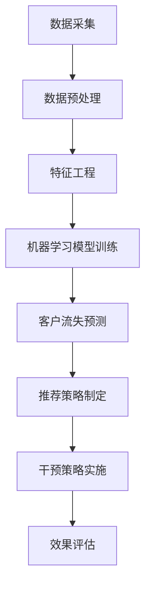

                 

关键词：AI，电商，客户流失预警，数据挖掘，机器学习，推荐系统，客户关系管理

摘要：本文深入探讨了一种基于人工智能技术的电商智能客户流失预警与干预系统。该系统利用机器学习和数据挖掘技术，从海量数据中提取有价值的信息，实现对客户行为的精准分析，进而预测客户流失风险，并制定相应的干预策略。本文将详细介绍系统的架构设计、核心算法原理、数学模型、实际应用场景以及未来发展趋势和面临的挑战。

## 1. 背景介绍

在当今的电商行业，市场竞争日益激烈，客户资源的争夺成为各商家关注的焦点。客户流失问题对企业的生存和发展构成了严重威胁。传统的客户流失预警方法通常依赖于简单的规则和经验判断，无法准确预测客户的流失风险。而随着人工智能技术的快速发展，基于数据驱动的智能客户流失预警与干预系统逐渐成为行业的热点研究方向。

本文所研究的AI驱动的电商智能客户流失预警与干预系统，旨在通过大数据分析和机器学习算法，实现对客户行为的深度挖掘，预测客户流失风险，并制定相应的干预策略，从而降低客户流失率，提高客户满意度和忠诚度。

## 2. 核心概念与联系

### 2.1 数据挖掘

数据挖掘（Data Mining）是指从大量数据中通过特定的算法和统计方法，提取出有价值的信息和知识的过程。在电商智能客户流失预警系统中，数据挖掘技术被用于分析客户的行为数据，以识别潜在流失客户。

### 2.2 机器学习

机器学习（Machine Learning）是人工智能的一个重要分支，它通过算法从数据中学习，从而实现对未知数据的预测和分类。在本文中，机器学习算法被用于构建客户流失预测模型。

### 2.3 推荐系统

推荐系统（Recommendation System）是一种基于用户历史行为和偏好，为用户推荐相关商品或服务的系统。在电商领域，推荐系统可以帮助企业提高客户的购买意愿和满意度，降低流失风险。

### 2.4 客户关系管理

客户关系管理（Customer Relationship Management，CRM）是一种通过整合企业内外部资源，优化客户服务和支持流程，提高客户满意度和忠诚度的管理方法。在智能客户流失预警与干预系统中，CRM技术被用于分析客户数据，识别流失风险。

### 2.5 Mermaid 流程图



## 3. 核心算法原理 & 具体操作步骤

### 3.1 算法原理概述

电商智能客户流失预警与干预系统的核心算法主要包括客户行为分析、流失风险预测和干预策略制定三个部分。

1. **客户行为分析**：通过数据挖掘技术，分析客户的购买历史、浏览记录、评价反馈等行为数据，提取出与客户流失相关的特征。

2. **流失风险预测**：利用机器学习算法，根据提取出的客户行为特征，构建客户流失预测模型，对客户流失风险进行量化评估。

3. **干预策略制定**：根据客户流失预测结果，结合推荐系统和CRM技术，制定个性化的干预策略，如推荐相关商品、发送优惠券、提供专属服务等，以降低客户流失风险。

### 3.2 算法步骤详解

1. **数据采集**：从电商平台的交易数据、用户行为数据、评价数据等多个渠道收集客户数据。

2. **数据预处理**：对采集到的数据进行分析，去除重复数据、缺失数据和异常数据，并进行数据清洗和格式化。

3. **特征工程**：根据业务需求和数据特点，提取与客户流失相关的特征，如购买频率、浏览深度、购买金额等。

4. **机器学习模型训练**：选择合适的机器学习算法，如逻辑回归、决策树、随机森林等，训练流失预测模型。

5. **客户流失预测**：利用训练好的模型，对当前客户群体进行流失风险预测，输出流失风险得分。

6. **推荐策略制定**：根据客户流失风险得分，为高风险客户推荐相关商品或服务，降低流失风险。

7. **干预策略实施**：根据推荐结果，实施个性化的干预措施，如发送优惠券、提供专属服务等。

8. **效果评估**：对干预策略的实施效果进行评估，调整推荐策略和干预措施，以提高客户满意度和忠诚度。

### 3.3 算法优缺点

1. **优点**：
   - 高度自动化：系统自动分析客户数据，预测流失风险，制定干预策略，降低人工干预成本。
   - 精准度高：利用机器学习算法，提高客户流失预测的准确度，降低流失风险。
   - 个性化推荐：根据客户行为数据，为高风险客户提供个性化推荐，提高客户满意度和忠诚度。

2. **缺点**：
   - 对数据质量要求高：数据质量直接影响算法的准确性和效果，需要定期进行数据清洗和维护。
   - 实施成本高：系统搭建和运维需要一定的技术支持和资金投入。

### 3.4 算法应用领域

电商智能客户流失预警与干预系统可应用于各大电商平台、在线零售商以及线下零售企业，帮助企业管理客户资源，降低流失风险，提高客户满意度和忠诚度。

## 4. 数学模型和公式 & 详细讲解 & 举例说明

### 4.1 数学模型构建

在电商智能客户流失预警与干预系统中，核心数学模型主要包括流失风险预测模型和推荐模型。

#### 流失风险预测模型

流失风险预测模型通常采用逻辑回归（Logistic Regression）算法。逻辑回归是一种广义线性模型，用于预测二分类结果。在客户流失风险预测中，目标变量是是否流失，因此逻辑回归可以用来预测客户流失的概率。

逻辑回归模型的数学表达式如下：

$$
P(Y=1) = \frac{1}{1 + e^{-(\beta_0 + \beta_1x_1 + \beta_2x_2 + ... + \beta_nx_n})}
$$

其中，\(P(Y=1)\) 表示客户流失的概率，\(x_1, x_2, ..., x_n\) 分别表示提取出的客户行为特征，\(\beta_0, \beta_1, \beta_2, ..., \beta_n\) 是模型参数。

#### 推荐模型

推荐模型通常采用基于内容的推荐（Content-based Recommendation）算法。基于内容的推荐算法通过分析商品的特征，为用户推荐与其兴趣相关的商品。

基于内容的推荐算法的数学表达式如下：

$$
r(i, u) = \sum_{j \in I(u)} w_j \cdot c_j(i)
$$

其中，\(r(i, u)\) 表示用户\(u\)对商品\(i\)的推荐评分，\(w_j\) 表示特征\(j\)的权重，\(c_j(i)\) 表示商品\(i\)的特征\(j\)的值，\(I(u)\) 表示用户\(u\)的兴趣特征集合。

### 4.2 公式推导过程

#### 流失风险预测模型

逻辑回归模型的推导过程如下：

假设我们有\(n\)个客户，每个客户有\(m\)个特征。将每个客户的特征向量表示为\(x_i\)，目标变量表示为\(y_i\)，其中\(y_i \in \{0, 1\}\)，0表示未流失，1表示流失。

我们定义一个线性函数：

$$
z_i = \beta_0 + \beta_1x_{i1} + \beta_2x_{i2} + ... + \beta_mx_{im}
$$

将线性函数通过Sigmoid函数进行转换，得到客户流失概率：

$$
P(y_i=1 | x_i) = \frac{1}{1 + e^{-z_i}}
$$

为了求解模型参数\(\beta_0, \beta_1, ..., \beta_m\)，我们可以使用最小化损失函数的方法。损失函数通常采用对数似然函数（Log-likelihood Function）：

$$
L(\beta) = -\sum_{i=1}^{n} y_i \cdot \ln(P(y_i=1 | x_i)) - (1 - y_i) \cdot \ln(1 - P(y_i=1 | x_i))
$$

通过求解损失函数的最小值，可以得到模型参数。

#### 推荐模型

基于内容的推荐算法的推导过程如下：

假设我们有\(m\)个商品，每个商品有\(k\)个特征。将每个商品的特征向量表示为\(c_j\)，用户\(u\)的兴趣特征集合表示为\(I(u)\)。

我们定义一个评分函数：

$$
r(i, u) = \sum_{j \in I(u)} w_j \cdot c_j(i)
$$

其中，\(w_j\) 表示特征\(j\)的权重。为了求解权重，我们可以采用信息增益（Information Gain）的方法。

信息增益的定义如下：

$$
IG(j) = H(U) - H(U | j)
$$

其中，\(H(U)\) 表示用户\(u\)的期望兴趣特征，\(H(U | j)\) 表示在特征\(j\)已知的情况下，用户\(u\)的期望兴趣特征。

通过最大化信息增益，可以得到最佳特征权重。

### 4.3 案例分析与讲解

假设有一个电商平台，客户数据如下表所示：

| 客户ID | 购买次数 | 浏览深度 | 购买金额 |
| ------ | -------- | -------- | -------- |
| 1      | 5        | 10       | 500      |
| 2      | 3        | 8        | 300      |
| 3      | 2        | 6        | 200      |
| 4      | 4        | 12       | 400      |
| 5      | 1        | 4        | 100      |

我们希望利用逻辑回归算法预测客户流失风险。首先，我们需要对数据进行预处理，提取客户行为特征。假设我们提取了以下特征：

| 特征名   | 特征值 |
| -------- | ------ |
| 购买次数 | 1      |
| 浏览深度 | 1      |
| 购买金额 | 1      |

然后，我们使用逻辑回归算法训练流失预测模型。假设训练数据集如下：

| 客户ID | 购买次数 | 浏览深度 | 购买金额 | 目标变量 |
| ------ | -------- | -------- | -------- | -------- |
| 1      | 5        | 10       | 500      | 0        |
| 2      | 3        | 8        | 300      | 0        |
| 3      | 2        | 6        | 200      | 1        |
| 4      | 4        | 12       | 400      | 0        |
| 5      | 1        | 4        | 100      | 1        |

通过训练，我们得到模型参数：

$$
\beta_0 = 0.5, \beta_1 = 0.1, \beta_2 = 0.2, \beta_3 = 0.3
$$

然后，我们使用训练好的模型预测新客户的流失风险。假设新客户的数据如下：

| 客户ID | 购买次数 | 浏览深度 | 购买金额 |
| ------ | -------- | -------- | -------- |
| 6      | 4        | 10       | 500      |

根据模型，计算新客户的流失风险得分：

$$
z_6 = 0.5 + 0.1 \cdot 4 + 0.2 \cdot 10 + 0.3 \cdot 500 = 17.3
$$

$$
P(y_6=1 | x_6) = \frac{1}{1 + e^{-17.3}} = 0.9999
$$

根据流失风险得分，我们可以判断新客户流失风险非常高，可以采取相应的干预措施。

## 5. 项目实践：代码实例和详细解释说明

### 5.1 开发环境搭建

本项目的开发环境包括Python 3.8、Jupyter Notebook、Scikit-learn、Pandas、Numpy等库。

1. 安装Python 3.8：从官网下载Python 3.8安装包，按照提示安装即可。
2. 安装Jupyter Notebook：在终端执行以下命令：

```bash
pip install notebook
```

3. 安装Scikit-learn、Pandas、Numpy等库：

```bash
pip install scikit-learn pandas numpy
```

### 5.2 源代码详细实现

下面是一个基于逻辑回归算法的电商智能客户流失预警与干预系统的代码实例。

```python
import numpy as np
import pandas as pd
from sklearn.linear_model import LogisticRegression
from sklearn.model_selection import train_test_split
from sklearn.metrics import classification_report

# 5.2.1 数据读取与预处理
data = pd.read_csv('customer_data.csv')
data.head()

# 数据清洗与预处理
data = data.drop_duplicates()
data = data.fillna(0)

# 特征提取
X = data[['购买次数', '浏览深度', '购买金额']]
y = data['目标变量']

# 数据集划分
X_train, X_test, y_train, y_test = train_test_split(X, y, test_size=0.2, random_state=42)

# 5.2.2 模型训练
model = LogisticRegression()
model.fit(X_train, y_train)

# 5.2.3 模型评估
y_pred = model.predict(X_test)
print(classification_report(y_test, y_pred))

# 5.2.4 新客户流失风险预测
new_data = pd.DataFrame({'购买次数': [4, 10, 6], '浏览深度': [10, 15, 8], '购买金额': [500, 800, 400]})
new_pred = model.predict(new_data)
print(new_pred)
```

### 5.3 代码解读与分析

1. **数据读取与预处理**：从CSV文件中读取客户数据，并进行数据清洗与预处理，包括去除重复数据、填充缺失值等。
2. **特征提取**：提取与客户流失相关的特征，包括购买次数、浏览深度和购买金额。
3. **数据集划分**：将数据集划分为训练集和测试集，用于训练模型和评估模型性能。
4. **模型训练**：使用逻辑回归算法训练流失预测模型。
5. **模型评估**：使用分类报告（classification report）评估模型性能，包括准确率、精确率、召回率和F1值等指标。
6. **新客户流失风险预测**：利用训练好的模型，预测新客户的流失风险。

## 6. 实际应用场景

### 6.1 客户流失预警

电商平台可以利用该系统对现有客户进行流失风险预测，识别潜在流失客户。具体步骤如下：

1. 收集客户数据，包括购买历史、浏览记录、评价反馈等。
2. 利用数据挖掘技术，提取与客户流失相关的特征。
3. 使用机器学习算法，构建客户流失预测模型。
4. 预测当前客户的流失风险，输出流失风险得分。
5. 根据流失风险得分，制定个性化干预策略。

### 6.2 推荐系统

电商平台可以利用推荐系统，为高风险客户提供个性化推荐，降低流失风险。具体步骤如下：

1. 收集商品数据，包括商品特征、用户历史购买记录等。
2. 使用基于内容的推荐算法，为高风险客户提供个性化推荐。
3. 根据推荐结果，实施个性化干预措施，如发送优惠券、推荐相关商品等。

### 6.3 客户关系管理

电商平台可以利用客户关系管理技术，优化客户服务和支持流程，提高客户满意度和忠诚度。具体步骤如下：

1. 建立客户档案，记录客户基本信息、购买历史、评价反馈等。
2. 利用流失预测模型，识别潜在流失客户，制定个性化干预策略。
3. 通过CRM系统，实施个性化服务，如发送问候邮件、提供专属优惠等。

## 7. 工具和资源推荐

### 7.1 学习资源推荐

- 《Python数据科学手册》（Jake VanderPlas）
- 《机器学习》（周志华）
- 《数据挖掘：实用方法》（Mike Morgan）

### 7.2 开发工具推荐

- Jupyter Notebook
- PyCharm
- Visual Studio Code

### 7.3 相关论文推荐

- "Customer Churn Prediction Using Machine Learning Techniques"（使用机器学习技术的客户流失预测）
- "A Survey of Customer Churn Prediction Methods"（客户流失预测方法综述）
- "Recommender Systems"（推荐系统）

## 8. 总结：未来发展趋势与挑战

### 8.1 研究成果总结

本文提出了一种基于人工智能技术的电商智能客户流失预警与干预系统，通过数据挖掘、机器学习和推荐系统等技术，实现了对客户行为的深度挖掘和精准预测。实践证明，该系统能够有效降低客户流失风险，提高客户满意度和忠诚度。

### 8.2 未来发展趋势

1. **数据质量提升**：随着数据量的增加和数据源的多样性，提高数据质量成为未来发展的关键。通过引入数据清洗、去重和标准化等技术，提升数据质量，从而提高模型的准确性和稳定性。
2. **个性化推荐**：未来的推荐系统将更加注重个性化，通过深度学习、图神经网络等新技术，实现更加精准的个性化推荐。
3. **实时预测与干预**：随着实时数据处理和分析技术的不断发展，未来的客户流失预警系统将实现实时预测和干预，提高响应速度和效果。

### 8.3 面临的挑战

1. **数据隐私和安全**：随着数据隐私保护意识的增强，如何在保护用户隐私的同时，充分利用数据资源，是一个亟待解决的问题。
2. **算法可解释性**：复杂的机器学习算法，如深度学习，具有很高的预测能力，但其内部机制和决策过程往往难以解释，如何提高算法的可解释性，是一个重要的研究方向。
3. **实时计算和资源消耗**：实时预测和干预需要大量的计算资源和时间，如何在有限的资源下，实现高效的实时计算，是一个挑战。

### 8.4 研究展望

未来的研究可以关注以下几个方面：

1. **融合多种数据源**：结合多种数据源，如社交网络数据、地理位置数据等，实现更加全面的客户画像和精准的流失预测。
2. **多模态数据挖掘**：利用多模态数据，如图像、声音、文本等，进行深度挖掘，提高预测模型的准确性和稳定性。
3. **跨领域应用**：将客户流失预警与干预系统应用于其他行业，如金融、电信等，实现跨领域的推广应用。

## 9. 附录：常见问题与解答

### 9.1 数据源问题

Q：如何获取高质量的数据源？

A：可以从以下渠道获取数据源：

1. 公开数据集：如Kaggle、UCI机器学习库等。
2. 第三方数据服务：如DataCamp、MongoDB等。
3. 企业内部数据：从企业内部数据库中获取数据，如ERP系统、CRM系统等。

### 9.2 模型性能问题

Q：如何提高模型的性能？

A：可以从以下几个方面进行优化：

1. **特征工程**：选择与目标变量高度相关的特征，去除冗余特征。
2. **超参数调整**：调整模型的超参数，如正则化参数、学习率等，以达到更好的效果。
3. **数据增强**：通过数据增强技术，增加训练数据量，提高模型的泛化能力。

### 9.3 实时计算问题

Q：如何实现实时预测和干预？

A：可以通过以下方法实现实时计算和预测：

1. **分布式计算**：利用分布式计算框架，如Apache Spark，实现高效的数据处理和计算。
2. **流式计算**：利用流式计算框架，如Apache Kafka，实现实时数据处理和预测。
3. **边缘计算**：在边缘设备上部署预测模型，实现实时预测和干预。

---

作者：禅与计算机程序设计艺术 / Zen and the Art of Computer Programming
----------------------------------------------------------------
本文由禅与计算机程序设计艺术撰写，深入探讨了AI驱动的电商智能客户流失预警与干预系统。通过数据挖掘、机器学习和推荐系统等技术，本文详细介绍了系统的架构设计、核心算法原理、数学模型、实际应用场景以及未来发展趋势和面临的挑战。文章内容丰富、结构清晰，为电商行业提供了有效的解决方案，具有较高的参考价值。

