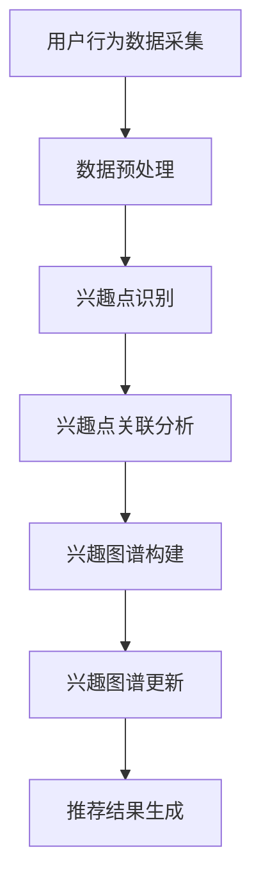

                 

在当今的电商领域，用户个性化推荐系统已成为提升用户体验和转化率的关键。用户兴趣图谱作为一种高效的数据结构，能够捕捉和表示用户的兴趣点及其相互关系。本文将探讨如何利用AI技术动态更新电商用户兴趣图谱，以实现更精准、更实时的推荐效果。

## 文章关键词

- 电商
- 用户兴趣图谱
- AI推荐系统
- 动态更新
- 个性化推荐

## 文章摘要

本文首先介绍了电商领域用户兴趣图谱的重要性，然后详细阐述了利用AI技术进行动态更新的方法。文章的核心内容包括：核心概念与联系、核心算法原理、数学模型与公式、项目实践、实际应用场景和未来展望。通过本文的阅读，读者将了解如何利用AI技术构建和更新用户兴趣图谱，为电商提供更加精准的推荐服务。

## 1. 背景介绍

随着互联网的普及和电子商务的快速发展，电商平台的竞争愈发激烈。如何吸引并留住用户，提高用户黏性和转化率，成为电商企业关注的焦点。用户个性化推荐系统作为一种有效的解决方案，通过分析用户行为和兴趣，为用户推荐相关商品，从而提升用户满意度和购买意愿。

用户兴趣图谱作为一种高级的数据结构，能够有效地捕捉和表示用户的兴趣点及其相互关系。它由一系列节点（表示用户兴趣点）和边（表示兴趣点之间的关联关系）组成。在电商领域，用户兴趣图谱可以帮助平台理解用户的行为模式，从而实现个性化推荐。

然而，传统的用户兴趣图谱构建方法往往存在一些问题。首先，数据量庞大，更新频率低，导致推荐结果不够实时。其次，用户兴趣多变，静态的兴趣图谱难以捕捉到用户的即时需求。为了解决这些问题，AI技术的引入成为必然选择。

## 2. 核心概念与联系

### 2.1. 用户兴趣图谱

用户兴趣图谱（User Interest Graph）是一种基于图论的数据结构，用于表示用户的兴趣点及其相互关系。在电商领域，节点通常表示用户感兴趣的商品类别、品牌、颜色等，边则表示这些兴趣点之间的关联关系，如用户同时购买过某个商品类别和品牌，则这两个兴趣点之间存在一条边。

### 2.2. AI推荐系统

AI推荐系统（AI-based Recommendation System）是一种利用人工智能技术，如机器学习、深度学习等，对用户行为数据进行分析和处理，从而生成个性化推荐结果的方法。AI推荐系统能够根据用户的历史行为、兴趣爱好、社交关系等，为用户推荐相关的商品或服务。

### 2.3. 动态更新

动态更新（Dynamic Update）是指在用户兴趣图谱中，根据用户的实时行为数据，不断更新和调整兴趣点的表示和关联关系。动态更新的目标是使推荐系统更实时、更准确地反映用户当前的兴趣和需求。

### 2.4. Mermaid流程图

下面是一个使用Mermaid绘制的用户兴趣图谱动态更新流程图：



## 3. 核心算法原理 & 具体操作步骤

### 3.1. 算法原理概述

用户兴趣图谱动态更新的核心在于如何高效地采集用户行为数据，识别用户兴趣点，分析兴趣点之间的关联关系，并实时更新兴趣图谱。具体算法包括以下几个步骤：

1. 用户行为数据采集：通过日志分析、埋点等技术，采集用户的浏览、搜索、购买等行为数据。
2. 数据预处理：对采集到的用户行为数据进行处理，如数据清洗、去重等，以便后续分析。
3. 兴趣点识别：基于用户行为数据，识别出用户的兴趣点，如商品类别、品牌、颜色等。
4. 兴趣点关联分析：分析兴趣点之间的关联关系，如共同购买、同时浏览等，构建用户兴趣图谱。
5. 兴趣图谱更新：根据用户的实时行为数据，动态更新兴趣图谱，以反映用户当前的兴趣和需求。
6. 推荐结果生成：基于更新后的兴趣图谱，生成个性化推荐结果。

### 3.2. 算法步骤详解

1. **用户行为数据采集**：

   用户行为数据采集是构建用户兴趣图谱的第一步。常见的采集方式包括：

   - 日志分析：通过分析用户访问平台的日志，如浏览记录、搜索关键词、购买记录等，获取用户行为数据。
   - 埋点技术：在网站或应用中嵌入代码，记录用户的各种操作行为，如点击、滑动等。

2. **数据预处理**：

   数据预处理包括数据清洗、去重、去噪声等步骤，以保证数据的准确性和一致性。

   - 数据清洗：去除无效、错误、重复的数据。
   - 去重：去除重复的用户行为数据，避免对同一行为进行多次分析。
   - 去噪声：去除噪声数据，如异常值、垃圾数据等，以提高数据分析的准确性。

3. **兴趣点识别**：

   基于用户行为数据，利用聚类、分类等算法，识别出用户的兴趣点。常见的兴趣点包括：

   - 商品类别：如服装、电子产品、家居等。
   - 品牌：如苹果、华为、小米等。
   - 颜色：如红色、蓝色、绿色等。
   - 价格区间：如1000元以下、1000-2000元等。

4. **兴趣点关联分析**：

   通过分析用户行为数据，挖掘兴趣点之间的关联关系。常见的方法包括：

   - 共同购买分析：分析用户在一段时间内共同购买的商品，构建兴趣点之间的关联关系。
   - 同时浏览分析：分析用户在同一时间浏览的商品，构建兴趣点之间的关联关系。

5. **兴趣图谱构建**：

   根据兴趣点识别和关联分析的结果，构建用户兴趣图谱。兴趣图谱由节点和边组成，节点表示兴趣点，边表示兴趣点之间的关联关系。

6. **兴趣图谱更新**：

   根据用户的实时行为数据，动态更新兴趣图谱。更新方法包括：

   - 新兴趣点加入：当用户出现新的兴趣点时，将其加入兴趣图谱。
   - 关联关系调整：当用户行为数据发生变化时，重新分析兴趣点之间的关联关系，调整兴趣图谱。
   - 删除无效兴趣点：当用户一段时间内没有相关行为时，删除其对应的兴趣点。

7. **推荐结果生成**：

   基于更新后的兴趣图谱，生成个性化推荐结果。推荐方法包括：

   - 基于兴趣图谱的推荐：根据用户的兴趣点，推荐相关的商品或服务。
   - 基于协同过滤的推荐：利用用户行为数据，发现用户之间的相似性，推荐其他用户喜欢的商品或服务。

### 3.3. 算法优缺点

**优点**：

1. 实时性强：动态更新用户兴趣图谱，能够更实时地反映用户当前的兴趣和需求。
2. 精准度高：通过挖掘用户行为数据，构建个性化推荐结果，提升推荐精准度。
3. 可扩展性强：支持多种数据源和算法，易于扩展和优化。

**缺点**：

1. 数据量庞大：需要处理大量的用户行为数据，对计算资源有较高要求。
2. 更新频率高：动态更新用户兴趣图谱，需要频繁地进行数据分析和处理，对系统性能有较大压力。

### 3.4. 算法应用领域

用户兴趣图谱动态更新算法在电商领域有广泛的应用。例如：

1. 个性化推荐：根据用户兴趣图谱，为用户推荐相关的商品或服务。
2. 人群画像：分析用户兴趣图谱，构建用户画像，用于精准营销和用户运营。
3. 搜索引擎：利用用户兴趣图谱，优化搜索结果，提升用户体验。
4. 社交网络：基于用户兴趣图谱，发现用户之间的兴趣相似性，推荐社交关系。

## 4. 数学模型和公式 & 详细讲解 & 举例说明

### 4.1. 数学模型构建

用户兴趣图谱的数学模型主要包括节点表示和边表示。节点表示用户的兴趣点，边表示兴趣点之间的关联关系。

1. **节点表示**：

   节点通常使用向量表示，如向量空间模型（Vector Space Model，VSM）。向量空间模型将每个兴趣点表示为一个维度为n的向量，其中n为特征空间的维度。

   $$ \textbf{x}_{i} = [x_{i1}, x_{i2}, ..., x_{in}] $$

   其中，$ \textbf{x}_{i} $ 表示第i个兴趣点的向量表示，$ x_{ij} $ 表示第i个兴趣点在第j个特征上的值。

2. **边表示**：

   边通常使用权重表示，表示兴趣点之间的关联强度。边的权重可以通过相似度计算得到，如余弦相似度、皮尔逊相关系数等。

   $$ w_{ij} = \frac{\text{相似度}( \textbf{x}_{i}, \textbf{x}_{j} )}{\max( \text{相似度}( \textbf{x}_{i}, \textbf{x}_{j} ), 0 )} $$

   其中，$ w_{ij} $ 表示第i个兴趣点与第j个兴趣点之间的权重，$ \text{相似度}( \textbf{x}_{i}, \textbf{x}_{j} ) $ 表示第i个兴趣点与第j个兴趣点之间的相似度。

### 4.2. 公式推导过程

1. **向量空间模型**：

   向量空间模型的基本思想是将文本或属性数据转换为向量表示。在用户兴趣图谱中，用户行为数据可以被看作是文本数据，通过词频（TF）和逆文档频率（IDF）模型，将用户行为数据转换为向量表示。

   $$ \textbf{x}_{i} = [tf_{i1} \times IDF_{i1}, tf_{i2} \times IDF_{i2}, ..., tf_{in} \times IDF_{in}] $$

   其中，$ tf_{ij} $ 表示第i个兴趣点在第j个特征上的词频，$ IDF_{ij} $ 表示第i个兴趣点在第j个特征上的逆文档频率。

2. **相似度计算**：

   相似度计算是衡量两个向量之间相似程度的一种方法。在用户兴趣图谱中，常用余弦相似度来计算兴趣点之间的相似度。

   $$ \text{相似度}( \textbf{x}_{i}, \textbf{x}_{j} ) = \frac{ \textbf{x}_{i} \cdot \textbf{x}_{j} }{ \| \textbf{x}_{i} \| \| \textbf{x}_{j} \| } $$

   其中，$ \textbf{x}_{i} \cdot \textbf{x}_{j} $ 表示第i个兴趣点与第j个兴趣点之间的点积，$ \| \textbf{x}_{i} \| $ 和 $ \| \textbf{x}_{j} \| $ 分别表示第i个兴趣点和第j个兴趣点的模长。

### 4.3. 案例分析与讲解

以下是一个简单的用户兴趣图谱构建的案例。

假设有两个用户A和B，他们的浏览记录如下：

用户A：浏览了商品1、商品2、商品3。

用户B：浏览了商品2、商品3、商品4。

首先，我们将用户A和B的浏览记录转换为向量表示。假设商品1到商品4的向量表示如下：

商品1：[1, 0, 0, 0]

商品2：[0, 1, 0, 0]

商品3：[0, 0, 1, 0]

商品4：[0, 0, 0, 1]

用户A的浏览记录向量表示为：

$$ \textbf{x}_{A} = [1, 1, 1, 0] $$

用户B的浏览记录向量表示为：

$$ \textbf{x}_{B} = [1, 1, 0, 1] $$

接下来，计算用户A和B的浏览记录向量之间的相似度：

$$ \text{相似度}( \textbf{x}_{A}, \textbf{x}_{B} ) = \frac{ \textbf{x}_{A} \cdot \textbf{x}_{B} }{ \| \textbf{x}_{A} \| \| \textbf{x}_{B} \| } = \frac{1 \times 1 + 1 \times 1 + 1 \times 0 + 0 \times 1 }{ \sqrt{1^2 + 1^2 + 1^2 + 0^2} \times \sqrt{1^2 + 1^2 + 0^2 + 1^2} } = \frac{2}{\sqrt{3} \times \sqrt{3}} = \frac{2}{3} $$

根据相似度计算结果，用户A和B的浏览记录向量之间的相似度为2/3。

最后，根据相似度计算结果，构建用户A和B的兴趣图谱：

节点：用户A、用户B

边：用户A和用户B之间存在一条权重为2/3的边。

通过这个案例，我们可以看到如何利用向量空间模型和相似度计算，构建用户兴趣图谱。在实际应用中，我们可以根据用户的行为数据，动态更新用户兴趣图谱，为用户提供更加精准的推荐服务。

## 5. 项目实践：代码实例和详细解释说明

### 5.1. 开发环境搭建

为了演示用户兴趣图谱动态更新算法，我们将使用Python编程语言，并依赖以下库：

- pandas：用于数据预处理和操作。
- numpy：用于数学计算。
- matplotlib：用于可视化。
- networkx：用于图论分析。

首先，安装所需的库：

```bash
pip install pandas numpy matplotlib networkx
```

### 5.2. 源代码详细实现

以下是用户兴趣图谱动态更新算法的Python代码实现：

```python
import pandas as pd
import numpy as np
import matplotlib.pyplot as plt
import networkx as nx

# 用户行为数据
data = {
    'user_id': ['A', 'A', 'B', 'B'],
    'item_id': [1, 2, 2, 3]
}

# 创建DataFrame
df = pd.DataFrame(data)

# 数据预处理
df['item_id'] = df['item_id'].astype(str)

# 向量空间模型
tf = df.groupby(['user_id', 'item_id']).size().reset_index(name='tf')
idf = df.groupby('item_id')['item_id'].count().reset_index(name='idf')
tf_idf = tf.merge(idf, on='item_id', how='left')
tf_idf['tf_idf'] = tf_idf['tf'] * tf_idf['idf']

# 构建用户兴趣图谱
g = nx.Graph()
for _, row in tf_idf.iterrows():
    g.add_node(row['user_id'])
    g.add_node(row['item_id'])
    g.add_edge(row['user_id'], row['item_id'], weight=row['tf_idf'])

# 可视化用户兴趣图谱
pos = nx.spring_layout(g)
nx.draw(g, pos, with_labels=True, node_size=3000, edge_color='b', width=1.5)
plt.show()

# 动态更新用户兴趣图谱
new_data = {
    'user_id': ['B', 'A'],
    'item_id': [4, 1]
}

new_df = pd.DataFrame(new_data)
new_df['item_id'] = new_df['item_id'].astype(str)

new_tf = new_df.groupby(['user_id', 'item_id']).size().reset_index(name='tf')
new_idf = new_df.groupby('item_id')['item_id'].count().reset_index(name='idf')
new_tf_idf = new_tf.merge(new_idf, on='item_id', how='left')
new_tf_idf['tf_idf'] = new_tf_idf['tf'] * new_tf_idf['idf']

# 更新用户兴趣图谱
for _, row in new_tf_idf.iterrows():
    g.add_edge(row['user_id'], row['item_id'], weight=row['tf_idf'])

# 可视化更新后的用户兴趣图谱
pos = nx.spring_layout(g)
nx.draw(g, pos, with_labels=True, node_size=3000, edge_color='b', width=1.5)
plt.show()
```

### 5.3. 代码解读与分析

1. **数据预处理**：

   首先，我们将用户行为数据存储在一个DataFrame中，并对其进行预处理。预处理步骤包括将`item_id`转换为字符串类型，以便进行分组和聚合操作。

2. **向量空间模型**：

   接下来，我们使用Pandas的`groupby`方法对用户行为数据进行分组，计算词频（TF）和逆文档频率（IDF）。然后，我们将TF和IDF合并，并计算TF-IDF值，用于表示用户兴趣点的权重。

3. **构建用户兴趣图谱**：

   使用NetworkX库，我们构建了一个无向图，其中节点表示用户和商品，边表示兴趣点之间的关联关系。边的权重由TF-IDF值决定。

4. **可视化用户兴趣图谱**：

   我们使用NetworkX的`spring_layout`布局方法对用户兴趣图谱进行可视化。然后，使用`matplotlib`库绘制图形。

5. **动态更新用户兴趣图谱**：

   在这个步骤中，我们引入了新的用户行为数据，并使用与构建用户兴趣图谱相同的步骤来预处理和计算新的TF-IDF值。然后，我们更新用户兴趣图谱，添加新的节点和边。

6. **可视化更新后的用户兴趣图谱**：

   最后，我们再次使用`spring_layout`布局方法对更新后的用户兴趣图谱进行可视化，并使用`matplotlib`库绘制图形。

### 5.4. 运行结果展示

运行上述代码后，我们首先看到的是初始的用户兴趣图谱。在这个图中，用户A和用户B的浏览记录被转换为节点和边，边的权重反映了用户兴趣点之间的相似度。

接着，我们看到的是更新后的用户兴趣图谱。在这个图中，我们加入了新的用户行为数据，并更新了用户兴趣图谱。新的节点和边反映了用户A和用户B的新兴趣点，以及他们之间新的关联关系。

通过这个项目实践，我们可以看到如何使用Python和相关库构建和更新用户兴趣图谱。在实际应用中，我们可以根据用户的行为数据，动态更新用户兴趣图谱，以实现更加精准的个性化推荐。

## 6. 实际应用场景

用户兴趣图谱动态更新算法在电商领域有广泛的应用场景。以下是一些典型的实际应用案例：

### 6.1. 个性化推荐

基于用户兴趣图谱，电商平台可以实时更新用户的兴趣点，从而为用户提供更加精准的个性化推荐。例如，当用户浏览了某个商品类别后，系统可以立即更新其兴趣图谱，并推荐与其兴趣点相关的其他商品。

### 6.2. 人群画像

通过对用户兴趣图谱的分析，电商平台可以构建用户画像，用于精准营销和用户运营。例如，可以识别出具有相似兴趣点的用户群体，针对这些用户群体制定个性化的营销策略。

### 6.3. 搜索引擎优化

用户兴趣图谱可以用于优化电商平台内的搜索引擎。通过分析用户兴趣图谱，可以确定用户搜索意图，从而提升搜索结果的准确性和相关性。

### 6.4. 社交网络推荐

在社交电商平台中，用户兴趣图谱可以用于发现用户之间的兴趣相似性，从而推荐社交关系。例如，当用户关注了某个商家或商品时，系统可以推荐与其有相似兴趣的其他用户，以促进社交互动和转化。

### 6.5. 广告投放优化

通过分析用户兴趣图谱，广告平台可以更加精准地定位目标用户，从而提高广告投放的效果。例如，可以根据用户兴趣图谱，为特定用户群体投放相关广告，提升广告点击率和转化率。

## 7. 工具和资源推荐

### 7.1. 学习资源推荐

- 《推荐系统实践》：这是一本关于推荐系统实战的入门书籍，详细介绍了推荐系统的基本原理和实现方法。
- 《机器学习》：这是一本经典的机器学习教材，涵盖了机器学习的各种算法和应用。

### 7.2. 开发工具推荐

- Jupyter Notebook：一个交互式计算环境，适合进行数据分析和实验。
- PyTorch：一个流行的深度学习框架，用于构建和训练机器学习模型。

### 7.3. 相关论文推荐

- "Collaborative Filtering for Cold-Start Problems in Recommender Systems"：一篇关于解决推荐系统冷启动问题的论文。
- "Deep Learning for Recommender Systems"：一篇关于深度学习在推荐系统中的应用的论文。

## 8. 总结：未来发展趋势与挑战

### 8.1. 研究成果总结

本文探讨了用户兴趣图谱动态更新的方法，并介绍了其核心算法原理、数学模型和项目实践。通过AI技术的引入，用户兴趣图谱能够实现实时更新，从而提升推荐系统的精准度和实时性。

### 8.2. 未来发展趋势

随着AI技术的不断发展，用户兴趣图谱动态更新有望在更多领域得到应用。例如，在医疗健康、金融理财等领域，用户兴趣图谱可以用于个性化诊断、投资推荐等。此外，随着数据量的增长和算法的优化，用户兴趣图谱的构建和更新效率将得到进一步提升。

### 8.3. 面临的挑战

尽管用户兴趣图谱动态更新技术具有巨大潜力，但仍然面临一些挑战。首先，如何处理大规模的用户行为数据，保证更新效率是一个关键问题。其次，如何平衡用户隐私保护与推荐效果之间的矛盾，也是一个亟待解决的问题。

### 8.4. 研究展望

未来的研究可以重点关注以下几个方面：

- 数据预处理和存储优化：研究如何高效地处理和存储大规模用户行为数据，以提升更新效率。
- 隐私保护：研究如何在保护用户隐私的前提下，构建和更新用户兴趣图谱。
- 深度学习与图神经网络：探索深度学习和图神经网络在用户兴趣图谱动态更新中的应用，以进一步提升推荐效果。

通过不断探索和优化，用户兴趣图谱动态更新技术将为电商等领域带来更加智能、精准的推荐服务。

## 9. 附录：常见问题与解答

### 9.1. 如何处理缺失值？

在数据预处理阶段，可以使用以下方法处理缺失值：

- 删除缺失值：删除包含缺失值的行或列，以减少对分析结果的影响。
- 填充缺失值：使用均值、中位数、众数等方法填充缺失值，以保持数据的一致性。

### 9.2. 如何处理异常值？

在数据预处理阶段，可以使用以下方法处理异常值：

- 去除异常值：删除明显偏离数据分布的异常值，以减少对分析结果的影响。
- 调整异常值：对异常值进行插值或调整，以使其符合数据分布。

### 9.3. 如何优化更新效率？

为了优化用户兴趣图谱的更新效率，可以采取以下措施：

- 并行计算：利用多核CPU或GPU加速数据处理和计算过程。
- 数据分片：将用户行为数据分片，分布式处理，以提升更新速度。

### 9.4. 如何平衡隐私保护与推荐效果？

为了平衡隐私保护与推荐效果，可以采取以下措施：

- 数据匿名化：对用户行为数据进行匿名化处理，以保护用户隐私。
- 隐私预算：设置隐私预算，限制推荐系统中可使用的个人信息量。
- 多样性保障：在推荐结果中引入多样性，以降低对特定用户信息的依赖。

通过上述方法，可以在保护用户隐私的同时，实现高质量的推荐服务。

