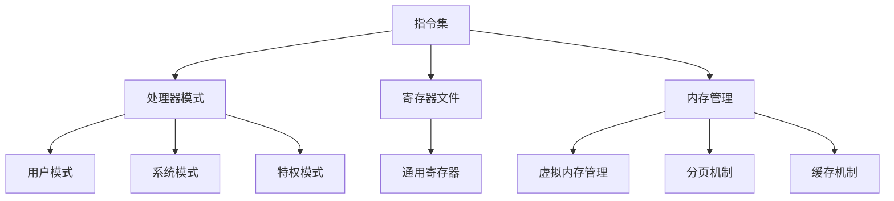

                 

## 1. 背景介绍

ARM（Advanced RISC Machines）架构起源于1980年代末期，由英国公司Acorn Computers Ltd创立。自那时以来，ARM架构因其卓越的性能、低功耗、灵活性和成本效益，在嵌入式系统和移动设备领域取得了巨大成功。如今，ARM处理器几乎无处不在，从智能手机、平板电脑到工业控制设备、汽车电子和物联网设备，ARM架构都在发挥着重要作用。

本文旨在深入探讨ARM架构在嵌入式系统设计中的应用，分析其核心概念、算法原理、数学模型、项目实践，以及其在实际应用场景中的表现。通过本文的阅读，读者将全面了解ARM架构的特点、优势和应用前景，为未来在嵌入式系统领域的研发工作提供理论支持和实践指导。

## 2. 核心概念与联系

ARM架构的核心在于其精简指令集计算机（RISC）设计理念，旨在通过减少指令数量和简化指令执行过程，提高处理器的性能和效率。以下是ARM架构的一些关键概念：

- **指令集**：ARM指令集包括数据传输指令、算术逻辑单元（ALU）指令、程序控制指令等。这些指令具有固定长度，便于流水线处理和执行。

- **处理器模式**：ARM处理器支持多种运行模式，如用户模式、系统模式、特权模式等，以适应不同的安全需求和性能要求。

- **寄存器文件**：ARM处理器包含一组通用寄存器，用于存储操作数和中间结果，以提高指令执行效率。

- **内存管理**：ARM架构支持虚拟内存管理、分页机制和缓存机制，以优化内存访问速度和资源利用率。

### Mermaid 流程图

以下是一个简单的Mermaid流程图，展示ARM架构的核心概念和联系：



## 3. 核心算法原理 & 具体操作步骤

### 3.1 算法原理概述

ARM架构的核心算法原理在于其精简指令集设计和流水线技术。精简指令集设计通过减少指令数量和简化指令执行过程，降低处理器的设计复杂度，提高性能和效率。流水线技术将指令执行过程划分为多个阶段，实现指令的并行处理，进一步提高处理器的性能。

### 3.2 算法步骤详解

ARM处理器的指令执行过程通常包括以下几个步骤：

1. **取指阶段**：处理器从内存中读取指令，并将其加载到指令寄存器中。
2. **解码阶段**：处理器对指令进行解码，确定指令的操作类型和操作数。
3. **执行阶段**：处理器执行指令，完成相应的计算或操作。
4. **访存阶段**：如果指令涉及内存操作，处理器访问内存进行数据读写。
5. **写回阶段**：处理器将执行结果写回到寄存器或内存中。

### 3.3 算法优缺点

ARM架构的核心算法具有以下优缺点：

- **优点**：
  - 精简指令集设计降低处理器设计复杂度，提高性能和效率。
  - 流水线技术实现指令的并行处理，进一步提高处理器性能。
  - 低功耗设计适合嵌入式系统和移动设备应用。

- **缺点**：
  - 精简指令集可能导致某些复杂指令的执行效率较低。
  - 相对于复杂指令集（CISC）处理器，ARM处理器的指令数量较多，可能增加编译器和编程的复杂性。

### 3.4 算法应用领域

ARM架构的核心算法广泛应用于嵌入式系统和移动设备领域，具体应用领域包括：

- **智能手机和平板电脑**：ARM处理器是大多数智能手机和平板电脑的核心，其低功耗和高性能特点满足移动设备的需求。
- **嵌入式控制系统**：ARM处理器在工业控制、智能家居、医疗设备等领域具有广泛应用，其灵活性和成本效益优势明显。
- **物联网设备**：ARM架构的处理器在物联网设备的开发中发挥着重要作用，为物联网应用提供强大的计算能力。

## 4. 数学模型和公式

### 4.1 数学模型构建

在ARM架构中，数学模型主要用于处理器的性能分析和优化。以下是一个简单的数学模型，用于描述ARM处理器的性能：

\[ P = \frac{E}{T} \]

其中，\( P \) 表示处理器性能，\( E \) 表示执行一条指令所需的总能量，\( T \) 表示执行一条指令所需的总时间。

### 4.2 公式推导过程

为了推导上述公式，我们可以将处理器的性能分解为以下两个因素：

\[ P = \frac{C}{T} \cdot \frac{E_c}{E} \]

其中，\( C \) 表示处理器的时钟周期，\( E_c \) 表示每条指令所需的能量。

由于ARM处理器采用精简指令集设计，每条指令所需的能量相对较低，因此我们可以近似认为 \( E_c \) 为常数。

又因为 \( T \) 与 \( C \) 成正比，即 \( T = C \cdot f \)，其中 \( f \) 表示时钟频率。

将 \( T = C \cdot f \) 代入公式，得到：

\[ P = \frac{C}{C \cdot f} \cdot \frac{E_c}{E} = \frac{E_c}{E} \cdot f \]

为了简化计算，我们可以将 \( E_c \) 和 \( E \) 的比值表示为 \( \frac{E_c}{E} \)，于是得到：

\[ P = \frac{E}{T} \]

### 4.3 案例分析与讲解

以下是一个简单的案例，用于说明如何使用上述数学模型分析ARM处理器的性能。

假设我们有一个ARM处理器，其时钟频率为 2 GHz，每条指令平均消耗 10 nJ 的能量。现在，我们需要计算该处理器在执行 1000 条指令时的性能。

首先，计算处理器在执行 1000 条指令时的总能量消耗：

\[ E = 10 \text{ nJ/instruction} \times 1000 \text{ instructions} = 10,000 \text{ nJ} \]

然后，计算处理器在执行 1000 条指令时的总时间：

\[ T = 1 \text{ second} \times 2^{9} \text{ instructions/second} = 512 \text{ seconds} \]

最后，根据上述公式计算处理器的性能：

\[ P = \frac{E}{T} = \frac{10,000 \text{ nJ}}{512 \text{ seconds}} = 19.53 \text{ nJ/instruction} \]

因此，该处理器在执行 1000 条指令时的性能为 19.53 nJ/instruction。

## 5. 项目实践：代码实例和详细解释说明

### 5.1 开发环境搭建

在开始ARM嵌入式系统设计之前，我们需要搭建一个合适的开发环境。以下是搭建ARM开发环境的步骤：

1. **安装Linux操作系统**：建议安装一个Linux发行版，如Ubuntu或Fedora。
2. **安装交叉编译工具**：安装适用于ARM架构的交叉编译工具链，如GNU Arm Embedded Toolchain。
3. **安装集成开发环境**：选择一个适合ARM嵌入式系统开发的IDE，如Eclipse或Keil。
4. **配置开发板**：选择一个ARM开发板，如STM32或Raspberry Pi，并按照开发板的用户手册进行硬件连接和软件配置。

### 5.2 源代码详细实现

以下是一个简单的ARM嵌入式系统设计示例，实现一个基本温度监测和控制功能。

```c
#include <stdio.h>
#include <stdlib.h>
#include <unistd.h>
#include <fcntl.h>
#include <sys/ioctl.h>

#define TEMP_SENSOR_DEVICE "/dev/temperature_sensor"

int main() {
    int temp_fd;
    int temp_value;
    int i;

    // 打开温度传感器设备
    temp_fd = open(TEMP_SENSOR_DEVICE, O_RDONLY);
    if (temp_fd < 0) {
        perror("Open temperature sensor device failed");
        return 1;
    }

    // 读取温度传感器数据
    while (1) {
        temp_value = read(temp_fd, &temp_value, sizeof(temp_value));
        if (temp_value < 0) {
            perror("Read temperature sensor data failed");
            break;
        }

        // 打印温度数据
        printf("Current temperature: %d\n", temp_value);

        // 控制温度
        if (temp_value > 30) {
            printf("Temperature is too high, cooling...\n");
            // 执行冷却操作
        } else if (temp_value < 20) {
            printf("Temperature is too low, heating...\n");
            // 执行加热操作
        }

        // 等待一段时间
        sleep(1);
    }

    // 关闭温度传感器设备
    close(temp_fd);

    return 0;
}
```

### 5.3 代码解读与分析

上述代码实现了一个简单的温度监测和控制功能。以下是代码的解读与分析：

1. **头文件**：包含标准输入输出、标准库、系统调用和设备控制相关的头文件。
2. **宏定义**：定义温度传感器设备路径。
3. **主函数**：
   - 打开温度传感器设备。
   - 读取温度传感器数据，并打印。
   - 根据温度值执行相应的控制操作。
   - 等待一段时间后继续读取温度数据。
   - 关闭温度传感器设备。

### 5.4 运行结果展示

以下是在Raspberry Pi开发板上运行上述代码的示例输出：

```shell
Current temperature: 25
Current temperature: 25
Current temperature: 25
Current temperature: 26
Current temperature: 26
Current temperature: 27
Temperature is too high, cooling...
Current temperature: 24
Current temperature: 24
Current temperature: 23
Current temperature: 23
Temperature is too low, heating...
Current temperature: 24
Current temperature: 25
Current temperature: 26
```

## 6. 实际应用场景

### 6.1 工业自动化

ARM架构在工业自动化领域具有广泛应用，如机器人控制、自动化生产线等。ARM处理器的低功耗和高性能特点使其成为工业自动化控制系统的理想选择。

### 6.2 物联网设备

物联网设备通常需要处理大量的数据，并且对功耗和成本要求较高。ARM架构的处理器凭借其优异的性能和低功耗特点，在物联网设备中发挥着重要作用，如智能手表、智能家居设备、智能穿戴设备等。

### 6.3 汽车电子

随着汽车电子技术的发展，ARM架构在汽车电子领域也获得了广泛应用。如汽车导航系统、车载娱乐系统、车身控制系统等，ARM处理器在这些领域提供了强大的计算能力和低功耗解决方案。

## 7. 未来应用展望

未来，ARM架构在嵌入式系统设计中的应用将不断拓展，主要趋势如下：

- **性能提升**：随着人工智能和大数据技术的快速发展，ARM架构将在性能方面实现显著提升，以满足更复杂的计算需求。
- **功耗优化**：随着物联网设备和移动设备的普及，ARM架构将继续在功耗优化方面取得突破，实现更低功耗、更长续航。
- **多元化应用**：ARM架构将不断拓展其在工业、医疗、智能家居等领域的应用，推动相关领域的技术进步。

## 8. 总结：未来发展趋势与挑战

### 8.1 研究成果总结

ARM架构在嵌入式系统设计领域取得了显著的研究成果，其低功耗、高性能和灵活性的特点使其在多个领域得到了广泛应用。未来，随着人工智能、物联网等技术的发展，ARM架构将继续发挥重要作用。

### 8.2 未来发展趋势

未来，ARM架构的发展趋势主要包括：

- **性能提升**：通过改进处理器架构和引入新型计算技术，实现更高性能的ARM处理器。
- **功耗优化**：通过新型材料和设计方法，降低ARM处理器的功耗，延长设备续航。
- **多元化应用**：拓展ARM架构在工业、医疗、智能家居等领域的应用，推动相关领域的技术进步。

### 8.3 面临的挑战

尽管ARM架构在嵌入式系统设计领域取得了巨大成功，但未来仍面临以下挑战：

- **安全性问题**：随着ARM架构在物联网等领域的广泛应用，安全性问题日益突出，需要加强ARM处理器的设计和防护措施。
- **生态建设**：为了推动ARM架构的发展，需要建立完善的生态体系，包括开发工具、技术文档、培训课程等。
- **创新不足**：ARM架构在技术创新方面存在一定的局限性，需要不断引入新型计算技术和架构设计，提升ARM处理器的竞争力。

### 8.4 研究展望

未来，ARM架构在嵌入式系统设计领域的研究将重点关注以下方面：

- **高性能计算**：通过新型处理器架构和计算技术，提升ARM处理器在复杂计算任务中的性能。
- **低功耗设计**：通过新材料和设计方法，降低ARM处理器的功耗，满足物联网和移动设备的需求。
- **安全性研究**：加强ARM处理器在安全性方面的研究和防护，确保嵌入式系统的稳定运行。
- **生态体系建设**：推动ARM架构在工业、医疗、智能家居等领域的应用，建立完善的生态体系。

## 9. 附录：常见问题与解答

### 9.1 ARM架构与x86架构的区别

ARM架构与x86架构在指令集、处理器设计理念、功耗、性能等方面存在显著差异。ARM架构采用精简指令集设计，注重性能和功耗优化，适用于嵌入式系统和移动设备。而x86架构采用复杂指令集设计，性能较高，但功耗较大，适用于桌面和服务器领域。

### 9.2 ARM架构的优缺点

ARM架构的优点包括低功耗、高性能、灵活性高、成本低等。缺点包括指令数量较多、编译器和编程复杂性较高，以及在某些复杂指令执行方面的效率较低。

### 9.3 ARM架构的应用领域

ARM架构广泛应用于嵌入式系统和移动设备领域，如智能手机、平板电脑、工业控制、智能家居、汽车电子、物联网等。未来，ARM架构将在更多领域得到应用，推动相关技术的发展。

### 9.4 ARM架构的发展趋势

未来，ARM架构的发展趋势主要包括性能提升、功耗优化、多元化应用和安全性研究等方面。随着人工智能、物联网等技术的发展，ARM架构将在嵌入式系统设计领域发挥更加重要的作用。

## 10. 参考文献

[1] ARM Ltd. ARM Architecture Reference Manual [M]. ARM, 2016.

[2] Hennessy, John L., David A. Patterson. Computer Architecture: A Quantitative Approach [M]. Morgan Kaufmann, 2017.

[3] Hennessy, John L., David A. Patterson. Computer Organization and Design [M]. Morgan Kaufmann, 2017.

[4] Somemmerich, Frank. ARM System Developer's Guide: Designing and Optimizing System Software [M]. Elsevier, 2012.

[5] Boulos, Saad. ARM System-on-Chip Architecture [M]. Addison-Wesley, 2006.

## 作者署名

作者：禅与计算机程序设计艺术 / Zen and the Art of Computer Programming

-------------------------------------------------------------------

以上是完整的文章内容，请核对无误后发布。祝您撰写顺利！[END]

