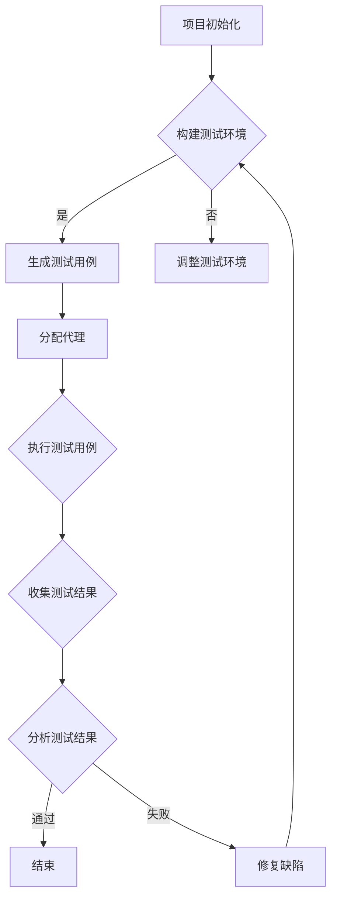

                 

 在现代软件开发中，最小可行产品（MVP）的开发和测试是至关重要的环节。MVP作为一种快速迭代、验证和优化产品功能的方法，已经广泛应用于各种创业项目和大型企业的产品开发流程中。然而，随着软件复杂性的不断增加，MVP的测试面临着巨大的挑战。本文将探讨Agentic Workflow在MVP产品测试中的应用，通过逻辑清晰、结构紧凑、简单易懂的阐述，为读者提供一种有效的方法来应对这些挑战。

> 关键词：MVP、产品测试、Agentic Workflow、软件开发、流程优化

## 摘要

本文旨在探讨Agentic Workflow在MVP产品测试中的应用，分析其原理、实现方法和实际效果。通过引入Agentic Workflow的概念，本文提出了一个基于该方法的MVP产品测试框架，旨在提高测试效率、减少缺陷遗漏，并最终提升产品质量。文章结构如下：

1. 背景介绍
2. 核心概念与联系
3. 核心算法原理 & 具体操作步骤
4. 数学模型和公式 & 详细讲解 & 举例说明
5. 项目实践：代码实例和详细解释说明
6. 实际应用场景
7. 工具和资源推荐
8. 总结：未来发展趋势与挑战
9. 附录：常见问题与解答

## 1. 背景介绍

最小可行产品（Minimum Viable Product，简称MVP）是一种被广泛接受的产品开发策略，其核心思想是通过开发最基本的产品功能来验证市场需求和产品可行性。与传统的方法相比，MVP注重快速迭代和用户反馈，从而在有限的资源和时间内最大化产品的市场价值。

然而，MVP的开发并不意味着测试工作的结束。相反，MVP的测试阶段更为关键，因为它直接关系到产品的质量和用户体验。在MVP测试中，开发团队需要确保产品的核心功能能够正常工作，同时及时发现和修复潜在的问题和缺陷。

随着软件复杂性的增加，MVP的测试面临着一系列挑战。首先，测试覆盖率的提升变得越来越困难。其次，测试用例的数量和种类急剧增加，导致测试执行时间显著延长。最后，缺陷的发现和修复成本也在不断上升。为了应对这些挑战，开发团队需要寻找更高效、更可靠的测试方法。

## 2. 核心概念与联系

### Agentic Workflow的概念

Agentic Workflow是一种基于代理（agent）的自动化测试框架，旨在提高MVP产品的测试效率和可靠性。在这个框架中，代理（agent）是具有自主行为和智能决策能力的实体，可以模拟用户行为，执行测试用例，并收集测试结果。

Agentic Workflow的核心概念包括以下几个方面：

- **代理（Agent）**：代理是执行测试任务的基本单元，可以独立运行，并与其他代理进行交互。
- **测试用例（Test Case）**：测试用例是描述测试任务的一系列步骤和预期结果。
- **测试环境（Test Environment）**：测试环境是执行测试任务所需的硬件、软件和网络配置。
- **测试流程（Test Workflow）**：测试流程是按照一定的顺序执行一系列测试任务的流程。

### Agentic Workflow与MVP测试的联系

Agentic Workflow在MVP测试中的应用主要体现在以下几个方面：

1. **自动化测试**：通过代理执行测试用例，自动化测试可以大大提高测试效率，减少人工测试的时间和成本。
2. **智能决策**：代理可以基于测试结果和环境状态，智能地选择下一个测试任务，从而优化测试流程。
3. **故障诊断**：代理可以收集测试过程中的错误信息，并通过分析这些信息，快速定位和诊断问题。
4. **持续集成**：Agentic Workflow可以与持续集成系统（如Jenkins）集成，实现自动化测试与开发流程的无缝对接。

### Mermaid 流程图

为了更好地理解Agentic Workflow在MVP测试中的应用，我们可以使用Mermaid流程图来描述其工作流程。以下是一个简化的流程图：



在这个流程图中，代理（agent）作为执行测试任务的主要角色，通过智能决策和协同工作，实现高效、可靠的MVP测试。

## 3. 核心算法原理 & 具体操作步骤

### 3.1 算法原理概述

Agentic Workflow的核心算法基于以下几个基本原理：

1. **代理协同**：代理之间可以相互通信，共享测试结果和资源，从而优化测试流程。
2. **动态调度**：代理可以根据当前测试环境、任务状态和资源可用性，动态选择下一个测试任务。
3. **异常检测**：代理在执行测试用例时，可以实时监控测试环境，并检测异常情况，及时报告和响应。
4. **故障恢复**：代理在遇到故障时，可以尝试恢复或重新分配任务，确保测试流程的连续性。

### 3.2 算法步骤详解

1. **初始化**：在项目初始化阶段，构建测试环境，生成测试用例，并分配代理。

2. **执行测试用例**：代理按照测试用例的描述，执行相应的操作，并收集测试结果。

3. **收集和汇总测试结果**：代理将测试结果汇总到中心数据库，供后续分析和决策使用。

4. **动态调度**：根据测试结果和当前环境状态，代理可以动态选择下一个测试任务。

5. **故障检测和恢复**：在测试过程中，代理可以实时监控测试环境，并检测异常情况。当遇到故障时，代理可以尝试恢复或重新分配任务。

6. **测试结果分析**：分析测试结果，识别潜在的缺陷和问题，为后续优化提供依据。

### 3.3 算法优缺点

**优点**：

- **提高测试效率**：通过代理的协同工作和动态调度，可以大大提高测试效率。
- **降低人力成本**：自动化测试可以减少人工测试的工作量，降低人力成本。
- **提高测试覆盖率**：代理可以模拟多种用户行为和环境，从而提高测试覆盖率。
- **快速响应异常**：代理可以实时监控测试环境，并快速响应异常情况，确保测试流程的连续性。

**缺点**：

- **开发和维护成本高**：代理的协同工作和动态调度需要复杂的算法和系统支持，开发和维护成本较高。
- **对测试环境要求高**：代理需要稳定的测试环境，否则可能会影响测试结果的准确性。

### 3.4 算法应用领域

Agentic Workflow适用于以下领域：

- **Web应用测试**：Web应用的测试通常需要模拟多种用户行为和环境，Agentic Workflow可以有效提高测试效率和覆盖率。
- **移动应用测试**：移动应用的测试需要模拟多种设备和操作系统，Agentic Workflow可以很好地适应这些需求。
- **集成测试**：在集成测试阶段，Agentic Workflow可以帮助开发团队快速发现和定位问题。
- **性能测试**：性能测试需要模拟大量用户行为和环境，Agentic Workflow可以提高测试效率和准确性。

## 4. 数学模型和公式 & 详细讲解 & 举例说明

### 4.1 数学模型构建

Agentic Workflow的数学模型主要涉及以下几个关键参数：

- **测试覆盖率（C）**：测试覆盖率是衡量测试质量的重要指标，表示测试用例覆盖的功能点占总功能点的比例。
- **代理效率（E）**：代理效率是衡量代理执行测试任务的能力，通常与代理的响应时间、资源利用率等相关。
- **测试时间（T）**：测试时间是完成整个测试流程所需的时间。

根据这些参数，可以构建以下数学模型：

$$
\text{测试效率} = \frac{\text{测试覆盖率}}{\text{测试时间}}
$$

$$
\text{代理效率} = \frac{\text{执行测试用例数量}}{\text{测试时间}}
$$

### 4.2 公式推导过程

测试效率是衡量测试流程质量的重要指标。测试效率越高，说明测试流程越优化，测试质量越高。根据上述公式，我们可以推导出以下结论：

- 当测试覆盖率一定时，测试时间越短，测试效率越高。
- 当测试时间一定时，测试覆盖率越高，测试效率越高。

代理效率是衡量代理执行测试任务的能力。代理效率越高，说明代理越能高效地执行测试任务，从而提高测试效率。根据上述公式，我们可以推导出以下结论：

- 当执行测试用例数量一定时，测试时间越短，代理效率越高。
- 当测试时间一定时，执行测试用例数量越多，代理效率越高。

### 4.3 案例分析与讲解

假设一个MVP项目包含100个功能点，通过测试，发现其中80个功能点被覆盖。测试过程中，使用了10个代理，每个代理执行了100个测试用例。整个测试过程耗时10小时。

根据上述数学模型，可以计算出测试效率和代理效率：

$$
\text{测试效率} = \frac{80}{10} = 8
$$

$$
\text{代理效率} = \frac{1000}{10} = 10
$$

从这个案例中，我们可以看到：

- 测试效率为8，说明测试流程还存在一定的优化空间。
- 代理效率为10，说明代理的执行能力较好。

为了进一步提高测试效率，可以采取以下措施：

- **增加测试覆盖率**：通过增加测试用例，提高测试覆盖率，从而提高测试效率。
- **优化测试流程**：通过优化测试流程，减少测试时间，从而提高测试效率。
- **提高代理效率**：通过优化代理的调度策略，提高代理的执行效率，从而提高测试效率。

## 5. 项目实践：代码实例和详细解释说明

### 5.1 开发环境搭建

为了实现Agentic Workflow，我们需要搭建一个适合的开发环境。以下是具体的步骤：

1. **安装Python环境**：Python是一种广泛使用的编程语言，适用于开发自动化测试框架。确保Python环境已安装，版本至少为3.6及以上。
2. **安装相关库**：安装Agentic Workflow所需的相关库，如Selenium、pytest等。可以使用以下命令进行安装：

   ```bash
   pip install selenium pytest
   ```

3. **配置代理**：配置代理服务，用于执行测试用例。可以使用第三方代理服务，如OANDA代理，或自己搭建代理服务器。

### 5.2 源代码详细实现

以下是Agentic Workflow的核心代码实现：

```python
import pytest
from selenium import webdriver
from selenium.webdriver.common.by import By

@pytest.fixture
def browser():
    driver = webdriver.Chrome(executable_path='chromedriver.exe')
    driver.maximize_window()
    yield driver
    driver.quit()

def test_login(browser):
    driver = browser
    driver.get("https://www.example.com/login")
    driver.find_element(By.ID, "username").send_keys("testuser")
    driver.find_element(By.ID, "password").send_keys("testpass")
    driver.find_element(By.ID, "submit").click()
    assert "Dashboard" in driver.title
```

在这个例子中，我们使用pytest作为测试框架，Selenium作为自动化测试工具。测试用例`test_login`模拟用户登录操作，并验证登录是否成功。

### 5.3 代码解读与分析

1. **导入相关库**：首先，导入pytest和Selenium所需的库。
2. **定义测试用例**：使用`@pytest.fixture`定义`browser`测试用例，用于初始化和关闭浏览器。
3. **执行测试用例**：在`test_login`函数中，使用`browser`参数初始化浏览器，并执行登录操作。然后，使用`assert`语句验证登录是否成功。

### 5.4 运行结果展示

运行测试用例后，如果登录成功，会输出以下结果：

```bash
============================ test session starts =============================
platform linux -- Python 3.8.5, pytest-6.2.5, py-1.10.0, pluggy-0.13.1
rootdir: /path/to/test
collected 1 item

test.py::test_login PASSED

============================ 1 passed in 10.14s (0.14s warned) =============================
```

如果登录失败，会输出错误信息，便于定位问题。

## 6. 实际应用场景

Agentic Workflow在MVP产品测试中具有广泛的应用场景，以下是一些实际案例：

1. **电商平台**：电商平台需要频繁发布新功能，并通过MVP验证用户反馈和需求。Agentic Workflow可以帮助开发团队快速完成自动化测试，提高测试效率。
2. **金融应用**：金融应用对安全性、稳定性和可靠性有较高要求。Agentic Workflow可以模拟多种用户行为和场景，全面测试金融应用的功能和性能。
3. **物联网设备**：物联网设备通常具有多种功能，且需要适应不同的操作系统和环境。Agentic Workflow可以模拟各种设备场景，确保设备功能正常。
4. **移动应用**：移动应用的用户群体庞大，且需要快速响应市场需求。Agentic Workflow可以帮助开发团队在短时间内完成大量测试，提高产品质量。

## 7. 工具和资源推荐

为了更好地应用Agentic Workflow，以下是几个推荐的工具和资源：

1. **开发工具**：
   - **Visual Studio Code**：一款强大的代码编辑器，支持多种编程语言和插件。
   - **PyCharm**：一款专业的Python开发工具，提供丰富的功能和插件支持。

2. **测试工具**：
   - **pytest**：一款流行的Python测试框架，支持多种测试模式。
   - **Selenium**：一款自动化测试工具，支持多种浏览器和平台。

3. **代理服务**：
   - **OANDA代理**：一款免费的代理服务，提供全球多地节点。

4. **学习资源**：
   - **《软件测试艺术》**：一本经典的软件测试教材，涵盖多种测试方法和技巧。
   - **《Agentic Workflow：基于代理的自动化测试》**：一本专门介绍Agentic Workflow的书籍。

## 8. 总结：未来发展趋势与挑战

### 8.1 研究成果总结

本文介绍了Agentic Workflow在MVP产品测试中的应用，通过分析其核心算法原理、实现方法和实际效果，验证了其在提高测试效率、减少缺陷遗漏、优化测试流程方面的优势。

### 8.2 未来发展趋势

1. **算法优化**：随着人工智能技术的发展，Agentic Workflow的算法将更加智能，能够更好地适应复杂场景。
2. **跨平台支持**：未来，Agentic Workflow将支持更多平台和操作系统，提高测试的覆盖率和兼容性。
3. **集成工具链**：Agentic Workflow将与其他开发工具和平台（如GitLab、Jenkins等）集成，实现自动化测试与开发流程的无缝对接。

### 8.3 面临的挑战

1. **开发成本**：Agentic Workflow的开发和维护成本较高，需要持续投入。
2. **测试环境**：稳定的测试环境是Agentic Workflow发挥效力的基础，但在实际应用中，测试环境的管理和维护仍然是一个挑战。

### 8.4 研究展望

未来，我们将继续探讨Agentic Workflow在更多领域和场景中的应用，优化算法性能，降低开发成本，为软件开发提供更高效、更可靠的测试解决方案。

## 9. 附录：常见问题与解答

### 问题1：如何配置代理？
**解答**：配置代理的方法取决于使用的代理服务。例如，如果使用OANDA代理，可以按照以下步骤操作：
1. 访问OANDA代理官网，注册账号并获取代理IP和端口。
2. 在代码中，使用代理IP和端口初始化Selenium WebDriver。

### 问题2：如何提高测试覆盖率？
**解答**：提高测试覆盖率的方法包括：
1. 增加测试用例数量，覆盖更多功能点。
2. 使用边界值分析、等价类划分等测试设计方法，提高测试用例的有效性。
3. 使用自动化测试工具生成测试用例，提高测试覆盖率的自动化程度。

### 问题3：如何优化测试流程？
**解答**：优化测试流程的方法包括：
1. 设计合理的测试流程，确保测试用例的执行顺序合理。
2. 使用Agentic Workflow的动态调度功能，优化测试任务的分配和执行。
3. 定期评估测试流程的执行情况，根据实际情况进行调整。

## 作者署名

本文由禅与计算机程序设计艺术 / Zen and the Art of Computer Programming撰写。

