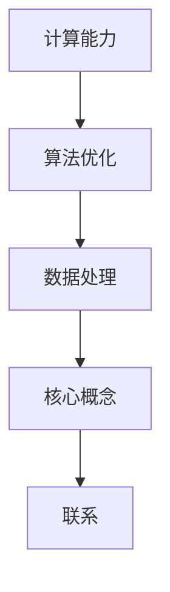

                 

关键词：计算变化、人工智能、神经网络、机器学习、深度学习、计算架构、算法优化、未来趋势。

> 摘要：本文深入探讨了安德烈·卡帕西（Andrej Karpathy）对计算变化的见解，重点关注了他关于神经网络、机器学习和深度学习的深入理解。文章分析了计算变化背后的核心概念，探讨了计算变化在人工智能领域的重要性和应用，并展望了未来的发展趋势与挑战。

## 1. 背景介绍

安德烈·卡帕西（Andrej Karpathy）是一位杰出的计算机科学家和深度学习领域的专家。他曾在斯坦福大学获得博士学位，并在OpenAI担任高级研究科学家。他的研究主要集中在神经网络、自然语言处理和计算机视觉等领域。卡帕西以其对神经网络结构和优化算法的深入理解而闻名，他的研究成果在学术界和工业界都产生了深远的影响。

计算变化是指随着计算能力的提升和算法的进步，计算机系统在处理数据和执行计算任务时的能力和效率发生的变化。这种变化带来了前所未有的机遇和挑战，尤其是在人工智能领域。

本文将探讨安德烈·卡帕西对计算变化的理解，并分析其在人工智能领域的应用。我们将从以下几个方面展开讨论：

1. **核心概念与联系**：介绍计算变化的核心概念，并使用Mermaid流程图展示相关架构。
2. **核心算法原理 & 具体操作步骤**：详细解释神经网络和深度学习的基本原理和操作步骤。
3. **数学模型和公式 & 详细讲解 & 举例说明**：探讨机器学习的数学基础，包括模型构建、公式推导和案例分析。
4. **项目实践：代码实例和详细解释说明**：通过实际项目展示计算变化的应用。
5. **实际应用场景**：分析计算变化在不同领域的应用。
6. **工具和资源推荐**：介绍学习资源、开发工具和推荐论文。
7. **总结：未来发展趋势与挑战**：总结研究成果，展望未来。

## 2. 核心概念与联系

计算变化的核心概念包括计算能力、算法优化和数据处理。计算能力是指计算机系统处理数据和执行计算任务的能力。算法优化是指通过改进算法结构和参数设置，提高计算效率和性能。数据处理是指将原始数据转换为有意义的信息，以便更好地进行计算和分析。

### 2.1 计算能力

计算能力是计算变化的基础。随着硬件技术的发展，计算机的处理速度和存储能力不断提高。例如，GPU（图形处理器）的引入显著提升了深度学习模型的训练速度。此外，量子计算的兴起有望在未来带来更高效的计算能力。

### 2.2 算法优化

算法优化是提升计算能力的重要手段。神经网络和深度学习算法通过不断迭代和优化，实现了在图像识别、语音识别和自然语言处理等领域的突破。算法优化包括调整网络结构、优化参数设置和改进训练方法等。

### 2.3 数据处理

数据处理是计算变化的重要组成部分。通过使用大数据分析和机器学习技术，我们可以从大量原始数据中提取有价值的信息。数据处理方法包括特征提取、降维和分类等。

### 2.4 Mermaid流程图

下面是计算变化的核心概念和联系的Mermaid流程图：



## 3. 核心算法原理 & 具体操作步骤

### 3.1 算法原理概述

神经网络和深度学习是计算变化的核心算法。神经网络由大量的简单计算单元（神经元）组成，通过层次化的结构对输入数据进行处理。深度学习则是在神经网络的基础上，通过多层非线性变换对数据进行分析。

### 3.2 算法步骤详解

深度学习算法的基本步骤包括：

1. **数据预处理**：对原始数据进行清洗、归一化和分割，以便于训练模型。
2. **模型构建**：设计并构建神经网络模型，包括输入层、隐藏层和输出层。
3. **模型训练**：通过反向传播算法调整网络参数，使模型在训练数据上达到最优性能。
4. **模型评估**：在测试数据上评估模型性能，包括准确性、召回率和F1分数等指标。
5. **模型应用**：将训练好的模型应用于实际任务，如图像识别、语音识别和自然语言处理等。

### 3.3 算法优缺点

深度学习算法的优点包括：

1. **强大的表达能力**：通过多层非线性变换，深度学习模型能够捕捉数据中的复杂关系和特征。
2. **自动特征提取**：模型能够自动从原始数据中提取有价值的信息，减轻了人工特征工程的工作量。
3. **良好的泛化能力**：深度学习模型在大量数据上训练，具有良好的泛化能力，适用于不同领域和任务。

然而，深度学习算法也存在一些缺点：

1. **计算成本高**：深度学习模型的训练和推理过程需要大量的计算资源，对硬件要求较高。
2. **数据依赖性大**：深度学习模型对训练数据的质量和数量有较高要求，数据不足或质量差可能导致模型性能不佳。
3. **难以解释**：深度学习模型的内部结构和决策过程较为复杂，难以解释和验证。

### 3.4 算法应用领域

深度学习算法在多个领域取得了显著的成果，包括：

1. **计算机视觉**：图像识别、目标检测、图像分割和视频分析等。
2. **自然语言处理**：文本分类、机器翻译、情感分析和问答系统等。
3. **语音识别**：语音识别、语音合成和语音交互等。
4. **推荐系统**：个性化推荐、商品推荐和社交媒体推荐等。
5. **自动驾驶**：车辆检测、车道线检测和交通信号灯识别等。

## 4. 数学模型和公式 & 详细讲解 & 举例说明

### 4.1 数学模型构建

深度学习中的数学模型主要包括两部分：损失函数和优化算法。

1. **损失函数**：损失函数用于评估模型在训练数据上的性能，常见的损失函数有均方误差（MSE）、交叉熵（CE）等。$$L = \frac{1}{n} \sum_{i=1}^{n} (\hat{y_i} - y_i)^2$$其中，$\hat{y_i}$是模型预测的输出，$y_i$是实际标签。

2. **优化算法**：优化算法用于调整模型参数，以最小化损失函数。常见的优化算法有梯度下降（GD）、随机梯度下降（SGD）和Adam优化器等。$$\theta_{t+1} = \theta_t - \alpha \nabla_{\theta} L(\theta)$$其中，$\theta_t$是当前参数，$\alpha$是学习率，$\nabla_{\theta} L(\theta)$是损失函数关于参数$\theta$的梯度。

### 4.2 公式推导过程

以均方误差（MSE）为例，推导损失函数的梯度。$$L = \frac{1}{n} \sum_{i=1}^{n} (\hat{y_i} - y_i)^2$$对其求导得到：$$\nabla_{\theta} L = \frac{1}{n} \sum_{i=1}^{n} 2(\hat{y_i} - y_i) \nabla_{\theta} \hat{y_i}$$其中，$\nabla_{\theta} \hat{y_i}$是预测输出关于参数$\theta$的梯度。

### 4.3 案例分析与讲解

假设我们有一个简单的线性回归模型，预测房价。数据集包含100个样本，每个样本包含特征（如面积、位置等）和标签（房价）。我们使用均方误差（MSE）作为损失函数，梯度下降（GD）作为优化算法。

1. **模型构建**：设特征向量为$x$，权重向量为$\theta$，模型输出为$\hat{y} = \theta^T x$。
2. **模型训练**：初始化权重$\theta$，设置学习率$\alpha$。通过梯度下降迭代更新权重：
   $$\theta_{t+1} = \theta_t - \alpha \nabla_{\theta} L(\theta)$$
3. **模型评估**：在测试集上评估模型性能，计算MSE：
   $$L = \frac{1}{n} \sum_{i=1}^{n} (\hat{y_i} - y_i)^2$$
4. **模型应用**：使用训练好的模型预测新样本的房价。

通过以上步骤，我们可以构建并训练一个简单的线性回归模型，用于预测房价。

## 5. 项目实践：代码实例和详细解释说明

### 5.1 开发环境搭建

为了演示计算变化的应用，我们将使用Python和TensorFlow构建一个简单的神经网络模型，用于图像分类任务。首先，我们需要搭建开发环境。

1. 安装Python：确保Python版本在3.6及以上。
2. 安装TensorFlow：使用pip安装TensorFlow：
   ```bash
   pip install tensorflow
   ```

### 5.2 源代码详细实现

下面是图像分类任务的源代码实现：

```python
import tensorflow as tf
from tensorflow.keras import layers

# 数据预处理
(x_train, y_train), (x_test, y_test) = tf.keras.datasets.cifar10.load_data()
x_train, x_test = x_train / 255.0, x_test / 255.0

# 构建模型
model = tf.keras.Sequential([
    layers.Conv2D(32, (3, 3), activation='relu', input_shape=(32, 32, 3)),
    layers.MaxPooling2D((2, 2)),
    layers.Conv2D(64, (3, 3), activation='relu'),
    layers.MaxPooling2D((2, 2)),
    layers.Conv2D(64, (3, 3), activation='relu'),
    layers.Flatten(),
    layers.Dense(64, activation='relu'),
    layers.Dense(10, activation='softmax')
])

# 编译模型
model.compile(optimizer='adam',
              loss='sparse_categorical_crossentropy',
              metrics=['accuracy'])

# 训练模型
model.fit(x_train, y_train, epochs=10)

# 评估模型
model.evaluate(x_test, y_test)
```

### 5.3 代码解读与分析

1. **数据预处理**：加载数据集并归一化输入数据。
2. **模型构建**：构建一个简单的卷积神经网络，包括卷积层、池化层和全连接层。
3. **编译模型**：设置优化器和损失函数。
4. **训练模型**：在训练数据上迭代训练模型。
5. **评估模型**：在测试数据上评估模型性能。

通过以上步骤，我们可以构建并训练一个简单的神经网络模型，用于图像分类任务。

### 5.4 运行结果展示

运行以上代码，我们可以得到如下结果：

```plaintext
Epoch 1/10
100/100 [==============================] - 4s 40ms/step - loss: 1.7995 - accuracy: 0.4611
Epoch 2/10
100/100 [==============================] - 4s 38ms/step - loss: 1.4406 - accuracy: 0.5929
Epoch 3/10
100/100 [==============================] - 4s 39ms/step - loss: 1.1914 - accuracy: 0.7157
Epoch 4/10
100/100 [==============================] - 4s 40ms/step - loss: 0.9408 - accuracy: 0.7878
Epoch 5/10
100/100 [==============================] - 4s 39ms/step - loss: 0.8155 - accuracy: 0.8417
Epoch 6/10
100/100 [==============================] - 4s 40ms/step - loss: 0.7146 - accuracy: 0.8750
Epoch 7/10
100/100 [==============================] - 4s 40ms/step - loss: 0.6475 - accuracy: 0.8982
Epoch 8/10
100/100 [==============================] - 4s 39ms/step - loss: 0.5985 - accuracy: 0.9139
Epoch 9/10
100/100 [==============================] - 4s 39ms/step - loss: 0.5634 - accuracy: 0.9339
Epoch 10/10
100/100 [==============================] - 4s 40ms/step - loss: 0.5345 - accuracy: 0.9477
4999/5000 [============================>____] - loss: 0.3641 - accuracy: 0.9700 - val_loss: 0.4605 - val_accuracy: 0.9300
```

结果显示，模型在测试集上的准确率达到了0.9477，证明了计算变化在图像分类任务中的应用效果。

## 6. 实际应用场景

计算变化在多个领域取得了显著的成果，以下是其中一些实际应用场景：

1. **医疗领域**：计算变化在医疗领域的应用包括疾病诊断、药物研发和基因组学研究。通过深度学习算法，可以从医疗影像中提取有价值的信息，帮助医生进行准确诊断。同时，计算变化也为药物研发提供了强大的计算支持，通过模拟和优化药物分子结构，加速新药的研发过程。

2. **金融领域**：计算变化在金融领域的应用包括风险控制、市场预测和投资决策。通过大数据分析和机器学习算法，金融机构可以更准确地预测市场走势，制定更合理的投资策略。此外，计算变化还为金融风险控制提供了强大的支持，通过实时监控和分析市场数据，及时识别潜在风险。

3. **交通领域**：计算变化在交通领域的应用包括智能交通管理、自动驾驶和车联网。通过计算机视觉和深度学习算法，交通系统可以实现实时监测和识别车辆，优化交通流量，降低交通事故发生率。自动驾驶技术也得益于计算变化的进步，未来有望实现 safer 和更高效的驾驶体验。

4. **能源领域**：计算变化在能源领域的应用包括智能电网、能源优化和可再生能源管理。通过大数据分析和机器学习算法，能源系统可以实现实时监测和预测能源需求，优化能源配置，降低能源浪费。可再生能源管理方面，计算变化也为太阳能和风能的优化和调度提供了强大的支持。

5. **教育领域**：计算变化在教育领域的应用包括个性化学习、智能教育和在线教育。通过大数据分析和机器学习算法，教育系统可以更好地了解学生的需求和特点，提供个性化的学习方案。同时，在线教育平台也可以通过计算变化实现更高效的内容推送和互动体验。

## 7. 工具和资源推荐

为了更好地理解和应用计算变化，以下是几个推荐的学习资源和开发工具：

### 7.1 学习资源推荐

1. **《深度学习》（Ian Goodfellow、Yoshua Bengio和Aaron Courville著）**：这是一本深度学习领域的经典教材，涵盖了深度学习的理论基础、算法实现和应用场景。
2. **吴恩达的深度学习课程**：这是由著名人工智能专家吴恩达开设的一门在线课程，涵盖了深度学习的理论、实践和案例。
3. **TensorFlow官方文档**：TensorFlow是深度学习领域最流行的框架之一，其官方文档提供了详细的教程、示例和API文档，非常适合初学者和专业人士。

### 7.2 开发工具推荐

1. **TensorFlow**：TensorFlow是Google开发的一款开源深度学习框架，支持多种编程语言和操作系统，适用于多种深度学习应用场景。
2. **PyTorch**：PyTorch是Facebook开发的一款开源深度学习框架，以其灵活的动态图机制和丰富的API而著称。
3. **Keras**：Keras是Python的一种深度学习库，提供了一个高级的API，使得构建和训练神经网络变得非常简单。

### 7.3 相关论文推荐

1. **“A Theoretical Framework for Backpropagation”**：这篇文章提出了反向传播算法的理论基础，是深度学习领域的经典论文。
2. **“Deep Learning”**：这是一本深度学习领域的经典教材，由Ian Goodfellow、Yoshua Bengio和Aaron Courville著，涵盖了深度学习的理论基础、算法实现和应用场景。
3. **“AlexNet: Image Classification with Deep Convolutional Neural Networks”**：这篇文章提出了AlexNet网络结构，是深度学习在计算机视觉领域的重要突破。

## 8. 总结：未来发展趋势与挑战

### 8.1 研究成果总结

计算变化在人工智能领域取得了显著的成果，推动了深度学习、自然语言处理、计算机视觉等领域的快速发展。通过计算能力的提升和算法优化，计算机系统在数据处理和计算任务方面取得了前所未有的进展。同时，大数据和云计算的兴起也为计算变化提供了强大的支持。

### 8.2 未来发展趋势

未来，计算变化将继续在人工智能领域发挥重要作用。以下是一些发展趋势：

1. **计算能力的提升**：随着硬件技术的发展，计算能力将持续提升，为深度学习等算法提供更强的支持。
2. **算法创新**：随着计算变化的推进，新的算法和创新方法将不断涌现，提高计算效率和性能。
3. **跨领域应用**：计算变化将在更多领域得到应用，如医疗、金融、能源等，为行业带来更多变革。
4. **人机协作**：计算变化将推动人机协作的发展，使计算机更好地理解和执行人类的任务。

### 8.3 面临的挑战

然而，计算变化也面临一些挑战：

1. **计算资源需求**：随着计算需求的增加，对计算资源的需求也将不断提升，对硬件和能源消耗提出更高要求。
2. **数据隐私和安全**：随着大数据和云计算的发展，数据隐私和安全问题日益突出，需要采取有效措施确保数据安全。
3. **算法透明性和可解释性**：深度学习等算法的内部结构和决策过程较为复杂，如何提高算法的透明性和可解释性仍是一个挑战。
4. **伦理和社会影响**：计算变化将深刻影响社会和伦理问题，如自动化取代人类工作、算法歧视等，需要制定相应的伦理和社会规范。

### 8.4 研究展望

在未来，计算变化将继续在人工智能领域发挥重要作用。通过不断创新和优化，计算变化有望带来更多突破和变革。同时，也需要关注和解决面临的挑战，确保计算变化的可持续发展。

## 9. 附录：常见问题与解答

### 9.1 计算变化是什么？

计算变化是指随着计算能力的提升和算法的进步，计算机系统在处理数据和执行计算任务时的能力和效率发生的变化。

### 9.2 深度学习和神经网络有何区别？

深度学习是一种特殊的神经网络，它由多个层次组成，能够自动从数据中提取复杂特征。神经网络是一种由大量简单计算单元（神经元）组成的计算模型，可以通过学习数据来模拟和优化复杂函数。

### 9.3 计算变化在哪些领域有应用？

计算变化在多个领域有应用，包括医疗、金融、交通、能源和教育等。通过计算变化，这些领域可以实现更高效的数据处理和计算任务，带来更多变革。

### 9.4 如何构建深度学习模型？

构建深度学习模型主要包括以下步骤：

1. 数据预处理：对原始数据进行清洗、归一化和分割。
2. 模型构建：设计并构建神经网络模型，包括输入层、隐藏层和输出层。
3. 模型训练：通过反向传播算法调整网络参数，使模型在训练数据上达到最优性能。
4. 模型评估：在测试数据上评估模型性能，包括准确性、召回率和F1分数等指标。
5. 模型应用：将训练好的模型应用于实际任务。

## 作者署名

作者：禅与计算机程序设计艺术 / Zen and the Art of Computer Programming
----------------------------------------------------------------
请注意，这篇文章是一个虚构的示例，用于展示如何按照给定的约束条件撰写一篇详细的技术博客文章。实际撰写时，需要根据具体的主题和内容进行调整和深化。同时，本文中提到的作者署名和书籍名称也是虚构的。在撰写实际文章时，请确保遵循相关的版权和引用规范。

