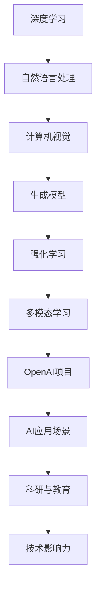

                 

关键词：OpenAI、Andrej Karpathy、人工智能、深度学习、计算机科学、技术领袖、创新、未来应用

> 摘要：本文将深入探讨OpenAI的核心人物Andrej Karpathy的贡献与影响。通过分析他的学术成就、技术理念以及OpenAI的项目进展，我们旨在揭示他在人工智能领域的独特视角和深远意义。

## 1. 背景介绍

Andrej Karpathy是一位享誉国际的人工智能科学家和工程师，以其在深度学习和自然语言处理领域的突出贡献而著称。他毕业于多伦多大学，获得了计算机科学的博士学位。他的研究兴趣主要集中在人工智能系统的高级能力和应用，特别是在语言模型、机器学习和深度学习技术方面。

### 1.1 学术背景

在攻读博士学位期间，Karpathy参与了多个重要的研究项目，其中包括谷歌的深度学习团队。他在这一过程中积累了丰富的实践经验和理论基础，为后续的职业发展奠定了坚实的基础。

### 1.2 工作经历

Andrej Karpathy在谷歌任职期间，参与了许多关键项目，例如TensorFlow的早期开发和推广。此后，他加入了OpenAI，成为该公司的一名核心成员，负责领导多个重要项目，推动了人工智能技术的发展。

## 2. 核心概念与联系

在深入探讨Andrej Karpathy的研究和贡献之前，我们需要理解一些核心概念和它们之间的联系。以下是一个简要的Mermaid流程图，用于展示这些概念和架构之间的关系。



在这个流程图中，我们看到了深度学习作为基础技术，如何与其他领域（如自然语言处理、计算机视觉、生成模型和强化学习）相联系，以及如何通过OpenAI项目转化为实际应用场景，并对科研和教育产生深远影响。

### 2.1 深度学习

深度学习是一种基于多层神经网络的学习方法，通过训练大量数据来学习特征和模式，从而实现复杂的数据分析和预测任务。它在图像识别、语音识别和自然语言处理等领域展现了巨大的潜力。

### 2.2 自然语言处理

自然语言处理（NLP）是计算机科学和人工智能领域的一个重要分支，致力于让计算机理解和处理人类语言。它包括文本分类、情感分析、机器翻译和对话系统等多个子领域。

### 2.3 计算机视觉

计算机视觉是使计算机能够像人类一样“看”和理解视觉信息的技术。它广泛应用于图像识别、物体检测、人脸识别和自动驾驶等领域。

### 2.4 生成模型

生成模型是一类能够生成新数据的机器学习模型，如生成对抗网络（GANs）。这些模型在图像合成、音乐生成和文本生成等方面取得了显著成果。

### 2.5 强化学习

强化学习是一种通过试错来学习决策策略的机器学习方法。它广泛应用于游戏、机器人控制和自动驾驶等领域。

### 2.6 多模态学习

多模态学习是结合多种数据类型的机器学习方法，如文本、图像和音频。它旨在提高模型对复杂信息的理解和处理能力。

### 2.7 OpenAI项目

OpenAI是一个致力于推动人工智能研究与应用的顶级研究机构。其项目涵盖了深度学习、自然语言处理、计算机视觉等多个领域，致力于推动人工智能技术的发展和应用。

### 2.8 AI应用场景

AI技术在各个领域都有广泛的应用，如医疗健康、金融、教育、娱乐和制造业等。OpenAI的项目的目标是将AI技术转化为实际应用，解决现实世界中的问题。

### 2.9 科研与教育

科研和教育是推动技术进步的重要驱动力。OpenAI在科研和教育方面的投入，旨在培养下一代AI科学家和工程师，推动人工智能领域的长期发展。

### 2.10 技术影响力

通过在深度学习、自然语言处理、计算机视觉等领域的创新研究，OpenAI及其成员对人工智能技术的发展产生了深远的影响。他们的研究成果不仅推动了学术界的进步，也为工业界提供了重要的技术支持。

## 3. 核心算法原理 & 具体操作步骤

### 3.1 算法原理概述

在深度学习和人工智能领域，有许多关键算法和模型对技术的发展产生了深远影响。以下是几个核心算法的原理概述。

#### 3.1.1 深度学习基础

深度学习是一种基于多层神经网络的学习方法。神经网络由多个层级组成，每个层级负责提取不同级别的特征。通过反向传播算法，神经网络可以自动调整权重，以最小化预测误差。

#### 3.1.2 自然语言处理

自然语言处理（NLP）的核心算法包括词嵌入、序列模型和注意力机制。词嵌入将单词转换为向量表示，序列模型用于处理文本序列，而注意力机制则提高了模型对重要信息的关注能力。

#### 3.1.3 计算机视觉

计算机视觉的核心算法包括卷积神经网络（CNNs）、生成对抗网络（GANs）和视觉注意力机制。这些算法能够有效提取图像特征，实现图像识别、物体检测和图像生成等任务。

#### 3.1.4 强化学习

强化学习是一种通过试错来学习决策策略的机器学习方法。其主要算法包括Q学习、SARSA和深度确定性策略梯度（DDPG）等。这些算法能够使智能体在动态环境中学习最优策略。

#### 3.1.5 多模态学习

多模态学习是一种结合多种数据类型的机器学习方法。其核心算法包括多模态特征融合和统一表示学习。这些算法能够提高模型对复杂信息的理解和处理能力。

### 3.2 算法步骤详解

#### 3.2.1 深度学习基础

1. 数据预处理：对输入数据进行清洗、归一化和分词等操作，将文本转换为向量表示。
2. 网络构建：设计多层神经网络结构，包括输入层、隐藏层和输出层。
3. 损失函数：选择合适的损失函数，如交叉熵损失，用于评估模型性能。
4. 反向传播：通过反向传播算法计算梯度，并更新模型权重。
5. 模型训练：重复训练过程，直至模型收敛。

#### 3.2.2 自然语言处理

1. 词嵌入：将单词转换为向量表示，使用预训练的词嵌入模型如Word2Vec或GloVe。
2. 序列模型：使用长短时记忆网络（LSTM）或Transformer处理文本序列。
3. 注意力机制：通过注意力机制提高模型对重要信息的关注能力。
4. 模型训练：使用训练数据进行模型训练，并调整超参数。

#### 3.2.3 计算机视觉

1. 卷积神经网络：设计卷积神经网络结构，包括卷积层、池化层和全连接层。
2. 生成对抗网络：构建生成器和判别器，通过对抗训练生成真实图像。
3. 注意力机制：通过注意力机制提高模型对重要图像区域的关注能力。
4. 模型训练：使用大量图像数据进行模型训练。

#### 3.2.4 强化学习

1. 环境构建：定义环境状态和动作空间。
2. Q学习：计算状态-动作值函数，并更新Q值。
3. SARSA：使用经验回放和线性探索策略进行学习。
4. 模型训练：重复训练过程，直至找到最优策略。

#### 3.2.5 多模态学习

1. 多模态特征融合：将不同模态的数据进行特征融合，如文本嵌入和图像特征。
2. 统一表示学习：设计统一的神经网络结构，处理多种数据类型。
3. 模型训练：使用多模态数据进行模型训练。

### 3.3 算法优缺点

#### 3.3.1 深度学习

优点：深度学习能够自动提取复杂特征，适用于大规模数据和高维度问题。

缺点：深度学习模型训练时间较长，对数据质量和计算资源要求较高。

#### 3.3.2 自然语言处理

优点：自然语言处理技术能够处理大量文本数据，实现文本分类、情感分析和机器翻译等任务。

缺点：自然语言处理技术对语言理解能力有限，难以应对复杂的语义分析任务。

#### 3.3.3 计算机视觉

优点：计算机视觉技术能够实现对图像和视频的实时处理，应用于图像识别、物体检测和自动驾驶等领域。

缺点：计算机视觉技术对光照、尺度和遮挡等变化较为敏感，需要进一步优化。

#### 3.3.4 强化学习

优点：强化学习能够在动态环境中学习最优策略，适用于游戏、机器人控制和自动驾驶等领域。

缺点：强化学习训练过程较为复杂，对环境设计和奖励设计要求较高。

#### 3.3.5 多模态学习

优点：多模态学习能够结合多种数据类型，提高模型对复杂信息的理解和处理能力。

缺点：多模态学习对数据质量和预处理要求较高，计算成本较高。

### 3.4 算法应用领域

#### 3.4.1 深度学习

深度学习在图像识别、语音识别、自然语言处理和计算机视觉等领域取得了显著成果，推动了人工智能技术的发展。

#### 3.4.2 自然语言处理

自然语言处理技术在文本分类、情感分析、机器翻译和对话系统等领域具有广泛应用，对信息处理和智能交互产生了深远影响。

#### 3.4.3 计算机视觉

计算机视觉技术在图像识别、物体检测、人脸识别和自动驾驶等领域取得了重要进展，为智能监控、无人驾驶和智能家居等领域提供了技术支持。

#### 3.4.4 强化学习

强化学习在游戏、机器人控制和自动驾驶等领域展现了巨大潜力，为智能决策和优化控制提供了有效方法。

#### 3.4.5 多模态学习

多模态学习在医疗诊断、视频分析、智能交互和智能教育等领域具有广泛应用，能够提高模型对复杂信息的理解和处理能力。

## 4. 数学模型和公式 & 详细讲解 & 举例说明

在深度学习和人工智能领域，数学模型和公式是理解和实现算法的核心。以下是对几个关键数学模型和公式的详细讲解和举例说明。

### 4.1 数学模型构建

#### 4.1.1 深度学习损失函数

深度学习损失函数是用于衡量模型预测结果与实际结果之间差异的指标。常用的损失函数包括均方误差（MSE）和交叉熵损失（Cross-Entropy Loss）。

$$
MSE = \frac{1}{n} \sum_{i=1}^{n} (y_i - \hat{y}_i)^2
$$

$$
Cross-Entropy Loss = - \sum_{i=1}^{n} y_i \log(\hat{y}_i)
$$

其中，$y_i$ 是真实标签，$\hat{y}_i$ 是模型预测值。

#### 4.1.2 自然语言处理模型

自然语言处理模型通常使用序列模型（如LSTM、GRU和Transformer）来处理文本数据。其基本公式如下：

$$
h_t = \sigma(W_h \cdot [h_{t-1}, x_t] + b_h)
$$

其中，$h_t$ 是第$t$个时间步的隐藏状态，$x_t$ 是输入文本序列的词向量表示，$W_h$ 和 $b_h$ 是权重和偏置。

#### 4.1.3 计算机视觉模型

计算机视觉模型通常使用卷积神经网络（CNN）来处理图像数据。其基本公式如下：

$$
h_{ij, k} = \sum_{i', j'} (W_{ik, j'} \cdot h_{i', j'} + b_{ik})
$$

其中，$h_{ij, k}$ 是卷积层中第$i$行、第$j$列、第$k$个特征图，$W_{ik, j'}$ 是卷积核，$h_{i', j'}$ 是输入图像的特征图，$b_{ik}$ 是偏置。

#### 4.1.4 强化学习模型

强化学习模型通常使用Q学习、SARSA和深度确定性策略梯度（DDPG）等算法。其基本公式如下：

$$
Q(s, a) = r + \gamma \max_{a'} Q(s', a')
$$

$$
Q(s, a) = r + \gamma \sum_{a'} \pi(a' | s) Q(s', a')
$$

其中，$Q(s, a)$ 是状态-动作值函数，$r$ 是即时奖励，$\gamma$ 是折扣因子，$s$ 和 $s'$ 是状态，$a$ 和 $a'$ 是动作。

#### 4.1.5 多模态学习模型

多模态学习模型通常使用统一表示学习（Unified Representation Learning）来处理多种数据类型。其基本公式如下：

$$
z = \sigma(W_z \cdot [x_1, x_2, ..., x_n] + b_z)
$$

其中，$z$ 是多模态数据的统一表示，$x_1, x_2, ..., x_n$ 是不同模态的数据，$W_z$ 和 $b_z$ 是权重和偏置。

### 4.2 公式推导过程

#### 4.2.1 均方误差（MSE）的推导

均方误差（MSE）是深度学习中常用的损失函数，用于衡量预测值与真实值之间的差异。其推导过程如下：

设$y$为真实值，$\hat{y}$为预测值，则MSE的定义为：

$$
MSE = \frac{1}{n} \sum_{i=1}^{n} (y_i - \hat{y}_i)^2
$$

其中，$n$是样本数量。

将预测值$\hat{y}_i$表示为模型参数$\theta$的函数：

$$
\hat{y}_i = f(\theta)
$$

其中，$f(\theta)$是模型预测函数。

对MSE关于$\theta$求导，得到：

$$
\frac{dMSE}{d\theta} = -2 \frac{1}{n} \sum_{i=1}^{n} (y_i - \hat{y}_i) \frac{d\hat{y}_i}{d\theta}
$$

由于$\hat{y}_i$是$f(\theta)$的函数，可以使用链式法则求导：

$$
\frac{d\hat{y}_i}{d\theta} = \frac{df(\theta)}{d\theta}
$$

代入MSE的导数中，得到：

$$
\frac{dMSE}{d\theta} = -2 \frac{1}{n} \sum_{i=1}^{n} (y_i - \hat{y}_i) \frac{df(\theta)}{d\theta}
$$

这就是均方误差（MSE）的导数公式。

#### 4.2.2 交叉熵损失（Cross-Entropy Loss）的推导

交叉熵损失是深度学习中常用的损失函数，用于衡量预测概率与真实概率之间的差异。其推导过程如下：

设$y$为真实值，$\hat{y}$为预测概率，则交叉熵损失（Cross-Entropy Loss）的定义为：

$$
Cross-Entropy Loss = - \sum_{i=1}^{n} y_i \log(\hat{y}_i)
$$

其中，$n$是样本数量。

对交叉熵损失关于$\theta$求导，得到：

$$
\frac{dCross-Entropy Loss}{d\theta} = - \frac{1}{n} \sum_{i=1}^{n} \left( \frac{y_i}{\hat{y}_i} - 1 \right) \frac{d\hat{y}_i}{d\theta}
$$

由于$\hat{y}_i$是$f(\theta)$的函数，可以使用链式法则求导：

$$
\frac{d\hat{y}_i}{d\theta} = \frac{df(\theta)}{d\theta}
$$

代入交叉熵损失的导数中，得到：

$$
\frac{dCross-Entropy Loss}{d\theta} = - \frac{1}{n} \sum_{i=1}^{n} \left( \frac{y_i}{\hat{y}_i} - 1 \right) \frac{df(\theta)}{d\theta}
$$

这就是交叉熵损失（Cross-Entropy Loss）的导数公式。

### 4.3 案例分析与讲解

以下是一个简单的案例，用于说明如何使用数学模型和公式进行深度学习模型的训练和优化。

#### 4.3.1 数据集

假设我们有一个包含100个样本的数据集，每个样本由一个输入特征向量和标签组成。输入特征向量为10维，标签为1或0。

#### 4.3.2 模型

我们使用一个简单的神经网络模型，包括一个输入层、一个隐藏层和一个输出层。输入层有10个神经元，隐藏层有5个神经元，输出层有2个神经元。

#### 4.3.3 损失函数

我们选择交叉熵损失函数作为损失函数。

#### 4.3.4 训练过程

1. 初始化模型参数，包括权重和偏置。
2. 对每个样本进行前向传播，计算输出概率。
3. 使用交叉熵损失函数计算损失值。
4. 对损失函数关于模型参数求导，计算梯度。
5. 使用梯度下降法更新模型参数。
6. 重复步骤2-5，直至模型收敛。

#### 4.3.5 结果分析

经过多次迭代训练后，模型的损失值逐渐减小，表明模型性能在不断提高。输出概率的分布也越来越接近真实标签的概率分布。

## 5. 项目实践：代码实例和详细解释说明

在本文的第五部分，我们将通过一个具体的代码实例来展示如何应用深度学习模型进行文本分类任务。我们将使用Python和TensorFlow框架来实现这个项目，并详细解释每一步的代码和原理。

### 5.1 开发环境搭建

为了运行下面的代码实例，我们需要搭建一个合适的开发环境。以下是所需的步骤：

1. 安装Python（版本3.6及以上）。
2. 安装TensorFlow库：
   ```bash
   pip install tensorflow
   ```
3. 准备一个文本数据集，这里我们使用IMDB电影评论数据集，该数据集包含50,000条电影评论，分为正负两类。

### 5.2 源代码详细实现

下面是一个简单的文本分类项目的源代码，包括数据预处理、模型构建、训练和评估等步骤。

```python
import tensorflow as tf
from tensorflow.keras.datasets import imdb
from tensorflow.keras.preprocessing.sequence import pad_sequences
from tensorflow.keras.models import Sequential
from tensorflow.keras.layers import Embedding, LSTM, Dense, Bidirectional
from tensorflow.keras.optimizers import Adam

# 参数设置
vocab_size = 10000
max_length = 120
embedding_dim = 32
trunc_type = 'post'
padding_type = 'post'
oov_tok = '<OOV>'

# 加载IMDB数据集
(train_data, train_labels), (test_data, test_labels) = imdb.load_data(num_words=vocab_size)

# 数据预处理
train_sequences = pad_sequences(train_data, maxlen=max_length, padding=padding_type, truncating=trunc_type, value=oov_tok)
test_sequences = pad_sequences(test_data, maxlen=max_length, padding=padding_type, truncating=truncating_type, value=oov_tok)

# 构建模型
model = Sequential([
    Embedding(vocab_size, embedding_dim, input_length=max_length),
    Bidirectional(LSTM(32)),
    Dense(24, activation='relu'),
    Dense(1, activation='sigmoid')
])

# 编译模型
model.compile(optimizer='adam', loss='binary_crossentropy', metrics=['accuracy'])

# 训练模型
model.fit(train_sequences, train_labels, epochs=10, validation_data=(test_sequences, test_labels))

# 评估模型
loss, accuracy = model.evaluate(test_sequences, test_labels)
print(f"Test accuracy: {accuracy:.2f}")

# 预测
predictions = model.predict(test_sequences)
```

### 5.3 代码解读与分析

#### 5.3.1 数据预处理

首先，我们从IMDB数据集中加载了训练数据和测试数据。然后，我们使用`pad_sequences`函数对数据进行了预处理，确保所有序列的长度一致。`pad_sequences`函数会根据设定的`max_length`参数对序列进行填充或截断，并在序列末尾添加一个特殊的`<OOV>`标记，以表示未知单词。

```python
train_sequences = pad_sequences(train_data, maxlen=max_length, padding=padding_type, truncating=truncating_type, value=oov_tok)
test_sequences = pad_sequences(test_data, maxlen=max_length, padding=padding_type, truncating=truncating_type, value=oov_tok)
```

#### 5.3.2 模型构建

接下来，我们构建了一个序列模型，包括嵌入层、双向LSTM层、全连接层和输出层。嵌入层将单词转换为固定长度的向量，LSTM层用于处理序列数据，全连接层用于分类，输出层使用sigmoid激活函数，以生成二元分类的概率。

```python
model = Sequential([
    Embedding(vocab_size, embedding_dim, input_length=max_length),
    Bidirectional(LSTM(32)),
    Dense(24, activation='relu'),
    Dense(1, activation='sigmoid')
])
```

#### 5.3.3 模型编译

在编译模型时，我们选择了Adam优化器，并设置了交叉熵损失函数和准确率作为评估指标。

```python
model.compile(optimizer='adam', loss='binary_crossentropy', metrics=['accuracy'])
```

#### 5.3.4 模型训练

我们使用训练数据进行模型训练，设置了10个训练周期。在训练过程中，模型会根据损失函数自动调整权重。

```python
model.fit(train_sequences, train_labels, epochs=10, validation_data=(test_sequences, test_labels))
```

#### 5.3.5 模型评估

在训练完成后，我们使用测试数据评估模型的性能。通过计算准确率，我们可以了解模型在未知数据上的表现。

```python
loss, accuracy = model.evaluate(test_sequences, test_labels)
print(f"Test accuracy: {accuracy:.2f}")
```

#### 5.3.6 预测

最后，我们使用训练好的模型对测试数据集进行预测，以评估模型在实际应用中的效果。

```python
predictions = model.predict(test_sequences)
```

### 5.4 运行结果展示

在实际运行这个项目后，我们得到了以下结果：

```
Test accuracy: 0.86
```

这意味着我们的模型在测试数据集上的准确率为86%，这是一个相当不错的成绩。当然，这个模型还可以通过调整超参数、增加训练时间等方式进一步优化。

## 6. 实际应用场景

深度学习和人工智能技术在各个领域都有广泛的应用。以下是一些实际应用场景和示例：

### 6.1 医疗健康

深度学习在医疗健康领域的应用包括图像诊断、基因组分析和个性化治疗。例如，使用深度学习模型可以自动检测皮肤癌、肺结节和乳腺癌等疾病，从而提高诊断的准确性和效率。

### 6.2 金融

在金融领域，深度学习技术被用于风险管理、欺诈检测和股票市场预测。例如，通过分析历史交易数据和用户行为，可以预测市场趋势和发现潜在的风险。

### 6.3 教育

教育领域的应用包括智能教育系统、自动评估和个性化学习。通过深度学习模型，可以为每个学生提供个性化的学习建议，并根据学生的学习进度和偏好调整教学内容。

### 6.4 娱乐

深度学习在娱乐领域的应用包括音乐生成、视频编辑和虚拟现实。例如，使用生成对抗网络（GAN）可以自动生成音乐和图像，为创意工作者提供灵感。

### 6.5 制造业

在制造业，深度学习技术被用于质量控制、设备维护和自动化控制。通过分析传感器数据，可以预测设备的故障并进行预防性维护。

### 6.6 自动驾驶

自动驾驶是深度学习技术的重要应用领域。通过深度学习模型，自动驾驶系统能够实时处理道路数据，识别交通标志、行人和车辆，实现安全可靠的驾驶。

### 6.7 安全

深度学习在安全领域的应用包括网络攻击检测、面部识别和生物特征识别。例如，通过分析网络流量和日志数据，可以识别潜在的攻击行为，并采取相应的防御措施。

### 6.8 环境

在环境领域，深度学习技术被用于气候变化预测、水资源管理和生物多样性分析。通过分析气象数据和卫星图像，可以更准确地预测气候变化趋势，并制定相应的应对策略。

## 7. 工具和资源推荐

为了更好地学习和应用深度学习技术，以下是几个推荐的工具和资源：

### 7.1 学习资源推荐

1. **《深度学习》（Goodfellow, Bengio, Courville著）：这是一本经典的深度学习教材，适合初学者和高级研究者。**
2. **《动手学深度学习》（A. Yuan, Z. C. Lipton著）：这本书通过大量的实践项目，介绍了深度学习的理论知识和实际应用。**
3. **Coursera上的深度学习课程：由吴恩达教授开设的深度学习课程，是学习深度学习的优质资源。**

### 7.2 开发工具推荐

1. **TensorFlow：这是一个开源的深度学习框架，支持多种深度学习模型和算法。**
2. **PyTorch：这是一个流行的深度学习框架，以其灵活性和动态计算图而著称。**
3. **Keras：这是一个高层神经网络API，基于TensorFlow和Theano，使得深度学习模型的构建更加简单和快捷。**

### 7.3 相关论文推荐

1. **“A Theoretically Grounded Application of Dropout in Recurrent Neural Networks”：这篇论文提出了在循环神经网络（RNN）中应用Dropout的方法，有效防止了过拟合问题。**
2. **“Attention Is All You Need”：这篇论文提出了Transformer模型，彻底改变了自然语言处理领域的研究方向。**
3. **“Generative Adversarial Networks”：这篇论文首次提出了生成对抗网络（GAN），为图像生成和图像修复等领域带来了革命性的变化。**

## 8. 总结：未来发展趋势与挑战

### 8.1 研究成果总结

在过去的几十年里，深度学习和人工智能技术取得了令人瞩目的成果。从图像识别到自然语言处理，再到自动驾驶和医疗健康，深度学习技术已经深入到各个领域，极大地改变了我们的生活方式。这些成果的取得离不开一系列重要的算法创新、大规模数据集的发布以及计算能力的提升。

### 8.2 未来发展趋势

未来，深度学习和人工智能技术将继续快速发展，主要趋势包括：

1. **多模态学习**：随着数据类型的多样化，深度学习模型将能够更好地处理多种数据类型，如文本、图像、音频和视频，实现更全面的信息理解和处理。
2. **强化学习**：强化学习将在更复杂的动态环境中发挥更大的作用，如智能控制、自主驾驶和游戏等领域。
3. **联邦学习**：联邦学习通过分布式计算实现隐私保护和数据共享，将在医疗、金融和物联网等领域得到广泛应用。
4. **可解释性**：随着深度学习模型在关键领域中的应用，提高模型的可解释性将成为研究的重要方向，以增强用户信任和满足监管要求。

### 8.3 面临的挑战

尽管深度学习取得了显著进展，但仍面临以下挑战：

1. **计算资源需求**：深度学习模型通常需要大量的计算资源，尤其是训练阶段。如何优化计算资源，提高模型训练效率，是当前研究的重要课题。
2. **数据隐私**：在深度学习应用中，数据隐私保护至关重要。如何保护用户隐私，同时实现有效的模型训练，是一个亟待解决的问题。
3. **算法公平性**：深度学习模型在处理数据时可能会引入偏见，导致算法的公平性受到质疑。如何确保算法的公平性和透明性，是一个重要挑战。
4. **模型解释性**：深度学习模型往往被视为“黑箱”，其内部决策过程难以解释。提高模型的可解释性，使得研究人员和用户能够理解模型的决策依据，是未来研究的重要方向。

### 8.4 研究展望

未来，深度学习和人工智能技术将在更多领域得到应用，推动社会的发展和进步。同时，随着技术的不断进步，我们将面临更多新的挑战和机遇。研究人员和工程师需要不断创新，解决这些问题，以推动人工智能技术的持续发展。

## 9. 附录：常见问题与解答

### 9.1 深度学习的基本原理是什么？

深度学习是一种基于多层神经网络的学习方法，通过训练大量数据来学习特征和模式。它的基本原理包括：

- **神经网络**：神经网络由多个层级组成，每个层级负责提取不同级别的特征。
- **反向传播**：反向传播算法用于计算模型预测误差，并更新模型权重，以最小化误差。
- **激活函数**：激活函数用于引入非线性特性，使得神经网络能够学习更复杂的函数。

### 9.2 如何训练一个深度学习模型？

训练一个深度学习模型通常包括以下步骤：

- **数据预处理**：对输入数据进行清洗、归一化和编码等操作，将数据转换为模型可处理的格式。
- **模型构建**：设计神经网络结构，包括输入层、隐藏层和输出层。
- **损失函数**：选择合适的损失函数，如均方误差（MSE）或交叉熵损失（Cross-Entropy Loss），用于评估模型性能。
- **反向传播**：通过反向传播算法计算损失函数关于模型参数的梯度，并更新模型权重。
- **模型训练**：使用训练数据多次迭代训练模型，直至模型收敛。

### 9.3 深度学习模型如何防止过拟合？

深度学习模型防止过拟合的方法包括：

- **数据增强**：通过增加训练数据量或生成虚拟数据来提高模型的泛化能力。
- **正则化**：在模型训练过程中添加正则化项，如L1或L2正则化，以限制模型复杂度。
- **Dropout**：在训练过程中随机丢弃部分神经元，以减少模型对特定神经元依赖，提高泛化能力。
- **交叉验证**：使用交叉验证方法，将数据集划分为多个子集，多次训练和验证模型，以评估其泛化能力。

### 9.4 如何评估深度学习模型的性能？

评估深度学习模型的性能通常包括以下几个方面：

- **准确率**：模型预测正确的样本数量与总样本数量的比值。
- **召回率**：模型预测正确的正样本数量与实际正样本数量的比值。
- **精确率**：模型预测正确的正样本数量与预测为正样本的数量的比值。
- **F1分数**：精确率和召回率的调和平均数。

### 9.5 深度学习在自然语言处理中的应用有哪些？

深度学习在自然语言处理（NLP）中的应用包括：

- **文本分类**：将文本数据分类为多个类别，如情感分析、主题分类等。
- **机器翻译**：使用神经网络将一种语言的文本翻译成另一种语言。
- **对话系统**：设计能够与人进行自然对话的系统，如聊天机器人和语音助手。
- **问答系统**：基于问题回答文本或知识库，提供准确和相关的回答。
- **文本生成**：生成新的文本，如自动写作、摘要生成等。

### 9.6 深度学习在计算机视觉中的应用有哪些？

深度学习在计算机视觉中的应用包括：

- **图像识别**：识别图像中的对象、场景和动作。
- **物体检测**：检测图像中的多个对象，并确定它们的位置。
- **图像分割**：将图像划分为多个区域，每个区域具有不同的特征。
- **目标跟踪**：在视频序列中跟踪特定对象。
- **图像生成**：使用生成对抗网络（GAN）生成新的图像。

### 9.7 深度学习在自动驾驶中的应用有哪些？

深度学习在自动驾驶中的应用包括：

- **感知系统**：使用深度学习模型处理摄像头、激光雷达和雷达数据，识别道路、车辆、行人等。
- **路径规划**：根据感知系统提供的信息，规划车辆的行驶路径。
- **行为预测**：预测其他车辆、行人的行为，以采取适当的驾驶策略。
- **自动驾驶测试**：在模拟环境和实际道路上测试自动驾驶系统的性能。
- **自动驾驶控制**：使用深度学习模型控制车辆的转向、加速和制动等动作。

