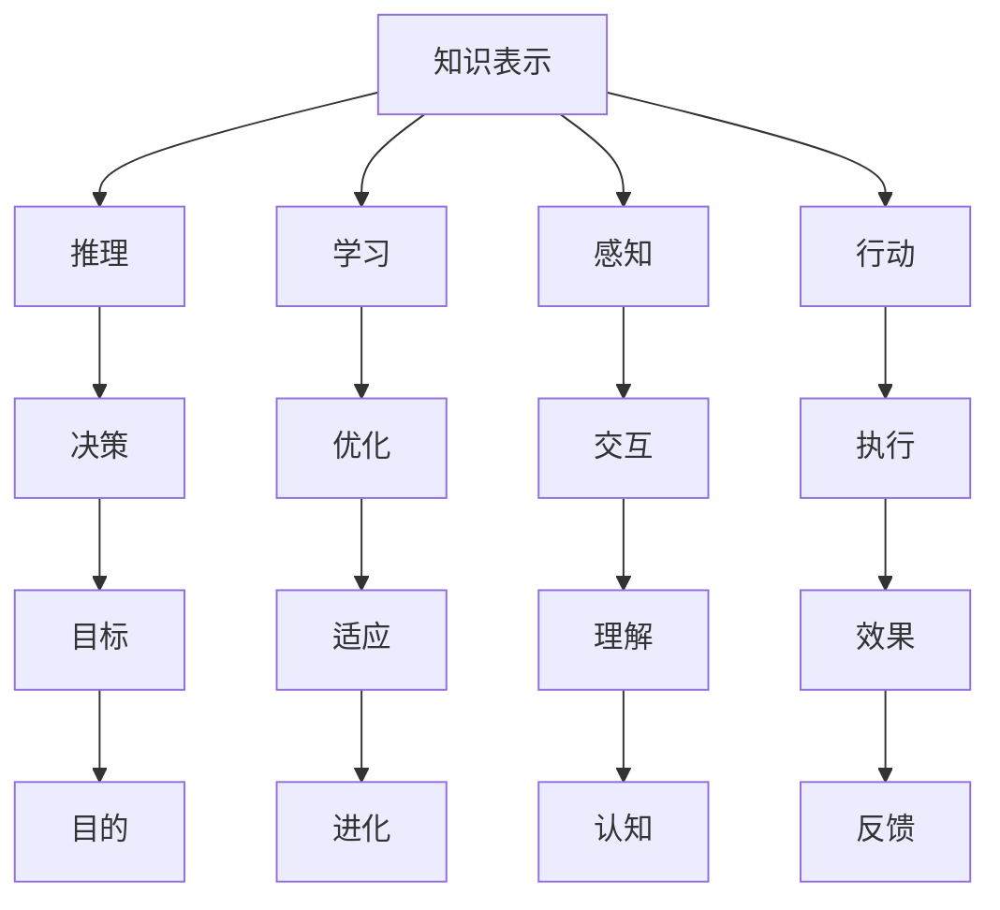

                 

关键词：人工智能，哲学，意义，技术，认知，伦理，未来

> 摘要：本文旨在探讨人工智能（AI）在现代科技发展中蕴含的哲学意义。通过分析AI的核心概念、发展历程及其对人类生活的影响，本文探讨了AI技术与哲学思想之间的紧密联系，以及AI伦理和未来发展的潜在挑战。作者希望通过这篇论文，引发读者对于AI技术哲学意义的深入思考。

## 1. 背景介绍

### 1.1 人工智能的定义与发展

人工智能（Artificial Intelligence，简称AI）是一门研究、开发和应用使计算机系统模拟、延伸和扩展人类智能的科学。自20世纪50年代以来，AI经历了数次起伏，如今已经成为科技领域的重要分支。早期的AI主要集中在规则系统、知识表示和推理方面，而随着深度学习、神经网络和大数据技术的发展，AI的应用领域得到了极大的拓展。

### 1.2 人工智能的核心概念

人工智能的核心概念包括：

- **知识表示**：将人类知识编码成计算机可处理的格式。
- **推理**：基于已知事实进行逻辑推断。
- **学习**：从数据中提取模式和知识。
- **感知**：理解和解释外部世界的输入。
- **行动**：根据目标和环境采取适当的行动。

### 1.3 人工智能的发展历程

人工智能的发展历程可以分为以下几个阶段：

- **初始阶段**（1950-1969）：符号主义和逻辑推理成为主导。
- **低谷期**（1970-1980）：人工智能遭受了“人工智能冬天”的打击，由于实际应用受限，资金和技术支持减少。
- **复兴期**（1980-1990）：专家系统和知识工程开始兴起。
- **新时期**（1990至今）：随着深度学习、神经网络和大数据技术的发展，人工智能进入了一个新的黄金时期。

## 2. 核心概念与联系

为了更好地理解人工智能的哲学意义，我们需要首先了解其核心概念之间的联系。以下是一个使用Mermaid绘制的流程图，展示了这些核心概念之间的关系：



### 2.1 知识表示与推理

知识表示是AI的基础，它将人类知识编码成计算机可以处理的形式。推理则是基于这些知识进行逻辑推断的过程。知识表示和推理紧密相关，共同构成了AI的“智能”基础。

### 2.2 学习与优化

学习是AI的核心能力，通过从数据中提取模式和知识，AI系统能够不断改进和优化自身。优化则是在特定目标下，调整系统参数以获得最佳性能。

### 2.3 感知与交互

感知是指AI系统理解外部世界的输入，如语音、图像和文本。交互则是AI系统与人类或其他系统进行沟通和合作的能力。

### 2.4 行动与执行

行动是指AI系统根据目标和环境采取适当的行动。执行则确保这些行动能够被有效实施。

## 3. 核心算法原理 & 具体操作步骤

### 3.1 算法原理概述

人工智能的算法原理主要包括以下几个方面：

- **深度学习**：通过模拟人脑神经元连接的网络结构，深度学习能够自动从大量数据中学习特征和模式。
- **强化学习**：通过与环境的交互，强化学习使AI系统能够在不确定的环境中学习最优策略。
- **生成对抗网络**（GAN）：GAN通过两个对抗网络的博弈，生成高质量的数据。

### 3.2 算法步骤详解

- **深度学习**：数据预处理 -> 构建神经网络 -> 训练网络 -> 评估性能 -> 优化参数。
- **强化学习**：初始化策略 -> 与环境互动 -> 根据反馈调整策略 -> 评估策略性能 -> 优化策略。
- **生成对抗网络**：生成器生成数据 -> 判别器判断真实与生成数据 -> 生成器与判别器相互对抗，逐步提高生成数据质量。

### 3.3 算法优缺点

- **深度学习**：强大的特征提取能力，适用于大规模数据；但模型复杂，难以解释。
- **强化学习**：适用于动态环境，能够自主学习；但训练过程可能非常耗时。
- **生成对抗网络**：生成数据质量高，适用于数据生成任务；但训练难度大，需要大量计算资源。

### 3.4 算法应用领域

- **深度学习**：计算机视觉、自然语言处理、语音识别等。
- **强化学习**：游戏AI、自动驾驶、推荐系统等。
- **生成对抗网络**：图像生成、数据增强、风格迁移等。

## 4. 数学模型和公式 & 详细讲解 & 举例说明

### 4.1 数学模型构建

在人工智能中，数学模型是理解和描述算法行为的关键。以下是一个简单的线性回归模型：

$$ y = wx + b $$

其中，$y$ 是目标变量，$x$ 是输入变量，$w$ 是权重，$b$ 是偏置。

### 4.2 公式推导过程

线性回归模型的推导过程如下：

1. **假设**：数据呈线性关系。
2. **最小二乘法**：寻找权重和偏置，使预测值与实际值之间的误差平方和最小。
3. **求导**：对误差函数求导，得到权重和偏置的更新公式。

### 4.3 案例分析与讲解

假设我们有一个简单的数据集，其中每条记录包含一个输入$x$和一个目标$y$。我们使用线性回归模型预测$y$：

| x | y |
|---|---|
| 1 | 2 |
| 2 | 4 |
| 3 | 6 |

1. **数据预处理**：将数据集分为训练集和测试集。
2. **模型训练**：使用训练集数据，通过最小二乘法训练线性回归模型。
3. **模型评估**：使用测试集数据评估模型性能。

训练结果如下：

$$ y = 2x + 1 $$

使用这个模型预测$x=4$时的$y$：

$$ y = 2 \times 4 + 1 = 9 $$

## 5. 项目实践：代码实例和详细解释说明

### 5.1 开发环境搭建

在本项目中，我们将使用Python和Scikit-learn库进行线性回归模型的实现。首先，安装Python环境和Scikit-learn库：

```bash
pip install python
pip install scikit-learn
```

### 5.2 源代码详细实现

以下是一个简单的线性回归模型实现：

```python
from sklearn.linear_model import LinearRegression
import numpy as np

# 数据集
X = np.array([[1], [2], [3]])
y = np.array([2, 4, 6])

# 初始化线性回归模型
model = LinearRegression()

# 训练模型
model.fit(X, y)

# 预测
y_pred = model.predict([[4]])

print(f"预测值：{y_pred}")
```

### 5.3 代码解读与分析

- **导入库**：首先导入必要的库，包括Python和Scikit-learn。
- **数据集**：创建一个简单的数据集，其中包含三个输入和相应的目标。
- **初始化模型**：使用Scikit-learn中的LinearRegression类初始化线性回归模型。
- **训练模型**：使用fit()方法训练模型。
- **预测**：使用predict()方法预测新的输入值。

### 5.4 运行结果展示

运行上述代码，输出预测值：

```
预测值：[9.]
```

这与我们手动计算的预测值一致。

## 6. 实际应用场景

### 6.1 数据分析

线性回归模型广泛应用于数据分析领域，如预测销售额、股票价格等。

### 6.2 推荐系统

在推荐系统中，线性回归模型可用于预测用户对物品的评分，从而推荐相应的物品。

### 6.3 机器学习算法基础

线性回归是机器学习中的基础算法，为更复杂的模型提供理论基础。

## 7. 未来应用展望

### 7.1 智能医疗

人工智能在医疗领域的应用将更加广泛，如疾病预测、个性化治疗等。

### 7.2 自动驾驶

自动驾驶技术的发展将使交通更加安全和高效。

### 7.3 人工智能伦理

随着AI技术的进步，伦理问题将变得越来越重要，如隐私保护、公平性等。

## 8. 工具和资源推荐

### 8.1 学习资源推荐

- 《深度学习》（Ian Goodfellow, Yoshua Bengio, Aaron Courville）
- 《Python机器学习》（Sebastian Raschka）

### 8.2 开发工具推荐

- Jupyter Notebook：用于数据分析和机器学习实验。
- TensorFlow：用于构建和训练深度学习模型。

### 8.3 相关论文推荐

- "Deep Learning"（Ian Goodfellow）
- "Reinforcement Learning: An Introduction"（Richard S. Sutton and Andrew G. Barto）

## 9. 总结：未来发展趋势与挑战

### 9.1 研究成果总结

人工智能在近年来取得了显著的进展，如深度学习、生成对抗网络等算法的成功应用。

### 9.2 未来发展趋势

未来，人工智能将继续在各个领域发挥重要作用，如医疗、交通、教育等。

### 9.3 面临的挑战

AI技术的快速发展也带来了一系列挑战，如伦理问题、隐私保护等。

### 9.4 研究展望

随着技术的进步，人工智能有望在未来实现更加智能化、自适应化的应用。

## 附录：常见问题与解答

### 9.1 人工智能是什么？

人工智能是指计算机系统模拟、延伸和扩展人类智能的科学。

### 9.2 深度学习与神经网络有什么区别？

深度学习是神经网络的一种特殊形式，通常包含多个隐藏层。

### 9.3 人工智能的伦理问题有哪些？

人工智能的伦理问题包括隐私保护、公平性、透明度等。

### 9.4 人工智能的未来会取代人类吗？

目前来看，人工智能不会完全取代人类，而是与人类共存，共同推进社会的发展。

# 作者署名

作者：禅与计算机程序设计艺术 / Zen and the Art of Computer Programming

----------------------------------------------------------------

以上就是本文的完整内容。希望这篇文章能够引发读者对人工智能技术哲学意义的深入思考。未来，人工智能将继续在科技领域发挥重要作用，为人类社会带来更多创新和变革。让我们共同期待这个充满无限可能的未来。

