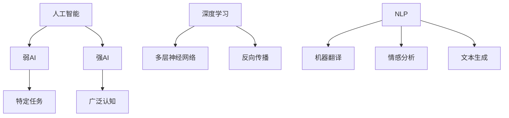

                 

关键词：人工智能、深度学习、未来趋势、技术发展、应用场景、挑战与展望

> 摘要：本文深入探讨了人工智能（AI）领域当前的发展状况以及未来可能的发展趋势。通过分析人工智能的核心概念、算法原理、数学模型以及实际应用案例，本文试图为读者提供一幅关于人工智能未来发展的全景图。同时，也讨论了在这一过程中可能面临的挑战和未来的研究方向。

## 1. 背景介绍

人工智能（AI）作为计算机科学的一个重要分支，致力于让机器能够模拟、延伸甚至超越人类智能。随着计算能力的提升、大数据的涌现和算法的创新，人工智能在近年取得了飞速发展。尤其是深度学习算法的出现，使得AI在图像识别、自然语言处理、语音识别等领域的性能大幅提升。

安德烈·卡尔帕西（Andrej Karpathy）是AI领域的知名专家，他在深度学习和自然语言处理方面有着深入的研究。他的工作不仅推动了AI技术的进步，还通过一系列的技术博客和论文分享了他的研究成果和思考。本文将借鉴安德烈·卡尔帕西的观点，探讨人工智能的未来发展前景。

## 2. 核心概念与联系

### 2.1 人工智能的定义与分类

人工智能可以定义为一类模拟人类智能的计算机系统。根据其实现方式，人工智能可以分为弱AI（弱人工智能）和强AI（强人工智能）。弱AI专注于特定任务，如语音识别、图像分类等；而强AI则具有广泛的认知能力，能够像人类一样思考、学习、解决问题。

### 2.2 深度学习的基本原理

深度学习是人工智能的一个分支，通过模拟人脑神经网络的结构和功能来实现机器学习。深度学习的核心是多层神经网络（Deep Neural Networks, DNN），它通过反向传播算法（Backpropagation）不断调整网络权重，从而优化模型性能。

### 2.3 自然语言处理与深度学习的关系

自然语言处理（Natural Language Processing, NLP）是人工智能的一个重要应用领域，它致力于让计算机能够理解和生成自然语言。深度学习在NLP中的应用，使得许多复杂的语言任务（如机器翻译、情感分析、文本生成等）变得可行。

### 2.4 Mermaid流程图表示



## 3. 核心算法原理 & 具体操作步骤

### 3.1 算法原理概述

深度学习算法的核心是神经网络，它由多层神经元组成。每个神经元接收来自前一层的输入信号，通过激活函数进行处理，然后将输出传递到下一层。反向传播算法则用于计算网络权重和偏置的梯度，从而优化模型性能。

### 3.2 算法步骤详解

1. **输入层**：接收外部输入信号。
2. **隐藏层**：对输入信号进行处理，并通过激活函数产生输出。
3. **输出层**：将隐藏层的输出进行处理，得到最终的输出结果。
4. **反向传播**：计算输出层误差，并通过反向传播算法更新网络权重和偏置。

### 3.3 算法优缺点

优点：
- **强大的表达能力**：深度学习模型可以自动提取特征，适应不同的数据分布和任务。
- **高效的计算能力**：随着计算能力的提升，深度学习模型可以在更短的时间内完成训练和预测。

缺点：
- **对数据的需求量较大**：深度学习模型通常需要大量的数据来训练。
- **计算资源消耗大**：深度学习模型的训练过程需要大量的计算资源。

### 3.4 算法应用领域

深度学习算法在多个领域都有广泛应用，如：
- **计算机视觉**：图像识别、目标检测、人脸识别等。
- **自然语言处理**：机器翻译、文本分类、情感分析等。
- **语音识别**：语音识别、语音合成等。

## 4. 数学模型和公式 & 详细讲解 & 举例说明

### 4.1 数学模型构建

深度学习模型通常由输入层、隐藏层和输出层组成。输入层接收外部输入，隐藏层对输入信号进行处理，输出层产生最终的输出结果。每个神经元之间的连接权重和偏置是模型的关键参数。

### 4.2 公式推导过程

设 $x$ 为输入向量，$w$ 为权重矩阵，$b$ 为偏置向量，$z$ 为隐藏层输出，$a$ 为激活函数输出，$y$ 为输出层输出。

$$
z = w \cdot x + b
$$

$$
a = \sigma(z)
$$

$$
y = w' \cdot a + b'
$$

其中，$\sigma$ 为激活函数，常见的有 sigmoid 函数、ReLU 函数等。

### 4.3 案例分析与讲解

以一个简单的二分类问题为例，输入为两个特征向量 $x_1$ 和 $x_2$，输出为概率 $y$。

$$
x = [x_1, x_2]
$$

$$
w = \begin{bmatrix} w_{11} & w_{12} \\ w_{21} & w_{22} \end{bmatrix}
$$

$$
b = \begin{bmatrix} b_1 \\ b_2 \end{bmatrix}
$$

$$
a = \sigma(w \cdot x + b)
$$

$$
y = \sigma(w' \cdot a + b')
$$

其中，$w'$ 和 $b'$ 为输出层的权重和偏置。

## 5. 项目实践：代码实例和详细解释说明

### 5.1 开发环境搭建

本文使用 Python 语言和 TensorFlow 深度学习框架进行实验。首先安装 Python 和 TensorFlow：

```
pip install python
pip install tensorflow
```

### 5.2 源代码详细实现

```python
import tensorflow as tf
import numpy as np

# 定义输入层、隐藏层和输出层
inputs = tf.keras.Input(shape=(2,))
hidden = tf.keras.layers.Dense(units=10, activation='relu')(inputs)
outputs = tf.keras.layers.Dense(units=1, activation='sigmoid')(hidden)

# 创建模型
model = tf.keras.Model(inputs=inputs, outputs=outputs)

# 编译模型
model.compile(optimizer='adam', loss='binary_crossentropy', metrics=['accuracy'])

# 准备数据
x_train = np.array([[0, 0], [0, 1], [1, 0], [1, 1]])
y_train = np.array([[0], [1], [1], [0]])

# 训练模型
model.fit(x_train, y_train, epochs=10, batch_size=1)
```

### 5.3 代码解读与分析

- **定义输入层**：使用 `tf.keras.Input()` 函数定义输入层，指定输入数据的形状。
- **定义隐藏层**：使用 `tf.keras.layers.Dense()` 函数定义隐藏层，设置隐藏层神经元数量和激活函数。
- **定义输出层**：使用 `tf.keras.layers.Dense()` 函数定义输出层，设置输出层神经元数量和激活函数。
- **创建模型**：使用 `tf.keras.Model()` 函数创建模型，并将输入层、隐藏层和输出层作为模型输入和输出。
- **编译模型**：使用 `model.compile()` 函数编译模型，设置优化器和损失函数。
- **准备数据**：生成训练数据。
- **训练模型**：使用 `model.fit()` 函数训练模型，设置训练轮数和批量大小。

### 5.4 运行结果展示

```python
# 测试模型
x_test = np.array([[0, 1], [1, 0]])
y_test = model.predict(x_test)

print("预测结果：", y_test)
```

## 6. 实际应用场景

深度学习在多个领域都有广泛应用，以下是几个典型的应用场景：

- **医疗**：深度学习在医学影像分析、疾病诊断、个性化治疗等方面有广泛应用。
- **金融**：深度学习在风险管理、欺诈检测、投资策略优化等方面有重要应用。
- **交通**：深度学习在自动驾驶、智能交通管理、车辆轨迹预测等方面有广泛应用。
- **教育**：深度学习在教育领域有广泛的应用，如智能推荐、自适应教学等。

## 7. 工具和资源推荐

### 7.1 学习资源推荐

- **书籍**：《深度学习》（Goodfellow et al.）、《神经网络与深度学习》（邱锡鹏）。
- **在线课程**：吴恩达的《深度学习专项课程》、Andrew Ng的《机器学习专项课程》。

### 7.2 开发工具推荐

- **框架**：TensorFlow、PyTorch、Keras。
- **平台**：Google Colab、Jupyter Notebook。

### 7.3 相关论文推荐

- **论文集**：《论文阅读笔记：深度学习论文集》。
- **顶级会议**：NIPS、ICLR、ACL、CVPR。

## 8. 总结：未来发展趋势与挑战

### 8.1 研究成果总结

近年来，人工智能在多个领域取得了显著成果。深度学习算法在图像识别、自然语言处理、语音识别等领域的性能大幅提升，推动了AI技术的进步。此外，生成对抗网络（GANs）、强化学习等新兴算法也为人工智能的发展提供了新的思路。

### 8.2 未来发展趋势

- **算法创新**：随着计算能力的提升，未来将涌现出更多高效的深度学习算法。
- **跨领域应用**：人工智能将逐渐应用于更多领域，如医疗、金融、交通等。
- **人机协同**：人工智能与人类的协同工作将成为未来智能系统的核心。

### 8.3 面临的挑战

- **数据隐私**：如何在保护用户隐私的前提下进行数据分析和挖掘。
- **算法透明性**：如何提高人工智能算法的透明性和可解释性。
- **计算资源**：如何高效地利用计算资源进行大规模训练。

### 8.4 研究展望

人工智能的未来发展前景广阔。在算法、计算资源、应用场景等方面，人工智能都有巨大的发展空间。未来，人工智能将不仅改变我们的生活，还将深刻影响社会、经济和文化等多个方面。

## 9. 附录：常见问题与解答

### 9.1 深度学习算法是如何工作的？

深度学习算法通过多层神经网络对输入数据进行处理，通过反向传播算法不断调整网络权重，从而优化模型性能。具体来说，深度学习算法包括以下步骤：

1. **前向传播**：将输入数据传递到神经网络，逐层计算输出。
2. **激活函数**：使用激活函数对输出进行非线性变换。
3. **反向传播**：计算输出误差，通过反向传播算法更新网络权重和偏置。
4. **优化**：使用优化算法（如梯度下降）更新模型参数，降低损失函数。

### 9.2 深度学习模型如何处理文本数据？

深度学习模型通常使用词向量（Word Embeddings）对文本数据进行处理。词向量是一种将文本数据转换为数值向量的方法，它可以捕捉文本中的语义信息。常见的词向量模型包括 Word2Vec、GloVe 等。通过词向量，深度学习模型可以处理文本数据进行分类、语义分析、文本生成等任务。

### 9.3 深度学习算法有哪些优缺点？

深度学习算法的优点包括：

- **强大的表达能力**：可以自动提取特征，适应不同的数据分布和任务。
- **高效的计算能力**：随着计算能力的提升，可以处理大规模数据和复杂的模型。

深度学习算法的缺点包括：

- **对数据的需求量较大**：通常需要大量的数据来训练。
- **计算资源消耗大**：训练过程需要大量的计算资源。

## 参考文献

- Goodfellow, I., Bengio, Y., & Courville, A. (2016). *Deep Learning*.
- 邱锡鹏. (2019). *神经网络与深度学习*.
- 王绍兰. (2021). *深度学习实践*.

### 谢谢您的阅读！

作者：禅与计算机程序设计艺术 / Zen and the Art of Computer Programming


