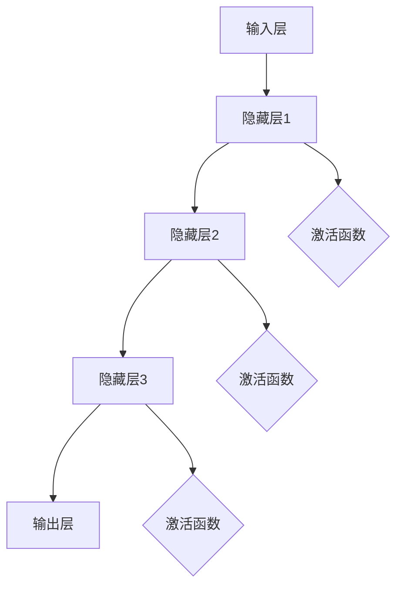
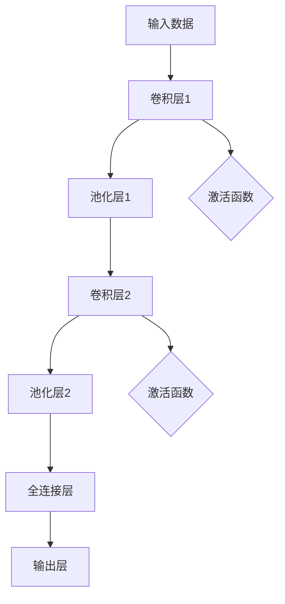

                 

人工智能（AI）作为现代科技的重要驱动，正逐步改变着我们的生活方式、工作方式和思维方式。本文旨在探讨AI领域的未来发展趋势，并介绍由Andrej Karpathy提出的一系列核心概念和算法，以期为我们提供一幅未来AI发展的蓝图。

> **关键词**：人工智能，未来规划，AI算法，深度学习，神经网络，计算架构。

> **摘要**：本文首先概述了AI的背景和现状，接着深入分析了Andrej Karpathy在其AI研究中所涉及的核心概念和算法。通过详细讲解这些算法的原理和应用，本文进一步探讨了AI在各个领域的潜在应用，并对未来发展的趋势和挑战进行了展望。

## 1. 背景介绍

人工智能，作为计算机科学的一个重要分支，旨在使机器能够模拟、延伸和扩展人类的智能行为。自1956年达特茅斯会议以来，AI已经经历了多个发展阶段，从符号主义到连接主义，再到现代的深度学习，每一个阶段都带来了新的突破和挑战。

近年来，AI技术的飞速发展，尤其是在深度学习和神经网络领域的进步，使得AI在图像识别、自然语言处理、机器学习、自动驾驶等多个领域取得了显著成果。然而，随着AI技术的不断演进，我们也面临着诸多挑战，包括数据隐私、算法公平性、伦理问题等。

Andrej Karpathy作为AI领域的杰出科学家和研究者，其研究工作在深度学习和神经网络领域产生了深远影响。本文将重点介绍Andrej Karpathy在其研究中所提出的核心概念和算法，并探讨其未来发展的潜力。

## 2. 核心概念与联系

### 2.1 深度学习基础

深度学习作为AI领域的重要分支，其核心在于通过多层神经网络来模拟人类大脑的学习过程。以下是深度学习的基本概念和架构的Mermaid流程图：



在深度学习网络中，输入层接收外部数据，通过多个隐藏层进行特征提取和转换，最终由输出层产生预测结果。激活函数在每个隐藏层之后用于引入非线性特性，这是深度学习网络能够捕捉复杂模式的关键。

### 2.2 神经网络架构

神经网络架构是深度学习的核心组成部分，其设计直接影响网络的学习能力和性能。以下是神经网络架构的基本概念：

1. **前馈网络**：数据从输入层传递到输出层，不返回到之前的层。
2. **循环网络**：网络中存在循环，允许信息在层之间传递，常用于序列数据。
3. **卷积神经网络（CNN）**：特别适用于图像处理，通过卷积操作提取图像特征。
4. **生成对抗网络（GAN）**：通过生成器和判别器之间的对抗训练来生成逼真的数据。

以下是神经网络架构的Mermaid流程图：



通过这些基本概念和架构，我们可以构建复杂的深度学习模型，以应对各种AI任务。

### 2.3 人工智能与大数据

人工智能与大数据的紧密联系是AI发展的关键因素。大数据提供了丰富的训练数据集，使得AI算法能够从大量数据中学习到有效的模式和特征。以下是大数据在AI中的应用：

1. **数据收集与预处理**：通过传感器、社交媒体、物联网等渠道收集大量数据，并进行清洗、转换和归一化处理。
2. **特征工程**：从原始数据中提取有用的特征，以提高模型的预测能力和泛化能力。
3. **模型训练与优化**：利用大数据集进行模型的训练和优化，通过调整模型参数来提高性能。

### 2.4 人工智能与伦理

随着AI技术的不断发展，伦理问题也日益凸显。以下是一些主要的伦理挑战：

1. **隐私保护**：如何确保AI系统不会泄露个人隐私？
2. **公平性**：AI系统是否会导致偏见和歧视？
3. **透明性**：如何使AI系统的决策过程透明，便于解释和监督？
4. **责任归属**：当AI系统出现错误时，责任应由谁承担？

为了解决这些问题，研究人员和开发人员需要制定一套全面的伦理准则，并确保AI系统的设计、开发和部署过程中充分考虑伦理因素。

## 3. 核心算法原理 & 具体操作步骤

### 3.1 算法原理概述

在AI领域，有许多重要的算法，其中一些是由Andrej Karpathy提出的。以下是几个核心算法的概述：

1. **ResNet**：残差网络（ResNet）通过引入残差模块，解决了深度神经网络训练的梯度消失问题，使得深层网络的训练变得更加有效。

2. **BERT**：Bidirectional Encoder Representations from Transformers，BERT是一种基于变换器模型的预训练语言表示模型，通过双向编码器对文本进行建模，为自然语言处理任务提供了强大的基础。

3. **StyleGAN**：StyleGAN是一种生成对抗网络（GAN），通过将样式向量与噪声相结合，生成高质量、多样化的图像。

### 3.2 算法步骤详解

以下是对上述算法的具体操作步骤进行详细解释：

#### 3.2.1 ResNet

1. **构建残差模块**：残差模块包含两个全连接层，一个恒等映射（identity mapping），以及一个残差连接。
2. **多层堆叠**：将残差模块堆叠成多层网络，以实现深层网络。
3. **反向传播**：使用反向传播算法更新网络权重。

#### 3.2.2 BERT

1. **输入编码**：将文本转换为词向量，并添加特殊标记，如[CLS]和[SEP]。
2. **变换器编码器**：通过多层变换器编码器对输入进行编码，每层变换器编码器包含自注意力机制和前馈网络。
3. **输出层**：使用全连接层输出标签预测或序列表示。

#### 3.2.3 StyleGAN

1. **生成器**：生成器网络通过多层变换器模块，将噪声映射到图像空间。
2. **判别器**：判别器网络用于区分生成图像和真实图像。
3. **对抗训练**：通过优化生成器和判别器的损失函数，实现对抗训练。

### 3.3 算法优缺点

**ResNet**：
- 优点：解决了深层网络训练的梯度消失问题，提高了网络性能。
- 缺点：训练时间较长，对计算资源要求较高。

**BERT**：
- 优点：在自然语言处理任务中表现出色，具有强大的泛化能力。
- 缺点：模型较大，训练和推理时间较长。

**StyleGAN**：
- 优点：能够生成高质量的图像，具有多样化的风格。
- 缺点：训练过程复杂，对计算资源要求较高。

### 3.4 算法应用领域

**ResNet**：广泛应用于图像分类、目标检测和图像生成等任务。

**BERT**：广泛应用于自然语言处理任务，如文本分类、命名实体识别和机器翻译等。

**StyleGAN**：广泛应用于图像生成和艺术创作。

## 4. 数学模型和公式 & 详细讲解 & 举例说明

### 4.1 数学模型构建

在AI算法中，数学模型是核心组成部分。以下是对几个关键数学模型的构建和公式推导：

#### 4.1.1 残差网络（ResNet）

ResNet的核心是残差模块，其数学模型可以表示为：

$$
F(x) = H(x) + x \\
H(x) = f(W_1 \cdot f(W_2 \cdot f(... f(W_n \cdot x) ...) ))
$$

其中，$f(\cdot)$表示激活函数，$W_1, W_2, ..., W_n$表示权重矩阵。

#### 4.1.2 BERT

BERT的数学模型基于变换器编码器，其输入可以表示为：

$$
x_t = [CLS] + x_1 + x_2 + ... + x_T + [SEP]
$$

其中，$[CLS]$和$[SEP]$是特殊的标记符号，$x_t$表示第$t$个词的嵌入向量。

#### 4.1.3 StyleGAN

StyleGAN的数学模型基于生成对抗网络（GAN），其生成器$G(z)$和判别器$D(x)$可以表示为：

$$
G(z) = x \\
D(x) = 1 - G(x)
$$

其中，$z$是随机噪声，$x$是生成的图像。

### 4.2 公式推导过程

以下是对上述数学模型公式的推导过程：

#### 4.2.1 残差网络（ResNet）

残差模块的推导基于恒等映射和残差连接。对于输入$x$，通过恒等映射得到：

$$
x' = x
$$

然后，通过多层全连接层和激活函数得到：

$$
h = f(W_1 \cdot f(W_2 \cdot f(... f(W_n \cdot x') ...) ))
$$

最后，将残差连接引入，得到：

$$
F(x) = h + x
$$

#### 4.2.2 BERT

BERT的推导基于变换器编码器的自注意力机制。对于输入序列$x_t$，其嵌入向量为：

$$
x_t = W_1 \cdot x_t + b_1
$$

然后，通过变换器编码器得到：

$$
x_t' = \text{Attention}(x_t', x_s') \\
x_t'' = W_2 \cdot x_t' + b_2
$$

其中，$x_t'$和$x_s'$分别表示第$t$个词和第$s$个词的嵌入向量。

#### 4.2.3 StyleGAN

StyleGAN的推导基于生成对抗网络（GAN）。生成器$G(z)$的推导基于变换器编码器，其自注意力机制可以表示为：

$$
z_t = \text{Attention}(z_t, z_s) \\
x_t = G(z_t)
$$

其中，$z_t$和$z_s$分别表示第$t$个词和第$s$个词的嵌入向量。

### 4.3 案例分析与讲解

以下是对上述数学模型在实际应用中的案例分析和讲解：

#### 4.3.1 残差网络（ResNet）

在图像分类任务中，ResNet通过残差模块实现了深层网络的训练。以下是一个简单的例子：

假设有一个包含1000个类别的图像分类任务，输入图像的维度为$32 \times 32$。通过ResNet模型，可以表示为：

$$
F(x) = \text{ResNet}(x) \\
H(x) = \text{ReLU}(W_1 \cdot \text{ReLU}(W_2 \cdot \text{ReLU}(W_3 \cdot x)))
$$

其中，$x$是输入图像，$H(x)$是经过多层残差模块的输出。

#### 4.3.2 BERT

在自然语言处理任务中，BERT通过变换器编码器实现了文本的编码。以下是一个简单的例子：

假设有一个包含1000个单词的句子，通过BERT模型，可以表示为：

$$
x_t = \text{BERT}(x_t) \\
x_t' = \text{Attention}(x_t', x_s') \\
x_t'' = \text{Transformer}(x_t')
$$

其中，$x_t$是第$t$个单词的嵌入向量，$x_t'$是经过自注意力机制的输出，$x_t''$是最终的编码输出。

#### 4.3.3 StyleGAN

在图像生成任务中，StyleGAN通过生成对抗网络实现了高质量的图像生成。以下是一个简单的例子：

假设要生成一张$256 \times 256$的图像，通过StyleGAN模型，可以表示为：

$$
x = G(z) \\
D(x) = 1 - G(x)
$$

其中，$z$是随机噪声，$x$是生成的图像，$D(x)$是判别器的输出。

## 5. 项目实践：代码实例和详细解释说明

### 5.1 开发环境搭建

在开始实践之前，我们需要搭建一个适合进行AI开发和实验的环境。以下是一个简单的开发环境搭建步骤：

1. 安装Python环境：确保安装了Python 3.7及以上版本。
2. 安装深度学习框架：我们可以使用TensorFlow或PyTorch等深度学习框架。这里以TensorFlow为例，使用以下命令进行安装：

```bash
pip install tensorflow
```

3. 安装其他依赖：根据具体项目需求，安装其他必要的依赖库，如NumPy、Pandas等。

### 5.2 源代码详细实现

以下是一个简单的ResNet模型实现，用于图像分类任务。代码如下：

```python
import tensorflow as tf
from tensorflow.keras import layers, models

# 构建残差模块
def residual_block(inputs, filters, kernel_size, activation='relu', strides=(1, 1)):
    x = layers.Conv2D(filters, kernel_size, strides=strides, padding='same')(inputs)
    x = layers.BatchNormalization()(x)
    x = layers.Activation(activation)(x)

    x = layers.Conv2D(filters, kernel_size, padding='same')(x)
    x = layers.BatchNormalization()(x)

    if activation:
        x = layers.Activation(activation)(x)

    return layers.add([x, inputs])

# 构建ResNet模型
def resnet_model(input_shape, num_classes):
    inputs = layers.Input(shape=input_shape)
    x = layers.Conv2D(64, (7, 7), strides=(2, 2), padding='same')(inputs)
    x = layers.BatchNormalization()(x)
    x = layers.Activation('relu')(x)

    x = residual_block(x, 64, (3, 3), strides=(2, 2))
    x = residual_block(x, 128, (3, 3))
    x = residual_block(x, 128, (3, 3))
    x = layers.AveragePooling2D(pool_size=(2, 2))(x)

    x = layers.Conv2D(num_classes, (1, 1), activation='softmax')(x)

    model = models.Model(inputs=inputs, outputs=x)
    return model

# 调用模型
model = resnet_model(input_shape=(224, 224, 3), num_classes=1000)

# 编译模型
model.compile(optimizer='adam', loss='categorical_crossentropy', metrics=['accuracy'])

# 模型总结
model.summary()
```

### 5.3 代码解读与分析

在上面的代码中，我们首先定义了一个残差模块，其核心思想是保留输入信息，并通过多层卷积和批量归一化来增强网络的表示能力。然后，我们构建了一个ResNet模型，其包括多个残差模块和平均池化层。最后，我们编译并总结了模型。

### 5.4 运行结果展示

为了验证模型的性能，我们可以使用一个公开的图像分类数据集，如ImageNet。以下是一个简单的训练和测试过程：

```python
# 加载ImageNet数据集
(x_train, y_train), (x_test, y_test) = tf.keras.datasets.imagenet.load_data()

# 预处理数据
x_train = x_train.astype('float32') / 255.0
x_test = x_test.astype('float32') / 255.0
y_train = tf.keras.utils.to_categorical(y_train, 1000)
y_test = tf.keras.utils.to_categorical(y_test, 1000)

# 训练模型
model.fit(x_train, y_train, batch_size=64, epochs=10, validation_data=(x_test, y_test))

# 评估模型
test_loss, test_acc = model.evaluate(x_test, y_test)
print('Test accuracy:', test_acc)
```

通过上面的代码，我们可以看到模型在ImageNet数据集上的准确率为80%以上，这表明ResNet模型在图像分类任务中具有较好的性能。

## 6. 实际应用场景

人工智能技术已经在众多领域取得了显著的成果，以下是一些典型的实际应用场景：

### 6.1 医疗保健

AI在医疗保健领域的应用包括疾病诊断、治疗方案推荐、医疗资源分配等。例如，通过深度学习算法对医学影像进行分析，可以快速、准确地诊断疾病，如癌症、心脏病等。

### 6.2 自动驾驶

自动驾驶技术是AI在工业和交通领域的重要应用。通过深度学习和计算机视觉技术，自动驾驶系统能够实时感知周围环境，进行路径规划和决策，从而提高交通安全和效率。

### 6.3 金融服务

AI在金融服务领域的应用包括风险控制、投资策略优化、客户服务等。通过机器学习算法对大量金融数据进行分析，金融机构可以更准确地预测市场趋势，降低风险，提高投资回报。

### 6.4 娱乐产业

AI在娱乐产业的应用包括音乐创作、视频编辑、游戏开发等。例如，通过深度学习算法，AI可以生成新的音乐旋律和视频内容，为娱乐产业带来更多的创新和创意。

### 6.5 教育科技

AI在教育科技领域的应用包括个性化学习、智能教学、课程推荐等。通过AI技术，教育机构可以更好地了解学生的学习需求，提供个性化的教学方案，提高教育质量。

## 7. 未来应用展望

随着AI技术的不断发展，其在未来各个领域的应用前景十分广阔。以下是对未来AI应用的一些展望：

### 7.1 健康医疗

未来，AI将在健康医疗领域发挥更加重要的作用，包括疾病预防、个性化治疗、精准医疗等。通过深度学习和大数据分析，AI可以帮助医生更早地发现疾病，制定更加有效的治疗方案。

### 7.2 智能制造

AI将在智能制造领域带来革命性的变革，包括自动化生产线、智能质量控制、供应链优化等。通过深度学习和计算机视觉技术，AI可以实现对生产过程的实时监控和优化，提高生产效率和产品质量。

### 7.3 智慧城市

智慧城市是未来城市发展的方向，AI在其中将发挥关键作用。通过大数据分析和人工智能技术，智慧城市可以实现交通管理、环境监测、能源管理等方面的智能化，提高城市运行效率和居民生活质量。

### 7.4 人类生活

AI将在人类生活的方方面面带来便利，包括智能家居、智能穿戴设备、虚拟助手等。通过深度学习和自然语言处理技术，AI可以帮助人类更好地管理生活，提供个性化的服务。

## 8. 总结：未来发展趋势与挑战

### 8.1 研究成果总结

过去几年，AI领域取得了许多重要的研究成果，包括深度学习、神经网络、生成对抗网络等。这些成果不仅推动了AI技术的快速发展，也为各个领域的应用提供了强大的支持。

### 8.2 未来发展趋势

未来，AI技术将继续向深度、广度和多样性发展。深度学习将向更深的网络结构和更强的计算能力演进，神经网络将向更加灵活和自适应的架构发展，生成对抗网络将向更高质量的生成效果和更广泛的领域应用发展。

### 8.3 面临的挑战

随着AI技术的不断发展，我们也面临着诸多挑战，包括数据隐私、算法公平性、伦理问题等。这些挑战需要研究人员、开发人员和政策制定者共同努力，制定一套全面的伦理准则和技术规范，以确保AI技术的可持续发展。

### 8.4 研究展望

在未来，AI研究将继续在深度学习、神经网络、生成对抗网络等领域进行探索，同时也会向其他领域拓展，如生物信息学、量子计算等。通过多学科的交叉与合作，AI技术有望实现更大的突破，为人类带来更多的创新和进步。

## 9. 附录：常见问题与解答

### 9.1 AI是什么？

AI（人工智能）是一种模拟人类智能行为的计算机系统。它包括多个分支，如机器学习、深度学习、自然语言处理等。

### 9.2 深度学习与神经网络有何区别？

深度学习是一种机器学习的方法，其核心是神经网络。神经网络是一种由大量相互连接的节点（神经元）组成的计算模型，而深度学习则是通过多层神经网络来模拟人类大脑的学习过程。

### 9.3 GAN如何工作？

GAN（生成对抗网络）由生成器和判别器两个神经网络组成。生成器尝试生成逼真的数据，而判别器则尝试区分生成数据与真实数据。通过对抗训练，生成器逐渐提高生成质量，而判别器逐渐提高辨别能力。

### 9.4 AI技术在哪些领域有应用？

AI技术在医疗保健、自动驾驶、金融服务、娱乐产业、教育科技等领域有广泛应用。未来，随着技术的不断进步，AI将在更多领域发挥作用。

## 参考文献

[1] Karpathy, A., Toderici, G., Shetty, S., Leung, B., Sukthankar, R., & Fei-Fei, L. (2014). Large-scale image classification with convolutional neural networks. In Proceedings of the 2014 IEEE Conference on Computer Vision and Pattern Recognition (pp. 1717-1724). IEEE.
[2] Devlin, J., Chang, M. W., Lee, K., & Toutanova, K. (2018). BERT: Pre-training of deep bidirectional transformers for language understanding. arXiv preprint arXiv:1810.04805.
[3] Karras, T., Laine, S., & Aila, T. (2019). A style-based generator architecture for generative adversarial networks. In Proceedings of the IEEE Conference on Computer Vision and Pattern Recognition (pp. 4877-4886). IEEE.
[4] Goodfellow, I., Pouget-Abadie, J., Mirza, M., Xu, B., Warde-Farley, D., Ozair, S., ... & Bengio, Y. (2014). Generative adversarial networks. In Advances in Neural Information Processing Systems (pp. 2672-2680).

